The corpus is the acceptance test of the redesign. It is 249 JSON files under `tests/corpus/cases/`,
each one a statement about what a set of source rows MEANS: which of them describe one work, which
describe different works, which holds which, which two rows are one broadcast episode, and how many
episode rows the result may draw. A case names no function and imports nothing from `src/`, so the
union-find store of today and the graph of [the representation](/design/representation/) are run
against exactly the same answers by writing one adapter (`tests/corpus/run.ts:41-63`).

It exists because the store is being replaced and the four suites that hold the expensive answers all
die with it: each drives `upsertMedia`, `aggregateMedia` and `resetStore` directly. The corpus is
those answers, lifted off the implementation that happened to carry them, plus a whole season of new
ones. It is the test surface [9.3](/design/representation/#93-the-new-test-surface) asks for, in the
one form that survives the migration.

## The rule, which is the whole point

An expected answer NEVER comes from running an implementation. `merge-fixtures.ts:11-17` states it and
the corpus inherits it verbatim:

> THE EXPECTED ANSWERS DO NOT COME FROM THE IMPLEMENTATION, and that is the whole point. If these
> were recorded by running the store and writing down what it did, the file would pin today's
> behaviour including today's bugs and go green forever. The Mushoku Tensei defect fixed in 50cea84
> would have been captured as correct. Every `together` and `apart` below is a claim about the WORKS,
> decided from what the shows are, with the reason written beside it. When the implementation
> disagrees with one of these, the implementation is what is wrong until someone argues otherwise
> here, in the `why`.

Two things follow. Every case carries `why` in terms of the works, never in terms of a mechanism: a
year bucket is a store and the next store will not have one. And both directions are required, because
a corpus that only says what must merge is passed by something that merges everything;
`validateCase` refuses a file that asserts neither (`tests/corpus/types.ts:470`).

## The pipeline

```mermaid
flowchart TD
  WALK["npm run corpus:walk<br/><small>one page load per run, with graph=1 and export=answers</small>"]
  DUMP[("corpus/season/summer-2026<br/><small>answers.jsonl and manifest.json, gitignored</small>")]
  SRV["npm run corpus:label<br/><small>a local server over the dump, read only</small>"]
  API["the JSON API<br/><small>runs, a compact run view, and a case skeleton</small>"]
  LAB["the labeller<br/><small>one agent reads a run and marks its relations</small>"]
  REF["the refuter<br/><small>a second agent attacks every mark</small>"]
  AGREE{"did the two settle the row?<br/><small>a mark upheld, or a row neither can settle</small>"}
  POST["POST /api/cases/:slug<br/><small>strips raw from every row, then validateCase</small>"]
  REVIEW[("review.jsonl<br/><small>one line per run, latest wins</small>")]
  CASES[("tests/corpus/cases<br/><small>249 files, no function named, nothing from src/</small>")]
  RUN["runCorpus(store)<br/><small>every case twice, file order and reversed</small>"]
  STORE["any store, through CorpusStore<br/><small>reset, upsert, clusters, episodesOf, containersOf, includesOf, episodePairsOf</small>"]
  PEND["printed as a waiting list, not failed<br/><small>together and apart still assert</small>"]
  KNOWN{"is this case a known disagreement of this store?<br/><small>known[slug], from known-disagreements.json</small>"}
  PERSIST["the disagreement must PERSIST<br/><small>a fix, a regression and a stale entry are all red</small>"]
  PASS["every expectation must pass<br/><small>and both arrival orders must agree</small>"]

  WALK -->|"223 runs of 2026-SUMMER, 8,556 answers"| DUMP
  DUMP -->|"re-read whenever the walk appends to it"| SRV
  SRV --> API
  API -->|"about 12 kB per run, compact"| LAB
  LAB -->|"a mark per relation, each naming its fields"| REF
  REF --> AGREE
  AGREE -->|"settled: stamped checked.by agent:opus:label+refute"| POST
  AGREE -->|"unknown is a state, so the human decides"| REVIEW
  REVIEW -->|"resolved by hand, then DELETE /api/review/:slug"| POST
  POST -->|"a case that does not validate is refused and nothing is written"| CASES
  CASES --> RUN
  RUN -->|"pending: new store, on 215 of the 249"| PEND
  RUN --> STORE
  STORE -->|"who ended up with whom, what holds what, which rows are one episode"| KNOWN
  KNOWN -->|"listed, with a reason"| PERSIST
  KNOWN -->|"not listed"| PASS

  classDef irrev fill:#b03f33,stroke:#e0796f,color:#ffffff
  classDef ratchet fill:#8f5a0e,stroke:#f2b45c,color:#ffffff
  classDef view fill:#4572b5,stroke:#8db0de,color:#ffffff
  classDef refuse fill:#46464b,stroke:#8b8c93,color:#f2f2f4
  class POST ratchet
  class PASS,PERSIST view
  class PEND refuse
```

*Sun on the save because it is a one way door: `raw` is stripped on the way in and only the dump keeps it. The verdicts are blue because the harness writes nothing at all.*

`raw` is the source's answer as recorded. Stripping it is what keeps a case a few kB of decisions
instead of 90 kB of recorded answers: run 0's raw answers are 77,129 bytes against 2,885 bytes of
store-shaped fields, so a season of 223 would be 20 MB of git history for something already on disk
(`scripts/label-corpus.mjs:77-82`). The join back is `source.answers`, which names the `key` of every
answer row the case was built from, and `answers.jsonl` is deduped on `key`.

## The case format

Validated by `validateCase` (`tests/corpus/types.ts:339`), which rejects unknown keys at each of the
seven places one can be typed rather than ignoring them: a typo in an expectation key is a case that
asserts nothing.

| field | what it asserts | the store concept | `checked` |
| --- | --- | --- | --- |
| `name` | free text, printed on every failure | none | |
| `source.file`, `source.test` | where it was extracted from: a suite and its test, or the dump and the run's aggregated uri | none | |
| `source.answers` | the `key` of every answer row the case was built from, so the raw evidence is re-findable | the `Answer` log | |
| `why` | why this answer is right, in terms of the works. Not optional | none | |
| `rows[]` | the store-shaped row a source published: uri, origin, id, type, categories, titles, startDate, episodeCount, score | one source's `Media` row | |
| `rows[].scope` | `RUN` or `CONTAINER`. Absent means RUN, the schema's default | the identity space a sameness unions in | |
| `rows[].raw` | the source's answer as recorded. No case in git carries one | `Answer.raw` | |
| `claims[]` | an identity link a source really makes, `relation` absent meaning `SAME_AS` | `CLAIMS`, `SAME_AS` or `PART_OF` ([3.1](/design/representation/#31-the-closed-set)) | |
| `episodes[]` | an episode row, attached to the media that published it | `HAS_EPISODE` | |
| `expect.together` | each group comes back as ONE cluster | `SAME_AS` inside one scope | |
| `expect.apart` | within a group, no two uris share a cluster | the absence of `SAME_AS` | |
| `expect.episodeRows` | how many DISTINCT episode numbers the cluster holding `clusterOf` may draw | the episode list a page renders | |
| `expect.partOf` | the part is attached to the whole AND never merged into it. Both halves | `PART_OF`, containment with no correspondence | required |
| `expect.includes` | the container holds the run, and with `range`, which of its episodes the run is | `INCLUDES` with a range ([3.4](/design/representation/#34-the-episode-range-form-literally)) | required |
| `expect.episodePairs` | two episode rows that are one broadcast episode | episode `SAME_AS` | required |
| `expect.episodeApart` | two episode rows that must never be drawn as one | the absence of episode `SAME_AS` | required |
| `expect.unrelated` | a row nothing may merge or attach, in either direction | a lone badge carrying its own url ([3.3](/design/representation/#33-provenance-values-and-the-one-that-is-only-a-pointer)) | required |
| `expect.knownGap` | `expect` states what the store DOES, and the text says what is right. Exactly one case carries it | none | |
| `checked` | who decided it (`by`), the day as `YYYY-MM-DD` (`at`), and `notes` | none | |
| `pending` | the container, range and episode questions cannot be put to any store yet, so they print instead of failing | none | |

Five rules `validateCase` enforces beyond the shapes: a case asserting neither `together` nor `apart`
is refused (`:470`); an expectation naming a uri no row describes, or an episode no episode row
describes, is refused (`:458`, `:466`); a range that runs backwards, or whose two sides name different
numbers of episodes, is refused (`:288-294`); and any of the five checked expectations without a stamp
is refused, because an unchecked assertion is not a label but a guess with a file name (`:444-447`).

`pending` is not `knownGap`. A gap says the expectation is wrong and the case is what changes; pending
says the expectation is right and the question cannot be put yet. A pending case asserts `together` and
`apart` exactly as any other and prints the rest as a waiting list, naming what the store answered
(`tests/corpus/run.ts:313-315`). When every pending expectation is met the harness says so on each run,
so nothing has to remember to check.

## The three commands

| command | what it does | flags |
| --- | --- | --- |
| `corpus:walk` (`scripts/walk-season-answers.mjs`) | opens every run of a season at its own page with the answer log on, waits for the fan-out to settle, and appends what it has not seen to `answers.jsonl` plus a `manifest.json` entry | `--season <name>-<year>`, `--limit N`, `--resume`, `--fresh`, `--build`, `--pages N` (default 3), `--out <dir>`, and `--quiet-ms` / `--floor-ms` / `--cap-ms` / `--poll-ms` for the settle window |
| `corpus:label` (`scripts/label-corpus.mjs`) | serves the dump read only: the run listing, a run compacted to what a judge reads, a case skeleton, `POST /api/cases/:slug` to validate and write a case, and the review queue | `--port N` (default 4570), `--season NAME`, `--dir PATH`, `--out PATH`, `--cases PATH`, `--review PATH` |
| `corpus:replay` (`scripts/replay-answers.mjs`) | replays recorded answers through `ingestAnswers`, the same function the live hook calls, and prints what the ingest made of them, then a second pass that must report nothing | `--file PATH`, `--limit N` |

The walk carries its own control (`scripts/walk-season-answers.mjs:43-52`): the first page must yield
rows about the WORK from at least three distinct origins, or the walk stops and says the recording path
is not working. Counting rows by origin alone is not enough, because every source writes one row
describing itself: on one page 24 origins wrote a row and 8 of them said anything about the work.

## The rules the labellers follow

The deciding is agent work: a labeller decides per run, a refuter attacks every mark, agreement is
saved with a `checked` stamp, disagreement goes to the queue for the human.

| rule | what it means |
| --- | --- |
| when a row is the same | first-party ids, or a day-precise date plus the count plus the title. Never a title alone |
| when a season holds a run | a folding season HOLDS, it is never the same as the run it folds |
| when a range may be asserted | by dates, or by three exact non-generic titles between metadata catalogues |
| never a count-only pair | a matching episode count is not a range, and a range is never asserted across Netflix, which retranslates |
| spans | only against a FINISHED run, because a shorter list on a releasing run is just today |
| unknown is a state | it goes to the review queue, not into an expectation. An unmarked row asserts nothing |
| every mark names its fields | the `why` says which titles, dates, counts and ids were read |

A seventh was added by the repairs below: a claim to an unanswered row is not evidence about that row.

## The season, in numbers

As of 2026-09-12, `2026-SUMMER`, walked from the live listing.

| | |
| --- | --- |
| runs walked | 223, median settle 14.9 s, slowest 22.1 s, none capped |
| answers recorded | 8,556 rows, 16.7 MB, across 24 origins |
| labelled cases | 213, plus the 36 lifted off the old suites and the specification: 249 files, 4.0 MB |
| marks | 1,240 upheld, 5 overturned by the refuters |
| review entries | 63 in `review.jsonl`, nearly all Netflix and JustWatch seasons with no dates |
| known disagreements | 17: 16 welds of a bare Netflix title id found by a title search into a 2026 run, and one merge the store misses (`kitsu:50980` apart from `offline:mal-64361`) |

The first walk recorded 149,711 answers at 426 MB, because the content hash included a per-row uuid and
nothing ever deduped. The hash now drops `_id` at every depth, every key changed with it, and the
season was walked again: the numbers above are the second dump.

Every one of the 17 disagreements is today's bug, not a wrong label. They live in
`tests/corpus/known-disagreements.json` with a reason each, and `runCorpus`'s `known` option asserts
that each one PERSISTS: a listed case must still fail, a case not listed must pass, and a listed slug
with no case file fails the run (`tests/corpus/run.ts:247-283`). The replacement store runs with no
such list.

## The two repairs, and the rule they produced

Run against today's store the first labelled corpus failed 106 tests, 242 `SPLIT` lines and 36 `WELD`
lines. Almost every classifiable `SPLIT` target was an IDENTITY-ONLY row: a `mal:` id some handle
named that no source in the walk ever answered, 78 of 80. The labellers had marked those "same" on the
strength of the claim alone.

1. **39 such members were removed.** A row nobody answered cannot be a member of anything.
2. **10 cases were dropped**, the ones that then asserted nothing, from runs whose catalogue sources
   never answered in this walk. They are flagged for a later walk rather than weakened.

The rule that came out of it is now one the labellers follow: **a claim to an unanswered row is not
evidence about that row.** What survived the repair is the finding: 17 runs where the store disagrees
with the labels, all of them defects.

## Adding a case by hand

Write `tests/corpus/cases/<slug>.json` and run the suite. There is no registry to update: `loadCases`
reads the directory (`tests/corpus/run.ts:70`). Assert both directions, write `why` in terms of the
works, add a `checked` stamp if the case carries any of the five checked expectations, and mark it
`pending` if no store can be asked its containment or episode questions yet. Then redden it: break the
behaviour the case is about, watch the case fail, restore. A case that no mutation can redden is a case
that is testing the harness.

To resolve a review entry, start `npm run corpus:label`, which flags the run in its listing, decide the
row the two agents could not settle, post the finished case back to `POST /api/cases/:slug`, and clear
the entry with `DELETE /api/review/:slug`. The queue is one line per run and the latest write wins.

## No raw source data in git

The owner's rule, made structural. `corpus/` is gitignored, so a season dump cannot be staged. A case
file never carries `raw`: the label server strips it from every row and episode before validating, and
the raw evidence stays in the dump, joined by `source.answers`. A harness that needs the raw rows reads
them out of `corpus/season/<season>/` and skips the cases whose dump is absent, naming which, because a
fresh checkout has none of it.

`tests/unit/worker/corpus/no-raw-in-git.test.ts` turns the rule into a build failure, and both halves
carry a control that must fail: `corpus/season/any/answers.jsonl` must be ignored while
`tests/corpus/README.md` must not, and the detector that walks a case for a `raw` key at any depth is
asserted to see a planted one.
