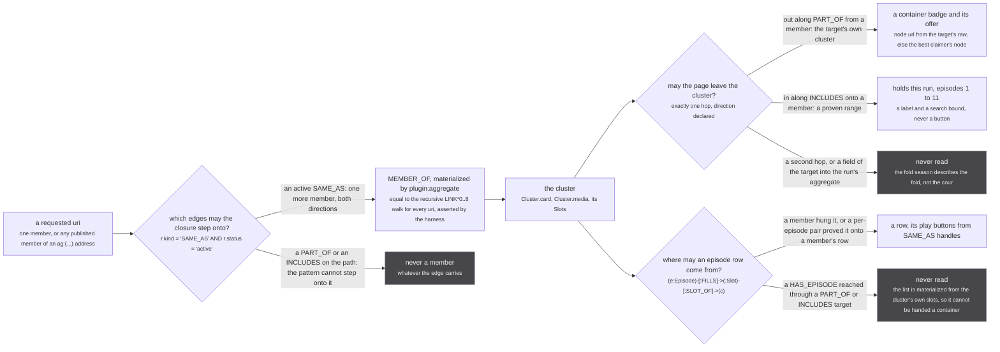
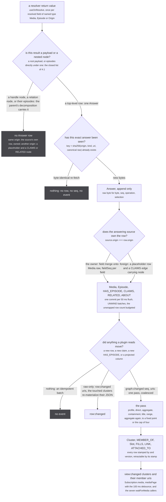
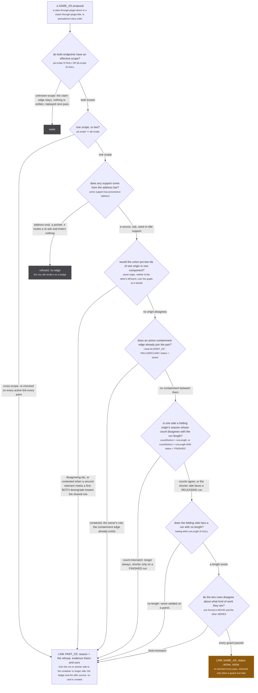
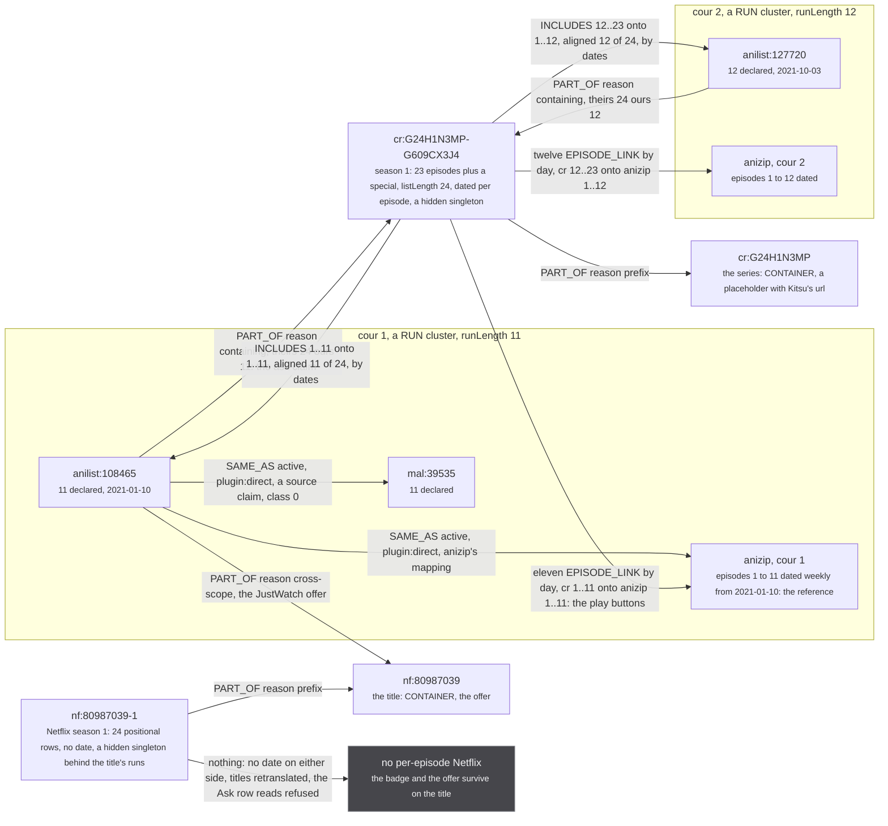

Stub's store becomes a graph: LadybugDB inside the worker, every source answer kept byte for byte,
every merge decision a plugin that writes only rows stamped with its own id, and a read path that is a
lookup of what the plugins materialized. This page is the design record for that store. It replaces
the union-find of `src/worker/store/graph.ts`, the three pair linkers of `db.ts`, the fuzzy pass that
runs inside a listing read, and the consensus functions that rebuild an episode list on every event.

Citations are `file:line` relative to the repo root, as they are on the rest of this site. A number
that was measured carries the date it was measured. A rule marked **NEW** is not in the record: it
names the case that motivates it and the measurement arm that must run before it moves. No threshold
in this document is changed from the value the code carries today unless it is marked that way.

## 1. Principles

### 1.1 What the user sees, and where it goes wrong

The design starts from the five surfaces and the visible number on each. Every one of these is a
measured defect or a measured cost, and the store below is derived from what each surface needs.

| surface | what is drawn | the visible failure |
| --- | --- | --- |
| the card | cover, title, `episodeCount`, popularity, one short description | three seasons on one card (Kitsu's Crunchyroll series url on `kitsu:45950`, `kitsu:47694` and `kitsu:49002`, 2026-08-31); a container card with no run; a hybrid card whose title and description come from two seasons |
| the detail page | titles, descriptions, covers, franchise, relations, origin badges, episode list | a welded cluster; a badge missing because a link was refused with no record; a show page with no episodes and no offer |
| the episode list, up to five play buttons per row | one row per episode, SAME_AS handles only | **24 rows on a 14 episode run**; 20 rows on a 12 episode run (`consensus.ts:93-97`); 13 of 25 rows with a playable but WRONG Netflix url (Blue Exorcist, 2026-09-10); two full lists of the same twelve (kitsu then anizip, 2026-09-09); Crunchyroll vanishing rather than being wrong |
| the folded season | Netflix season 1 holds cours 1 and 2 | the run refused outright and its offers lost, or accepted and 24 rows drawn |
| the show-level id | one Crunchyroll series url on three Kitsu season records | Mushoku Tensei seasons 1, 2 and 3 as one component |
| the 13 versus 12 run | AniList says 13, MAL says nothing, the run aired 12 | a lent season's 24 rows on a 12 episode page (`consensus.ts:222-224`) |

### 1.2 Five read guarantees

Everything in sections 2 to 7 is derived from these.

- **G1, nothing wrong is ever shown; missing is acceptable.** A row, a button or a field is drawn only
  when an edge path the read is allowed to walk backs it. A refusal renders as absence. This is the
  exchange rate at `src/sources/crunchyroll/extractor.ts:361-364`: a missing row is a nuisance, a
  wrong row is a lie about what the user is about to watch.
- **G2, every shown fact is traceable.** Each field names the source row and the answer it came from;
  each plugin edge names its plugin, its reason and the edges it was derived from. "Why is this here"
  is a query, never a guess.
- **G3, the same graph renders the same page, at a fixed point.** No read depends on arrival order and
  no read writes. Every app read is a lookup of one `Cluster` row, and the applier writes that row
  last, after the cluster's slots, fills and memberships (5.3): a reader sees a cluster's previous
  fixed point or its next, never half of one. The guarantee is per cluster; a listing can straddle a
  pass across two clusters for the length of the pass, and the `view:changed` re-read repairs it.
- **G4, ids are stable while a cluster grows, and an address never shrinks.** `Media._id` is the urql
  graphcache key (`src/urql-keys.ts:17`); the aggregated uri is a shared route and a party-synced path
  (`src/party/protocol.ts:28`) that `shouldGrowAddress` follows only forward (`src/utils/uri.ts:143-149`).
- **G5, a page is one or two queries, never a recursion per row.** A component over `SAME_AS` by
  recursion costs 6.8 ms against 1.7 ms by a materialized cluster id, and 1,033 ms on a dense graph
  (measured 2026-09-11 on `@ladybugdb/wasm-core` 0.20.4 under stub's Vite).

### 1.3 Nine principles

1. **Missing beats wrong, and a refusal is a fact, not silence.** Every refusal is written down with
   its reason, so an absent Netflix button can be told apart from an unasked one. Four vetoes that
   were structurally silent on a Crunchyroll search hit read as four passes today (2026-09-05); here
   a gate whose premise was absent records `silent`, never `passed`.
2. **Every merge is a deletable edge recomputed from evidence, and an active `SAME_AS` is sticky.**
   Sources write rows and claims, plugins write only edges and nodes stamped with their own identity.
   A `SAME_AS` link once active is retracted only by a guard whose evidence changed: a disagreeing id,
   a containment edge, a scope flip, a date or a count on a folding origin. It is never retracted
   because the merged cluster's profile drifted. Contradicting evidence is finite, since each source
   row lands once, so within a session links accumulate except on contradiction. That is the
   termination argument the union-find's monotonicity used to carry
   (`src/worker/resolvers/media/index.ts:55-56`), restored without the union.
3. **One chokepoint for sameness.** Every `SAME_AS` that can reach a cluster, whether a source handle, a
   `similarMedia` answer or a title match, passes the same nine guards in the same writer (5.2). A title
   match also has to clear four gates of its own (format, season, date, companion, 5.4 P3) that an id
   claim never meets, because an id is not a guess: that asymmetry is deliberate and stated, not a
   second path. Today three pair linkers, a scope dispatch and a resolver comment each carry part of
   the list (`db.ts:216-255`, `fuzzy-merge.ts:656-666`); a guard placed in one writer is not a guard
   (2026-09-05).
4. **Unknown is a third state.** Scope, date precision, count kind, season ordinal and number space are
   evidence with an explicit "not stated", never a default. A silent side is never read as agreeing.
5. **Sameness closes over `SAME_AS` within one scope and nothing else.** `PART_OF` and `INCLUDES` are
   walked one hop, in a declared direction, and never inside the closure. Nothing reached through
   `INCLUDES` or `PART_OF` is ever treated as the run.
6. **A range labels a container and bounds a search; a NON-member's episode reaches a slot only through
   a per-episode pair with evidence.** No count and no offset places a play button, and nothing outside
   a cluster fills a slot by position. A member's own rows are placed by its own numbering and say so
   (`via: member`); where that numbering is a list position (unogs, `i + 1` at `unogs/extractor.ts:294,500`)
   the placement is the measured residue of an answerer's own rules, 11 welds of 105 runs
   (`season.ts:170-173`), visible in the trace and not proven by anything per episode. That residue is
   kept at parity, and the one part of it that costs nothing is closed: a position row whose media's
   own list is mis-numbered by duplicates (`countDistinct <> countStated`) fills nothing (5.4 P5).
7. **Every fact names its row and its rule.** Per-field provenance on the aggregate, `by`, `reason` and
   `supports` on every plugin edge, the source's answer kept byte for byte.
8. **Determinism by construction.** Plugins compute from sorted inputs and materialize their output;
   reads mint nothing; arrival order decides nothing. Proposals are evaluated in declared precedence
   classes, never by which flush landed first.
9. **Absent, zero and unknown are three values on every quantity a rule reads.** An empty list is not a
   count of zero (`?? episodes.length` turned "no count" into zero at seven call sites and zero vetoed
   every season, 2026-09-09), a missing ordinal is not season 0, and a gate whose premise is absent
   records `silent`.

## 2. Graph schema

One label per node, a rel table may span several `FROM/TO` pairs, JSON is native, `DELETE` on edges
selected by a property works, `MERGE` on a node pattern with `ON CREATE SET` and `ON MATCH SET` works,
`NOT EXISTS { MATCH ... }` works, a `STRING` param into a `DATE` column is a binder error and a binder
error THROWS (all measured 2026-09-11 on 0.20.4). Every `FROM/TO` pair a table will ever carry is
declared at `CREATE` time, since an `ALTER` is not among the exercised facts. No persistence: the graph
lives for the worker's lifetime, as the store does today (`db.ts:82`).

No `DATE` or `TIMESTAMP` column exists anywhere a plugin writes. Every day is an `INT64` UTC day
number, `floor(ms / 86400000)`, which is `dayOf` at `consensus.ts:85-88`; that keeps every window in
this document inside the exercised dialect, and the generic writer never has to cast.

### 2.1 Source tables, written by the ingest only

```cypher
CREATE NODE TABLE Origin(
  id STRING PRIMARY KEY,
  raw JSON,                  // the Origin row as the resolver returned it; seeded from the extractor definitions at boot
  hash STRING, seq INT64
)

CREATE NODE TABLE Media(
  uri STRING PRIMARY KEY,
  origin STRING,             // 'mal', 'cr', 'nf' ... the ORIGIN, not the module (jikan -> mal, crunchyroll -> cr, unogs -> nf, justwatch -> jw)
  id STRING,
  owned BOOLEAN,             // true once the origin's own resolver described this uri; false = placeholder
  scope STRING,              // the OWNER'S last word: RUN, CONTAINER or NULL. The effective scope is MediaProfile.scope
  raw JSON,                  // the owner's field-merged row (4.3): a projection of the Answer log, never a source of truth
  score DOUBLE,              // verbatim projections of raw so a WHERE clause can read them; copied, never coerced, never defaulted
  episodeCount INT64, startDate STRING, endDate STRING, type STRING, status STRING,
  season STRING, seasonYear INT64, titles JSON, categories STRING[],
  fieldSeq MAP(STRING, INT64),   // field name -> Answer.seq that supplied the current value
  hash STRING,               // content hash of the merged row, re-checked by the audit (5.3)
  seq INT64
)

CREATE NODE TABLE Episode(
  uri STRING PRIMARY KEY,
  origin STRING, id STRING,
  mediaUri STRING,           // the uri the source hung it on, as returned
  raw JSON,
  episodeNumber INT64, seasonNumber INT64, absoluteEpisodeNumber INT64,   // in the SOURCE'S numbering space; the space is on the profile
  releaseDate STRING,        // as returned: an instant or a named day; the profile derives the day
  titles JSON,
  fieldSeq MAP(STRING, INT64),
  hash STRING, seq INT64
)

CREATE NODE TABLE Answer(
  key STRING PRIMARY KEY,    // sha-256 over (origin, kind, uri, canonical JSON of raw): object keys sorted, array order kept
  seq INT64,                 // ingest sequence, monotonic, assigned when the key is first seen
  uri STRING, origin STRING,
  kind STRING,               // 'media' | 'episode' | 'origin'
  operation STRING,          // the app document the resolve served: 'MEDIA' | 'MEDIA_PAGE' | 'SIMILAR'
  selection STRING[],        // the field names the document SELECTED, read off info in the hook, so a partial answer is visible as such
  raw JSON,                  // the resolver's return value, byte for byte, handles and episodes included
  at TIMESTAMP DEFAULT current_timestamp()
)

CREATE NODE TABLE Ask(
  key STRING PRIMARY KEY,    // sha-256 over (runUri, origin, showId, questionHash)
  runUri STRING, clusterId STRING, origin STRING, showId STRING,
  questionHash STRING,       // the normalised SimilarMediaInput
  outcome STRING,            // 'answered' | 'containing' | 'refused' | 'declined' | 'refused-by-title' | 'refused-other-run'
  reason STRING,             // SimilarOutcome's reason: 'null' | 'not-a-run' | 'not-implemented' | 'bad-show-id' | 'no-evidence' | 'ceiling' | 'timeout' | 'error' (src/sources/similar.ts:51-52)
  answerUri STRING, seq INT64
)
```

```cypher
// what a source asserted; the ingest writes these and nothing else does
CREATE REL TABLE CLAIMS(FROM Media TO Media,
  key STRING,                // sha-256 over (from, to, kind, claimer, provenance)
  kind STRING,               // 'SAME_AS' | 'PART_OF' | 'INCLUDES'   (MediaHandleRelation, section 3.1)
  provenance STRING,         // 'source' | 'ask' | 'seed' | 'address'   (section 3.3)
  claimer STRING,            // the origin whose resolver returned the handle
  targetScope STRING,        // the scope stamped on the nested node, or NULL (partOf() stamps CONTAINER, src/sources/utils.ts:40)
  node JSON,                 // the nested node as returned: the claimer's DESCRIPTION of the target (url, titles), field-merged across the claimer's answers
  hash STRING,               // content hash of node, re-checked by the audit (5.3)
  answerSeq INT64, seq INT64)   // seq advances on every write to the row, a re-assert included, so the audit window never holds a row the ingest is still moving

CREATE REL TABLE HAS_EPISODE(FROM Media TO Episode,
  key STRING,                // sha-256 over (from, to, claimer): what a FILLS or EPISODE_LINK names in supports
  claimer STRING, answerSeq INT64, seq INT64)

// an episode identity a source asserted. The schema allows it (episode/schema.gql:16; makeEpisode coerces a
// bare node to episodeSameAs, src/sources/utils.ts:90); no first-party source emits one today, the seed's
// episodes included (offline/seed-source.ts:170-182). Consumed by plugin:range (5.4 P4)
CREATE REL TABLE EPISODE_CLAIMS(FROM Episode TO Episode,
  key STRING, kind STRING, provenance STRING, claimer STRING, node JSON, answerSeq INT64, seq INT64)

// the narrative axis, never walked by any merge
CREATE REL TABLE RELATED(FROM Media TO Media,
  relation STRING, format STRING, claimer STRING, node JSON, answerSeq INT64)

CREATE REL TABLE ABOUT(FROM Answer TO Media, FROM Answer TO Episode, FROM Answer TO Origin)
```

**The `Answer` log is the only source of truth.** `Media.raw` and `Episode.raw` are the ingest's cache
of it: the owner's answers about one uri, folded by the field-merge rule of 4.3, rebuildable at any
time by replaying the log through that rule, and the harness does exactly that (9.3). The typed columns
beside `raw` are verbatim projections, the same value copied so a candidate scan can filter in Cypher;
they are never coerced and never defaulted, which is how `scope` stays NULL when a source said nothing.
A claim's `node` keeps the nested handle node as the claimer returned it, so a container badge can
carry the url Kitsu published for a Crunchyroll series without Crunchyroll ever answering
(`src/sources/kitsu/extractor.ts:83-89`). `Ask` is the one source table written by the app's own
consumer rather than by a resolver: one row per question asked through `similarMedia`, so "never asked"
and "asked and refused" are different rows (7.3).

### 2.2 Plugin tables, written by plugins through the writer, stamped `by`

```cypher
CREATE NODE TABLE MediaProfile(
  uri STRING PRIMARY KEY, by STRING, version INT64,
  scope STRING,                  // the EFFECTIVE scope, the ratchet computed as a view (5.4 P0); NULL = unknown
  scopeFrom STRING[],            // which answers or claims said CONTAINER
  dateSubject STRING,            // 'run' | 'container': what the row's dates date; a declared startDateSubject first, else the effective scope (5.4 P0)
  titleKeys JSON,                // [{key, score, language, class}]: main titles stripped to letters, numbers and spaces, with a letter
  titleKeysFolded JSON,          // the same after NFD with combining marks removed; read only behind foldDiacritics
  seasonOrdinal INT64, partOrdinal INT64, ordinalFrom STRING,   // parsed from RAW titles; NULL = silent
  year INT64, startDay INT64,    // startDay is a UTC day number; NULL when the precision is not a day
  datePrecision STRING,          // 'day' | 'month-or-year' | 'none'
  dateDerivation STRING,         // 'published' | 'coerced' | 'declared'
  format STRING, workKind STRING, companion BOOLEAN,
  countKind STRING,              // 'declared' | 'listLength' | 'none'
  countStated INT64,             // the source's own figure
  countDistinct INT64,           // count(DISTINCT HAS_EPISODE targets) when a list exists, else NULL
  folding BOOLEAN,               // origin folds cours into seasons: cr, nf, jw
  retranslates BOOLEAN,          // origin commissions its own episode titles: nf
  showLevelOrigin BOOLEAN,       // every id of this origin names a container: imdb, trakt, tvdb, paramount
  idParent STRING                // the same-origin prefix parent of this id, when one exists
)

CREATE NODE TABLE EpisodeProfile(
  uri STRING PRIMARY KEY, by STRING, version INT64,
  day INT64,                     // UTC day of releaseDate (consensus.ts:85-88)
  dayPrecision STRING,           // 'instant' | 'day' | 'none'
  numberSpace STRING,            // 'entry' (anizip's map key) | 'season' | 'position' (unogs's list index)
  titleKeys JSON,
  generic BOOLEAN                // 'Episode 13' carries no identity (GENERIC_EPISODE, src/sources/similar.ts:104)
)

CREATE NODE TABLE TitleKey(key STRING PRIMARY KEY, by STRING, version INT64)

CREATE NODE TABLE Cluster(
  id STRING PRIMARY KEY,         // the Media._id the app caches on; minted once, carried across growth
  by STRING, version INT64,
  scope STRING,                  // 'RUN' | 'CONTAINER'
  key STRING,                    // lowest member uri
  published STRING[],            // every routable member uri ever published under this id: append-only
  aggUri STRING,                 // 'ag:(' + sorted published uris + ')'
  aliases STRING[],              // ids retired into this cluster
  hidden BOOLEAN,                // the listing hide rule (6.1), evaluated store-wide; written false explicitly, never left unset, since the listing filters NOT c.hidden
  hiddenBy STRING[],             // the run cluster ids the hide rule found, so a listing answered only by hidden rows can draw their runs (6.1)
  runLength INT64, runLengthTier DOUBLE, runLengthWitnesses INT64, runLengthFrom STRING[],
  preferredRun STRING,           // a container cluster's earliest attached run cluster id
  card JSON,                     // the listing's fields (6.1)
  media JSON,                    // the full aggregated Media with provenance (6.3)
  episodes JSON,                 // the ordered episode list, one entry per Slot, numbered ascending then specials (6.4): the episode read is this one row
  anomalies JSON,                // [{rule, detail}]
  anomalyCount INT64             // tested by the trace, because size() over a JSON column is a string length
)

CREATE NODE TABLE Alias(id STRING PRIMARY KEY, clusterId STRING, by STRING, version INT64)   // a retired id -> its survivor, a key lookup

CREATE NODE TABLE Slot(
  id STRING PRIMARY KEY,         // '<clusterId>#<number>' for a numbered row, '<clusterId>#s:<lowest uri>' for a special; the Episode._id
  by STRING, version INT64, clusterId STRING, number INT64,
  episode JSON                   // the aggregated Episode with provenance (6.4)
)
```

```cypher
// plugin-minted relations between source rows
CREATE REL TABLE LINK(FROM Media TO Media,
  key STRING,                    // sha-256 over (from, to, kind, by): the writer's diff key, and what supports and the trace name
  kind STRING,                   // 'SAME_AS' | 'PART_OF' | 'INCLUDES'
  by STRING, version INT64,
  status STRING,                 // 'active' | 'refused'   (a refused proposal is kept, with its reason)
  reason STRING, confidence DOUBLE, evidence JSON,
  gates JSON,                    // {format, season, date, companion}: 'passed' | 'refused' | 'silent', on every title link
  fromStart INT64, fromEnd INT64, toStart INT64, toEnd INT64,   // INCLUDES only: episodes fromStart..fromEnd of FROM
  contiguous BOOLEAN, aligned INT64, total INT64,               //   correspond to toStart..toEnd of TO (section 3.4)
  supports STRING[])             // keys of the CLAIMS / LINK / EPISODE_LINK edges it was derived from

CREATE REL TABLE EPISODE_LINK(FROM Episode TO Episode,
  key STRING,                    // sha-256 over (from, to, by)
  kind STRING,                   // 'SAME_AS'
  by STRING, version INT64, status STRING, reason STRING, confidence DOUBLE, evidence JSON,
  fromNumber INT64, toNumber INT64,   // the two rows' own numbers, so a renumbering is readable off the edge
  supports STRING[])             // the HAS_EPISODE keys, or the EPISODE_CLAIMS key, it was derived from

CREATE REL TABLE PROFILE_OF(FROM MediaProfile TO Media, FROM EpisodeProfile TO Episode, by STRING)
CREATE REL TABLE HAS_KEY(FROM Media TO TitleKey, key STRING, by STRING, version INT64, score DOUBLE, language STRING, class STRING)
CREATE REL TABLE MEMBER_OF(FROM Media TO Cluster, by STRING, version INT64, via STRING)
CREATE REL TABLE ATTACHED_TO(FROM Cluster TO Cluster, by STRING, version INT64, via STRING, supports STRING[])
CREATE REL TABLE SLOT_OF(FROM Slot TO Cluster, by STRING)
CREATE REL TABLE FILLS(FROM Episode TO Slot, by STRING, version INT64, via STRING, number INT64, supports STRING[])
```

`titleKeys` is a JSON array rather than a `STRING[]` because the six-title selection needs the
per-title score: the measured arm is "best score per normalised title, bucket by score, title
ascending within a tier, take six", 69.6 / 99.9 / 70.0 against arrival order's 64.5 / 94.9 / 56.0 on
the weld, split and attach arms (`fuzzy-merge.ts:215-219`, 2026-08-29), and a bare string list cannot
reconstruct the tiers. `TitleKey` and `HAS_KEY` exist so that "which clusters share a normalised main
title in this year bucket" is one join through one node rather than a pairwise loop. `countStated`
beside `countDistinct` is what tells 14 rows over 10 distinct epids (netflixid 80198505 season 3,
2026-09-10) from a season of 14: `Episode` is keyed on the uri so the graph holds 10 rows while the
source's own figure is 14, and every count guard reads `countDistinct` when a list exists. Every edge
table carries a `key`, minted the way `CLAIMS.key` is over the endpoints and the fields that
distinguish two edges between them, because `supports` names keys, the writer diffs by key, and a
trace descends by key: an edge without one could be neither named nor retracted precisely.

### 2.3 Who writes what, and how the writer is recorded

| table | writer | how the writer is recorded |
| --- | --- | --- |
| `Origin`, `Media`, `Episode`, `Answer`, `CLAIMS`, `HAS_EPISODE`, `EPISODE_CLAIMS`, `RELATED`, `ABOUT` | the ingest, one serial queue (section 4) | `Answer.seq` / `answerSeq` names the exact resolver return; `claimer` names the origin; `seq` advances only in the ingest |
| `Ask` | the similar consumer, through the ingest's write handle (7.3) | `runUri`, `origin`, `questionHash`, `outcome` |
| `MediaProfile`, `EpisodeProfile`, `PROFILE_OF`, `TitleKey`, `HAS_KEY` | `plugin:profile` | `by`, `version` |
| `LINK` (`SAME_AS`, `PART_OF`) | `plugin:direct` and `plugin:title` through the writer's guards; `plugin:containment` (`PART_OF` reason `span`, `show-show`) | `by`, `reason`, `evidence`, `gates`, `supports`, `status` |
| `LINK` (`INCLUDES`), `EPISODE_LINK` | `plugin:range` | same |
| `Cluster`, `Alias`, `MEMBER_OF`, `Slot`, `SLOT_OF`, `FILLS` | `plugin:aggregate` | same |
| `ATTACHED_TO`, `Cluster.preferredRun` | `plugin:containment` | same |
| anything, from the read path | nobody | a resolver holds a query-only handle; no read mints an id, writes an alias or unions |

A plugin cannot name a source table in its output type (5.1), the applier is the only code that
writes plugin output, and after every pass the core re-hashes the source tables (5.3). That audit is a
content hash over every source row with `seq <= passStart`, compared with the hash the ingest stored
when it wrote the row; it is not a count, because a `SET` on an existing row moves no count.

### 2.4 What is raw and what is derived

Everything in 2.2 is derived and can be dropped and rebuilt by running the plugins with `delta.full`.
Nothing in 2.1 is derived from a rule: the typed columns on `Media` and `Episode` are copies of `raw`
fields, `raw` itself is the `Answer` log folded by one stated rule, and `owned`, `fieldSeq`, `hash`
and `seq` are bookkeeping about the answers, not conclusions about the work. Date precision is not a
column here, because the ingest cannot know whether `2021-01-01` is a sentinel or a premiere; that
reading is `plugin:profile`'s (5.4 P0).

## 3. The edge model

### 3.1 The closed set

| kind | table | direction | meaning | asserted by a source | minted by a plugin |
| --- | --- | --- | --- | --- | --- |
| `SAME_AS` | `CLAIMS`, `LINK` | source: claimer to claimed; plugin: lower uri to higher uri | the two uris name one run, or one container, at the same scope | yes: anilist `mal`, kitsu `mal` and `anilist`, anizip, simkl, offline, jikan `anidb` and `anizip`, film links from kitsu, watchmode and justwatch under the `nf:title` / `nf:watch` allowlist (`kitsu/stream-id.ts:82,114`) | `plugin:direct` (from a claim), `plugin:title` |
| `PART_OF` | `CLAIMS`, `LINK` | part to whole | X is one of Y's parts: a run of a show, a film of a collection (`cr:GQWH0M1GG` on fifteen Kitsu films), a cour of a folded season, a catalogue season of a longer run | yes: kitsu `partOf`, justwatch show container and show-level offers, watchmode `imdb` and `tmdb`, the seed's containers | `plugin:direct` (cross-scope derivation, prefix ids, an asserted `INCLUDES`), the writer's downgrade of a refused `SAME_AS` (5.2), `plugin:title` (run against container), `plugin:containment` (`span`) |
| `INCLUDES` | `CLAIMS` (fenced), `LINK` (ranged) | whole to part | as a source claim: a show row names the season rows of its OWN origin. As a plugin edge: Y's episode list holds X's episodes at Y positions `fromStart..fromEnd`, which are X positions `toStart..toEnd`; `aligned/total` says how much of Y is proven, `contiguous` whether the proven pairs are unbroken | yes, fenced: accepted only from a show row to season rows of the same origin whose ids extend the show's (`idParent`), else refused with reason `foreign-includes`. The owner's call, section 11 | `plugin:range` only, and always with a range |
| `HAS_EPISODE` | `HAS_EPISODE` | media to episode | the claimer hung this episode row on this media uri | yes, every episode-emitting source | never |
| `SAME_AS` (episode) | `EPISODE_CLAIMS`, `EPISODE_LINK` | as above | two episode rows are one broadcast episode | the schema allows it (`episode/schema.gql:16`; `makeEpisode` coerces a bare node to `episodeSameAs`, `src/sources/utils.ts:90`), and no first-party source emits one today: the seed's episodes carry no handles (`offline/seed-source.ts:170-182`). A plugin source may | `plugin:range` (by date, by title, and reason `asserted` from an `EPISODE_CLAIMS` row whose two rows sit inside one cluster or across an attached season, 5.4 P4), `plugin:aggregate` (by number inside one cluster, as `FILLS` onto one slot) |
| `RELATED` | `RELATED` | as the source stated | PREQUEL, SEQUEL, ADAPTATION and the rest of AniList's `relationType(version: 2)` vocabulary | anilist only | never, and never walked by any merge (CHARACTER edges reached 10 foreign franchises from one show, 2026-09-08) |

**Containment established with no correspondence is `PART_OF`**, with a `reason` that names the
mismatch (`count-mismatch`, `no-length`, `containing`, `span`, `cross-scope`, `contested`,
`disagreeing-ids`) and `evidence: {theirs, ours}` carrying the counts read. An `INCLUDES` plugin edge
always carries a range. A reader used to a rangeless "includes" should read every `PART_OF` with a
count-shaped reason as exactly that fact: the container holds the run, and nothing is yet known about
which of its rows are which of the run's.

Not added, deliberately:

- `EPISODE_PART_OF`: declared, written and read by nothing today (`db.ts:45-46`; `episodePartOf` at
  `src/sources/utils.ts:44` is called nowhere). The fold is `INCLUDES` with a range plus per-episode
  `SAME_AS`, which is what the fold, the loan, the renumbering and the mid-season insert need.
- A stored reverse of `PART_OF`: storing both directions lets them disagree, the argument that rejected
  a second `links` field in favour of an edge type ("a second field fails silently, an edge type fails
  at compile time", 2026-09-05). A fenced source `INCLUDES` is stored as the claim it was and derived
  as `PART_OF` from the season to the show (5.4 P1), so one containment kind carries every containment
  fact with no range.
- `SAME_AS` minted by `plugin:range`. A season whose every numbered episode pairs onto a shorter run is
  the Fullmetal Alchemist shape (one 64 episode run in five Netflix seasons of about 13, 2026-09-01),
  and only exactness may admit a shorter season (`src/sources/similar.ts`, rule 5's comment). A dated
  season proven by pairs stays `PART_OF` with its pairs; its episodes reach the slots through the pairs,
  which is everything the user sees.

### 3.2 Provenance and confidence on every edge

| on a claim | on a plugin edge |
| --- | --- |
| `claimer`: the origin whose resolver returned it | `by`: the plugin id; `version`: the pass that wrote it |
| `provenance`: `source`, `ask`, `seed`, `address` (3.3) | `reason`: the rule that fired, one token per rule (section 5.4) |
| `answerSeq`: the exact return value it came out of | `confidence`: 1.0 for an id or a date match, the similarity score for a title match |
| `targetScope`: what the claimer stamped on the nested node | `evidence`: the numbers the rule read (titles and score, shared days, counts as `{theirs, ours}`) |
| `node`: the claimer's description of the target | `supports`: the edges it was derived from, so a trace can descend to the claims and from there to the `Answer` |
| | `status`: `active` or `refused`, so a veto that fired and a veto whose premise was absent are both queryable |
| | `gates` on every title link, accepted or refused: `{format, season, date, companion}` each `passed`, `refused` or `silent`, so the four short-circuits that let a bare `cr:` search hit into a cluster on its title alone (2026-09-05) are countable on accepted pairs too |
| | `via` on `FILLS`: `member` (the row's own numbering) or `aligned` (a proven pair) |

### 3.3 Provenance values, and the one that is only a pointer

- `source`: a resolver's own handle. Consumed by every plugin.
- `ask`: a `similarMedia` answer the app's consumer wrote as a claim (`src/worker/similar-consumer.ts:255`
  writes it as `SAME_AS`; a `containing` answer writes `PART_OF`, 4.4). Consumed like `source`; the
  answer's own row lands through the answering extractor as today.
- `seed`: the offline seed's identity handles. Consumed like `source`; the seed's handle nodes are
  placeholders and never write a row (`offline/seed-source.ts:136-148`).
- `address` (**NEW**, decided by the owner 2026-09-12): a handle rebuilt from the address bar by
  `buildHandlesFromUri` (`src/sources/utils.ts:465-471`). **The address names WHICH sources to ask
  and asserts nothing about how they relate.** An `address` claim is a POINTER: it routes re-asks
  (7.1) and never enters the closure, whatever the claimer. Every relation between the rows an address
  names is re-derived at runtime from what the sources answer (their own claims, the `ask` answers,
  the title and range plugins). What keeps this from orphaning a row: a uri the address names whose
  row the graph cannot relate to anything is still drawn on the page as a plain badge carrying that
  row's own url (6.2), never merged into the card and never hidden. The stale show-level `cr:` of a
  pre-fix bookmark is then a badge with a url and nothing else, and two old season links in one uri can
  weld nothing.

  **The stamp is the extractor's, and the ingest derives it where the stamp is missing** (2026-09-12,
  step 2g-b). A handle rebuilt by `buildHandlesFromUri` carries `provenance: 'address'` on the source
  schema (`MediaHandle.provenance`, optional; unset means the source's own statement). For a handle
  with no stamp, a recording that predates it or a remote source that never sets it, the ingest reads a
  per-origin table of what each first-party origin's OWN data can carry (`origins.ts`, cited line by
  line), and applies it ONLY to the four origins that rebuild handles from the address (`cr`, `nf`,
  `appletv`, `jw`) and only to `SAME_AS`, the one kind `buildHandlesFromUri` mints: for those a claim
  into a space they cannot know is an echo of the ask, and the claim is `address`. Anywhere else a
  claim into an unlisted space is a mapping path nobody read, not a rebroadcast, and stays `source`. The
  `Answer` row is never touched; provenance is a column on the claim edge (3.2).

### 3.4 The episode range form, literally

```cypher
// Mushoku Tensei: Crunchyroll's season 1 (23 episodes plus a special) holds both cours
(cr:G24H1N3MP-G609CX3J4)-[:LINK {kind:'INCLUDES', by:'plugin:range', status:'active', reason:'dates',
  fromStart:1,  fromEnd:11, toStart:1, toEnd:11, contiguous:true, aligned:11, total:24, confidence:1.0}]->(anilist:108465)
(cr:G24H1N3MP-G609CX3J4)-[:LINK {kind:'INCLUDES', by:'plugin:range', status:'active', reason:'dates',
  fromStart:12, fromEnd:23, toStart:1, toEnd:12, contiguous:true, aligned:12, total:24, confidence:1.0}]->(anilist:127720)

// and what places a play button: one edge per episode, carrying the day both sides published
(cr:<episode 12>)-[:EPISODE_LINK {kind:'SAME_AS', by:'plugin:range', reason:'dates', fromNumber:12, toNumber:1,
  evidence:'{"day":18903,"slack":0}', confidence:1.0}]->(anizip:<cour 2 episode 1>)
```

The `INCLUDES` edge labels the container on the run's page ("Crunchyroll season 1 holds this run,
episodes 1 to 11") and bounds the range plugin's search. It never places a button: a button is an
`EPISODE_LINK` with evidence, one per episode, so one inserted special costs one episode its link
rather than shifting every later one. The title-vote offset that placed 13 of 25 Blue Exorcist rows on
the wrong Netflix episode (position 14 an inserted special, 2026-09-10) has no successor here; there is
no offset anywhere, only pairs.

### 3.5 Traversal rules, as the Cypher that enforces them

**What the aggregation may walk.** Sameness closes over active `SAME_AS` `LINK` edges only, both
directions, and nothing else. The closure is computed by `plugin:aggregate` and materialized as
`MEMBER_OF`; the same query is the cross-check the tests run against the materialized membership. The
pattern variable is named, which is the form that was exercised (`-[e:CLAIMS*1..3 (r, _ | WHERE ...)]->`,
2026-09-11):

```cypher
MATCH (a:Media {uri: $uri})-[e:LINK*0..8 (r, _ | WHERE r.kind = 'SAME_AS' AND r.status = 'active')]-(b:Media)
RETURN DISTINCT b.uri AS uri
```

The filter names exactly one kind. A `SAME_AS` is only ever written between two rows of one effective
scope (5.2 guard 2, re-checked every pass), so the closure cannot cross a scope either.

**What a page may walk beyond the closure, one hop each, direction declared:**

```cypher
// the containers of a run cluster: one hop of PART_OF out of a member, then the target's own cluster
MATCH (c:Cluster {id: $id})<-[:MEMBER_OF]-(m:Media)-[l:LINK {kind: 'PART_OF', status: 'active'}]->(t:Media)-[:MEMBER_OF]->(k:Cluster)
RETURN t.uri AS uri, l.reason AS reason, l.by AS by, l.evidence AS evidence, k.id AS clusterId

// the parts of a cluster: a catalogue season that is a piece of this run, the seasons a show lists, the runs of a show
MATCH (c:Cluster {id: $id})<-[:MEMBER_OF]-(m:Media)<-[l:LINK {kind: 'PART_OF', status: 'active'}]-(p:Media)-[:MEMBER_OF]->(k:Cluster)
RETURN p.uri AS uri, l.reason AS reason, k.id AS clusterId

// the episode ranges a container proves it holds
MATCH (c:Cluster {id: $id})<-[:MEMBER_OF]-(m:Media)<-[l:LINK {kind: 'INCLUDES', status: 'active'}]-(s:Media)
RETURN s.uri AS uri, l.fromStart AS fromStart, l.fromEnd AS fromEnd, l.toStart AS toStart, l.toEnd AS toEnd,
       l.aligned AS aligned, l.total AS total, l.contiguous AS contiguous
```

**What may never be walked.** Any closure whose filter admits `PART_OF` or `INCLUDES`:

```cypher
// NEVER. This is the query that welds three seasons through one show id and puts every season's
// episodes on one page. No reader, no plugin, no test helper may issue it.
MATCH (a:Media)-[e:LINK*1..8 (r, _ | WHERE r.kind IN ['SAME_AS', 'PART_OF', 'INCLUDES'])]-(b:Media)
```

and any episode read that reaches `HAS_EPISODE` through a `PART_OF` or `INCLUDES` target, which is
the read `aggregate.ts:97-101` calls the most dangerous in the tree. The episode read in 6.4 is a
lookup of `Cluster.episodes`, materialized from the cluster's own `Slot` rows and never from a media
uri, so it cannot be misused.



*Three dead ends, and every one is a query shape rather than a convention: the closure filter names one kind, the page leaves the cluster for one hop, and the episode read begins at a slot.*

**The owner's rule holds three ways.** Never treat as `SAME_AS` anything reached through `INCLUDES`
or `PART_OF`:

1. **At proposal time, guard 6.** The writer refuses a proposed `SAME_AS(a, b)` when the two already
   stand in a containment relation:

```cypher
MATCH (a:Media {uri: $a})-[l:LINK {status: 'active'}]-(b:Media {uri: $b})
WHERE l.kind IN ['PART_OF', 'INCLUDES']
RETURN count(l) > 0 AS contained     // true: refused with reason 'contained'
```

2. **After every pass, the invariant queries.** Four queries must return 0 after every pass in dev
   and after every harness run; a non-zero answer is an anomaly naming the cluster ids (5.5), and the
   declared precedence retracts the weaker edge: a `PART_OF` or `INCLUDES` between two members of one
   cluster retracts the `SAME_AS` that joined them, never the containment edge, so the outcome does not
   depend on which plugin ran first.

```cypher
MATCH (a:Media)-[:LINK {kind: 'INCLUDES', status: 'active'}]->(b:Media), (a)-[:MEMBER_OF]->(c:Cluster)<-[:MEMBER_OF]-(b) RETURN count(*) AS includesInside
MATCH (a:Media)-[:LINK {kind: 'PART_OF', status: 'active'}]->(b:Media), (a)-[:MEMBER_OF]->(c:Cluster)<-[:MEMBER_OF]-(b) RETURN count(*) AS partOfInside
MATCH (a:Media)-[:LINK {kind: 'SAME_AS', status: 'active'}]-(b:Media), (pa:MediaProfile)-[:PROFILE_OF]->(a), (pb:MediaProfile)-[:PROFILE_OF]->(b) WHERE pa.scope <> pb.scope RETURN count(*) AS crossScope
MATCH (m:Media)-[:MEMBER_OF]->(c:Cluster) WITH m, count(c) AS n WHERE n > 1 RETURN count(*) AS doubleMembership
```

3. **In the closure filter itself**, which admits one kind (above).

The other way a plugin could reach a sibling through a container (X part of Y, Z part of Y, propose
X = Z) is stopped by guard 4 (disagreeing ids) and by the count and date vetoes: two cours of one show
carry different `anilist`, `mal` and `kitsu` ids and sit about 91 days apart (`fuzzy-merge.ts:35-41`).

## 4. Ingest

### 4.1 What is kept, and the one change to the hook

- `useOnResolve`, installed once in `makeExtractor` so every source and every plugin source goes
  through it (`src/worker/extractor.ts:471-497`). Its three consequences stay: it fires on the return
  value, not the selection; episodes are written only when the `episodes` field is actually resolved
  (10 rows through a document that selected them, 0 through the `similarMedia` document that did not,
  2026-09-10); the media inserter never writes `media.episodes` itself.
- **The hook keys on position as well as type, and ownership decides what a nested node is.** Today
  it keys on `getNamedType(info.returnType).name` alone (`extractor.ts:473-479`), and `MediaHandle.node`
  and `MediaRelationEdge.node` are both `Media!` (`schema.gql:226-231`, `:170`), so a nested handle
  node reaches `mediaInserter` as a payload under the answering server's origin (the class in which
  `titles { title }` alone cost Crunchyroll's rows their language and score, 2026-09-05), and so does a
  relation node, which AniList mints as a partial snapshot carrying `episodeCount` and `startDate` for
  a row nobody fetched (`anilist/extractor.ts:440-470`; the schema's own comment calls it "a SNAPSHOT
  and not necessarily a row this store has ever fetched", `schema.gql:158-160`). Here the answer
  positions are a closed list, never a blacklist of one segment: a result is an `Answer` only when its
  path is a root payload (`Subscription.media`, a `MediaPage.nodes` entry, the `similarMedia` result,
  which is a `Media` today, `schema.gql:551`, and its `media` or `containing` under decision 2) or the
  `episodes` field directly under one. Every other `Media`- or `Episode`-typed
  result is nested and reaches the graph through its parent's decomposition (4.2 step 6), where one
  test decides what it is: a nested node whose origin equals the answering source's origin is that
  source's own statement (JustWatch's `jw:<objectId>` container on every season row,
  `justwatch/extractor.ts:509-517`), written as an owned row with the parent's `answerSeq`; a nested
  node of another origin is the claimer's DESCRIPTION, a placeholder plus a `CLAIMS.node`, and a
  relation node of another origin is a `RELATED.node` and nothing else. The test: a handle node, a
  relation node and a same-origin container node must produce no `Answer` row, the same-origin node
  must still produce an owned `Media` row, and the control is a top-level row of the same shape that
  must produce an `Answer`.
- The three DataLoaders with their batch sizes and the 50 ms schedule (`extractor.ts:129-134`), all
  three module-level so 24 sources share one batch per flush (`extractor.ts:106,136,154`). The batch is
  the unit of an ingest commit and the trigger of a plugin pass.
- The fan-out that discards payloads (`extractor.ts:750-759`, `:833`): the graph stays the only join
  point.
- `ctx.findAggregatedMedia` and `ctx.listenForMediaChanges` for the seven `waitForMedia` callers that
  block on the store mid-resolve with 15 s or 30 s deadlines (`src/sources/utils.ts:488-508`): both are
  answered from the read path of section 6 and woken by the events of 4.5.

### 4.2 The ingest queue

One serial queue owns the only write handle to the source tables. A batch from a DataLoader becomes
one commit. The budget is the UNWRAPPED row count, not the loader's 250: `mediaInserter` flatMaps
`recursivelyUnwrapMediaHandles` over every media in the batch (`extractor.ts:107`), so one batch is
routinely thousands of rows, which is the 2,000-nodes-in-107 ms figure and not a reassuring ceiling.

1. **Decompose in JS, with total functions.** Every return value becomes answer rows, media rows,
   claims, episodes and origins. Rows are deduped inside the batch before any `UNWIND` (the same
   handle node arrives several times in one flush; the rule is most fields wins, then the lowest
   `episodeNumber` for two episode rows of one uri, then the row from the deeper document), the same
   way `handlePairs` is deduped today (`extractor.ts:113-125`). The number rule is what makes a
   duplicated epid deterministic: netflixid 80198505 season 3 lists `81244356` at positions 7 and 8
   (2026-09-10), the two rows are one `Episode` node, and it stores position 7 whatever order the
   batch arrived in, while `countDistinct` records that the list held 14 rows over 10 (5.4 P0). A
   malformed row is dropped and recorded as an anomaly, never allowed to reject the shared batch: on
   2026-09-05 a bare row in `handles` made the shared insert batch reject for every extractor in it,
   first-party sources included (`plugin-sources.ts:111-121`). During the dual-write steps of section
   10 the whole ingest is wrapped so a throw leaves the old store's result untouched.
2. **Read back what the batch touches, in one round trip**: existing `Answer` keys for the batch's
   keys, existing `Media` rows for the batch's uris (`owned`, `raw`, `fieldSeq`, `hash`) and existing
   `CLAIMS` keys. This is what makes `changed` computable: `MERGE` reports no newness, and today
   `graph.edge`'s NEW return is what stopped a source re-minting the same handle from emitting
   `media:changed` forever (`graph.ts:293-296`).
3. **Answers.** `UNWIND $answers AS a CREATE (:Answer {...})` for keys not read back in step 2, then
   `ABOUT` edges by `NOT EXISTS` plus `CREATE`. A byte-identical re-fetch has an existing key: no row,
   no `seq`, no event, which is the newness contract `edge-idempotence.test.ts` pins generalized from
   edges to rows.
4. **The field merge in JS** (4.3), producing one merged row per owned uri, with its new `hash`.
5. **Media.** `UNWIND $rows AS r MERGE (m:Media {uri: r.uri}) ON CREATE SET ... ON MATCH SET m.owned =
   m.owned OR r.owned, m.raw = r.raw, m.fieldSeq = r.fieldSeq, m.hash = r.hash, m.seq = r.seq` plus
   the projections. `MERGE` on a node pattern is exercised.
6. **Claims.** For every handle in every returned row, walked depth first exactly as
   `recursivelyUnwrapMediaHandles` walks today and STOPPING at a `PART_OF` node (`aggregate.ts:145-146`,
   pinned by `part-of-subtree.test.ts`: the handles of a show contribute no pair between two runs that
   point at it), with the depth cap of 4 (`plugin-sources.ts:123-128`): a target of another origin is
   `MERGE`d as a placeholder when absent (`owned: false`, `raw: NULL`, `scope: NULL`); a target of the
   answering source's OWN origin is that source's statement about its own row and goes through step 5
   as an owned row, its fields merged by the rule of 4.3 under the parent's `answerSeq`, and its
   `episodes`, when the source resolved them (every first-party `Media.episodes` resolver answers only
   for its own origin and returns the node's own list otherwise, `crunchyroll/extractor.ts:592`,
   `unogs/extractor.ts:493`, `justwatch/extractor.ts:777`), land as `HAS_EPISODE {claimer: origin}`
   exactly as a top-level row's do. A foreign nested node's `episodes` are part of the claimer's
   description: they stay inside `CLAIMS.node` byte for byte, write no `Episode` row, and the ingest
   counts them, so the step 1b measurement can say how many rows this rule declines against the
   2026-09-10 count (10 `nf` episode rows through a page that selected them). The edge is written in
   the exercised form, never by relationship `MERGE`:

```cypher
UNWIND $claims AS h
MATCH (a:Media {uri: h.fromUri}), (b:Media {uri: h.toUri})
WHERE NOT EXISTS { MATCH (a)-[:CLAIMS {key: h.key}]->(b) }
CREATE (a)-[:CLAIMS {key: h.key, kind: h.kind, claimer: h.claimer, provenance: h.provenance,
  targetScope: h.targetScope, node: h.node, answerSeq: h.answerSeq, seq: h.seq}]->(b)

// a re-asserted claim keeps its edge and refreshes its description by the field-merge rule, so a
// claimer's second, richer answer about a pair (the modal row after the listing row) is not pinned to
// its first, poorest node
UNWIND $reasserted AS h
MATCH (a:Media {uri: h.fromUri})-[c:CLAIMS {key: h.key}]->(b:Media {uri: h.toUri})
WHERE c.answerSeq < h.answerSeq
SET c.node = h.mergedNode, c.answerSeq = h.answerSeq, c.seq = h.seq, c.hash = h.nodeHash
```

   `h.mergedNode` is computed in JS in step 4 from the node read back in step 2 and the incoming one,
   by the same rule as `Media.raw`. A re-asserted claim whose node did not change fires nothing; one
   whose node changed advances the row's `seq` and `hash` (the audit of 5.3 bounds itself on
   `seq <= passStart`, so a legal re-assert landing mid-pass is outside the window rather than a
   mutation it must report) and emits `row:changed` for the target uri, since a claim's `node` feeds
   a placeholder's badge url and nothing a guard reads.
7. **Narrative relations** to `RELATED`, the same way; `franchise` stays inside `raw`, one source's
   whole graph, never spliced (`aggregate.ts:348-350`).
8. **`changed`**, computed from steps 2 to 6: `{media: [uris created, or whose merged row changed in a
   projected column], claims: [new edge keys], episodes: [new HAS_EPISODE keys], raw: [uris whose raw
   changed in an unprojected field only, and targets of a re-asserted claim whose node changed]}`. The
   first three emit `graph:changed {seq, uris}`; the last alone emits `row:changed {uris}` (4.5). An
   idempotent batch emits nothing.

Episodes follow the same shape: `MERGE (e:Episode {uri})` with the field merge, `MERGE (m:Media {uri:
e.mediaUri})` as a placeholder when absent, `HAS_EPISODE {claimer}` by `NOT EXISTS` plus `CREATE`
(the claimer is the answering origin, and `e.mediaUri` is whatever the row said, which is how the
transitional lend hangs `cr:` episodes on an `anilist:` uri, 4.4), episode handles to
`EPISODE_CLAIMS`. Origins: `MERGE (o:Origin {id})` with the field merge, and
`origin:changed` fires only when a row changed, where today `upsertOrigins` emits unconditionally
(`db.ts:520`). The `Origin` table is seeded from the 24 extractor definitions at boot, so `imdb` has a
row for a `PART_OF` badge to render against before any source answers.



*From a resolver's return value to a slot: two hash checks and one ownership test before anything a plugin reads can move, and no rose node anywhere on the path, because nothing on it is irreversible.*

### 4.3 The owner rule, the placeholder rule and the field merge

**Owner.** `owned` becomes true only when the answering source's declared origin equals the row's
origin (`jikan` owns `mal:` rows, `crunchyroll` owns `cr:`, `unogs` owns `nf:`, `justwatch` owns
`jw:`). Only an owner writes `raw`. A nested node of another origin creates a placeholder (`owned:
false`, `raw: NULL`) and its description rides the claim's `node`: a node contributing no field cannot
take one, and a partial selection can no longer truncate the owner's copy. Ownership beats position:
JustWatch's show container `jw:<objectId>` reaches the graph as a top-level answer
(`justwatch/extractor.ts:448-460`, `showAsContainer`) and as a node nested on every season row
(`:509-517`, `partOf(makeMedia({origin: 'jw', ...}))` carrying titles, url and a year), and both are
JustWatch's own statement, so the row is owned and written whole whichever arrives first, and the
fixture runs both orders. `Media.scope` is the owner's own last word about its row; the EFFECTIVE
scope, the ratchet, is `MediaProfile.scope` (5.4 P0), and every guard reads the profile.

**Placeholder.** Today a placeholder is not stored and a claim naming it waits in `pendingClaims`
(`db.ts:124-130`, with no expiry). Here the placeholder IS stored, with `raw: NULL`, the claim edge is
written at once, and `plugin:direct` simply does not evaluate a claim until both endpoints have an
effective scope (5.4 P0 computes one for a placeholder only from a `targetScope` stamp or a show-level
origin). Arrival order cannot decide anything because every pass recomputes from the same evidence: the
RUN row for `cr:G24H1N3MP` that justwatch minted milliseconds before crunchyroll said CONTAINER
(`db.ts:113-123`) is a row whose profile is recomputed CONTAINER the pass crunchyroll's answer lands,
and guard 2 then re-evaluates any link that touched it (5.2). The pending set is the query
`MATCH (m:Media {owned: false})`, with no map to leak.

**Field merge, for an owner answering about one uri more than once.** Kept from
`lastWriteLongestArray` (`graph.ts:388-399`), whose rule `store/graph.test.ts:1-3` says must be
restated wherever field merging lands: per top-level field, the incoming value is taken when it is
non-null and, for an array, non-empty and not strictly shorter than the current one; otherwise the
current value survives; a key absent from the incoming row survives. Two differences from today: the
loser is not destroyed, it is in its `Answer` row; and `fieldSeq[field]` records which answer supplied
the value, so the search-row-after-media-page degradation is both prevented and, if it ever recurs
through a rule change, visible.

**Re-fetch of the same uri: keep every answer, and one merged row.** Replace would lose fields the
earlier answer carried (the listing row after the modal row). Version-only would make every read
choose. Keep-both with a deterministic merged row gives the read one row and the trace the history.

### 4.4 The `containing` answer, and how the lend arrives until it is removed

`similarMedia` returns `{ media?, containing? }` (the owner's call, section 11). `media` is the one
season that IS the asked run, under `pickSimilarSeason`'s five rules and two vetoes as they stand
(`src/sources/similar.ts:173-269`). `containing` is the ONE season that holds the asked run without
being it:

| answerer has | `containing` is | from |
| --- | --- | --- |
| a premiere per season (crunchyroll, appletv, tvmaze) | the season whose episode span covers the run's start and which is longer than the run; exactly one may qualify, two or zero is nothing | `lendContainingSeason`, `crunchyroll/extractor.ts:402`, generalized |
| titles only (unogs, justwatch) | a season with at least `MIN_EPISODE_TITLE_MATCHES = 3` exact matches over NON-GENERIC titles (`similar.ts:69`, `GENERIC_EPISODE` at `:104`) whose coverage against the candidate is BELOW `EPISODE_TITLE_COVERAGE = 0.6` (`similar.ts:67`) and whose count is above the run's: the fold's signature, since a fold of two equal cours scores 12/24 = 0.50 and a season with a bonus block scores 12/16 = 0.75 (`similar.ts:60-66`) | rule 2's constants read from the other side. **NEW use of two measured constants**, on the boundary the record measured as NOT an identity for Netflix (4 exact of 25, the best wrong pair above the true one, 2026-09-10), which is why a `containing` answer never claims sameness and never feeds `plugin:range` rule 2 on a `retranslates` origin. The arm is `scripts/measure-unogs-season-match.mjs` over the 33 multi-season Netflix shows, and it reports the FALSE-ATTACH rate (a `containing` answer naming a season that does not hold the run) beside the match rate; the rule ships for an origin only once that arm has run for it, and a false attach is a wrong container badge and a wrongly hidden season card, never a button |

A `containing` row lands as an `Answer` plus a `CLAIMS {kind: 'PART_OF', provenance: 'ask'}` from the
run's key member to the season; it never claims sameness. `plugin:direct` derives `PART_OF` reason
`containing` with `evidence: {theirs: seasonCount, ours: runLength}`, `plugin:containment` attaches
the season's cluster, and `plugin:range` proves which of its rows are the run's.

**Until an answerer ships `containing`, the lend stays.** `lendContainingSeason` returns Crunchyroll's
episodes re-pointed at the asking run with `handles: []` (`crunchyroll/extractor.ts:434-439`), reached
from `searchAndLinkMedia` on the media path (`:531`, yielded at `:578`), never through `similarMedia`.
Those rows arrive as `HAS_EPISODE {claimer: 'cr'}` from an `anilist:` uri to `cr:` episodes. The
aggregation counts an episode as a MEMBER episode only when the `HAS_EPISODE` claimer is the media's own
origin (5.4 P5); a foreign hang is evidence for `plugin:range`, whose candidate scan collects it as
its own class (every `HAS_EPISODE` on a member whose claimer is not the member's origin, grouped by
claimer, with no season uri), pairs the lent episodes by date onto the run's reference rows and mints
`FILLS {via: 'aligned'}`, and never a slot by itself. With no
season row in the graph there is no `INCLUDES` label to draw, so the page shows the buttons and no
range label. The lend is therefore harmless during the transition and redundant after it, and the
measured win it produced (both Mushoku Tensei part-twos from 0 to 12 Crunchyroll sources on their own
episodes 1 to 12, 2026-09-09, with anizip's dates present) is reproduced by pairs rather than by the
positional loan `runEpisodes` makes today. The positional loan is not carried: it is right only when
the run is the container's FIRST cour, and for cour 2 of a folded season it puts the container's
episodes 1 to 12, which are cour 1's, on cour 2's page with playable urls. The cost of dropping it, no
per-episode Crunchyroll on a run with no dated episodes of its own, is the correct side of the
exchange.

### 4.5 Events

| event | payload | fires when | wakes |
| --- | --- | --- | --- |
| `graph:changed` | `{seq, uris}` | per commit, when a new row, a new claim, a new `HAS_EPISODE` or a change in a projected column landed | the plugin scheduler only (one pass, coalesced). Nothing that reads the store wakes here: what it would read is written by the pass this event starts |
| `row:changed` | `{uris}` | per commit, when only unprojected `raw` fields changed, or a claim's `node` was re-asserted | `plugin:aggregate`'s re-materialization of the touched clusters' JSON (no guards, no links), which ends in a `view:changed` naming them |
| `view:changed` | `{clusters, uris}` | after a pass or a re-materialization, naming the clusters whose membership, slots, attachments, run length, anomalies or JSON moved, and every member uri of those clusters | `Subscription.media`: by any of its requested uris until a cluster has resolved for it (a requested uri has no cluster before its owner answers, and a subscription with nothing to filter on would otherwise never wake, `media/index.ts:81-87`), then by its cluster id or an alias; `mediaPage` with the 100 ms trailing debounce (`media/index.ts:108`), re-reading only the named clusters; `ctx.listenForMediaChanges` and the seven `waitForMedia` callers (unogs, appletv, tmdb, crunchyroll, justwatch, tvmaze; `src/sources/utils.ts:500`) for any uri they wait on |
| `origin:changed` | `{ids}` | only when an `Origin` row changed | `Subscription.origin`, `originPage` |

Today every emit passes `{}` (`db.ts:200,222,237,253,414,520`), which is why `mediaPage` re-reads the
whole store on every event. The seven `waitForMedia` callers read `ctx.findAggregatedMedia`, which is
the resolve of 6.2 and `Cluster.media`, a row the PASS writes; so they are woken by `view:changed`,
after that row exists, and never by the commit that precedes it, where they would re-read the
previous view and then wait out a 15 s or 30 s deadline on the answer that had just landed. That is
the check `events.ts` and `src/sources/utils.ts:500` require of any replacement, and it covers both
shapes a source waits on: a field arriving inside an existing row (a raw-only change re-materializes
the cluster and ends in the same event) and a structural change publishing the handle or count it
waits for. The terminal answer of a burst has no commit after it, which is why the wake has to come
from the pass.

### 4.6 Source-side changes the ingest needs

Each is a migration item (section 10) and none is a store rule.

| change | why | where |
| --- | --- | --- |
| the seven `?? episodes.length` sites read `episodeCount` only. **DONE** 2026-09-12: `declaredEpisodeCount` in `src/sources/utils.ts` at six sites (`c47faab`) and tvmaze (`b84a403`); `unogs:361` was unreachable and is removed; `runLength` can still pass a DECLARED `0` through the tier vote, pinned as current behaviour for `countKind` to settle | `aggregateMedia` always emits `episodes: []`, so a cluster with no count read as `0`, and `foldVetoed({episodeCount: 0}, candidate)` refused every season silently (2026-09-09) | `appletv:233`, `unogs:351,361`, `justwatch:461,584`, `tvmaze:171`, `tmdb:161` |
| `similarMedia` answerers gain `containing`, Crunchyroll first | it already has the lend; the other four follow one at a time | `crunchyroll/extractor.ts:378-440`, then unogs, justwatch, appletv, tvmaze |
| **JustWatch emits its title and the air days it already fetched. DONE** 2026-09-12 (`74d437e`): `normalizeMedia` never set `titles` on the media, on the stale belief that JustWatch keeps the title on the per-provider offers, so 132 of 138 recorded JustWatch rows carry none. While echoes welded, that cost nothing; with `address` refused, `plugin:title` is the only route into a cluster and a titleless row cannot take it, so the offers would never reach a run. Measured live the same day: `season.content.originalReleaseDate` exists on 22 of 24 season rows and `episode.content.originalReleaseDate` on 155 of 180 episodes, so all 1,305 recorded JustWatch episodes are undated only because the query never asked. Both now emitted, no extra request, which is new evidence for P4's day rule. A season falling back to the show's date would publish the franchise's FIRST premiere as its own | the offers reach the run again, and the day rule gains a source | `src/sources/justwatch/extractor.ts` |
| the four extractors that fetch and drop episode air dates emit them. **DONE** 2026-09-12 (`b84a403`): a day stays `YYYY-MM-DD`, an instant stays ISO, nothing invented; 11 mutation-verified tests | before it, only anizip, crunchyroll, appletv and the seed emitted `Episode.releaseDate`; tvmaze (`airdate`), trakt (`first_aired`), simkl (`date`) and tvdb (`aired`) fetch one and drop it, so the date rule cannot see them | `tvmaze:54`, `trakt:49`, `simkl:66`, `tvdb:50` |
| optional evidence fields on the source schema | `startDatePrecision`, `startDateSubject`, `startDateDerivation`, `episodeCountKind`, `episodeNumberSpace`, `MediaTitle.class`, `MediaHandle.provenance`; kitsu and jikan first for precision, whose `YYYY-MM-01` is the measured 30.65 day error (2026-08-29); tvmaze and tmdb first for the subject, the two sources that stamped a show premiere on a season row (2026-08-29, 912227f). The owner's call, section 11 | the schema and one extractor at a time |
| `PluginSourceMeta` gains `countKind`, `folding`, `retranslates`, `showLevel` | a remote source declares rather than inherits a guess; today it carries none of these (`plugin-sources.ts:18-26`) and the nyaa plugin counted releases as episodes, up to 120 for a twelve episode run (2026-09-09) | `src/worker/plugin-sources.ts`, `src/plugin-api.ts` |
| `buildHandlesFromUri` stamps `provenance: 'address'`. **DONE** 2026-09-12 (step 2g-b): the stamp on every rebuilt handle, `MediaHandle.provenance` on the source schema, and the ingest fallback for an unstamped handle (`NATIVE_ID_SPACES` in `origins.ts`, gated on `ADDRESS_ECHOING_ORIGINS`, `SAME_AS` only); 57 of the recorded page's claims flip to `address`, every `nf`, `cr` and `jw` claim into a metadata id space among them | so the store can tell a rebroadcast from a source's own statement | `src/sources/utils.ts`, `src/worker/graph/ingest.ts` |
| unogs's show answer carries its seasons as fenced `INCLUDES` handles | so a show whose seasons are all refused as runs still lists them, and a container page can list seasons | `unogs/extractor.ts` |

## 5. Plugins

### 5.1 The contract

```ts
export type PluginId = `plugin:${string}`

export type SourceNodeTable = 'Media' | 'Episode' | 'Origin' | 'Answer' | 'Ask'
export type SourceEdgeTable = 'CLAIMS' | 'HAS_EPISODE' | 'EPISODE_CLAIMS' | 'RELATED' | 'ABOUT'
export type PluginNodeTable = 'MediaProfile' | 'EpisodeProfile' | 'TitleKey' | 'Cluster' | 'Alias' | 'Slot'
export type PluginEdgeTable =
  | 'LINK' | 'EPISODE_LINK' | 'PROFILE_OF' | 'HAS_KEY' | 'MEMBER_OF' | 'ATTACHED_TO' | 'SLOT_OF' | 'FILLS'
export type LinkKind = 'SAME_AS' | 'PART_OF' | 'INCLUDES'

export type Plugin = {
  id: PluginId
  /** What it reads. The scheduler runs it only when one of these carries a delta since its last run. */
  consumes: { nodes: (SourceNodeTable | PluginNodeTable)[], edges: (SourceEdgeTable | PluginEdgeTable)[], kinds?: LinkKind[] }
  /** What it may write. A source table cannot be named here: the type has no member for it. */
  produces: { nodes: PluginNodeTable[], edges: PluginEdgeTable[], kinds?: LinkKind[] }
  /** Plugins that must have run earlier in the same pass. Cycles are legal; the pass iterates to a fixed point (5.3). */
  after: PluginId[]
  /** Bumped when the rule changes; the writer retracts every row stamped with an older version and runs a full pass. */
  version: number
  /**
   * Compute the desired output for a declared SCOPE of the graph. The writer diffs it against what this
   * plugin wrote last time inside that scope and applies the delta, so the contract is: same graph, same
   * scope, same output. The harness asserts it exactly that way (9.3).
   */
  run: (ctx: PluginContext) => Promise<PluginOutput>
}

/**
 * The keys a run recomputed. The writer deletes, inside the scope only, what the plugin wrote before and
 * no longer desires; everything outside the scope is untouched. An edge whose endpoints straddle the
 * boundary belongs to the scope that named either endpoint. A cluster scope is expanded to uris by the
 * writer: the members of the named clusters at the START of the pass (read before any plugin runs)
 * united with their members at the END, so a link whose endpoint moved between clusters is inside the
 * scope of the cluster it left and the one it joined, and is retractable under either. `full` is the
 * whole table: the first run, a version bump, a re-enable.
 */
export type Scope =
  | { full: true }
  | { full: false, clusters: string[], uris: string[], pairs: [string, string][] }

export type PluginContext = {
  id: PluginId
  /** Read anything: Cypher over the whole graph, other plugins' output included. Write verbs are refused (5.3). */
  query: <Row>(cypher: string, params?: Record<string, unknown>) => Promise<Row[]>
  /** The ingest seq this plugin last completed at; every scan filters on `seq > since`, never on a membership list. */
  since: number
  /** The ingest seq this pass started at: the audit bound (5.3). */
  passStart: number
  /** What moved since `since`, so a scan can be scoped and the scope declared. `full` on the first run and after a version bump. */
  delta: { media: string[], episodes: string[], claims: string[], links: string[], clusters: string[], full: boolean }
  /** The one evaluation path for sameness (5.2). Exposed so a plugin can ask before it proposes; the writer asks again. */
  guards: Guards
  /** The previous output of this plugin, keyed as the writer keys it, for plugins that carry state across passes (cluster ids). */
  previous: PluginOutputIndex
  /**
   * The shared scorers, so every plugin scores exactly as the record measured. `titleSimilarity` is
   * src/sources/utils.ts:253-270: frizbee, each direction divided by that side's own self score, the
   * weaker direction taken. Never the nyaa matcher's min(self(alias), self(candidate)).
   */
  titleSimilarity: (a: string, b: string) => Promise<number>
  maxPossibleSimilarity: (a: string, b: string) => number
  parseSeasonNumber: (rawTitle: string) => number | undefined
  isOnlySeasonLabel: (rawTitle: string) => boolean
  isGenericEpisodeTitle: (rawTitle: string) => boolean
  log: (event: { level: 'info' | 'warn', rule: string, detail: string, uris?: string[] }) => void
}

export type LinkProposal = {
  kind: LinkKind, fromUri: string, toUri: string,
  reason: string, confidence: number, evidence?: unknown, supports: string[],
  gates?: { format: Gate, season: Gate, date: Gate, companion: Gate },
  range?: { fromStart: number, fromEnd: number, toStart: number, toEnd: number, contiguous: boolean, aligned: number, total: number }
}
export type Gate = 'passed' | 'refused' | 'silent'

export type PluginOutput = {
  scope: Scope
  nodes: { table: PluginNodeTable, rows: Record<string, unknown>[] }[]
  edges: { table: Exclude<PluginEdgeTable, 'LINK' | 'EPISODE_LINK'>, rows: Record<string, unknown>[] }[]
  links: LinkProposal[]            // SAME_AS proposals pass the guards; a refusal is written with status 'refused' and its downgrade
  episodeLinks: { fromUri: string, toUri: string, reason: string, confidence: number, evidence?: unknown, fromNumber: number, toNumber: number, supports: string[] }[]
}

export type Refusal =
  | 'unknown-scope' | 'cross-scope' | 'address-only' | 'disagreeing-ids' | 'contested'
  | 'contained' | 'count-mismatch' | 'no-length' | 'kind-mismatch'
  | 'inverted' | 'self' | 'foreign-includes'

export type Guards = {
  sameAs: (a: string, b: string, proposal: Pick<LinkProposal, 'reason' | 'supports'>) => Promise<{ ok: true } | { ok: false, reason: Refusal, downgrade: boolean }>
  partOf: (part: string, whole: string) => Promise<{ ok: true } | { ok: false, reason: 'unknown-scope' | 'self' | 'inverted' }>
}
```

### 5.2 The writer: one chokepoint, the guards, the downgrade, the sticky rule

The writer is core code. After `run`, it stamps every row `by = id, version = pass`, computes the
desired set per table keyed by primary key or edge key, reads the current set inside the declared
scope (`... WHERE by = $id AND <scope>`), and applies `DELETE current - desired`, `CREATE desired -
current`, `SET` on changed properties. A retract is an empty `desired` with `scope.full`. `DELETE e` on
edges selected by a property is exercised. Because the diff is confined to the scope, a plugin that
recomputed three clusters retracts nothing about the other thousand, and idempotency is a property of
the contract rather than of each plugin's discipline.

**Precedence.** Within one pass, `SAME_AS` proposals are evaluated in a fixed order of classes, and
within a class by `(fromUri, toUri)`: (0) a `source` claim between two per-run origins (mal, anilist,
kitsu, anizip, anidb, offline, simkl anime rows); (1) a `source` claim naming a season-scoped catalogue
id (`cr:<series>-<season>`, `nf:<title>-<n>`, `jw:<object>-<seasonObject>`, `appletv:<umc>-s<n>`,
`tmdb:<id>-s<n>`, `tvmaze:<id>-s<n>`); (2) `ask`; (3) `seed`; (4) a title link. An `address` claim is never a proposal (guard 3). That is determinism without a hash tie-break, and it is what today's
link sorting does by accident (`fuzzy-merge.ts:631-633`, "the SEQUENCE of unions decides root survival").

**The guards, in this order.** Every `SAME_AS` proposal, whatever plugin made it, passes them. A refusal
is written as `LINK {status: 'refused', reason}` so it can be queried.

| # | guard | rule | record |
| --- | --- | --- | --- |
| 1 | `unknown-scope` | either endpoint's effective scope is NULL: the proposal waits for the next pass; nothing is written | `db.ts:113-123`, the claim that took the RUN default before its row landed |
| 2 | `cross-scope` | effective scopes differ: downgraded (below). **Re-evaluated for every ACTIVE link every pass**: a link whose endpoints' scopes now differ is retracted and downgraded, which is the justwatch-before-crunchyroll race of `db.ts:113-123` as a fixture rather than a comment | `db.ts:166-169`, the derivation table |
| 3 | `address-only` | any support is an `address` claim: a pointer, whoever the claimer. Refused and NOT downgraded, because the address asserts nothing about how its uris relate; the target still routes a re-ask (7.1), its owner's own claims and the plugins decide its cluster, and an unrelated address row still renders as a badge (6.2). Decided by the owner, 2026-09-12 | **NEW**; `src/sources/utils.ts:465-471` stamps no scope in either direction |
| 4 | `disagreeing-ids` | the union would put two ids of one origin in one component that are not prefix related (`A-1` beside `A-2`; `A` beside `A-1` is precision, `src/utils/uri.ts:23-34`): downgraded from each claimant toward the shared row. Evaluated against the GRAPH as it stands, never within one pass: an active `SAME_AS` into the target from a component that disagrees with the new claimant retracts BOTH, and both downgrade | `anomalies.ts:18-25`, one-way at `:38` so `[A, A-1, A-2]` reports; `similar-consumer.ts:239-245` |
| 5 | `contested` | two or more components hold consumed `SAME_AS` claims into one target and disagree with each other by guard 4: every such proposal is refused and downgraded, and an active link among them is retracted, so neither wins by order. Evaluated over every CLAIM in the graph rather than over active links, so two claimants landing in different flushes still meet and the verdict is the same on every later pass | **NEW** as a store rule; the residue it prices is 11 welds of 105 runs over 33 multi-season Netflix shows (`season.ts:154-161`, `:170-173`), and `nf:81091393-3` holding two Demon Slayer runs of eleven episodes each (2026-09-04) |
| 6 | `contained` | an active `PART_OF` or `INCLUDES` already joins the pair (3.5): refused; the downgrade is a no-op because the containment edge already exists | the owner's rule |
| 7 | `count-mismatch` | one side is a season row of a folding origin (`folding`) and its `countDistinct` (else `countStated`) disagrees with the other side's `runLength`. The LONGER direction downgrades always, zero tolerance (`foldVetoed`, `similar.ts:147-150`). The SHORTER direction downgrades only when the run is FINISHED: a short fetched list on a RELEASING run is not evidence (twelve sources set `episodeCount = episodes.length`, `consensus.ts:164-168`), so the Elusive Samurai row with 8 of 12 aired stays a member as shipped (`consensus.test.ts:284-288`), while BAKI's 13 against a finished 26 no longer welds through the year rule (2026-09-10) | zero tolerance on longer; rule 5's "only exactness counts" on shorter (`similar.ts`). The FINISHED gate is **NEW**; its arm is the rewired exchange-rate rig of 9.3 before it moves |
| 8 | `no-length` | one side is a season row of a folding origin and the other side has no `runLength` at all: downgraded, never welded on a guess | "no count" is not zero (2026-09-09) |
| 9 | `kind-mismatch` | both sides name a `format` and one is MOVIE where the other is SERIES: downgraded. `tmdb:550` is Fight Club as a film and Till Death Us Do Part as a series (2026-09-04), and one uri whose answers disagree about its kind is an anomaly (5.5); the refusal stays on the claimant for the id itself (simkl, watchmode and, since `0530be7` on 2026-09-12, trakt all refuse to mint tmdb) | **NEW** as a guard on id claims; the corpus replay counts what it refuses before it ships on |

**The downgrade: the RUN versus CONTAINER exchange in one place.** A proposal refused for anything but
`unknown-scope`, `address-only` or `contained` is written instead as `PART_OF` with `reason` set to the
refusal, `by` set to the proposing plugin and `evidence: {theirs, ours}`: from the run or shorter side
to the container or longer side for `cross-scope`, `count-mismatch`, `no-length` and `kind-mismatch`;
from each claimant toward the shared row for `disagreeing-ids` and `contested`, the shared row's own
cluster hidden from listings (6.1) and the contest named in `Cluster.anomalies`. A wrong CONTAINER is a
missing `SAME_AS`, recoverable by a later proof; a wrong `SAME_AS` is a lie about what the user is about
to watch (`db.ts:142-145`). So a refusal costs a button, never a badge or an offer, and never creates a
card: the AoT Final Chapters row `mal:51535`, shared by Part 1 and Part 2, ends as two `PART_OF
{reason: 'contested'}` badges and one hidden singleton rather than a lost row and a third card (8.6).
Fields never cross a `PART_OF`, so neither part takes MAL's titles, count or cover.

**The sticky rule.** An active `SAME_AS` is re-checked against guards 2 and 4 to 9 and retracted only
when a guard now fails, which happens only because evidence changed: a disagreeing id arrived, a
containment edge landed, a scope flipped, a count or a date moved on a folding origin's row, a kind
was declared. Profile drift never retracts: a title link whose pair no longer clears 0.9 after a
member's titles changed stays active. Contradicting evidence is finite (each source row lands once),
so links accumulate within a session except on contradiction, and the read, merge, re-read loop of
7.2 terminates for the reason the union-find's monotonicity gave it. A per-iteration state hash over
the writer's applied deltas detects a cycle inside one flush and reports it as an anomaly at the cap
of four (5.3).

**The re-check is scoped by the rule's own premise.** A verdict moves only when evidence moved, and
every piece of evidence a guard reads arrives through the ingest as a row in `delta`: a claim (guards
4 and 5), a profile (guards 2, 7, 8 and 9 read scope, count, status and format), a containment edge
(guard 6). So an incremental pass re-checks exactly the active links with an endpoint whose profile is
in `delta.media`, an endpoint that is the target or a claimant of a claim in `delta.claims`, or an
endpoint of a link in `delta.links`, taken by `UNWIND` as key lookups; guard 5 is evaluated over every
claim INTO the targets those claims name, which is where a second claimant always is. The whole-graph
form runs on the full pass only, and `runPlugin` asserts on the walkthrough graphs that the two forms
retract the same links. Without the scoping the sticky rule would cost a whole-graph re-check per 50 ms
flush, against the incrementality rule of 5.3.

**`partOf` guards**: `unknown-scope`, `self` (a run is not part of itself, `db.ts:283-286`), `inverted`
(a CONTAINER proposed as part of a RUN is refused rather than flipped, `db.ts:244-245`: "a caller that
got the order wrong may have the scopes wrong too"). A catalogue season as a part of a longer run is
RUN into RUN, which passes.



*Nine guards, one downgrade, and the only sun-coloured node is the accepted link: a one-way door whose key is stated (a guard whose evidence changed), where the same node used to be rose.*

### 5.3 When plugins run, and how isolation is proven

**Scheduling.** The ingest emits `graph:changed` once per committed batch. The scheduler runs one PASS
per emit, coalescing emits that land mid-pass into one more pass. A pass walks the plugins in `after`
order and runs a plugin only when its `consumes` set carries a delta; a plugin that writes something
gives every consumer of that table a delta. The pass repeats until no plugin has a delta (the fixed
point), or until a repeated state hash says the deltas cycle, or until the cap of four iterations per
emit: `aggregate` must see `direct`'s links before `title` and `range` can read clusters, and their
links feed `aggregate` again, so two or three iterations is the normal depth on the walkthroughs of
section 8. Hitting the cap is an anomaly, not a warning, so a graph that keeps hitting it is visible.
After the pass the scheduler emits `view:changed {clusters}` naming the clusters whose membership,
slots, attachments, run length, anomalies or JSON moved. Measured costs make a pass cheap in isolation:
a candidate scan is 35 ms, a materialized membership read 1.7 ms, 2,000 nodes in 107 ms (2026-09-11);
the cost of a pass under a 24-source flush, in one single-threaded engine lane shared with the ingest,
every subscription read and the seven blocking extractors, is a step 2 measurement (section 11).

**Scans are incremental by `seq`.** Every plugin scan filters on `seq > since` or takes its subjects
from `delta` by `UNWIND $uris AS u MATCH (m:Media {uri: u})` (a key lookup per subject), never by
`list_contains` over a list that is thousands long on a cold load.

**Full passes.** On worker start, and when a plugin is enabled, disabled, or bumps `version`, the
writer retracts everything stamped with its id and runs it with `delta.full = true` and `scope.full`.
Disabling a plugin is therefore a retraction, and re-enabling it recomputes: the reversibility the
current store lacks entirely (`graph.ts:10-16` exposes no split, no unlink). `plugin:aggregate` is the
one plugin with state across passes, the cluster ids, and the carve-out is a property of two TABLES,
not of the plugin: `Cluster` and `Alias` are registered `keep: true`, which the writer's retraction
honours by deleting nothing from them and re-stamping their rows on the next run, while `MEMBER_OF`,
`Slot`, `SLOT_OF`, `FILLS` and the JSON columns are emptied like any other output. While the plugin
is disabled every cluster row stands with no members and no JSON, and the read path yields nothing
for it (6.2), which is the state before a source answers; `ctx.previous` on re-enable reads the kept
ids and aliases, and a bump recomputes membership and carries every id by the rule of 5.4 P5. The
harness pins disable-then-re-enable as identity: the same ids, the same aliases, `Media._id`
unchanged for every cached row.

**Applying a pass, and what a reader can see.** The applier writes a cluster's rows in a fixed order
and the `Cluster` row LAST: `MEMBER_OF`, then `Slot`, `SLOT_OF` and `FILLS`, then the `Cluster` row
with its `version`, `hidden`, `hiddenBy` and its three JSON columns (`card`, `media`, `episodes`).
Every app read is a lookup of one `Cluster` row (6.1, 6.2, 6.4), so it sees a cluster's previous fixed
point or its next and never half of one: that is G3, and it holds per cluster. A listing spanning
clusters can see one at the new pass and one at the old for the length of a pass, which the
`view:changed` re-read repairs. `exportStore` and the cross-cluster questions of the trace panel run
as jobs queued behind the pass in flight (the scheduler is JS and a pass is a chain of awaits, so
"between passes" is a queue position), which is what makes two export calls on one store
byte-identical (`export.ts:12-30`).

**A plugin that throws** keeps its previous output (never an empty desired set, which would retract
everything it ever wrote), the pass continues with the plugins after it, `view:changed` fires for what
did run, and the failure is a `Cluster.anomalies` entry on every cluster in the plugin's scope. A pass
that aborted before `view:changed` would leave a page empty forever (`media/index.ts:81-87`).

**Isolation, in three layers, and only the third is the proof.**

1. By type: `PluginOutput` has no member that can name a source table, and the applier validates every
   row's table against `produces` at runtime. The applier is the only code that writes plugin output; a
   plugin never holds the connection.
2. By the query handle: `ctx.query` refuses a statement carrying `;` (multi-statement `query("...;
   ...")` is exercised, so a read-shaped prefix is not a read) and any of `CREATE`, `MERGE`, `SET`,
   `DELETE`, `DETACH`, `REMOVE`, `DROP`, `ALTER`, `COPY`, `CALL`, `LOAD`, `IMPORT`, `EXPORT`, `ATTACH`
   outside a string literal. This is a defence, not the proof.
3. By audit: the ingest stores a content hash on every source row (`Media.hash`, `Episode.hash`,
   `Origin.hash`, the `Answer` key itself, the `CLAIMS` key plus a hash of `node`). After every pass the
   core re-reads the source rows with `seq <= passStart`, re-hashes them in JS and compares with the
   stored hash, the row count and `max(seq)` before the pass; a difference throws and names the pass.
   The `seq <= passStart` bound is what keeps a DataLoader flush that lands mid-pass (every call is an
   await) from reading as a mutation. It runs over every row in dev and in the harness and over a sample
   in production. The suite carries two controls: a deliberately misbehaving plugin that rewrites one
   `Answer.raw` through a handle the facade does not check, which the audit must catch, so an audit
   that cannot express the failure is caught before it reports success unconditionally; and a legal
   re-assert of a claim landing mid-pass (4.2 step 6 advances the row's `seq` and `hash`), which the
   audit must NOT report, so the bound is proven to exclude the ingest's own writes.

### 5.4 The default plugins

Order in a pass: `profile`, `direct`, `aggregate`, `containment`, `title`, `range`, then `aggregate` and
`containment` again through the fixed point. Six plugins.

#### P0 `plugin:profile`, derivations

- **Consumes** `Media`, `Episode`, `Answer`, `ABOUT`, `CLAIMS`, `HAS_EPISODE`. **Produces**
  `MediaProfile`, `EpisodeProfile`, `PROFILE_OF`, `TitleKey`, `HAS_KEY`. `after: []`. Runs per changed
  uri, scope `{uris}`.
- **Evidence.** The row's own `raw`, its `Answer` log through `ABOUT`, the claims stamped on it, and
  the declared evidence fields when a source ships them.
- **Candidate scan.**

```cypher
// one statement per subject, joined in JS on uri: three OPTIONAL MATCHes off one row would multiply
// claims by answers by episodes before aggregating (20 x 10 x 24 is 4,800 intermediate rows for one uri)
UNWIND $uris AS u
MATCH (m:Media {uri: u})
RETURN m.uri AS uri, m.raw AS raw, m.owned AS owned, m.scope AS scope, m.origin AS origin, m.id AS id, m.status AS status

UNWIND $uris AS u
MATCH (m:Media {uri: u})<-[c:CLAIMS]-(:Media)
RETURN m.uri AS uri, collect(DISTINCT {kind: c.kind, targetScope: c.targetScope, claimer: c.claimer, provenance: c.provenance}) AS claims

UNWIND $uris AS u
MATCH (m:Media {uri: u})<-[:ABOUT]-(a:Answer)
RETURN m.uri AS uri, collect(DISTINCT json_extract(a.raw, 'scope')) AS scopesSaid

UNWIND $uris AS u
MATCH (m:Media {uri: u})-[h:HAS_EPISODE]->(e:Episode)
WHERE h.claimer = m.origin
RETURN m.uri AS uri, count(DISTINCT e.uri) AS ownEpisodes
```

- **Rules**, every one a derivation from the record, none a merge decision. A declared field on the
  row (`startDatePrecision`, `startDateDerivation`, `episodeCountKind`, `episodeNumberSpace`,
  `MediaTitle.class`, or `PluginSourceMeta`'s `countKind`, `folding`, `retranslates`, `showLevel`) is
  read first; the per-origin table below is the default when the source declares nothing; an origin in
  neither, which is every remote plugin today, defaults to `listLength`.

| field | rule | record |
| --- | --- | --- |
| `scope` | `CONTAINER` if any answer about this uri said CONTAINER, or any `source` or `ask` claim stamped `targetScope: CONTAINER`, or `showLevelOrigin`; else `RUN` if the row is owned or any claim stamped RUN; else NULL. A `seed` or `address` stamp never counts. Computed from the `Answer` log, so a later RUN never flips it and nothing is overwritten: the ratchet as a view | `db.ts:142-146`; `db.ts:99-103` ("a CONTAINER stamp counts as a description") |
| `dateSubject` | a declared `startDateSubject` first; else `run` when the effective scope is RUN and `container` otherwise. Year buckets and day sets are built from rows whose subject is `run`, so a container row's `2021-01-01` never buckets a year. What this does NOT see, stated plainly: a show premiere stamped on a RUN-scoped season row (`tvmaze:556-s3` carrying `show.premiered`, tmdb's one scraped year, the weld of Bungou Stray Dogs season 3 under 2016 and 2019, 2026-08-29) is a run-subject date to the profile, and its protection is source-side today, where 912227f fixed both extractors (`season-separation.test.ts`). The declared field is what moves that protection into the store, which is why tvmaze and tmdb are first for it (4.6) | 2026-08-29, 912227f |
| `showLevelOrigin` | `imdb` (`db.ts:42`), and the origins whose own rows are always CONTAINER: `trakt` (`trakt/extractor.ts:95`), `tvdb` (`tvdb/extractor.ts:96,113`), `paramount` (`paramount/extractor.ts:54`). Not omdb and not watchmode, which mint RUN for a film (`omdb/extractor.ts:47`, `watchmode/extractor.ts:181-184`) | |
| `titleKeys` | each `raw.titles[]` of class MAIN (the only class any extractor emits today): `stripTitle` keeping `[\p{L}\p{N}\s]`, lower case, spaces collapsed (`src/sources/utils.ts:176-183`); dropped when it carries no letter (1,321 of 1,430 wrong pairs merged on a key with no letter, 2026-08-11) or is only a season label (`isOnlySeasonLabel`, `season.ts:113-129`). Each key carries its `score`, `language`, `class`. Only `titles`, never a synonym field (`minna no uta` on 23 unrelated shows, 2026-08-29) | 7a4b586; `carriesIdentity`, `fuzzy-merge.ts:132` |
| `TitleKey`, `HAS_KEY` | one node per distinct key across the store and one edge per (media, key) with the key's score, language and class, so exact agreement is a join | |
| `titleKeysFolded` | the same keys after NFD with combining marks removed (`jôzu` to `jozu`); produced now, consumed only behind `foldDiacritics`, which is off until the 150-season arm runs | `CONFIDENT_TITLE_THRESHOLD`'s documented regression, 2026-09-09 |
| `seasonOrdinal`, `partOrdinal` | `parseSeasonNumber` over the RAW titles (`normalizeTitle` folds `Season 4` and `Season 40` closer together, `fuzzy-merge.ts:324-325`); NULL when no title names one: silence, never zero (284 of 4,159 titles end in a bare number and most name no season, 2026-08-11) | `season.ts` |
| `datePrecision`, `startDay`, `year` | derived from the PARSED value, never from the string shape: a parsed `startDate` whose UTC day-of-month is 1 is `month-or-year` (`startDay` NULL, `year` kept) for every origin until that origin declares `startDatePrecision`; any other parsed day is `day`. AniList emits `toUTCString()` for every branch including its year-only coercion (`aired-date.ts:33,44,50`) and jikan an offset-bearing ISO string, so a shape test would admit both coerced dates to the 45 day veto. This is the shipped `startDay` rule (`fuzzy-merge.ts:173-179`): 83 refused for 81 lost, ratio 1.02, and keeping January 1 as a day would destroy 14,992 of 17,946 streaming attaches (`fuzzy-merge.ts:150-156`, 2026-08-31). A declared precision overrides, which is how a genuine January 1 premiere (4.91% of AniList's dated entries, 0.52% of correct merges) becomes visible | `fuzzy-merge.ts:163-164` |
| `dateDerivation` | `declared` when the source stated it, `coerced` when the day-of-month rule fired, else `published` | `aired-date.ts` |
| `format`, `workKind`, `companion` | as `profileCluster`: MOVIE/SERIES from categories and type with SPECIAL/OVA/ONA neutral (`fuzzy-merge.ts:309`); `WORK_KINDS` with TV_SHORT folded to TV (`:58,74`); the ten `COMPANION_MARKERS` (`:92-95`) | `fuzzy-merge.ts:282-362` |
| `countKind`, `countStated` | `declared` for a published figure: mal `data.episodes`, anilist `episodes`, anizip `episodeCount`, offline `record.ep`, omdb single season or film, justwatch `totalEpisodeCount`, a Crunchyroll search row's `series_metadata.episode_count`; `listLength` for a fetched list's length: crunchyroll (`:274`), unogs (`:296`), appletv, tmdb, tvmaze, kitsu (overwritten by its list at `kitsu/extractor.ts:216`), simkl, trakt, tvdb, paramount; `none` when null. An empty list is `none`, never 0 | 2026-09-09; the nyaa plugin's 120 releases for a 12 episode run |
| `countDistinct` | `count(DISTINCT HAS_EPISODE targets hung by the row's own origin)` when a list exists, else NULL; disagreement with `countStated` is an anomaly (5.5). Every count guard and `INCLUDES.total` read `countDistinct` when it exists | netflixid 80198505 season 3, 14 rows over 10 epids (2026-09-10) |
| `folding` | `cr`, `nf`, `jw` | `crunchyroll/extractor.ts:379-384`, `unogs/extractor.ts:337-340`, `justwatch/extractor.ts:408-414` |
| `retranslates` | `nf` | 4 exact of 25, and the best wrong pair at 0.5463 above its true pair at 0.4537 (2026-09-10). Measured for Netflix only; JustWatch republishing provider titles is unmeasured and not flagged |
| `idParent` | the same-origin id this one extends by `-<suffix>`: `cr:<series>-<season>`, `nf:<title>-<n>`, `jw:<object>-<seasonObject>`, `<id>-s<n>` for tmdb, tvmaze, appletv; only when the parent node exists, so `offline:mal-59193` never extends a nonexistent `offline:mal` | `src/utils/uri.ts:23-34` |
| `EpisodeProfile.day`, `dayPrecision` | an instant is floored to its UTC day (`instant`); a named `YYYY-MM-DD` is that day (`day`); else `none`. 50 of 439 seed dates are the named-day shape (2026-09-08) | `consensus.ts:85-88`, `src/utils/release-date.ts` |
| `EpisodeProfile.numberSpace` | `entry` for anizip (the map key, `anizip/extractor.ts:78-96`), `position` for unogs (`unogs/extractor.ts:294,500`), `season` for every other origin; a declared `episodeNumberSpace` overrides | 2026-09-09 |
| `EpisodeProfile.generic` | `GENERIC_EPISODE` (`similar.ts:104`): 11 of Netflix season 2's 25 rows | 2026-09-10 |

- **Emits** one profile per row. **Failure mode:** a wrong per-origin table entry, which is one line
  and recomputes every dependent plugin on the next full pass; the reason the declared fields exist is
  that every such table is a constant standing in for a per-claim property.

#### P1 `plugin:direct`, direct edge merging

- **Consumes** `CLAIMS`, `MediaProfile`. **Produces** `LINK` kinds `SAME_AS`, `PART_OF`. `after:
  [profile]`. Scope: the claims in `delta.claims` plus every active link one of their endpoints
  touches.
- **Evidence.** Source handles: the union-by-id pairs (mal, anilist, kitsu, anizip, offline, simkl
  agree by first-party ids and need no matching), plus every `ask`, `seed` and self-endpoint `address`
  claim.
- **Candidate scan**:

```cypher
UNWIND $claimKeys AS k
MATCH (a:Media)-[c:CLAIMS {key: k}]->(b:Media)
MATCH (pa:MediaProfile)-[:PROFILE_OF]->(a), (pb:MediaProfile)-[:PROFILE_OF]->(b)
RETURN a.uri AS fromUri, b.uri AS toUri, a.origin AS fromOrigin, b.origin AS toOrigin,
       c.kind AS kind, c.claimer AS claimer, c.provenance AS provenance, c.key AS claimKey,
       pa.scope AS fromScope, pb.scope AS toScope, pa.idParent AS fromParent, pb.idParent AS toParent
ORDER BY fromUri, toUri, kind, claimer
```

- **Decision rule**, the derivation table of `db.ts:166-169` kept verbatim, plus the same-origin rule
  and the fenced `INCLUDES`:

| claim | scopes | verdict |
| --- | --- | --- |
| any | `fromScope` or `toScope` NULL | no edge this pass; replayed next pass |
| `SAME_AS` | equal | propose `SAME_AS` (the writer's guards decide; a refusal is written with its reason and its downgrade) |
| `SAME_AS` | differ | `PART_OF` from the RUN side to the CONTAINER side, reason `cross-scope` ("an edge media to handle, whatever was claimed") |
| `PART_OF` | RUN into RUN, or RUN into CONTAINER | `PART_OF` as claimed, reason `asserted`; an `ask` claim from a `containing` answer carries reason `containing` and `evidence: {theirs, ours}` |
| `PART_OF` | CONTAINER into RUN | refused `inverted` (`db.ts:244-245`) |
| `INCLUDES` | `fromOrigin = toOrigin` and `toParent = fromUri` | `PART_OF(toUri, fromUri)` reason `asserted`, `evidence: {claimed: 'INCLUDES'}`: a show's own season list, inside its own id space |
| `INCLUDES` | otherwise | refused `foreign-includes`, no downgrade: an ordinal or a season list is never portable between id spaces (JustWatch and Netflix disagree on the season number for 6 of 31 shows, 2026-09-04) |
| any, `fromOrigin = toOrigin` | `toUri = fromParent` or `fromUri = toParent` | `PART_OF` from the extending id to its prefix, reason `prefix` (specificity is prefix extension, fc36ffc) |
| any, `fromOrigin = toOrigin` | otherwise | refused `disagreeing-ids` and downgraded |
| any, `provenance = address`, neither endpoint the claimer's | | never consumed here (3.3) |

- **Emits** `LINK` rows with `supports = [claimKey]`, `confidence: 1.0`, `evidence: {claimer,
  provenance}`.
- **Failure mode.** A per-run origin that is show-level for a minority of ids (`mal:51535` on both
  AoT Final Chapters; `idMal` is per-run for about 99.7% and blocking `mal` would cost 3,184 correct
  merges, 2026-09-01) is caught by guards 4 and 5 the moment the two parts' own anilist and kitsu ids
  meet, and both sides downgrade (8.6). Two wrong `SAME_AS` between rows whose origins never disagree
  still weld, as today; the weld is an edge with a `supports` list, deletable, reported the moment a
  later id disagrees.

#### P2 `plugin:containment`, the RUN versus CONTAINER exchange

- **Consumes** `Cluster`, `MEMBER_OF`, `LINK` (`PART_OF`), `MediaProfile`, `HAS_EPISODE`,
  `EpisodeProfile`. **Produces** `ATTACHED_TO`, `Cluster.preferredRun`, `LINK` `PART_OF` (reason
  `span`, `show-show`). `after: [aggregate]`. Scope: the clusters in `delta.clusters`.
- **Evidence.** Active `PART_OF` edges; premiere and last-episode days of a folding origin's season
  read from its OWN episode days (crunchyroll `episode_air_date`, appletv per-episode dates), never
  from a season start date, which a Crunchyroll season row does not carry at all
  (`crunchyroll/extractor.ts:189` sets `startDate` only on the series row).
- **Candidate scans.** Both anchored on an existing edge, never a cartesian product:

```cypher
// attachments: every dirty run cluster's containers, one hop, expanded to the target's cluster
UNWIND $clusters AS cid
MATCH (c:Cluster {id: cid})<-[:MEMBER_OF]-(m:Media)-[l:LINK {kind: 'PART_OF', status: 'active'}]->(t:Media)-[:MEMBER_OF]->(k:Cluster)
WHERE k.id <> c.id
RETURN c.id AS runCluster, k.id AS containerCluster, k.scope AS containerScope,
       collect(l.reason) AS reasons, collect(l.key) AS supports

// span: a folding origin's season already attached by an uncertain PART_OF, whose own episode days
// cover the run's start and which is longer (lendContainingSeason's rule as a query)
UNWIND $clusters AS cid
MATCH (c:Cluster {id: cid, scope: 'RUN'})<-[:MEMBER_OF]-(r:Media)<-[:PROFILE_OF]-(pr:MediaProfile)
WHERE pr.startDay IS NOT NULL AND c.runLength IS NOT NULL
MATCH (r)-[l:LINK {kind: 'PART_OF', status: 'active'}]->(s:Media)<-[:PROFILE_OF]-(ps:MediaProfile {folding: true})
WHERE coalesce(ps.countDistinct, ps.countStated) > c.runLength
MATCH (s)-[h:HAS_EPISODE]->(:Episode)<-[:PROFILE_OF]-(pe:EpisodeProfile)
WHERE h.claimer = s.origin AND pe.day IS NOT NULL
WITH c, r, s, pr, min(pe.day) AS firstDay, max(pe.day) AS lastDay
WHERE firstDay <= pr.startDay AND pr.startDay <= lastDay
RETURN c.id AS runCluster, r.uri AS runUri, s.uri AS seasonUri, firstDay, lastDay, pr.startDay AS startDay
```

- **Decision rules.**
  - `ATTACHED_TO(run cluster, container cluster, via: reason)`; a container pointing at another
    container is stamped `show-show` and never rendered as a run link (`db.ts:300-301`).
  - `preferredRun` on a container cluster: the attached run cluster with the earliest parseable
    `startDay`, ties by `key` (`preferAttachedRun`, `db.ts:319-323,338`: "a show page with no episode
    and no offer is what splitting the spaces cost").
  - `span`: exactly one season may qualify per run; two or zero is a refusal, written. Emits
    `PART_OF(r, s)` reason `span` with `evidence: {firstDay, lastDay, startDay, theirs, ours}`. The
    season's episodes are NOT rows yet: `plugin:range` proves them.
  - A catalogue season that is `PART_OF` a longer run (a shorter season downgraded on a FINISHED run)
    attaches with `via: 'part'` in the other direction, so the run's page can list the seasons as
    links, never as episodes.
- **Failure mode.** A show whose catalogue season premiered on the same day as the run and is longer
  looks identical to a fold ("a catalogue that folds two cours into one season premieres on the SAME
  DAY as the first of them, so neither axis can see the fold", `similar.ts:143-146`); that is why this
  plugin only attaches and never mints sameness.

#### P3 `plugin:title`, title matching

- **Consumes** `Cluster`, `MEMBER_OF`, `MediaProfile`, `TitleKey`, `HAS_KEY`. **Produces** `LINK`
  `SAME_AS` (through the guards, so `PART_OF` by downgrade). `after: [aggregate]`. Scope: the clusters
  whose profile changed, and every bucket they sit in.
- **Evidence.** Main titles only, profile keys, years and day-precise start days from RUN-scoped
  members only (`dateSubject`), formats, work kinds, season ordinals, companion markers. Per cluster,
  the six keys by score descending then title ascending within a tier (`MAX_TITLES_PER_CLUSTER = 6`,
  `fuzzy-merge.ts:12`; a cost bound, since a pair costs up to 36 alignments and eight titles would take
  it to 64, `:8-11`), read from the JSON `titleKeys`.
- **Candidate scan A, exact agreement**, anchored on the dirty clusters and joined through the shared
  key (never an unanchored self-join over every `HAS_KEY`, and never `IN $dirty` over a list that is
  every cluster on the full pass):

```cypher
UNWIND $dirty AS cid
MATCH (ca:Cluster {id: cid})<-[:MEMBER_OF]-(a:Media)-[ka:HAS_KEY {class: 'MAIN'}]->(t:TitleKey)<-[kb:HAS_KEY {class: 'MAIN'}]-(b:Media)-[:MEMBER_OF]->(cb:Cluster)
WHERE cb.id <> ca.id AND ca.scope = cb.scope
MATCH (pa:MediaProfile {dateSubject: 'run'})-[:PROFILE_OF]->(:Media)-[:MEMBER_OF]->(ca)
MATCH (pb:MediaProfile {dateSubject: 'run'})-[:PROFILE_OF]->(:Media)-[:MEMBER_OF]->(cb)
WHERE pa.year IS NOT NULL AND pa.year = pb.year
RETURN DISTINCT ca.id AS fromCluster, cb.id AS toCluster, t.key AS shared, pa.year AS year
```

  The pair is ordered in JS (`fromCluster < toCluster`, duplicates from both anchors collapsed), and
  the six-key cap is applied there too: a pair survives scan A only when `shared` is among BOTH
  clusters' selected six, computed from the JSON `titleKeys` exactly as scan B's profiles are, since
  the cap is a per-cluster selection over the members' keys and cannot be a property of one `HAS_KEY`
  edge. Today the exact shortcut reads the capped six (`fuzzy-merge.ts:215-219`), so a wider exact
  path would be an arm the measurement never saw. A run cluster against a container cluster is also a
  candidate here and in scan B, dispatched by scope at the emit: the fuzzy attach of a run to its show
  is real today (`linkPartOfPairs`, `fuzzy-merge.ts:656-666`) and feeds the container badges.

- **Candidate scan B, fuzzy**: the year buckets, anchored the same way on the dirty clusters and
  their bucket mates:

```cypher
UNWIND $clusters AS cid
MATCH (c:Cluster {id: cid})<-[:MEMBER_OF]-(m:Media)<-[:PROFILE_OF]-(p:MediaProfile {dateSubject: 'run'})
WHERE p.year IS NOT NULL
WITH c, collect(DISTINCT p.year) AS years
UNWIND years AS year
WITH year, collect(DISTINCT c.id) AS clusterIds
WHERE size(clusterIds) > 1
RETURN year, clusterIds
ORDER BY year
```

  where `$clusters` is the dirty set united with the members of every year bucket a dirty cluster
  sits in (the bucket mates, read by one `UNWIND` over the dirty clusters' years first). On the full
  pass both scans run over every cluster by the same statements with `$dirty` being every id, which
  is a key lookup per cluster rather than a list scan per row.

  then one query per bucket collecting each cluster's profiles, and pairs in fixed lexical order
  (`fuzzy-merge.ts:611-629`). A cluster with no title is skipped; a cluster whose members all carry
  first-of-month dates still has a year and is bucketed, since `yearOf` buckets on the sentinel while
  `startDay` drops it.

- **Decision rule**: the six gates, thresholds unchanged (`npm run calibrate`, 243,194 correct against
  139,507 wrong pairs, 2026-08-29: "change nothing"; every 0.01 above 0.9 loses about 1,400 correct
  pairs to refuse about 30 wrong). Each gate's outcome is recorded in `gates` as `passed`, `refused`
  or `silent`, on the accepted link as well as the refused one:

| # | gate | rule | record |
| --- | --- | --- | --- |
| 0 | year bucket | only clusters sharing a RUN-scoped `year` are compared | `fuzzy-merge.ts:597-605` |
| 1 | format | both name a format and they are disjoint: refuse; else `silent` when either is unnamed | `fuzzy-merge.ts:397` |
| 2 | season | both name an ordinal and they disagree: refuse. Silence never blocks: making it block refuses 323 welds and destroys 12,007 correct merges, one per 37 (`fuzzy-merge.ts:405-411`, 1432a9e) | `fuzzy-merge.ts:431` |
| 3 | start date | both have a `startDay` and no pair within `START_DATE_WINDOW_DAYS = 45` (`fuzzy-merge.ts:46`): refuse. 83 refused for 81 lost at 45 days (`:163-164`); consecutive cours sit about 91 days apart, so the window has a structural ceiling (`:35-41`) | `fuzzy-merge.ts:494-497` |
| 4 | companion | both name a work kind, disjoint, AND a companion marker: refuse. Both signals: 49 of 84 refused, 2 correct lost, ratio 24.5; the marker alone destroys 77, the disagreement alone 547 (`fuzzy-merge.ts:507-514`) | `fuzzy-merge.ts:562-565` |
| 5 | title | exact key equality: accept; `differOnlyByTrailingNumber`: skip (`yami shibai 16` against `17` at 0.8849, `onii-chan!` against `oniichan` at 1.0, `:384-388`); `maxPossibleSimilarity < 0.9`: skip without the wasm call; `titleSimilarity >= SIMILARITY_THRESHOLD = 0.9` (`fuzzy-merge.ts:7`): accept | `fuzzy-merge.ts:566-573` |

  A verdict on a run cluster against a run cluster proposes `SAME_AS`; against a container cluster it
  proposes `SAME_AS` and the writer downgrades it to `PART_OF` reason `cross-scope` ("a title match
  between a run and a show is a guess at containment, so it rides an edge", `fuzzy-merge.ts:656-666`).
  The guards then add what the fuzzy pass never had: disagreeing ids (guard 4), count mismatch against
  a folding origin (guard 7), the contained check (guard 6). The pair is evaluated against the clusters
  AS THEY STAND when written, which replaces the snapshot re-check of `fuzzy-merge.ts:636-655`.
- **CJK and diacritics.** Keys keep every script, and the similarity call receives the SAME key the
  profile computed, so the double normalisation that made `titleSimilarity`'s empty-string guard
  unreachable (two Vanguard seasons scoring 1.0 on `divinez`, 2026-08-11) cannot recur.
  `titleKeysFolded` is read only when `foldDiacritics` is on, and it is off.
- **Emits** `LINK` with `evidence: {titleA, titleB, similarity, year, daysDelta}`, `gates`,
  `confidence: similarity`, `supports: [the two HAS_KEY keys]`. The decision cache is keyed on both
  sides' profile cache keys and bounded as an LRU (**NEW**, replacing the total wipe at
  `MAX_CACHED_DECISIONS = 50_000`, `fuzzy-merge.ts:13,607`; its size is a step 2 measurement).
- **Failure mode.** The known gap survives: `86` and `86 Part 2` weld on a shared label when one side
  is silent, pinned as KNOWN GAP in `season-separation.test.ts`. The broadcast-quarter veto that would
  reach 583 of 1,095 such pairs is unmeasured for cost and is not proposed.

#### P4 `plugin:range`, season and episode range matching

- **Consumes** `Cluster`, `MEMBER_OF`, `LINK` (`PART_OF`), `HAS_EPISODE`, `EPISODE_CLAIMS`, `Episode`,
  `EpisodeProfile`, `MediaProfile`. **Produces** `EPISODE_LINK` `SAME_AS`, `LINK` `INCLUDES`. It mints
  no `SAME_AS` between media. `after: [aggregate, containment]`. Scope: the run clusters in
  `delta.clusters` and the pairs it recomputed.
- **Evidence**: on our side, dated and titled episodes from anizip (`airDateUtc ?? airdate`, `en` and
  `ja` titles), the offline seed, and any member with dates (crunchyroll, appletv); on the catalogue
  side, crunchyroll (dates and titles), appletv (dates), tvmaze (dates, once the extractor emits them),
  justwatch (titles), unogs (titles only, Netflix's own translation, no date at any level), kitsu
  (numbers only). Counts exist on every side and are the only universal axis, which is precisely why
  the fold defeats them.
- **Candidate scan**, three classes of `theirs` against one collection of `ours`, each its own
  statement and joined in JS on the cluster id (one statement would group an aggregation by the
  `theirs` list, which is not in the exercised dialect):

```cypher
// ours: the run's own episodes, hung by their own origin. The reference set (rule 1) is chosen in JS
UNWIND $clusters AS cid
MATCH (c:Cluster {id: cid, scope: 'RUN'})<-[:MEMBER_OF]-(o:Media)-[oh:HAS_EPISODE]->(oe:Episode)<-[:PROFILE_OF]-(poe:EpisodeProfile)
WHERE oh.claimer = o.origin AND oe.origin = o.origin
RETURN c.id AS runCluster, c.runLength AS runLength, c.runLengthWitnesses AS witnesses, c.runLengthFrom AS runLengthFrom,
       collect({uri: oe.uri, origin: o.origin, number: oe.episodeNumber, day: poe.day, keys: poe.titleKeys, generic: poe.generic, space: poe.numberSpace, hung: oh.key}) AS ours

// class 1, a season attached by an uncertain PART_OF: any origin with a season row, since appletv and tvmaze
// can answer `containing` as well as the folding three (4.4), and `folding` gates the count guards, not this scan
UNWIND $clusters AS cid
MATCH (c:Cluster {id: cid, scope: 'RUN'})<-[:MEMBER_OF]-(r:Media)-[l:LINK {kind: 'PART_OF', status: 'active'}]->(s:Media)<-[:PROFILE_OF]-(ps:MediaProfile)
WHERE l.reason IN ['count-mismatch', 'no-length', 'span', 'containing', 'contested', 'cross-scope']
MATCH (s)-[h:HAS_EPISODE]->(se:Episode)<-[:PROFILE_OF]-(pse:EpisodeProfile)
WHERE h.claimer = s.origin
RETURN c.id AS runCluster, s.uri AS seasonUri, l.key AS via, coalesce(ps.countDistinct, ps.countStated) AS theirCount, ps.retranslates AS retranslates,
       collect({uri: se.uri, number: se.episodeNumber, day: pse.day, keys: pse.titleKeys, generic: pse.generic, space: pse.numberSpace, hung: h.key}) AS theirs

// class 2, the transitional lend: episodes a FOREIGN claimer hung on a member (cr: rows on an anilist: uri, 4.4),
// grouped by claimer, with no season uri and no count. The rows are in the graph and in no other collection
UNWIND $clusters AS cid
MATCH (c:Cluster {id: cid, scope: 'RUN'})<-[:MEMBER_OF]-(m:Media)-[h:HAS_EPISODE]->(e:Episode)<-[:PROFILE_OF]-(pe:EpisodeProfile)
WHERE h.claimer <> m.origin
RETURN c.id AS runCluster, h.claimer AS claimer,
       collect({uri: e.uri, number: e.episodeNumber, day: pe.day, keys: pe.titleKeys, generic: pe.generic, space: pe.numberSpace, hung: h.key}) AS theirs

// class 3, a MEMBER whose own numbering does not fit 1..runLength (Crunchyroll's 13 to 20 for episodes 1 to 8):
// the same rows as `ours`, selected in JS by number, and paired against the other members as `theirs`
```

  A `SAME_AS` in `EPISODE_CLAIMS` is a fourth input, read by `UNWIND $episodeClaimKeys`: it becomes an
  `EPISODE_LINK` reason `asserted` (`confidence: 1.0`, `supports: [the claim key]`) when both episodes
  hang on members of one RUN cluster, or one hangs on a member and the other on a season attached to
  that cluster by an active `PART_OF`; otherwise it is written refused `foreign-episode`. That is
  `db.ts:410`'s union with the guards it never had (`graph.link` "accepts a uri that was never set"),
  and it is the only reader the table has.

- **Decision rules**, in order, each refusing on ambiguity rather than falling through ("NOTHING
  RATHER THAN A GUESS, in every ambiguous case", `consensus.ts:105-110`):

| # | rule | detail | record |
| --- | --- | --- | --- |
| 1 | by DATE | reference episodes are those of members whose count equals `runLength`, grouped by origin, never by which row an episode hangs off (`alignRunEpisodes`, `consensus.ts:265-273`); `runByDay` holds DISTINCT numbers per UTC day; for each of theirs, look at day-1, day, day+1 and pair only when exactly one reference number is reachable; a day naming two reference numbers disqualifies that day. The day of slack is the Tokyo boundary: ani.zip stamps `2021-01-10T15:00:00Z`, the 11th in Tokyo, and Crunchyroll publishes the Tokyo date (`consensus.ts:136-140`). Each pair is an `EPISODE_LINK` with `evidence: {day, slack}`. Minimum `MIN_ALIGNED = 2` pairs (`consensus.ts:111`) or nothing | `consensus.ts:113-155` |
| 2 | by TITLE | refused outright when `retranslates` (Netflix, 4 exact of 25, the best wrong pair outscoring the true one). Otherwise exact key equality after `stripTitle`, both non-generic, a key present more than once on either side skipped; the bar to mint anything is `MIN_EPISODE_TITLE_MATCHES = 3` and coverage `>= EPISODE_TITLE_COVERAGE = 0.6` of the candidate's non-generic titles (`similar.ts:67,69`), so a fold of two equal cours at 12/24 mints no title pairs and only the date rule can prove a fold | `similar.ts:59-69`; episode titles are decisive between two metadata catalogues and nowhere else (2026-09-10) |

  There is no rule by COUNT. A count equal to `runLength` proposes nothing: a count-exact season with no
  date on its side is the Demon Slayer shape, two runs of eleven under `nf:81091393-3` "which no count
  axis can separate" (2026-09-04), and admitting it on a count put positional rows under playable urls.

  Then the media-level verdict from the pairs, two rows:

| pairs found | emit |
| --- | --- |
| at least `MIN_ALIGNED`, every `toNumber` within `1..runLength` | the per-episode `EPISODE_LINK`s; when the season is LONGER than the run, an `INCLUDES(s, r)` with `fromStart/fromEnd = min/max(fromNumber)`, `toStart/toEnd = min/max(toNumber)`, `contiguous`, `aligned = pairs`, `total = theirCount`; the existing `PART_OF` stays in every case |
| fewer than `MIN_ALIGNED`, or none | nothing; the refusal is written on the `LINK` as `evidence: {reason: 'no-dates' \| 'retranslates' \| 'no-titles' \| 'ambiguous-day'}` so it is queryable |

  Pairs whose `toNumber` falls outside `1..runLength` are dropped: the previous cour lands at zero and
  below, the next above the length (`consensus.ts:185-191`). Pairs are only ever onto an EXISTING member
  episode, so no pair can create a row the run's own sources do not list; that is why a date-proven
  pair does not need the two-witness bar that a count-based loan needed (`consensus.ts:171,234`): the
  loan was placed by number, a pair is placed by a shared day onto a row that exists. The bar still
  applies to the window (P5).

  The alignment among members is the same rule with a second member in place of the season
  (Crunchyroll numbering 13 to 20 inside a cluster whose reference is anizip's 1 to 12): pairs and
  `FILLS.number` exactly as 8.2 walks it, and no `SAME_AS` is minted or needed, since the row is
  already a member.

- **Emits** as above, every edge with `supports` naming the two `HAS_EPISODE` keys (`hung` above) and,
  for class 1, the `PART_OF` key it was reached through, and `confidence: 1.0` for a date pair, the
  coverage ratio for a title pair.
- **Failure mode, stated plainly.** Netflix: no date at any level and retranslated titles, so nothing
  is minted, the run's page shows Netflix as a container link with its offer and no per-episode
  button. The mapping datasets carry no Netflix at season or episode granularity and the tvdb offset is
  not lookup-able (2026-09-10), so neither is used. This plugin makes the absence honest and queryable
  rather than closing it.

#### P5 `plugin:aggregate`, the materialized view

- **Consumes** `Media`, `MediaProfile`, `LINK` (`SAME_AS`, `PART_OF`, `INCLUDES`), `EPISODE_LINK`,
  `HAS_EPISODE`, `Episode`, `EpisodeProfile`, `ATTACHED_TO`, `CLAIMS` (for a placeholder's `node.url`),
  `RELATED`. **Produces** `Cluster`, `Alias`, `MEMBER_OF`, `Slot`, `SLOT_OF`, `FILLS`. `after:
  [direct]` on the first iteration; re-runs whenever `LINK` or `EPISODE_LINK` moved, and re-materializes
  JSON only on `row:changed`.
- **Membership.** One query reads every active `SAME_AS` link (`MATCH (a)-[l:LINK {kind: 'SAME_AS',
  status: 'active'}]->(b) RETURN a.uri AS fromUri, b.uri AS toUri ORDER BY fromUri, toUri`, 7,896 edges
  at session scale, a few milliseconds) and every row with an effective scope. This part of the plugin
  declares `scope.full` every pass, and says so: a link landing anywhere can join two clusters, so
  membership is global by nature, and the `MEMBER_OF` read-back the writer diffs against is one more
  statement over 5,796 rows at session scale beside the edge read, priced in step 2 (section 11). The
  slots, fills and JSON below declare a cluster scope, the dirty clusters only. A JS union-find over the
  SORTED edge list computes components, discarded after the pass; the result equals the recursive
  closure of 3.5 for every uri, and the harness asserts that equality against an independent JS
  breadth-first search over the same edge list (the Cypher recursion is capped at 8 hops and is a spot
  check on small fixtures). **Every row with an effective scope, placeholders included, sits in exactly
  one cluster**, singletons included: that is how `ATTACHED_TO` reaches a `PART_OF`-only container such
  as `cr:G24H1N3MP` and its badge renders from the best claimer's `node.url`. A placeholder cluster is
  never a card and contributes no field. The listing read is therefore uniform, and the singleton branch
  of `aggregateMedia` that skipped every normalization (`aggregate.ts:308-317`) is gone.
- **Cluster ids and the published identity.** `Cluster.id` is minted once per new component and
  carried: when two clusters merge, the larger keeps its id, ties to the lexicographically smaller
  `key`, and the other id becomes an `Alias` row pointing at the survivor and joins `aliases`
  (`carryComponentId`'s rule, `graph.ts:246-263`, executed in a pass instead of during a read). When a
  cluster splits (a link was retracted), the id stays with the fragment holding the previous `key`;
  the other fragment is new. `Cluster.published` is append-only per id: a member that leaves stays in
  it, so `aggUri` never shrinks and `shouldGrowAddress` (`src/utils/uri.ts:143-149`) keeps following
  the address forward; the resolve of 6.2 accepts any published uri. Under the sticky rule of 5.2 a
  split is rare, and when one happens the address keeps naming the departed member while the view
  answers with the cluster that holds the requested row.
- **Run length.** Tiered consensus over member profiles with provenance classes first: a `declared`
  count beats any number of `listLength` counts; within a class, the best score present decides the
  tier, the value most of that tier claim wins, ties go to the larger value ("over-estimating costs a
  refusal and under-estimating hides data", `consensus.ts:53-54`); nothing below the tier is consulted
  (`consensus.ts:12-14`). No sum anywhere: five catalogues restating one packaging is ONE witness
  counted five times, and the sum was identical to the tier rule in 100 of 100 snapshot clusters while
  failing three real ones (`consensus.ts:16-30`). `runLengthWitnesses` counts every member whose count
  equals the chosen value at any tier, which is today's `backing` (`consensus.ts:171`); `runLengthFrom`
  names them. On `anilist(0.8)=13 anizip(null)=12 kitsu(0.3)=22 mal(0.9)=12`: declared = mal 12,
  anilist 13, anizip 12; kitsu's 22 is a list length; top tier mal alone: 12, three witnesses. anizip's
  row stays unscored for scalars (parity) while the count vote reads classes, so its exact count wins
  where a declared class should.
- **Slots, for RUN clusters, and for one fenced kind of container.** `mergeByEpisodeNumber` is "safe
  ONLY because its input is one run" (`db.ts:465-468`), and paramount, trakt and tvdb flatten every
  season onto one id, so a CONTAINER cluster gets no slots, with one exception that makes today's
  source-side guard structural: a container cluster with no `preferredRun` (no run attached anywhere)
  whose own member episodes carry exactly one distinct non-null `seasonNumber` between them, and none
  without one, gets slots from its own members, `via: member`, never through a pair and never lent
  anywhere. That is the live-action show page, whose only rows are containers and which "lost every
  episode and offer" once before (`db.ts:319-323`, 2026-09-05), kept at what the extractors already
  promise: each of those five sources attaches its list only when the episodes are all one season
  (2026-09-04, 877e07f, 843528e). A container with a `preferredRun` follows to the run (6.2) and
  mints none. The fixture is the control pair: paramount's multi-season flat list must mint no slot,
  a single-season tvdb show must mint its list. Member episodes are `HAS_EPISODE` targets whose
  claimer is the member's own origin. Their numbering for THIS cluster is the episode's own `episodeNumber` unless an `EPISODE_LINK`
  gives a `toNumber` onto a reference member's episode (a view renumbering, stored on `FILLS.number`,
  the stored row untouched, `consensus.ts:247-251`). Episodes are grouped by `EPISODE_LINK` component
  and then by positive whole number inside this one cluster; each group is a `Slot`
  `<clusterId>#<n>` with `FILLS {via: 'member' | 'aligned', number, supports}`. Unnumbered rows
  (anizip's `S1`) get a slot `<clusterId>#s:<lowest uri>` with `number` NULL, listed last, so a special
  never collides with episode 1. A row whose profile says `position` (unogs) fills by its own number
  only when its media is a member, marked `via: member`, which is the residue a count-exact `ask` claim
  admits at parity (11 of 105) made visible in the trace; and it fills nothing when its media's
  `countDistinct` differs from `countStated` (**NEW**, netflixid 80198505 season 3, 14 rows over 10
  epids, 2026-09-10), because a list the source itself duplicated numbers every later position wrong
  and no exchange rate defends a button the source's own list contradicts; the rows stay in the graph,
  the count disagreement is an anomaly (5.5), and the arm is the rewired unogs rig of 9.3, which counts
  how many member seasons this withholds from. A NON-member episode reaches a slot only
  through an `EPISODE_LINK` pair (`via: 'aligned'`), only within `1..runLength`, and only onto a slot
  a member already fills, so a lent season can never add a row. No positional loan exists: nothing
  fills a slot by number from a row outside the cluster.
- **Trimming.** Member rows numbered beyond `runLength` from an origin in a STRICTLY lower tier than
  the length's tier are kept out of slots only when at least two members back the length and the
  backing weight is at least twice the trimmed claim's (`consensus.ts:171,186-189,234`; the margin
  from `anilist(0.8)=13` against `mal(0.9)=12`, where trimming on 0.1 would hide a thirteenth episode
  AniList may be right about). The spared sets stay: `reference` (origins that agree on the length) and
  `equals` (origins at or above the tier) are never trimmed (`consensus.ts:210-211`); an equal tier is
  never trimmed ("two 0.9 catalogues disagreeing is a disagreement"). Member rows are never hidden
  otherwise: that is how episodes that aired disappear.
- **The listing hide rule** (6.1) is evaluated here, store-wide, into `Cluster.hidden` (written `true`
  or `false` on every cluster, never left unset) and `Cluster.hiddenBy` (the run cluster ids it hides
  behind). Its scope is wider than the dirty set, and the plugin declares it: a `PART_OF` or `INCLUDES`
  landing anywhere dirties both endpoints' clusters, and an `ATTACHED_TO` change dirties every cluster
  whose members are `PART_OF` sources into the container it names, one hop, so a season row's hide
  verdict moves when its container gains or loses a run.
- **Materialized JSON.** `Cluster.card`, `Cluster.media`, `Cluster.episodes` and `Slot.episode` are
  written per dirty cluster in one `UNWIND` batch (the per-row penalty is 18x), by `aggregateFields`
  and `aggregateEpisodeFields` of 6.3 and 6.4, with `provenance` recorded; `Cluster.episodes` is the
  ordered list of the cluster's `Slot.episode` values, numbered rows ascending then specials by lowest
  uri, the order decided in JS so no read depends on how the engine orders a NULL. Every read is a
  lookup; `raw` is read only by the trace panel and the replay.
- **Anomalies** on the cluster (5.5), with `anomalyCount`.
- **Emits** the six tables. **Failure mode.** Two asserted `SAME_AS` that are both wrong at one scope
  with no shared origin between the sides weld, as today; the difference is the weld is an edge with a
  `supports` list, deletable, and reported the moment a later id disagrees.

### 5.5 Anomalies

Rules that need no expected answer, evaluated over the whole graph after every pass, written to
`Cluster.anomalies` with `anomalyCount`, and reported by the trace panel (7.5). Today two of them exist
and run only in a fixture test (`anomalies.ts:71`, called from `merge-fixtures.test.ts:167`). Every
rule ships with a control fixture that must report zero, so a rule that cannot fire in its failure
state is caught by its own test.

| rule | detail | record |
| --- | --- | --- |
| `disagreeing-ids` | two ids of one origin among a cluster's members' claims that are not one id at different precision; reads the refused links of that reason | `anomalies.ts:18-25` |
| `contested` | a target refused to two components under guard 5, both claimants named | `nf:81091393-3`, 2026-09-04 |
| `over-length` | slots exceed `runLength`; the detail line recounts the witnesses (`${listed} listed against a length of ${length} that ${witnesses} of its sources agree on`) | `anomalies.ts:49-59` |
| `count-disagrees` | `countStated` differs from `countDistinct` on a row with a list | netflixid 80198505 season 3 |
| `kind-disagrees` | one uri whose answers disagree about MOVIE against SERIES | `tmdb:550` |
| `constant-id` | one target uri claimed `SAME_AS` by three or more distinct CLAIMANTS before membership is considered (**NEW** threshold 3: two claimants is a contest, three is never right; `hbo:watch` on 25 titles and `anidb:animedb.pl` on every record with a missing `aid`, 2026-09-04). Counted over claimants, not clusters, because a constant that welded its claimants leaves one cluster and a cluster count is silent exactly then | f096e7d, a4eea19 |
| `includes-inside`, `part-of-inside`, `cross-scope-link`, `double-membership` | the four invariant queries of 3.5, each naming the cluster ids | the owner's rule |
| `fixed-point-cap` | a pass hit the cap of four or a repeated state hash | 5.3 |
| `plugin-failed` | a plugin threw; its previous output stands | 5.3 |

## 6. The read path

Five reads, as today (`media/index.ts`, `origin/index.ts`): `mediaPage`, `media`, `Media.episodes`,
`origin` / `originPage`, `exportStore`, plus `ctx.findAggregatedMedia` for sources. Every one is a
LOOKUP: it reads JSON that `plugin:aggregate` and `plugin:containment` materialized, runs the pure
functions the app already has over it, and writes nothing. The budget is the measured one: a cluster
by materialized id in 1.7 ms, 12 episodes in 6 ms, 60 clusters with containers and counts in one 49 ms
join (2026-09-11), and a `card` lookup does less work than that join.

### 6.1 A page (`mediaPage`)

Two cases, each with its own statements, because a null list param into a strictly typed binder is
not a case to test at runtime. With no known uris the seed is every visible cluster, which is the whole-store
fallback `media/index.ts:112-125` calls load bearing (picking a format on a loaded season sat at 0
cards for 60 seconds without it, 2026-09-06); with `insertedUris` the seed is their clusters, plus the
run clusters those hide behind. Nothing here returns `raw`: the card is the CLOSED SET every listing
document selects, which is `MediaFragment` (`_id`, `uri`, `origin`, `id`, `url`, and `handles` as
`{relation, node {_id, uri, origin, id, url}}` for every member and container, `media/fragment.ts:3-12`;
`Media.handles` is `[MediaHandle!]!`, so a card without it fails the whole payload rather than one
field) plus the home row's and the search page's own selections (`score`, `episodeCount`, titles,
one short description, covers with `color`, banners, trailers, popularity, `genres`, `tags`,
`averageScore`, `status`, `type`, `season`, `seasonYear`, `nextAiringEpisode {episodeNumber, airingAt}`,
`router/home/index.tsx:18-53`, `router/search/index.tsx:24-70`), which is also every field
`applyMediaFilters`, `searchRelevance` and the sorts read. Nothing else crosses the worker boundary
for a listing, and a document selecting a field outside this set is a schema change that adds it here.

```cypher
// with the fan-out's uris: their clusters, and the runs a hidden one hides behind
UNWIND $uris AS u
MATCH (m:Media {uri: u})-[:MEMBER_OF]->(c:Cluster)
RETURN DISTINCT c.id AS id, c.hidden AS hidden, c.hiddenBy AS hiddenBy, c.card AS card

UNWIND $hiddenBy AS hid                       // the hiddenBy ids of the hidden rows above, minus ids already in hand
MATCH (c:Cluster {id: hid})
WHERE NOT c.hidden
RETURN c.id AS id, c.card AS card

// with no uris yet: the whole store
MATCH (c:Cluster)
WHERE NOT c.hidden
RETURN c.id AS id, c.card AS card
```

**The hide rule**, written into `Cluster.hidden` and `Cluster.hiddenBy` by `plugin:aggregate` and
evaluated store-wide. A cluster is hidden from a listing when no member is from a per-run metadata
origin (mal, anilist, kitsu, anizip, offline, simkl anime rows) AND every member is one of: a
`PART_OF` target of some run cluster's member; an `INCLUDES` source onto some run cluster's member; or
a `PART_OF` source into a container cluster that is `ATTACHED_TO` from some run cluster (a season row
hanging off its own title by `prefix`, `nf:80987039-1` under `nf:80987039`, `jw:222366-230388` under
`jw:222366`). A cluster none of whose members is owned is hidden whatever its links, which is what
"a placeholder cluster is never a card" means (a placeholder whose only claim was refused
`address-only` has no active link at all). `hiddenBy` is the run cluster ids those three clauses
found. Unless it is the requested uri, which is never hidden (6. A uri the address names whose row the graph relates to nothing is drawn as a plain badge with that row's own url, never merged and never hidden: the address is a list of sources to ask, not a statement of how they relate (3.3).2). So a folded Netflix season, a
JustWatch season and a contested `mal:` row all hide behind the runs they hold, a live-action
container with no run keeps its card (today's behaviour for those catalogues, `db.ts:389`), and a run
cluster with a per-run origin is never hidden. The transitional lend has no season row at all
(`lendContainingSeason` returns the season's episodes re-pointed at the run with `handles: []`,
`crunchyroll/extractor.ts:434-439`), so there is nothing of it to hide. One exception sits beside the
rule: a row whose every link is a `contested` or `disagreeing-ids` downgrade is hidden whatever its
origin (5.2), which is how a per-run `mal:` row two runs both claim stays off the listing while its
badge stays on both pages. Today `hideAttachedContainers` hides a container only when a run cluster is
IN THE SAME LIST (`db.ts:391-398`) and only drops clusters with NO run member, so a season-scoped
`nf:<id>-<n>` row that is only `PART_OF` a run survived as its own card (2026-09-10); the three
`nf:80987039-n` rows and the three JustWatch seasons of 8.1 are exactly that shape, and opening
Mushoku adds no season card to the listing here, which is a fixture. Store-wide is the ordering
requirement of `media/index.ts:133-136` made exact (hide before filter, so a filtered-out run cannot
leave its container behind); on the whole-store path the two coincide. On the `insertedUris` path the
second statement is what keeps a show reachable: a search that only unogs or JustWatch answered
returns hidden season rows whose runs exist in the store but were not in this fan-out, and drawing
their `hiddenBy` runs in their place is what stops such a query drawing nothing, where today's
same-list rule would have drawn the seasons. That case is a fixture too: a query answered only by
hidden rows must still draw cards, and they must be the runs.

Then in JS, unchanged: `applyMediaFilters`, strict (`filter.ts:33-36`: an absent field never passes a
filter), `searchRelevance` at `SEARCH_RELEVANCE_THRESHOLD = 0.7` (`media/index.ts:21`), the two sorts
with their inverted names left as they are (`media/index.ts:154-161`). `insertedUris` are mapped to
clusters through `MEMBER_OF`, so a uri whose owner has not answered is simply absent, as today. The
incremental re-read has a removal rule: the resolver keeps its page as a map keyed on `c.id`, a
`view:changed` re-reads the named clusters only, and a named cluster that comes back hidden or absent,
or whose card no longer passes the filter, is removed from the map, since it is otherwise
indistinguishable from one that did not change.

### 6.2 A detail view (`media`)

Resolve, then one lookup. `$uris` is the decoded route uri, or every member uri of an aggregated uri;
`$id` is a cluster id, current or retired.

```cypher
// 1. resolve by member uri: a key lookup per uri, membership first. The rank is a projected column,
// since ORDER BY after a DISTINCT projection may only name what was projected
UNWIND $uris AS u
MATCH (m:Media {uri: u})-[:MEMBER_OF]->(c:Cluster)
RETURN DISTINCT c.id AS id, c.scope AS scope, c.preferredRun AS preferredRun, c.key AS key,
       CASE WHEN c.scope = 'RUN' THEN 0 ELSE 1 END AS scopeRank
ORDER BY scopeRank, key
LIMIT 1

// 1a. only when 1 returned nothing: a uri once published under an id whose cluster no longer holds it
// (a departed member, 5.4 P5). A scan over the cluster rows, about 1,000 at session scale, taken only on
// the fallthrough, never level with membership
UNWIND $uris AS u
MATCH (c:Cluster)
WHERE u IN c.published
RETURN DISTINCT c.id AS id, c.scope AS scope, c.preferredRun AS preferredRun, c.key AS key,
       CASE WHEN c.scope = 'RUN' THEN 0 ELSE 1 END AS scopeRank
ORDER BY scopeRank, key
LIMIT 1

// 1b. resolve by _id: a key lookup on Cluster, then, only when that returned nothing, on Alias
MATCH (c:Cluster {id: $id}) RETURN c.id AS id, c.scope AS scope, c.preferredRun AS preferredRun
MATCH (x:Alias {id: $id}) MATCH (c:Cluster {id: x.clusterId}) RETURN c.id AS id, c.scope AS scope, c.preferredRun AS preferredRun

// 2. the view
MATCH (c:Cluster {id: $id}) RETURN c.media AS media
```

Membership ranks above publication by construction: statement 1a runs only when statement 1 found no
cluster holding any requested uri. Otherwise `mal:51535` (8.6), published under Part 1's id and then
a member of its own cluster, could open Part 1's page. The caller follows `preferredRun` when the
resolved cluster is a container (`findMediaForPage` then `preferAttachedRun`, `db.ts:349-364`: "a show
page follows to its attached run, earliest first"). Both paths fall through the same way: a resolve
by `_id`, or through `published`, that lands on a cluster not holding the member the route names
(`/media/:uri/:mediaUri`) falls through to resolving that member uri by statement 1, so a client
holding an old `_id` or an old address never silently opens a cluster its row has left. A requested
uri is never hidden: the hide rule is a listing rule. Yielding nothing for an empty cluster and
waiting for `view:changed` is kept (`media/index.ts:72,81-87`), and the subscription wakes on its
requested uris until a cluster exists for one of them (4.5).

### 6.3 The aggregated Media, field by field: POLICY, therefore a plugin

`aggregateFields(cluster, members, containers, parts, ranges) -> GQLMedia` is a pure function,
registered as the view policy, versioned like a plugin, executed by `plugin:aggregate` at write time
into `Cluster.media`, tested on seeded clusters (9.3), and the only place a field's value is chosen. It
reproduces `aggregate.ts:319-398` with two changes: ties inside a score tier are broken by uri, never by
arrival order (`aggregate.ts:379-381` records the reduce as "non-deterministic between loads"); and
every choice is recorded. The singleton path (`aggregate.ts:308-317`, a one-member cluster returning the
member's own `uri`, `origin` and `url` with no normalization) is gone: one rule for every cluster size,
and the migration names what that changes (10, step 3).

| field | rule | provenance recorded |
| --- | --- | --- |
| `_id` | `Cluster.id` | |
| `uri`, `id`, `origin`, `url` | `Cluster.aggUri`, its parenthesized list, `'ag'`, the app's media route (`aggregate.ts:296-304`, routable uris only). Because `published` is append-only (5.4 P5), the address can name a departed member; the modal unions the address's origins with the handles' origins for its badge list (`media-modal.tsx:629-640`) and draws an origin with no handle as an unlinked icon (`:781-793`), which for a departed member is honest: it was asked, and it is no longer a member. In nearly every case it keeps a `PART_OF` badge through its downgrade anyway (5.2) | |
| `scope`, `kind` | `Cluster.scope`; `kind` (**NEW** field): `RUN`, `CONTAINER`, or `FOLD` when the cluster's members are `INCLUDES` sources or count-shaped `PART_OF` targets of a run cluster | |
| `handles` | members as `SAME_AS` in score order then uri; containers as `PART_OF` with `node.url` from the container's own `raw` or, for a placeholder, the best-scored claimer's `node.url`; parts and proven ranges as `INCLUDES` (**NEW** output-only value of `MediaHandleRelation`, the owner's call; the badge reader takes "SAME_AS first then anything", `media-modal.tsx:761-796`, playback takes SAME_AS only, `watch/index.tsx:29-30`, so it renders as a link and never as a button). A handle node's `_id` is the member's own uri and a relation node's `_id` is the target's uri, as today (`aggregate.ts:154-156`, `:202`): never `Cluster.id`, which is the parent's key under `Media: media._id` (`urql-keys.ts:17`) and would let a five-field node overwrite the parent's cache row. `stable-id.test.ts` pins it | each handle carries `via` and `by` |
| scalars: `url`, `type`, `status`, `averageScore`, `popularity`, `startDate`, `endDate`, `isAdult`, `nextAiringEpisode` | first non-null in score order, ties by uri (`aggregate.ts:328-337`). anizip's unscored row sorts last for these, at parity; per-field confidence is not in this design | `{field, uri, answerSeq: fieldSeq[field], rule: 'first-non-null'}` |
| `episodeCount` | `Cluster.runLength` | `{uris: runLengthFrom, tier, witnesses, rule: 'tiered'}` |
| `season`, `seasonYear` | the pair from the highest-scored member naming a season; a cluster naming none takes the highest non-null `seasonYear` (`aggregate.ts:34-53`: `SUMMER` and `2026` only mean anything together) | `{uri, rule: 'season-pair'}` |
| `categories` | ANIME if present plus exactly one of MOVIE / SERIES, first in score order (`aggregate.ts:8-15`) | `{uri}` |
| `genres`, `tags` | case-insensitive dedupe keeping the best-scored spelling (`aggregate.ts:55-65`) | per value |
| `titles` | concatenated in score order, deduped on the exact string | per title, via its `score` and the member uri |
| `descriptions`, `shortDescriptions`, `covers`, `banners` | sorted by score, not deduped | per item |
| `trailers` | deduped on uri | per item |
| `relations` | from `RELATED`, deduped on `relation` and target, edges pointing at any member dropped (`aggregate.ts:243-247`) | per edge, `claimer` |
| `franchise` | the first supplier's whole graph, never spliced (`aggregate.ts:348-350`) | `{uri}` |
| `provenance` | the list above, as a **NEW** GraphQL field `provenance: [MediaFieldProvenance!]!` with `{field, uri, answerSeq, rule}`, keyed `null` in `src/urql-keys.ts` like every other embedded type | |
| `anomalies` | `Cluster.anomalies`, **NEW** field | |

The hybrid row of the Mushoku Tensei season 3 page (AniZip's season 3 title over Crunchyroll's season 1
description at row 11, 2026-08-31) is now a row whose `provenance` names two members for two fields;
the contamination that produced it is closed upstream, and if it recurs it is visible in the modal's
trace panel (7.5) rather than looking like "a right row with one wrong field".

### 6.4 The episode list (`Media.episodes`)

One lookup of the cluster row, never a walk from a media uri, so it cannot be handed a container's
uris (`aggregate.ts:97-101`, `sameAsHandleUris`):

```cypher
MATCH (c:Cluster {id: $id}) RETURN c.episodes AS episodes
```

`Cluster.episodes` is the ordered list of the cluster's `Slot.episode` values, numbered rows ascending
then specials, materialized in JS by `plugin:aggregate` (5.4 P5), so the whole list is one row written
last in the pass (G3) and no read orders a NULL. The resolver maps its parent to a cluster by `_id`
when the parent is an aggregate; a handle node (the modal selects handles two levels deep with the
inner nodes' episodes) answers `[]`, as today, where a parent with no `SAME_AS` handles returns its own
`episodes` and a handle node carries none (`media/index.ts:181`, `aggregate.ts:154-156`). `Slot.episode`
is `aggregateEpisodeFields(slot, rows)` as `aggregate.ts:412-450` (scalars first non-null
in score order, arrays concatenated, titles deduped) with `_id = Slot.id`, `uri = ag:(sorted row uris)`,
`episodeNumber = Slot.number` (the run's own numbering: 1 to 12 for a split cour, never 13 to 24,
because showing 13 to 24 leaves 1 to 12 rendering as empty rows), `mediaUri = Cluster.aggUri`
(`aggregate.ts:439` today sets it to the aggregated episode uri and loses the link back), `handles` =
the rows as `SAME_AS` each with `via`, and `provenance` per field. A one-row slot takes the same shape
as any other, where today `aggregateEpisode` returns the member's raw uri and `clusterId([uri],
'EPISODE')` for a cluster of one (`aggregate.ts:401-409`), which is why `episode-origins.ts:4-10`
reads origins off handles; the migration names the change (10, step 3). Playback reads `SAME_AS`
handles only (`watch/index.tsx:299-320`, `episode-origins.ts:15-21`), and a row is a `SAME_AS` handle
only because a `FILLS` edge exists, which exists only because a member hung it or `plugin:range`
proved it: that is G1 for the play button. An `INCLUDES` or `PART_OF` handle never yields a button,
pinned by a case in `episode-origins.test.ts`.

### 6.5 The RUN and CONTAINER exchange and the folded season, rendered

| page | what is drawn | from which edges |
| --- | --- | --- |
| a run (cour 1 of Mushoku Tensei) | badges for its members; a badge "Crunchyroll" with the series url from Kitsu's claim node; a badge "Crunchyroll season 1 holds this run, episodes 1 to 11" with the season row's url; a badge "Netflix" with `netflix.com/title/80987039`; JustWatch offers on the show container; 11 episode rows; Crunchyroll buttons on rows 1 to 11 because `plugin:range` proved them by date; no Netflix button | `MEMBER_OF`; `ATTACHED_TO via cross-scope / asserted`; `ATTACHED_TO via containing`; `INCLUDES`; `FILLS via aligned`; the `Ask` row for unogs says `declined` |
| a folded Netflix season (`nf:80987039-1`, opened from search or a bookmark) | a FOLD page: its own rows in its own numbering, Netflix's own titles, placeholders included, 24 rows with Netflix buttons; "holds: cour 1, cour 2" as links where a `containing` answer established it, else "part of Mushoku Tensei" | its own cluster; `ATTACHED_TO` in the other direction; its own `HAS_EPISODE` |
| a show (`cr:G24H1N3MP` or `jw:222366`, a container cluster) | follows to its preferred run, earliest first; the run's page then lists the show as a container badge; the container's own seasons, where a source listed them, as `INCLUDES` links | `preferredRun`; `ATTACHED_TO`; the parts walk |
| a run split across catalogue seasons (Fullmetal Alchemist) | badges "Netflix lists this show as seasons 1 to 5", links only, never episodes | the container's parts, from the fenced `INCLUDES` claims |
| a container with no run anywhere (live action) | its own card and page, its offers and its badges; its own episodes only under the fence of 5.4 P5 (every member episode in one season, `via: member`), else no list, so a tvdb or paramount show that flattens several seasons draws none rather than the longest | its own cluster; its own `HAS_EPISODE` |
| a contested `mal:` row (`mal:51535`, AoT Final Chapters) | hidden from listings; a MAL badge with the MAL url on both parts' pages | two `PART_OF {reason: 'contested'}`; `hidden` |

### 6.6 Events, and how the read stays a view

`view:changed {clusters, uris}` replaces `media:changed` and `episode:changed` for the app's reads and
for the sources; it fires from the scheduler after a pass or a re-materialization, only when a
cluster's membership, slots, attachments, run length, anomalies or JSON moved, and names the clusters
and their member uris. `Subscription.media` re-reads when one of its requested uris is named, until a
cluster has resolved for it, and then when its cluster (or an alias) is named; `mediaPage` re-reads
the named clusters, applies the removal rule of 6.1 and re-runs its filter, keeping the 100 ms
trailing debounce; `ctx.listenForMediaChanges` wakes the seven `waitForMedia` callers on
`view:changed` for any uri they wait on, which is after the row they read exists (4.5). An idempotent batch produces no commit
delta, no pass output and no event, which is the contract `edge-idempotence.test.ts` pins, and the
test keeps both halves: no `graph:changed` from an idempotent batch, no `view:changed` from an
idempotent pass. Nothing on the read path mints an id, writes an alias, or unions: `componentId`
minting on read (`graph.ts:234-244`, from `aggregate.ts:294`) and the fuzzy pass running inside
`getPage` (`media/index.ts:127-129`) are both gone.

## 7. The trace loop

### 7.1 The loop

1. **A source answers.** `Answer` rows, owned `Media` rows, `CLAIMS` to placeholders (section 4).
   Example: AniList answers `anilist:108465` with `mal:39535` SAME_AS and, through its own
   `similarMedia('cr', ...)` ask off its `externalLinks` mapping (`anilist/extractor.ts:227-253`),
   whatever Crunchyroll answers for cour 1.
2. **The pass runs.** `profile` stamps scopes; `direct` proposes; the guards decide; `aggregate`
   materializes; `view:changed` names the cluster.
3. **An edge's target is fetchable, so it is fetched.** The resolver's `askUnasked` keys on ORIGINS, as
   the code does (`media/index.ts:58-65`): an origin enters the set once and never leaves, so a cluster
   that loses a member cannot re-trigger an ask already made. It reads the cluster's placeholders and
   `address` pointers and re-asks the sources whose `supportedUris` answer for those origins
   (`answersForOrigins`, `src/sources/supported.ts:27-29`), through the existing `askOrigins`
   mechanism, results discarded:

```cypher
MATCH (c:Cluster {id: $id})<-[:MEMBER_OF]-(:Media)-[cl:CLAIMS]->(t:Media {owned: false})
RETURN DISTINCT t.uri AS uri, t.origin AS origin, cl.provenance AS provenance
```

   `mal:39535` is a placeholder, so jikan is asked; it answers with `anidb` and `anizip` handles;
   anizip is asked and lands the dated, titled episodes.
4. **A plugin matches.** With a run length and dated episodes present, `range` proves Crunchyroll's
   folded season by date and mints `INCLUDES` plus 11 episode pairs; `containment` attaches the show
   containers; the similar consumer (7.3) asks each container origin that implements `similarMedia`
   which of ITS seasons is this run, or holds it, and writes the answer as an `ask` claim and the
   question as an `Ask` row; `direct` evaluates the claim on the next pass like any other claim.
5. **More handles arrive**, and the loop returns to step 2.

### 7.2 What stops it

| stop | mechanism | record |
| --- | --- | --- |
| a source is asked once per question | `askUnasked` keys on origins, a per-subscription set that only grows; the in-flight dedupe on the normalised question stays (`extractor.ts:349-355`) | `media/index.ts:55-56`; the set survives a split untouched |
| the similar consumer's caps | `MAX_ASKS_PER_PAIR = 4` per (cluster, container) (`similar-consumer.ts:41`), one driver per record (`:188-194`), `MAX_CONCURRENT_SIMILAR_MEDIA = 32` (`extractor.ts:216`), `MAX_SIMILAR_MEDIA_PER_CALLER = 8` (`:227`), `SIMILAR_MEDIA_TIMEOUT_MS = 30_000` (`:198`), `SAFE_SHOW_ID` (`:244`), an answer that is not a RUN of the asked origin refused (`isRunAnswerFrom`, `similar.ts:125-129`) | unchanged; a re-ask on a changed question, the ceiling one per declared origin plus one |
| placeholders are fetched only from the page's own cluster | the query in 7.1 step 3 walks `CLAIMS` from members, never `PART_OF` or `INCLUDES` targets: a container's rows are about a show, not this run; the container page fetches its own | the owner's rule |
| the closure cannot grow through a container | guard 6 and the `SAME_AS`-only closure (3.5) | the owner's rule |
| an active link is sticky | a link is retracted only by a guard whose evidence changed, and contradicting evidence is finite; membership never flips because a profile drifted, so `view:changed` fires for a cluster only when a row, a claim or a proof landed | the termination argument (1.3, principle 2) |
| a pass is a fixed point | a plugin's output is a function of the graph and its scope; unchanged input, unchanged output, no `view:changed`, no re-read, no re-ask; a repeated state hash or the cap of four ends the iteration and reports an anomaly | 5.3 |
| the 50 ms batch is the unit | one pass per DataLoader flush, coalesced, so 24 sources landing in a burst cost one pass each flush, not 24 | `extractor.ts:129-134` |
| the graph is finite | each `Answer` is one row of one source about one uri; each ask consumes one of four slots per (cluster, container) | |

### 7.3 The similar consumer, and the `Ask` log

Kept as the app's own consumer (`src/worker/similar-consumer.ts`), with four changes. It reads
`ATTACHED_TO` containers instead of `findPartOfMedia`; it builds the run's evidence from the run's
OWN slots (the titles of rows filled `via: member`, never a lent row, never an `INCLUDES` source),
where today `resolveSimilarRuns` reads the raw walk and the S2 cour-1 cluster carried BOTH cours'
titles (2026-09-10); it writes an `ask` claim for a `media` answer as `SAME_AS` and for a `containing`
answer as `PART_OF`; and it writes one `Ask` row per question with the outcome: `answered`,
`containing`, `refused` (`null`, `not-a-run`), `declined` (`not-implemented`, `bad-show-id`,
`no-evidence`, `ceiling`, `timeout`, `error`; `similar.ts:51-52`), `refused-by-title` (the consumer's
own `SHOW_TITLE_THRESHOLD = 0.9`, `similar.ts:303`) or `refused-other-run`. "Another run of that origin
is already in the cluster" (`similar-consumer.ts:239-245`) becomes guard 4 rather than a pre-check, so
the contest is evaluated where both claimants are visible; "the answer's titles do not name our show"
stays in the consumer. The answer's own row lands through the answering extractor and the claim is
evaluated when it does (4.3). The evidence sent is what is sent today: every MAIN title of the cluster
minus pure labels, the best run start date (the first day-precise date, else the first at all,
`similar.ts:118-119`), `runLength`, and up to 200 episode titles.

### 7.4 The SAME_AS-through-INCLUDES prohibition, end to end

Crunchyroll's season 1 `INCLUDES` cour 1 (rows 1 to 11) and cour 2 (rows 12 to 23), proven by date.
Cour 2's page sees the season through `ATTACHED_TO` and asks crunchyroll which of its seasons is cour
2. Rule 1 finds no season premiering within 45 days of 2021-10-03 (season 1 premiered 2021-01-11, 265
days earlier); the `containing` answer is season 1 again, whose episode span covers cour 2's start and
which is longer, so the consumer writes `PART_OF {provenance: 'ask', reason: 'containing'}` and
nothing claims sameness. Now suppose a stale bookmark `ag:(anilist:127720,cr:G24H1N3MP-G609CX3J4)` is
opened and Crunchyroll's row rebroadcasts `cr:G24H1N3MP-G609CX3J4 SAME_AS anilist:127720` through
`buildHandlesFromUri` (its own row is an endpoint, so under the recommended rule the claim is
consumed). `direct` proposes; guard 6 (`contained`: an active `INCLUDES` already joins them) refuses
it, and guard 7 would have too (24 against 12). The refusal is written, the page is unchanged, and
cour 1 and cour 2 are never one cluster through Crunchyroll. The Netflix half is shorter: unogs
refuses cour 1 outright (the live reading of 2026-09-05: "Netflix refuses season 1 of Mushoku Tensei,
whose 11 episodes match no season now"), and for cour 2 the fold veto fires on every rule (24 against
12, `similar.ts:147-150`), so no `ask` claim ever names `nf:80987039-1`; the reachable data is that
season's own rows, which appear on a run's page only as the container badge.

### 7.5 "Why is this here": the debugging story, first class

Every question a bug report asks is one query over the tables above, and the modal runs them behind
`?trace=1` (**NEW**, the panel; in production builds it is the owner's call, section 11). The trace
never walks a path: it reads the materialized `LINK` rows and descends through `supports`, which is what
`supports` exists for.

| question | query |
| --- | --- |
| why is this uri in this cluster? | `MATCH (m:Media {uri: $a})-[:MEMBER_OF]->(c:Cluster)<-[:MEMBER_OF]-(x:Media) MATCH (x)-[l:LINK {kind: 'SAME_AS', status: 'active'}]-(y:Media)-[:MEMBER_OF]->(c) RETURN x.uri AS fromUri, y.uri AS toUri, l.by AS by, l.reason AS reason, l.supports AS supports, l.gates AS gates`, then `supports` to `CLAIMS` (`claimer`, `answerSeq`) to `Answer.raw`: the bytes the source returned; the chain from `$a` to any member is a breadth-first walk over those rows in JS |
| why is this row on this page, numbered 3? | `MATCH (e:Episode {uri: $e})-[f:FILLS]->(s:Slot)-[:SLOT_OF]->(c:Cluster {id: $c}) RETURN f.via AS via, f.number AS number, f.by AS by, f.supports AS supports`, then the `EPISODE_LINK` in `supports` for its `evidence` (`{day, slack}`) |
| why is this field this value? | `provenance[field]` on the aggregate names the member uri and `answerSeq`; `MATCH (a:Answer {seq: $seq}) RETURN a.raw AS raw, a.selection AS selection, a.operation AS operation` |
| why is Netflix missing here? | `MATCH (m:Media)-[l:LINK]-(n:Media {origin: 'nf'}) WHERE m.uri IN $members RETURN n.uri AS uri, l.kind AS kind, l.status AS status, l.reason AS reason, l.evidence AS evidence` distinguishes `no-dates` from `retranslates` from a refused guard; `MATCH (k:Ask {origin: 'nf'}) WHERE k.runUri IN $members RETURN k.outcome AS outcome, k.reason AS reason` distinguishes never asked from asked and refused from asked and declined |
| why did this count win? | `Cluster.runLengthFrom`, `runLengthTier`, `runLengthWitnesses`, and each member's `countKind`, `countStated`, `countDistinct` |
| what would this cluster be without source X? | delete nothing: `MATCH (a:Media)-[l:LINK {kind: 'SAME_AS', status: 'active'}]-(b:Media) WHERE NOT (a.origin = $x OR b.origin = $x) RETURN a.uri AS fromUri, b.uri AS toUri` recomputes the closure without X's rows in JS, the question `exportStore` walks the asserted adjacency to answer today (`db.ts:59-63`) |
| is the graph contradicting itself? | `MATCH (c:Cluster) WHERE c.anomalyCount > 0 RETURN c.id AS id, c.anomalies AS anomalies`, paired in the suite with a control cluster that must report zero |
| what did a plugin do this pass? | `MATCH ()-[l:LINK {by: $plugin, version: $pass}]-() RETURN l.kind AS kind, l.status AS status, l.reason AS reason, count(*) AS n` |
| which silent gate let this pair through? | `MATCH (a:Media {uri: $a})-[l:LINK {by: 'plugin:title', status: 'active'}]-(b:Media {uri: $b}) RETURN l.gates AS gates` |

A bug report is therefore a cluster id and a pass number; the harness can replay the `Answer` log of
that session into an empty graph and reproduce the page (9.3), which today takes a reload and a full
re-fan-out because nothing keeps the raw rows (`extractor.ts:107-127`).

## 8. Walkthroughs

Uris and numbers are the record's: the Mushoku fixture `tests/unit/worker/store/mushoku-parts.test.ts`,
the merge fixtures of 2026-08-31, the Elusive Samurai cluster at `consensus.test.ts:284-288`, and the
live measurements cited beside each number. Where the record names no id, the text says so rather
than inventing one.

### 8.1 Mushoku Tensei, the fold end to end

**Rows** (owned `Media`, counts as the sources publish them):

| run | members | `countKind` | start |
| --- | --- | --- | --- |
| S1 cour 1 | `anilist:108465`, `mal:39535`, `kitsu:42323`, `tvmaze:52279`, anizip's row (its anidb id is not in the record) | declared 11 (mal, anilist, anizip); kitsu list 11 | 2021-01-10 (anilist), 2021-01-11 (mal `aired.from`), both day precise |
| S1 cour 2 | `anilist:127720`, `kitsu:43907`, anizip's row | declared 12 | 2021-10-03 |
| S2 part 1 | `anilist:146065`, `kitsu:45950`, anizip's row | anilist declared 13, mal none, anizip 12 | 2023-07-09 |
| S2 part 2 | `anilist:166873`, `kitsu:47694`, `anizip:18104` (episodes keyed 1 to 12, `episodeNumber` 13 to 24, absolute 38 to 49, 2026-09-09) | declared 12 | 2024-04-07 |
| S3 | `anilist:178789`, `mal:59193`, `kitsu:49002`, `offline:mal-59193` | declared 14 (announced; six sources published `episodes.length` = 11 while it aired, 2026-09-09) | 2026, RELEASING as of 2026-09-09 |
| catalogue | `cr:G24H1N3MP` (series, CONTAINER), `cr:G24H1N3MP-G609CX3J4` (season 1: 23 plus a special, listLength 24, dated per episode, no season start date), `cr:G24H1N3MP-GS00374452` (a later season), `nf:80987039` (title, CONTAINER), `nf:80987039-1/-2/-3` (24 / 25 / 12, no date at any level, positional numbers; the third season reads 11 in the 2026-09-05 record and 12 in the later 2026-09-10 measurement, and the later figure is used here), `jw:222366` (show, CONTAINER) with seasons `jw:222366-230388`, `jw:222366-378206`, `jw:222366-490814` of 23 / 24 / 14 (year only; the suffix is the season's own objectId, `justwatch/id.ts:13-20`), `imdb:tt13303712`, `tmdb:94664` | listLength for every season row; jw `totalEpisodeCount` declared | cr episodes: day; nf: none; jw: year |

**Claims** (`CLAIMS`, provenance `source`): anilist to mal SAME_AS; kitsu to mal and anilist SAME_AS;
kitsu `partOf` `cr:G24H1N3MP` on `kitsu:45950`, `kitsu:47694`, `kitsu:49002` with the series url in
`node` (cour 1's Kitsu record carries an older slug-only url that was declined, so no claim); simkl and
tvmaze to `imdb:tt13303712` SAME_AS stamped CONTAINER; justwatch season to `jw:222366` PART_OF and the
show-level `nf:80987039` PART_OF offer; trakt's bare `tmdb:94664` CONTAINER SAME_AS.

**Pass 1, `profile`.** Scopes: `cr:G24H1N3MP` CONTAINER (its own row and three `targetScope` stamps),
`nf:80987039` CONTAINER, `jw:222366` CONTAINER, `imdb:tt13303712` CONTAINER (show-level origin), every
anime run RUN, every `nf:80987039-n` RUN (unogs stamps a season RUN); `folding` on cr, nf, jw;
`retranslates` on nf; `idParent` of `cr:G24H1N3MP-G609CX3J4` is `cr:G24H1N3MP`. `dateSubject` is
`container` on the four container rows, so their `2021-01-01` years bucket nothing.

**Pass 1, `direct`.** Five run clusters form by id in precedence class 0: the guards pass every anime
pair (same scope, no disagreeing ids). `kitsu:45950 PART_OF cr:G24H1N3MP` reason `asserted`, likewise
47694 and 49002. simkl's and tvmaze's `imdb` SAME_AS becomes `PART_OF` reason `cross-scope`.
`cr:G24H1N3MP-G609CX3J4 PART_OF cr:G24H1N3MP` reason `prefix`. No edge anywhere joins two of the
five runs: what welded them before was the union through the bare `cr:` and `nf:` ids
(`db.ts:7-13`), and both are containers here.

**Pass 1, `aggregate`.** Five run clusters with `runLength` 11, 12, 13 (one witness), 12, 14; four
container clusters, plus a singleton per season row. `aggUri` of cour 1:
`ag:(anilist:108465,kitsu:42323,mal:39535,tvmaze:52279)`, without the bare `cr:` and `nf:` that ARM A of
`scripts/reproduce-season-weld.mjs` showed inside it (2026-09-05).

**The similar consumer.** From cour 1's page: asks `cr`, `nf`, `jw` (three containers, three
implementers). Crunchyroll: rule 1 finds season 1 premiering 2021-01-11, within 45 days, and the fold
veto refuses it (24 against 11); the `containing` answer is season 1, whose episode span covers the
run's start and which is longer. The consumer writes `PART_OF {provenance: 'ask'}` and an `Ask` row
`containing`; the season row lands through a MEDIA ask with its dated episodes. unogs: season 1 is 24
of 24 positional placeholders, so no titles, no date, fold veto on every rule; no `media`, no
`containing`; the `Ask` row reads `refused: null`. justwatch: `seasonPick=undefined`
(`justwatch/extractor.ts:408-414`, measured 2026-09-10), `showAsContainer`, the offers ride the
`jw:222366` container. Cour 2's page: unogs again refuses (24 against 12 on every rule); crunchyroll
answers `containing` season 1 again (7.4).

**`direct`, pass 2.** The `containing` claim lands as `PART_OF(anilist:108465, cr:G24H1N3MP-G609CX3J4)`
reason `containing`, `evidence: {theirs: 24, ours: 11}`.

**`containment`.** `ATTACHED_TO` from cour 1: to the season's cluster via `containing`, to the `imdb`
cluster via `cross-scope`, to the `jw:222366` cluster via `asserted`. The series `cr:G24H1N3MP` is one
hop further, through the season's `prefix` edge, and is not attached from cour 1: a second hop is never
walked. The `cr:G24H1N3MP` container cluster is attached from S2 part 1, S2 part 2 and S3 through
kitsu's `asserted` claims, and its `preferredRun` is S2 part 1, the earliest `startDay` among them.

**`title`.** Year bucket 2021 holds cour 1 and cour 2; gate 3 refuses them: 2021-01-10 against
2021-10-03 is 266 days, outside 45 (`gates: {format: silent, season: silent, date: refused, companion:
silent}`). `nf:80987039` sits in no bucket: its date is a container's.

**`range`, cour 1.** Candidate: `cr:G24H1N3MP-G609CX3J4` (`PART_OF containing`, folding). Ours: once
anizip lands (its `mal:39535` placeholder triggered the jikan then anizip re-ask), reference episodes 1
to 11 dated weekly from 2021-01-10 (UTC days), theirs 1 to 24 dated the Tokyo day. Rule 1 pairs their 1
to 11 with ours 1 to 11, `MIN_ALIGNED` met, no day names two references. Their 12 to 23 fall on cour
2's days, which are not reference days here: unpaired. Emits eleven `EPISODE_LINK` and `INCLUDES(cr
season 1 to anilist:108465, fromStart 1, fromEnd 11, toStart 1, toEnd 11, contiguous, aligned 11, total
24)`. The same pass on cour 2's cluster pairs their 12 to 23 with cour 2's 1 to 12 and emits
`INCLUDES(..., fromStart 12, fromEnd 23, toStart 1, toEnd 12)`. The special (position 24, or
unnumbered) pairs with nothing.

**`range`, Netflix.** No candidate: `nf:80987039-1` was never proposed against cour 1, since unogs
refused the ask, so no claim exists; a stale bookmark carrying it is guarded like any claim and would
fail guard 7 (24 against 11). Nothing is minted. The `Ask` row is what answers "why no Netflix".

**`aggregate` again.** Cour 1: 11 slots; `FILLS` from anizip (`via member`, numbers 1 to 11), from
kitsu's numbered rows (`member`), and from the eleven Crunchyroll episodes (`via aligned`, numbers 1 to
11, `supports` the pairs). S2 part 2: anizip's rows keyed 1 to 12 fill slots 1 to 12 (the key is what
the extractor publishes); Crunchyroll's season for it, if it folds part 1 and part 2 as one season of
24, is proven by dates onto 1 to 12 the same way. The season row's cluster is `hidden`: every member is
an `INCLUDES` source of a run cluster and none is from a per-run origin. The three `nf:80987039-n`
singletons and the three `jw:222366-<season>` singletons are hidden by the third clause of 6.1: each is
a `PART_OF` source (`prefix`) into a container that is `ATTACHED_TO` from a run, from no per-run
origin, with `hiddenBy` naming the runs. So opening Mushoku adds no season card to the listing, and a
search that only unogs answered draws the runs in the seasons' place.

**The page runs** the resolve and the two lookups (6.2, 6.4).

**What the user sees**, cour 1: badges AniList, MAL, Kitsu, TVmaze (members), "Crunchyroll season 1
holds this run, episodes 1 to 11" carrying the season row's own url, Netflix with the title url,
JustWatch offers, IMDb. Eleven rows, each with anizip's title, date and thumbnail, a Crunchyroll play
button whose `via` reads `aligned by dates`, and no Netflix button. `episodeCount` 11 with `provenance`
naming mal, anilist and anizip. S2 part 1: `runLength` 13 from AniList's declared count, one witness;
anizip and kitsu list 12, so 12 slots and no `over-length` (12 is under 13); the card's `episodeCount`
13 carries `provenance {witnesses: 1}`, which the trace shows. The 24-row page cannot be drawn: a
non-member row reaches a slot only through a proven pair onto an existing member row.



*One season, two cours, two ranges, twenty-three pairs, and the only thing in Netflix's lane is a written refusal. Nothing on the figure joins the two run clusters.*

### 8.2 The Elusive Samurai, the renumbering

**Rows** (`consensus.test.ts:284-288`): `anizip:18903` (count 12, episodes 1 to 12 weekly from
2026-07-17, no row score), `mal:60059` (0.9, declared 12), `anilist:182616` (0.8, declared 12),
`kitsu:49265` (0.3, list 12), `cr:GQWH0M19X-GS00366034` (0.5, listLength 8, episodes numbered 13 to 20 on
the first eight of the same days). Crunchyroll enters through AniList's `ask` as a `SAME_AS` claim: rule
1 finds the season within 45 days and 8 is not more than 12.

**`direct`.** Guard 7: a folding origin's season, 8 against 12, the SHORTER direction, and the run is
RELEASING: the guard is silent, the claim passes, and the Crunchyroll row is a MEMBER as shipped. Five
rows form the run cluster, `runLength` 12 with four witnesses (every member whose count equals 12: mal,
anilist, anizip, kitsu; the tier is mal's 0.9).

**`range`.** The alignment among members: reference days from anizip, 1 to 12; theirs 13 to 20 on days
1 to 8 (Tokyo, one day of slack). Eight pairs, `fromNumber` 13 to 20, `toNumber` 1 to 8, all inside
`1..12`. No `SAME_AS` is minted and none is needed. Membership does not churn while the season airs:
a ninth Crunchyroll episode published before anizip dates it is one more unpaired row, and nothing about
an unpaired row retracts anything.

**`aggregate`.** Twelve slots; `FILLS` for the Crunchyroll rows carry `number` 1 to 8 from the pairs'
`toNumber`, `via: aligned`; the stored rows keep 13 to 20 ("the stored node keeps Crunchyroll's own
number", `consensus.ts:247-251`). The fixture holds exactly eight Crunchyroll rows and every one pairs
(`consensus.test.ts:284-288`), so nothing is trimmed here. The trim is what holds when the pairing is
refused instead, with no anizip dates in the cluster: rows numbered 13 and up sit outside the window,
from a 0.5 origin strictly below the 0.9 tier with four witnesses backing 12 at more than twice its
weight, so they are kept out of the slots and counted in the trace. Either way, no twentieth row.

**What the user sees.** Twelve rows numbered 1 to 12, Crunchyroll play buttons on 1 to 8, each button's
trace reading `aligned by dates, 2026-07-17 (cr 13 = anizip 1)`. Without anizip in the cluster (no
reference with dates), the eight rows stay off the page, which is the same trade the record accepts
(the page drew twenty rows before alignment, `consensus.ts:93-97`; after it, Crunchyroll disappears
rather than being wrong).

### 8.3 Blue Exorcist, the special that broke the offset vote

**Rows** (2026-09-10): Netflix title `70304252`, season 1 has 26 rows for a 25 episode run; position 14
is epid `80005451` "Runaway Kuro", a special that aired after the run ended. The catalogue run's ids are
not in the record. Our side has 25 episodes dated by anizip.

**Refuted approach not repeated.** A title-vote offset scored `[[0,12],[1,11]]`, answered offset 0 by
one vote, and put 13 wrong playable urls on the page. Here no offset exists: only pairs.

**The consumer and `range`.** unogs: 26 is not 25, fold veto; `containing` needs three exact non-generic
titles below 0.6 coverage, which is a question the 33-show arm answers before it ships. With or without
a `containing` edge, rule 1 cannot fire (Netflix has no dates) and rule 2 is refused (`retranslates`).
Nothing is minted; the `LINK`, if one exists, stays `PART_OF` with `evidence: {reason: 'retranslates'}`.

**What the user sees.** A Netflix badge with the title url, 25 rows, no Netflix buttons, no wrong
buttons. The trace answers "why no Netflix" with `retranslates`, or with the `Ask` row.

**What it would take.** If a source with dates carried this season (Crunchyroll, Apple TV), rule 1 would
pair positions 1 to 13 to 1 to 13 and 15 to 26 to 14 to 25 as two runs of pairs, and position 14 to
nothing: the piecewise mapping, with no vote anywhere. Mushoku's own season 2 on Netflix ("Fitz the
Guardian" as a special at position 1, regular 1 to 12 at 2 to 13) is the same shape and the same
outcome.

### 8.4 Fullmetal Alchemist, 64 episodes in five Netflix seasons

**Rows** (2026-09-01): one catalogue run of 64 (`mal:5114`; the AniList and Kitsu ids are not in the
record), a Netflix title (its id is not in the record) with five seasons of about 13 each, no dates,
positional numbers.

**How the seasons enter.** unogs's `media` answer for the bare title is the show as CONTAINER carrying
five fenced `INCLUDES` handles to its own seasons; `direct` derives five `PART_OF(season, title)` reason
`asserted`. The run reaches the title through JustWatch's or watchmode's offer as `PART_OF`.

**The consumer.** unogs, asked which season is our run: every season holds fewer than 64, rule 5's
exactness refuses ("a shorter first season may be one half of our run, so only exactness counts"), and
the year rule that welded BAKI (anidb 12569, 26 regular episodes, `nf:80204451` in three seasons of 13,
2026-09-10) is not reached, because any `ask` claim naming a season for a FINISHED run of 64 would meet
guard 7's shorter direction and downgrade to `PART_OF(season, run)` reason `count-mismatch`.

**`containment`.** The run is attached to the title via `cross-scope`; the title's five seasons are its
parts.

**`range`.** No dates, retranslated titles: nothing per episode.

**What the user sees.** The run's page: 64 rows from its own sources, a Netflix badge for the title and
"Netflix lists this show as seasons 1 to 5" as links. Each Netflix season's own page (from search): 13
rows with Netflix buttons and "part of Fullmetal Alchemist". BAKI renders the same way, which is the
correct outcome the year rule denied it.

### 8.5 The show-level id that must never weld: Kitsu's Crunchyroll series url

**Rows**: `kitsu:45950`, `kitsu:47694`, `kitsu:49002` each carry
`https://www.crunchyroll.com/series/G24H1N3MP/mushoku-tensei-jobless-reincarnation`; kitsu's extractor
emits it as `partOf(cr:G24H1N3MP)` (`kitsu/extractor.ts:83-89`). Suppose a future extractor, or a
plugin source, emitted it as SAME_AS instead.

**Claims.** Three `SAME_AS` claims into `cr:G24H1N3MP` from three runs.

**`profile`.** `cr:G24H1N3MP`'s scope: CONTAINER from its own crunchyroll row when present (`scopeOf`
returns CONTAINER for the bare series id, `crunchyroll/extractor.ts:174`) or, when absent, from any
`targetScope` stamp; if a rogue source stamped nothing and crunchyroll never answered, the scope is
NULL and the claims wait (guard 1).

**`direct`.** With the scope CONTAINER: three `PART_OF` edges reason `cross-scope`. If crunchyroll
answered RUN for a bare series id (it does not, but suppose): three `SAME_AS` proposals into one target
from clusters carrying `kitsu:45950`, `kitsu:47694`, `kitsu:49002`, three ids of one origin, none a prefix
of another: guards 4 and 5 mark all three `contested`, all three downgrade to `PART_OF`, the target's
singleton is hidden, and the contest is an anomaly. The outcome of 2026-08-31 (three seasons in one
component, 24 rows) is unreachable by either path, and the A/B that fixed it (24 rows with a bare `cr:`
against 14 without) is a fixture.

**What the user sees.** Three separate cards; each page shows a Crunchyroll badge with the series url
from the claim's `node`; the trace shows the three edges as `PART_OF cross-scope` or `contested`. The
film collections (`cr:GQWH0M1GG` on fifteen Kitsu film records, `cr:GY5P48XEY` on four, `cr:G5PHNMWX9`
on six, 2026-09-04) behave identically: fifteen `PART_OF` edges to one container, fifteen cards, no
season arithmetic attempted because nothing about a container triggers `range`.

### 8.6 Attack on Titan Final Chapters, the shared `mal:` id

**Rows** (2026-09-01): Part 1 and Part 2 carry distinct anilist and kitsu ids (not in the record) and
both carry `mal:51535`; MAL is per-run for about 99.7% of ids and the primary cross-catalogue join key,
so it is not blocked (blocking it would cost 3,184 correct merges).

**Claims.** Both parts' anilist and kitsu rows claim `mal:51535` SAME_AS.

**`direct`.** Part 1's claim, class 0, passes: `mal:51535` joins Part 1. Part 2's claim, evaluated
against the graph as it stands: the union would put Part 1's and Part 2's anilist ids, and their kitsu
ids, in one component with no prefix relation. Guards 4 and 5: BOTH claims are refused as `contested`,
Part 1's active link is retracted, and both downgrade to `PART_OF(<part>, mal:51535)` reason
`contested` with the contest in both clusters' anomalies. Neither wins by arrival order.

**`aggregate`.** Two run clusters, neither holding the MAL row; `mal:51535` in a singleton cluster
whose every member is a `PART_OF` target of a run cluster and which carries a per-run origin, so it is
NOT hidden by the general rule; the contested downgrade hides it explicitly (5.2). Fields never cross a
`PART_OF`, so neither part takes MAL's titles, its 0.9 declared count or its cover: the run length of
each part comes from its anilist row, one witness, which the trace shows.

**What the user sees.** Two cards, two pages, each with a MAL badge carrying the MAL url, one hidden
row, one anomaly naming the contest. The cost against today is MAL's count, cover and titles on both
parts; the cost against a refusal with no downgrade was those plus a third card.

## 9. What is kept and what goes

The yoga server per source, the urql client per source, the fan-out, `useOnResolve` (with the position
key of 4.1), the three DataLoaders, the `similarMedia` contract (with `containing`), the plugin source
protocol (`stub-source@1`, with the declared fields of 4.6) and every extractor stay. What changes is
the store and the two policies that ran inside reads.

### 9.1 Every current store export, and what replaces it

| export | replaced by |
| --- | --- |
| `types.ts` enums (`MediaType`, `MediaSeason`, `MediaStatus`, `MediaCategory`, `MediaScope`, `MediaRelation`) and the `Title`, `Cover`, ... row types | kept as the GraphQL-side types; `seed.ts` keeps mirroring them (`offline/seed.test.ts` stays KEEP) |
| `HandleRelation` (`SAME_AS`, `PART_OF`) | `CLAIMS.kind`; the GraphQL enum gains `INCLUDES` as an output value and as a fenced source claim (the owner's call) |
| `Relation`, `FranchiseNode`, `FranchiseEdge`, `Franchise` | `RELATED` edges and `raw.franchise` |
| `Media`, `Episode`, `Origin` store row types | `Media.raw`, `Episode.raw`, `Origin.raw` plus the typed projections; the TS types become the row shape of the projection query |
| `createUnionFind`, `createGraph` and every method (`set`, `registerLabel`, `setLabel`, `labeled`, `get`, `has`, `alias`, `resolve`, `link`, `connect`, `neighbours`, `root`, `componentId`, `edge`, `targets`, `sources`, `cluster`, `clusters`, `clear`) | LadybugDB. `link` and `componentId` are `plugin:aggregate`; `connect` and `edge` are `CLAIMS` and `LINK`; `alias` and `resolve` are `Alias` and `Cluster.aliases`; `clear` is a fresh worker |
| `lastWriteLongestArray` | the ingest field merge (4.3), same rule, loser archived in `Answer` |
| `HAS_EPISODE_LABEL`, `IDENTITY_LABELS`, `ASSERTED_LABELS` | the `HAS_EPISODE` table; `Cluster.scope`; the `CLAIMS` table plus the `LINK` rows `plugin:direct` derived from it, which is the asserted record with claimer and answer |
| `graph` (the singleton) | the worker's LadybugDB connection, held by the ingest and the plugin runner |
| `upsertMedia` | `ingest.media(rows, claims)` (4.2); the scope ratchet, placeholder rule, pending claims and relation derivation move to `plugin:profile` and `plugin:direct` |
| `linkSameMediaPairs`, `linkSameContainerPairs`, `linkPartOfPairs` | the writer's guards and downgrade (5.2) |
| `findAggregatedMedia` | the resolve query (6.2) plus `Cluster.media`; `ctx.findAggregatedMedia` for sources reads the same |
| `findPartOfMedia`, `findRunsOfContainer`, `preferAttachedRun`, `findMediaForPage`, `hideAttachedContainers` | `ATTACHED_TO`, `Cluster.preferredRun`, `Cluster.hidden` (6.1, 6.2) |
| `findAllAggregatedMedia` | the page lookups (6.1) |
| `upsertEpisodes` | `ingest.episodes` |
| `findRunEpisodes`, `findAggregatedEpisodesForMedia`, `mergeByEpisodeNumber` | `Slot` / `FILLS` materialized by `plugin:aggregate`; the slot lookup (6.4). `mergeByEpisodeNumber`'s rule survives inside P5, under its stated precondition made structural (slots only for RUN clusters) |
| `resetStore` | a fresh in-memory database per test (the harness, 9.3) |
| `upsertOrigins`, `findOrigin`, `findOrigins` | `ingest.origins`, `MATCH (o:Origin ...)`; the `every`-filter bug (`db.ts:539-543`, `filters.every(f => f === 'IS_API_ONLY' ? o.isApiOnly : !o.isApiOnly)` is false for every origin once both filters are sent) is fixed on the way, with one case in the origin read's tests whose control is the two-filter input that returns nothing on the unfixed code |
| `removeDuplicatesByField`, `sameAsHandleUris`, `recursivelyUnwrapMediaHandles` | `aggregateFields` internals; the slot read needs no SAME_AS filter; the handle walk in the ingest (4.2 step 6), stopping at PART_OF as before |
| `aggregateMedia`, `aggregateEpisode` | `aggregateFields`, `aggregateEpisodeFields` (6.3, 6.4), pure, with provenance, run at write time |
| `tieredConsensus`, `runLength` | moved verbatim into `plugin:aggregate`'s run length, with provenance classes in front of the tier |
| `alignmentOffset`, `alignRunEpisodes`, `runEpisodes` | `plugin:range` rule 1 (pairs, not an offset; the constants and the refusals kept) and P5's slots, window and trimming |
| `Anomaly`, `clusterAnomalies` | `Cluster.anomalies`, evaluated every pass (5.5) |
| `normalizeToStoreMedia` | gone: rows are kept as returned. Its two invariants survive elsewhere: "absence is null, never undefined" is the projection query's contract; "scope defaults to RUN" becomes `MediaProfile.scope` from evidence (5.4 P0) |
| `MediaPageFilters`, `applyMediaFilters` | kept verbatim over `Cluster.card` |
| `ExportedCluster`, `StoreExport`, `ExportOptions`, `exportStore` | kept as an envelope. The walk becomes a query over `LINK {kind: 'SAME_AS', status: 'active', by: 'plugin:direct'}` whose `supports` name a `source` or `ask` claim: never `seed` (the seed cannot ratify itself, 2026-09-05), never `address` (justwatch's `mergeHandles` restating the whole aggregated uri was the ratification path), never a title link, never a plugin source's rows (`yoga.ts:52-62`). That is the exact successor of `ASSERTED_LABELS.RUN` (`db.ts:189-195`), which is written only for a claim DERIVED as same-scope sameness; a raw `CLAIMS` walk would re-admit every cross-scope claim as sameness. `excludeOrigins` not walked through, `passThroughOrigins` walked and dropped, the cluster drop rule (no published member outside CONTAINER) and the total ordering kept (`export.ts:12-30`) |
| `emit`, `listen`, `listenIterator`, `listenMultipleIterator`, `debouncedListenIterator` | kept; the event set becomes `graph:changed`, `row:changed`, `view:changed`, `origin:changed`, every payload populated (4.5) |
| `profileCluster`, `fuzzyMergeMediaClusters` | `plugin:profile` (per row) and `plugin:title` |

### 9.2 The 74 tests

| verdict | files | what happens |
| --- | --- | --- |
| KEEP verbatim (55) | the 9 worker files (`backoff`, `plugin-sources`, `request-context`, `similar-document`, `store/filter`, `store/merge-fixtures` answers, `store/mushoku-parts`, `store/season-separation`, `store/season-weld`), the 4 router files, the 42 source files | untouched, except that `merge-fixtures`, `mushoku-parts`, `season-separation` and `season-weld` are driven through the new harness (`seed` then `runPasses`) with their assertions unchanged: their answers "do not come from the implementation" (`merge-fixtures.ts:11-17`) |
| REWRITE (18) | `similar-consumer`, `store/aggregate-fields`, `store/arrival-order`, `store/consensus`, `store/container-page`, `store/container-scope`, `store/db`, `store/edge-idempotence`, `store/episode-merge` (the read half), `store/export`, `store/fuzzy-merge`, `store/normalize`, `store/part-of-subtree`, `store/part-of`, `store/stable-id`, `offline/seed-source`, `offline/seed-build`, `offline/seed` (conditional) | same behaviour, rewired: `arrival-order` seeds claims before rows and asserts the same clusters in both orders, and the JustWatch container in both orders (a nested same-origin node before and after its top-level answer, 4.3); `container-scope` asserts the guards' table; `fuzzy-merge`'s 21 cases become `plugin:title`'s spec; `stable-id` asserts `Cluster.id` across growth, aliases, the container cut, a SHRINKING cluster (the address keeps the departed member, the `_id` resolves through `Alias`, the view answers with the fragment holding the requested row), a handle node's `_id` being the member uri, and disable-then-re-enable of `plugin:aggregate` leaving every id and alias in place; `edge-idempotence` asserts no `graph:changed` from an idempotent batch AND no `view:changed` from an idempotent pass; `export` asserts the `LINK`-by-`plugin:direct` walk with a control that a title link and a seed claim are NOT exported; `normalize` shrinks to the projection contract. **`store/consensus.test.ts` is a REWRITE, case for case, before the old functions are deleted**: `tieredConsensus` and `runLength` move verbatim and their cases with them, but `alignmentOffset` (`consensus.test.ts:222-279`), `alignRunEpisodes` (`:283-355`) and `runEpisodes` (`:89-389`) are three of its four subjects, and each of their cases is restated as a `plugin:range` or P5 assertion (the Elusive Samurai's 20 rows, the lent season's 24 rows) so the two episode defects it pins keep a test |
| DROP (1) | `store/graph.test.ts` | its `lastWriteLongestArray` cases move to the ingest's field-merge test (4.3) |

The arithmetic: 9 plus 4 plus 42 is 55 kept, 15 worker files plus 3 source files are 18 rewritten, 1
dropped, 74 in all. The inventory's own totals are 55 / 18 / 1 with `store/consensus.test.ts` counted
KEEP and `store/episode-merge.test.ts` split; here `consensus` moves to REWRITE and `episode-merge`
counts as a REWRITE for its read half, which lands on the same totals by a different route.

Adjacent tests that pin store output (`urql-keys`, `uri`, `uri-aggregated`, `franchise-layout`,
`relation-lanes`, `relation-labels`, `listed-media`, `theater`, `theater-hold`, `thumbnails`,
`release-date`) stay green because `_id`, `ag:(...)`, `relations`, `franchise`, `covers`, `thumbnails`
and `releaseDate` keep their shapes; `urql-keys.test.ts` gains `MediaFieldProvenance` keyed `null`,
and `uri-aggregated.test.ts` gains the single-source spelling (10, step 3).

### 9.3 The new test surface

- **A fixture corpus of `Answer` logs.** Real resolver return values recorded from sessions behind
  `?export=answers` (the successor of `?export=store`), starting with the 14 real payloads of
  2026-08-31 that `merge-fixtures.ts` already carries (api.ani.zip, kitsu.io, graphql.anilist.co, with
  hand-decided `together` / `apart` answers), the 100-cluster `dist-seed` snapshot, and the six
  walkthroughs of section 8. Replay writes them into an empty graph through the real ingest, nested
  nodes included, so multi-answer and nested-node behaviour is measured on real shapes; the page
  rendered from the replay must equal the page recorded with them, byte for byte after sorting.
- **`seed(rows, claims, episodes, asks)`** writes source tables directly for a test that wants a graph
  shape without a source. **`runPasses()`** runs the pipeline to its fixed point. **`runPlugin(id,
  scope)`** runs exactly one plugin and, around it, (a) re-hashes every source row and edge and asserts
  equality with the stored hashes (the audit of 5.3, in full), (b) runs it a second time on the same
  scope and asserts an empty writer delta ("same graph, same scope, same output"), (c) asserts the
  materialized closure equals an independent JS breadth-first search over the same sorted edge list
  for every uri touched, with the Cypher recursion of 3.5 as a spot check on small fixtures. A plugin
  is therefore tested in isolation on a seeded graph with the other plugins' output either seeded or
  absent.
- **The audit has controls in both directions.** A deliberately misbehaving plugin in the suite
  rewrites one `Answer.raw` through an unchecked handle and must be caught by `runPlugin`; a second
  rewrites one `Media.scope` by a `SET` that moves no count. Both must go red, so the audit is proven
  able to see the failure it reports absent. A third control is a legal re-assert of a claim committed
  mid-pass (4.2 step 6), which must stay green, so the `seq <= passStart` bound is proven to exclude
  the ingest's own writes rather than reporting them as a plugin's.
- **The contract's scoping is asserted, not trusted.** `runPlugin` asserts that a link written under
  a cluster scope is retractable under that cluster's scope after a membership change (5.1), that the
  scoped sticky re-check and the whole-graph form retract the same links on the walkthrough graphs
  (5.2), and that disabling and re-enabling `plugin:aggregate` leaves every id and alias in place (5.3).
- **Refusals are assertions with a control.** A test that expects `refused: count-mismatch` also seeds
  the exact-count sibling and expects `active`; a test that expects a downgrade asserts the `PART_OF`
  and the surviving badge; a test that expects `hidden` asserts the same cluster visible when it is
  the requested uri. A test that cannot express the failure reports nothing.
- **The invariant queries run after every harness pass** (3.5, G8): an `INCLUDES` inside one cluster,
  a `PART_OF` inside one cluster, a `SAME_AS` across scopes, a media with two `MEMBER_OF` rows, each
  with a control fixture that must violate it and be caught.
- **The exchange-rate rigs are rewired to the graph.** `scripts/measure-start-date-window.probe.ts`,
  `measure-companion-marker.probe.ts`, `measure-unogs-season-match.probe.ts`,
  `measure-justwatch-nf-seasons.probe.ts` and `reproduce-season-weld.mjs` seed the graph and run the
  plugin under test, so the arms of the record (83 refused for 81 lost at 45 days; 49 of 84 with 2 lost
  for the companion pair; the refused silence rule at 323 against 12,007; 11 welds of 105 for the
  season match; 0 of 5 weld runs) run against the new code before any threshold, any new refusal
  (guards 5, 7's FINISHED gate, 9) or any `containing` rule ships.
- **Every case in the edge-case catalogue is a fixture** with its "must express" line as the assertion,
  and every refuted approach is a negative fixture asserting the refuted outcome is NOT produced: no
  `FILLS` on Blue Exorcist position 14 and beyond; the count on Mushoku S1 cour 1 is 11 with the
  streaming tier present (never the sum's 24); a season-silent pair still merges; two eleven-episode
  runs never share `nf:81091393-3`; a bare `cr:` id never enters a run cluster.
- **The trace queries of 7.5 are tests**: each is run against the walkthrough graphs and its answer
  pinned, including the anomaly query against a control cluster that must report zero.
- **The event contract**: the seven `waitForMedia` callers are woken, and read the field they wait on,
  for a raw-only change AND for a structural change that publishes the handle or count they wait on,
  in both cases after the pass has written `Cluster.media` (4.5); the control is an unrelated cluster's
  `view:changed`, which must not wake them. A `Subscription.media` opened before its uri has a cluster
  must wake when that cluster is first materialized. So the check `src/sources/utils.ts:500` demands of
  any replacement is a test rather than a note, and it is stated the way round the callers need.
- **The listing fixtures.** Opening Mushoku must add no season card to the listing (the six hidden
  singletons of 8.1); a search answered only by hidden rows must still draw cards, and they must be the
  `hiddenBy` runs; `nf:80987039-1` must render as a FOLD page when it is the requested uri; paramount's
  multi-season flat list must mint no slot while a single-season tvdb show mints its list (5.4 P5).
- **Guard 3 has an arm** like every other new refusal: one recorded session's `Answer` log replayed
  under all three address rules (pointer only, the claimer's own row as an endpoint, full assertion),
  counting cards, members and welds per rule, so decision 1 (section 11) is priced on both sides
  rather than on one. `reproduce-season-weld.mjs` measures the weld half of it only.

## 10. Migration

Each step leaves the app running; a flag gates every new read until its step lands, and the engine
(a 22.1 MB `lbug_wasm_worker.js` served by a Vite plugin straight from `node_modules`, never committed; 188 ms init in the rig, 556 to 706 ms in the app, 2026-09-11 and 2026-09-12)
loads behind the flag until step 3 rather than on every cold load.

| step | work | ships |
| --- | --- | --- |
| 1a, a day | **the engine half is DONE** (`23c1278`, 2026-09-12): `@ladybugdb/wasm-core` 0.20.4 opens in the worker behind `?graph=1`, `setWorkerPath` before any call, `openGraph()` flattening INT64 and rethrowing a binder error with its statement, a headless check with a control arm; **the rest of 1a is DONE too** (`163c1fe`, 2026-09-12: the 24 tables at boot, the `Answer` log with the position whitelist, content hashes ignoring `_id`, `?export=answers`, the nine spellings measured). What 1a covered: the schema of section 2 created at start, the `Answer` log with the position-keyed hook (4.1), the content hashes and the audit (5.3), `?export=answers`; a measurement of every spelling this document uses outside the exercised set, each with its verbose fallback written beside it (11.1): a struct literal inside `collect`, the named filtered variable-length path, `MERGE` bound to an `UNWIND` variable, a correlated `NOT EXISTS` naming an `UNWIND` variable, `CASE` as a projected column beside `DISTINCT`, `SET` on a relationship matched by property, `IN` over a `STRING[]` column, `coalesce`, and `count(DISTINCT ...)` under a `WHERE` on the edge | the DDL loads on the real engine in the suite; the hash no-op test; the nested-node tests with their top-level control; the spelling measurements, each recorded as exercised or replaced. Cost while the flag is off: nothing |
| 1b, two to three days | **DONE** (`787cd06`, 2026-09-12; `ingestAnswers` feeds live and replay alike, the `UNWIND` first-row typing trap found and closed). What it covered: the `Media`, `Episode`, `CLAIMS`, `HAS_EPISODE`, `RELATED` and `Origin` ingest of section 4 as a TEE beside `upsertMedia`, `upsertEpisodes` and `upsertOrigins`: the owner rule, the field merge, the handle walk stopping at PART_OF (`part-of-subtree.test.ts`), the malformed-row quarantine, the `changed` set, wrapped so a throw leaves the old store untouched. The tee's cost is measured on a real `MEDIA_PAGE` fan-out (24 sources, one flush every 50 ms, the unwrapped row count) before it runs for everyone. The new events (`graph:changed`, `row:changed`, `view:changed`) are inert while the flag is off: the tee computes `changed` and emits nothing, so no listener wakes twice and the fuzzy pass runs once per flush as today | the round-trip test (the log rebuilds the merged row); the count of foreign nested episodes the ingest declines (4.2 step 6), against the 2026-09-10 measurement; today's app untouched |
| 2 | **DONE, all 2026-09-12:** profile, direct and the writer with its guards, downgrade, sticky rule and audit (`1033854`, `a81f612`); aggregate (`ad67696`); title (`b44f9a6`, pulled forward from step 3 because the corpus needed it); containment (`784880e`); range (`0e5fec4`, pulled forward likewise). What the corpus says after each is `tests/unit/worker/corpus/graph-store.report.md`, and what it still disagrees with the labels on is `tests/corpus/known-disagreements.graph.json`, asserted exactly. As planned: `plugin:profile`, `plugin:direct`, `plugin:aggregate`, `plugin:containment` and the writer with its guards and downgrade, in the shadow; the four invariant queries; a comparison harness that logs every cluster where the shadow's membership differs from the union-find's, with the reason; `?trace=1` against the shadow, here, where its tables exist; the fixture corpus starts; the exchange-rate rigs rewired (9.3); the step 2 measurements of section 11 (pass cost under a 24-source flush, bytes per listing read, the LRU size) | the diff report is the acceptance test for step 3 |
| 2g | three follow-ups the corpus at step 2d asked for, 2026-09-12: **2g-a DONE** (`c335a87`: 120 aligned fills on the recorded page, 120 active pairs, a member row a pair renumbers is `via: aligned`, an assertion never overwrites a proof, `fromNumber`/`toNumber` nullable), **2g-b DONE** (`8ad4268`), **2g-c DONE** (`a64beec`: the corpus drives `DEFAULT_PLUGINS`, so it runs exactly what the worker runs. Welds 15 to 0, orphan lines 169 to 0, 196 of 249 cases reporting nothing, and no case welds anything any more. The address provenance is the mechanism: it refuses the echo that used to weld a wrong Netflix film into a run, and equally the echo that was the only thing HOLDING a catalogue row inside its run, so the remaining groups fail visibly and name every member, SPLIT 106 to 280 over fewer cases. All 1020 remaining lines carry a verdict and a line with none fails the run: 982 recording, 22 store bug in one case, 8 label doubted, 8 waiting on 4.4's `containing`. The 15 step-2d known disagreements are gone as obsolete and 44 recording entries replace them.) **The finding under the 982 is a SOURCE defect, and a blocker for step 6b:** 132 of 138 JustWatch media answers carry no title at all, because `normalizeMedia` puts the title on the per-provider offer handles and never on the media (`src/sources/justwatch/extractor.ts`). While echoes welded, that cost nothing; with echoes refused, `plugin:title` is the only route into a cluster and a titleless row cannot take it, so the JustWatch offers would never reach a run. The recording was made with the defect in it, so the corpus cannot see the fix until the season is re-walked. As planned: **2g-a** the `via: 'aligned'` fills of P5 and the refused episode pair (`EPISODE_LINK` carries `status` and `reason` like `LINK`, `EPISODE_CLAIMS` read as P4's fourth input); **2g-b** step 6a pulled forward: `buildHandlesFromUri` stamps `provenance: 'address'`, and the ingest derives `address` for an UNSTAMPED handle whose claimer cannot natively carry the target's id space (the recording predates the stamp, and so does any remote source); **2g-c** the corpus through all six plugins, every remaining line triaged | the six-plugin corpus number, and the 184 echo lines gone |
| 2h | **DONE** (`2bfdacf`, 2026-09-12): the scheduler of 5.3 as `src/worker/graph/scheduler.ts`. The wake is the bus (`graph:changed` and `row:changed`, the second a plain wake until a cheaper re-materialization exists); one pass in flight and ONE pending wake whose uris union and whose seq is the highest, never a FIFO; `passSettled()` and `schedulePass()` for tests, `graphCounts` and the corpus; the boot pass over an empty graph (no persistence, so no version comparison or retraction is ever needed); `view:changed {clusters, uris}` derived from the applied `WriterChange[]` and emitted only when a cluster moved; the audit off on the live path and on every sixteenth pass; a throwing pass releases the gate and the pending wake runs. Opt-in from `enableGraph`, and `yoga.ts` is the one caller that asks for it, so a suite driving `runPlugins` itself never races a bus pass. **The measurement the section asked for** (800 recorded answers in 32 windows of 25 through the real 50 ms flush, three runs): 34 wakes coalesce into 3 passes; a pass is 7.8 to 8.1 s; the ingest takes 2.4x longer under it (11.8 to 12.4 s against 4.9 to 5.3 s) and the worst single flush waits 0.79 s instead of 0.22 s. A pass does not starve the resolve, and a full pass is two orders of magnitude over the window, **so scoped deltas (the `delta` of 5.1 read by every plugin, `ctx.previous` retained per plugin, the intra-pass delta from the applied changes, `delta.episodes` as uris) are step 2i, not a note** | one pass per burst, a fixed point every eight seconds on a cold 800-row page, the number scoping has to beat |
| 3 | **DONE** (`cfb56f3`, 2026-09-12), with `plugin:title` and `plugin:range` already landed at step 2. Every graph read lives in `src/worker/graph/read.ts`, which imports no resolver and no extractor and is therefore driven directly by 22 tests: `pageClusters` and `createPageReader` (6.1, the hide rule, the `hiddenBy` second hop, the removal rule, the map keyed on cluster id), `resolveMedia` and `createMediaReader` (6.2's four statements, the alias hop, the `preferredRun` follow, the `/media/:uri/:mediaUri` fallthrough, the wake set), `episodesOf` (6.4), `memberUrisOf`. The resolvers are thin switches on `?store=graph`, a second flag beside `?graph`. **The closed-set card is REAL now** and the measurement the section asked for is in: 229 cards over the recorded page average **2,623 bytes** (median 2,109, max 7,471, 587 KiB for the page), and the ten fields 6.1 adds cost 1,713 bytes of that, so the widened card is **2.88x** the filter-only card, `handles` being the bulk. `MediaHandleRelation` gains `INCLUDES` and `Media` gains `kind`, `provenance` and `anomalies` as nullable fields (a non-null list absent from a card would null the card). The closed set and the detail page are executed through a real yoga over the generated schema, using **the client's own documents read out of the client files at test time**, so a re-selected field fails the test rather than drifting from it. `Media.kind` is read off the `Cluster.kind` COLUMN, because `aggregateFields` writes `kind: cluster.scope` into the JSON and never sees the verdict; the JSON's own field stays wrong until a one-line fix in `aggregate.ts`. `resolveSimilarRuns` deliberately stays on the old store (step 4), so the `containing` asks the fold depends on keep running | the listing, the detail page and the episode list on the new store, behind their own flag, with the whole-store re-read gone |
| 3b | what step 3 did not do: `?store=graph` driven against the RUNNING app in a browser, which is the only check that the three reads answer a real page rather than a seeded one | a page that draws |
| 3-old | `plugin:title` AND `plugin:range` land here, with `store/consensus.test.ts` rewritten case for case first: the listing and the detail page never disagree about membership, and no page loses a proven-pair button for the length of a step (the Elusive Samurai's Crunchyroll rows 13 to 20 are placed by `alignRunEpisodes` today and by rule 1's pairs here; a slot read without `plugin:range` would trim them and place nothing, and the transitional lend is in the same position). `alignmentOffset` and `alignRunEpisodes` are replaced by rule 1's pairs and `runEpisodes` by P5's window and trimming. `Subscription.media`, `Media.episodes` AND `mediaPage` switch together behind `?store=graph`: the resolve, `Cluster.media`, `Cluster.episodes` and `Cluster.card` lookups; the fuzzy pass no longer runs inside `getPage`; `view:changed` carries cluster ids and member uris and `mediaPage` re-reads only those; the engine loads for everyone. `_id` changes once for every cached media (a cache version bump). **The singleton path goes, on both types**: a one-member card's `uri` becomes `ag:(mal:39535)` where it was `mal:39535`, its `origin` `ag`, its `url` the app route; a one-row episode's `_id` becomes its `Slot.id` and its `uri` `ag:(<row uri>)` where today it is the member's raw uri and `clusterId([uri], 'EPISODE')` (`aggregate.ts:401-409`); `asAggregatedUri` (`src/utils/uri.ts:107-128`) accepts both spellings so every existing bookmark and party path of a single-source page still opens, and `uri-aggregated.test.ts` pins both. The `waitForMedia` wake check runs here | the listing, the detail page and the episode list on the new store; the fold and the renumbering as plugin output with proof; the Elusive Samurai and Mushoku fixtures through the real ingest; the whole-store re-read on every event gone |
| 4 | the similar consumer reads `ATTACHED_TO`, builds its evidence from the run's own slots, writes `ask` claims and the `Ask` log (**the log is DONE**, `47e6ca5`: every question sent and its outcome is a row); `similarMedia.containing` ships to Crunchyroll first; the lend stays accepted as `plugin:range` evidence (4.4) | every ask a row; the fold visible as a `containing` edge where an answerer states it |
| 5 | `lendContainingSeason` deleted, only once Crunchyroll answers `containing` and both Mushoku part-twos are verified live at 12 Crunchyroll sources on their own episodes 1 to 12 (the 2026-09-09 measurement); `alignRunEpisodes`, `runEpisodes` deleted; the other four answerers gain `containing` one at a time, unogs and justwatch after the 33-show arm | nothing lends; every Crunchyroll button is a proven pair |
| 6a, flagged | **pulled forward to 2g-b on 2026-09-12**: the corpus at step 2d showed 184 of its 454 remaining lines were echoed handles entering the closure as claims (152 `UNRELATED HOLDS`, 15 `WELD`, 15 `UNRELATED MERGED`, 2 `ATTACHED`; Netflix's recorded `media` answers are pure echoes in 89 of 156 rows, Crunchyroll's in 31 of 52). As planned here: `buildHandlesFromUri` stamps `provenance: 'address'` and guard 3 activates as decided (11.3, decision 1) | the re-injection path closed to the extent decided |
| 6b | flip the flag default; bake for a session on the live site with the store export diffed against a pre-flip export | one store serving every read, the old store still on disk |
| 6c, a separate commit | the old store (`graph.ts`, `db.ts`, `fuzzy-merge.ts`, `consensus.ts` except the moved pure functions, `anomalies.ts`, `normalize.ts`) deleted; `exportStore` walks `LINK`; the flag removed | one store |
| 7 | the source-side changes of 4.6: the seven `?? episodes.length` sites read `episodeCount` only (done, `c47faab` and `b84a403`); tvmaze, trakt, simkl, tvdb emit the episode dates they already fetch (done, `b84a403`); `startDatePrecision` on kitsu and jikan first, then extractors that know it; `episodeCountKind` and `episodeNumberSpace`; unogs's fenced `INCLUDES` handles; `PluginSourceMeta`'s declared fields; anizip's row `score` becomes moot for the count because the vote reads classes, and stays open for scalars | more pairs proven by date; more January premieres kept; a remote source that declares rather than inherits |

Step 1a is the smallest thing worth shipping: it is additive, gated, and measured under stub's own
Vite already. Nothing before step 3 changes what a user sees, and nothing before step 6c deletes a
line the old store runs on.

## 11. Risks and decisions

### 11.1 Risks

| risk | what is known | mitigation |
| --- | --- | --- |
| nine spellings this document uses are outside the exercised list, and the list is measured rather than documented, so absence is not support: a struct literal inside `collect`; the named filtered variable-length path; `MERGE` bound to an `UNWIND` variable (4.2 step 5); a correlated `NOT EXISTS` naming an `UNWIND` variable (4.2 step 6); `CASE` as a projected column beside `DISTINCT` (6.2); `SET` on a relationship matched by property (4.2, the re-assert); `IN` over a `STRING[]` column (6.2 statement 1a); `coalesce` (5.4 P2, P4); `count(DISTINCT ...)` under a `WHERE` on the edge (5.4 P0) | `collect(DISTINCT ...)`, `count(DISTINCT ...)`, `to_json({...})`, node `MERGE` with params, `NOT EXISTS { MATCH ... }`, `DELETE` by property and `-[e:CLAIMS*1..3 (r, _ \| WHERE ...)]->` are (2026-09-11). Every statement that grouped an aggregation by a list, ordered a NULL, or used `UNION ALL` or string `+` has been rewritten out of this document rather than measured | one measurement of each in step 1a, recorded as exercised or replaced, with the fallback written beside it: naming every field in the collect; a `MATCH` then `CREATE` pair for the `MERGE`; a JS-side existence check for the `NOT EXISTS`; the rank computed in JS; a `DELETE` and `CREATE` for the `SET`; a JS filter over `published`; a JS `??`; a JS count. Relationship `MERGE` is not used anywhere: `NOT EXISTS` plus `CREATE` throughout |
| pass cost under 24 sources landing every 50 ms, in one single-threaded engine lane shared with the ingest, every subscription read and the seven blocking extractors | a candidate scan is 35 ms, membership 1.7 ms, 2,000 nodes in 107 ms, each on an idle engine; the title plugin's pairwise loop is today's cost bound (36 alignments per pair, `fuzzy-merge.ts:8-11`) | **a step 2 measurement against the old store on the same replay**: one 50 ms window at 24 sources, with the tee running. Every plugin is scoped; the title plugin compares only dirty clusters against their buckets; a pass that exceeds the schedule is coalesced, never queued behind; `title` and `range` can move to an idle schedule if the measurement says so |
| bytes per listing read, and the whole-store fallback's ceiling | the 49 ms figure was for 60 clusters of projections, not `raw`; JSON reads back as a string and is parsed per row; the whole-store fallback fires on every cold listing (`media/index.ts:112-125`) over about 1,000 clusters at session scale (5,796 media, 2026-09-11), every card crossing the nested-worker boundary as a string, and it has no `LIMIT` today either, but today's rows are in-process references | `Cluster.card` carries the closed set of fields the listing documents select (6.1, `MediaFragment` plus the home and search selections) and nothing else; **a step 2 measurement** of the fallback itself, card bytes and parse time for the whole session-scale store against today's in-process read, not of 60 clusters |
| the tee's cost on every user from step 1b | six statements per batch at a 1 to 2 ms floor each, on a path that is synchronous map writes today (`db.ts:82`) | measured on a real `MEDIA_PAGE` fan-out before it ships to everyone; the engine stays behind the flag until step 3 |
| P5's JS union-find reads every active `SAME_AS` each pass | 7,896 edges at session scale is a few ms | fine to about 100k edges; beyond that, an incremental component index, a plugin-internal change |
| the first `_id` change breaks the urql cache once | `src/urql-keys.ts:17` | step 3 ships with a cache version bump |
| a 22.1 MB engine download on every cold load | 2026-09-11 | behind the flag until step 3; cached by the service worker after the first load |
| guard 5 (`contested`) refuses two correct claims when one is a real weld and the other a real sameness | the residue is 11 of 105; the record's direction is refuse | both downgrade, so the badge survives; `plugin:range` can still prove one side by date; the refusal is queryable and the case is a fixture |
| the FINISHED gate on guard 7's shorter direction, the `kind-mismatch` guard and the `constant-id` threshold are NEW | each names its case (BAKI, `tmdb:550`, `hbo:watch`) and has no measured arm | each runs through the rewired rigs before it ships on; the shorter direction is a downgrade, never a hard refusal, so the cost is a badge's position, not a badge |
| the sticky rule keeps a wrong link that no later evidence contradicts for the session | as today, where a union has no inverse at all | it is an edge with `supports`, deletable by a version bump, visible in the trace, and reported the moment an id disagrees |
| the two-witness relaxation for date-proven pairs is NEW | reasoned, not measured: a pair lands on an existing member row inside `1..runLength`, so it cannot add a row | pinned by the fixture: Mushoku S2 part 1 with one witness must still draw 12 rows and never 24 |
| the store-wide hide differs from today's page-scoped rule on the `insertedUris` path | on the whole-store path the two coincide already (`media/index.ts:126-137`); on the `insertedUris` path a query answered only by hidden rows would draw nothing without the `hiddenBy` substitution of 6.1 | a fixture with a run filtered out and its container asserted hidden, a fixture with the container as the requested uri asserted visible, and a fixture with a search answered only by hidden season rows asserting their runs are drawn |
| the container-slot fence of 5.4 P5 is NEW as a store rule | the source-side guard it makes structural is shipped (each of tvdb, omdb, trakt, paramount and crunchyroll attaches a list only when it is one season, 2026-09-04); a container page with a run follows to the run and mints nothing | the control pair in 9.3 (paramount's flat list mints no slot, a single-season tvdb show mints its list); a container with a `preferredRun` never mints |
| withholding `via: member` fill from a `position` row whose list is duplicated is NEW | 14 rows over 10 epids on netflixid 80198505 season 3 (2026-09-10); how many member seasons it withholds from is unmeasured | the rewired unogs rig counts them; the rows stay in the graph and the disagreement is an anomaly, so the cost is a button on a mis-numbered row, which is the button G1 refuses |
| per-episode Netflix on a folded cour stays missing | no episode-level identity is published; the title join, the offset vote, the mapping datasets and the tvdb offset are all refuted (2026-09-10) | stated as the failure mode; the page is honest about it, and the `Ask` row says why |
| `Answer.raw` is append-only, in memory, unbounded | bounded by the hash dedupe (a re-fetch that changes no byte writes nothing); 5,796 media inserted in 2.6 s at session scale | no persistence, so a reload clears; a cap on answers per (origin, uri) with the oldest dropped is a one-line ingest rule if a session measurement says it is needed |
| the fixed-point cap of four | the cycle `direct` to `aggregate` to `title` and `range` to `aggregate` converges in two or three iterations on the walkthroughs | the cap and a repeated state hash are anomalies, so a graph that keeps hitting them is visible; a fifth pass would only add links a further pass adds on the next flush |
| `containing` on three exact titles for unogs and justwatch runs on the boundary Netflix retranslates, the same evidence rule 2 refuses for pairing | 4 exact of 25 for one season, measured for one cluster; whether they split across two cours is not in the record; a false attach costs a wrong container badge and a wrongly hidden season card, never a button, and never feeds rule 2 | the 33-show arm reports the false-attach rate beside the match rate before it ships for either; Crunchyroll's dated `containing` ships first |

### 11.2 Decided here

- Refused links live in `LINK` with `status`, one query away from the active ones, rather than in a
  separate verdict table.
- The diacritic fold stays off until the 150-season arm runs; `punct-join` variants are not shipped
  (they serve nyaa's index, not stub's merging).
- anizip's row stays unscored for scalars, at parity, while the count vote reads classes so its exact
  count wins where a declared class should.
- The engine loads behind the flag until step 3, not on every cold load.
- The two-witness bar applies to the WINDOW (trimming) and not to a date-proven pair; no positional
  loan exists without a pair; no count-only rule of any shape exists.
- A `Slot` is keyed `<clusterId>#<number>` for numbered rows and `<clusterId>#s:<lowest uri>` for
  specials, accepting that a renumbering re-keys a row (the modal keys rows on the number already,
  `media-modal.tsx:826-833`).
- Contested claims refuse and downgrade BOTH sides rather than first-in-order wins.
- The hide rule is store-wide, and a listing answered only by hidden rows draws the runs they hide
  behind in their place (6.1).
- Slots exist on a container cluster only under the fence of 5.4 P5 (no run attached, every member
  episode in one season), never through a pair, never from a container that has a run.
- Merge plugin proposals are evaluated in declared precedence classes, never by a hash tie-break.

### 11.3 Decisions for the owner

Each changes the schema or the plugin contract. Everything else in this document is decided above.

| question | recommendation | cost of the alternative |
| --- | --- | --- |
| **1. What an address-bar handle may assert** (`buildHandlesFromUri`, `src/sources/utils.ts:465-471`) | **DECIDED 2026-09-12 by the owner: nothing.** The address includes as many sources as it can and never defines how they relate; an `address` claim is a pointer that routes re-asks, every relation is re-derived at runtime from the sources' own answers, and a row the graph cannot relate still renders as a badge (3.3, 5.2 guard 3, 6.2) | no longer open |
| **2. `similarMedia` returns `{ media, containing }`** | yes; Crunchyroll first, since it already has the lend | the lend hack stays permanently in one extractor, and the fold is never visible for Netflix or JustWatch |
| **3. `MediaHandleRelation` gains `INCLUDES`**, as an output value (a run's page lists the seasons that hold it, a split run lists its seasons, a container page lists its seasons) and as a source claim fenced to one id space | both. The badge reader takes "SAME_AS first then anything" and playback takes SAME_AS only, so no button can come from it; the case in `episode-origins.test.ts` pins that | without the output value the split direction has no rendering; without the fenced claim unogs's seasons never enter the graph for a refused ask and the container page cannot list seasons |
| **4. The optional evidence fields** on the source schema (`startDatePrecision`, `startDateSubject`, `startDateDerivation`, `episodeCountKind`, `episodeNumberSpace`, `MediaTitle.class`, `MediaHandle.provenance`) and on `PluginSourceMeta` (`countKind`, `folding`, `retranslates`, `showLevel`) | yes, all optional; kitsu and jikan first for precision (their `YYYY-MM-01` is the measured 30.65 day error), tvmaze and tmdb first for the subject (the two that stamped a show premiere on a season row, 912227f) | every per-origin table inside the profile plugin stays a constant standing in for a per-claim property, a genuine January 1 premiere stays invisible (0.52% of correct merges), and a show date on a season row stays a source-side fix the store cannot see (5.4 P0) |
| **5. `provenance`, `anomalies` and `kind` as public fields on the aggregated `Media`**, and the `?trace=1` panel in production builds | yes; each is one field on a type the app already keys, plus a `MediaFieldProvenance` entry in `src/urql-keys.ts` keyed `null` like every other embedded type | the trace stays a dev-only osra method and a bug report stays a screenshot |
| **6. Merge plugins are first-party only, or a third-party surface** | first-party only for this design; the isolation argument rests on the applier being the only writer and on the harness re-hashing the source tables, and remote sources already have exactly one function and never the real context (`extractor.ts:556,607-619`) | the query handle becomes a hard boundary between the product and third-party code, with its own measurement and no measured behaviour behind it yet |

### 11.4 The fifteen invariants

None is dropped. Each names the mechanism that carries it.

| invariant | the mechanism that carries it |
| --- | --- |
| I1, irreversibility, restated: **reversible on contradiction, monotone otherwise** | there is no union; every merge is a `LINK` with `by`, `supports` and a reason, retracted only by a guard whose evidence changed (5.2) or by a version bump; the identity structure is rebuilt each pass from the same evidence |
| I2, the exchange rate | the guards refuse and the writer downgrades to `PART_OF`, so refusing costs a button, never a badge or an offer, and never a card; every threshold is the record's, and every NEW refusal has an arm named before it ships (9.3) |
| I3, the scope ratchet | `MediaProfile.scope` reads every answer and every `source` or `ask` stamp, so CONTAINER once said is CONTAINER; the owner's own last word stays on `Media.scope`; a view, not a write, and guard 2 re-evaluates active links when it moves |
| I4, an id reproducible by a second observer | sources still mint ids; no plugin mints a uri; `disagreeing-ids` is the second observer at runtime; `Cluster.id` is internal and never a uri |
| I5, provenance in four shapes | the `Answer` log and `fieldSeq` (a partial selection cannot truncate), `CLAIMS.claimer` and `answerSeq` (who asserted a pair, from which return value), `by`, `reason`, `supports` and `gates` on every edge (which rule, on what), `provenance[]` on the aggregate (which member supplied a field); the echo tier stays a class, never a sum |
| I6, folded cours | guard 7 in both directions (longer always, shorter on a FINISHED run), `INCLUDES` with a range, per-episode pairs, and a `containing` answer that never claims sameness |
| I7, retranslated titles | `retranslates` refuses rule 2 for Netflix; no title ever places an episode across that boundary, and the title-only `containing` answer, which reads the same boundary at a lower bar, claims containment only, ships behind its false-attach arm, and never feeds rule 2 |
| I8, the diacritic gate | 0.90 unchanged; the fold is an alternate key behind a flag with a named arm |
| I9, the 13 versus 12 run length | classes then tiers; witnesses counted across every member whose count equals the value; a loan is never a row; a pair lands only on an existing member row inside `1..runLength`; the two-witness bar and the spared sets stay on the window |
| I10, the 24 versus 2x12 fold | slots exist only on RUN clusters, filled by members and proven pairs only, windowed to `1..runLength`; a container is never a member; a rangeless containment contributes no episode |
| I11, the tier rule | verbatim in P5, classes added, no sum; trimming needs two witnesses, a strictly lower tier and twice the weight |
| I12, main titles only | the profile reads `titles` and nothing else, every key carries its `class`, and every identity query filters MAIN |
| I13, the season pair | `aggregateFields` takes both from one member |
| I14, grouping by number only inside one run | P5 groups inside one cluster, mints slots for RUN clusters and for a container only under the fence that makes it one run for grouping purposes (no run attached, every member episode in one season), and the episode read is the cluster's own materialized list, so it cannot be handed a container's flat list |
| I15, determinism | sorted edges, precedence classes, id carry by size then key, ties by uri, no minting on read, a stated key for two rows of one uri inside a batch (4.2 step 1), and the sticky rule so membership does not flip with the calendar |
