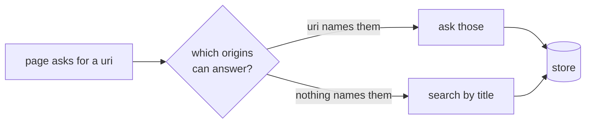

Scaffold. A mermaid smoke test follows.

```mermaid
flowchart LR
  A[page asks for a uri] --> B{which origins<br/>can answer?}
  B -->|uri names them| C[ask those]
  B -->|nothing names them| D[search by title]
  C --> E[(store)]
  D --> E
```
