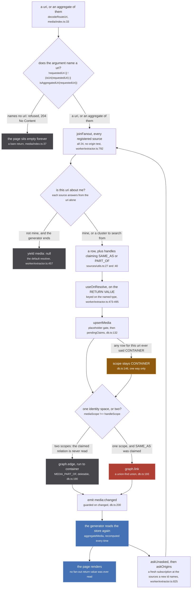
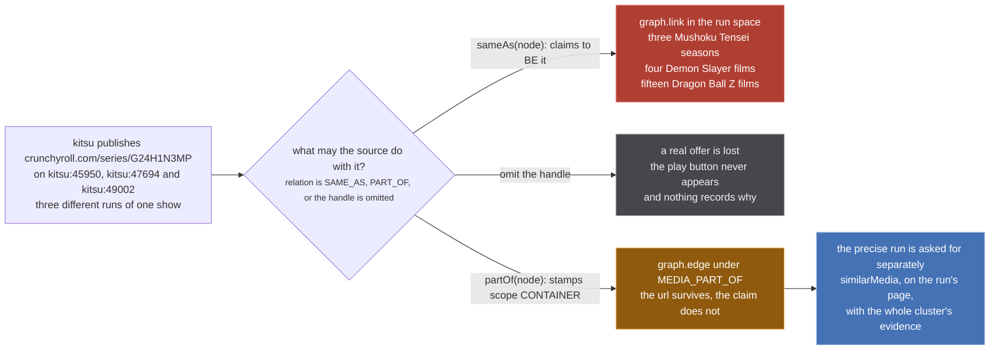
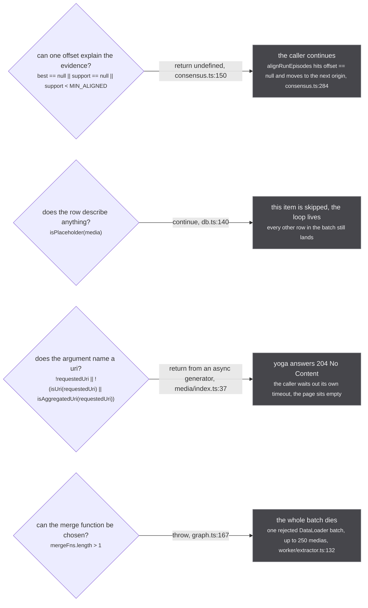

stub is handed one uri, `anilist:166873` or an aggregate like `ag:(anilist:166873,mal:52991)`, and has to answer with one media: a title, a cover, an episode list, and every place it can be watched. Twenty-four catalogue and streaming sources each hold a piece of that, none of them agrees with the others about what a season is, and the page has to render while they are still replying. Everything on this site follows from that, and from one call that has no inverse.

## The whole system, in ten facts

1. **Every source is asked, always.** The only gate on who joins is `if (fanout.joined.has(extractor)) return` (`src/worker/extractor.ts:747`), which never reads the uri, the origin or `supportedUris`, so all 24 built-in modules (`tests/unit/sources/index.test.ts:24`) get the app's own document replayed verbatim against their own private GraphQL server (`ctx.params.query`, `src/worker/extractor.ts:784`, loop at `:792`). [How the ask is built](/tldr/ask/)
2. **Self-selection is the only dispatch there is.** A source recognises itself by finding its own handle inside the uri it was handed, so most of the 24 answer `yield { media: null }` (`src/worker/extractor.ts:457`) and a source whose id another source contributes milliseconds later has already ended, which is why `askOrigins` re-opens a fresh subscription from the read rather than the page (`src/worker/extractor.ts:825`, called from `askUnasked`, `src/worker/resolvers/media/index.ts:64`).
3. **The answer path is a side channel: nothing comes back the way it went.** A source writes rows through an envelop `useOnResolve` hook fired on its resolver's return value (`src/worker/extractor.ts:473-495`), the store emits `media:changed`, and the app resolver discards every fan-out payload and re-reads the store (`src/worker/resolvers/media/index.ts:81-87`), so reading what a source returned tells you nothing about whether it answered.
4. **The selection set therefore decides what is STORED, not just what is drawn.** The hook keys on the resolved field's named type and never on the selection, so a `Media` row lands whole where two fields were asked for, while an unselected `episodes` is a resolver that never ran and `episodeInserter` never fires, so two pages holding the same run can disagree about whether it has any episodes at all. [The write path](/tldr/write/)
5. **A handle is an identity claim, not a link.** `sameAs(node)` asserts that this media and that one are the same thing (`src/sources/utils.ts:27`), and minting it for an id that names a SHOW is the single most expensive mistake available here: three Mushoku Tensei runs, four Demon Slayer films and fifteen Dragon Ball Z films each shared a single Crunchyroll `/series/` id (`src/sources/kitsu/extractor.ts:84-85`, `src/sources/justwatch/id.ts:53-54`).
6. **stub models a RUN and every catalogue models a SHOW** (`src/worker/resolvers/media/schema.gql:106-111`), so a source holding a show-level url has something true about the show and nothing it may honestly mint; `partOf` is the third option, returning a copy stamped `scope: 'CONTAINER'` whatever the node said (`src/sources/utils.ts:40`), which keeps the url and claims containment rather than identity. [What a source may claim](/tldr/sources/)
7. **The store decides the outcome, and the scope pair has three cells rather than two.** Cross-scope writes a `MEDIA_PART_OF` edge without reading the claimed relation at all, same-scope plus `SAME_AS` calls `graph.link`, same-scope plus `PART_OF` writes an edge too (`src/worker/store/db.ts:187-198`), so reading a source's relation as the outcome is wrong in half the table. [The write path](/tldr/write/)
8. **The scope ratchet is a one-way door toward CONTAINER.** `scopeOf(media.uri) === 'CONTAINER' ? 'CONTAINER' : media.scope ?? 'RUN'` runs before `graph.set` ever sees the value (`src/worker/store/db.ts:146`), because the merge function is last-write-wins and would otherwise let an incoming RUN overwrite a stored CONTAINER; a wrong CONTAINER costs a missing `SAME_AS` a later slice recovers, a wrong `SAME_AS` costs a merge nothing undoes.
9. **A page LISTING is a write path.** `Subscription.mediaPage` calls `fuzzyMergeMediaClusters` in the middle of assembling the page (`src/worker/resolvers/media/index.ts:127`), which reaches `linkSameMediaPairs` and its `graph.link` (`src/worker/store/db.ts:220`), so opening a listing permanently changes what every later read answers, including reads that never asked for a listing. [What the merge is allowed to do](/tldr/merge/)
10. **Four refusals look alike from outside and have four different blast radii**, from one value to a rejected DataLoader batch of 250 medias (`src/worker/extractor.ts:132`), and three of the four render an identical empty page. Their conditions are [below](#four-ways-to-say-no); every refusal in the codebase is indexed at [/tldr/rules/](/tldr/rules/).

`src/worker/store/db.ts:171`

> Guesses go on edges, which are deletable; only asserted sameness within one scope goes on a union.

## One uri, all the way round

*The spine only. The same flow at full width, with the batching, the claim resolution and the read split across four figures, is at [/start/whole-flow/](/start/whole-flow/); the colours are the site's permanence key, explained at [/start/reading-the-diagrams/](/start/reading-the-diagrams/).*

:::danger[graph.link has no inverse]
`graph.link` (`src/worker/store/graph.ts:279-291`) is a union-find union whose `union` ends with `components.delete(oldRoot)` (`src/worker/store/graph.ts:103`), destroying the record of which members came from which side. There is no `unlink`, no `split` and no disunion anywhere in `src/`: two welded media stay welded for the life of the worker, and unsubscribing, disabling a plugin or reloading the fan-out unwelds nothing. The only thing that clears it is `resetStore()` (`src/worker/store/db.ts:509-513`), which empties the whole store, is not exported through `./index.ts` and is never called by the app. Every gate, threshold, ratchet and refusal in this codebase exists to keep a wrong pair off that one line.
:::

## What a source may do with a show-level url

*The worked case is at `src/sources/kitsu/extractor.ts:84-85`. Only the third branch keeps the url without claiming identity, and it is why Kitsu (`src/sources/kitsu/extractor.ts:96`) and Watchmode (`src/sources/watchmode/extractor.ts:134`) contribute at all; the full account is at [/tldr/sources/](/tldr/sources/).*

## Four ways to say no

*Three of the four render an identical empty page, which is why every figure on this site distinguishes them on sight. The 204 is the only refusal that logs, at [/tldr/rules/](/tldr/rules/).*

## The numbers that decide things

| constant | value | where | what it decides |
| --- | --- | --- | --- |
| built-in source modules | 24 | `tests/unit/sources/index.test.ts:24` | the size of every fan-out; a connected plugin adds one per source it registers and joins the fanouts already open (`src/worker/extractor.ts:676-690`) |
| `SHOW_LEVEL_ORIGINS` | `new Set(['imdb'])` | `src/worker/store/db.ts:42` | an `imdb:` uri reads CONTAINER before any stored row is consulted |
| `CONFIDENT_TITLE_THRESHOLD` | 0.9 | `src/sources/catalogue-gate.ts:98` | below it a catalogue source mints nothing and simply never appears |
| `SEASON_DATE_WINDOW` | 45 days | `src/sources/catalogue-gate.ts:230` | title picks the show, date picks the run; neither axis alone is close to sufficient |
| `SIMILARITY_THRESHOLD` | 0.9 | `src/worker/store/fuzzy-merge.ts:7` | the pair gate on the one read that unions |
| `MIN_ALIGNED`, `backing.length < 2` | 2, 2 | `src/worker/store/consensus.ts:111`, `:234` | one witness is a coincidence: the offset and the episode loan are both refused |
| the exchange-rate bar | 1.0 wrong welds refused per correct merge lost | `src/sources/catalogue-gate.ts:83-84` | whether a proposed threshold, window or veto ships at all |
| DataLoader batches | 250 rows, 50 ms, `cache: false` | `src/worker/extractor.ts:129-134` | the blast radius of one `throw`, and the width of the race `pendingClaims` closes |
| row merge | scalars `val ?? existing[key]`, arrays longest-wins, tie to the incoming | `src/worker/store/graph.ts:387-400` | a stored value can never be corrected back to nothing, and nothing records which source contributed a field |

## Where the rest is

| want to know | read | it settles |
| --- | --- | --- |
| how one uri becomes 24 subscriptions, and how a source decides it is not being asked | [/tldr/ask/](/tldr/ask/) | the fan-out, self-selection, the re-ask lane, the request context and the backoff |
| what a source is allowed to mint, and what the search gate makes it prove first | [/tldr/sources/](/tldr/sources/) | `sameAs` against `partOf`, run ids, per-source scores, the 0.9 and 45-day gates |
| what happens between a resolver returning and a row existing | [/tldr/write/](/tldr/write/) | `upsertMedia`'s five gates, what each scope pair writes, `pendingClaims`, `upsertEpisodes` |
| how a cluster is found, aggregated and filtered, and why a read can write | [/tldr/read/](/tldr/read/) | `preferAttachedRun`, `aggregateMedia`, `Media.episodes`, filters, `exportStore` |
| when two clusters that share no handle are welded anyway | [/tldr/merge/](/tldr/merge/) | the fuzzy pass, its vetoes, the tiered consensus, alignment and windowing |
| how the precise run is asked for once `partOf` refused to guess it | [/tldr/similar/](/tldr/similar/) | the `similarMedia` funnel, its rules, the ask ledger and its brakes |
| the rules that hold across all of it, and the constants in one place | [/tldr/rules/](/tldr/rules/) | identity spaces, view against write, the refusal index, uri grammar, determinism |

Start at [the ask](/tldr/ask/): one uri, 24 subscriptions, and a source deciding for itself whether it is being asked.
