Two sources answer the same media page. One of them returns in 80ms and the other in 400ms. Nothing
about the show changed in between, and nothing about the request did, so the store must hold the same
thing either way.

It did not, for a long time, and the reason is one line of `graph.ts`:

`src/worker/store/graph.ts:100-103`

```ts
parent.set(oldRoot, newRoot)
const newSet = components.get(newRoot)!
for (const member of components.get(oldRoot)!) newSet.add(member)
components.delete(oldRoot)
```

A component is a `Set<string>`, and a `Set` iterates in insertion order. The absorbed root's members
are appended to the survivor's, so a component's member order is
`[surviving root's members..., absorbed root's members...]`, and which side survives is decided by
rank and by argument order in `union` (`graph.ts:91-98`). `graph.cluster` (`graph.ts:316-330`) walks
that set and pushes the rows in that order, so **every array of medias in this system arrives sorted
by which HTTP response landed first.**

The invariant is stated once, on the function that reads a cluster:

`src/worker/store/fuzzy-merge.ts:281`

> Everything the pass reads off a cluster. Nothing here may depend on the order of `cluster`.

## Where arrival order leaked in

```mermaid
flowchart TD
  NET["two extractor answers land, in whichever order the network gave them<br/><small>mediaInserter flushes on a 50ms timer, extractor.ts:128-132</small>"] --> LINK["graph.link(a, b, label)<br/><small>graph.ts:279-291</small>"]
  LINK --> ORDER[("component order<br/><small>the survivor's members, then the absorbed root's: graph.ts:101-102</small>")]
  ORDER --> D1{"which six titles is this cluster compared on?<br/><small>.slice(0, MAX_TITLES_PER_CLUSTER)</small>"}
  D1 -->|"sorting on score alone: a comparator returns 0 inside a tier and sort keeps insertion order"| X1["a different six per load<br/><small>ani.zip's short title sliced off, JustWatch never attaches</small>"]
  D1 -->|"fixed: orderWithinTier sorts each tier by the title itself, fuzzy-merge.ts:234"| D2{"does one cluster get one decision-cache entry?<br/><small>.sort(compareStrings).join(',')</small>"}
  D2 -->|"joining in selection order: a second entry per arrival order for a verdict that cannot differ"| X2["the wasm loop re-run after every merge<br/><small>and two slots burned against MAX_CACHED_DECISIONS</small>"]
  D2 -->|"fixed: every segment of the cacheKey is sorted, fuzzy-merge.ts:360"| D3{"which uri is graph.link's first argument?<br/><small>a.linkUri &lt; b.linkUri</small>"}
  D3 -->|"taking cluster&#91;0&#93;: the first argument was the component's first member"| X3["arrival order chose the link direction<br/><small>and the direction fixed the merged order</small>"]
  D3 -->|"fixed: the lower linkUri first, always, fuzzy-merge.ts:626"| D4{"in what sequence are the links applied?<br/><small>compareStrings(leftA, rightA) &#124;&#124; compareStrings(leftB, rightB)</small>"}
  D4 -->|"bucket order: the sequence decides root survival as much as the direction does"| X4["the same pairs, a different surviving root"]
  D4 -->|"fixed: links.sort before the apply loop, fuzzy-merge.ts:633"| D5{"which cluster id survives a union?<br/><small>sizeA &gt; sizeB &#124;&#124; (sizeA === sizeB && rootA &lt; rootB) ? idA : idB</small>"}
  D5 -->|"following the union-find's own root: that one follows rank and argument order"| X5["the card's DOM node replaced on every landing source"]
  D5 -->|"fixed: size, then the smaller root, graph.ts:249-263"| D6{"how long does the cluster say the run is?<br/><small>runLength(medias) ?? merged.episodeCount ?? null</small>"}
  D6 -->|"the reduce's first-non-null: a tier that disagrees with itself takes whoever arrived first"| X6["a run 11 episodes long on one load and 24 on the next"]
  D6 -->|"fixed: tieredConsensus over the multiset of claims, aggregate.ts:386"| OUT["a function of the SET of rows, not of their order"]
  classDef irrev fill:#b03f33,stroke:#e0796f,color:#ffffff
  classDef ratchet fill:#8f5a0e,stroke:#f2b45c,color:#ffffff
  classDef view fill:#4572b5,stroke:#8db0de,color:#ffffff
  classDef refuse fill:#46464b,stroke:#8b8c93,color:#f2f2f4
  class LINK irrev
  class OUT view
```



*Six independent fixes, one underlying fact. Every decision has two edges: the one marked `fixed:` is what the code does today and continues down the chain, and the other is what it used to do and where that ended. Only two nodes carry a permanence colour, because five of the six sites are pure functions and the sixth is `graph.link` itself, which is where the damage would have landed.*

The six, in the order the pipeline reaches them.

### 1. Which six titles a cluster is compared on

`selectTitles` (`fuzzy-merge.ts:256-279`) buckets a cluster's normalized titles by score, sorts the
buckets descending, flattens and takes `MAX_TITLES_PER_CLUSTER`, which is `6` (`fuzzy-merge.ts:12`).
Every title's score is a module constant per source, so a comparator on the score returns `0` for
every pair inside a tier, and `Array.prototype.sort` is stable.

`src/worker/store/fuzzy-merge.ts:240-250`

> Every title's `score` is a single module constant per SOURCE (0.9 jikan and ani.zip, 0.8 anilist,
> 0.5 crunchyroll, 0.3 the english metadata block, 0.25 watchmode, 0.2 the streaming catalogues), so
> a comparator on it returns 0 for every pair inside a tier and Array.prototype.sort leaves those in
> insertion order. Insertion order was cluster order, which is union-find component order, which is
> `[surviving root's members..., absorbed root's members...]` and therefore the order the extractors'
> HTTP responses landed in. The same cluster then kept a different six from one run to the next, and
> the six decide whether it merges at all: an already welded Mushoku Tensei component carries eight
> distinct normalized titles at 0.9, and whether ani.zip's short "mushoku tensei" is among the six is
> the whole difference between JustWatch attaching and not. With the long titles only,
> maxPossibleSimilarity measures 0.389, 0.359 and 0.326 against them and refuses the pair before the
> matcher even runs.

The fix is one line, `orderWithinTier` at `fuzzy-merge.ts:234`, and the choice of ordering was
measured rather than argued. Over the manami database, 41537 records:

| ordering | A: two shows welded by a junk label (lower is better) | B: one show split, keeping a title in common (higher) | C: a one-title streaming cluster attaching (higher) |
| --- | --- | --- | --- |
| arrival order | 64.5% | 94.9% | 56.0% |
| title ascending | 69.6% | 99.9% | 70.0% |
| longest first | 53.8% | 100.0% | 19.9% |
| shortest first | 82.7% | 100.0% | 98.7% |

Arm A is 1547 pairs, B is 6502 cases, C is 12399. Title ascending is what shipped: it costs five
points on A and buys five on B and fourteen on C, and the reason both recall arms rise is the whole
point of the page.

`src/worker/store/fuzzy-merge.ts:221-230`

> Both recall arms rise for the same reason: an ordering applied identically to both sides cannot drop
> a title one side keeps, which is exactly what arrival order was doing to one split cluster in twenty.
>
> [...] Relying on a random six to drop a third of the wrong welds is relying on luck for correctness,
> and it is what made the same two shows merge on one load and not the next.

The same paragraph closes a second door in the same function: the dedupe is a `Map` keyed on the
normalized title rather than a sort followed by a dedupe, because *a dedup over a sorted array keeps
whichever copy the sort left first, and inside a tier that is again arrival order*
(`fuzzy-merge.ts:252-254`).

### 2. The decision cache key

`decide` (`fuzzy-merge.ts:585-592`) memoises `sameShow` on `pairKey`, which is the two profiles'
`cacheKey` sorted against each other (`fuzzy-merge.ts:577-578`). The key itself sorts each of its
five segments (`fuzzy-merge.ts:360`).

`src/worker/store/fuzzy-merge.ts:344-349`

> The key has to identify the SET of titles, because that is all sameShow's verdict depends on: its
> title comparison is an existential double loop, so no ordering of the same six can change the
> answer. Sorting here keeps one logical cluster on ONE cache entry, where joining them in
> selection order once wrote a second entry per arrival order for a pair whose verdict could not
> differ, re-ran every pair through the wasm loop on the pass after any merge, and counted twice
> toward the MAX_CACHED_DECISIONS wipe that then threw away the entries still worth keeping.

`MAX_CACHED_DECISIONS` is `50_000` (`fuzzy-merge.ts:13`) and the wipe is a full `clear()` at
`fuzzy-merge.ts:607`. This is the one site where arrival order cost only work rather than a wrong
answer, and it is on the list because the work is the wasm alignment loop the whole pass spends its
time in.

### 3 and 4. The link direction, and the link sequence

These two are one decision made twice, and they get the second figure below to themselves. The
argument order handed to `graph.link` decides which root survives a rank tie; the sequence the links
are applied in decides it just as much, because a link that lands first changes the sizes and ranks
the next one is judged against.

### 5. Which cluster id survives

`graph.componentId` mints a uuid per component and `carryComponentId` decides which of two ids lives
through a union.

`src/worker/store/graph.ts:246-248`

> Which id survives a union is decided here by SIZE and then by the smaller root, never by the
> union-find's own choice of root: that one follows rank and argument order, so an id that followed
> it would change with the order two sources happen to land in.

The related fix is one level up, in the caller. `_id` used to be minted against the smallest member
uri:

`src/worker/store/aggregate.ts:290-292`

> Keyed on the union-find ROOT of the cluster's identity space, never on a member: the smallest uri
> moved whenever a member sorting before it landed, and the container cut in `findAllAggregatedMedia`
> handed the same cluster a second id. Any member maps to the same root.

The consequence was on screen: `tests/unit/worker/store/stable-id.test.ts:1-5` records that a cluster
gaining a member sorting before its current smallest (`anilist:108465` gaining `anidb:14758`) changed
its `_id`, so the client keyed on `_id` replaced the card's DOM node every time a source landed.

### 6. How long the run is

Every scalar in `aggregateMedia`'s reduce is a first-non-null pick in score order, which is right for
a spelling and wrong for a number:

`src/worker/store/aggregate.ts:378-381`

> It cannot answer worse than the reduce would: the tier it reads is the same top score the sort
> puts first, so the two differ only when that tier disagrees with ITSELF, where the reduce takes
> whichever row arrived first. Cluster order is union-find component order, which is HTTP arrival
> order, so that case is not merely arbitrary, it is non-deterministic between loads.

`runLength` (`consensus.ts:62-63`) hands the cluster's `(episodeCount, score)` pairs to
`tieredConsensus` (`consensus.ts:36-59`), which takes the top score tier, counts support per value,
and breaks a count tie by taking the larger value. Nothing in it reads position. Measured over the
100 cluster snapshot in `dist-seed` on 2026-09-09: identical to the reduce in 100 of 100, *because
`mal` is the only member of the 0.9 tier until anizip's media row carries a score*
(`aggregate.ts:383-384`). It was changed anyway, because "identical today" and "cannot differ" are
different properties and only the second one survives a new source.

### The seventh, and the earliest

One more site sits before the store, in the DataLoader that feeds it. `mediaInserter` dedupes handle
pairs on a three-part key including the relation:

`src/worker/extractor.ts:109-112`

> The relation rides all the way to the store, because it is the store that acts on it: SAME_AS
> unions the cluster and PART_OF hangs a directed edge that unions nothing. Deduping on the RELATION
> too, not just the pair, so one media may hold both kinds for one origin without either silently
> winning on arrival order.

The key is `` `${media.uri}\0${handle.node.uri}\0${handle.relation}` `` (`extractor.ts:119`). Drop the
relation from it and one media holding both a SAME_AS and a PART_OF for the same origin keeps
whichever the source listed first.

## The loop the fuzzy pass fed itself

Sites 1, 3 and 4 are not three independent bugs. They were a cycle, and the comment that fixes it
says so:

`src/worker/store/fuzzy-merge.ts:619-625`

> The link names the two components by their `linkUri`, the lowest uri each holds in its own
> scope, and names them in a fixed order. Taking cluster\[0] instead named them by union-find
> component order, and the ARGUMENT order is what graph.link hands to union(), which keeps the
> first argument's root on a rank tie (two fresh singletons, the common case) and appends the
> absorbed members after it. So arrival order chose the link direction, the link direction
> fixed the merged component's order, and that order chose which title the next pass sliced
> off: the loop this pass both consumed and fed.

```mermaid
flowchart TD
  NET["which extractor response landed first"] --> D1{"which uri is graph.link's first argument?<br/><small>a.linkUri &lt; b.linkUri</small>"}
  D1 -->|"cluster&#91;0&#93;: the component's first member, so the network chose"| ROOT["the first argument's root survives<br/><small>rank tie, two fresh singletons: graph.ts:95-98</small>"]
  ROOT --> MERGED[("the merged component's order is now fixed<br/><small>survivor's members, then the absorbed root's</small>")]
  MERGED --> D2{"which titles does the NEXT pass keep?<br/><small>.slice(0, MAX_TITLES_PER_CLUSTER)</small>"}
  D2 -->|"the tie is sliced in insertion order, which is that same component order"| SIX["a different six titles"]
  SIX --> D3{"can the next pair still match?<br/><small>maxPossibleSimilarity(titleA, titleB) &lt; SIMILARITY_THRESHOLD</small>"}
  D3 -->|"short title kept: exact match at 1.0"| MERGE["JustWatch attaches"]
  D3 -->|"short title sliced: upper bound 0.389, 0.359, 0.326 against 0.9"| REFUSE["refused before the matcher runs"]
  MERGE --> NET
  REFUSE --> NET
  D1 -->|"the fix: the lower linkUri first, whatever landed first"| FIXED["the same direction every load"]
  classDef irrev fill:#b03f33,stroke:#e0796f,color:#ffffff
  classDef ratchet fill:#8f5a0e,stroke:#f2b45c,color:#ffffff
  classDef view fill:#4572b5,stroke:#8db0de,color:#ffffff
  classDef refuse fill:#46464b,stroke:#8b8c93,color:#f2f2f4
  class ROOT irrev
  class REFUSE refuse
```



*The cycle is the whole point: each pass wrote the component order that the next pass read. `SIMILARITY_THRESHOLD` is `0.9` at `fuzzy-merge.ts:7` and `MAX_TITLES_PER_CLUSTER` is `6` at `:12`.*

The fix has two halves because the cycle has two entry points. `links.push` fixes the direction
(`fuzzy-merge.ts:626`), and the sort fixes the sequence:

`src/worker/store/fuzzy-merge.ts:631-632`

> ...and the SEQUENCE of unions decides root survival just as much as their direction does, so the
> links are applied in an order the bucket cannot influence either.

Note what `linkUri` is, because it is not `cluster[0]` and it is not `key` either. It is the lowest
uri the cluster holds *whose scope is the profile's scope* (`fuzzy-merge.ts:286-290`), which matters
for a mixed cluster; `key` is the lowest uri overall (`fuzzy-merge.ts:283`). Both are sorts over the
member set, so both are order independent, and they can differ.

:::danger
**Every one of these six fixes protects the same irreversible operation.** `graph.link`
(`graph.ts:279-291`) is a union-find union with no inverse: `union` ends with
`components.delete(oldRoot)` (`graph.ts:103`), which destroys the record of which members came from
which side, and there is no `split`, `unlink` or `unmerge` anywhere in the repo. `graph.set`
(`graph.ts:155-191`) is last-write-wins on scalars and longest-wins on arrays, with no per-source
layer and no way to ask what a given origin said. So an arrival order that produces a wrong weld does
not produce a wrong weld *this load*: it produces one for the life of the worker, and a reload that
would have got it right cannot undo it. Only `resetStore` (`db.ts:509`) clears any of it, and that is
tests only.
:::

## Not the host's locale either

Every comparator in `fuzzy-merge.ts` is code-unit order, not `localeCompare`, and that is deliberate
for the same reason:

`src/worker/store/fuzzy-merge.ts:134-135`

> Code unit order rather than localeCompare, which is locale dependent: the point of every comparator
> in this file is that two runs agree, and a collation that reads a locale off the host does not.

`compareStrings` is `(a, b) => a < b ? -1 : a > b ? 1 : 0` at `fuzzy-merge.ts:136`, and `db.ts:96`
carries an identical copy for the same purpose. The side effect worth knowing: latin code points sort
below CJK ones, so a tie inside a title tier goes to the english titles, and the measured table above
says that is the arm that pays (`fuzzy-merge.ts:225-227`).

`toAggregatedUri` does use `localeCompare`, which is a different producer with a different job. See
[The uri grammar](/invariants/uris/).

## How it is pinned

`tests/unit/worker/store/fuzzy-merge.test.ts:275` runs the whole Mushoku Tensei fixture through 24
permutations and asserts exactly one outcome. Everything it shuffles is something the network can
actually produce: the member order, the handle order, and which end of each handle is the `mediaUri`.

`tests/unit/worker/store/fuzzy-merge.test.ts:267-274`

> Every ordering in this test is one an extractor response can actually produce: the member order of a
> union-find component is `[surviving root's members..., absorbed root's members...]`, so it is decided by
> which handle link was made first and with which argument first, i.e. by which HTTP response landed
> first. Measured before the fix: the component order `[mal, mal, anizip]` leaves ani.zip's two titles at
> positions 7 and 8 of the tied block, both are sliced off, and the only comparison left for
> "mushoku tensei" is against the long renderings, whose upper bound is 0.389, 0.359 and 0.326 against
> SIMILARITY_THRESHOLD 0.9. Any other order keeps the short name and the pair matches exactly. Same
> inputs, opposite result, chosen by the network.

The shuffle is seeded (`mulberry32(20260829)`), and the comment at `:224-226` says why: *an unseeded
shuffle that only sometimes picks the arrival order that flips it is a flake, and a flake here reads
as noise rather than as the regression it is.* The companion test at `:311` shuffles the profile's
inputs 50 times and asserts both `profile.titles` and `profile.cacheKey` are unchanged.
`stable-id.test.ts:86` pins the id survivor: *the larger component, ties to the smaller root,
whichever side claimed*.

## What is still read in arrival order

The six fixes above cover every decision that can reach `graph.link`, and one more that decides a
number on screen. They do not cover the order `aggregateMedia` presents a cluster's list fields in.
No comment in the tree claims they do, so this is a gap rather than a contradiction, and it is worth
drawing because it is the same shape the six started as.

```mermaid
flowchart TD
  CL[("the cluster, in component order")] --> SORT["sorted<br/><small>.sort((a, b) =&gt; (b.score ?? 0) - (a.score ?? 0)) at aggregate.ts:319, a stable sort</small>"]
  SORT --> D1{"do two members share the top score?<br/><small>(b.score ?? 0) - (a.score ?? 0)</small>"}
  D1 -->|"no tie: the score decides and order cannot"| DET["the same aggregate every load"]
  D1 -->|"a tie: a stable sort keeps component order"| D2{"which field is being merged?<br/><small>byScore, then removeDuplicatesByField('title', ...)</small>"}
  D2 -->|"episodeCount: read off the multiset by tieredConsensus"| DET
  D2 -->|"titles, descriptions, covers: byScore is stable too"| ARR["titles&#91;0&#93; is whichever equal-scored title arrived first<br/><small>aggregate.ts:392</small>"]
  ARR --> Q["crunchyroll's search rungs<br/><small>const primary = knownTitles&#91;0&#93;, crunchyroll/extractor.ts:467</small>"]
  Q --> D3{"does the gate's verdict follow the rung?<br/><small>bestTitleScore(knownTitles, series.title)</small>"}
  D3 -->|"scored against EVERY title the cluster knows: no"| DET
  D3 -->|"which candidates the search returns: yes"| VARY["a different candidate set, the same gate"]
  classDef irrev fill:#b03f33,stroke:#e0796f,color:#ffffff
  classDef ratchet fill:#8f5a0e,stroke:#f2b45c,color:#ffffff
  classDef view fill:#4572b5,stroke:#8db0de,color:#ffffff
  classDef refuse fill:#46464b,stroke:#8b8c93,color:#f2f2f4
  class DET,ARR,VARY view
```



*Everything in this figure is a view, computed per read, so nothing here can weld anything by itself. The two paths that reach `DET` from a tie are what bounds it: `episodeCount` is read off the multiset, and the search gate scores against the whole title set rather than against the rung it asked with.*

The chain, verified against the working tree at `883aec9`:

- `aggregateMedia` sorts the members by score, `[...medias].sort((a, b) => (b.score ?? 0) - (a.score ?? 0))`
  (`aggregate.ts:319`). `Array.prototype.sort` is stable, so members sharing a score stay in cluster
  order, which is component order.
- The reduce concatenates `titles` in that order (`aggregate.ts:341`), and `byScore`
  (`aggregate.ts:18-20`) re-sorts by each title's own score with another stable sort, so a tie inside
  a title score tier still reads member order.
- `getFirstTitle` is `media?.titles?.[0]?.title` (`src/sources/utils.ts:173-174`), and Crunchyroll's
  search path builds its query rungs from it: `const primary = knownTitles[0]`
  (`crunchyroll/extractor.ts:467`), capped at `MAX_SEARCH_QUERIES = 4` (`:370`).

So which strings Crunchyroll searches with can vary between two loads that saw the same rows in a
different order. What cannot vary is the verdict on what comes back: `bestTitleScore(knownTitles, ...)`
scores every candidate against every title the cluster knows (`crunchyroll/extractor.ts:479-480`),
and [the search gate](/sources/search-gate/) then requires the date axis to agree independently. The
leak is in what gets asked, not in what gets believed, and none of it reaches a union without
clearing the gate.

The shape is exactly the one the six fixed sites started as: a tie broken by a stable sort over a set
the network ordered. The difference is only in what sits downstream, and downstream of this one there
is a gate rather than a union.

## Where to go next

- [The fuzzy merge](/merge/fuzzy-merge/) for the pass that four of these six sites live in.
- [The graph](/write/graph/) for `union`, `link` and `carryComponentId` in full.
- [Consensus, not a sum](/merge/consensus/) for `tieredConsensus` and why a tie goes to the larger value.
- [Aggregating a media](/read/aggregate-media/) for the reduce, `byScore`, and the `_id` that is minted during a read.
- [A view or a write](/invariants/view-or-write/) for which of these outcomes can be walked back and which cannot.
