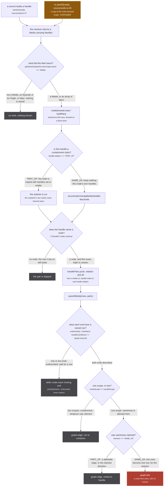
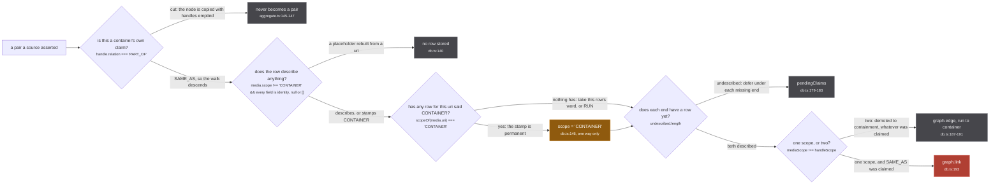

`src/worker/store/db.ts:19-20`

> A handle is an identity claim: linking it says "this media and that one are the same thing". An
> IMDb `tt` id is the series, so every season of a show carries the same one and the claim is that
> they are all one media

That is the whole page. Everything below is what follows from it.

A handle is not a link, not a cross-reference and not a "see also". A handle with
`relation: 'SAME_AS'` is a source asserting that the row carrying it and the row it names are the
same work, and the store acts on that assertion by unioning the two into one cluster. The union is a
union-find `union`, and there is no counterpart anywhere in `src/`: no `unlink`, no `split`, no
`unmerge`. Grep the tree and the only hit is a comment warning you about it.

:::danger
**`graph.link` has no inverse.** `src/worker/store/graph.ts:279-291` calls `connect` then
`uf.union(a, b)`, and `union` at `graph.ts:82-105` ends with `components.delete(oldRoot)`: the record
of which members came from which side is destroyed at that line. Once two media are welded they stay
welded for the life of the worker. The only thing that undoes it is `graph.clear()`
(`graph.ts:363-375`), whose only caller is `resetStore`, which is tests only.

`graph.set` is no better in the other direction: `lastWriteLongestArray` (`graph.ts:388-400`) is
scalars last-write-wins and arrays longest-wins, with no per-source layer and no provenance, so the
previous value of a field is simply gone.

`src/worker/resolvers/media/schema.gql:80-85`

> The handle names THIS run. The only relation that unions clusters, in `upsertMedia`, and the union
> has NO INVERSE: once two media are welded they stay welded for the session.
>
> Minting this for an id that names a SHOW is the single most expensive mistake available here. It
> merged three Mushoku Tensei seasons, four Demon Slayer films and fifteen Dragon Ball Z films, each
> time because one id was the only thing a source could offer and the only relation was this one.
:::

## The two relations, and the one that costs

There are exactly two, `src/worker/resolvers/media/schema.gql:79-97`, and a source picks between them
with two one-line constructors in `src/sources/utils.ts`:

```ts
export const sameAs = (node: GQLMedia): GQLMediaHandle => ({ node, relation: 'SAME_AS' })                                    // :27
export const partOf = (node: GQLMedia): GQLMediaHandle => ({ node: { ...node, scope: 'CONTAINER' }, relation: 'PART_OF' })   // :40
```

`sameAs` is the default, and `src/sources/utils.ts:10-16` says why the default is the dangerous one:

> `makeMedia({ handles: [media] })` still means what it always meant, because SAME_AS is what all 49
> producer sites were already asserting. Only a producer that means something else has to say so, with
> `partOf(...)`. The BREAKING half of this refactor is deliberately on the reading side, where a
> missed site shows nothing rather than throwing.

`partOf` does two things at once, and the second is easy to miss. `src/sources/utils.ts:35-38`:

> THIS IS THE SCOPE STAMP. A PART_OF target is by definition a container of this run, so the node goes
> out as a copy scoped CONTAINER whatever it said, and the store then keeps it out of every run's
> identity space for good (scope is sticky toward CONTAINER there). The input is left untouched.

So `partOf` is not merely a weaker claim. It also marks the node it names as a CONTAINER, and a
CONTAINER can never enter a run's identity space again, from any source, for the life of the worker.

## A handle's whole journey



*Six hops between a constructor and a union, and four of them can end the journey. Only one node on this figure is rose, and only one branch of one decision reaches it.*

Hop by hop, with the file behind each:

1. **The mint.** `sameAs` or `partOf` in `src/sources/utils.ts:27` and `:40`, or a bare media in a
   handle list, which `makeMedia` silently promotes to SAME_AS.
2. **`useOnResolve`.** `src/worker/extractor.ts:473-495`. It fires on the resolver's **return value**,
   not on the selection set: `getNamedType(info.returnType).name === 'Media'` decides, and a falsy
   `result` falls through all three branches without storing anything and without throwing.
3. **The unwrap.** `recursivelyUnwrapMediaHandles`, `src/worker/store/aggregate.ts:135-152`, called at
   `extractor.ts:107`. Every node becomes a row, and the walk stops at a PART_OF node.
4. **The pair loop.** `src/worker/extractor.ts:113-125`, deduped on a three-part key that includes the
   relation. `extractor.ts:109-112`:

   > The relation rides all the way to the store, because it is the store that acts on it: SAME_AS
   > unions the cluster and PART_OF hangs a directed edge that unions nothing. Deduping on the RELATION
   > too, not just the pair, so one media may hold both kinds for one origin without either silently
   > winning on arrival order.

5. **`upsertMedia`.** `src/worker/store/db.ts:132-201`. The claim waits for a row
   (`db.ts:179-183`), the scope pair is read (`db.ts:185-186`), and the relation the source asked for
   is honoured only when both ends sit in the same scope.
6. **`graph.link`.** `src/worker/store/graph.ts:279-291`, reached from exactly one line,
   `db.ts:193`.

Note what step 5 does to step 1. **A source's claimed relation is advisory.** When the two scopes
differ, `db.ts:187-191` writes a containment edge and never looks at `relation` at all, so a source
that claims SAME_AS across scopes is demoted in silence. `db.ts:166-169` is the table, verbatim:

```
RUN x RUN                claimed SAME_AS unions in the run space, PART_OF is an edge
RUN x CONTAINER          an edge media -> handle, whatever was claimed
CONTAINER x RUN          an edge handle -> media: the edge always runs from run to container
CONTAINER x CONTAINER    claimed SAME_AS unions in the container space, PART_OF is an edge
```

and `db.ts:171` states the rule the table implements: *"Guesses go on edges, which are deletable;
only asserted sameness within one scope goes on a union."*

## The three incidents

Every defence in the store was written after one of these. They are not hypotheticals; each is a
measurement recorded in the file that now prevents it.

```mermaid
flowchart TD
  subgraph mt["Mushoku Tensei: three seasons welded"]
    A1["five sources emit the same imdb tt id<br/><small>tvmaze, trakt, simkl, omdb, watchmode</small>"] --> A2{"does that id name a run, or the show?<br/><small>an IMDb tt id is the series: every season carries it</small>"}
    A2 -->|"once, as SAME_AS, from any one of the five"| A3["season 1 and season 3 in one cluster<br/><small>the bare crunchyroll series id and the bare tvmaze show id, fuzzy merged in on the search path</small>"]
    A2 -->|"today: the origin decides the scope, before any row is read"| A4["SHOW_LEVEL_ORIGINS.has(originOf(uri))<br/><small>db.ts:42, exactly one entry: imdb</small>"]
  end
  subgraph ds["Demon Slayer and Dragon Ball Z: films welded"]
    B1["a JustWatch offer carries a crunchyroll deep link<br/><small>extractContentId reads /series/&lt;id&gt; and no other shape</small>"] --> B2{"is a crunchyroll id worth minting as an identity?<br/><small>mappedOrigin === 'cr' ? undefined : rawContentId</small>"}
    B2 -->|"before: the bare series id, as SAME_AS"| B3["four Demon Slayer films on one id, fifteen Dragon Ball Z films on another<br/><small>measured on kitsu, 2026-09-04</small>"]
    B2 -->|"today: refused outright, then demoted rather than dropped"| B4["contentId = rawContentId, relation = 'PART_OF'<br/><small>justwatch/extractor.ts:386-391: the url survives, the claim does not</small>"]
  end
  subgraph hbo["HBO Max: 22 unrelated titles welded"]
    C1["an offer url shaped /video/watch/&lt;uuid&gt;"] --> C2{"which path segment is the title's id?<br/><small>parts[0] === 'video' ? parts[2] : parts[1]</small>"}
    C2 -->|"a fixed index: parts[1] is the literal string watch"| C3["22 titles handed the identical hbo:watch handle<br/><small>22 shows in one cluster, permanently, for the session</small>"]
    C2 -->|"the shape tested per host: the uuid"| C4["one handle per title<br/><small>justwatch/id.ts:139-141</small>"]
  end
  classDef irrev fill:#b03f33,stroke:#e0796f,color:#ffffff
  classDef ratchet fill:#8f5a0e,stroke:#f2b45c,color:#ffffff
  classDef view fill:#4572b5,stroke:#8db0de,color:#ffffff
  classDef refuse fill:#46464b,stroke:#8b8c93,color:#f2f2f4
  class A3,B3,C3 irrev
  class A4,B4 ratchet
  class C4 refuse
```



*Three different id shapes, one failure. In every case the id named a bigger thing than the row carrying it, and SAME_AS was the only relation available to say anything at all.*

**One: a show id in a run's cluster.** `src/worker/store/db.ts:7-13`:

> Two identity spaces, one per scope. A run's SAME_AS unions in the first, a container's in the second,
> and nothing ever unions across them: a show-level id entering a run's cluster is what welded Mushoku
> Tensei season 1 to season 3 on the live site (the bare crunchyroll series id and the bare tvmaze
> show id were fuzzy merged into season 1's cluster on the search path, and season 3's media path then
> asserted sameness through one of them; `graph.link` is a union-find with no inverse).

The fix is `SHOW_LEVEL_ORIGINS` at `db.ts:42`, a set with exactly one member, `'imdb'`. It is read
first in `scopeOf` (`db.ts:91-92`), ahead of the stored row, so an `imdb:` uri is a CONTAINER whatever
row it arrived in. `db.ts:39-41` is explicit that it stays even though every producer has migrated:

> It stays as a backstop rather than being deleted with the producers migrated: it is one Set lookup,
> and it means a source that starts emitting a bare imdb id again is corrected here instead of
> welding every season of a show.

**Two: a collection id on a film.** `src/sources/justwatch/id.ts:49-54`:

> Crunchyroll is refused OUTRIGHT. `extractContentId` reads a crunchyroll id from one url shape only,
> `/series/<id>`, so every id that reaches here is a SERIES id: it names a container that holds every
> run of the show and, on Crunchyroll, the show's FILMS too, since a film belonging to a running series
> is published under the series. The extractor demotes that id to PART_OF itself; a film whose offer
> was a /series/ url used to take the bare container id, the same weld measured on kitsu 2026-09-04,
> where four Demon Slayer films and fifteen Dragon Ball Z films each shared one /series/ id.

The whole of `providerContentId` (`justwatch/id.ts:59-60`) is one ternary,
`mappedOrigin === 'cr' ? undefined : rawContentId`, and it carries a fourteen-line argument above it.

**Three: a path segment mistaken for an id.** `src/sources/justwatch/id.ts:88-93`:

> Measured 2026-09-01 across 50 searches. Four of the nine mapped services had moved: Prime Video to
> watch.amazon.com with the id in a query param, Disney+ to /browse/entity-&lt;uuid&gt;, fubo to
> /welcome/series/&lt;id&gt;, and HBO Max to /video/watch/&lt;uuid&gt; for a series. That last one is the reason
> for the shape tests rather than a fixed index: `parts[1]` of an HBO series url is the literal string
> "watch", which handed 22 unrelated titles the identical `hbo:watch` handle. A handle is a union with
> no inverse, so that is 22 shows merged into one cluster, permanently, for the session.

This is the incident worth internalising, because nothing about it looked like a bug. HBO restyled a
url; `extractContentId` kept returning a string; every offer still minted a handle. The failure is
silent by construction, which is why `justwatch/id.ts:84-86` says every branch in that function is
measured against a real offer url rather than assumed.

## The five defences in series



*Everything the store does around `graph.link` exists to keep the wrong pair from reaching that line. Four of the five gates end a pair's journey; the third does not refuse anything, it changes what the fifth sees.*

**1. The PART_OF subtree cut.** `src/worker/store/aggregate.ts:145-147`. The walk stops at a PART_OF
node, and the reason is the sharpest paragraph in the store, `aggregate.ts:115-125`:

> THE WALK STOPS AT A PART_OF NODE, and that is the load bearing part. A PART_OF node is a CONTAINER,
> usually a show, and its own handles are claims about the CONTAINER rather than about the run that
> pointed at it. Carrying them through means two different runs, each hanging PART_OF off the same
> show, each contribute a SAME_AS pair rooted at that show:
>
>     season 1 -PART_OF-> cr:SERIES -SAME_AS-> kitsu:42323
>     season 3 -PART_OF-> cr:SERIES -SAME_AS-> kitsu:49002
>
> and `cr:SERIES` is one uri, so the union-find puts kitsu:42323 and kitsu:49002 in one cluster. Two
> seasons welded, with no inverse, by a relation whose entire purpose is not to weld.

The cut is enforced by the copy, not by a flag: `aggregate.ts:128-129` notes that returning the node
untouched would leave `handles` populated for the pair loop in `worker/extractor.ts` to read, so the
subtree has to be cut at the walk rather than at the loop.

**2. The placeholder gate.** `db.ts:104-108` and `db.ts:140`.

```ts
const IDENTITY_FIELDS = new Set(['uri', 'origin', 'id', 'scope'])
const isPlaceholder = (media: Media) =>
  media.scope !== 'CONTAINER'
  && Object.entries(media).every(([field, value]) =>
    IDENTITY_FIELDS.has(field) || value == null || (Array.isArray(value) && value.length === 0))
```

A row rebuilt from a uri knows nothing except the uri, and `db.ts:99-103` says a uri says nothing
about what it names. The row is not stored, so the claim naming it falls to gate 4 and waits. The
first clause is the interesting one: a row carrying nothing except `scope: 'CONTAINER'` is **not** a
placeholder, because a source's own reading of the id is information.

**3. The scope ratchet.** `db.ts:146`. Not a refusal at all, which is why it hangs differently on the
figure: it changes the scope the pair will be read under at gate 5.

:::caution
**RUN to CONTAINER is a one-way door.** `db.ts:142-145`:

> Scope is STICKY toward CONTAINER: once any row for this uri said CONTAINER, a later row that says
> RUN or says nothing does not flip it back. The failure with no inverse is a wrong SAME_AS, and the
> failure of a wrong CONTAINER is a missing SAME_AS, which a later slice can recover. The merge
> function alone would let an incoming RUN overwrite it (scalars are last-write-wins).

That is the exchange rate stated in one sentence. A wrong CONTAINER costs a link that a later slice
can recover; a wrong SAME_AS costs a merge that nothing can undo. Pinned by
`tests/unit/worker/store/container-scope.test.ts:80`, *"CONTAINER is sticky: a later RUN row for the
same uri does not flip it back"*.
:::

**4. `pendingClaims`.** `db.ts:113-130` and `db.ts:179-183`. A claim whose ends have no row yet is
deferred under each missing end rather than applied, because the relation is derived from both scopes
and a uri with no row has none. `db.ts:115-123`:

> The relation is derived from BOTH scopes, and a uri with no row has none. It used to read as RUN,
> which let a run union with a show whose own row was still in flight: a media page reloaded cold
> fans out to every source at once, each answers with the aggregated uri's siblings rebuilt as bare
> SAME_AS nodes, and whichever landed first decided. A RUN row for `cr:G24H1N3MP` minted by justwatch
> milliseconds before crunchyroll said CONTAINER was a RUN x RUN union, the CONTAINER that followed
> flipped the scope and not the union, and the same graph then answered differently depending on
> which member it was entered through. A claim now waits for the row and is applied when it lands.

Read that against gate 3 and the pair is obvious: the ratchet fixes the scope going forward, and it
cannot fix a union that already happened. `pendingClaims` exists so the union is never decided by
which source's HTTP response arrived first.

**5. The cross-scope demotion.** `db.ts:187-191`. Two scopes means an edge, in the direction run to
container, with the claimed relation discarded. Pinned twice in
`tests/unit/worker/store/container-scope.test.ts`: `:28` for a run claiming SAME_AS to a container
(the cluster stays a singleton) and `:41` for a container claiming a run (*"a container claiming a run
gets the edge flipped to run from the run"*).

## Not every union comes from a handle

The chain above is the main road and it is not the only one. Two callers reach `graph.link` without a
handle ever existing, and both are worth knowing about before you conclude that auditing the sources
audits the store.

- **`linkSameMediaPairs`, `db.ts:216-224`.** Its only caller is `fuzzyMergeMediaClusters`
  (`fuzzy-merge.ts:664`), and it unions two media that no handle connects, on the strength of a title
  match. It has exactly one refusal, at `db.ts:218`, and it did not have that until 2026-09-05:

  ```ts
  if (scopeOf(uriA) === 'CONTAINER' || scopeOf(uriB) === 'CONTAINER') continue
  ```

  `db.ts:206-212`:

  > IT GOES THROUGH THE SAME REFUSAL `upsertMedia` DOES, and did not until 2026-09-05. Every guard the
  > handle refactor added lives in `upsertMedia`'s loop, so this path, whose only caller is
  > `fuzzyMergeMediaClusters`, was a raw `graph.link` with no relation, no demotion and no check: a
  > show-level origin that could never be minted as SAME_AS by any source could still be welded here by
  > a title match.
  >
  > There is no PART_OF fallback to demote to, because there is no handle and nothing asserted a
  > containment. A pair with a CONTAINER on either side is simply refused, which subsumes the
  > show-level backstop: those origins read as CONTAINER.

  Note the asymmetry with gate 5. In `upsertMedia` a cross-scope claim is demoted to an edge; here it
  is dropped. The reason is in the comment: a title match asserts nothing about containment, so there
  is nothing honest to demote to.

- **`similar-consumer.ts:255`.** `await upsertMedia([], [{ mediaUri: ask.runUri, handleUri:
  result.media.uri, relation: 'SAME_AS' }])`. No rows, one hand-built `Claim`, no `sameAs()` call and
  no `useOnResolve` hop. It still passes gates 2 through 5, because those live inside `upsertMedia`,
  which is the point of putting them there.

## The rule a source should carry away

Minting an identity is a one-way action, so the test is not "is this probably the same thing" but
"could a second observer reproduce this id for this exact run". `src/sources/kitsu/stream-id.ts:57-59`
puts it in the form that generalises:

> AN ALLOWLIST, because minting has no inverse. `graph.link` unions and never unlinks, so a segment
> nobody has measured must refuse rather than mint: the cost of refusing a good link is a missing row,
> and the cost of minting a bad one is a permanent merge. A denylist has the wrong default for that.

The same reasoning is why `watchmode` was switched from SAME_AS to PART_OF rather than deleted,
`src/sources/index.ts:32-38`:

> Watchmode was DISABLED on 2026-09-04 and is back on 2026-09-05, unchanged in what it knows and
> changed in what it claims. Every provider handle it mints is show level, because its record is a
> show and it has no season concept anywhere in the file. As SAME_AS each of those welded two runs
> together, and refusing them individually left it contributing nothing, so it was unplugged.
>
> It now mints them PART_OF: the url survives, the claim does not. That is what this source was always
> for.

*The url survives, the claim does not* is the sentence to reach for whenever a source has an id and
no honest way to scope it.

## Where to go next

- the two identity spaces a SAME_AS can union in, and the three edge spaces that union nothing:
  [the three identity spaces](/invariants/identity-spaces/)
- what decides which space a row sits in: [RUN and CONTAINER](/invariants/run-and-container/)
- what is permanent and what is recomputed every read: [a view or a write](/invariants/view-or-write/)
- the function this page walks through, line by line: [upsertMedia](/write/upsert-media/)
- the race that made claims wait for rows: [claims that wait](/write/pending-claims/)
- the subtree cut, the DataLoaders and the pair key: [from an answer to a row](/write/answer-to-row/)
- what a source is allowed to mint, and the constructors that mint it:
  [what a source may mint](/sources/what-a-source-mints/)
