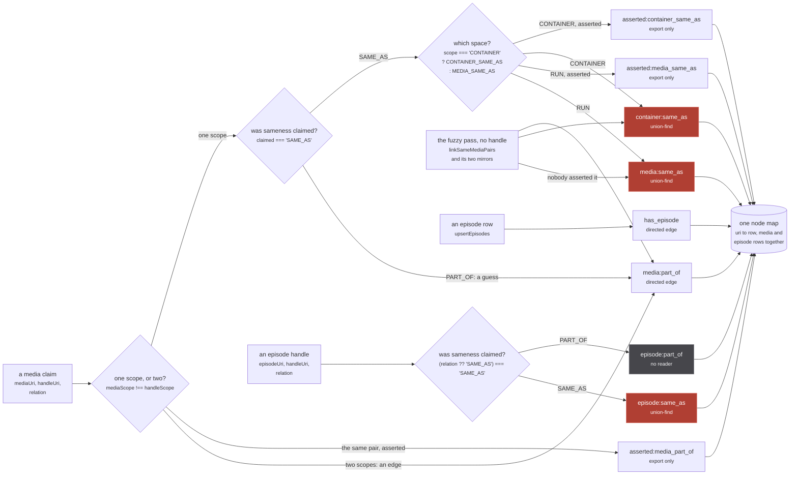
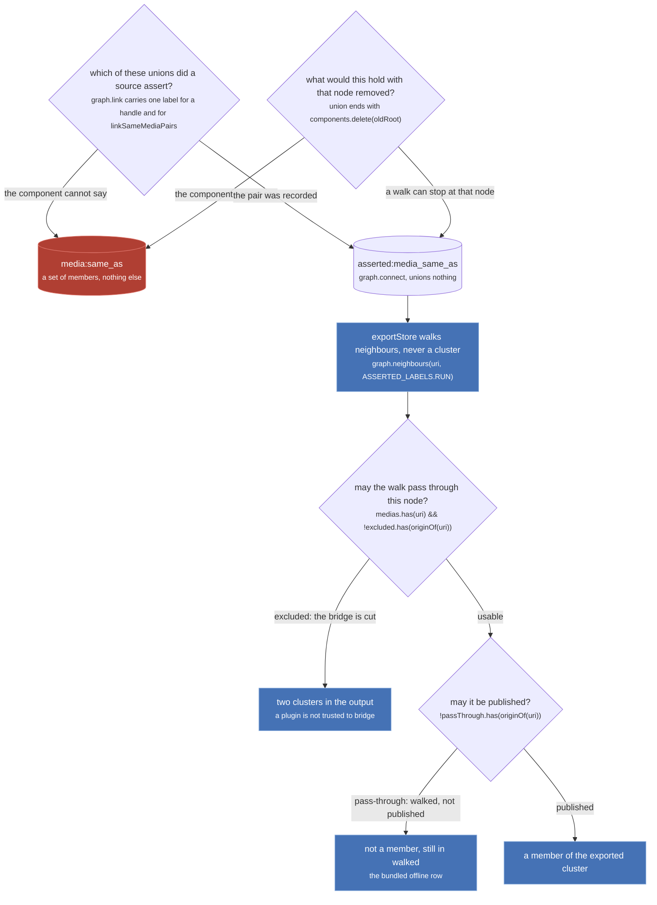

The store is one map of uri to row (`nodes`, `src/worker/store/graph.ts:124`, instantiated as
`createGraph<Media | Episode>()` at `db.ts:82`) with nine separate records of pairs laid over it.
Three of those records are union-finds, and a union-find is the only structure here with no inverse,
so which of the nine a write lands in is the most consequential routing decision in the system.

The rule is stated at the top of `db.ts`, above the two labels it names, and it is the centre of the
whole design:

`src/worker/store/db.ts:7-13`

> Two identity spaces, one per scope. A run's SAME_AS unions in the first, a container's in the second,
> and nothing ever unions across them: a show-level id entering a run's cluster is what welded Mushoku
> Tensei season 1 to season 3 on the live site (the bare crunchyroll series id and the bare tvmaze
> show id were fuzzy merged into season 1's cluster on the search path, and season 3's media path then
> asserted sameness through one of them; `graph.link` is a union-find with no inverse).

The third space is for episodes, declared four lines below the origin backstop at `db.ts:45`. It obeys
the same rules and has none of the guards, which is [`upsertEpisodes`](/write/upsert-episodes/)'s
whole story.

## Nine tracks over one node map



*Nine tracks, one node map, and only the three rose ones are permanent. Every label is a plain string handed down to a generic graph: `graph.ts` knows nothing about scopes, relations or origins.*

The media routing is `db.ts:187-197`, the 2x2 it implements is written out as a comment at
`db.ts:166-169`, and the episode routing is the two lines at `db.ts:410-411`. The fuzzy pass enters
through three separate exported functions, `linkSameMediaPairs` (`db.ts:216-224`),
`linkSameContainerPairs` (`db.ts:231-239`) and `linkPartOfPairs` (`db.ts:247-255`), each of which
re-applies the scope refusal before it touches a label.

| label, verbatim | primitive | written | read |
| --- | --- | --- | --- |
| `media:same_as` | union-find, plus an adjacency | `db.ts:193` (RUN x RUN SAME_AS), `db.ts:220` (fuzzy) | `db.ts:263`, `:282`, `:309`, `:376`; `aggregate.ts:294` |
| `container:same_as` | union-find, plus an adjacency | `db.ts:193` (CONTAINER x CONTAINER), `db.ts:235` (fuzzy) | `db.ts:263`, `:282`, `:379`; `aggregate.ts:294` |
| `episode:same_as` | union-find, plus an adjacency | `db.ts:410` | `db.ts:449`; `aggregate.ts:294` |
| `media:part_of` | directed edge | `db.ts:190`, `:196`, `:251` | `db.ts:281` forwards, `db.ts:307` backwards |
| `has_episode` | directed edge | `db.ts:406` | `db.ts:436`; `export.ts:83` |
| `episode:part_of` | directed edge | `db.ts:411` | nothing, anywhere |
| `asserted:media_same_as` | undirected adjacency | `db.ts:192` | `export.ts:54` |
| `asserted:container_same_as` | undirected adjacency | `db.ts:192` | `export.ts:75` |
| `asserted:media_part_of` | directed edge | `db.ts:189`, `:195` | `export.ts:67` |

Three things in that table are worth saying out loud.

**`episode:part_of` is write-only.** It is defined at `db.ts:46`, written at `db.ts:411`, and read by
nothing in `src/` or in `tests/`. A source that mints an episode handle with `relation: 'PART_OF'` has
its claim recorded in a map nobody opens.

**A union writes an adjacency too, and that is not the same as an asserted record.** `link` opens with
`const isNew = connect(a, b, label)` (`graph.ts:280`), so `media:same_as` carries both a component and
an undirected adjacency. That adjacency is never read, because it cannot answer the question the export
needs: the fuzzy pass unions under the same label, so the adjacency mixes what a source asserted with
what a title comparison guessed.

**The asserted mirror is not uniformly an adjacency.** `RUN` and `CONTAINER` go through `graph.connect`
into the undirected map; `PART_OF` goes through `graph.edge` into the directed one, which is why
`exportStore` reads the first two with `graph.neighbours` and the third with `graph.targets`. The
comment at `db.ts:55-65` calls all three "adjacency-only", which is exact about the property that
matters (none of them unions anything) and loose about the storage.

:::danger
**`graph.link` has no inverse, so a pair routed into the wrong space is permanent.** The whole
`UnionFind` surface is `has`, `find`, `union`, `component` and `allComponents` (`graph.ts:10-16`).
There is no split and no unlink anywhere in the repo, and `union` ends with
`components.delete(oldRoot)` at `graph.ts:103`, which destroys the record of which members arrived
from which side. `resetStore()` (`db.ts:509-513`) empties the entire store and is tests only. The
three rose tracks above are the three places a mistake cannot be walked back.
:::

## A union in one space is invisible in the other

`ufFor(label)` (`graph.ts:149-153`) mints a `UnionFind` per label on first use and hands back the same
one afterwards. Two labels are therefore two disjoint structures, and the router that picks between
them is one line:

`src/worker/store/db.ts:94`

```ts
const sameAsLabelFor = (scope: MediaScope) => scope === 'CONTAINER' ? CONTAINER_SAME_AS : MEDIA_SAME_AS
```

It is total. There is no third answer and no refusal, which means the entire scope decision is carried
by `scopeOf` on the line before it.

```mermaid
flowchart TD
  U["a uri, at the moment a claim is applied<br/><small>cr:G24H1N3MP</small>"] --> D1{"is the origin show-level?<br/><small>SHOW_LEVEL_ORIGINS.has(originOf(uri))</small>"}
  D1 -->|"imdb, the only member: CONTAINER whatever the row says"| CON["scope = CONTAINER"]
  D1 -->|"any other origin"| D2{"what did the stored row say?<br/><small>(graph.get(uri) as Media &#124; undefined)?.scope ?? 'RUN'</small>"}
  D2 -->|"the row said CONTAINER"| CON
  D2 -->|"the row said RUN, or said nothing"| RUN["scope = RUN"]
  CON --> D3{"which union-find?<br/><small>scope === 'CONTAINER' ? CONTAINER_SAME_AS : MEDIA_SAME_AS</small>"}
  RUN --> D3
  D3 -->|"CONTAINER"| UFC[("container:same_as<br/><small>its own UnionFind</small>")]
  D3 -->|"RUN"| UFR[("media:same_as<br/><small>its own UnionFind</small>")]
  UFR --> CROSS["a pair whose ends sit in different spaces<br/><small>never a union: db.ts:190 writes media:part_of instead</small>"]
  UFC --> CROSS
  classDef irrev fill:#b03f33,stroke:#e0796f,color:#ffffff
  classDef ratchet fill:#8f5a0e,stroke:#f2b45c,color:#ffffff
  classDef view fill:#4572b5,stroke:#8db0de,color:#ffffff
  classDef refuse fill:#46464b,stroke:#8b8c93,color:#f2f2f4
  class UFR,UFC irrev
  class CON ratchet
```



*The scope ladder runs top to bottom exactly once per claim, and the answer names a structure, not a flag on a row.*

The ladder is `db.ts:91-92`, three steps in one expression, and the comment above it says what the
third step is for:

`src/worker/store/db.ts:88-90`

> The backstop first, then the stored row, then RUN, which is the default the schema gives an absent
> `scope`. A uri with NO row never reaches a union or an edge: `upsertMedia` holds its claims until a
> row lands, so the default here only ever reads a stored row that said nothing.

`SHOW_LEVEL_ORIGINS` is `new Set(['imdb'])` at `db.ts:42`: exactly one origin, because an IMDb `tt` id
names the series and five separate sources emit it. Every other origin answers from its own row.

Two consequences follow from the spaces being separate structures rather than a field on a node.

**A read enters through whichever space the uri's scope names today.** `findAggregatedMedia`
(`db.ts:257-264`) resolves the uri and then calls
`graph.cluster(resolved, sameAsLabelFor(scopeOf(resolved)))`, and `findAllAggregatedMedia`
(`db.ts:374-383`) walks `graph.clusters(MEDIA_SAME_AS, ...)` and `graph.clusters(CONTAINER_SAME_AS, ...)`
as two separate passes, then cuts container members that a run cluster already lists so no row is
shown twice.

**A union does not migrate when a scope changes.** The scope ratchet moves a uri from the run space to
the container space for every future claim, and moves nothing that already happened. That asymmetry is
the bug `pendingClaims` was added for:

`src/worker/store/db.ts:116-122`

> The relation is derived from BOTH scopes, and a uri with no row has none. It used to read as RUN,
> which let a run union with a show whose own row was still in flight: a media page reloaded cold
> fans out to every source at once, each answers with the aggregated uri's siblings rebuilt as bare
> SAME_AS nodes, and whichever landed first decided. A RUN row for `cr:G24H1N3MP` minted by justwatch
> milliseconds before crunchyroll said CONTAINER was a RUN x RUN union, the CONTAINER that followed
> flipped the scope and not the union, and the same graph then answered differently depending on
> which member it was entered through. A claim now waits for the row and is applied when it lands.

:::caution
**The scope ratchet is a one-way door and it does not carry old unions through it.** Once
`cr:G24H1N3MP` reads CONTAINER, `findAggregatedMedia` asks the container space about it and gets back
whatever that space holds, which is usually just itself. The stale run-space component is still there
and is still reachable by entering through any of its other members. Nothing repairs it, because
nothing can: see the danger note above.
:::

Exactly one reader of the identity labels lives outside `db.ts`, and the label export exists for it
alone:

`src/worker/store/db.ts:52`

> The identity space labels, for the one reader outside this file that needs them: the cluster id in ./aggregate.ts.

That reader is `clusterId` (`aggregate.ts:293-294`), which calls
`graph.componentId(uris[0]!, IDENTITY_LABELS[space])` with `space` coming from `scopeOfCluster`
(`aggregate.ts:264-265`) for a media, and from the literal `'EPISODE'` for an episode group
(`aggregate.ts:407` and `:414`). `componentId` mints a uuid on first call and aliases it to the
component root (`graph.ts:234-244`), so it is a read that writes: a `_id` on screen is proof that a
component exists, in one named space, and says nothing about any other.

## Why the asserted mirror exists

A union-find is a lossy record on purpose. It answers "what is in this component" quickly and cannot
answer anything else, which leaves two questions the export has to ask and the identity labels cannot
serve:

`src/worker/store/db.ts:55-64`

> A second, adjacency-only record of every pair a SOURCE claimed through a handle, written by
> `upsertMedia` and by nothing else. `./export.ts` is its only reader.
>
> Two properties the identity labels above cannot supply, and the export needs both. `graph.link`
> carries the same label whether the pair came from a handle or from `linkSameMediaPairs`, so a
> cluster cannot say which of its unions a source actually asserted; and a union-find cannot answer
> "what would this component be with that node removed", which is exactly what excluding a plugin or
> the offline origin asks. An adjacency answers both, and unions nothing, so nothing downstream of
> the store sees these labels at all.



*The export is a view over the asserted tracks, and the reason it cannot be a view over the identity tracks is that the identity tracks threw away the two facts it needs.*

`exportStore` is at `export.ts:31-109`. The walk is the BFS at `export.ts:50-59`, the two predicates
are one line each at `export.ts:36-37`, and the container hop reads
`graph.neighbours(uri, ASSERTED_LABELS.CONTAINER)` at `export.ts:75`, which is the second identity
space's mirror doing the same job for shows. Its promise is in the file header:

`src/worker/store/export.ts:13-16`

> Every run-space cluster the store holds, built from ASSERTED sameness only.
>
> Promises: it reads, and never writes. It walks only pairs a source claimed through a handle
> (`ASSERTED_LABELS` in ./db.ts), never a union the fuzzy pass made.

The asserted writes are also deliberately invisible to the change signal. `db.ts:189`, `:192` and
`:195` discard their return values, and only the real labels move `changed`:

`src/worker/store/db.ts:173-176`

> Each applied claim is also recorded in ASSERTED_LABELS, and those writes' return values are
> DISCARDED: `changed` stays driven by the real labels alone. Feeding it an asserted write would put
> every listener back in the re-read loop tests/unit/worker/store/edge-idempotence.test.ts exists to
> stop, since the two records can go new at different times.

:::note
**One correction to the page brief.** The inventory says a grep for `EPISODE_PART_OF` returns four
hits. Against the working tree it returns **two**: the definition at `src/worker/store/db.ts:46` and
the write at `db.ts:411`, with nothing in `tests/`. The conclusion is unchanged and is if anything
stronger: the track has no reader.
:::

## Where to go next

- [Scopes and relations](/write/scopes-and-relations/) for the 2x2 that feeds the first figure, and for
  the ratchet in full.
- [The graph](/write/graph/) for the primitives underneath: `link`, `connect`, `edge`, and the ten maps.
- [Claims that wait](/write/pending-claims/) for the race that made the ratchet dangerous.
- [Exporting](/read/export/) for the walk over the asserted tracks, end to end.
- [A view or a write](/invariants/view-or-write/) for the same permanence question asked across the whole system.
