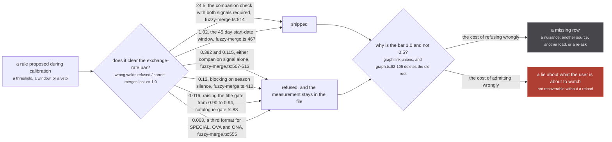

`src/sources/crunchyroll/extractor.ts:361-364`

> Anything missing is a refusal, never a guess: no start date, no titles, nothing over the threshold,
> or nothing inside the window, and this returns undefined and Crunchyroll simply does not appear.
> That is the correct trade. A missing row is a nuisance; a wrong row is a lie about what the user is
> about to watch, and it is not recoverable without a reload.

Every refusal on this page is that sentence, applied at a different place. The phrase itself appears
in five files (`crunchyroll/extractor.ts:361`, `justwatch/extractor.ts:649`,
`appletv/extractor.ts:346`, `catalogue-gate.ts:191` and `:240`, `consensus.ts:105`), and the rule it
names is implemented at more sites than that.

The rule is not caution for its own sake. It is a consequence of one fact about the store.

:::danger
**`graph.link` is a union-find union with no inverse.** `src/worker/store/graph.ts:279-291` connects
two nodes and calls `uf.union(a, b)`, and `union` at `graph.ts:82-105` ends with
`components.delete(oldRoot)`: the record of which members came from which side is destroyed on that
line. There is no `unlink`, no split and no unmerge anywhere in `src/`. Two media welded by a wrong
identity claim stay welded for the life of the worker, and the merged cluster then goes on to weld a
third.

`src/sources/catalogue-gate.ts:71-73`

> Those are sequels and remakes collapsed onto their parent, and a wrong link here is permanent:
> `graph.link` is a union-find union with no inverse, so the two shows stay welded for the session and
> the merged cluster then goes on to weld a third.

`graph.set` is no better in the other direction: `lastWriteLongestArray` (`graph.ts:388-400`) is
scalars last-write-wins and arrays longest-wins, with no provenance layer, so the previous value of a
field is simply gone. That asymmetry is what sets the price of a guess, and every threshold below was
chosen against it.
:::

## Three shapes of one rule

The refusals divide cleanly by what is missing.

**Ambiguity.** The evidence is present and it admits more than one answer. Two candidate seasons sit
inside the window; two offsets explain the same dates. Picking either is a coin flip wearing a
precise uri.

**Missing evidence.** An axis has nothing to read at all. No start date means no date axis, and a
gate running on one axis is measurably not a gate.

**Corroboration.** Exactly one source states a number, and acting on it would hide data. One witness
is not a measurement.

```mermaid
flowchart TD
  IN["a rule has run and is about to answer<br/><small>a season pick, an offset, a gate, a run length</small>"]
  IN --> AMB
  IN --> MISS
  IN --> CORR

  subgraph AMB["ambiguity: the evidence admits more than one reading"]
    A1{"how many candidate seasons sit inside the 45 day window?<br/><small>within.length !== 1</small>"}
    A2{"how many candidates share three or more episode titles?<br/><small>passing.length !== 1</small>"}
    A3{"how many candidate seasons carry our ordinal?<br/><small>matches.length &gt; 1</small>"}
    A4{"how many crunchyroll seasons span this run's broadcast?<br/><small>holders.length !== 1</small>"}
    A5{"does one offset explain the dates alone?<br/><small>ranked[1] && ranked[1][1] === support</small>"}
    A6{"does this air date name exactly one reference episode?<br/><small>numbers.size !== 1</small>"}
  end

  subgraph MISS["missing evidence: an axis has nothing to read"]
    M1{"does the asking cluster know when it started?<br/><small>if (!known.startDate) return undefined</small>"}
    M2{"did this candidate's seasons yield a dated one in range?<br/><small>!nearest || nearest.diff &gt; SEASON_DATE_WINDOW</small>"}
    M3{"has the date landed on the media yet?<br/><small>if (!startDate) return null</small>"}
  end

  subgraph CORR["corroboration: one witness is not a measurement"]
    C1{"do two rows claim the agreed length?<br/><small>backing.length &lt; 2</small>"}
    C2{"do at least two shared dates back the winning offset?<br/><small>support &lt; MIN_ALIGNED</small>"}
  end

  A1 -->|"exactly one, and it is not a fold"| OKA["the season is established<br/><small>return the verdict and its rule name</small>"]
  A2 -->|"exactly one passes the coverage bar"| OKA
  A3 -->|"exactly one carries the ordinal, with a count"| OKA
  A4 -->|"exactly one season contains the run"| OKA
  A5 -->|"one offset outvotes every other"| OKA
  A6 -->|"the three day window names one episode"| OKA

  A1 -->|"zero within: the catalogues disagree. two within: two parts released together"| RU["return undefined<br/><small>the caller falls through, this source contributes no identity</small>"]
  A2 -->|"zero or several clear 0.6 coverage on three titles"| RU
  A3 -->|"two seasons wear our ordinal"| RU
  A4 -->|"none spans it, or the catalogue splits the show twice"| RU
  A5 -->|"a second offset ties the winner"| RU
  A6 -->|"the window names none, or names two"| RC["continue<br/><small>this episode casts no vote, the loop lives</small>"]

  M1 -->|"a day-precise date is present"| OKM["both axes can run<br/><small>title decides the franchise, date decides the season</small>"]
  M2 -->|"a season premiered within 45 days"| OKM
  M3 -->|"waitForMedia returned a title and a date"| OKM

  M1 -->|"no date: the gate would run on the title axis alone"| RU
  M2 -->|"no dated season, or the nearest is over the window"| RC
  M3 -->|"the 30s wait expired with no date"| RN["return null<br/><small>the source yields media: null and never links</small>"]

  C1 -->|"two or more rows say the same length"| OKC["the window applies<br/><small>foreign episodes are cut to 1..length</small>"]
  C2 -->|"two or more dates agree on one offset"| OKC

  C1 -->|"the length rests on one row: the loan is refused whole"| RL["return the members' episodes only<br/><small>every lent origin is dropped, the page is left as it was</small>"]
  C2 -->|"one shared date is a coincidence"| RU

  classDef irrev fill:#b03f33,stroke:#e0796f,color:#ffffff
  classDef ratchet fill:#8f5a0e,stroke:#f2b45c,color:#ffffff
  classDef view fill:#4572b5,stroke:#8db0de,color:#ffffff
  classDef refuse fill:#46464b,stroke:#8b8c93,color:#f2f2f4
  class RU,RC,RN,RL refuse
  class OKC view
```



*Four different refusals, and the difference matters: `return undefined` gives the caller nothing and
lets it continue, `continue` drops one item and keeps the loop, `return null` ends a source's answer,
and the loan refusal at `consensus.ts:234` returns a filtered view rather than nothing at all. Only
the `OKA` path can end in `graph.link`.*

## The sites, verbatim

| site | condition, copied from the file | what it refuses | outcome |
| --- | --- | --- | --- |
| `src/sources/similar.ts:190` | `within.length !== 1 \|\| foldVetoed(evidence, within[0]!)` | rule 1, the date axis | `return undefined` |
| `src/sources/similar.ts:206` | `passing.length !== 1` | rule 2, episode titles | `return undefined` |
| `src/sources/similar.ts:216` | `ordinals.size > 1` | rule 3, before it even picks | `return undefined` |
| `src/sources/similar.ts:220` | `matches.length > 1` | rule 3, the ordinal | `return undefined` |
| `src/sources/similar.ts:258` | `if (!first) return undefined` | rule 5, the first-season rule | `return undefined` |
| `src/sources/crunchyroll/extractor.ts:423` | `holders.length !== 1` | the containing-season loan | `return undefined`, nothing is lent |
| `src/worker/store/consensus.ts:143` | `numbers.size !== 1` | one episode's vote | `continue` |
| `src/worker/store/consensus.ts:150` | `best == null \|\| support == null \|\| support < MIN_ALIGNED` | the whole offset | `return undefined` |
| `src/worker/store/consensus.ts:153` | `ranked[1] && ranked[1][1] === support` | the whole offset | `return undefined` |
| `src/worker/store/consensus.ts:234` | `backing.length < 2` | the loan, outright | `episodes.filter(episode => members.has(episode.origin))` |
| `src/sources/catalogue-gate.ts:286` | `if (!known.startDate) return undefined` | the whole gate | `return undefined` |
| `src/sources/catalogue-gate.ts:291` | `!nearest \|\| nearest.diff > SEASON_DATE_WINDOW` | one candidate | `continue` |
| `src/sources/justwatch/extractor.ts:652`, `src/sources/appletv/extractor.ts:348` | `if (!startDate) return null` | the search-and-link path | `return null` |
| `src/sources/season.ts:179-181` | `seasons.length <= 1` then `exact.length === 1 ? ... : undefined` | picking a Netflix season by count | `return undefined` |

The inventory that commissioned this page called it eleven sites. Reading the files, the count is at
least fourteen, and the extra three are the same rule: `ordinals.size > 1` refuses before any pick is
attempted, `if (!first) return undefined` covers a candidate list with no numbered season in it, and
`pickSeasonByEpisodeCount` refuses both a lone season and a non-unique exact match. Nothing about the
rule changes; the eleven were a sample, not a census.

## Ambiguity, worked

`src/sources/similar.ts:166-171`, on the whole picker:

> The rules run in order; a rule that does not apply falls to the next, and a rule that applies but
> finds nothing unambiguous REFUSES outright. Every rule picks over ALL candidates and only then
> checks the vetoes on its pick: a vetoed pick is a refusal, never a fall-through to the next best
> candidate, because that fall-through is precisely how season 1 of Mushoku Tensei reached Netflix
> season 3 once season 1 was excluded.

Note the second half. A rule that refuses is not permitted to hand the question to the next rule
carrying a shortened candidate list, because that is how a wrong answer is manufactured out of a
correct refusal. The one-line version is at `:182-183`:

> Rule 1, DATE: a premiere within the window of a day-precise start. Zero within means the catalogues
> disagree about when this run started; two within is two parts released together.

Both of those are refusals, and they are refusals for opposite reasons. The condition that expresses
both is `within.length !== 1`, not `within.length === 0`.

The sharpest ambiguity case is in the numbering aligner. `src/worker/store/consensus.ts:105-109`:

> NOTHING RATHER THAN A GUESS, in every ambiguous case:
>   - fewer than MIN_ALIGNED dates in common, so a coincidence could carry it
>   - two offsets explaining the same evidence, which is what a season with two episodes on one day
>     produces (Hana-Kimi season 2 has episodes 1 and 2 both dated 2026-07-01)
>   - any date matching more than one reference episode, for the same reason

`MIN_ALIGNED = 2` at `consensus.ts:111`. The tie refusal at `:151-152` states the reason in one
sentence:

> one offset has to explain it ALONE: a second offset with the same support is two readings of the
> same evidence, and picking either is a guess

The test that makes this worth having rather than tidy is
`tests/unit/worker/store/consensus.test.ts:246`, `a doubled day cannot out-vote the one unambiguous
day`: two doubled days produce offset 2 twice and one clean day produces offset 10, so the ambiguous
evidence outnumbers the good evidence 2 to 1. Reading it gives a confident wrong answer. Refusing it
gives none, and the Crunchyroll episodes keep their own numbering, which is exactly where they
started.

## Missing evidence, and the 4.002% floor

The reason a missing axis is a refusal rather than a fallback is a measured number, not a
disposition. `src/sources/catalogue-gate.ts:68-74`:

> THE FLOOR IS WHY THE DATE AXIS IS NOT OPTIONAL, and it is the number to read before anyone
> "simplifies" it away. With the title axis alone, 5583 of the 139507 wrong pairs (4.002%) pass at
> threshold 1.00: they are EXACTLY equal after season stripping, so no similarity number anywhere in
> the 0..1 range can refuse them.

That is the whole argument in one paragraph. 4.002% of wrong pairs score a perfect 1.0 on the title
axis because they really are the same string once season markers come off. Raising
`CONFIDENT_TITLE_THRESHOLD` cannot touch them; there is nothing above 1.0. The date axis is the only
thing that reaches the floor, and the measured effect is at `:76-77`:

```
season-level year membership (JustWatch)   4.002% -> 0.825%   removes 4432 of 5583
season-level 45 day window (Apple TV)      4.002% -> 0.695%   removes 4614 of 5583
```

So a cluster with no start date is not a cluster to be gated leniently. It is a cluster for which the
gate does not exist. `src/sources/catalogue-gate.ts:284-286`:

```ts
// no start date is no date axis, and a gate running on one axis is the 4.002% floor of permanent
// wrong links with nothing left to catch it
if (!known.startDate) return undefined
```

`justwatch/extractor.ts:649-652` and `appletv/extractor.ts:346-348` repeat that check before they
call the gate at all, and both refuse by returning `null` rather than by proceeding with the title
alone. The comment above the JustWatch one carries the reason inline, which is why the same number
appears in three files.

The same rule shapes the two helpers the gate is built from. `catalogue-gate.ts:191-192`:

> Anything missing is a refusal: no start date, no season years, or every season year null, and the
> candidate does not link.

and `:240-241`:

> Anything missing is a refusal: no start date, no seasons, or no season carrying a date, and this
> returns undefined rather than a nearest-of-nothing.

"Rather than a nearest-of-nothing" is the point. `closestSeasonByAirDate` could return its best
effort over an empty set. It returns `undefined` instead, and `pickGatedCandidate` at `:291` turns
that into a `continue` rather than a link.

## Corroboration: one witness is not a number

The third shape is the one that reads least like caution and most like a measurement.
`src/worker/store/consensus.ts:163-169`:

> TWO WITNESSES before anything is hidden.
>
> Half the counts in this tree are not claims at all: twelve sources set `episodeCount =
> episodes.length`, so a catalogue that could only reach part of a run publishes a SHORT count as
> confidently as one that knows the whole run. A length resting on a single row, acted on, hides
> episodes that aired. The second witness may come from any tier, since the question here is only
> whether the number is corroborated at all.

`backing` is `cluster.filter(media => media.episodeCount === length)` (`:171`), and the bar is
`backing.length < 2` at `:234`. What happens when it fires is not a softer window; it is a different
answer entirely, and `:226-232` says why:

> AN UNCORROBORATED LENGTH REFUSES THE LOAN OUTRIGHT rather than slicing on it.
>
> A lent season is only useful if the run can say which of its episodes are its own, and a length one
> source claims cannot. Mushoku Tensei season 2 part 1 is the case: MAL publishes no count at all and
> AniList says 13 for a run that aired 12, so windowing to 13 put a thirteenth row on the page that
> only Crunchyroll had. Declining leaves the page exactly as it was.

Read the arithmetic. AniList alone says 13, the run aired 12, and windowing to 13 draws a thirteenth
row that exactly one source has. The available moves were: trust 13 and draw a wrong row, or refuse
the entire loan and draw the twelve rows the page already had. It refuses. `consensus.ts:234`
returns `episodes.filter(episode => members.has(episode.origin))`, so every member origin keeps
everything and every lent origin is dropped whole.

The pinned case is `tests/unit/worker/store/consensus.test.ts:373-390`: the cluster is anilist
`0.8/13`, mal `0.9/null`, kitsu `0.3/12`, anizip `null/12`, `runLength` still answers 13, the
Crunchyroll loan is dropped to 0 rows, and anizip's own 3 survive. `runLength` answering 13 while
`runEpisodes` declines to act on it is the design, not a leak: the length is still published,
because `tieredConsensus` is a view; only the hiding waits for a second witness.

## The exchange rate

Every threshold on this page was picked against one number, and the number is stated in the tree.
`src/sources/catalogue-gate.ts:83-84`:

> Raising it to 0.94 refuses 208 more wrong links and costs 13046 correct ones, a ratio of 0.016
> against this repo's own exchange-rate bar of 1.0.

One wrong weld refused per correct merge lost. A rule that clears 1.0 ships; a rule under it is
refused and the refusal is written into the file so nobody proposes it twice.
`src/worker/store/fuzzy-merge.ts:423` ends the season-silence sweep with the same bar in four words:
*Nothing in the family reaches 1.*



*The two branches out of the bottom decision are the whole page. One of them is undone by a reload
and the other is not, and that asymmetry is the only reason the bar sits at 1.0 rather than wherever
a symmetric cost would put it.*

Four calibrations that ran against that bar, with their file:line so they can be re-derived:

| rule | measured | ratio | verdict |
| --- | --- | --- | --- |
| the companion check, marker **and** type disagreement (`fuzzy-merge.ts:514`) | 49 of 84 refused, 2 correct merges destroyed, 0 attaches lost | 24.5 | shipped |
| `START_DATE_WINDOW_DAYS = 45` (`fuzzy-merge.ts:46`, ratio at `:467`) | 83 welds refused, 81 correct merges lost (0.52% of 15549), 0 of 17946 streaming attaches | 1.02 | shipped |
| the companion marker alone (`fuzzy-merge.ts:507`) | 52 of 84 refused, 77 merges and 59 attaches destroyed | 0.382 | refused |
| refusing when one side names a season and the other is silent (`fuzzy-merge.ts:405-411`) | 323 welds refused, 12007 correct merges lost | 0.12 | refused |
| raising `CONFIDENT_TITLE_THRESHOLD` to 0.94 (`catalogue-gate.ts:83`) | 208 more wrong links refused, 13046 correct ones lost | 0.016 | refused |
| a season-count tolerance at unOGS (`season.ts:163-166`) | about 1.6 extra assignments per extra weld, swept 0 to 3 episodes and 0 to 1 of the run's length | 0.63, derived as 1 / 1.6; the file states the trade and does not compute a ratio | refused, allowance set to zero |

The unOGS row states the trade in the same terms without computing a ratio.
`src/sources/season.ts:163-166`:

> The tolerance in between was swept rather than guessed, floor 0 to 3 episodes against a share of 0
> to 1 of the run's length, and it buys assignments at about 1.6 per extra weld the whole way. That
> exchange rate is not worth taking when one side is permanent and the other is a missing streaming
> row, so the allowance is zero.

The measured table it comes from is at `season.ts:158-161`, over 33 real multi-season Netflix series
and the 105 anime runs that clear the source's title gate:

```
rule                                   welds   assigned   refused
nearest at any distance, first on tie      51        105         0     what this replaces
nearest, refusing a tie                    22         57        48
exact and unique                           11         49        56     this
```

Read the bottom row as the rule in numbers: 56 of 105 runs get no Netflix season at all, and the
welds fall from 51 to 11. Refusing more than half the population is the shipped behaviour.

## Where the rule is deliberately inverted

Not every gate in the tree refuses on silence, and the exception is worth knowing before applying
"nothing rather than a guess" as a universal. Every veto in the fuzzy merge has the same shape,
`if (a.X.size && b.X.size && ![...a.X].some(v => b.X.has(v))) return false`: **only a disagreement
blocks, and silence never blocks.** `src/worker/store/fuzzy-merge.ts:398-399`:

> Only a DISAGREEMENT blocks. A cluster whose sources never spell the season out has to stay free to
> merge, or the pass stops doing the job it exists for.

There is no contradiction. In the picker and the gates, asserting is the dangerous act and refusing
is free, so an ambiguity refuses. In `sameShow`, a veto that fires is itself an assertion, about a
pair the pass would otherwise have merged correctly, and the numbers say what a silence-blocking veto
costs: 323 wrong welds refused against 12007 correct merges lost, one weld stopped per 37 merges
destroyed (`fuzzy-merge.ts:405-411`). The rule is the same rule. What changes is which side of the
comparison the permanent cost sits on.

The `SPECIAL`, `OVA` and `ONA` format neutrality is the same shape (`fuzzy-merge.ts:552-557`): giving
those types a third format that disagrees with `MOVIE` and `SERIES` refuses 31 of 75 welds and
destroys 8808 of 17946 attaches, ratio 0.003, "worse than any rule this file has refused".

## What the rule is not

- **It is not a preference for silence.** `runEpisodes` returns `[...episodes]` untouched when
  nobody publishes a count (`consensus.ts:159`), because with no claim there is nothing to be wrong
  about. Refusing to hide is a refusal too.
- **It is not applied to a display value.** `tieredConsensus` still publishes 13 as the run length in
  the Mushoku Tensei case above, because it is a view recomputed on every read
  ([consensus, not a sum](/merge/consensus/)). Only the acts with no inverse are held to this bar.
- **It does not stop at the first candidate that passes.** `pickGatedCandidate` scores every
  survivor and takes the best by date distance (`catalogue-gate.ts:270-275`, *THE BEST WINS, NEVER
  THE FIRST TO PASS*), which is a different rule with the same motive: taking whichever candidate a
  catalogue listed first welded 544.3 of 913 media in expectation against 274 for taking the best
  (`catalogue-gate.ts:132-135`).
- **It cannot close the residue it names.** Two clusters inside one 45 day window of one catalogue
  season still receive the identical season-scoped id, and `catalogue-gate.ts:22-23` says the gate
  cannot fix that: *it cannot be closed here: the gate has one candidate and no view of the other
  cluster.* See [season-scoped ids](/sources/season-ids/).

Where to read next: [every kind of refusal](/invariants/refusals/) tabulates the four refusal shapes
that appear in the first figure, [the five gates](/merge/gates/) walks the vetoes this page inverts,
and [windowing a run](/merge/windowing/) is `runEpisodes` end to end.
