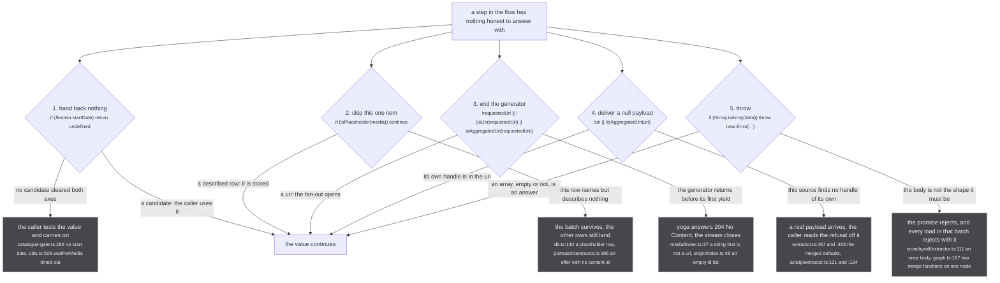
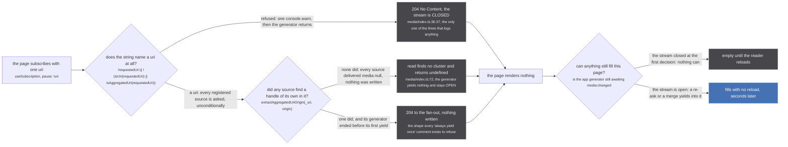

Every layer of stub is allowed to stop. A search gate with no date axis stops, a store loop with a row
that describes nothing stops, a source that does not recognise itself in a uri stops. What differs
between them is not the decision, it is the **mechanism**, and the mechanism is what the caller pays.

A helper that returns `undefined` costs the caller one `if`. A subscription generator that ends before
its first yield costs the caller its entire timeout: thirty seconds on the `similarMedia` path. Both
are the word "no". Only one of them is expensive, and picking the wrong one is a real bug that renders
as a slow page rather than as an error.

There are five, and a sixth that only `similarMedia` has.

:::danger
**One operation in this system cannot be undone.** `graph.link` (`src/worker/store/graph.ts:279-291`)
is a union-find union, and the union-find exposes no split, no unlink and no disunion: `union` ends at
`graph.ts:103` with `components.delete(oldRoot)`, so the record of which members came from which side
is destroyed at that line. Once two media are welded they stay welded for the life of the worker.

That is the reason there are five mechanisms rather than none. A refusal is the cheap outcome and a
wrong answer is the permanent one, so every layer is given a way to stop. This page is only about what
stopping costs the caller.
:::

## The five mechanisms



*Five refusals, five different things the caller then does. Nothing on this figure throws except the fifth, and nothing on it writes: a refusal never reaches the store, which is the whole point of having so many of them.*

### 1. `return undefined`, and the caller carries on

The commonest by a wide margin: `grep -rn "return undefined" src --include=*.ts` counts 170, none of
them in generated code. It is the refusal of a helper, and the contract is that the caller must test
the value.

`src/sources/catalogue-gate.ts:284-286` is the one worth reading, because the comment says what the
refusal is worth:

> no start date is no date axis, and a gate running on one axis is the 4.002% floor of permanent
> wrong links with nothing left to catch it

```ts
if (!known.startDate) return undefined
```

The caller of `pickGatedCandidate` gets `undefined`, mints nothing, and the media simply never gains
an Apple TV handle. `waitForMedia` (`src/sources/utils.ts:489-509`) refuses the same way after its
timeout, defaulting to 15 s and overridden to 30 s at every search-gate call site: the `for await`
ends when the abort fires and `:508` returns `undefined`.

The store uses it too. `src/worker/resolvers/media/index.ts:72`, inside `read()`:

```ts
const cluster = await findMediaForPage(requestedUri)
if (!cluster.length) return undefined
```

and the caller at `:82` is `if (first) yield first`. So an empty store is not an error and not a
payload. It is a turn of the loop that produces nothing, and the generator goes back to waiting on
`media:changed`. That distinction is the whole of the second figure below.

### 2. `continue`, and the loop lives

The refusal of one item inside a batch. The batch is up to 250 rows on the media path
(`src/worker/extractor.ts:129-134`), so the difference between `continue` and `throw` here is 1 row
lost against 250.

`src/worker/store/db.ts:140` is the load-bearing one, and `db.ts:99-103` is the argument for it:

> The fields that NAME a row rather than describe it. A row carrying nothing else is a placeholder
> rebuilt from a uri (`buildHandlesFromUri` in sources/utils.ts mints one per sibling of an aggregated
> uri), and a uri says nothing about what it names: the row would contribute no field to a merge and
> its scope is `makeMedia`'s default. So it is not stored, and a claim naming it waits for a row that
> is. A CONTAINER stamp counts as a description, since it is a source's own reading of the id.

```ts
const IDENTITY_FIELDS = new Set(['uri', 'origin', 'id', 'scope'])
const isPlaceholder = (media: Media) =>
  media.scope !== 'CONTAINER'
  && Object.entries(media).every(([field, value]) =>
    IDENTITY_FIELDS.has(field) || value == null || (Array.isArray(value) && value.length === 0))
```

Note what the refusal is *not*: the claim that named the placeholder is not dropped. Twenty-eight
lines further down, `db.ts:180-183` defers it under each undescribed end and `continue`s, so the claim
waits in `pendingClaims` for a row that describes something. Two `continue`s, one row skipped and one
claim postponed, and neither ends the pass.

The source layer uses it the same way. `src/sources/justwatch/extractor.ts:329`, `:333`, `:342` and
`:395` each skip one offer: an unwanted monetization type, a package with no origin mapping, an origin
already seen, and an offer left with no content id after `providerContentId` refused a Crunchyroll
series id. The other offers on that title still become handles.

`src/worker/plugin-sources.ts:57-66` applies it to a whole family of plugin sources, and
`plugin-sources.ts:38-42` says why:

> A source in a family is an ordinary standalone source that happens to arrive over a shared
> connection. So a malformed one is REPORTED and skipped, never fatal to its siblings: the same rule
> the fan-out follows for a failing extractor and the source layer follows for a bad record. Dropping
> the whole family because one entry is wrong would make a package strictly more fragile than the
> same sources shipped separately, which is backwards.

The rule generalises across three layers that never call each other. `src/sources/utils.ts:143-149`
does it for upstream records with `Promise.allSettled` rather than a loop, and `utils.ts:131-137` is
the same sentence again:

> A page resolver is all-or-nothing by default: a plain `.map` throws and a `Promise.all` rejects
> as soon as one record is malformed, so the source yields nothing and one bad entry costs the
> whole page. That is what turns a single odd upstream record into an empty feed, and it defeats
> the point of having several sources, since the surviving source goes dark too.

And `src/worker/extractor.ts:745`, over a whole source:

> one source must never be able to take down the fan-out: a source that cannot start is skipped

The `try` at `extractor.ts:749-763` wraps `client.subscription(...).subscribe(...)`, logs
`Extractor <name> failed to join the fan-out` and returns. The source is never added to
`fanout.joined`, and the other 23 keep going.

### 3. `return` from a subscription generator, which is 204 No Content

This is the expensive one, and the reason it is expensive is written at `src/worker/extractor.ts:459-462`,
above the merged default every source falls back to:

> most sources cannot answer show-plus-evidence, and the default has to YIELD that rather
> than end: a subscription generator that completes without yielding makes yoga respond
> 204 No Content, which the caller would sit on until its timeout instead of reading a
> refusal off the first payload

That sentence is repeated, in its own words, above six source resolvers: `crunchyroll/extractor.ts:563-564`,
`tvmaze/extractor.ts:197`, `unogs/extractor.ts:472`, `appletv/extractor.ts:404`,
`justwatch/extractor.ts:749`, `anizip/extractor.ts:119`. `offline/extractor.ts:231-232` states the
distinction that matters:

> Always yield at least once. A subscription generator that completes without yielding makes
> yoga answer 204 No Content, which is not the same thing as "this source knows nothing".

The app's own entry point uses the mechanism deliberately, at `src/worker/resolvers/media/index.ts:34-38`:

```ts
if (!requestedUri || !(isUri(requestedUri) || isAggregatedUri(requestedUri))) {
  // a refused page and a slow one are indistinguishable from outside the worker without this
  console.warn(`media: refused '${args.input.uri}', which names no uri`)
  return
}
```

Here it is correct: there is nothing to wait for, so closing the stream is the honest answer, and the
`console.warn` above it exists precisely because 204 and "still working" look the same from the page.
`Subscription.origin` (`origin/index.ts:19`) and `Subscription.originPage` (`origin/index.ts:48`) do
the same on an empty id list, and neither logs.

A `return` **after** a yield is not this. `offline/extractor.ts:238` and `:240` both return early with
no seed index and no matching run, and `offline/extractor.ts:226-227` records why that is safe:

> point: the seed exists to make a cold page fast, so it must never delay the first paint. Every
> early return below leaves the bundled yield standing.

### 4. `yield` a null payload, which is a delivered refusal

The refusal that arrives as data. `src/worker/extractor.ts:457-463` is the whole default set, the
four-line comment quoted above sitting between the second line and the third:

```ts
media:        { subscribe: async function* (_parent) { yield { media: null } } },
mediaPage:    { subscribe: async function* (_parent) { yield { mediaPage: { nodes: [] } } } },
similarMedia: { subscribe: async function* (_parent) { yield { similarMedia: null } } }
```

Thirty-one sites across `src/sources` and `src/worker` yield `media: null`. Six of the 24 built-in
sources are nothing but this: disney, amazon, hulu, peacock, hbo and fubo exist so JustWatch's package
map has an origin to mint into, and each one's `media` resolver is the single line at
`disney/extractor.ts:18`.

The reason a delivered null beats an ended stream is at `src/worker/extractor.ts:274-276`, inside
`firstSimilarMedia`:

> any DELIVERED payload settles this, including an explicit null. A source that cannot
> answer yields null once and ends, and waiting out the timeout for that would turn the
> ordinary refusal into the slowest path in the system.

So the same "no" costs either one round trip or `SIMILAR_MEDIA_TIMEOUT_MS`, which is `30_000`
(`extractor.ts:198`), depending only on whether the generator yielded before it ended.

Anizip is the compact example, `src/sources/anizip/extractor.ts:119-126`: two refusals, both delivered,
one for a uri that is not aggregated and one for a cluster carrying no `mal` handle.

```ts
if (!uri || !isAggregatedUri(uri)) return yield { media: null }
const uris = fromAggregatedUri(uri)
const malId = uris?.handleUrisValues.find(uri => uri.origin === 'mal')
if (!malId) return yield { media: null }
```

`return yield x` yields once and then ends, which is the shape to copy: it satisfies the payload rule
and still stops the generator in one statement.

### 5. `throw`, and the batch dies with it

Twenty `throw new Error` sites in `src/`. A throw is not a refusal about one item, it is a statement
that the code cannot proceed, and it is chosen where treating the bad input as data would produce a
confident wrong answer.

`src/sources/crunchyroll/extractor.ts:104-108` is the measurement behind the clearest one:

> Crunchyroll's error body (`{ __class__: 'error', code: 'rate_limited' }` on a 429) carries no `data`.
> Read as an empty list it was an ANSWER about the show: three such bodies described three seasons of
> zero episodes, the walk refused, the cache served that for ten minutes and the consumer recorded the
> refusal for the session (2026-09-05). An empty `data` is still a real answer: an unknown series, a
> seasonless one, a season with nothing listed.

```ts
if (!Array.isArray(data)) throw new Error(`Crunchyroll answered ${url} with no data: ...`)
```

Read the distinction the comment draws, because it is the whole design of kind 5: `data: []` is an
answer and is returned, `data` absent is not an answer and throws. A refusal that says "zero episodes"
is worse than one that says "I do not know", because zero episodes propagates into the fold veto and
the consensus tiers as a number.

Where a throw lands depends on which side of a boundary it happened on.

- **Inside a source resolver**, `maskedErrors.maskError` at `extractor.ts:499-504` logs
  `Server Extractor <name> GQLError occurred:` and converts it to a `GraphQLError`. The client-side
  `errorExchange` at `extractor.ts:507-524` logs it a second time. The fan-out's own callback ignores
  the result on the media path (`extractor.ts:751`, `if (!fanout.extractUris) return`), so the effect
  on the page is identical to that source having yielded null: nothing was written.
- **Inside a DataLoader batch**, it is worse. `upsertMedia` runs inside `mediaInserter`'s batch
  function (`extractor.ts:106-128`), so a throw there rejects the promise every `load()` in that batch
  is waiting on: up to 250 rows from several sources at once. `graph.ts:166-168` is the throw that can
  reach it:

  ```ts
  if (mergeFns.length > 1) {
    throw new Error(`Node "${key}" has multiple labels with merge functions: cannot resolve which to use`)
  }
  ```

- **Across the osra boundary** it is turned back into a value. `registerRemoteExtractor` throws
  `plugin '<uri>': no source could be registered` at `extractor.ts:703`, and `yoga.ts:44-50` catches it
  and answers `{ error: message }`; `plugins.ts:100` then rethrows it on the page side. The throw
  survives, but it crosses the process boundary as data.

One throw is reachable from a bare url. `src/utils/uri.ts:77`:

```ts
if (parts[1]?.includes(',')) throw new Error(`Invalid uri: ${uri}, contains "," character in id`)
```

and `decodeRouteUri` calls `isUri(raw)` at `uri.ts:163`, **outside** its own `try`. So `foo:a,b` in the
address bar surfaces as a GraphQL error rather than as the tidy refusal waiting one line later at
`media/index.ts:34`. See [the uri grammar](/invariants/uris/).

## Three refusals, one empty page



*Three different mechanisms, one screen. The distinction that survives to the reader is not which refusal fired, it is whether the stream is still open, and only the first of the three closes it.*

On the page, all three are `data === undefined`. `src/router/watch/index.tsx:194` is
`const media = data?.media`, and `src/router/home/media-modal.tsx:624` is
`const media = data?.media ?? foundMedia`. Nothing distinguishes them there, which is why the
`console.warn` at `media/index.ts:36` exists at all: *a refused page and a slow one are
indistinguishable from outside the worker without this*.

What separates them is recoverability.

- **Lane A closes the stream.** The generator returned, yoga answered 204, and no later
  `media:changed` can reach a generator that has finished. This page is empty until the reader
  navigates again.
- **Lane B leaves it open.** Every source answered `media: null`, so the store gained nothing and
  `read()` returned `undefined`, but the generator is still sitting in `for await (const _ of iterator)`
  at `media/index.ts:84`. The moment any source writes a row, the loop re-runs and the page fills. This
  is the ordinary state of a cold page for its first few hundred milliseconds, and it is also the state
  the [re-ask](/request/re-ask/) exists to escape: a source that answered "not mine" is asked again once
  another source contributes its id.
- **Lane C is lane A at the source layer.** One source's stream closes, the fan-out loses that source's
  answer, and the app's own generator is untouched. It costs one source, unless the caller was waiting
  on a single answer, which is exactly the `similarMedia` case: there the cost is the full 30 s of
  `SIMILAR_MEDIA_TIMEOUT_MS` before `firstSimilarMedia` gives up.

**Where this page corrects the brief:** lanes A and C are the same mechanism at two layers, not two
mechanisms, and lane C has exactly one first-party instance today. `src/sources/anilist/extractor.ts:746`
ends `Subscription.mediaPage` without yielding when `browseVariables` refuses an unfiltered listing:

```ts
const variables = browseVariables(input)
if (!variables) return
```

`anilist/extractor.ts:684-689` argues the refusal itself, and the argument is right:

> The browse a `mediaPage` input asks for, or nothing when it names none this source can answer.
>
> Answering nothing is the honest reply to an unfiltered page: AniList is asked for a listing, never
> for the catalogue.

It is the mechanism that is off pattern rather than the decision. Nothing breaks, because the app's
`mediaPage` generator never waits on a particular source (`media/index.ts:166` yields the whole
store on its first pass), so the only cost is that AniList contributes no uri to `insertedUris`. Every
`media` and `similarMedia` resolver in the tree yields first; this one does not, and
`yield { mediaPage: { nodes: [] } }` would cost nothing.

## The sixth kind: declined against refused

`similarMedia` is the one path where the *reason* a "no" happened is carried as data rather than
logged, because the caller has to decide whether to ask again. `src/sources/similar.ts:51-57`:

```ts
export type SimilarDeclineReason = 'not-implemented' | 'bad-show-id' | 'no-evidence' | 'ceiling' | 'timeout' | 'error'
export type SimilarRefusalReason = 'null' | 'not-a-run'
/** What one ask came to. `declined` never reached the source and may be retried; `refused` did and is final for that evidence. */
export type SimilarOutcome<M extends SimilarAnswerMedia = SimilarAnswerMedia> =
  | { outcome: 'answered', media: M }
  | { outcome: 'refused', reason: SimilarRefusalReason }
  | { outcome: 'declined', reason: SimilarDeclineReason }
```

:::caution
**The difference is recorded, not just logged.** In `src/worker/similar-consumer.ts:227-235`, a
`declined` outcome returns without touching the record, so the next read asks the identical question
again. A `refused` outcome calls `record.fingerprints.add(question.fingerprint)` first, which makes
`isAsked` (`similar-consumer.ts:136-137`) true for that exact evidence for as long as the record lives. Getting the two the
wrong way round either loops on a question the source has already answered, or drops a question that
was never actually asked.
:::

`similarOutcomeFrom` (`src/worker/extractor.ts:314-397`) is where every branch is assigned, and every
one of them warns on a single `similarMedia: ` line, so a console session can be read straight through:

| outcome | reason | condition | site |
|---|---|---|---|
| declined | `no-evidence` | `!origin \|\| !input?.showId \|\| !hasEvidence(input)` | `extractor.ts:316-318` |
| declined | `bad-show-id` | `!SAFE_SHOW_ID.test(showId)` where the regex is `/^[A-Za-z0-9._~-]{1,128}$/` | `extractor.ts:326-328` |
| declined | `not-implemented` | `if (!extractor)`, because `implementsSimilarMedia(origin)` reads the DEFINITION's resolvers and the yield-null default does not count | `extractor.ts:330-333` |
| declined | `ceiling` | `byCaller >= MAX_SIMILAR_MEDIA_PER_CALLER \|\| similarAsksInFlight.size >= MAX_CONCURRENT_SIMILAR_MEDIA`, which are `8` and `32` | `extractor.ts:357-360` |
| declined | `timeout` | nothing delivered within `SIMILAR_MEDIA_TIMEOUT_MS`, 30 s | `extractor.ts:382-384` |
| declined | `error` | the subscription produced `result.error`, or `subscribe` threw | `extractor.ts:386-387` |
| refused | `null` | the source delivered `similarMedia: null` | `extractor.ts:378-380` |
| refused | `not-a-run` | `answer.origin === origin && answer.scope !== 'CONTAINER' && answer.id !== showId` is false | `extractor.ts:369-373` |

The split is exactly the delivered/undelivered line from kinds 3 and 4. `null` and `not-a-run` are
refusals because a payload came back: the source read the evidence and had nothing, and asking again
with the same evidence would get the same nothing. Everything else is a decline because the source
never saw the question, or saw it and never answered in time.

`similarMediaFrom` (`extractor.ts:403-408`) collapses all eight refusing outcomes back down to kind 1,
for the callers that have no use for the difference:

```ts
const result = await ask(origin, input)
return result.outcome === 'answered' ? result.media : undefined
```

That is the contract `ctx.similarMedia` hands a source, and it is the right reduction there: a source
asking another source has nothing to do with a `ceiling` that it did not cause.

## One refusal that is an HTTP status

Worth naming because it is the only place a status code is chosen as a refusal shape.
`src/worker.ts:14-19`:

> 404, never 503: `fetchWithBackoff` retries a 503 three times, and this refusal is the same shape
> as the asset simply not being published yet, which the loader already answers undefined to.

```ts
refusesSeedAsset(location.href, input)
  ? new Response(null, { status: 404, statusText: 'the season seed is switched off for this page' })
  : fetch(input, init)
```

`503` is in `RETRYABLE_STATUSES` (`src/worker/backoff.ts:13`, which is `{408, 429, 502, 503, 504, 522, 524}`),
so answering one here would spend all four attempts (`MAX_RETRIES = 3`) on the backoff ladder saying no
to itself. Picking the status that means "this is not here" rather than the one that
means "try later" is the same judgement as picking a delivered null over an ended generator: match the
mechanism to what the caller should do next. See [fetching, and backing off](/request/fetch-and-backoff/).

## Every site named on this page

| kind | site | condition | the caller |
|---|---|---|---|
| `return undefined` | `sources/catalogue-gate.ts:286` | `if (!known.startDate) return undefined` | mints no handle |
| `return undefined` | `sources/catalogue-gate.ts:249` | `if (!target) return undefined` | no nearest season, so no link |
| `return undefined` | `sources/utils.ts:508` | the abort fired before any probe was truthy | the search path gives up |
| `return undefined` | `sources/crunchyroll/extractor.ts:231`, `:235` | `if (!seriesId)`, `if (!series)` | the resolver at `:575` coalesces it to `media: null` |
| `return undefined` | `worker/resolvers/media/index.ts:72` | `if (!cluster.length)` | the generator yields nothing and waits |
| `continue` | `worker/store/db.ts:140` | `if (isPlaceholder(media)) continue` | the other rows in the batch land |
| `continue` | `worker/store/db.ts:182` | `if (undescribed.length)` after deferring | the claim waits in `pendingClaims` |
| `continue` | `sources/justwatch/extractor.ts:329`, `:333`, `:342`, `:395` | monetization, package map, seen origin, no content id | the other offers still become handles |
| `continue` | `sources/catalogue-gate.ts:291` | `if (!nearest \|\| nearest.diff > SEASON_DATE_WINDOW)` | the next scored candidate is tried |
| `continue` | `worker/plugin-sources.ts:60`, `:64` | `!PLUGIN_ORIGIN_TOKEN.test(origin)`, `claimed.has(origin)` | the sibling sources still register |
| `continue` (as `return`) | `worker/extractor.ts:762` | the subscription constructor threw | the other sources keep answering |
| generator `return` | `worker/resolvers/media/index.ts:37` | `!requestedUri \|\| !(isUri \|\| isAggregatedUri)` | 204, stream closed, one warn logged |
| generator `return` | `worker/resolvers/origin/index.ts:19`, `:48` | `!args.input.id`, empty `ids` | 204, stream closed, nothing logged |
| generator `return` | `sources/anilist/extractor.ts:746` | `if (!variables) return` | 204 to the fan-out, no uri contributed |
| `yield` null | `worker/extractor.ts:457`, `:458`, `:463` | the merged defaults, for any resolver a source omits | reads the refusal off the first payload |
| `yield` null | `sources/anizip/extractor.ts:121`, `:124` | not aggregated, no `mal` handle | same |
| `yield` null | `sources/crunchyroll/extractor.ts:573`, `:577` | not a uri, not aggregated | same |
| `throw` | `sources/crunchyroll/extractor.ts:111` | `!Array.isArray(data)` | the batch of up to 250 rows rejects |
| `throw` | `sources/crunchyroll/extractor.ts:43` | `!res.access_token` | no token, so no request is made |
| `throw` | `worker/store/graph.ts:167` | `mergeFns.length > 1` | the whole `upsertMedia` pass rejects |
| `throw` | `utils/uri.ts:77` | `parts[1]?.includes(',')` | a GraphQL error, not a refusal |
| `throw` | `worker/extractor.ts:679`, `:703` | origin collision, no source registered | the plugin connection fails, as data |
| declined / refused | `worker/extractor.ts:314-397` | the eight rows in the table above | retry, or never with this evidence |
| HTTP 404 | `worker.ts:17-18` | `refusesSeedAsset(location.href, input)` | the seed loader answers `undefined` |

The complete list, including the refusals of subsystems this page only touches, is at
[every refusal](/reference/refusal-index/). The policy behind them, which is the same policy in eleven
different places, is at [nothing rather than a guess](/invariants/nothing-rather-than-a-guess/).
