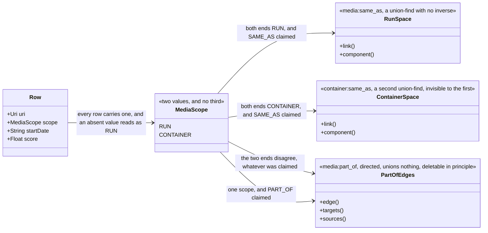
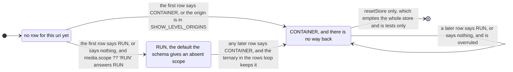

Two values, no third, and every media row in the store has one. `RUN` is one broadcast run: a cour, a
film, the thing a card on the page shows and the thing episodes belong to. `CONTAINER` is a show, a
series, a franchise page: the thing several runs are part of.

The enum is small and it decides almost everything. A row's scope picks which union-find its `SAME_AS`
claims are applied in, and there are two of them, one per scope. So a claim whose two ends disagree
about scope has no space to union in, and the store does the only honest thing left with it: it writes
a directed edge from the run to the container and drops the sameness.

`src/worker/resolvers/media/schema.gql:100-105`

> Which kind of thing a row names, and so which identity space its SAME_AS claims union in.
>
> Sameness is only ever asserted within one scope. A claim that crosses scopes is read as PART_OF,
> whatever the producer asked for: a run is part of its show, never the same thing as it.

The enum itself is `schema.gql:106-111`, and each value carries its own line. `:107`: *One broadcast
run: a cour, a film. The unit this store aggregates and the unit a card shows.* `:109`: *A show, a
series, a franchise page: something several runs are part of.* The store mirrors the enum rather than
importing the generated code, at `src/worker/store/types.ts:87-88`, with the same rule restated for a
reader who is inside the store and never sees the schema (`types.ts:80-85`):

> Which identity space a row lives in, mirroring `MediaScope` in the graphql schema.
>
> A RUN is one broadcast run, the unit this store aggregates. A CONTAINER is a show, a series, a
> franchise page: something several runs are part of. Sameness unions only within one scope; a claim
> across scopes is derived as PART_OF. See `upsertMedia` in ./db.ts.

## What the enum routes



*Four arrows out of a two-value enum, and only two of them can ever weld two rows together. This figure is a data model and carries no decision nodes on purpose; the branches that pick between these arrows are the 2x2 on [scopes and relations](/write/scopes-and-relations/), and the branches that pick a row's scope in the first place are figure three below.*

The two union-find labels are `db.ts:14-15`, `const MEDIA_SAME_AS = 'media:same_as'` and
`const CONTAINER_SAME_AS = 'container:same_as'`, and one line picks between them, `db.ts:94`:

```ts
const sameAsLabelFor = (scope: MediaScope) => scope === 'CONTAINER' ? CONTAINER_SAME_AS : MEDIA_SAME_AS
```

It is **total**. There is no third answer and no refusal in it, which means every scope decision the
store makes is carried entirely by `scopeOf` (`db.ts:91-92`) and by whatever wrote the row `scopeOf`
reads. That is why this page is a list of the places a scope is decided: nothing downstream can
second-guess them.

The header of the file says what the separation is for, `src/worker/store/db.ts:7-12`:

> Two identity spaces, one per scope. A run's SAME_AS unions in the first, a container's in the
> second, and nothing ever unions across them: a show-level id entering a run's cluster is what welded
> Mushoku Tensei season 1 to season 3 on the live site (the bare crunchyroll series id and the bare
> tvmaze show id were fuzzy merged into season 1's cluster on the search path, and season 3's media
> path then asserted sameness through one of them; `graph.link` is a union-find with no inverse).

:::danger[A union in either space is permanent]
`graph.link` (`src/worker/store/graph.ts:279-291`) is a union-find union. It reads both roots and, when
they differ, calls `uf.union(a, b)` (`graph.ts:82-105`), which ends at `graph.ts:103` with
`components.delete(oldRoot)`: the record of which members came from which side is destroyed. The whole
`UnionFind` surface is `has`, `find`, `union`, `component` and `allComponents` (`graph.ts:10-16`).
There is no split, no unlink and no disunion anywhere in the repo.

So a scope decision is not a display preference. It decides whether a claim reaches `db.ts:193`, and
once it has, those two clusters are one cluster for the life of the worker. The only reset is
`resetStore()` (`db.ts:509-513`), which empties the whole store and is tests only.
:::

## The ratchet

A row's scope is not stored as it arrived. `upsertMedia`'s rows loop stores
`scopeOf(media.uri) === 'CONTAINER' ? 'CONTAINER' : media.scope ?? 'RUN'` (`db.ts:146`), and that
ternary is a one-way door.



*The same figure as on [scopes and relations](/write/scopes-and-relations/), repeated deliberately, because this is the page other pages send a reader to. Nothing leaves CONTAINER except the total reset, and the self-loop is the transition worth reading: a later row saying RUN is not an error and does not fail, it is simply not believed.*

`src/worker/store/db.ts:142-145`

> Scope is STICKY toward CONTAINER: once any row for this uri said CONTAINER, a later row that says
> RUN or says nothing does not flip it back. The failure with no inverse is a wrong SAME_AS, and
> the failure of a wrong CONTAINER is a missing SAME_AS, which a later slice can recover. The
> merge function alone would let an incoming RUN overwrite it (scalars are last-write-wins).

:::caution[The ratchet has to be applied before `graph.set`, not by it]
`graph.set` merges an existing row through `lastWriteLongestArray` (`graph.ts:388-400`), and its scalar
rule is `result[key] = val ?? existing[key as keyof T]` (`graph.ts:396`): any incoming scalar that is
neither `null` nor `undefined` wins. `scope` is a scalar, so a row arriving with `scope: 'RUN'` would
overwrite a stored `'CONTAINER'` if the correction were left to the merge function. The ternary at
`db.ts:146` fixes the value first and `db.ts:147` writes the fixed one.

That merge is itself irreversible for every other field on the row. There is no per-source layer and no
provenance on a field, so nothing afterwards can ask what a given origin said. See
[the graph](/write/graph/).
:::

`tests/unit/worker/store/container-scope.test.ts:80-94` pins the door shut with three upserts of one
uri, CONTAINER then RUN then a row with no scope at all, asserting `CONTAINER` at the end. It then
makes a `RUN x RUN` `SAME_AS` claim against that uri and asserts the cluster is still a singleton, so
the flip attempt cannot buy a union either.

The trade in the comment is the whole argument for the asymmetry, and it is worth reading twice. A
wrong CONTAINER costs a link that never forms, and the next slice of data can form it. A wrong SAME_AS
costs two works fused into one, and nothing can take it apart.

## Who decides it

```mermaid
flowchart LR
  subgraph SRC["in the source, before the worker sees the row"]
    direction LR
    MK{"did the source stamp a scope?<br/><small>makeMedia spreads ...fields over scope: 'RUN'</small>"} -->|"said nothing: makeMedia's default answers"| RUN1["RUN"]
    MK -->|"stamped one, by its own rule"| OWN{"crunchyroll, as the worked example<br/><small>id === series.id ? 'CONTAINER' : 'RUN'</small>"}
    OWN -->|"the bare series id, which every season of it shares"| CT1["CONTAINER"]
    OWN -->|"an id carrying a season segment: one run"| RUN1
    PO["partOf stamps its own copy on the way out<br/><small>{ node: { ...node, scope: 'CONTAINER' }, relation: 'PART_OF' }</small>"] --> CT1
  end
  RUN1 --> NM{"did the graphql row carry a scope at all?<br/><small>(media.scope as StoreMedia['scope']) ?? 'RUN'</small>"}
  CT1 --> NM
  NM -->|"absent, so a run: what every source meant before scope existed"| IN["the row upsertMedia reads"]
  NM -->|"present, carried through untouched"| IN
  IN --> BS{"does this origin name shows only?<br/><small>SHOW_LEVEL_ORIGINS.has(originOf(uri))</small>"}
  BS -->|"imdb, the one entry: the row's own stamp is overruled"| SET["graph.set writes the corrected scope onto the row<br/><small>graph.set(media.uri, { ...media, scope }, { addLabels: ['media'] })</small>"]
  BS -->|"any other origin"| ST{"has any earlier row for this uri said CONTAINER?<br/><small>scopeOf(media.uri) === 'CONTAINER' ? 'CONTAINER' : media.scope ?? 'RUN'</small>"}
  ST -->|"it has, and a later RUN is not believed"| SET
  ST -->|"it has not: the row's own answer stands"| SET
  SET --> CL{"is every member of the cluster a CONTAINER?<br/><small>medias.every(media =&gt; media.scope === 'CONTAINER')</small>"}
  CL -->|"one run in it is enough: a mixed cluster is a run"| VR["the aggregate reports RUN<br/><small>and mints its _id in media:same_as</small>"]
  CL -->|"nothing in it names a run"| VC["the aggregate reports CONTAINER<br/><small>and mints its _id in container:same_as</small>"]
  SET --> PC{"the same question again, asked by the fuzzy pass<br/><small>cluster.every(media =&gt; media.scope === 'CONTAINER')</small>"}
  PC -->|"a run in it: the pass compares it as a run"| VR
  PC -->|"every member a container"| VC
  classDef irrev fill:#b03f33,stroke:#e0796f,color:#ffffff
  classDef ratchet fill:#8f5a0e,stroke:#f2b45c,color:#ffffff
  classDef view fill:#4572b5,stroke:#8db0de,color:#ffffff
  classDef refuse fill:#46464b,stroke:#8b8c93,color:#f2f2f4
  class PO,BS,ST ratchet
  class VR,VC view
```



*Left to right: three deciders inside a source, three inside the worker's write path, two on the read side. Not one node here is rose, and that is the point of the enum: a scope never unions anything, it only decides which union a later claim is allowed to reach.*

Eight sites, in the order the figure walks them.

1. **`makeMedia`'s default**, `src/sources/utils.ts:65`: `scope: 'RUN',`. It sits above the `...fields`
   spread, so a source that says nothing is naming a run. That is what every source meant before the
   enum existed.
2. **A source's own stamp**, one rule per module. Crunchyroll's is the clearest and is on the figure,
   `src/sources/crunchyroll/extractor.ts:174`, applied at `:180`:
   ```ts
   const scopeOf = (id: string, series: CrSeries) => id === series.id ? 'CONTAINER' as const : 'RUN' as const
   ```
   `crunchyroll/extractor.ts:170-173` says why:

   > An id with no season segment is the bare series id, which Crunchyroll shares across every season,
   > so it names the SHOW. It enters the store as a CONTAINER and never a run's identity space: the
   > bare cr:G24H1N3MP fuzzy merged into Mushoku Tensei season 1's cluster on the search path is what
   > welded season 1 to season 3 on the live site. Anything carrying a season segment is one run.

   The full fourteen-row table of which source decides how is on
   [scopes and relations](/write/scopes-and-relations/#which-source-answers-with-which-scope).
3. **`partOf`**, `src/sources/utils.ts:40`, which is a stamp and not only a relation:
   ```ts
   export const partOf = (node: GQLMedia): GQLMediaHandle => ({ node: { ...node, scope: 'CONTAINER' }, relation: 'PART_OF' })
   ```
   `src/sources/utils.ts:36-38`:

   > THIS IS THE SCOPE STAMP. A PART_OF target is by definition a container of this run, so the node
   > goes out as a copy scoped CONTAINER whatever it said, and the store then keeps it out of every
   > run's identity space for good (scope is sticky toward CONTAINER there). The input is left
   > untouched.

   The copy matters twice: the caller's own object is not mutated, and the target can never reach a
   run's union by any later route, because the ratchet holds the stamp.
4. **`normalizeToStoreMedia`**, `src/worker/store/normalize.ts:39`:
   `scope: (media.scope as StoreMedia['scope']) ?? 'RUN',`. The graphql row's `scope` is nullable
   (`schema.gql:266`: *Which identity space this row lives in. An absent value reads as RUN.*), and this
   is where the absence becomes a value. `normalize.ts:8-9`: *a source that says nothing about scope is
   naming a run, which is what every source did before scope existed.*
5. **The origin backstop**, `db.ts:42`: `const SHOW_LEVEL_ORIGINS = new Set(['imdb'])`, read through
   `originOf = (uri: string) => uri.slice(0, uri.indexOf(':'))` (`db.ts:44`). Exactly one entry. It is
   the first rung of `scopeOf` and it never looks at the store, so an `imdb:` uri is a CONTAINER before
   any row is consulted. Its comment (`db.ts:17-41`) is the history of the whole scope idea and is
   quoted in full on [scopes and relations](/write/scopes-and-relations/); the sentence that matters
   here is `db.ts:34-35`:

   > Now it reads as a SCOPE: a uri of one of these origins is a CONTAINER, whatever row it arrived in,
   > and `upsertMedia` derives the relation from the two scopes exactly as it does for a row a source
   > stamped CONTAINER itself.
6. **The sticky read in `upsertMedia`**, `db.ts:146`, the ratchet above.
7. **`scopeOfCluster` at aggregate time**, `src/worker/store/aggregate.ts:264-265`, with its rule stated
   at `:263`:
   ```ts
   // a cluster is a container only when nothing in it names a run: a legacy mixed cluster is a run
   const scopeOfCluster = (medias: Media[]): Media['scope'] =>
     medias.every(media => media.scope === 'CONTAINER') ? 'CONTAINER' : 'RUN'
   ```
   This is a different question from `scopeOf`. `scopeOf` answers about a uri and reads the store;
   `scopeOfCluster` answers about a set of rows, is recomputed on every read, and is biased the other
   way. It is also not cosmetic: `clusterId(uris, scopeOfCluster(medias))` (`aggregate.ts:310` and
   `:321`) passes it straight into `graph.componentId` as the identity space to mint the aggregate's
   `_id` in, so the cluster scope decides which union-find the id a client holds is keyed on.
8. **`profileCluster`'s copy of that rule**, `src/worker/store/fuzzy-merge.ts:283-285`, with its own
   wording of the same sentence: *a cluster is a container only when every member is: a legacy mixed
   cluster still names a run*. The profile's scope then decides which of the three handle-less link
   functions the fuzzy pass is allowed to call (`fuzzy-merge.ts:659-664`), under a comment worth the
   detour, `fuzzy-merge.ts:656-658`:

   > The verdict is the same whatever the scopes are; what it is allowed to DO is not. Two runs or two
   > containers union in their own space. A title match between a run and a show is a guess at
   > containment, so it rides an edge, never a union: the edge can be deleted, a union cannot.

### Six in the site's inventory, eight in the tree

The inventory this page was written against lists six deciders: `partOf`, `makeMedia`'s default, a
source's own stamp, `SHOW_LEVEL_ORIGINS`, the sticky read and `scopeOfCluster`. Two more are in the
code and both are load bearing, so the figure above draws eight.

- `normalizeToStoreMedia` (`normalize.ts:39`) is the site that turns an absent graphql `scope` into a
  stored `'RUN'`. `makeMedia`'s default only covers a row a source built with `makeMedia`; a row that
  reached the worker any other way, including a plugin's payload, is defaulted here.
- `profileCluster` (`fuzzy-merge.ts:285`) re-implements `scopeOfCluster` rather than importing it. The
  two agree today, character for character in effect, and nothing pins that they must. If one is ever
  changed, change both.

## Where a scope is deliberately not decided

Two places could stamp a scope, have an obvious value to stamp, and refuse to.

**`buildHandlesFromUri`** rebuilds one bare node per sibling named in an aggregated uri and gives none
of them a scope, `src/sources/utils.ts:458-463`:

> A rebuilt sibling is a BARE node, and carries no scope of the caller's. The caller has read nothing
> about those ids, so a stamp here was a claim about rows it never saw, written onto them: a CONTAINER
> caller flipped every run sibling to CONTAINER for good (scope is sticky that way in the store) and
> welded them in the container space, and a RUN caller minted a RUN row for a show whose own row was
> still in flight and unioned with it. The store holds a claim naming a bare node until the node's own
> source describes it, so the uri contributes the claim and nothing else, in every direction.

Both halves of that failure are on this page already: the CONTAINER half is the ratchet firing on a row
nobody read, and the RUN half is the race that `pendingClaims` exists for. See
[claims that wait](/write/pending-claims/).

**`episodePartOf`** (`src/sources/utils.ts:44`) is the episode form of `partOf` and stamps nothing,
because an `Episode` has no `scope` field. There is one episode identity space, not two, which is why
the asymmetries on [upsertEpisodes](/write/upsert-episodes/) read the way they do.

There is also one place where the absence of everything except a scope is itself information. The
placeholder gate refuses a row that names itself and describes nothing, and `media.scope !== 'CONTAINER'`
short-circuits the whole test (`db.ts:105-108`), so a row carrying nothing but a CONTAINER stamp is
stored. `db.ts:103`:

> A CONTAINER stamp counts as a description, since it is a source's own reading of the id.

## Who reads it back

Every reader below is written against `scopeOf` or against the row's own field, never against the
origin or the id shape.

| site | the condition, verbatim | what it decides |
| --- | --- | --- |
| `db.ts:185-186` | `const mediaScope = scopeOf(mediaUri)` / `scopeOf(handleUri)` | the 2x2: whether a claim becomes a union in the run space, a union in the container space, or an edge |
| `db.ts:219` | `scopeOf(uriA) === 'CONTAINER' \|\| scopeOf(uriB) === 'CONTAINER'` | a fuzzy title match with a container on either side is dropped, not demoted |
| `db.ts:234` | `scopeOf(uriA) !== 'CONTAINER' \|\| scopeOf(uriB) !== 'CONTAINER'` | the mirror: a run on either side is refused, because a run is never the same thing as a show |
| `db.ts:250` | `scopeOf(runUri) !== 'RUN' \|\| scopeOf(containerUri) !== 'CONTAINER'` | a positional pair is taken only in that order, and refused rather than flipped |
| `db.ts:263`, `:282` | `sameAsLabelFor(scopeOf(resolved))` | which identity space a read walks to gather a cluster |
| `db.ts:308` | `!graph.has(runUri) \|\| scopeOf(runUri) !== 'RUN'` | only a run counts as a run of a container |
| `db.ts:380` | `!isRun(media) && !listed.has(media.uri)` | a legacy mixed cluster keeps its container member on the run side rather than showing the row twice |
| `aggregate.ts:264` | `medias.every(media => media.scope === 'CONTAINER')` | the scope the page is told, and the space the aggregate's `_id` is minted in |
| `fuzzy-merge.ts:285`, `:659` | `cluster.every(media => media.scope === 'CONTAINER')`, then `a.scope !== b.scope` | which link function a decided match is allowed to call |
| `similar-consumer.ts:144` | `cluster.filter(media => media.scope !== 'CONTAINER')` | which uri a similarMedia ask is made on behalf of |
| `similar-consumer.ts:239` | `media.origin === ask.origin && media.scope !== 'CONTAINER'` | whether this origin's run is already in the cluster, so a second one is refused |
| `export.ts:62` | `!publishedMembers.some(member => member.scope !== 'CONTAINER')` | a cluster with no published run in it is not exported |

One reader deliberately does not trust the stamp. `isRunAnswerFrom` (`src/sources/similar.ts:125-129`)
tests the scope **and** the id:

```ts
answer.origin === origin && answer.scope !== 'CONTAINER' && answer.id !== showId
```

`similar.ts:122-123`:

> Whether an answer is a RUN of the asked origin, and never the show itself. A source answering with
> its bare show id is refused whatever scope it stamped, because that id is every season at once.

That is the right shape for a claim arriving from outside the store's own write path: the scope is a
source's assertion, and an assertion that contradicts an id we already know is not believed.

## One correction: the backstop is not handle-side only

Two comments in the tree say `SHOW_LEVEL_ORIGINS` is consulted on one end of a claim only.
`src/sources/catalogue-gate.ts:11-13`:

> Adding appletv to SHOW_LEVEL_ORIGINS does not help; db.ts tests the handle side only and Apple TV
> emits itself as the mediaUri.

and `tests/unit/worker/store/season-separation.test.ts:239-241` repeats it, quoting a call by name:
*db.ts tests `SHOW_LEVEL_ORIGINS.has(originOf(handleUri))`, the handle side only*. No such call exists.
The only read of the Set is inside `scopeOf`, at `db.ts:92`, and it takes whatever uri it is handed:
`SHOW_LEVEL_ORIGINS.has(originOf(uri))`.

**The code disagrees, and it is symmetric.** `scopeOf` is applied to both ends of every claim, at
`db.ts:185` and `db.ts:186`, and it is applied to the row's own uri in the rows loop at `db.ts:146`, so
a show-level origin arriving as the `mediaUri` is corrected exactly as one arriving as the `handleUri`
is. `tests/unit/worker/store/container-scope.test.ts:114-126` pins the row-side half directly: it
upserts `imdb:tt13303712` stamped `RUN`, and asserts *the stored row says what the backstop reads*,
`CONTAINER`.

Those comments describe the code as it was before the scope refactor, when a show-level origin was
handled by rewriting the **relation** of a handle to `PART_OF` rather than by scoping the **uri**.
`db.ts:28-32` records that changeover in the first person, and `src/sources/imdb/extractor.ts:13` is a
third comment still written against the old shape (*demotes every imdb handle to PART_OF*): nothing
rewrites a relation any more.

The conclusion those comments reach is still right, for a different reason. Adding `appletv` to the Set
would scope **every** Apple TV uri as a container, including the honest season-scoped ones the source
now mints at `src/sources/appletv/extractor.ts:105`
(`id: scoped ? seasonScopedId(content.id, season!.seasonNumber!) : content.id`). That throws away
correct handles to fix an id minted wrongly somewhere else, and the argument against it is written out
at `src/sources/simkl/extractor.ts:112-115`:

> `tmdb` deliberately does NOT go in `SHOW_LEVEL_ORIGINS` for this. Unlike imdb, tmdb CAN be scoped,
> and `tmdb/extractor.ts` mints a real `<id>-s<n>` through `seasonScopedId`. Exempting the origin would
> throw away those correct handles to fix a bare id minted somewhere else. The refusal belongs at the
> source that cannot make an honest id, which is this one.

That is the test for the Set, and it is why it has one entry. An origin goes in only when it can never
name a run: not because it happens to have named a show once. Apple TV can name a run, and now does
(`appletv/extractor.ts:102`):

```ts
const scope = scoped || content.type === 'Movie' ? 'RUN' : 'CONTAINER'
```

`appletv/extractor.ts:99-101` states the same rule the crunchyroll comment does, from the other side:

> The bare id of a Show is the id every season of it shares, so a row minted from it is the show, and
> the store keeps a CONTAINER out of every run's identity space. A film and a season-scoped row each
> name exactly one run.

Next: the 2x2 the scope feeds, on [scopes and relations](/write/scopes-and-relations/); the three
union-find spaces and the six other tracks over the same node store, on
[the three identity spaces](/invariants/identity-spaces/); and what a handle asserts before any of this
runs, on [a handle is an identity claim](/invariants/handle-is-a-claim/).
