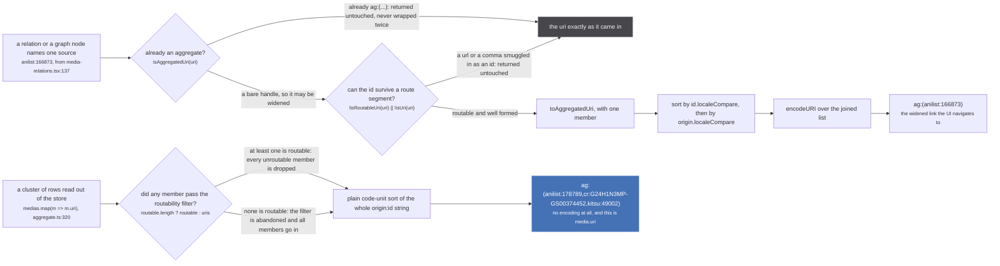
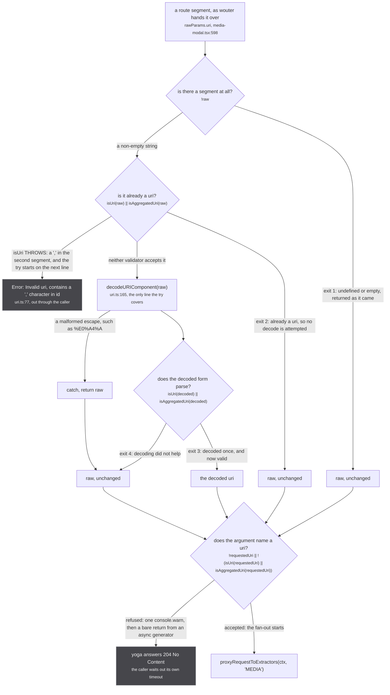
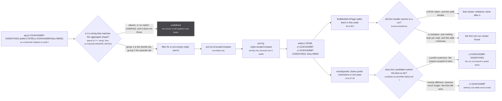

Every name in stub is a pair: an origin and an id, joined by a colon. `anilist:166873`. `cr:G24H1N3MP-GS00374452`. `mal:59193`. A source can only ever say what its own catalogue said, so a uri names the catalogue as well as the row.

A cluster of them is written as one string, and that string is what a page's address holds:

```text
ag:(anilist:178789,cr:G24H1N3MP,cr:G24H1N3MP-GS00374452,kitsu:49002)
```

That is Mushoku Tensei season 2 as four catalogues name it, and it is the fixture the tests use (`tests/unit/utils/uri.test.ts:69`). Two of the four handles are Crunchyroll's, which is a defect the grammar does not fix and which [the ordering rules](#one-ordering-and-three-functions-that-depend-on-it) exist to survive.

The grammar, from the type declarations at `src/utils/uri.ts:3-7` and `:95`:

```text
uri             = origin ':' id
uris            = uri ( ',' uri )*
aggregated uri  = 'ag:(' uris ')' ( '-' episodeId )?
```

and it is read back by one regular expression, `src/utils/uri.ts:97`:

```ts
const SCANNARR_REGEX = /ag:\((.*)\)(?:-(.*))?/
```

Group one is the handle list, group two the optional episode tail. `(.*)` is greedy, so the split is at the **last** `)` in the string, which is what lets an episode uri carry a hyphen of its own.

## An id has to survive being put in a path

The route table builds paths by interpolation, with no encoding anywhere: `` `/media/${uri}` `` at `src/router/path.ts:18`, and `/watch/:mediaUri/:episodeUri/:sourceUri?` at `path.ts:49`. So a character that means something to the grammar, or to the router, cannot appear in an id.

`src/utils/uri.ts:82`

> a ',' splits the handle list inside `ag:(...)` and a '/' splits ONE segment of a route path ('/watch/:mediaUri/:episodeUri'), so either one silently turns a working uri into one no route matches

```ts
const UNROUTABLE_IN_ID = /[,/()]/                                   // uri.ts:83

export const isRoutableUri = (uri: string): boolean => {            // uri.ts:85
  const colon = uri.indexOf(':')
  return colon > 0 && !UNROUTABLE_IN_ID.test(uri.slice(colon + 1))
}
```

Two conditions: a colon that is not at index 0, and none of `,` `/` `(` `)` anywhere after the **first** one. Note what that means for the aggregate itself. `ag:(anilist:1)` fails `isRoutableUri`, because of its own parentheses. The test is for **members**, which is why the one producer that filters applies it to the member uris and never to its own output (`src/worker/store/aggregate.ts:298`).

The failure it prevents is not an error, it is a page that does not exist. `tests/unit/utils/uri.test.ts:43-44`:

> A '/' splits '/watch/:mediaUri/:episodeUri' and a ',' splits the `ag:(...)` handle list, so either one builds a media uri that matches no route at all - a bare "404 No page found".

## Two producers, two encodings

Two functions in this codebase build an `ag:(...)` string, and they do not agree with each other.



*The upper lane widens one source into a cluster of one so the store has something to grow. The lower lane is a view: it is recomputed from the cluster on every read, and it is the string that ends up in the address bar.*

**The upper lane is `asAggregatedUri` (`src/utils/uri.ts:120-128`).** It exists because a relation names a work by the single source that mentioned it:

`src/utils/uri.ts:108-118`

> The routable form of a work's uri: an aggregate, even when only one source is known.
>
> A relation and a graph node name a work by the SOURCE that mentioned it, `anilist:166873`, because that is all the naming source could say. Linking straight to it opens a page pinned to one source: the store has a single row to work with, so no other source is ever asked and the page shows whatever AniList alone knows. Wrapped as `ag:(anilist:166873)` it is the same work asked as a CLUSTER, which is the form the store keeps resolving: it fans out to the other sources, folds in whatever answers, and the modal rewrites its own address as the cluster grows.

Its second guard is the one worth reading twice, at `uri.ts:122-125`:

> ROUTABLE, not merely well formed. `isUri` only counts colon separated parts, so it accepts `https://example.test/x` as origin `https`; wrapped, the slashes in the id would split the route segment and the link would match no page at all. `isRoutableUri` is the check that asks whether the id can survive being put in a path.

**The lower lane is `buildAggregatedIdentity` (`src/worker/store/aggregate.ts:296-304`)**, and it is the one that matters most, because its output is assigned to `uri` at `aggregate.ts:355`, to `id` at `:356`, and interpolated into the media's public `url` at `:358`. Every multi-source page address on the site came out of these four lines.

`src/worker/store/aggregate.ts:297`

> one handle carrying a ',' or a '/' would split the list or the route path, and the media's whole watch page becomes unreachable

Its branch is the interesting half. `[...(routable.length ? routable : uris)]` at `:299` means the filter is **abandoned** when nothing survives it: rather than produce nothing, it produces an `ag:(...)` the route cannot carry. That is deliberate in the sense that an empty aggregate would be worse, and it is the only path on the site that can hand out an unroutable address.

Three differences between the lanes, in order of how much they cost:

1. **The routability filter.** `asAggregatedUri` refuses and returns the input untouched. `buildAggregatedIdentity` drops unroutable members, and drops the filter entirely when that would leave nothing.
2. **The encoding.** `toAggregatedId` calls itself once with `sort = false`, which is the `encodeURI(...)` at `uri.ts:192`. `buildAggregatedIdentity` never encodes. But `encodeURI` escapes **none** of the characters that break a route: measured in node, `encodeURI('cr:a,b/c(d) e')` returns `cr:a,b/c(d)%20e`. It escapes the space and leaves `,` `/` `(` `)` `:` alone. So the encoding difference shows up only for a space or a non-ASCII character in an id, and percent-encoding is never what makes a uri routable.
3. **The sort.** `toAggregatedId` sorts by `id.localeCompare` and then by `origin.localeCompare` (`uri.ts:186-187`). `buildAggregatedIdentity` does a plain `[...].sort()` of the whole `origin:id` string (`aggregate.ts:299`). The two agree whenever each origin contributes at most one handle, because the colon terminates the origin comparison before any id character is reached. They disagree on case: `['cr:G24','cr:g24'].sort()` gives `G24` first, while `['G24','g24'].sort((a, b) => a.localeCompare(b))` gives `g24` first. Both measured in node against the tree at `883aec9`.

:::note
**The third difference cannot fire today, and the page brief says it can.** `toAggregatedUri` has exactly one live call site in the repo, `asAggregatedUri` at `uri.ts:127`, and it passes a **single member** array, so its sort orders one element. The other caller, `mergeAggregatedUris` (`uri.ts:246-264`), is exported and called by nothing: a repo-wide grep for it over `*.ts` and `*.tsx` outside `node_modules` returns only its own definition. The two encodings are live. The two orderings are latent, and would become real the moment `mergeAggregatedUris` acquires a caller.
:::

## One validator throws, and it is called before the try

Three validators, three temperaments.

```ts
export const isUri = (uri: string): uri is Uri => {                      // uri.ts:71
  const parts = uri.split(':').filter(part => part.length)
  if (parts[1]?.includes(',')) throw new Error(`Invalid uri: ${uri}, contains "," character in id`)
  return parts.length === 2
}
```

`isUri` is the only function in the file that throws (`uri.ts:77`), and it is permissive about everything else. `filter(part => part.length)` drops empty segments, so `foo::bar` reads as two parts and passes. `https://example.test/x` splits to `['https', '//example.test/x']`, which is two parts, so it passes too. Well formed is not routable, and the comment quoted above says exactly that.

`isAggregatedUri` (`uri.ts:99-105`) never throws and has one exit worth knowing: `!uris` at `:104` is true when the match group is empty, so **`ag:()` is a valid aggregated uri**. Downstream it parses to `handleUris: []`, the fallback loop in `findMediaForPage` at `src/worker/store/db.ts:353` runs zero times, the cluster comes back empty, and the media subscription stays open yielding nothing. It is a well formed request for no work at all.

`decodeRouteUri` (`uri.ts:162-170`) is the gate every route parameter passes through first, and it exists because of a page that rendered and then did nothing:

`src/utils/uri.ts:152-160`

> A uri as it arrives in a ROUTE PARAMETER, percent-decoded once when that is what makes it a uri.
>
> wouter hands a path segment through undecoded, and `isUri` and `isAggregatedUri` both refuse `ag%3A(...)`, so a link built with `encodeURIComponent`, or normalised by a share sheet or a chat client, rendered the page's shell and then sat empty forever: the media subscription returned before asking a single source, with no error anywhere (measured 2026-09-05, where it cost a session of measurement against pages that were never subscribed). A segment that is already a uri, or that decodes to nothing a uri validator accepts, comes back unchanged, so it reaches the same refusal it always did.



*Four exits, all of which continue to the resolver's own gate, and one throw that never reaches it. Decoding happens once and never in a loop.*

The gate at the bottom is `src/worker/resolvers/media/index.ts:34-37`, and `decodeRouteUri` is called on the line above it, at `:33`. That ordering is the whole point of the function: the resolver's own validators are the same two that refuse `ag%3A(...)`, so without the decode the refusal fires on a request that was perfectly good.

**The throw is not caught anywhere on that path.** `decodeRouteUri` opens its `try` on `uri.ts:164` and calls `isUri(raw)` on `:163`, one line above it, so a segment like `foo:a,b` throws out of `decodeRouteUri` itself. `media/index.ts:33` is not inside a try either, and the app yoga is built with `maskedErrors: false` (`src/worker/yoga.ts:28`), so it surfaces to the page as a GraphQL error carrying the message rather than as the refusal on the very next line. Same input, two entirely different observable outcomes depending on whether the comma is in the second colon-separated segment or a later one.

That refusal is the only one in the system that logs, and the reason is worth carrying here:

`src/worker/resolvers/media/index.ts:35`

> a refused page and a slow one are indistinguishable from outside the worker without this

## One ordering, and three functions that depend on it

`fromAggregatedUri` (`uri.ts:212-230`) does not return the handles in the order the string spelled them. It sorts twice:

```ts
const uris = fromUris(match[1] as Uris)
  .filter(elem => elem.origin && elem.id)
  .sort((a, b) => a.id.localeCompare(b.id))        // uri.ts:219
  .sort((a, b) => a.origin.localeCompare(b.origin))  // uri.ts:220
```

`Array.prototype.sort` is stable, so the **last** sort is the primary key: origin first, id second within an origin. Everything downstream reads that order and nothing re-sorts.



*The four handles reach both consumers in the same order, and both consumers are order-dependent by design. Neither scores anything: the sort is the whole decision procedure.*

**`findMediaForPage` walks the handles one at a time** (`src/worker/store/db.ts:349-364`), which is what makes an old bookmark still open something:

`src/worker/store/db.ts:342-347`

> The cluster a media page shows for the uri it was asked for.
>
> The uri itself first (an alias resolves there too), then, for an aggregated uri, its handles one by one: a bookmark carries ids that may have clustered differently since. A handle naming a RUN wins over one naming a show whichever comes first in the uri, because a uri that mixes the two came off a run's page. What is found is then shown as `preferAttachedRun` says.

A run wins outright and breaks the loop (`db.ts:356-359`); a container is kept only if nothing has been kept yet (`db.ts:360`), so among containers the origin that sorts first decides.

**`mostSpecific` (`uri.ts:34-41`) is a single pass over the same list**, and it is single-pass only because the list is already sorted by id within an origin. Its comment is the best argument on this page:

`src/utils/uri.ts:15-32`

> The handle of `origin` that a source should answer about, preferring the MOST SPECIFIC one.
>
> This used to take the first match of a list `fromAggregatedUri` sorts by id, and a show-level id is a strict PREFIX of its own season-scoped form, so the show always sorted first and always won. `cr:G24H1N3MP` beat `cr:G24H1N3MP-GS00374452` in every locale, which is how the Crunchyroll source came to be asked about a whole series while the correct handle for the run sat in the same cluster, unreachable. It answered with every season's episodes and a 14 episode season page listed 24 rows.
>
> SPECIFICITY IS PREFIX EXTENSION, NOT LENGTH, and the distinction is the whole safety of this. Two unrelated ids of one origin say nothing about each other however long they are, so the longer is not more specific and picking it would be a different arbitrary answer rather than a better one. Only `<a>` against `<a>-<something>` is a claim that the second names a part of the first, and that is exactly the shape every season-scoped id in this codebase is built in: `crunchyrollId` joins on '-', `jwId` and `seasonScopedId` likewise.
>
> TWO ids of one origin in one cluster is itself a defect and this does not fix it, it only stops the defect choosing the worst of them. When neither extends the other the first still wins, which is arbitrary but stable, and stability is what keeps a source answering the same way twice.

The three id builders it names all join on a hyphen, and all three are one line: `crunchyrollId` at `src/sources/crunchyroll/extractor.ts:151-152`, `jwId` at `src/sources/justwatch/id.ts:20`, `seasonScopedId` at `src/sources/season.ts:189`. That shared shape is not a coincidence, it is the contract `mostSpecific` reads.

The ordering claim it rests on is checkable, and it holds: `'G24H1N3MP'.localeCompare('G24H1N3MP-GS00374452')` returns `-1`, so a prefix always precedes what extends it and one forward pass is enough (`uri.ts:36`). The two tests that pin both halves are `tests/unit/utils/uri.test.ts:71-72` for the win, and `:89-92` for the control that a merely longer id does **not** win: `ag:(cr:AAAA,cr:ZZZZZZZZZZZZ)` resolves to `AAAA`.

The `typeof uri !== 'string'` guard on `uri.ts:213` has a story of its own, and it is not defensive tidiness:

`src/utils/uri.ts:202-211`

> ABSENT counts as not one, and that guard is load bearing rather than defensive tidiness. On a browser `popstate`, `Home` re-renders BEFORE wouter's `<Switch>` does, because a browser dispatched event runs a microtask checkpoint between its listeners while an app dispatched one does not. So `useRoute('/media/:uri')` is already true while the surrounding params context still holds the previous route's empty params, and `MediaModal` matched against `params.uri === undefined` for a render or two. Dereferencing it threw mid render, and stub has no error boundary anywhere, so Preact abandoned the commit and left the already mounted Home subtree ORPHANED in the DOM. The next render appended a fresh copy beside it: back and forward a few times and the homepage stacked, each clone's hero absolutely positioned at the same place, which is the overlapping titles the owner saw.

## The episode tail

`toUriEpisodeId` (`uri.ts:277`) is `` `${uri}-${episodeId}` ``, and it is read back two ways. `fromAggregatedUri` returns it as `episodeId` from `match[2]` (`uri.ts:228`), which splits at the last `)`. `fromUriEpisodeId` (`uri.ts:278-281`) splits at the last **hyphen**, by reversing the string, splitting, and reversing back:

```ts
export const fromUriEpisodeId = (uri: Uri) => ({
  uri: [...(uri as string)].reverse().join('').split('-').slice(1).join('-').split('').reverse().join('') as Uri,
  episodeId: [...(uri as string)].reverse().join('').split('-').at(0)?.split('').reverse().join('') as string
})
```

That is why the season-scoped ids above all join on a hyphen and none of them contain one internally: `cr:G24H1N3MP-GS00374452-GEVUZ8DP` has to split back to a media of `cr:G24H1N3MP-GS00374452` and an episode of `GEVUZ8DP`, and a last-hyphen split is the only rule that gets there. Sources honour the same convention when they mint a movie's single episode, at `src/sources/utils.ts:98` and `:103`.

## Growing the address

A page opened knowing one source ends up naming all of them, because the store keeps folding sources into the cluster and the aggregate's `uri` grows with it. `shouldGrowAddress` (`uri.ts:143-149`) decides when the modal rewrites its own address, and it has two conditions rather than one:

`src/utils/uri.ts:134-141`

> The address grows as the store folds more sources into a cluster, so a page opened knowing one source ends up naming all of them. Two conditions, and the second is the one that is easy to miss: the cluster in hand must be BIGGER, and it must be the SAME WORK.
>
> Without the identity check a navigation eats itself. The address changes first and the page still holds the previous work for a beat, so a link to a work known through one source is judged against the old cluster's eight handles, read as a shrinking address, and replaced with the page being left. Every relation and every graph node did nothing at all when clicked (measured 2026-09-09).

The identity half is `matchAggregatedUris` (`uri.ts:266-275`), and it is **any shared handle**, not equality. That is the right test for a growing address and the wrong one for anything that needs identity: two clusters that share one handle are the same cluster as far as this function is concerned, which is exactly the assumption the fuzzy pass is careful never to make.

## The uri is user input, and it reaches graph.link

:::danger
**A uri does not merely address rows, it asserts sameness about them.** `buildHandlesFromUri` (`src/sources/utils.ts:465-471`) turns every handle in an aggregated uri into a `SAME_AS` claim on a bare node, and a `SAME_AS` claim within one scope is a `graph.link`, which is a union-find union with **no inverse anywhere in the repo**. Four source modules call it or `mergeHandles` on the uri they were handed, across seven call sites: unogs (`extractor.ts:439`, `:457`), appletv (`:380`, `:393`), crunchyroll (`:527`) and justwatch (`:711`, `:738`). So a hand-edited address, a stale bookmark or a shared link is a write path into the store.

`src/sources/utils.ts:445-450`

> Every handle an aggregated uri names, as SAME_AS, minus the caller's own origin.
>
> SAME_AS PRESERVES TODAY'S BEHAVIOUR and is not an endorsement of it. The uri is user input: a stale bookmark re-injects whatever claims it carries, and `graph.link` has no inverse. What makes that worth keeping for now is the shared-link case, where the uri is the only evidence those siblings exist until their own sources answer.

The only reset is `resetStore()` (`src/worker/store/db.ts:509-513`), which empties the whole store and is tests only. See [the graph](/write/graph/) for what a union destroys on the way through.
:::

:::caution
**The rebuilt siblings carry no scope, and that is deliberate.** A rebuilt handle is a bare node, so a `CONTAINER` caller does not stamp every sibling `CONTAINER` for good, and a `RUN` caller does not mint a `RUN` row for a show whose own row is still in flight. Scope is sticky toward `CONTAINER` in the store, so a stamp written here would be a one-way door pushed by a caller that read none of those rows (`src/sources/utils.ts:458-463`).
:::

## Where the code disagrees with the brief

- **`mergeAggregatedUris` has no caller.** The two-producer comparison is only half live: the encodings differ in practice, the sorts cannot, because `toAggregatedUri`'s single live call site passes one member. Written above as a `:::note` where it belongs.
- **"Percent-encodes" does not mean "makes routable".** `encodeURI` escapes none of `,` `/` `(` `)`, which is the entire `UNROUTABLE_IN_ID` set. The routability filter is what protects a route, and only `buildAggregatedIdentity` and `asAggregatedUri` apply it.
- **The producer that reaches the address bar is the one that does not encode.** `buildAggregatedIdentity`'s output is `media.uri` (`aggregate.ts:355`) and `media.url` (`:358`), so it, not `toAggregatedUri`, is the grammar's real author.
