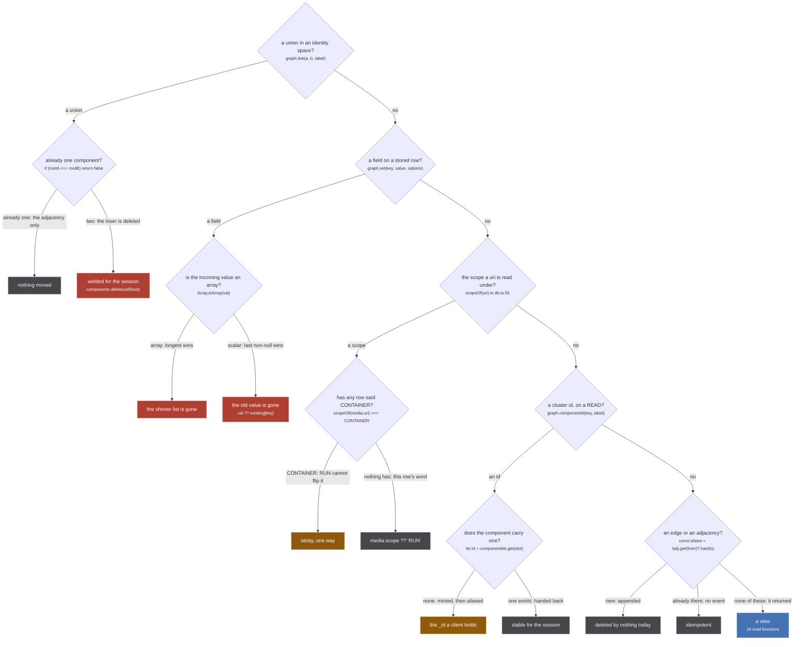
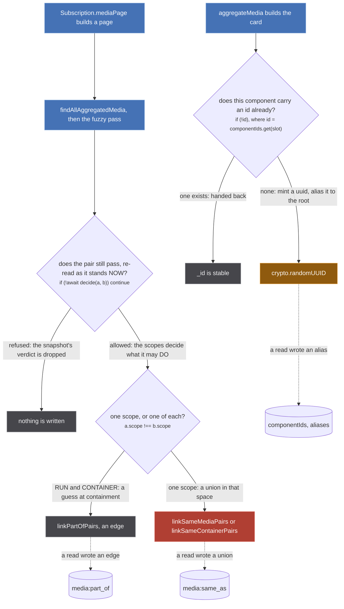
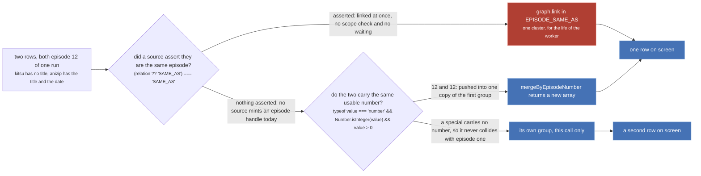

Ask one question of any line in the store and most of the confusion goes away: **does this change what
the next reader sees, or does it only change what this reader is told?**

`src/worker/store/consensus.ts:247-250`, on why an episode's number is corrected in a returned copy
rather than in the stored row:

> READ TIME, AND A COPY. The stored node keeps Crunchyroll's own number, because it is keyed by
> Crunchyroll's guid and is reachable through the whole season from other paths: `graph.set` is
> last-write-wins, so rewriting it here would change what those other readers see. What the run needs
> is a VIEW, and a view is what this returns.

That is the whole distinction. A view is recomputed on every read from the rows as they stand, so a
mistake in one lasts until the next render. A write is the store's memory, and the store has no undo.

:::danger
**Two of the store's primitives cannot be reversed, and one of them is the union.**

`graph.link` (`src/worker/store/graph.ts:279-291`) calls `connect`, then `uf.union`, and `union` ends
at `graph.ts:103` with `components.delete(oldRoot)`. That line destroys the record of which members
came from which side, so nothing afterwards can be asked what the component would hold with one node
removed. Grep the tree for an inverse and there is none: no `unlink`, no `split`, no `unmerge`
anywhere under `src/`. The only thing that undoes a union is `graph.clear()` (`graph.ts:363-375`),
reached only from `resetStore` (`db.ts:509`), which is tests only and is not even exported through
`./index.ts`.

`graph.set` is irreversible in the other direction. Its merge function
`lastWriteLongestArray` (`graph.ts:388-400`) is scalars last-write-wins and arrays longest-wins, with
no per-source layer and no provenance, so the previous value of a field is simply gone and no reader
can ask what a given origin said.

`src/worker/store/anomalies.ts:20-23`:

> One source names one thing once. Two of its ids in a cluster means a union happened that the source
> itself would refuse, and `graph.link` has no inverse, so it is permanent for the session.
:::

## The ledger



*Five questions sort every mutation in the store into a band. Only two branches of one decision reach rose, and one of them is a field overwrite nobody thinks of as permanent.*

**Never undoable.** The union at `graph.ts:279-291`, reached from four call sites: `db.ts:193` (a
handle a source asserted), `db.ts:220` and `db.ts:235` (the fuzzy pass), and `db.ts:410` (an episode
handle). And every field write through `graph.set`, whose array branch at `graph.ts:392-394` discards
the shorter list outright and whose scalar branch at `graph.ts:396` is `val ?? existing[key]`. Read
that last one twice: an incoming `null` never erases a stored value, so a source that wants to
*correct* `episodeCount: 13` to nothing cannot. Fields are effectively monotonic, and a wrong one is
wrong until a different source overwrites it with something non-null.

**One-way ratchets.** These can still be moved, but only in one direction, so the failure they protect
against is chosen deliberately. `db.ts:142-145`:

> Scope is STICKY toward CONTAINER: once any row for this uri said CONTAINER, a later row that says
> RUN or says nothing does not flip it back. The failure with no inverse is a wrong SAME_AS, and the
> failure of a wrong CONTAINER is a missing SAME_AS, which a later slice can recover. The merge
> function alone would let an incoming RUN overwrite it (scalars are last-write-wins).

`SHOW_LEVEL_ORIGINS` (`db.ts:42`, one member, `'imdb'`) is the same ratchet applied before any row is
read: `scopeOf` (`db.ts:91-92`) tests it first, so an `imdb:` uri is a CONTAINER whatever row it
arrived in. The third ratchet is the cluster id at `graph.ts:234-244`, which is a write and is covered
below.

**Append only, and deletable in principle.** `graph.edge` (`graph.ts:297-306`) and `graph.connect`
(`graph.ts:265-273`) add to an adjacency and union nothing, which is the entire reason guesses are
routed onto them. `db.ts:171`:

> Guesses go on edges, which are deletable; only asserted sameness within one scope goes on a union.

Note "in principle": `Graph` has no `delete` on its type (`graph.ts:18-54`) and nothing in `src/` ever
removes an edge. The claim is about what the shape permits, not about a feature that exists. The same
band holds `pendingClaims` (`db.ts:124`), which is a real map that really is deleted, but only when
the row it waits for lands (`db.ts:158`); an entry whose row never arrives stays for the session,
unbounded and with no expiry.

**Views.** Eighteen named functions read the store and write nothing at all:
`findAggregatedMedia` (`db.ts:257`), `findPartOfMedia` (`db.ts:276`), `findRunsOfContainer`
(`db.ts:303`), `preferAttachedRun` (`db.ts:334`), `findMediaForPage` (`db.ts:349`),
`findAllAggregatedMedia` (`db.ts:374`), `hideAttachedContainers` (`db.ts:391`), `findRunEpisodes`
(`db.ts:424`), `findAggregatedEpisodesForMedia` (`db.ts:432`), `mergeByEpisodeNumber` (`db.ts:475`),
`tieredConsensus` (`consensus.ts:36`), `runLength` (`consensus.ts:62`), `alignmentOffset`
(`consensus.ts:113`), `runEpisodes` (`consensus.ts:157`), `alignRunEpisodes` (`consensus.ts:256`),
`aggregateEpisode` (`aggregate.ts:401`), `applyMediaFilters` (`filter.ts:54`) and `exportStore`
(`export.ts:31`). Only one of them says so out loud, `export.ts:16`:

> Promises: it reads, and never writes.

The nineteenth read function, `aggregateMedia` (`aggregate.ts:306`), is a view in every line but one.
That line is the next figure.

:::note
The inventory this page was written from lists fifteen view functions and puts phantom union-find
members in the append-only band. The code disagrees on both counts and wins. There are eighteen pure
view functions plus `aggregateMedia`, listed above with their lines. And a phantom member (a uri that
`link` handed to `uf.find`, which calls `ensure` at `graph.ts:61-67` and creates a singleton for any
string) is exactly as permanent as a union: no union-find member is ever removed. It is invisible
rather than reversible, because `cluster` and `clusters` skip a member with no stored row
(`graph.ts:321-323`, `graph.ts:349-351`). Every read-side union-find access is guarded by `uf.has`
first, so a read never creates one; only `link` does.
:::

## Two reads that write



*A dashed arrow crosses the read and write line. These two are the only ones in the store, and both sit on the paths that draw a card, which are the paths that run most often.*

**The fuzzy pass, inside `getPage`.** `src/worker/resolvers/media/index.ts:127` calls
`fuzzyMergeMediaClusters` in the middle of assembling a page and re-reads the clusters when it
returns true. That function ends with unions and edges (`fuzzy-merge.ts:659-666`), so rendering a
listing can permanently change the store. What keeps it honest is that every verdict is checked twice,
`fuzzy-merge.ts:637-647`:

> Every verdict above was computed against a SNAPSHOT taken before the first await, and the pass
> awaits the wasm matcher hundreds of times: extractor.ts flushes its DataLoader batch on a 50ms timer
> throughout, and each flush can weld more medias into a component that has already been judged.
> Applying a verdict about a small component to whatever that component has become is how a
> Crunchyroll season 1 gets welded into a component that grew a season 2 while the pass ran, and
> graph.link has no inverse. So the two components are read again as they stand NOW and put through
> the same checks, with the link applied in the same turn as the check that allowed it. This can only
> ever REFUSE a link the snapshot allowed - it is an AND with the original verdict, never a
> replacement.

And the verdict alone does not decide the permanence: `fuzzy-merge.ts:656-658` splits it by scope,
because a title match between a run and a show is a guess at containment and rides an edge, while two
runs or two containers union in their own space. *The verdict is the same whatever the scopes are;
what it is allowed to DO is not.*

**The cluster id.** `aggregate.ts:293-294` is a single expression, `graph.componentId(uris[0]!,
IDENTITY_LABELS[space])`, and it mints a uuid the first time any cluster is aggregated
(`graph.ts:238-241`) and aliases that uuid to the component root. It is a ratchet rather than a weld:
the id can move to a different root, never to nothing. `graph.ts:246-248` says why the choice is made
by size rather than by the union-find:

> Which id survives a union is decided here by SIZE and then by the smaller root, never by the
> union-find's own choice of root: that one follows rank and argument order, so an id that followed it
> would change with the order two sources happen to land in.

The losing uuid is not deleted either. `carryComponentId` aliases it to the survivor
(`graph.ts:262`), so an `_id` a client is still holding resolves after a merge instead of pointing at
nothing. That is also why `similar-consumer.ts:85-87` refuses to key its own records on it:

> A record is found by MEMBER INTERSECTION rather than by `graph.componentId`: `carryComponentId`
> keeps one of the two ids on a union, so a record keyed on the id that did not survive would be
> orphaned and re-asked.

## The same outcome, opposite permanence

Two episode rows collapsing into one row on screen has two completely different implementations in
this store, and they are worth putting side by side because the screen cannot tell them apart.



*The two paths meet at the same row on screen. One of them survives the render and the other does not exist a millisecond after it.*

The union is `db.ts:409-411`, and it is the least guarded `graph.link` in the file:

```ts
for (const { episodeUri, handleUri, relation } of handles) {
  if ((relation ?? 'SAME_AS') === 'SAME_AS') graph.link(episodeUri, handleUri, EPISODE_SAME_AS)
  else graph.edge(episodeUri, handleUri, EPISODE_PART_OF)
}
```

No placeholder gate, no `pendingClaims`, no scope pair, none of the five defences `upsertMedia` puts
in front of its own union. `upsertEpisodes` also emits `episode:changed` unconditionally at
`db.ts:414`, where `upsertMedia` guards its emit on `changed` (`db.ts:200`) precisely to stay out of
the re-read loop `tests/unit/worker/store/edge-idempotence.test.ts` exists to pin.

**Nothing mints one today.** `episodeSameAs` and `episodePartOf` exist at `src/sources/utils.ts:43-44`
and neither has a caller anywhere in the tree, and no `makeEpisode` call passes a `handles` list, so
`EPISODE_SAME_AS` is a live union with no producer. The read side was built around exactly that
absence. `db.ts:458-463`:

> Within ONE run, two episodes carrying the same number are the same episode.
>
> Episodes only ever merged through an explicit `EPISODE_SAME_AS`, which nothing mints between two
> metadata sources, so a run described by two of them came out as two full lists rather than one.
> Measured 2026-09-09 on Mushoku Tensei season 2 part 2: twelve kitsu episodes with no titles followed
> by the same twelve from anizip with every title and date, drawn as twenty four rows.

`mergeByEpisodeNumber` (`db.ts:475-494`) fixes that per call. It keys on the number alone, it copies
the first group it keeps (`const started = [...group]`) and pushes into the copy, and it returns a new
array of arrays. Nothing about the store moves. Run it twice and you get two independent answers; stop
calling it and the twenty four rows are back, which is the definition of a view.

The safety argument is the interesting half, `db.ts:465-468`:

> SAFE ONLY BECAUSE THE INPUT IS ONE RUN. The caller passes the uris of a single media cluster, which
> is its SAME_AS set by construction, and a run numbers its episodes once. This is emphatically not a
> rule about episodes in general: two runs of a show both have an episode 1, which is why nothing may
> read episodes across a PART_OF and why this must never be handed a container's uris.

A view is allowed to make that argument. A union is not, because a union would carry the mistake into
every other read for the session. The two mechanisms compose rather than compete:
`tests/unit/worker/store/episode-merge.test.ts:33` pins `[kitsu:1, cr:1]` (a stated same-as group)
plus `[anizip:x-1]` (a view match on the number) coming out as one group of three.

## Where the line actually is

Eighteen lines in the whole tree call a mutating method on the graph. Two of them run once at module
load (`db.ts:85-86`, registering the merge functions) and one is `resetStore` (`db.ts:510`). Of the
fifteen that remain, **fourteen are in `db.ts` and one, `aggregate.ts:294`, runs on a read.**

| line | call | band |
| --- | --- | --- |
| `db.ts:147` | `graph.set` a media row | field overwrite, never undoable |
| `db.ts:189` `:195` | `graph.edge` under `ASSERTED_LABELS.PART_OF` | append only |
| `db.ts:190` `:196` `:251` | `graph.edge` under `MEDIA_PART_OF` | append only |
| `db.ts:192` | `graph.connect` under an asserted label | append only, unions nothing |
| `db.ts:193` | `graph.link`, a handle a source asserted | **never undoable** |
| `db.ts:220` `:235` | `graph.link`, the fuzzy pass | **never undoable** |
| `db.ts:405` | `graph.set` an episode row | field overwrite, never undoable |
| `db.ts:406` | `graph.edge` under `HAS_EPISODE` | append only |
| `db.ts:410` | `graph.link` under `EPISODE_SAME_AS` | **never undoable** |
| `db.ts:411` | `graph.edge` under `EPISODE_PART_OF` | append only |
| `aggregate.ts:294` | `graph.componentId`, on a read | ratchet |

Two members of `Graph` have no caller outside `graph.ts` at all: `setLabel` (`graph.ts:202`) and
`alias` (`graph.ts:225`), the second of which is only ever reached through `componentId` and
`carryComponentId`. `findOrigin` and `findOrigins` (`db.ts:523`, `db.ts:527`) are views too, left out
of the count above because they read `originMap` rather than the graph.

So the audit is small enough to do by hand, and that is the point of putting every gate inside
`upsertMedia` rather than at the call sites: **a new caller inherits the defences instead of having to
remember them.** `similar-consumer.ts:255` is the proof, one hand-built claim with no `sameAs()` call
and no resolver hop, and it still passes every gate because the gates live in the function it calls.

## Where to go next

- what makes a union a claim rather than a link, and the three incidents behind the gates:
  [a handle is an identity claim](/invariants/handle-is-a-claim/)
- the two spaces a union can happen in, and the three that union nothing:
  [the three identity spaces](/invariants/identity-spaces/)
- the ratchet in full, and what a wrong CONTAINER costs: [RUN and CONTAINER](/invariants/run-and-container/)
- the primitive itself, member by member: [the graph](/write/graph/)
- the function the fourteen write lines mostly live in: [upsertMedia](/write/upsert-media/)
- the unguarded union and the episode edges: [upsertEpisodes](/write/upsert-episodes/)
- the read that writes, in its own context: [the fuzzy merge](/merge/fuzzy-merge/)
- why the id is minted by size rather than by the union-find's root:
  [order is not an input](/invariants/determinism/)
- the view that trims a lent season, and the one that renumbers it: [aggregating episodes](/read/episodes/)
