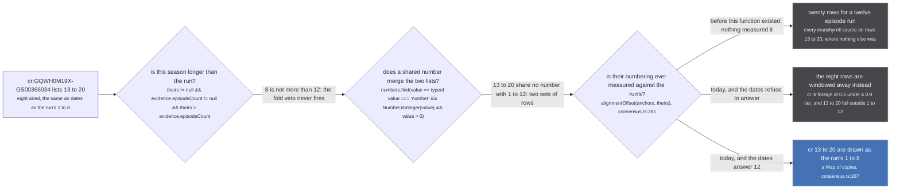
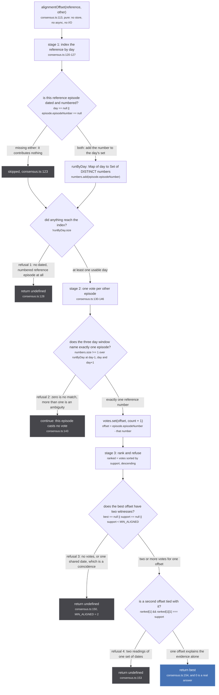
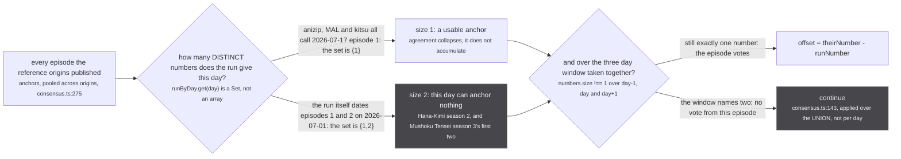
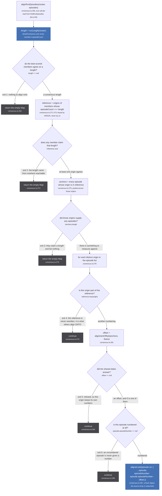

Two functions, the last two exports of `src/worker/store/consensus.ts`: `alignmentOffset` (`:113`)
and `alignRunEpisodes` (`:256`). They answer one question. When two sources describe the same
broadcast and number it differently, how far apart are the two numberings?

The answer is read off the dates the two lists share, and off nothing else. Not the title, not the
start date, not the season number, not the score. [Consensus](/merge/consensus/) hands this page one
thing, the run's agreed length, and that length only picks which numbering is the reference; the
comparison itself never looks at a score again.

Both functions are views. `alignRunEpisodes` returns a `Map` of renumbered **copies** and the stored
episode keeps the number its source gave it, which is the subject of the whole second half of this
page.

`alignmentOffset` is exported, and its only production caller is `alignRunEpisodes`, further down the
same file (`consensus.ts:281`). Everything else that imports it is
`tests/unit/worker/store/consensus.test.ts`.

## Twenty rows for a twelve episode run

`src/worker/store/consensus.ts:93-97`

> A catalogue may number a season continuing from the previous one where everyone else restarts at 1.
> The Elusive Samurai season 2, in the shipped seed: anizip, kitsu, MAL and AniList all publish
> episodes 1 to 12, and Crunchyroll publishes the same broadcast as 13 to 20, with the SAME AIR DATES
> to the day. `mergeByEpisodeNumber` keys on the number alone, so the page drew twenty rows for a
> twelve episode run and put every Crunchyroll source on rows 13 to 20, where nothing else was.

The cluster, read out of `dist-seed/snapshots.jsonl` on 2026-09-09 and pinned at
`tests/unit/worker/store/consensus.test.ts:284-288`:

| member | score | `episodeCount` | episodes it published |
| --- | --- | --- | --- |
| `anizip:18903` | none | 12 | 1 to 12, weekly from 2026-07-17 |
| `mal:60059` | 0.9 | 12 | none |
| `anilist:182616` | 0.8 | 12 | none |
| `kitsu:49265` | 0.3 | 12 | none |
| `cr:GQWH0M19X-GS00366034` | 0.5 | 8 | 13 to 20, on the first eight of those same days |

Nothing in the store was wrong. The cluster is exactly right about who it contains, every row is a
real row, and the eight Crunchyroll episodes are this run's episodes. Only the numbers disagree.



*Three chances to catch this, and only the third can. The first compares counts, and 8 is not more than 12; the second compares numbers, and 13 shares nothing with 1; the third compares dates, which is the one axis on which the two lists are identical.*

Read the two branches on the right together, because they are the argument for the function. The
season picker's fold veto (`src/sources/similar.ts:147-150`) asks whether the candidate holds **more**
episodes than the run; Crunchyroll holds fewer, so it is not a fold and nothing refused it. Grouping
by number (`mergeByEpisodeNumber`, `src/worker/store/db.ts:475-493`) merges two lists that share a
number; 13 to 20 and 1 to 12 share none, so both survive whole.

**And a refusal today is not free.** The Elusive Samurai cluster has a 0.9 tier (MAL), a consensus
length of 12, and four members claiming that length, so `runEpisodes` treats `cr` as foreign: its own
count is 8, its score is 0.5, and it is in neither the reference set nor the deciding tier. An
unaligned 13 to 20 therefore fails `episodeNumber >= 1 && episodeNumber <= length` at
`consensus.ts:240` and all eight rows are dropped. `findRunEpisodes` runs the alignment first
(`db.ts:426`) and the [window](/merge/windowing/) second (`db.ts:428`) for exactly this reason. Twenty
rows is the failure as it was measured; run the same unaligned input through the two functions that
ship today and it fails the other way, losing Crunchyroll from the page altogether.

## The anchor is another episode's date

`src/worker/store/consensus.ts:99-103`

> The dates are the anchor because they are the one thing both sides measure the same way. A date is
> not compared to a start date, which is a claim that drifts (the highest-scored start date in this
> store is three days off Crunchyroll's own episode 1 for at least one show in the seed): it is
> compared to ANOTHER EPISODE'S date from the same broadcast, which either matches to the day or does
> not.

That is the whole design. A start date is a claim a source publishes about the run, and the sources
disagree about it by days. An episode's air date is a claim about one broadcast, and two catalogues
carrying the same broadcast either put it on the same day or they do not.

The precision is a UTC day, taken by `dayOf` (`consensus.ts:85-88`):

```ts
/** A release date as a DAY, which is the precision two catalogues actually agree to. */
const dayOf = (episode: { releaseDate?: string | null }): number | undefined => {
  const at = episode.releaseDate ? Date.parse(episode.releaseDate) : Number.NaN
  return Number.isFinite(at) ? Math.floor(at / 86_400_000) : undefined
}
```

`86_400_000` is inlined here. The same number is a named constant, `MS_PER_DAY`, at
`src/worker/store/fuzzy-merge.ts:47`, where `startDay` uses it for the merge's date axis.

## `alignmentOffset`: three stages, four refusals



*Four refusals, two blast radii: refusal 2 is a `continue` that costs one episode its vote, while refusals 1, 3 and 4 return `undefined` for the whole comparison, after which the caller leaves that origin's numbers exactly as they are.*

The doc block above the function names three ambiguities, and they are refusals 3, 4 and 2, in that
order:

`src/worker/store/consensus.ts:105-109`

> NOTHING RATHER THAN A GUESS, in every ambiguous case:
>   - fewer than MIN_ALIGNED dates in common, so a coincidence could carry it
>   - two offsets explaining the same evidence, which is what a season with two episodes on one day
>     produces (Hana-Kimi season 2 has episodes 1 and 2 both dated 2026-07-01)
>   - any date matching more than one reference episode, for the same reason

Three details worth having in front of you:

- **`MIN_ALIGNED = 2` sits at `consensus.ts:111`**, and the doc block that describes `alignmentOffset`
  physically sits above the constant rather than above the function. (The same thing happens further
  up the file: the doc block for `runEpisodes` at `:65-83` sits above `dayOf`.) Nothing reads a JSDoc
  block here, so this costs nothing but a moment finding it.
- **Refusal 4 compares against `ranked[1]` only**, which is sufficient because the array is sorted
  descending at `:148`: if the runner-up does not tie the leader, nothing below it can.
- **`return best` may legitimately be `0`**, which is a source that already counts the way the run
  does. Every caller therefore has to test `== null`, and the one caller does.

## A day is an anchor only when the run uses it once

The reference index is a `Map<number, Set<number>>`, and the set is the entire point.

`src/worker/store/consensus.ts:117-119`

> DISTINCT numbers per day, not rows per day. Several sources describing one run all say that this
> day is episode 1, and three of them agreeing is the opposite of an ambiguity; what disqualifies a
> day is the run using it for two DIFFERENT episodes.



*The ambiguity test is applied once, over the union of the three days, so a clean day next to a doubled one is not clean.*

This is what lets the reference be several sources pooled together. Five catalogues describing one run
all say the premiere is episode 1, and five identical numbers are one entry in a set. The rule only
fires when the run itself uses a day twice, which is a season that aired two episodes on one day.

### Why the window is three days wide

`src/worker/store/consensus.ts:135-140`

> A DAY EITHER SIDE, because one broadcast is two dates.
>
> ani.zip stamps `2021-01-10T15:00:00Z`, which is the 11th in Tokyo, and Crunchyroll publishes
> the Tokyo date. Requiring the same UTC day would refuse a run whose sources are merely in
> different timezones, which is most of them. Episodes are a week apart, so a day of slack cannot
> reach the neighbour, and the ambiguity refusal still applies across the whole window.

Note the second half of that sentence, because it is what keeps the slack safe. Widening the window
does not weaken the ambiguity rule: `numbers` is built as the union of three days and then tested
once, so a window that reaches two different reference episodes refuses, exactly as a single doubled
day does.

The test that makes the refusal worth having rather than merely tidy is
`tests/unit/worker/store/consensus.test.ts:246-260`, where a doubled day would out-vote the truth:

`tests/unit/worker/store/consensus.test.ts:242-244`

> And a doubled day must not out-vote the real alignment, which is what makes the refusal worth
> having rather than merely tidy. Here two doubled days would agree on an offset of 2 while the one
> unambiguous day says 10: reading them gives a confident wrong answer, refusing them gives none.

Two ambiguous days beat one clean day on support, two votes to one. Disqualifying the ambiguous days
leaves a single vote, which then fails `support < MIN_ALIGNED`, and the function answers nothing.
Both refusals have to be there for that case to come out right.

## `alignRunEpisodes`: a Map of copies

:::danger
**The alignment is a view, and it has to be, because the write it would replace has no inverse.**
`graph.set` merges with `lastWriteLongestArray` (`src/worker/store/graph.ts:387-388`: *scalars
last-write-wins, arrays longest-wins*), keeping no history and no provenance. Renumbering a stored
episode in place would overwrite `episodeNumber` for every other reader of that node, and nothing
afterwards could ask what number the source actually published. `alignRunEpisodes` returns copies in
a `Map` instead, recomputed on every read.
:::

`src/worker/store/consensus.ts:247-250`

> READ TIME, AND A COPY. The stored node keeps Crunchyroll's own number, because it is keyed by
> Crunchyroll's guid and is reachable through the whole season from other paths: `graph.set` is
> last-write-wins, so rewriting it here would change what those other readers see. What the run needs
> is a VIEW, and a view is what this returns.

"Reachable through the whole season from other paths" is the load-bearing clause. The same
Crunchyroll episode node is reached by the container's own page and by any other run the season was
lent to, and each of those wants a different number for it. Only a per-read view can give them all
the right one.

The map holds only the episodes whose number moved. The caller substitutes with
`aligned.get(episode.uri) ?? episode` (`src/worker/store/db.ts:428`), so an absent entry means "use it
as it is".



*Six exits and one write, and the write produces a copy. The page brief says five; the sixth is the null-number `continue` at `consensus.ts:286`, which is what keeps a special from being renumbered into an episode slot.*

### Grouped by origin, never by row

`src/worker/store/consensus.ts:265-269`

> Grouped by ORIGIN, never by which row an episode hangs off.
>
> A source may attach its episodes to ANOTHER source's media, which is how a season that contains
> this run reaches it at all: the run's cluster holds no row for that source, so there is no member
> uri to group by. The origin is the thing that numbers, so the origin is what gets aligned.

The worked case is Mushoku Tensei season 2 part 2
(`tests/unit/worker/store/consensus.test.ts:331-359`). Crunchyroll models one season of 24 across a
nine month gap, so neither cour matches it and part 2 never picked it at all. The season lends its
episodes instead: they arrive carrying `origin: 'cr'` and `mediaUri: 'anilist:166873'`, the run's own
row. There is no `cr` member in that cluster to group by, and the origin is the only handle on the
numbering. The dates put CR 13 on the run's 1, so CR 13 to 24 become 1 to 12 and CR 1 to 12 land at
zero and below, where the [window](/merge/windowing/) drops them.

### Zero is a real answer

`src/worker/store/consensus.ts:282-283`

> `== null`, not falsy: 0 is a real answer, and it means this source already counts the way the
> run does. Treating it as absent is harmless here and wrong everywhere it would be copied.

An offset of 0 still enters the write loop and writes copies that are identical to their originals.
That is deliberate and costs one object per episode. The comment is about the shape of the test
rather than about this call site: `if (!offset) continue` behaves the same way here and is wrong the
moment anyone copies it somewhere that acts on the offset.

## The reference set here is not `runEpisodes`'s

The two functions filter the cluster the same way, `media.episodeCount === length`, and then diverge:

| | `alignRunEpisodes` (`:271-273`) | `runEpisodes` (`:171`, `:210`, `:234`) |
| --- | --- | --- |
| filter | `media.episodeCount === length` | `media.episodeCount === length` |
| kept as | a `Set` of origins | `backing`, then a `Set` of origins |
| two-witness bar | none | `if (backing.length < 2) return episodes.filter(episode => members.has(episode.origin))` |
| what a single witness does | the alignment still runs | the loan is refused outright, and every member keeps everything |

So a length only one source claims still produces an alignment. It is the **loan** that
`runEpisodes` then declines, and it declines it whole rather than slicing on a number one row
asserts:

`src/worker/store/consensus.ts:227-232`

> AN UNCORROBORATED LENGTH REFUSES THE LOAN OUTRIGHT rather than slicing on it.
>
> A lent season is only useful if the run can say which of its episodes are its own, and a length
> one source claims cannot. Mushoku Tensei season 2 part 1 is the case: MAL publishes no count at
> all and AniList says 13 for a run that aired 12, so windowing to 13 put a thirteenth row on the
> page that only Crunchyroll had. Declining leaves the page exactly as it was.

The bar lives on [windowing a run](/merge/windowing/); it is here only so the difference between the
two reference sets is not read as an inconsistency.

## What this does not do

- **It does not regroup.** `mergeByEpisodeNumber` runs at the bottom of
  `findAggregatedEpisodesForMedia` (`db.ts:454`), which is **before** the alignment, so its groups are
  keyed on numbers that have since moved. What actually merges Crunchyroll's 13 into everyone else's
  1 is the resolver's second grouping, on the post-alignment number, at
  `src/worker/resolvers/media/index.ts:209-213`. The [episodes read](/read/episodes/) draws that
  double pass in full.
- **It does not hide anything.** Every episode handed in is handed back, either as itself or as a
  renumbered copy. Dropping rows is [the window](/merge/windowing/), one step later in
  `findRunEpisodes`.
- **It does not run on the fallback path.** When no handle resolves to a cluster,
  `src/worker/resolvers/media/index.ts:204` calls `findAggregatedEpisodesForMedia` directly: the walk
  and the number grouping still happen, and neither `alignRunEpisodes` nor `runEpisodes` does.
- **It does not read a score, except through the length.** `alignmentOffset` sees dates and numbers
  only. The scores decide `runLength`, which decides which origins are the reference, and that is the
  whole of their influence here.
- **It does not write.** Nothing on this page touches `graph.set`, `graph.link` or `graph.edge`. The
  cost of being wrong is one wrong page, corrected on the next read, which is why the refusals can
  afford to be as strict as they are.

## Pinned behaviour

`tests/unit/worker/store/consensus.test.ts:222-317`, with `WEEKLY` the twelve real weekly slots from
2026-07-17 and `AIRED` its first eight:

| test | input | answer |
| --- | --- | --- |
| `:223` a source counting on from a previous season | anizip 1 to 12 weekly, cr 13 to 20 on the first eight of the same days | `12` |
| `:227` a source already counting the same way | anizip 1 to 12, cr 1 to 12, same days | `0` |
| `:236` a day the run uses twice is no anchor at all | reference has 1 and 2 both on 2026-07-01 | `undefined` |
| `:246` a doubled day cannot out-vote the one unambiguous day | two doubled days agreeing on offset 2, one clean day saying 10 | `undefined` |
| `:263` two offsets explaining the same evidence | b at 5, 6 then 9, 10 over four reference days | `undefined`, offset 4 twice and offset 6 twice |
| `:272` one shared date alone | cr 13 on a single date | `undefined`, support 1 under `MIN_ALIGNED` |
| `:276` no dates on either side | undated as reference, then as other | `undefined` both ways |
| `:290` the Elusive Samurai run | the cluster above | cr's eight become `[1..8]` |
| `:298` and the run drops from twenty distinct rows to twelve | the same | 20 distinct numbers before, 12 after |
| `:306` the sources that agree about the length are left alone | the same | no anizip episode appears in the map |
| `:312` the stored episode is not rewritten | the same | the input array's `episodeNumber` is unchanged |

The last two are the pair worth keeping: one pins that the reference is never rewritten, the other
pins that nothing is rewritten at all.

## Where to go next

- [Consensus, not a sum](/merge/consensus/) is where the length comes from, and why one source is
  never outvoted by its inferiors.
- [Windowing a run](/merge/windowing/) is the step immediately after this one: which of the aligned
  episodes are actually this run's.
- [Aggregating episodes](/read/episodes/) is the whole pipeline these two sit inside, including the
  double grouping and the fallback arm that skips both.
- [A view or a write](/invariants/view-or-write/) is the rule this page is the cleanest example of.
