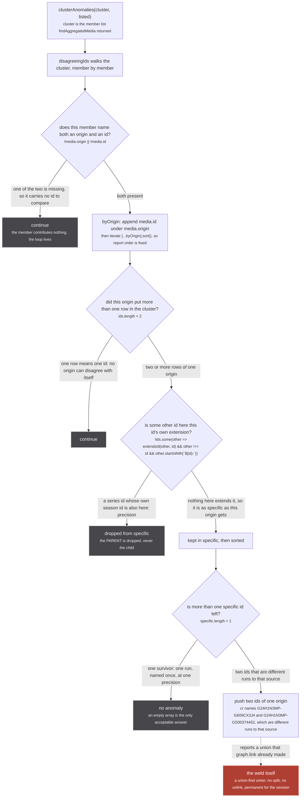
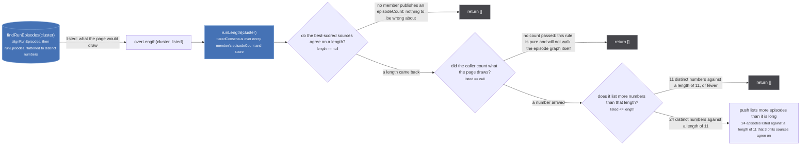

Every other check on merging asks a question somebody already answered: these uris belong together,
those two never do, this run lists eleven episodes. That is the right way to pin a known answer and
the wrong way to find an unknown one. `src/worker/store/anomalies.ts` is the other half. It is
seventy-two lines holding two rules, and neither of them needs to be told what the right answer was.

`src/worker/store/anomalies.ts:5-15`

> Ways a cluster can be visibly wrong ABOUT ITSELF, without anyone having to say what it should be.
>
> The merge fixtures decide each case by hand: these uris together, those two never. That is the right
> way to pin a known answer and the wrong way to find an unknown one, because it only ever looks where
> somebody already looked. These rules need no expected answer, so they can be swept over every
> cluster in the corpus at once, and over a franchise walked live.
>
> Every rule here is a CONTRADICTION rather than a preference. A cluster that trips one is claiming
> two things that cannot both be true, which is why it is safe to run them everywhere.

The public surface is a type and one function. A finding is a `rule` and a `detail`, both strings
(`anomalies.ts:16`), and the entry point concatenates the two rules in a fixed order
(`anomalies.ts:70-72`):

```ts
/** Every anomaly in one cluster. An empty array is the only acceptable answer. */
export const clusterAnomalies = (cluster: readonly Media[], listed?: number): Anomaly[] =>
  [...disagreeingIds(cluster), ...overLength(cluster, listed)]
```

## Who calls this

Nothing in `src/` does. `clusterAnomalies` is imported once in the whole tree, by
`tests/unit/worker/store/merge-fixtures.test.ts:15`, and called once, at `:167`. A grep for the
identifier across `src/` and `tests/` returns its own definition, that import, that call, and one
mention inside a comment.
The module doc above says the rules can be swept "over a franchise walked live"; no walker in the tree
does that today, so read that sentence as a design intent rather than a description of a caller.

The one caller is the sweep, and the reason the sweep is separate from the hand-decided cases is worth
reading in the test's own words.

`tests/unit/worker/store/merge-fixtures.test.ts:149-156`

> THE SWEEP, and the reason it is separate from every case above.
>
> Each case decides one answer by hand, which pins what somebody already looked at. These rules
> need no expected answer: they are contradictions a cluster makes about ITSELF, so they run over
> every cluster the whole corpus produces, and a case added for one reason is checked for all of
> them. See store/anomalies.ts.

So every `MERGE_CASES` entry is checked twice: once against the answer it was written to pin, and once
against both rules here. A case added to hold two Grand Blue seasons apart is also asked whether any
cluster it produced now names two Crunchyroll ids, or lists more episodes than it is long.

## `disagreeingIds`: two ids of one origin

`src/worker/store/anomalies.ts:18-25`

> Two ids of one origin that are not the same id at different precision.
>
> One source names one thing once. Two of its ids in a cluster means a union happened that the source
> itself would refuse, and `graph.link` has no inverse, so it is permanent for the session. The
> precision case is real and must not be reported: `cr:G24H1N3MP` beside `cr:G24H1N3MP-GS00374452` is
> a series id and one of its seasons, which is `extendsId`'s whole job.

That is the contradiction in one sentence. Crunchyroll gave season 1 the id `G24H1N3MP-G609CX3J4` and
season 3 the id `G24H1N3MP-GS00374452` (`tests/unit/worker/store/merge-fixtures.ts:348-350`). If one
cluster holds both, Crunchyroll is being read as saying that two of its own seasons are one run, which
it never said. Nobody has to know which of the two the cluster should have been.



*The rule reports; it never repairs. Every dim node is a path that ends without a finding, and the rose node is the thing the finding is about.*

The loop is `anomalies.ts:26-47`. The member skip is at `:29`, the grouping at `:30`, the group cut
at `:35`, the specificity filter at `:38` and the report at `:39-44`. The third decision node carries
that filter's predicate exactly as the file spells it, template literal and all.

:::danger[Nothing here undoes anything]
`graph.link` is a union-find union. There is no split, no unlink, and no inverse anywhere in the repo:
once two rows are in one component they stay there for the life of the worker. `disagreeingIds`
reports that a weld happened. It cannot take it back, and neither can the reader. The only repair is a
reload, which rebuilds the store from nothing.
:::

### Why the filter is one-way

The interesting line is `:38`, and the comment above it says exactly why it is shaped the way it is.

`src/worker/store/anomalies.ts:36-37`

> one-way, like findSeedWelds: dropping both sides lets a shared parent hide the disagreement it
> sits between, so `[A, A-1, A-2]` would report nothing at all

`extendsId` itself is symmetric (`src/sources/offline/seed-gate.ts:63`):

```ts
export const extendsId = (a: string, b: string): boolean => a.startsWith(`${b}-`) || b.startsWith(`${a}-`)
```

`src/sources/offline/seed-gate.ts:55-62`

> Whether one id is the other's own extension, `<a>` against `<a>-<something>`.
>
> The same rule `mostSpecific` in utils/uri.ts applies, and for the same reason: a season-scoped id is
> built by joining the series id and a season id on '-', so a cluster holding both is one source
> naming its run precisely, not two sources disagreeing. Two ids that merely share a prefix
> (`G24H1N3MP` and `G24H1N3MPX`) are unrelated and stay a disagreement.

Read symmetrically, a cluster holding `A`, `A-1` and `A-2` has no surviving id at all: `A` is extended
by both children, and each child extends `A`. Everything is filtered out, `specific` is empty, and the
rule reports nothing about a cluster that has welded two seasons of one series together. Read one way,
only the parent goes.

| cluster ids | symmetric reading | one-way reading (what ships) |
| --- | --- | --- |
| `A`, `A-1` | `specific` empty, nothing reported | `A` dropped, `specific` is `[A-1]`, nothing reported. Correct: this is one source naming its run precisely |
| `A`, `A-1`, `A-2` | `specific` empty, **nothing reported** | `A` dropped, `specific` is `[A-1, A-2]`, **reported**. Two seasons of one series in one run |
| `A-1`, `A-2` | both survive, reported | both survive, reported |
| `G24H1N3MP`, `G24H1N3MPX` | both survive, reported | both survive, reported. A shared prefix is not an extension |

The seed exporter carries the same rule and pins the same case.
`tests/unit/sources/offline/seed-gate.test.ts:126-136` is titled *two season ids are a weld even when
their shared series id is in the cluster*, and the comment above it records the bug directly:

`tests/unit/sources/offline/seed-gate.test.ts:123-125`

> The exception is a season id beside ITS OWN parent. Two season ids beside a shared parent are two
> runs of one series fused into one published cluster, and reading `extendsId` symmetrically filtered
> BOTH of them out through that parent, so the weld reported nothing.

### One reading the code does not need

The predicate at `:38` has three conjuncts, and only the last one does work:

```ts
extendsId(other, id) && other !== id && other.startsWith(`${id}-`)
```

``other.startsWith(`${id}-`)`` is already the left half of `extendsId(other, id)`, so the first
conjunct can never be false when the third is true. It also implies `other !== id`, because no string
starts with itself followed by a hyphen. The seed twin writes only the surviving test
(`src/sources/offline/seed-gate.ts:90`):

```ts
const specific = ids.filter(id => !ids.some(other => other.startsWith(`${id}-`))).sort()
```

Both spellings compute the same set. The anomalies version names `extendsId` so the reader is sent to
that function's comment, which is where the argument lives; that is the only difference.

### Two smaller decisions in the same loop

**A repeated id is not a disagreement with itself.** The group cut at `:35` reads the raw array
(`ids.length < 2`), while the filter at `:38` maps over `[...new Set(ids)]`. So a cluster holding two
rows of one origin with the same id passes the cut and then produces a one-element `specific`, which
reports nothing. The seed twin gets there by another route, grouping into a `Set` so the repeat never
survives to be compared at all, and pins the answer at
`tests/unit/sources/offline/seed-gate.test.ts:138-141`.

**The report is deterministic.** `[...byOrigin].sort()` at `:34` sorts the origin groups, and
`.sort()` at the end of `:38` sorts the surviving ids, so the same cluster produces the same string on
every run whatever order the extractors answered in. That matters because the caller compares the
whole finding list against `[]`, and a list that reorders itself between runs is a flake.

## `overLength`: a run listing more than it is long

`src/worker/store/anomalies.ts:49-59`

> A run listing more episodes than its sources agree it is long.
>
> The one the membership rules cannot see, because the cluster is right about who it contains: an
> episode arrives attached to whichever media published it, so a member that packages this run inside
> a longer season brings that season's whole list. Mushoku Tensei season 1 part 1 listed 24 for an 11
> episode run this way (2026-09-09).
>
> `listed` is passed in rather than read, because counting it means walking the episode graph and
> these rules are pure.

This is the rule the other kind of check structurally cannot see. `together` and `apart` are
assertions about membership, and in this case membership is right: `anilist:108465`, `kitsu:42323`,
`anizip:14758` and `cr:G24H1N3MP-G609CX3J4` really are one run. The fold arrives as an episode list,
not as a member, so no membership assertion can express it.

Those are the numbers in the figure below. The first three members each publish `episodeCount: 11` and
Crunchyroll's season publishes 24 (`tests/unit/worker/store/merge-fixtures.ts:121-123` and `:348`), so
`runLength` answers 11 on anizip's 0.9 tier and three of the four members back it. Before the trim
existed, the page drew 24 numbered rows for that run.

The fixture that pins the case says the important half in capitals. It is named *a run lists its own
episodes, not those of the season a streamer folds it into*
(`tests/unit/worker/store/merge-fixtures.ts:377-391`).

`tests/unit/worker/store/merge-fixtures.ts:383-384`

> THE CLUSTER IS NOT WRONG ABOUT WHO IT CONTAINS, which is why `together` and `apart` cannot
> see this: the fold arrives as an episode list, not as a member.

Nine lines (`anomalies.ts:60-68`), and all three of its refusals sit on one of them:



*Both blue nodes are recomputed on every read and persist nothing, so this rule audits a view, not the store. Nothing on this path writes.*

The three refusals are one expression at `anomalies.ts:62`:

```ts
if (length == null || listed == null || listed <= length) return []
```

and the detail line at `:65-66` recounts the witnesses rather than trusting the reader to:

```ts
detail: `${listed} episodes listed against a length of ${length} that ${
  cluster.filter(media => media.episodeCount === length).length} of its sources agree on`,
```

That `filter` is the same set `runEpisodes` calls `backing` (`src/worker/store/consensus.ts:171`), so
a finding tells you at a glance whether the length it is complaining about rests on three sources or on
one.

### It closes a loop over the two previous pages

`listed` is whatever the caller counted. In the only caller it is
`tests/unit/worker/store/merge-fixtures.test.ts:89-97`:

```ts
/** How many distinct episode numbers the cluster holding `uri` lists, the way the page renders them. */
const listedEpisodes = async (uri: string): Promise<number> => {
  const cluster = await findAggregatedMedia(uri)
  const groups = await findRunEpisodes(cluster)
  const numbers = new Set<number>()
  for (const group of groups) {
    for (const episode of group) if (episode.episodeNumber != null) numbers.add(episode.episodeNumber)
  }
  return numbers.size
}
```

`findRunEpisodes` (`src/worker/store/db.ts:424-430`) is alignment then windowing: it calls
`alignRunEpisodes` over the flattened list and then `runEpisodes` per group. So the number this rule
tests is the number a reader would count on the page after both of those ran, which makes `overLength`
an audit of their combined output rather than of the store. If alignment moves Crunchyroll's 13 to 20
down onto 1 to 8 and windowing drops a fold's tail, the distinct-number count falls and the rule goes
quiet. If either declines, it does not.

### The bar the two functions do not share

`runLength` (`src/worker/store/consensus.ts:62-63`) is `tieredConsensus` with the tier thrown away.
It has no two-witness bar: one source publishing a count is enough for it to answer. The bar lives one
level up, in `runEpisodes` (`src/worker/store/consensus.ts:234`):

```ts
if (backing.length < 2) return episodes.filter(episode => members.has(episode.origin))
```

Read the two together and the interaction is plain. A length only one member claims is still a length
as far as `overLength` is concerned, while `runEpisodes` declines every window on exactly that
evidence and hands each member origin back its whole list untouched. So a cluster whose length rests
on a single witness can list more than that length and be reported for it, with the windowing that
would have acted on it having deliberately stood down. The `detail` string is what tells the two apart:
*a length of 13 that 1 of its sources agree on* is a different situation from *a length of 11 that 3 of
its sources agree on*, and only the second is a straightforward fold.

## What each rule costs to run

Neither touches the store, neither awaits anything, and neither mutates its input. `disagreeingIds`
reads `origin` and `id` off each member; `overLength` reads `episodeCount` and `score`, and takes the
episode count as an argument precisely so that it does not have to walk the episode graph. That purity
is the whole reason they can be swept: the sweep runs them over every distinct cluster of all thirteen
fixture cases on every suite run, and the cost of a call is a map and two filters.

The counterpart that does run in production is the seed exporter. `findSeedWelds`
(`src/sources/offline/seed-gate.ts:77-95`) applies the identical one-way reading to the export's
`identity` handles, `dropWeldedRuns` (`:405-426`) removes each welded run along with its episodes and
its place in the season buckets, and `gateSeed` (`:432-455`) refuses the publish outright if any weld
survived. The share is capped by a measured constant.

`src/sources/offline/seed-gate.ts:26-34`

> How much of a walk may be welded before the seed is refused outright.
>
> The first real walk (2026-09-05, 358 runs) carried exactly ONE, `mal-63736` holding two Netflix
> ids, which is the open collision between the ids unogs mints and the ones justwatch reads. A
> welded run must never be published, and refusing the other 357 for it would mean one bad show
> blocks every daily publish until somebody notices. So a weld drops its run and the SHARE is what
> fails: 1 in 359 is the measured floor of the app, 2 percent is a spike that says something broke.

`SEED_MAX_WELD_SHARE = 0.02` at `:35`. So the rule with no production caller has a production twin,
and the twin is a gate rather than a report: a weld in the store is something the app has to live with
until reload, and a weld in a published seed is something no reader can live with at all.
