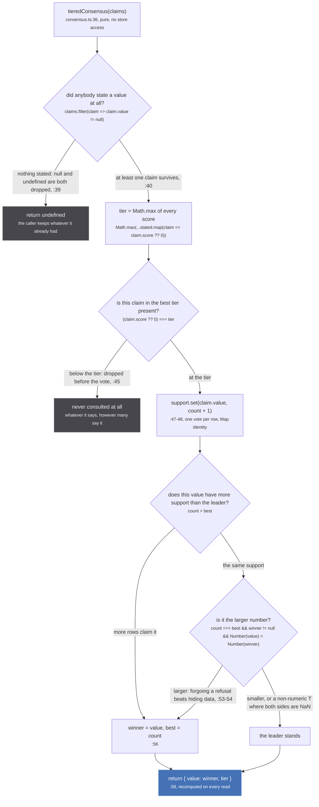
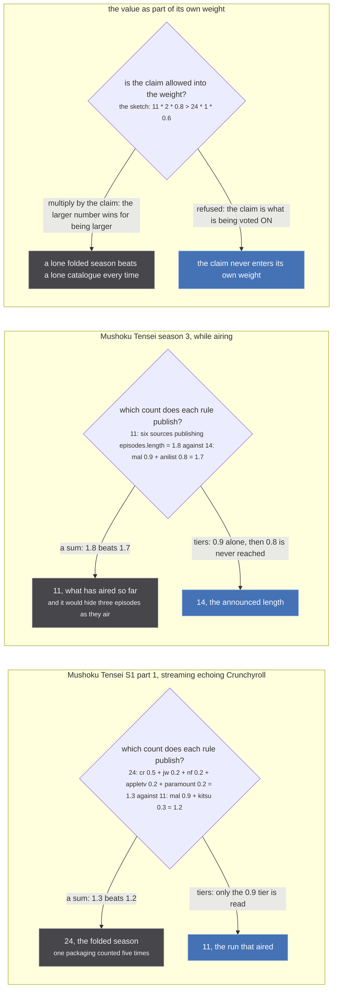
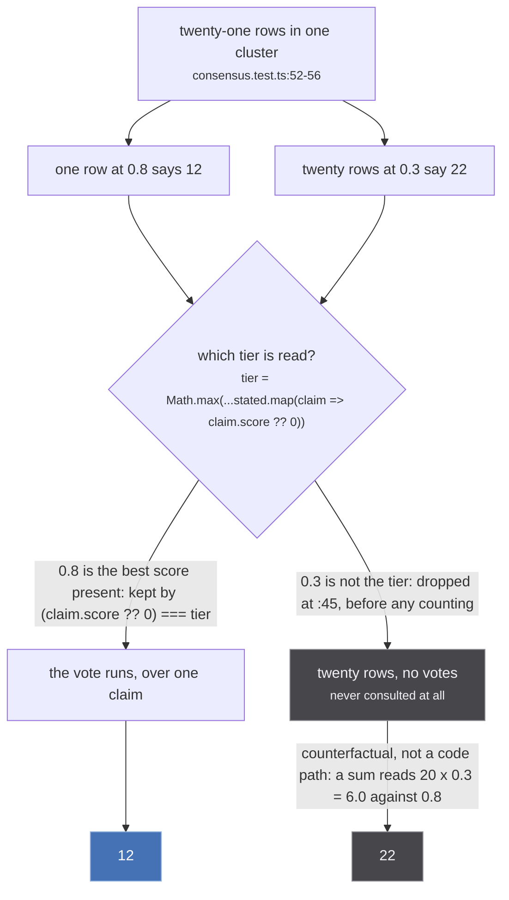

`src/worker/store/consensus.ts` is 291 lines, imports one type (`import type { Episode, Media } from
'./types'`, `:1`) and touches nothing else: no store access, no async, no I/O. `tieredConsensus`
(`:36`) is the first function in it and the one every other decision on this page rests on. It takes
a list of claims and answers which one the cluster believes:

```ts
export const tieredConsensus = <T>(
  claims: readonly { value: T | null | undefined, score?: number | null }[]
): { value: T, tier: number } | undefined
```

It is generic and has exactly one job in this tree: the episode count. `runLength` (`:62-63`) maps a cluster's rows to
`{ value: media.episodeCount, score: media.score }` and drops the tier; `runEpisodes` (`:158`) calls
the same thing directly, because it needs the tier back as well as the value. `T` is `number` at
every production call site, and no other module calls `tieredConsensus`.

Four readers, through those two entry points:

| call site | what the number becomes |
| --- | --- |
| `src/worker/store/aggregate.ts:386` | the published `Media.episodeCount`, `runLength(medias) ?? merged.episodeCount ?? null` |
| `src/worker/store/consensus.ts:158` | the length `runEpisodes` windows a foreign source's episode list to |
| `src/worker/store/anomalies.ts:61` | the bar `overLength` reports a cluster against |
| `src/worker/similar-consumer.ts:174` | `runEvidence.episodeCount`, the number a source is asked against |

## The rule

`src/worker/store/consensus.ts:4-14`

> What the BEST SOURCES say, with agreement breaking ties only among equals.
>
> The store's other resolutions take the highest-scored source's value and stop (`acc.x ?? gql.x` over
> a score-sorted list), so one source outvotes any number of others however many agree with each
> other. That is right for a title, where sources are spelling the same thing differently and the
> best-scored spelling is simply the one to show. It is not enough for a NUMBER, where sources are
> making a claim about the world and two equals agreeing is evidence the first one alone is not.
>
> SO THE TIERS ARE LEXICOGRAPHIC, NEVER ADDITIVE. The best score present decides which claims are
> looked at; among those, the value the most of them claim wins; nothing below that tier is consulted
> at all. A source cannot be outvoted by any number of sources beneath it.

That is two rules stacked, and the order between them is the whole design. Score picks the tier.
Agreement picks the value, inside that tier only. A score never adds to another score.

## The algorithm



*Two refusals and one tie-break. `return undefined` at the top is the only exit that answers nothing;
the tier cut is a refusal to read, not a refusal to answer.*

Branch by branch, with what each one costs.

**A source that says nothing is not a claim.** `:39` filters on `claim.value != null`, so both `null`
and `undefined` fall out, and `:40` returns `undefined` when nothing is left. This is the common case,
not the edge case: "most of the store has no count" (`consensus.ts:82`). Pinned three ways at
`tests/unit/worker/store/consensus.test.ts:67-71`: a `null` at `0.9` loses to an `11` at `0.3`, a
lone `null` claim answers `undefined`, and so does an empty list.

**An unscored row is a tier, at the bottom.** `:44` reads `claim.score ?? 0`.

`src/worker/store/consensus.ts:42-43`

> an unscored row is its own tier at the bottom, which is where anizip's media rows sit until
> src/sources/anizip/extractor.ts passes a score to makeMedia

The consequence the comment does not spell out: `?? 0` means a `null` score and a `0` score land in
the **same** tier, not two. No source scores `0` today (the floor is `0.2`, on appletv, justwatch,
offline, paramount and unogs), so the collision is currently theoretical. `runLength` still answers
`11` from a single unscored anizip row when nobody else has said anything, and loses to a scored MAL
row the moment one exists (`consensus.test.ts:75-78`).

**The tier cut is total.** `:45` keeps only `(claim.score ?? 0) === tier`. Everything below it is
gone before a single vote is counted, which is what "lexicographic" means here and is drawn on its own
below.

**The vote is one row, one vote.** `:47-48` builds a `Map<T, number>`. Map identity on a `number` is
value equality, so five rows saying `24` are five votes for one entry. That is also exactly the flaw
the tier cut exists to contain: five streaming catalogues restating one packaging are five rows, and
they are five votes only if they reach the tier.

**A tie goes to the larger value.**

`src/worker/store/consensus.ts:53-54`

> a tie inside one tier goes to the LARGER value: everything downstream of this only ever refuses
> something for being too long, so over-estimating costs a refusal and under-estimating hides data

Read the two costs against `runEpisodes`, which is the reader that comment is about: a length one too
high widens the window to `[1, length]` and leaves one extra row on the page; a length one too low
deletes an episode that aired. The rule is deterministic in both argument orders, pinned at
`consensus.test.ts:83-86` with `11@0.9, 13@0.9` and `13@0.9, 11@0.9` both answering `13`.

Two details of that condition are load-bearing and neither is obvious. `winner != null` guards the
first iteration, where `winner` is still `undefined` and `Number(undefined)` is `NaN`. And
`Number(value)` is the only coercion in the function: for a non-numeric `T` both sides are `NaN`, the
comparison is false, and the first-inserted value survives, which would make the answer depend on
claim order. Nothing in production passes a non-numeric `T`, so that path is unreachable today.

## Why not a sum

A weighted sum was written first. The file keeps the arithmetic that killed it rather than the
conclusion.



*Three refused rules, each with the arithmetic that refuses it. The two on the left are the same
defect twice: a sum lets the number of sources restating one packaging beat the quality of the ones
that disagree.*

`src/worker/store/consensus.ts:16-34`

> A SUM WAS TRIED FIRST AND IS WRONG, measured three ways on 2026-09-09:
>
> ```text
>   Mushoku Tensei S1 part 1, once the streaming tier echoes Crunchyroll's packaging:
>     24 scores cr 0.5 + jw 0.2 + nf 0.2 + appletv 0.2 + paramount 0.2 = 1.3
>     11 scores mal 0.9 + kitsu 0.3                                    = 1.2
>   and the sum publishes the folded 24, which is the defect it was written to stop. Five catalogues
>   restating one packaging is one witness counted five times.
>
>   Mushoku Tensei season 3 while airing: mal and AniList publish the announced 14, and six sources
>   publish `episodes.length`, the eleven aired so far. The sum goes 1.8 to 1.7 for 11.
>
>   Over the 100 cluster snapshot in dist-seed the sum was identical to today's rule in 100 of 100,
>   so it bought nothing anywhere and lost in exactly the cases that matter.
> ```
>
> Tiers answer 11 and 14, correctly, in both.
>
> NOT the value times anything, in either shape. The owner's first sketch was `11 * 2 * 0.8 >
> 24 * 1 * 0.6`, multiplying by the claim: that makes the larger number win for being larger, so a
> lone folded season beats a lone catalogue every time. The claim is what is being voted ON.

The last paragraph is the one that needs working through, because the sketch as written picks the
right answer: `11 * 2 * 0.8` is `17.6` against `24 * 1 * 0.6`'s `14.4`. It only picks the right answer
because `11` has two witnesses there. Give each side one witness at its real score and the same
formula reads `24 * 1 * 0.5 = 12` against `11 * 1 * 0.9 = 9.9`, and the fold wins on the strength of
being a bigger number. A weight that contains the claim is not a weight.

The releasing case is the one that shows the two defects are one defect. Six sources set
`episodeCount = episodes.length` and so publish the eleven episodes that have aired; MAL and AniList
publish the fourteen that were announced. Both halves of the sum are honest and the sum is still
wrong, because `0.5 + 0.3 + 0.3 + 0.3 + 0.2 + 0.2` is `1.8` and `0.9 + 0.8` is `1.7`. The cluster is
pinned at `consensus.test.ts:135-143`, answering `14`, with the test's own note: "A sum goes to 11 by
1.8 against 1.7 and would hide three episodes as they air."

## Lexicographic, drawn



*A source cannot be outvoted by any number of sources beneath it. The last edge is a counterfactual and
not a code path: nothing in the function ever adds two scores together.*

The test that pins this is named `a tier below the best one is never consulted at all`
(`consensus.test.ts:52`), and its comment reads: "twenty rows at 0.3 saying 22 cannot move a single
0.8 row saying 12". Twenty is not a bound. Two hundred rows at `0.3` do the same nothing.

Agreement still decides among equals, which is the reason this is not just "take the top-scored row
and stop": `24@0.9, 11@0.9, 11@0.9` answers `11` (`consensus.test.ts:45-50`).

:::caution[The inventory says otherwise, and the code wins]
Two differences between the page inventory's spec for this page and
`src/worker/store/consensus.ts` as it stands.

**The tie condition has a third clause.** The inventory writes it as
`count > best || (count === best && Number(value) > Number(winner))`. Line `:55` reads
`const better = count > best || (count === best && winner != null && Number(value) > Number(winner))`.
The `winner != null` guard is what keeps `Number(undefined)` out of the comparison on the first
iteration; the assignment on `:56` is `if (winner == null || better)`, so the first value is taken
regardless of `better`.

**The lexicographic figure's numbers are not the pinned ones.** The inventory asks for "tier 0.9 says
11; twenty sources at 0.3 say 22". The test that exists uses **12 at 0.8** against twenty rows saying
22 at 0.3 (`consensus.test.ts:52-56`). The figure above uses the pinned numbers.
:::

## Every claim this function makes, and where it is pinned

`tests/unit/worker/store/consensus.test.ts:27-87`. The scores in the fixtures are the real ones, read
off the extractors (`consensus.test.ts:6-8`): mal `0.9`, anilist `0.8`, cr `0.5`, kitsu, tmdb and
tvmaze `0.3`, jw, nf, appletv and paramount `0.2`, "and anizip's MEDIA row carries none at all".

| test (line) | claims | answer |
| --- | --- | --- |
| `one good source beats any number of worse ones` (35) | `11@0.9` against `24@0.5` and four `24@0.2` | `11` |
| `and agreement decides among equals` (45) | `24@0.9`, `11@0.9`, `11@0.9` | `11` |
| `a tier below the best one is never consulted at all` (52) | `12@0.8` and twenty `22@0.3` | `12` |
| `a bigger number gets no advantage from being bigger` (63) | `240@0.6` against `11@0.8` | `11` |
| `a source that says nothing is not a claim, and no claims is no answer` (67) | `null@0.9` with `11@0.3`; then `[{ value: null }]`; then `[]` | `11`, then `undefined` twice |
| `an unscored source is a claim, at the bottom` (75) | anizip unscored `11` alone; then anizip unscored `12` with mal `0.9` `11` | `11`, then `11` |
| `a tie inside one tier goes to the larger value, both orders` (83) | `11@0.9, 13@0.9` and the reverse | `13` in both |

## `runLength`, and what the aggregate does with it

```ts
/** How long the best-scored sources say this run is, or nothing when none of them says. */
export const runLength = (cluster: readonly Media[]): number | undefined =>
  tieredConsensus(cluster.map(media => ({ value: media.episodeCount, score: media.score })))?.value
```

One line, no branches of its own, and it throws the tier away. `runEpisodes` is the reason
`tieredConsensus` returns the tier at all: it needs the number to window against and the tier to
decide who may be windowed, so it calls `tieredConsensus` directly at `:158` rather than going through
`runLength`. That is [windowing a run](/merge/windowing/).

`src/worker/store/aggregate.ts:373-385`, on the one field the aggregate refuses to resolve the way it
resolves every other:

> The length the BEST sources give, with agreement breaking ties among equals. Everything else in
> that reduce is a first-non-null-in-score-order pick, which is right for a spelling and not
> enough for a number.
>
> It cannot answer worse than the reduce would: the tier it reads is the same top score the sort
> puts first, so the two differ only when that tier disagrees with ITSELF, where the reduce takes
> whichever row arrived first. Cluster order is union-find component order, which is HTTP arrival
> order, so that case is not merely arbitrary, it is non-deterministic between loads.
>
> Measured over the 100 cluster snapshot in dist-seed on 2026-09-09: identical in 100 of 100,
> because `mal` is the only member of the 0.9 tier until anizip's media row carries a score.

Read that measurement carefully, because it is the honest status of this whole page. `tieredConsensus`
differs from a plain score-ordered pick only when the top tier disagrees with itself, and today the
top tier usually has one member, because anizip's media row is unscored while its titles, covers and
episodes are stamped `0.9` ([scores, and what they decide](/sources/scores/)). The vote is there for
the day that gap closes, and the tier cut is what is doing the work in the meantime.

The fallback chain at `:386` is `runLength(medias) ?? merged.episodeCount ?? null`. When nobody states
a count, `runLength` answers `undefined` and the merged reduce's own value is published instead, which
is the same first-non-null-in-score-order pick every other field gets.

:::danger[The view is free to be wrong. One of its four readers is not]
Nothing on this page writes anything. `tieredConsensus` is pure, and `aggregate.ts:386` recomputes it
on every read, so a wrong number costs a wrong `episodeCount` on screen until the next read replaces
it. Three of the four readers are like that.

The fourth is `src/worker/similar-consumer.ts:174`, where the number becomes
`runEvidence.episodeCount`, the number a source is asked against ("the same number the aggregate
publishes, so a source is asked against what the page shows rather than a second opinion assembled
here", `:172-173`). That is the bar `foldVetoed` refuses a candidate season on
(`src/sources/similar.ts:147-150`):

```ts
const theirs = countOf(candidate)
return theirs != null && evidence.episodeCount != null && theirs > evidence.episodeCount
```

A length read too high refuses fewer candidates. A candidate that survives the veto and then clears
`answerNamesOurShow` at `SHOW_TITLE_THRESHOLD = 0.9` (`src/sources/similar.ts:303`) is claimed as
`SAME_AS` at `similar-consumer.ts:255`, through `upsertMedia`, whose RUN x RUN SAME_AS branch is
`graph.link(mediaUri, handleUri, sameAsLabelFor(mediaScope))` at `src/worker/store/db.ts:193`.
`graph.link` (`src/worker/store/graph.ts:279-291`) unions two components in a union-find and **there is
no inverse**: no `unlink`, no split, nothing in the tree that puts two welded components back. The
only thing that undoes it is throwing the whole store away, `resetStore` (`db.ts:509`) over
`graph.clear` (`graph.ts:363`).

So the tie rule's preference for the larger value is free in the three view readers and is spent in
that one: forgoing a refusal costs an extra row on a page in `runEpisodes`, and costs a veto that
would have stopped a permanent weld in the similarMedia consumer. The title verdict is what still
stands between the two.
:::

## What this function does not do

- **It does not decide which rows are one media.** That is
  [the fuzzy merge](/merge/fuzzy-merge/) and [its five gates](/merge/gates/), which end in
  `graph.link` and are permanent. Consensus decides what an already-formed cluster says about itself,
  and is recomputed from scratch on every read.
- **It does not hide anything.** Deciding a length is not deciding which episodes to draw. That is
  `runEpisodes`, on [windowing a run](/merge/windowing/), and it takes two witnesses before it hides a
  single row.
- **It does not touch numbering.** Two sources counting the same broadcast differently is
  [aligning a numbering](/merge/alignment/), which reads dates and never scores.
- **It does not validate a score.** Nothing between a source and the store clamps, checks or notices
  a missing one (`src/worker/store/normalize.ts:18` is `score: media.score ?? null`), and every reader
  decides for itself what an absent score means. The five readings are tabulated on
  [scores, and what they decide](/sources/scores/).
