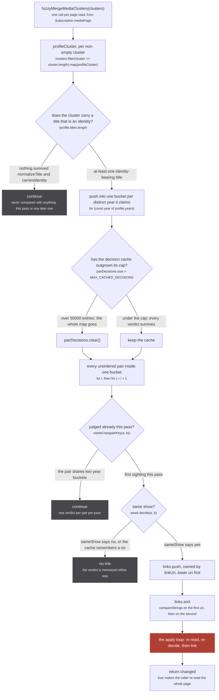
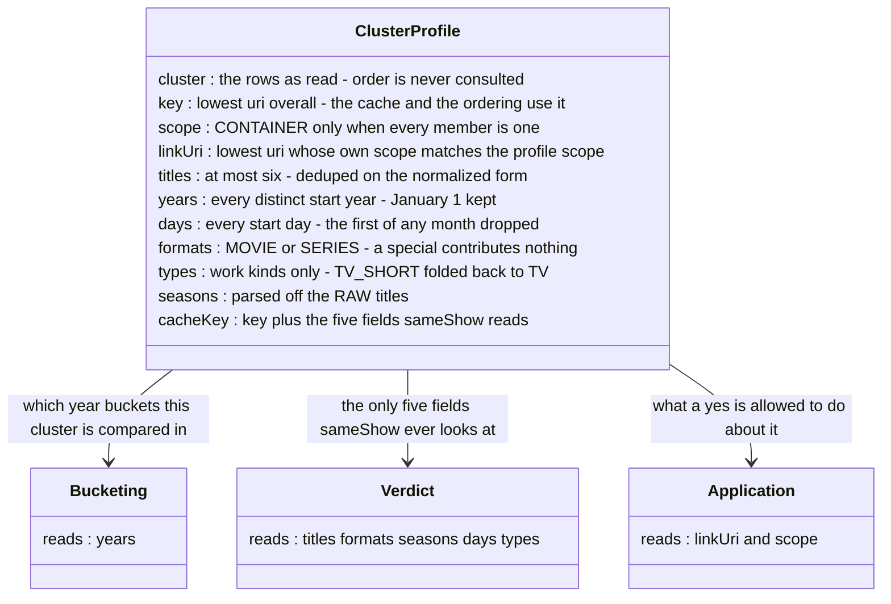
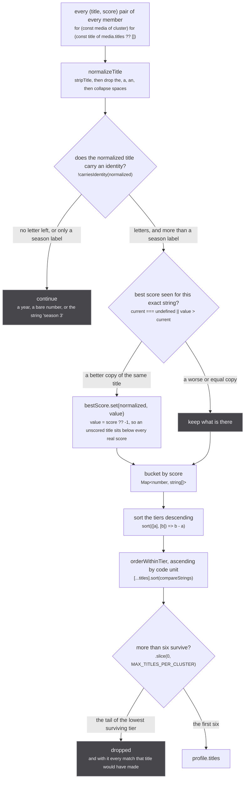
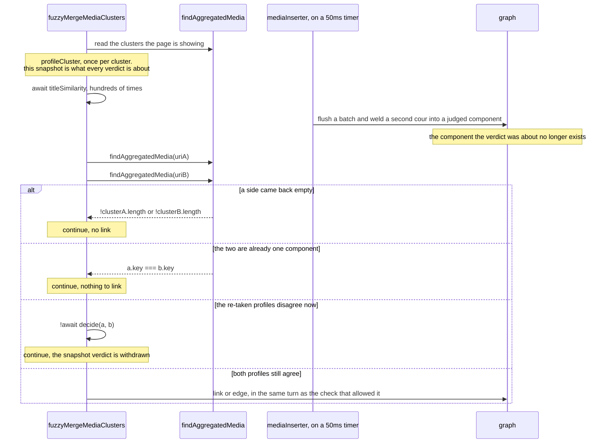
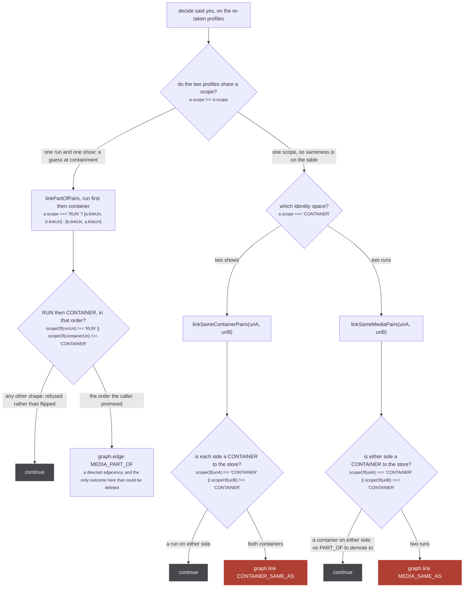

Everything else in the store links on a claim somebody made. A source mints a handle, `upsertMedia`
reads it, and the union that follows is somebody's assertion. `fuzzyMergeMediaClusters`
(`src/worker/store/fuzzy-merge.ts:594-670`) links two clusters that **no handle connects at all**,
on a title match and nothing else, and that link is a `graph.link` with no inverse.

The whole file is 670 lines and most of them are comments recording what was measured before a
threshold was allowed to exist. There is exactly one production caller: `Subscription.mediaPage`, at
`src/worker/resolvers/media/index.ts:127`.

```ts
let clusters = await findAllAggregatedMedia(uris.length ? uris : undefined)
if (await fuzzyMergeMediaClusters(clusters)) {
  clusters = await findAllAggregatedMedia(uris.length ? uris : undefined)
}
```

That is a read. The generator around it re-runs on every debounced `media:changed`
(`debouncedListenIterator(['media:changed'], 100)` at `media/index.ts:108`), so the pass runs again
each time the store moves, at most ten times a second while a fan-out is landing, over whatever
clusters the page is showing.

:::danger
**This pass writes, and it writes unions.** It runs inside a read, on every `media:changed`,
debounced 100ms. Its verdicts were computed against a snapshot before hundreds of awaits, which is
why both components are re-read and re-decided in the same turn as the link. The re-check can only
refuse a link the snapshot allowed; it can never permit one the snapshot refused.
:::

## The pass, phase by phase



*Nothing on this figure is permanent except the apply loop at the bottom, which is drawn in full further down. Everything above it is arithmetic over a snapshot.*

Three properties of the bucketing are worth reading off the code rather than off the picture
(`fuzzy-merge.ts:597-605`):

- **A cluster appears in every year any of its members claims**, not in one. A cluster holding
  AniList's 2021 date and a streaming catalogue's 2022 date is compared inside both buckets.
- **A cluster with no dated member appears in no bucket and cannot merge at all.** That is the
  property five extractors lean on by name when they refuse to stamp a show's date onto a season row
  (`unogs/extractor.ts:276-277`, `appletv/extractor.ts:94-95`, `tvmaze/extractor.ts:92-93`,
  `tmdb/extractor.ts:117`, `aired-date.ts:17`).
- **A cluster with no identity-bearing title is skipped at `:599`.** A Crunchyroll cluster whose only
  title is the literal string `Season 3` lands here, and that is deliberate: see `carriesIdentity`
  below.

The cache is a module-level `Map` (`fuzzy-merge.ts:580`) that lives for the life of the worker. It is
never cleared per request. The only thing that empties it is the size check at `:607`, and the check
is strict and total:

```ts
if (pairDecisions.size > MAX_CACHED_DECISIONS) pairDecisions.clear()
```

`MAX_CACHED_DECISIONS` is `50_000` (`:13`).

## What the pass reads off a cluster

`profileCluster` (`fuzzy-merge.ts:282-362`) is the only thing that ever touches a `Media` row here.
Its own doc line is the contract:

`src/worker/store/fuzzy-merge.ts:281`

> Everything the pass reads off a cluster. Nothing here may depend on the order of `cluster`.



*Eleven fields, and the split down the right is the page: `years` chooses who is compared, five fields decide the verdict, and two decide what the verdict may do.*

Three of those eleven carry a bug history, and they are the three to read carefully.

**`linkUri` is not `key`, and the difference is a fixed bug.** `key` is the lowest uri in the cluster
outright (`:283`); `linkUri` is the lowest uri among the members whose own scope matches the
profile's (`:286-290`).

`src/worker/store/fuzzy-merge.ts:103-109`

> The member a link is made THROUGH: the lowest uri whose scope is the profile's. `key` is the
> lowest uri overall, and in a mixed cluster (a row unioned as a run and flipped CONTAINER since,
> which is sticky) that can be the container member. The store answers a container uri in the
> container space, so re-reading such a cluster by its key found a singleton show instead of the run
> cluster, and `linkSameMediaPairs` refuses a container on either side: two runs that agreed on title
> and year could never union. `key` stays as it is for the cache and the ordering.

Pinned by `a mixed cluster keyed by its container member still unions with a run`
(`tests/unit/worker/store/fuzzy-merge.test.ts:390`), where the setup is literally
`['cr:7300=CONTAINER', 'kitsu:7301=RUN']` and the link has to go through `kitsu:7301`.

**`years` keeps a January 1 date and `days` throws it away.** Same `startDate` string, two different
readings, and the asymmetry is the point: the year only picks the bucket, and being in a bucket costs
nothing, while the date axis inside `sameShow` refuses merges. `startDay` (`:173-179`) drops the
first of any month:

```ts
if (parsed.getUTCDate() === 1) return null
```

`src/worker/store/fuzzy-merge.ts:150-156`

> JANUARY 1, because seven extractors BUILD that string out of a bare year: justwatch:387, omdb:55,
> tmdb:120, tvdb:99, unogs:166 and :181, and crunchyroll:152 all literally template a year followed
> by -01-01. Nothing downstream can tell one of those from a show that really did premiere on New
> Year's Day, and the ones that mint it are the streaming catalogues, whose whole job here is to
> attach a one-title cluster to a fat metadata cluster. Measured: keeping January 1 as a date
> destroys 14992 of 17946 such attaches, which is the shape of rule this file already refuses once
> (see the season check). Dropping it destroys none of them.

The second coercion it drops is the first of *any* month, because kitsu and jikan answer `YYYY-MM-01`
when only the month is known (`kitsu/extractor.ts:135`, `jikan/extractor.ts:126`). A genuine
first-of-month premiere is therefore exempt from the date veto, which the comment calls the safe
direction: an exempted pair is simply judged on the other axes.

**`cacheKey` is six segments and deliberately omits `years`** (`:360`):

```
key # titles # formats # seasons # days # types
```

Every list inside it is sorted, and that sorting is not cosmetic:

`src/worker/store/fuzzy-merge.ts:344-352`

> The key has to identify the SET of titles, because that is all sameShow's verdict depends on: its
> title comparison is an existential double loop, so no ordering of the same six can change the
> answer. Sorting here keeps one logical cluster on ONE cache entry, where joining them in selection
> order once wrote a second entry per arrival order for a pair whose verdict could not differ, re-ran
> every pair through the wasm loop on the pass after any merge, and counted twice toward the
> MAX_CACHED_DECISIONS wipe that then threw away the entries still worth keeping.

And the reason the separator is safe at all:

`src/worker/store/fuzzy-merge.ts:353-355`

> Joining with ',' is safe only because normalizeTitle keeps nothing but letters, numbers and single
> spaces, so no separator can survive inside a title: let punctuation through there and cache keys
> start colliding silently.

`years` is absent from the key because `sameShow` never reads it. The caller has already spent it on
the bucketing.

## The six titles, and why their order was measured

`selectTitles` (`fuzzy-merge.ts:256-279`) reduces a whole cluster to at most `MAX_TITLES_PER_CLUSTER`
strings, and those six are the entire input to the only gate that can answer `true`.



*The slice at the bottom is the only lossy step, and until 2026-08 it was lossy in an order the network chose.*

`carriesIdentity` (`:132`) is two tests, and each was paid for:

```ts
const carriesIdentity = (title: string) => HAS_LETTER.test(title) && !isOnlySeasonLabel(title)
```

`HAS_LETTER` is `/\p{L}/u` (`:128`), with the comment *a title with no letter left is a year or a
season number, never an identity, and a bad link is permanent: graph.link has no inverse*. The second
half catches what the first waves through:

`src/sources/season.ts:115-127`

> Crunchyroll titles a season the way its catalogue does, which for a great many series is the
> literal string "Season 3", and that title reaches the store as the media's own. Two unrelated shows
> both carrying it are then identical to any comparison made on titles alone: it is what merged
> "Grand Blue Dreaming Season 3" into "Mushoku Tensei Season 3", measured on the exact-title shortcut
> in the fuzzy merge, and it merged a different pair on almost every run because it only needs two
> shows on their third season to be on screen together.

The ordering inside a tier is `compareStrings` (`:136`), plain code-unit order, *rather than
localeCompare, which is locale dependent: the point of every comparator in this file is that two runs
agree, and a collation that reads a locale off the host does not.*

Ordering by the title rather than by arrival was measured over the manami database, 41537 records,
across three arms (`fuzzy-merge.ts:201-233`):

| ordering | A weld (1547 pairs, lower better) | B split (6502 cases, higher better) | C attach (12399 cases, higher better) | |
| --- | --- | --- | --- | --- |
| arrival order | 64.5% | 94.9% | 56.0% | what this replaces |
| **title ascending** | **69.6%** | **99.9%** | **70.0%** | what this is |
| longest first | 53.8% | 100.0% | 19.9% | best on A and unusable on C |
| shortest first | 82.7% | 100.0% | 98.7% | the control, and it inverts A as predicted |

`src/worker/store/fuzzy-merge.ts:224-232`

> So ordering by the title costs five points on A and buys five on B and fourteen on C. Both recall
> arms rise for the same reason: an ordering applied identically to both sides cannot drop a title one
> side keeps, which is exactly what arrival order was doing to one split cluster in twenty.
>
> Two things worth knowing before changing this again. Latin code points sort below CJK ones, so this
> does hand a tie to the english titles, and the intuition that this starves the native title and
> costs matches is measurably wrong: C rises, because a streaming catalogue lists in latin and the
> native title is not what it is looked up by. And A is not really the slice's job. Relying on a random
> six to drop a third of the wrong welds is relying on luck for correctness, and it is what made the
> same two shows merge on one load and not the next.

### The example the cap was written on

Mushoku Tensei, as the store really holds it (`fuzzy-merge.test.ts:250-265`): two MAL cours and
ani.zip's record, already welded into one component by their handles, carrying **eight distinct
normalized titles all scored 0.9** against a cap of six.

| normalized title | source | kept |
| --- | --- | --- |
| `mushoku tensei` | anizip:15669 | yes |
| `mushoku tensei isekai ittara honki dasu` | mal:39535 | yes |
| `mushoku tensei isekai ittara honki dasu part 2` | mal:45576 | yes |
| `mushoku tensei jobless reincarnation` | mal:39535 | yes |
| `mushoku tensei jobless reincarnation part 2` | mal:45576 | yes |
| `無職転生` | anizip:15669 | yes |
| `無職転生 異世界行ったら本気だす` | mal:39535 | sliced off |
| `無職転生 異世界行ったら本気だす 第2クール` | mal:45576 | sliced off |

JustWatch carries one title for this show, `Mushoku Tensei`, at score 0.2. So whether ani.zip's short
name survives the slice is the whole difference between JustWatch attaching and not:

`src/worker/store/fuzzy-merge.ts:246-251`

> an already welded Mushoku Tensei component carries eight distinct normalized titles at 0.9, and
> whether ani.zip's short "mushoku tensei" is among the six is the whole difference between JustWatch
> attaching and not. With the long titles only, maxPossibleSimilarity measures 0.389, 0.359 and 0.326
> against them and refuses the pair before the matcher even runs.

Under arrival order the component order `[mal, mal, anizip]` put ani.zip's two titles at positions 7
and 8 of the tied block and sliced both off. Under code-unit order the short latin name sorts first
inside its own tier and the short native name is the sixth. `the merge outcome does not depend on the
order the medias arrived in` (`fuzzy-merge.test.ts:275`) runs 24 seeded permutations of the same rows
and asserts a single outcome.

## The verdict

`decide` (`:585-592`) is a memo around `sameShow` (`:396-575`), keyed on `pairKey`, which sorts the
two cache keys so the pair is order-independent:

```ts
const cached = pairDecisions.get(key)
if (cached !== undefined) return cached
```

`cached !== undefined` rather than a truthiness test, so a remembered `false` is honoured and the
wasm loop is not paid twice for a pair that already said no.

`sameShow` is five gates in order: format, season, start date, companion content, and the title loop
that is the only path to `true`. Every veto has the same shape, and only a disagreement blocks: a
cluster that says nothing about its format, its season, its date or its type is stopped by none of
them. Each gate carries its own measurement, and they get their own page: see
[the five gates](/merge/gates/). What matters here is the shape of the answer. `sameShow` returns a
boolean and knows nothing about scopes, uris or the store.

## Re-read before applying

Every verdict above was decided against a snapshot taken before the first `await`, and the pass then
awaits the wasm matcher up to 36 times per pair. Meanwhile `extractor.ts`'s DataLoader keeps flushing
on its 50ms timer, and each flush can weld more rows into a component that has already been judged.



*The `alt` arms are the three refusals at `fuzzy-merge.ts:650`, `:654` and `:655`, in source order. Only the last arm writes.*

`src/worker/store/fuzzy-merge.ts:637-647`

> Every verdict above was computed against a SNAPSHOT taken before the first await, and the pass
> awaits the wasm matcher hundreds of times: extractor.ts flushes its DataLoader batch on a 50ms
> timer throughout, and each flush can weld more medias into a component that has already been
> judged. Applying a verdict about a small component to whatever that component has become is how a
> Crunchyroll season 1 gets welded into a component that grew a season 2 while the pass ran, and
> graph.link has no inverse. So the two components are read again as they stand NOW and put through
> the same checks, with the link applied in the same turn as the check that allowed it. This can only
> ever REFUSE a link the snapshot allowed - it is an AND with the original verdict, never a
> replacement - and it costs one extra pass over the matched pairs only, which are few. The check is
> free whenever nothing moved, because an unchanged component profiles to the same cacheKey and the
> decision is already memoized.

That last sentence is why the re-check is close to free: a component that did not move profiles to
the same `cacheKey`, so `decide` answers out of the map without touching the matcher.

`a verdict is applied only if the two components still agree when it lands`
(`fuzzy-merge.test.ts:339`) is the pinned version. A stale ani.zip profile is judged against
Crunchyroll's `cr:GRQ8VE29Y-s1`, a second cour titled `Mushoku Tensei Part 2` is welded into ani.zip's
component after the snapshot, and the assertion is that the Crunchyroll cluster is still a singleton
afterwards. The season disagreement the component has *now* refuses a link the snapshot allowed.

Two more determinism fixes live in this half, and both are about which root survives a union:

`src/worker/store/fuzzy-merge.ts:619-625`

> The link names the two components by their `linkUri`, the lowest uri each holds in its own scope,
> and names them in a fixed order. Taking cluster[0] instead named them by union-find component order,
> and the ARGUMENT order is what graph.link hands to union(), which keeps the first argument's root on
> a rank tie (two fresh singletons, the common case) and appends the absorbed members after it. So
> arrival order chose the link direction, the link direction fixed the merged component's order, and
> that order chose which title the next pass sliced off: the loop this pass both consumed and fed.

`src/worker/store/fuzzy-merge.ts:631-632`

> ...and the SEQUENCE of unions decides root survival just as much as their direction does, so the
> links are applied in an order the bucket cannot influence either.

## What the verdict is allowed to do

`sameShow` answers the same way whatever the scopes are. What that answer may *do* depends entirely
on them, and the decision is taken twice: once in the pass, once again inside each of the three link
functions in `db.ts`.



*Two gates in series, and the redundancy is the point: the pass reads a profile's scope, and `db.ts` reads the store's own answer for each uri through `scopeOf`. The rose nodes are the two calls with no inverse.*

`src/worker/store/fuzzy-merge.ts:656-658`

> The verdict is the same whatever the scopes are; what it is allowed to DO is not. Two runs or two
> containers union in their own space. A title match between a run and a show is a guess at
> containment, so it rides an edge, never a union: the edge can be deleted, a union cannot.

The second gate is not decoration. `linkSameMediaPairs` did not have it until 2026-09-05:

`src/worker/store/db.ts:203-215`

> Union two media that no handle connects, which is what a fuzzy title merge decides.
>
> IT GOES THROUGH THE SAME REFUSAL `upsertMedia` DOES, and did not until 2026-09-05. Every guard the
> handle refactor added lives in `upsertMedia`'s loop, so this path, whose only caller is
> `fuzzyMergeMediaClusters`, was a raw `graph.link` with no relation, no demotion and no check: a
> show-level origin that could never be minted as SAME_AS by any source could still be welded here by
> a title match.
>
> There is no PART_OF fallback to demote to, because there is no handle and nothing asserted a
> containment. A pair with a CONTAINER on either side is simply refused, which subsumes the show-level
> backstop: those origins read as CONTAINER.

`scopeOf` (`db.ts:91-92`) is the backstop first, then the stored row, then `RUN`:

```ts
SHOW_LEVEL_ORIGINS.has(originOf(uri)) ? 'CONTAINER' : (graph.get(uri) as Media | undefined)?.scope ?? 'RUN'
```

`SHOW_LEVEL_ORIGINS` is `new Set(['imdb'])` (`db.ts:42`), exactly one entry. So an `imdb:` uri reads
as a CONTAINER before any row is consulted, and this pass can never union one into a run cluster.

`linkPartOfPairs` refuses in the same spirit, and its comment says why it refuses rather than swaps
the arguments:

`src/worker/store/db.ts:241-245`

> Hang a run under a container that no handle connects, which is what a fuzzy title match between a
> run and a show decides. An edge, never a union, and only when the scopes are RUN then CONTAINER in
> that order: anything else is refused rather than flipped, since a caller that got the order wrong
> may have the scopes wrong too.

All three are pinned: `a run and a container that agree on title and year hang on an edge, never a
union` (`fuzzy-merge.test.ts:360`), `two containers that agree on title and year union in the
container space` (`:373`), and the control that keeps the other two honest, `control: two runs that
agree on title and year still union` (`:408`).

### One asymmetry the code has and the diagram cannot show

The three branches do not all name their uris the same way (`fuzzy-merge.ts:659-666`). The cross-scope
branch uses `a.linkUri` and `b.linkUri` from the **re-taken** profiles; the two same-scope branches
pass `uriA` and `uriB`, which are the **snapshot** link uris carried through the sorted `links` array.

It cannot produce a wrong link, because `scopeOf` is re-read inside each function against the store as
it stands. What it can do is refuse: if the snapshot's `uriA` was a RUN member and its own row has
since been flipped to CONTAINER (the scope ratchet is sticky, see
[scopes and relations](/write/scopes-and-relations/)), `linkSameMediaPairs` refuses a union that the
re-taken `linkUri` would have carried. That direction is the safe one and matches the pass's stated
invariant, that the second look can only ever refuse. It is still an asymmetry worth knowing before
touching those four lines.

## What is irreversible here, exactly

- **`graph.link`** (`graph.ts:279-291`) calls the union-find's `union`. The whole `UnionFind` surface
  is `has`, `find`, `union`, `component`, `allComponents` (`graph.ts:10-16`). There is no split, no
  unlink, no disunion anywhere in the repo. Both `linkSameMediaPairs` and `linkSameContainerPairs`
  end in it.
- **`graph.edge`** is a directed adjacency and destroys nothing. That asymmetry is the entire argument
  at `fuzzy-merge.ts:658` for routing a cross-scope match onto an edge.
- **The decision cache is not durable state.** A wrong verdict in `pairDecisions` costs a stale
  answer until the map is wiped; a wrong `graph.link` costs the session.

## Where to go next

- the five gates inside `sameShow`, each with its own measurement:
  [the five gates](/merge/gates/)
- what a union does to the graph, and why there is no `unlink`: [the graph](/write/graph/)
- the 2x2 that decides union against edge for a claim somebody actually made:
  [scopes and relations](/write/scopes-and-relations/)
- the read this pass runs inside, and what re-runs when it returns `true`:
  [the five reads](/read/entry-points/)
- the other half of this section, which never writes anything:
  [consensus, not a sum](/merge/consensus/)
