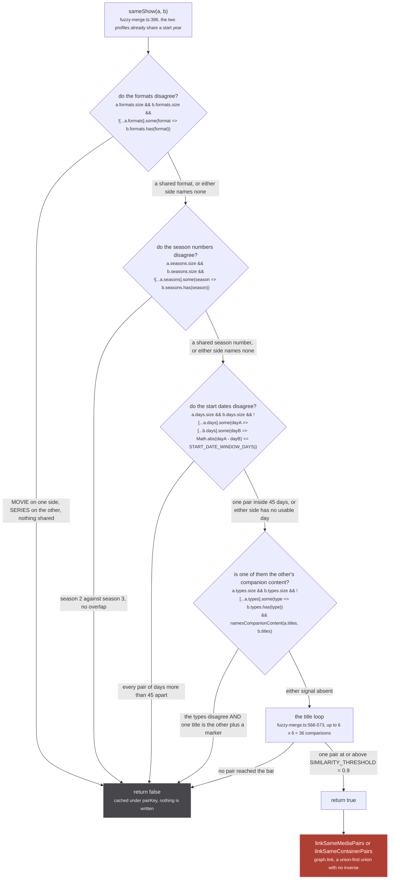
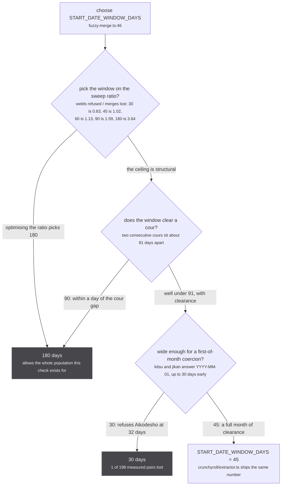
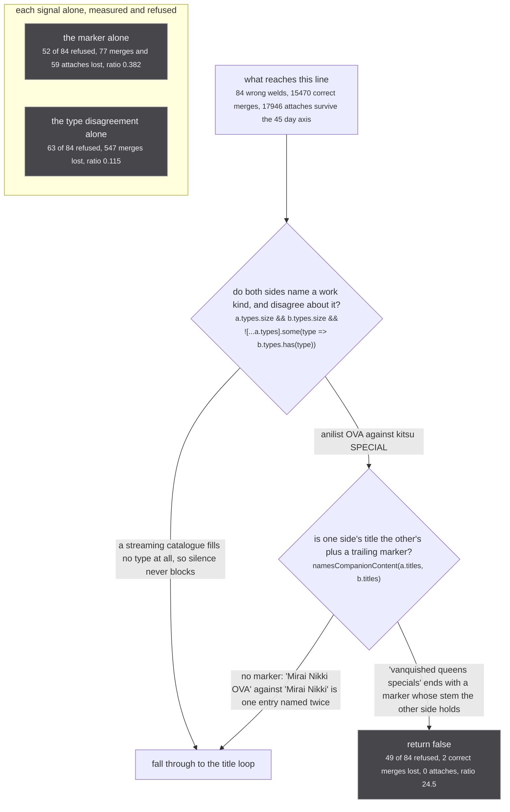
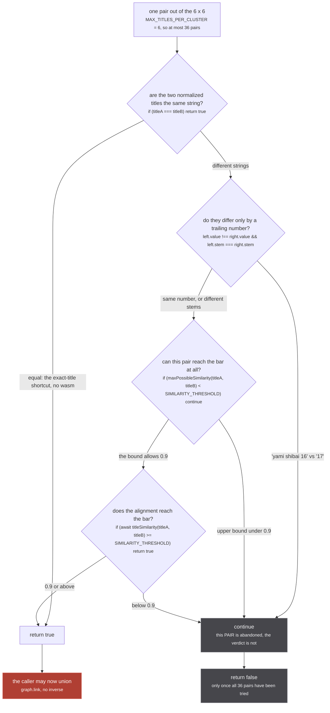

`sameShow` is the function that decides whether two clusters no handle connects are the same show.
It is 180 lines (`:396-575`), 159 of them comment, and the code is five `if`s and a double loop. Four
of the five refuse; the fifth accepts. Nothing here reads the store, nothing here writes, and its
answer is a boolean that the caller then turns into `graph.link`.

`src/worker/store/fuzzy-merge.ts:395`, the one line of comment above the signature:

> Year equality is guaranteed by the caller's bucketing

That is the first thing to hold on to. Two clusters only reach this function if they share a start
year (`fuzzyMergeMediaClusters` buckets by `profile.years` before any pair is formed), so every
number on this page is measured against a population that already agrees about the year. It is also
why the season and date gates below look weaker than they are: the cheap separation has already been
spent.

:::caution[The gates are the only thing between a title match and a permanent union]
**The gates are the only thing between a title match and a permanent union.** Every one of them
refuses only on a disagreement, so a cluster that says nothing is not protected by any of them. Read
the [KNOWN GAP](#the-gap-the-file-pins-rather-than-closes) before changing a threshold.
:::

## The five, in order

Four vetoes then the matcher. Every veto has the same shape, and the shape is the design:

```ts
if (a.X.size && b.X.size && ![...a.X].some(value => b.X.has(value))) return false
```

Both sides must have said something, and what they said must have nothing in common. One side
silent is not a disagreement, so it never blocks.



*Four ways to refuse and one way to accept, and every refusal is the same expression with a different set on it. A cluster that asserts nothing passes all four without any of them looking at it.*

The five sets the gates read (`formats`, `seasons`, `days`, `types`, `titles`) are all built by
`profileCluster` before any pair is formed, which is what makes the decision cacheable. See
[the fuzzy merge](/merge/fuzzy-merge/) for how each is derived.

## Gate 1: format

`src/worker/store/fuzzy-merge.ts:397`.

```ts
if (a.formats.size && b.formats.size && ![...a.formats].some(format => b.formats.has(format))) return false
```

It is the only gate with no comment of its own, because the argument is not in the check, it is in
how `formats` is built (`:304-317`). A `Format` is `'MOVIE' | 'SERIES'` and comes from two places:
the media's own `categories` array, filtered down to those two values, and its `type` mapped through
`mergeType`. `MOVIE` contributes `'MOVIE'`, `TV` contributes `'SERIES'`, and three types contribute
nothing at all.

`src/worker/store/fuzzy-merge.ts:309`

> one-off specials straddle the movie/series boundary - keep them format-neutral

That neutrality is per media, not per cluster, so a cluster one source types `SPECIAL` and another
types `TV` still profiles as `SERIES` through the TV member. Widening it was the first thing measured
when the companion veto was added, and it produced some of the largest costs recorded in this file.

`src/worker/store/fuzzy-merge.ts:552-561`

> THE FORMAT NEUTRALITY ABOVE IS DELIBERATELY UNTOUCHED, and this was the first thing measured.
> Giving SPECIAL/OVA/ONA a third format that disagrees with MOVIE and SERIES refuses 31 of the 75
> and destroys 8808 of the 17946 attaches, because 9023 of the 21853 entries in the corpus are one
> of those three and a streaming catalogue claims SERIES for all of them: ratio 0.003, worse than
> any rule this file has refused. Reading that third format off `media.type` only, so an untyped
> streaming cluster stays exempt, brings it to 31 refused for 327 destroyed, still 0.095.
>
> The other half of that idea, keeping neutrality only when a cluster has no other format signal,
> is ALREADY what the code above does: neutrality is per-media, so a cluster typed SPECIAL by one
> source and TV by another contributes SERIES through the TV member and profiles as SERIES.

One more thing decides this gate from outside it. `mergeType` at `:74` spells `TV_SHORT` as `TV`
before anything reads it, and the reason is exactly this gate plus gate 4.

`src/worker/store/fuzzy-merge.ts:63-68`

> Every gate in this file was calibrated against a corpus where those same rows arrived spelled
> `TV`, so reading the new member here would silently move two profiles at once on any cluster AniList
> alone types: `formats` would lose its SERIES, and `types` would lose its TV. An EMPTY `types` set is
> the dangerous half, because the companion-content veto below only fires when both sides name a work
> kind, so a short would stop vetoing anything.

## Gate 2: season

`src/worker/store/fuzzy-merge.ts:431`.

```ts
if (a.seasons.size && b.seasons.size && ![...a.seasons].some(season => b.seasons.has(season))) return false
```

`seasons` is `parseSeasonNumber` run over the **raw** titles of every member (`:326-332`), so it
reads `Season 3`, `3rd Season`, `第3期`, `シーズン3`, `Part 3`, `Cour 3` and `S3` alike. Two seasons
of one show inside one calendar year share a year bucket, so this is the gate that has to hold them
apart, and it is load bearing rather than a backstop.

`tests/unit/worker/store/season-separation.test.ts:12-15`

> THE SEASON DISAGREEMENT VETO. Same year and both sides name a season: {2} against {3} has no
> overlap and sameShow refuses before the matcher runs. Load bearing rather than a backstop,
> because on titles alone "Mushoku Tensei Season 2" and "Season 3" score 0.9175, ABOVE the 0.9
> threshold. The number does not separate these; the veto does.

0.9175 against a bar of 0.9. There is no threshold that separates those two titles and keeps the
merges this pass exists for, which is why the season number is read as identity and not as text.

### The stronger rule that was modelled and refused

The obvious tightening is to make silence block: refuse when one side declares season N and the
other declares nothing. It was measured, over the manami database, driven through this file's own
`profileCluster` and `titleSimilarity`.

`src/worker/store/fuzzy-merge.ts:398-415`

> Only a DISAGREEMENT blocks. A cluster whose sources never spell the season out has to stay free to
> merge, or the pass stops doing the job it exists for.
>
> Making silence itself block was MODELLED and REFUSED, over the manami database (41537 records,
> 2026-27) driven through this file's own profileCluster and titleSimilarity. The rule tried: refuse
> when one side declares season N>=2 and the other declares no season at all.

| what the rule does | count | ratio |
|---|---|---|
| refuses wrong welds | 323 | |
| costs merges where one show arrives as two overlapping subsets of its titles | 592 of 33188 | 0.55 |
| costs attaches where a one-title streaming cluster meets a fat metadata cluster | 11415 of 181677, over 2589 shows | 0.03 |
| costs an adversarial split with every season-marked title on one side | 2589 of 2824 | 0.12 |
| **combined** | **323 refused against 12007 lost** | **one wrong weld stopped per 37 correct merges destroyed** |

The attach row is arm C, which is the job the whole pass exists for, and it is where 11415 of the
12007 lost merges sit. The reason that cost is not bounded by the year bucketing is worth reading in
full, because it is the trap:

`src/worker/store/fuzzy-merge.ts:417-426`

> The year bucketing has already spent the separation the rule is imagined to buy: of the 373 pairs
> where exactly one side names a season, ZERO have year sets that differ, because this pass only ever
> compares within a year bucket, so "[Oshi no Ko]" 2023 against its 2024 second season is refused
> before any of this runs. What is left in that 373 is same-year split cours, recaps and specials.
> The cost is not bounded by the year at all, since both sides of a split cluster hold the same
> record and so the same year, so the rule is paid for out of "[Oshi no Ko] 2nd Season" (2024)
> attaching to a streaming cluster named "Oshi no Ko", and 2588 other shows. Ten narrower variants
> were measured too. The best of them (also require the season-less side to carry no season marker in
> ANY raw title, and the two clusters to hold a title pair that is equal once the marker is stripped
> and unequal before) keeps 126 of the 323 for 578 lost attaches across 468 shows, ratio 0.22, and
> still refuses that same Oshi no Ko attach. Nothing in the family reaches 1.

Eleven rules in that family, and the best of them buys 0.22 wrong welds per correct merge. The
shipped rule buys nothing at all in that direction and keeps 12007 merges.

### The gap the file pins rather than closes

`src/worker/store/fuzzy-merge.ts:427-430`

> WHAT THEREFORE GETS THROUGH, known rather than new: "86" and "86 Part 2", both 2021, both carrying
> the synonym "86 -不存在的战区-", one naming a season and one not, weld on the exact-title shortcut
> below. That is 373 of the 12674 pairs of distinct records that share a title after the slice; the
> other 12050 have NEITHER side naming a season and are franchise-label collisions ("minna no uta" is
> carried by 1039 records), which no season rule reaches. Pinned by the KNOWN GAP test in
> season-separation.test.ts, so closing it fails there loudly.

The test that carries that name is `tests/unit/worker/store/season-separation.test.ts:129`, and it
asserts `true`: two Mushoku Tensei clusters, one titled `Mushoku Tensei Season 3` dated
`2026-07-06T00:00:00Z`, one silent about its season and dated `2026-01-01`. Six months apart, and it
still welds, because `startDay` throws a January 1 date away before the date gate can see it. The
comment above the test says why that is not a corner case:

`tests/unit/worker/store/season-separation.test.ts:123-128`

> THE GAP THAT SURVIVES, pinned the way the one above used to be. Mechanism 4 blocks on a
> DISAGREEMENT, so a cluster that knows only which year it is declares nothing and still welds. That
> is not a corner: it is every streaming catalogue, which is why `startDay` drops January 1 in the
> first place, and closing it by treating silence as a mismatch is the same rule already refused for
> seasons, at a measured one wrong weld stopped per 37 correct merges destroyed. A cluster with no
> date at all is not this case, because it has no year either and mechanism 1 never compares it.

## Gate 3: the start date

`src/worker/store/fuzzy-merge.ts:494-497`.

```ts
if (
  a.days.size && b.days.size
  && ![...a.days].some(dayA => [...b.days].some(dayB => Math.abs(dayA - dayB) <= START_DATE_WINDOW_DAYS))
) return false
```

`START_DATE_WINDOW_DAYS = 45` at `:46`. `days` is not simply "the start dates": it is `startDay`
(`:173-179`), which returns `null` for a date whose UTC day of month is 1, so seven extractors that
build a `${year}-01-01` string out of a bare year contribute nothing to this axis, and neither does
the `YYYY-MM-01` that kitsu and jikan emit when only the month is known. That exclusion is the whole
reason this gate can exist without destroying the attach.

This is the gate added for the case the first two cannot reach.

`src/worker/store/fuzzy-merge.ts:432-441`

> Two seasons inside ONE calendar year share a year bucket, so the bucketing above never reaches
> them, and the season check above needs BOTH sides to name a season while season 1 almost never
> does. A start date needs neither side to say anything: "if we have mushoku tensei season 2, it
> shouldn't get merged in with mushoku tensei s3", and seasons really do land like S1 January to
> April, S2 July to October.
>
> Same shape as the season check, and for the same reason. Silence never blocks, and ONE pair of
> dates inside the window is enough to allow the merge, so a cluster that holds both a right date
> and a wrong one still merges on the right one. This can therefore only ever make sameShow answer
> false more often than it did.

Note the quantifier. `.some` over `a.days` inside `.some` over `b.days` means **one** agreeing pair
of days admits the merge, however many disagreeing pairs the two clusters also hold. Pinned by
`a cluster carrying two dates merges on whichever one agrees`
(`tests/unit/worker/store/season-separation.test.ts:180`).

### Why 45, and why the sweep table is a trap



*The best-scoring window on the sweep is the one that breaks the rule. Two constraints the ratio cannot express fence it in from both sides: a cour above, a month-precision coercion below.*

The sweep itself, verbatim from `src/worker/store/fuzzy-merge.ts:27-31`, as
(welds refused / correct merges lost / ratio):

| window | refused | lost | ratio |
|---|---|---|---|
| 30 | 84 | 101 | 0.83 |
| **45** | **83** | **81** | **1.02** |
| 60 | 77 | 68 | 1.13 |
| 90 | 65 | 41 | 1.59 |
| 180 | 40 | 11 | 3.64 |

`src/worker/store/fuzzy-merge.ts:33-43`

> The ratio improves MONOTONICALLY as the window widens, so a reader optimising it picks 180 days.
> That is exactly backwards: this rule exists to separate two seasons inside ONE calendar year, and
> the owner's stated shape is season 1 in months 1 to 4 against season 2 in months 7 to 10, which is
> about 180 days apart. A 180 day window ALLOWS the entire population the check was built for, and
> scores a beautiful ratio by refusing almost nothing. Two consecutive cours sit about 91 days apart,
> so the window has a hard ceiling well below that regardless of what the ratio says.
>
> So the ceiling is structural and the ratio only picks between the widths under it. 45 is the widest
> that leaves a full month of clearance below a cour, and it is the constant crunchyroll/extractor.ts
> already ships for the same question, which keeps one number in the codebase instead of two.

The floor is the other measurement, and it is one anime wide:

`src/worker/store/fuzzy-merge.ts:19-25`

> 45 rather than 30, because of a coercion nothing in the payload flags. kitsu and jikan hand stub
> whatever their API answers (kitsu/extractor.ts:135, jikan/extractor.ts:126) and both answer
> `YYYY-MM-01` when only the month is known, so a first-of-month date is up to 30 days early and
> reads as precise. The `startDay` guard below catches only the January ones. Measured, same anime,
> a kitsu first-of-month the guard KEEPS against a day-precise AniList date: 198 pairs, 187 of them
> within 30 days, exactly ONE in the 31 to 45 band a 30 day window would refuse (Aikodesho, 32 days,
> AniList Fri, 02 Sep 1988 against kitsu 1988-08-01) and 10 beyond 45, which are real disagreements
> no window should absorb.

That one pair is a test: `a first-of-month coercion 32 days off still merges`
(`tests/unit/worker/store/season-separation.test.ts:145`), with the real dates in it.

### What the axis buys, and the false negative it takes on

The census at `:455-475`, over 21853 AniList entries carrying a start date, on a main-title pool:
**577** same-year pairs of distinct entries whose titles can reach the threshold; of the **118** that
still weld with the companion check active, **83** are refused; the cost is **81 of 15549** correct
merges (0.52%) and **0 of 17946** streaming attaches.

Read the last figure with the control beside it, because a rig that cannot express a cost reports
success unconditionally:

`src/worker/store/fuzzy-merge.ts:471-475`

> control  the same run with January 1 believed rather than dropped destroys 14992 of the 17946
> attaches, ratio 0.02, back in the range of the season-label rule this file refuses
> just above. A second control samples 20000 same-year pairs the census did NOT select
> and welds 0 of them. The rig can express a catastrophic cost and can express a miss,
> so the 0 above is a result rather than a silence.

And the arm the file records rather than estimates:

`src/worker/store/fuzzy-merge.ts:487-493`

> THE FALSE NEGATIVE IT KNOWINGLY ACCEPTS: a source that dates a show by when IT started carrying
> it rather than when the show aired. appletv is the one that can do this today, the only streaming
> extractor publishing a day-precise date (appletv/extractor.ts:79) rather than a `${year}-01-01`,
> so an Apple cluster whose date is a late western release is refused against the metadata cluster.
> It is NOT measured: over 398 sampled anime, Apple's search returned an item carrying a release
> date for 199 of them and an item whose normalized title matched the query for ZERO, so the arm
> cannot be measured from that endpoint at all and is recorded here rather than estimated.

## Gate 4: companion content

`src/worker/store/fuzzy-merge.ts:562-565`.

```ts
if (
  a.types.size && b.types.size && ![...a.types].some(type => b.types.has(type))
  && namesCompanionContent(a.titles, b.titles)
) return false
```

This is the only gate that needs two independent signals, and it is the only one where a single
signal was measured and found to be the kind of rule this file refuses everywhere else.

The class it exists for is a work welding to its own specials entry. Nothing before this line can
reach it:

`src/worker/store/fuzzy-merge.ts:498-503`

> A show welding to its OWN companion content is what is left once the date axis above has run,
> and it survives everything before this line for one reason: the companion entry carries the
> parent's NATIVE title unchanged. "Vanquished Queens" and "Vanquished Queens Specials" both hold
> ヴァンキッシュドクイーンズ, so the exact-title shortcut fires on a title neither catalogue bothered
> to distinguish, while the latin titles that DO distinguish them are never the pair that matches.
> Same year, and often the same day, so neither the bucketing nor the date window can reach it.



*Two signals in series, and the two boxes at the bottom are what either of them buys on its own. The pair is 64 times better than the marker alone and 213 times better than the disagreement alone, on the same corpus.*

`src/worker/store/fuzzy-merge.ts:505-514`

> TWO signals, and it takes both. Alone, each is the shape of rule this file already refuses:
>
>   the marker alone      52 of 84 refused, 77 correct merges destroyed and 59 streaming attaches,
>                           ratio 0.382. It fires on one catalogue writing "Blade of the Immortal
>                           ONA" where the other writes "Blade of the Immortal" for THE SAME entry,
>                           which is a naming convention rather than a different work.
>   the disagreement alone 63 of 84 refused, 547 correct merges destroyed, ratio 0.115, for the
>                           same reason at larger scale: anilist and kitsu type one anime
>                           differently often enough that the disagreement alone is mostly noise.
>   both together         49 of 84 refused, 2 correct merges destroyed, 0 attaches, ratio 24.5.

`src/worker/store/fuzzy-merge.ts:522-524`

> The two are independent because a marker is how ONE catalogue writes a title and a type is what
> BOTH catalogues assert about the work. A marker with no disagreement is a convention; a marker
> with a disagreement is two catalogues independently saying these are different kinds of thing.

All three arms are tests. `a work does not weld to its own companion entry`
(`tests/unit/worker/store/fuzzy-merge.test.ts:174`) is the Vanquished Queens pair, anilist OVA
against anilist SPECIAL, both carrying ヴァンキッシュドクイーンズ.
`one catalogue appending OVA to its own title still merges` (`:198`) is the marker with no
disagreement, both sides typed OVA. `a streaming cluster still attaches to a cluster whose title
carries a marker` (`:211`) is the disagreement with no type on one side: `jw:tskeijo` types `null`,
so `b.types.size` is 0 and the gate never fires.

### What `namesCompanionContent` actually compares

`src/worker/store/fuzzy-merge.ts:189-199`. Both directions, every title, every marker:

```ts
if (title.length <= marker.length + 1 || !title.endsWith(` ${marker}`)) continue
if (plain.includes(title.slice(0, -(marker.length + 1)).trim())) return true
```

`plain.includes` is `Array.prototype.includes` over the other profile's titles, at most six of them,
so the stem has to be a title the other side **holds**, exactly, not a substring of one. And the titles it walks are
the profile titles, already through `normalizeTitle`:

`src/worker/store/fuzzy-merge.ts:185-187`

> Read off the profile titles, so it sees the same six the matcher does and nothing normalizeTitle
> already threw away: "Ore, Tsushima (ONA)" arrives here as "ore tsushima ona" and the marker is a
> plain trailing word by then.

`COMPANION_MARKERS` at `:92-95` holds ten entries, each one measured alone against the pair set this
gate is decided on, and each one kept because it refused at least one wrong weld there:

`src/worker/store/fuzzy-merge.ts:76-87`

> The trailing phrases that name companion content rather than a work, measured one at a time rather
> than guessed. Each was swept alone against the pair set the companion check below is decided on,
> and the ten kept are exactly the ones that refused at least one wrong weld there:
>
>   specials 19, special 8, ova 7, ona 4, episode 0 3, bonus 2, mini anime 2, picture drama 1,
>   recap 1, trailer 1
>
> Fifteen more were swept and dropped for refusing none of them: picture dramas, recaps, digest,
> ovas, omake, omakes, extra, extras, pilot, ex, short, shorts, preview, previews, pv. They cost
> nothing either, so this is not a claim that they never occur, only that this corpus cannot say
> they earn their place.

## Gate 5: the title loop

`src/worker/store/fuzzy-merge.ts:566-574`. This is the one that says yes.



*Two of the three ways past a pair are an explicit `continue`, and a `continue` here abandons the PAIR, never the verdict. Thirty-five other pairs are still free to say yes.*

Three of the four branches never touch the matcher.

**The exact-title shortcut returns `true` with no similarity computed at all.** That is not a
performance note, it is where most of this file's known failures come from: the Grand Blue Dreaming
weld, the Vanquished Queens weld and the "86" weld all fire here, on two clusters holding a
byte-identical normalized title. `isOnlySeasonLabel` and `HAS_LETTER` in `selectTitles` exist because
of it, and so does gate 4.

**The trailing-number guard is a `continue`, and it compares values rather than characters.**

`src/worker/store/fuzzy-merge.ts:384-388`

> A trailing number is compared as a VALUE, never as characters. "yami shibai 16" and "yami shibai 17"
> are two different shows and score 0.8849, while "onii-chan!" and "oniichan" are one show and score
> 1.0000, so no threshold tells them apart: alignment charges nothing for a hyphen that is noise and
> almost nothing for a digit that is the whole identity. Both re-measured on frizbee 2026-08-29; they
> read 0.929 and 0.833 here until then, which were seal-wasm's and outlived it.

0.8849 for two different shows against 1.0000 for one show spelled two ways. The ordering of those
two numbers is the whole argument: any threshold that refuses the first also refuses the second.
Both are tests, `a bare trailing number is compared as a value`
(`tests/unit/worker/store/fuzzy-merge.test.ts:98`) and `punctuation differences still merge` (`:111`),
and the second is there so the guard cannot be widened into the merges the pass exists for.

**`maxPossibleSimilarity` is an exact upper bound, not a heuristic.** `src/worker/store/fuzzy-merge.ts:364`:

> exact upper bound on titleSimilarity - skips the WASM alignment for pairs that can never reach the threshold

It is multiset character overlap divided by the longer length (`:365-377`), which no alignment score
can exceed, so a pair it drops could not have passed. This is also the number quoted in
`selectTitles`'s determinism argument: with only the long renderings of Mushoku Tensei kept, the
bound against ani.zip's short "mushoku tensei" measures 0.389, 0.359 and 0.326 and the matcher never
runs. Which six titles survive the slice therefore decides whether JustWatch attaches at all.

**The bar is one constant used twice.** `SIMILARITY_THRESHOLD = 0.9` at `:7`, read at `:570` as the
prefilter cutoff and at `:571` as the accept bar. `titleSimilarity` (`src/sources/utils.ts:251-260`)
is symmetric by construction: it takes the `Math.min` of the two directional alignment ratios, so
`sameShow(a, b)` and `sameShow(b, a)` cannot disagree through it.

The loop is also why the title cap is where it is:

`src/worker/store/fuzzy-merge.ts:8-11`

> Bounds the wasm work, and it is the square that matters: sameShow compares every kept title of one
> cluster against every kept title of the other, so a pair costs up to 36 alignments today and a year
> bucket costs that times its pairs. Eight titles would take one pair to 64, +78% on the single loop
> the whole pass spends its time in, so this is not a knob to turn without measuring the loop first.

## The verdict is cached, and the cache key is the five sets

`sameShow` is never called twice for the same inputs in a session. `decide` at `:585-592` sits in
front of it, keyed by `pairKey` (`:577-578`), which sorts the two `cacheKey`s so the pair is
order-free.

`src/worker/store/fuzzy-merge.ts:582-584`

> The cache is keyed on exactly the five fields sameShow reads plus the component's identity, so a
> reused verdict is always still a verdict about the same inputs. That is what makes it safe to ask
> again below without paying for the wasm loop twice when nothing has moved.

Count them on this page and the claim holds: `formats`, `seasons`, `days`, `types`, `titles`. The
`cacheKey` at `:360` is exactly those five, each sorted, plus `key`, and `years` is deliberately
absent because the year chooses the bucket and never the verdict. `pairDecisions` is cleared whole
when it passes `MAX_CACHED_DECISIONS = 50_000` (`:13`, wiped at `:607`).

## Where the code disagrees with the description

**`COMPANION_MARKERS` holds ten markers, not twenty-five.** The list at
`src/worker/store/fuzzy-merge.ts:92-95` is `specials, special, picture drama, recap, ova, ona, bonus,
mini anime, episode 0, trailer`. Its own doc block at `:84-87` says the other fifteen were "swept and
dropped for refusing none of them", and that matches the code. The comment inside `sameShow` at
`:516-519` says the opposite about the same fifteen: "Fifteen of the twenty-five markers in the list
refuse nothing at all on this corpus (picture dramas, recaps, digest, ovas, omake, omakes, extra,
extras, pilot, ex, short, shorts, preview, previews, pv). They are kept because a marker that fires
zero times costs zero". They are not kept. Nothing reads a comment, so nothing behaves differently,
but a reader looking for `omake` in the list will not find it.

**The two marker frequency tables do not agree, and neither says what the other measured.**
`:81-82` reports `specials 19, special 8`; `:520` reports "The ten that do fire are led by "specials"
at 22 and "special" at 10". Those are different counts of the same two markers. The first is the
sweep that ran each marker alone; the second is the ten firing together with the date axis active,
which is the "MARGINAL, not standalone" framing the block above it insists on. The file does not say
so, so treat neither as the count of "how often specials fires" without re-running the probe named
at `:88-90`.

**The "86" example is dated by the code's own test file to before the gate that would now refuse
it.** `:427-430` presents `86` against `86 Part 2` as "WHAT THEREFORE GETS THROUGH, known rather than
new", and says it is "Pinned by the KNOWN GAP test in season-separation.test.ts". The test with that
name (`tests/unit/worker/store/season-separation.test.ts:129`) does not use that pair: it pins two
Mushoku Tensei clusters six months apart, one of which carries a bare `2026-01-01` that `startDay`
discards. And the header of that same test file dates the 86 measurement explicitly:
`:26-27`, "Measured over the manami database before mechanism 4 existed: 255 pairs of genuinely
different entries reached a merge this way". Mechanism 4 is the date gate, and the file itself says
that pair is both 2021 with one side a `Part 2`, so whether it still welds now depends entirely on
whether both sides carry a day-precise date the window can measure. The family is still open either
way, and the shape the test pins today is silence on the DATE axis, not silence on the season axis.

**The gate order is not pinned anywhere.** The four vetoes are independent predicates, so
their order changes only which one gets the credit for a refusal, and nothing in the file or the
tests pins it. The one order that is load bearing is inside the title loop: the exact-title shortcut
runs before the trailing-number guard, so `86` against `86` returns `true` before
`differOnlyByTrailingNumber` is ever consulted.

Next: [the fuzzy merge](/merge/fuzzy-merge/) for what builds the profiles these gates read and what
the verdict is allowed to do afterwards, [what a source may mint](/sources/what-a-source-mints/) for
the other way two clusters become one, and [the search gate](/sources/search-gate/) for the same
two-axis rule applied to a catalogue search hit rather than to two clusters.
