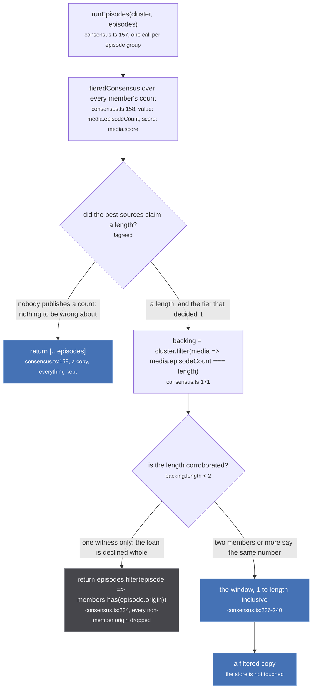
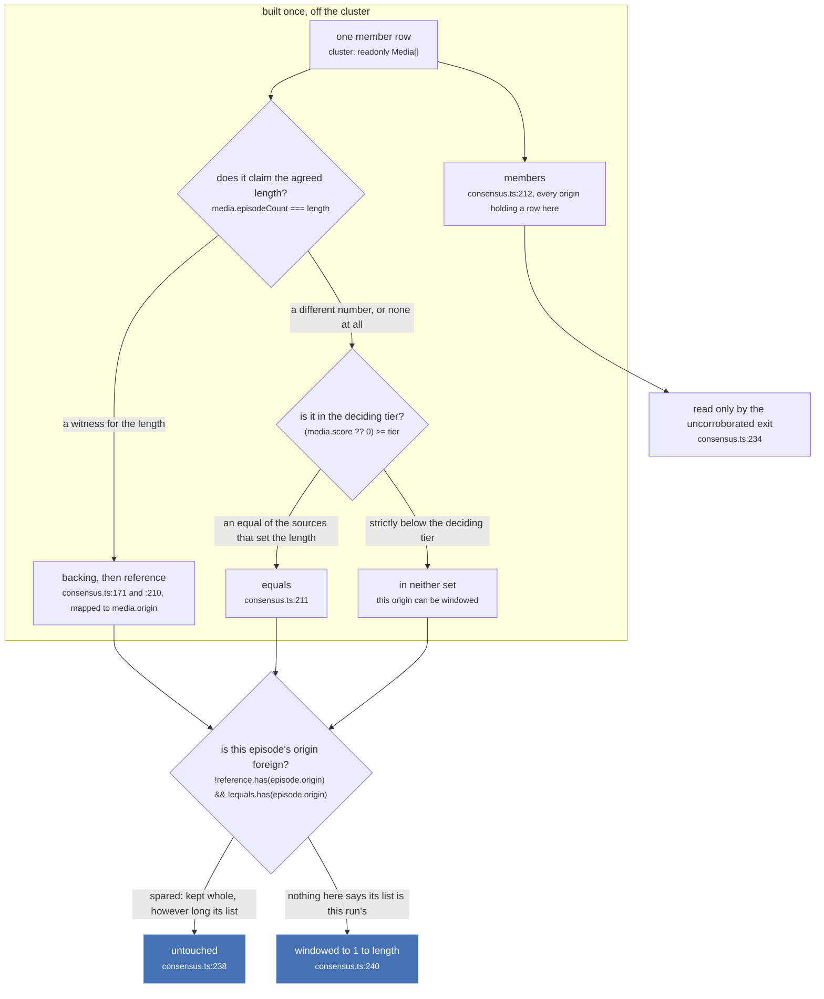
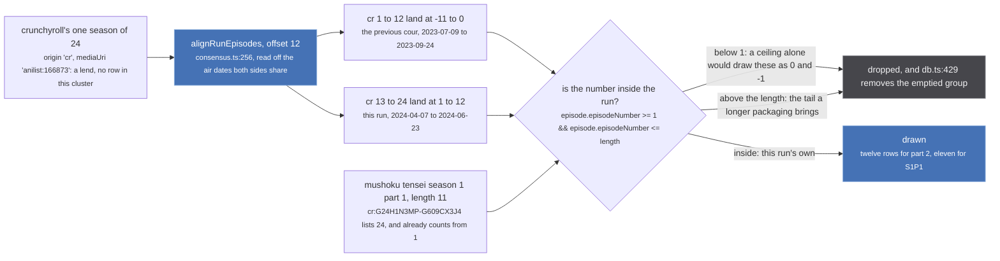
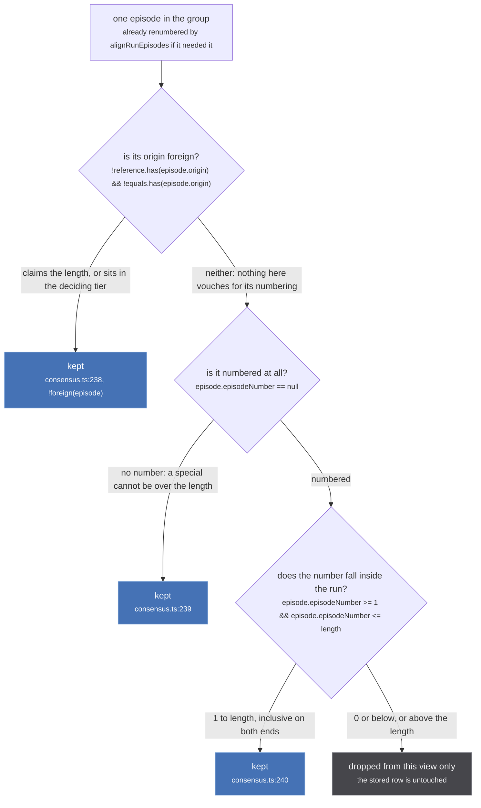

`runEpisodes` is twelve lines at `src/worker/store/consensus.ts:157-241`. It takes the run's cluster
and a list of episodes and returns a filtered copy. It answers one question: of the episodes this
cluster can reach, which of them are this run's?

The question exists because an episode arrives attached to whichever media published it, and a
catalogue that packages this run inside a longer season publishes that whole season's list.

`src/worker/store/consensus.ts:65-83`

> The episodes that belong to THIS run, dropping the tail a longer packaging of it brings.
>
> A cluster can be exactly right about who it contains and still list somebody else's episodes,
> because an episode arrives attached to whichever media published it. Crunchyroll models Mushoku
> Tensei season 1 as one season of 23 and a special where AniList and MAL split the same broadcast
> into 11 and 12, so an 11 episode run listed 24 rows: 11 correct, then part 2's twelve, then the
> special (measured on the live site 2026-09-09).
>
> The rule is the one `sources/similar.ts` already applies when CHOOSING a season, moved to where the
> choice is displayed: a member whose own count exceeds what the run's sources agree on is describing
> a longer thing, and only the part of its list that fits the run is this run's.
>
> IT REFUSES A TAIL, NEVER A SOURCE. Crunchyroll's episodes 1 to 11 are still this run's episodes and
> are still listed; a member that agrees about the length is untouched however low its score; and a
> cluster whose sources publish no count at all is left exactly as it was, because there is nothing to
> be wrong about. That last case is the reason this cannot be written as "drop what exceeds the
> count": most of the store has no count.

The rule it mirrors is `foldVetoed` at `src/sources/similar.ts:147`, which a source applies when it is
choosing which season to hand back. `runEpisodes` is the same test applied one layer later, at the
point the choice is drawn.

:::caution
**Nothing on this page writes anything.** `runEpisodes` returns `T[]` and never mutates its input;
`alignRunEpisodes` returns a `Map` of fresh copies. That is not tidiness, it is forced. The episode
rows here are stored under Crunchyroll's own guid and are reachable from other paths, and
`graph.set`'s merge is `lastWriteLongestArray` (`src/worker/store/graph.ts:387-388`, *"Merge strategy:
scalars last-write-wins, arrays longest-wins"*), so correcting an `episodeNumber` in place would
overwrite it for every other reader with no way to get the old value back. The reason is stated at
`src/worker/store/consensus.ts:247-250`:

> READ TIME, AND A COPY. The stored node keeps Crunchyroll's own number, because it is keyed by
> Crunchyroll's guid and is reachable through the whole season from other paths: `graph.set` is
> last-write-wins, so rewriting it here would change what those other readers see. What the run needs
> is a VIEW, and a view is what this returns.

An episode dropped by the window is dropped from one answer. It is still in the store, still on the
containing season's page, and it comes back the moment the counts change.
:::

## Where it runs, and on what

The only production caller is `findRunEpisodes` at `src/worker/store/db.ts:424-430`.

`src/worker/store/db.ts:417-422`

> The episode groups a RUN should list, which is the walk above minus any tail a longer packaging of
> the run brings with it. See ./consensus.ts for the rule and for why it needs two witnesses.
>
> Takes the cluster rather than the uris, because the decision is made on what each member says its
> own length is, and a uri does not carry that.

```ts
export async function findRunEpisodes(cluster: Media[]): Promise<Episode[][]> {
  const groups = await findAggregatedEpisodesForMedia(cluster.map(media => media.uri))
  const aligned = alignRunEpisodes(cluster, groups.flat())
  return groups
    .map(group => runEpisodes(cluster, group.map(episode => aligned.get(episode.uri) ?? episode)))
    .filter(group => group.length)
}
```

Three things in those four lines decide how the rest of the page reads, and the second and third are
easy to miss.

- **Alignment happens first**, on the flattened list (`db.ts:426`). By the time the window runs, every
  episode number is on the run's own numbering. Windowing a Crunchyroll number that still counts on
  from the previous season would be meaningless. That half is [aligning a numbering](/merge/alignment/).
- **`runEpisodes` is called once per GROUP, not once on the flat list** (`db.ts:428`). A group is one
  episode as `mergeByEpisodeNumber` left it, so the cluster-derived sets are rebuilt identically for
  every group and the filter is applied inside each. The consequence is on the next line.
- **`.filter(group => group.length)` deletes a group the window emptied** (`db.ts:429`). A group made
  only of foreign rows that fell outside the window does not come back as an empty group; it stops
  existing. That is how the previous cour's twelve rows leave the page rather than being drawn blank.

## The three exits



*Two of the three exits hide nothing at all, and each of them was written for a measured case where hiding something was worse than showing it.*

The length and the tier both come from `tieredConsensus` (`consensus.ts:36`), which is
[consensus, not a sum](/merge/consensus/). `runEpisodes` calls it directly rather than through
`runLength` because it needs the `tier` as well as the value, and the tier is what decides who may
not be trimmed.

### Exit 1: no consensus, no trim

`consensus.ts:159`, `if (!agreed) return [...episodes]`. `tieredConsensus` answers `undefined` when
no member states a count at all, and the answer here is a copy of everything. This is the case the
doc block says the rule could not be written without: *most of the store has no count*. Pinned at
`tests/unit/worker/store/consensus.test.ts:174`, where the cluster is `anizip:1` with no score and no
count and `cr:1` at 0.5 with no count, and all 24 Crunchyroll episodes survive.

### Exit 2: an uncorroborated length declines the loan

`consensus.ts:234`, `if (backing.length < 2) return episodes.filter(episode => members.has(episode.origin))`.
Two comments sit directly above that line, and they are the argument for why the bar is not simply
"do not trim".

`src/worker/store/consensus.ts:214-224`

> THE WITNESS BAR APPLIES TO MEMBERS, AND A LOAN IS NOT A MEMBER.
>
> A member's episodes are this run's own data, and hiding them on a length only one source claims
> is how episodes that aired disappear. A LENT source has no row here at all: the only reason its
> episodes are on this page is that a season containing this run handed them over, and taking only
> the part that fits is the whole basis on which they were accepted.
>
> Measured 2026-09-09 on Mushoku Tensei season 2 part 1, where MAL publishes no count and AniList
> says 13: the length rests on one witness, the bar disabled every window, and a lent season put 24
> rows on a 12 episode page.

`src/worker/store/consensus.ts:226-233`

> AN UNCORROBORATED LENGTH REFUSES THE LOAN OUTRIGHT rather than slicing on it.
>
> A lent season is only useful if the run can say which of its episodes are its own, and a length
> one source claims cannot. Mushoku Tensei season 2 part 1 is the case: MAL publishes no count at
> all and AniList says 13 for a run that aired 12, so windowing to 13 put a thirteenth row on the
> page that only Crunchyroll had. Declining leaves the page exactly as it was.

The real cluster, from `consensus.test.ts:374-377`: `anilist:146065` at 0.8 says 13, `mal:51179` at
0.9 says nothing, `kitsu:45950` at 0.3 says 12, `anizip:17236` unscored says 12. The tier is 0.8, so
the answer is 13 and `runLength` still returns it, but exactly one row claims 13. Every member origin
keeps everything it has and every non-member origin is dropped whole: the Crunchyroll loan goes to
zero rows (`consensus.test.ts:382`) while anizip's three survive (`:388`).

Note what this exit does **not** inherit from the window below it: the filter is on `origin` alone, so
a lent episode with no `episodeNumber` is dropped here, where the window at `consensus.ts:239` would
have kept it. An uncorroborated length declines the whole loan, specials included.

### Exit 3: the window

Everything else falls through to the three-clause filter at `consensus.ts:237-240`.

## The four sets, all keyed on origin



*Every set on this figure holds origins, never uris, and the reason is that a source can hang its episodes off another source's row.*

`reference`, `equals` and `members` are built at `consensus.ts:210-212`, and all three are
`Set<string>` of `media.origin`. Nothing here is keyed on a uri. That is deliberate and it is the same
choice `alignRunEpisodes` makes at `consensus.ts:271-274`: a season that contains this run attaches
its episodes to the run's own media row, so the episode's `mediaUri` names a member while its `origin`
names the lender.

Two of the three sets are spared by the filter, and each has its own reason.

`src/worker/store/consensus.ts:162-170`

> TWO WITNESSES before anything is hidden.
>
> Half the counts in this tree are not claims at all: twelve sources set `episodeCount =
> episodes.length`, so a catalogue that could only reach part of a run publishes a SHORT count as
> confidently as one that knows the whole run. A length resting on a single row, acted on, hides
> episodes that aired. The second witness may come from any tier, since the question here is only
> whether the number is corroborated at all.

`src/worker/store/consensus.ts:173-183`

> AND ONLY A STRICTLY LOWER TIER IS TRIMMED.
>
> A member that packages this run inside a longer season is describing a different thing, and the
> only reason to believe that rather than believe its count is that better sources disagree with it.
> An equal cannot be overruled: two 0.9 catalogues disagreeing is a disagreement, and the answer to
> one of those is to show what the tier's majority says, never to delete the dissenter's episodes.
>
> Crunchyroll's fold is 0.5 against MAL's 0.9, and stays trimmed however many streaming catalogues
> echo it, which is the case a sum of scores got wrong.

The pair of tests at `consensus.test.ts:160` and `:169` is the whole rule in four lines. Three sources
in one 0.9 tier, two saying 12 and one saying 13: the length is 12, the dissenter is outvoted on the
number and keeps all 13 of its episodes. Move that dissenter to kitsu at 0.3 with a count of 22 and it
is trimmed to 12.

## The window, not a ceiling



*One decision node, two out-of-window bands: the fold above the length, and the previous cour that alignment pushes below 1.*

`src/worker/store/consensus.ts:184-196`

> A WINDOW OF 1 TO length, not a ceiling.
>
> A season that CONTAINS this run brings episodes on both sides of it: aligned onto the run's
> numbering, the previous part lands at zero and below and the next part above the length. A
> ceiling alone would leave the ones below on the page, numbered 0 and -1, which is a stranger
> failure than the one this started as.
>
> A source with no row in this cluster at all is windowed too. That is how a containing season
> reaches a run in the first place: it attaches its episodes and nothing else, so there is no
> member to read a count off, and the run's own length is the only thing that says which of them
> are its own.

Mushoku Tensei season 2 part 2 is the case that needs both bounds, and it is pinned end to end at
`consensus.test.ts:331-360`. Crunchyroll models one season of 24 across a nine month gap, so neither
part matches it on its own and part 2 never linked to it at all; the season lends its list instead.
The lent rows carry `origin: 'cr'` and `mediaUri: 'anilist:166873'`, which is exactly why grouping is
by origin. The dates put Crunchyroll's 13 on the run's 1, so the offset is 12, so Crunchyroll's 1 to
12 land at -11 to 0. The upper bound alone would leave twelve rows on the page numbered zero and
below.

Mushoku Tensei season 1 part 1 is the other edge, and needs no alignment at all: Crunchyroll's numbers
already start at 1, the run's length is 11, and 12 to 24 fall above the window.
`consensus.test.ts:100` asserts both halves of that in one test: the page draws 11 distinct numbers,
**and** Crunchyroll still contributes 11 rows. The source is not thrown out, its tail is.

## Who is spared, and by what



*Three ways to survive and one way to be dropped, and the first of the three is decided before the episode's own number is ever read.*

`src/worker/store/consensus.ts:197-209`

> WHO IS SPARED, decided by what a source CLAIMS rather than by whether it holds a row here.
>
> A source that agrees about the length is describing this run and is never touched. A source in
> the deciding TIER that disagrees is an equal, and the answer to two equals disagreeing is to show
> the tier's majority, never to delete the dissenter's episodes.
>
> Everything else is windowed, which deliberately includes a source with no row in this cluster at
> all. That is how a season that CONTAINS this run arrives: it lends its episodes and claims no
> identity, so there is no member to read a count off, and the run's own length is the only thing
> that says which of them are its own. Keying this on cluster membership made it depend on whether
> that lend happened to be linked, which varies between loads.

That last sentence is the determinism argument, and it is the same one the rest of the store makes:
[order is not an input](/invariants/determinism/). Whether a lent season happens to be linked into the
cluster on this load is a race, so it must not change which rows the page draws.

The unnumbered branch at `consensus.ts:239` looks like a nicety and is not. The test that pins it
(`consensus.test.ts:185`) carries its own warning about how to write it:

> `undefined` rather than `null` on purpose: `null <= 11` is TRUE in JavaScript, so a null-numbered
> episode survives whether or not the guard exists and a test written with one asserts nothing.

## What the tests pin

Every row here is a real cluster, and `MUSHOKU_S1P1` at `consensus.test.ts:92-98` is the canonical one:
`anizip:14758` unscored at 11, `mal:39535` 0.9 at 11, `anilist:108465` 0.8 at 11, `kitsu:42323` 0.3 at
11, `cr:G24H1N3MP-G609CX3J4` 0.5 at 24. Tier 0.9, length 11, `backing` of four, `equals` of one, and
Crunchyroll the only foreign origin.

| test | cluster | result |
| --- | --- | --- |
| `:100` the fold's tail is dropped and its own eleven are kept | `MUSHOKU_S1P1` | 11 distinct numbers, and cr keeps 11 rows |
| `:114` a folded season stays trimmed however many catalogues echo it | plus jw, nf, appletv, paramount all 0.2 at 24 | `runLength` still 11, cr still trimmed to 11 |
| `:124` a member that agrees about the length keeps every episode it has | `MUSHOKU_S1P1`, kitsu's 11 | untouched |
| `:135` a releasing show is not trimmed to what has aired so far | mal and anilist at 14, six sources at 11 | length 14, mal's 14 all kept |
| `:150` one source alone never trims another, however well it scores | mal 0.9 at 6, kitsu 0.3 at 12 | length 6, kitsu keeps 12 |
| `:160` a source in the deciding tier keeps its episodes even when outvoted | three at 0.9, saying 12, 12, 13 | length 12, the dissenter keeps 13 |
| `:169` but a source below the deciding tier is | same, with kitsu 0.3 at 22 | kitsu trimmed to 12 |
| `:174` a cluster where nobody publishes a count is left alone | every count null | 24 kept |
| `:185` an unnumbered episode is never trimmed | `MUSHOKU_S1P1` plus `cr:special` | the special survives |
| `:353` the previous cour is windowed away rather than drawn at zero and below | Mushoku S2P2, cr's 24 lent | exactly 1 to 12, twelve cr rows |
| `:382` refuses a lent season rather than slicing on a length one source claims | `SHAKY`, one witness for 13 | the loan goes to zero rows |
| `:388` and keeps the run's own episodes | same | anizip's three survive |

The releasing case at `:135` is worth reading twice, because it is the one where a count rule is most
dangerous. MAL and AniList publish the announced 14 while six lower-scored sources publish
`episodes.length`, the eleven aired so far. A weighted sum answers 11 by 1.8 to 1.7 and hides three
episodes as they air. The tier reads MAL's 14 and never looks below.

## Two places the code says something the reports do not

**`equals` is `>= tier`, and that is not the same as `=== tier`.** `tier` comes from
`tieredConsensus`, which computes it over the claims that STATED a count (`consensus.ts:39-44`);
`equals` is computed over the whole cluster (`consensus.ts:211`). A member with a higher score that
publishes no count at all therefore sits above the tier and is spared. Take `mal` at 0.9 with a null
count, `anilist` 0.8 at 12, `kitsu` 0.3 at 12 and `cr` 0.5 at 24: the tier is 0.8, the length is 12,
`backing` is anilist and kitsu, and `equals` is `{mal, anilist}`. MAL is never windowed despite having
claimed nothing about the length. The merge report calls the comparison "effectively `===`"; the file
disagrees, and the file is what runs.

**The window runs per group, not over the flat list.** `db.ts:428` maps `runEpisodes` across the
groups `findAggregatedEpisodesForMedia` returned, so the sets are rebuilt for each group and the
filter is applied inside it, and `db.ts:429` then removes any group the window emptied. Read as a
single pass over a flat list the behaviour is identical, but the group-shaped version is what
[`Media.episodes`](/read/episodes/) regroups afterwards, and it is why a dropped tail leaves no empty
row behind.

## Where this sits

- [Consensus, not a sum](/merge/consensus/) is where `length` and `tier` come from.
- [Aligning a numbering](/merge/alignment/) runs first and is what makes the lower bound meaningful.
- [Aggregating episodes](/read/episodes/) is the read that calls all of it, and the second grouping
  that puts an aligned Crunchyroll row next to the anizip row it now shares a number with.
- [Lending a season](/similar/lending/) is how a containing season's episodes reach a run that holds
  no row for it.
- [Anomalies](/merge/anomalies/) closes the loop: `overLength` at `src/worker/store/anomalies.ts:60-68`
  counts what the page would actually draw after alignment and windowing, and reports a cluster that
  still lists more episodes than its sources agree it is long.
