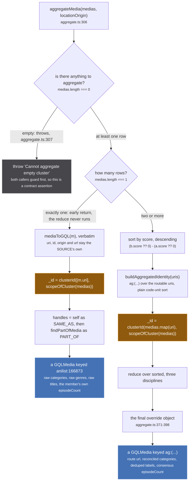
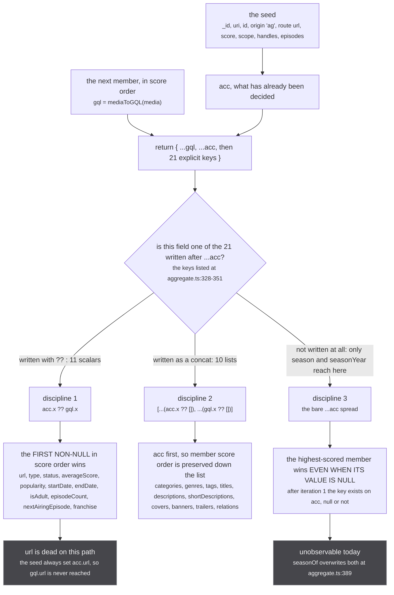
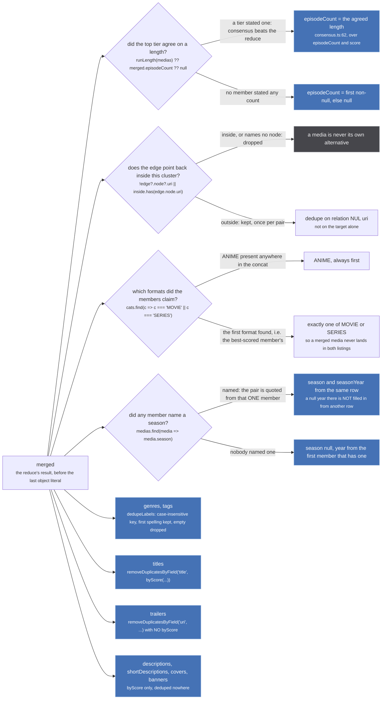
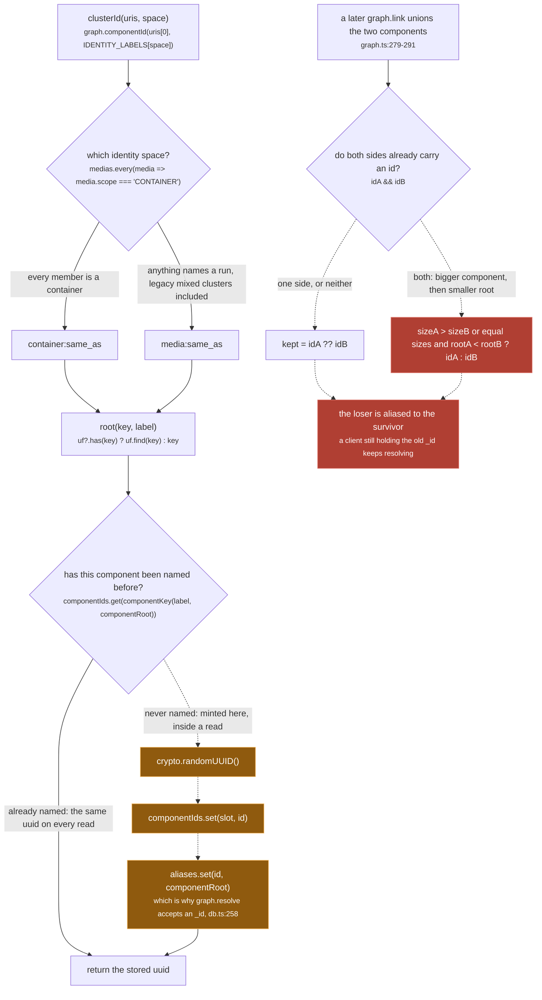

`aggregateMedia` is where several catalogues' rows about one work become the single object the page
renders. It takes `Media[]`, the cluster [`findMediaForPage` resolved](/read/finding-a-cluster/), and
returns one `GQLMedia`. It is `src/worker/store/aggregate.ts:306-399`, and it has exactly two
callers: `Subscription.media` at `src/worker/resolvers/media/index.ts:73`, and the per-cluster map
inside `Subscription.mediaPage` at `index.ts:131`.

Everything on this page is a **view**. Nothing `aggregateMedia` decides is written back: the rows keep
their own titles, their own counts and their own scope, and the whole merge runs again from scratch
on the next `media:changed`. The one exception is the `_id`, and it gets [its own
figure](#clusterid-is-a-write) at the bottom.

## Two shapes, not one

The first thing to know is that `aggregateMedia` returns two structurally different objects and the
branch is on cluster size, not on anything about the content:

*A single-member cluster keeps its source uri and skips every dedupe, every reconcile and the whole consensus step, because there is nothing to reconcile it against.*

The difference is not cosmetic. A card drawn from a one-member cluster and a card drawn from a
four-member one differ row by row, and a diagram that draws them as one box is wrong:

| field | one member (`aggregate.ts:308-317`) | two or more (`:319-398`) |
| --- | --- | --- |
| `uri` | the member's own, `kitsu:45950` | `ag:(cr:G24H1N3MP-GS00374452,kitsu:45950)` |
| `id` | the member's own, `45950` | `(cr:G24H1N3MP-GS00374452,kitsu:45950)` |
| `origin` | the member's, `kitsu` | the literal `'ag'` |
| `url` | the SOURCE's own url, which may be null | `${locationOrigin}/media/ag:(...)`, always set |
| `score` | the member's own | `Math.max(...medias.map(m => m.score ?? 0))` |
| `episodeCount` | the member's own, uncorroborated | `runLength(medias) ?? merged.episodeCount ?? null` |
| `categories` | raw, so `['ANIME','MOVIE','SERIES']` can all survive | `reconcileCategories`: ANIME plus exactly one format |
| `genres` / `tags` | raw, duplicates and all | `dedupeLabels`, case-insensitive |
| `titles` | raw, in the row's own order | `removeDuplicatesByField('title', byScore(...))` |
| `descriptions` / `covers` / `banners` | raw | `byScore`, sorted and never deduped |
| `trailers` | raw | `removeDuplicatesByField('uri', ...)` |
| `relations` | `relationToGQL` only, so a self edge survives | `mergeRelations`, self edges dropped |
| `season` / `seasonYear` | the member's own pair | `seasonOf(sorted)` |
| `handles` | self as SAME_AS, plus `findPartOfMedia` | every member as SAME_AS, plus `findPartOfMedia` |

Both shapes get a stable uuid `_id`, so urql normalises either one as a row. What the single-member
shape does not get is an aggregated `uri`, which is why the route to it is `/media/kitsu:45950` and
why the UI widens that back to `ag:(kitsu:45950)` with `asAggregatedUri` before navigating: only an
aggregated uri makes the [fan-out](/request/fan-out/) ask anybody new.

The `handles` list is built here rather than by the caller, and the seed comment says why:

`src/worker/store/aggregate.ts:361-363`

> The cluster IS the SAME_AS set, by construction: `graph.cluster` over MEDIA_SAME_AS is what
> produced `medias`. The PART_OF rows are read here rather than by the caller, so that no caller
> can forget them: a missing link renders as a dead grey icon, which looks like ordinary absence.

## The reduce's three disciplines

For a cluster of two or more, `sorted` is the members by score descending, and the reduce walks them
best first. Every field is decided by one of exactly three rules, and which rule a field gets is
decided by where its name appears in the returned object literal at `aggregate.ts:325-352`:

*Discipline 3 is drawn because it is a trap, not because it is a behaviour: the only two fields riding it are overwritten forty lines later, so it currently decides nothing.*

Discipline 1 is a "first non-null in score order" pick, and for a **spelling** that is exactly right.
The comment on `franchise` at `aggregate.ts:348-350` is the clearest statement of why a scalar is
taken whole rather than merged:

> The FIRST source to supply one wins outright, in score order, rather than being merged with
> another's. A graph is one source's whole account of a series and two of them spliced together
> would carry edges between nodes only one of them has.

Discipline 2 does no deduping and no sorting at all inside the reduce. It only guarantees an
**order**: because `acc` is spread first, a cluster of mal (`SCORE = 0.9`,
`src/sources/jikan/extractor.ts:26`), crunchyroll (`0.5`, `crunchyroll/extractor.ts:12`) and kitsu
(`0.3`, `kitsu/extractor.ts:12`) produces a `titles` array with mal's spellings first and kitsu's
last. Every dedupe on the page below depends on that order and on nothing else.

Discipline 3 is the one to watch when a field is added. Adding a scalar to the schema and forgetting
to name it in that literal does not give it a sensible default: it gives it "whatever the top-scored
member said, including null", forever, because after the first iteration the key is present on `acc`
whatever its value.

Two ordering details that look like the same rule and are not. The cluster sort at `aggregate.ts:319`
is `(b.score ?? 0) - (a.score ?? 0)`, so an unscored row ties with a `score: 0` one. `byScore` at
`aggregate.ts:18-20` is `(b.score ?? -1) - (a.score ?? -1)`, so an unscored **item** sorts strictly
after a zero-scored one. Both are deliberate and they are different sentinels.

## The final override pass

The reduce's result is `merged`, and it is not what comes back. `aggregate.ts:371-398` replaces
thirteen of its fields, and this is where consensus, reconciliation and deduping actually happen:

*Four of these lists are sorted and never deduped, so a cluster of six sources shows six covers and six descriptions on purpose: the reader picks, and only the exact-duplicate axes are cut.*

### `episodeCount` is the one number that does not use the reduce

`runLength` (`src/worker/store/consensus.ts:62`) runs `tieredConsensus` over every member's
`episodeCount` and `score`, and the override carries its own justification:

`src/worker/store/aggregate.ts:373-385`

> The length the BEST sources give, with agreement breaking ties among equals. Everything else in
> that reduce is a first-non-null-in-score-order pick, which is right for a spelling and not
> enough for a number.
>
> It cannot answer worse than the reduce would: the tier it reads is the same top score the sort
> puts first, so the two differ only when that tier disagrees with ITSELF, where the reduce takes
> whichever row arrived first. Cluster order is union-find component order, which is HTTP arrival
> order, so that case is not merely arbitrary, it is non-deterministic between loads.
>
> Measured over the 100 cluster snapshot in dist-seed on 2026-09-09: identical in 100 of 100,
> because `mal` is the only member of the 0.9 tier until anizip's media row carries a score.

Note the fallback chain is three deep. `runLength` returns `undefined` when no member states a count
at all, and only then does `merged.episodeCount` (the reduce's first-non-null) get a turn, and only
then `null`. The full argument for a tiered vote instead of a sum is in
[consensus, not a sum](/merge/consensus/).

### The self edge is cut here, not in the UI

`src/worker/store/aggregate.ts:244-247`

> SELF EDGES ARE DROPPED, and that is the part worth keeping. A source can name a related work whose
> row has merged into THIS cluster, and rendering it would show a media as its own alternative, with
> a card that navigates back to the page it is on. It is the one way this axis can produce something
> visibly wrong, so it is cut here rather than in the UI where only one reader would benefit.

The `inside` set is `medias.map(media => media.uri)`, the cluster **members only**
(`aggregate.ts:250`). It is not the `findPartOfMedia` expansion, so a relation pointing at a
container this run hangs off is kept and drawn.

### `season` and `seasonYear` are a quotation, never a composite

`src/worker/store/aggregate.ts:33-46`

> The broadcast season a cluster aired in, taken from ONE member.
>
> Every other scalar here is won field by field, and this pair cannot be: `SUMMER` and `2026` only
> mean anything together. Merged separately, a cluster whose members disagree can end up carrying a
> season no source ever claimed, and `store/filter.ts` matches on both, so the media would answer a
> season page that nothing put it in. Taking the year from whoever named the season keeps the pair a
> quotation rather than a composite.
>
> A cluster nobody gave a season to still gets a year, because a year alone cannot be mixed with
> anything: jikan publishes one for a film that has no season at all.
>
> `medias` must be sorted by score, descending, which is what `sorted` above is.

The sharp edge that follows from it, and it is deliberate: if the best-scored member that names a
season carries `seasonYear: null`, the result is `{ season: 'SUMMER', seasonYear: null }`. The
`medias.find(media => media.seasonYear !== null)` fallback at `aggregate.ts:51` only runs when
**nobody** named a season. A half-quotation beats a composite.

One thing worth knowing when reading this file: the doc block at `aggregate.ts:22-32` describes
`dedupeLabels` and sits immediately above the doc block for `seasonOf`, with `dedupeLabels` itself
defined uncommented at `:55`. The text belongs to the function forty lines further down.

### Which spelling survives

`src/worker/store/aggregate.ts:22-32`

> Genre and tag labels from every member of a cluster, in arrival order, one spelling each.
>
> The reduce feeds this the highest-scored source's labels first, so the spelling KEPT is that
> source's: AniList's "Sci-Fi" survives and a lower-scored "sci-fi" folds into it. Case-insensitive
> because the catalogues genuinely disagree on case and a user filtering for one would otherwise see
> the same genre listed twice.
>
> `removeDuplicatesByField` cannot do this: it keys on a property of an object, and these are bare
> strings.

`removeDuplicatesByField` (`aggregate.ts:67-77`) keeps the **first** occurrence. Applied to `titles`
it is handed `byScore(merged.titles)` first, so "first" means "highest scored". Applied to `trailers`
it is handed `merged.trailers` raw, so "first" means "highest-scored member", which is the same
answer by a different route: the concat already put that member's entries at the front.

:::caution[The inventory says otherwise, and the code wins]
The page inventory describes the override pass as "`removeDuplicatesByField` after `byScore` for
titles and trailers". Only `titles` is sorted before its dedupe. `aggregate.ts:397` reads
`trailers: removeDuplicatesByField('uri', merged.trailers ?? [])`, with no `byScore` call. The
outcome happens to agree because discipline 2 already ordered the concat by member score, but a
per-item `score` on a trailer is ignored where the same field on a title is not.
:::

## `clusterId` is a write

Every other line on this page is a pure function of the rows. `_id` is not. It calls
`graph.componentId`, which mints a uuid the first time a component is asked for one and remembers it:

*Every dashed arrow here crosses the read/write line, which is what dashed means on this site: `aggregateMedia` is called from a read path and this branch mutates two maps inside the graph.*

:::danger[A minted `_id` cannot be un-minted, and a union destroys one of two]
`graph.componentId` (`src/worker/store/graph.ts:234-244`) writes into `componentIds` and `aliases`
and there is no call anywhere that removes an entry from either, other than `graph.clear`. Worse,
`carryComponentId` (`graph.ts:249-263`) **deletes both slots** and keeps one uuid when two components
are unioned, and `graph.link` is a union-find with no inverse: nothing can put the two components
back, so nothing can restore the discarded id to a component of its own. The loser stays reachable
only as an alias pointing at the survivor.
:::

Why the id is keyed on the root and not on a member:

`src/worker/store/aggregate.ts:290-292`

> Keyed on the union-find ROOT of the cluster's identity space, never on a member: the smallest uri
> moved whenever a member sorting before it landed, and the container cut in `findAllAggregatedMedia`
> handed the same cluster a second id. Any member maps to the same root.

That is why `clusterId(medias.map(m => m.uri), ...)` passing `uris[0]` is safe even though `medias`
arrives in union-find component order, which is HTTP arrival order. Any member resolves to the same
root, so the array's order cannot reach the answer.

And why the surviving id is chosen by size rather than by whichever root the union-find happened to
pick:

`src/worker/store/graph.ts:246-248`

> Which id survives a union is decided here by SIZE and then by the smaller root, never by the
> union-find's own choice of root: that one follows rank and argument order, so an id that followed
> it would change with the order two sources happen to land in.

`IDENTITY_LABELS` is exported from `src/worker/store/db.ts:53` for exactly this one reader:
`{ RUN: 'media:same_as', CONTAINER: 'container:same_as', EPISODE: 'episode:same_as' }`.
`scopeOfCluster` (`aggregate.ts:264-265`) picks between the first two, and its comment at
`aggregate.ts:263` is one line:

> a cluster is a container only when nothing in it names a run: a legacy mixed cluster is a run

## What this function does not do

- **It does not fetch episodes.** The seed sets `episodes: []` (`aggregate.ts:368`) and the
  single-member path inherits `episodes: []` from `mediaToGQL` (`:183`). Episodes arrive only if the
  caller selected them, through the `Media.episodes` field resolver, which is
  [a separate and much more dangerous read](/read/episodes/).
- **It does not walk handles.** `findPartOfMedia` returns the direct PART_OF targets of the cluster,
  each expanded to its own SAME_AS component, and never walks those nodes' own handles.
  [Finding the cluster](/read/finding-a-cluster/) has that figure.
- **It does not filter.** `applyMediaFilters` runs on the aggregated rows afterwards, in
  `mediaPage` only, and the ordering constraint between the two is on
  [filters and search](/read/filters-and-search/).
- **It does not decide scope.** `scopeOfCluster` reads what the rows already say. The scope was
  ratcheted at write time, in [scopes and relations](/write/scopes-and-relations/).
