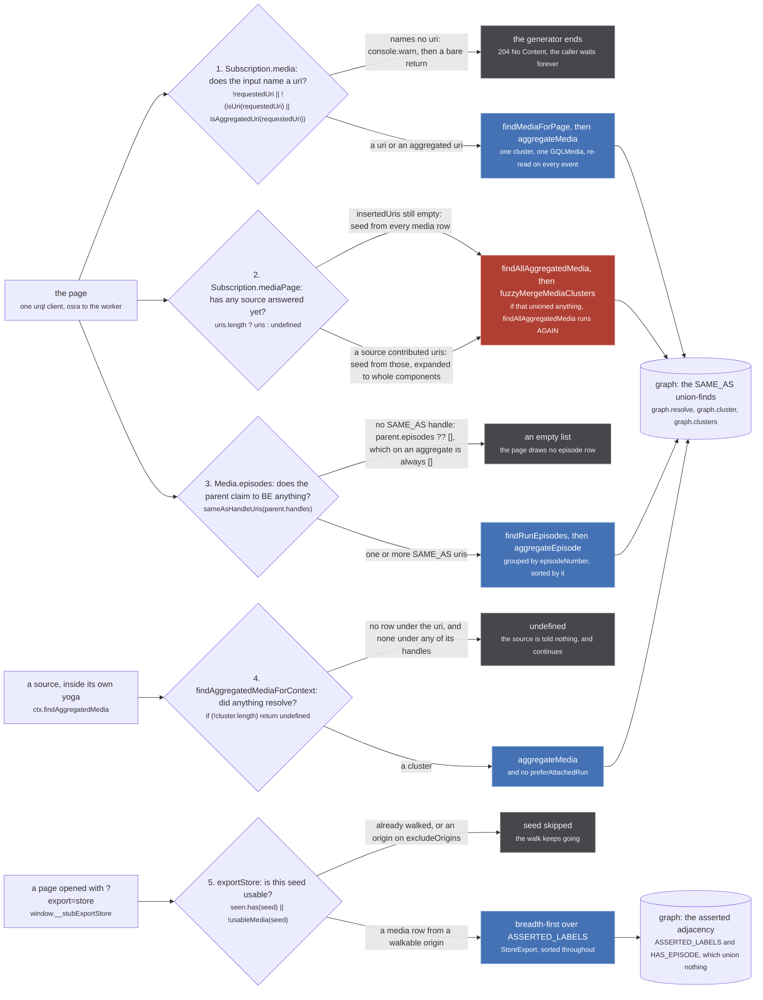
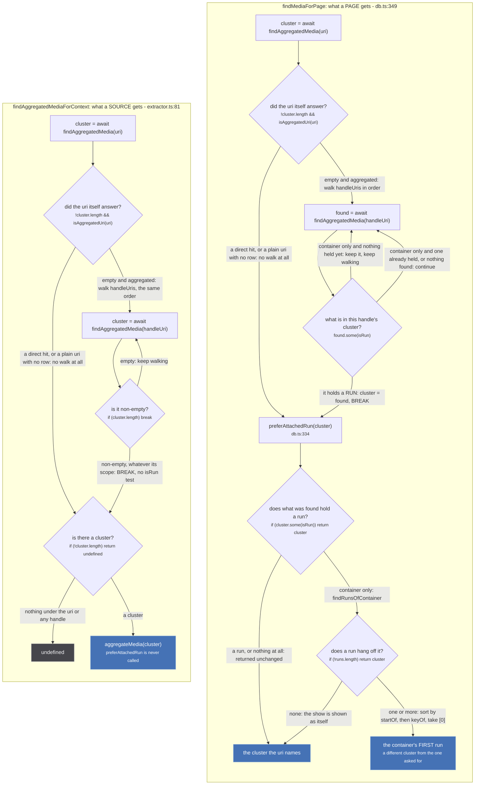
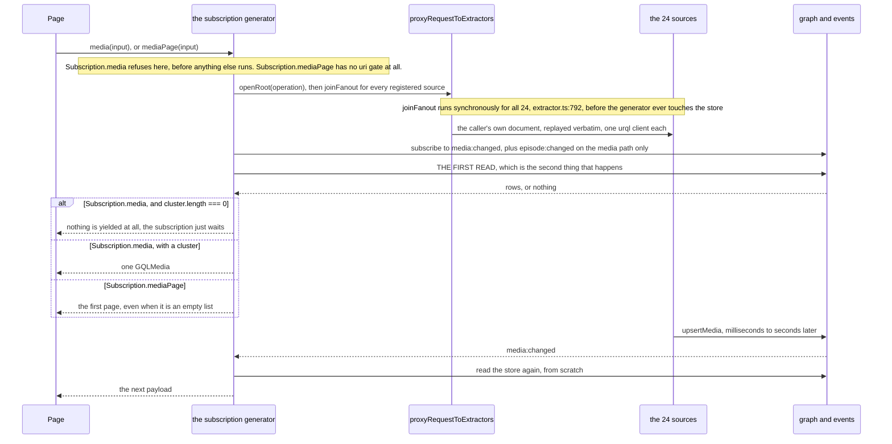

Nothing in stub returns an answer to whoever asked for it. A source writes rows, the store emits an
event, and a subscription that was already open reads the store again. So the interesting question is
not "what does a read return" but **which read**, because there are five of them, they share almost
no code, and two of them differ by one line that changes which show a page draws.

| # | entry | file:line | in | out | first refusal |
| --- | --- | --- | --- | --- | --- |
| 1 | `Subscription.media` | `src/worker/resolvers/media/index.ts:30` | one uri | a stream of one `GQLMedia` | bare `return`, so 204 and no payload |
| 2 | `Subscription.mediaPage` | `index.ts:94` | filters, search, sorts | a stream of `Media[]` | none, it always yields |
| 3 | `Media.episodes` | `index.ts:180` | a resolved `Media` | `Episode[]` | `parent.episodes ?? []` |
| 4 | `findAggregatedMediaForContext` | `src/worker/extractor.ts:81` | one uri, from a **source** | one `Media` or `undefined` | `undefined` |
| 5 | `exportStore` | `src/worker/store/export.ts:31` | exclusion lists | a whole `StoreExport` | a seed is skipped, never the walk |

Reads 1, 2, 3 and 5 answer something outside the worker. Read 4 answers a **source**: it is handed to
every extractor as `ctx.findAggregatedMedia` at `extractor.ts:535`, which is how a source asks the
store what the rest of the fan-out has learned so far, mid fan-out.

## The five



*Four of the five read the union-find. `exportStore` is the one that does not, and that is its whole point.*

Read the two store cylinders as the real split. `graph.cluster` answers "what is this the same as",
and it cannot tell you which of those unions a source actually asserted and which the fuzzy pass
made, because both carry the same label. `exportStore` needs exactly that distinction, so it walks
`ASSERTED_LABELS` with its own queue (`export.ts:50-59`) and never touches a union-find at all.

### 1. `Subscription.media` refuses before it does anything else

`index.ts:33-38`:

```ts
const requestedUri = decodeRouteUri(args.input.uri ?? undefined)
if (!requestedUri || !(isUri(requestedUri) || isAggregatedUri(requestedUri))) {
  // a refused page and a slow one are indistinguishable from outside the worker without this
  console.warn(`media: refused '${args.input.uri}', which names no uri`)
  return
}
```

A bare `return` from an async generator is not an error and not a null: yoga answers 204 No Content
and the page's urql subscription sits there with nothing to render. The `console.warn` is the only
trace, and the comment above it says why it is not optional.

One input never reaches that gate. `isUri` throws rather than returning false when an id carries a
comma (`src/utils/uri.ts:77`), and `decodeRouteUri` calls `isUri(raw)` at `uri.ts:163`, **outside** its
own try/catch, which wraps only the `decodeURIComponent` on the next line. So `foo:a,b` throws out of
line 33 and surfaces as a GraphQL error, not as the refusal one line below it.

### 2. `Subscription.mediaPage` has no gate, and reads the whole store when it has no seeds

The seed decision on the figure is the most surprising branch in the read path, and it is commented
at length because it looks like a bug. `index.ts:112-125`:

> THE WHOLE-STORE FALLBACK IS LOAD BEARING, and it does not look it.
>
> `insertedUris` is empty until a source answers, so this is the first yield's only content.
> Refusing it and answering [] instead is the obvious way to keep a filtered page from
> opening on the previous page's results, and it BREAKS the page outright: this generator
> only re-runs on `media:changed`, and a second subscription over a warm store changes
> nothing, because `graph.set` is idempotent (tests/unit/worker/store/edge-idempotence.test.ts).
> So no event ever fires and the page stays empty. Measured 2026-09-06 on the search page:
> picking a format on a loaded season sat at 0 cards for 60 seconds, where the same url
> opened cold answered 24.
>
> What keeps the fallback honest is `applyMediaFilters` below, which runs on it like any
> other page: a stale row from an earlier query only survives if it genuinely matches the
> season, format, genres and tags now being asked for.

The condition is one ternary, `index.ts:126`: `findAllAggregatedMedia(uris.length ? uris : undefined)`.
Passing `undefined` makes `findAllAggregatedMedia` seed from `labeled('media')`, every media row in
the store; passing a list seeds from those uris **expanded to their whole components**, so a page
filtered to twenty inserted uris can come back with clusters of sixty members.

### 3. `Media.episodes` reads SAME_AS handles and nothing else

`index.ts:181-182`:

> SAME_AS ONLY. See `sameAsHandleUris`, which carries the reasoning and the test: this module
> cannot be imported under vitest, so the rule lives where it can be pinned.

The rule itself is at `src/worker/store/aggregate.ts:103-104`, two lines, and the docblock above it
(`aggregate.ts:90-102`) is the one to read:

> WHY IT IS THE MOST DANGEROUS READ. `findAggregatedEpisodesForMedia` walks HAS_EPISODE for every uri
> handed to it and `Media.episodes` groups the union by `episodeNumber` ALONE. A PART_OF node is a
> SHOW, and `unogs/extractor.ts` hangs every season's episodes, each renumbered 1..n, off exactly that
> kind of uri. Passing one in puts every run's episodes into this run's list and the row count becomes
> the longest season: the 24-rows-on-a-14-episode-season defect, arriving by a new road.

Its refusal, `if (!handleUris.length) return parent.episodes ?? []` at `index.ts:184`, always returns
an empty array in practice: both `aggregateMedia` shapes seed `episodes: []`
(`aggregate.ts:183`, `:229`, `:368`), so `parent.episodes` is never populated on anything this
resolver is handed.

### 5. `exportStore` exists only on a page that asked for it

`src/store-export.ts:1-6`:

> The store export reaches a page ONLY through `?export=store`, and only as a window function: the
> schema has no field that answers "every cluster in the store" (`Subscription.mediaPage` fuzzy
> merges, hides attached containers, filters and sorts before a caller sees anything), and a query
> field would be permanent product surface plus a second copy of the store in graphcache. A flagged
> window function exists only on a page that asked for it, and its ABSENCE is what tells the exporter
> the flag never reached the app, which otherwise looks exactly like a store holding nothing.

That parenthesis is the argument for this whole page. `Subscription.mediaPage` is not "read the
store": between the read and the yield it runs `fuzzyMergeMediaClusters` and re-reads,
`hideAttachedContainers`, `aggregateMedia` per cluster, `applyMediaFilters`, a search relevance filter
at `SEARCH_RELEVANCE_THRESHOLD = 0.7` (`index.ts:21`), and a sort loop. An exporter built on it would
be exporting the page, not the store. `export.ts:12-18` states the contract from the other side:

> Every run-space cluster the store holds, built from ASSERTED sameness only.
>
> Promises: it reads, and never writes. It walks only pairs a source claimed through a handle
> (`ASSERTED_LABELS` in ./db.ts), never a union the fuzzy pass made. It emits nothing whose published
> members are all CONTAINER: a show with no run is not a run. Output is sorted throughout, so two
> calls against one store are byte-identical.

## Two reads that look like the same function

`findMediaForPage` (`src/worker/store/db.ts:349`) and `findAggregatedMediaForContext`
(`src/worker/extractor.ts:81`) open identically: read the uri, and if that answered nothing and the
uri is aggregated, walk its handles. Then they diverge twice, and both divergences change the answer.



*A source that asks the store gets the container it asked for. A page gets that container's first run.*

The two differences, in the order they bite:

**The handle walk has a preference on the page side and none on the source side.** `db.ts:353-361`
keeps looking after a container-only cluster and only stops on `found.some(isRun)`; `extractor.ts:84-88`
breaks on the first non-empty cluster, whatever it holds. The order it walks is the order
`fromAggregatedUri` sorted the handles into, which is origin-major: `src/utils/uri.ts:219-220` sorts by
id and then re-sorts by origin, and `Array.prototype.sort` is stable, so origin decides and id breaks
ties. The doc for the page side, `db.ts:341-347`:

> The cluster a media page shows for the uri it was asked for.
>
> The uri itself first (an alias resolves there too), then, for an aggregated uri, its handles one by
> one: a bookmark carries ids that may have clustered differently since. A handle naming a RUN wins
> over one naming a show whichever comes first in the uri, because a uri that mixes the two came off
> a run's page. What is found is then shown as `preferAttachedRun` says.

**Only the page side then calls `preferAttachedRun`**, and that is the one read in the tree that can
answer with a cluster the caller did not name. `db.ts:325-333`:

> The cluster a page shows for the one a uri resolved to.
>
> A run is shown as it is. A show whose runs are in the store is shown as its FIRST run, by start
> date and then by uri: that is the page the weld used to produce, season 1's episodes and offers
> under the show's ids, and a show page with no episode and no offer is what splitting the spaces
> cost until this. The run's PART_OF handles still carry every id of the show. A show with no run
> attached is shown as itself, which is today's card for a live-action catalogue.

A worked case, pinned at `tests/unit/worker/store/container-page.test.ts:46-56`. The show is
`ag:(imdb:tt0903747,trakt:breaking-bad,tvmaze:169)`, three CONTAINER rows in the container space
(`imdb` is forced there by `SHOW_LEVEL_ORIGINS`, the one-entry set at `db.ts:42`). Ask
`findMediaForPage` for it before any run has landed and you get the show back, all three ids. Then
JustWatch resolves season 1 on the media path, storing `jw:222-230` and `nf:70143836-1` as RUN rows
attached to the show by edges. Ask again, with the same show uri, and the answer is
`['jw:222-230', 'nf:70143836-1']`: a cluster that shares not one id with the question, carrying the
season's episodes and its Netflix offer. The show's ids are not lost, they come back on the
aggregate's PART_OF handles through `findPartOfMedia(page)`. With both seasons attached
(`container-page.test.ts:67-73`) the earliest by `startDate` wins, 2008-01-20 over 2009-03-08,
whichever order they landed in.

Ask the same uri through `ctx.findAggregatedMedia` from inside a source and you get the three
containers, because that path never calls `preferAttachedRun`. That is the right answer for a source
about to mint a season-scoped id, and the wrong one for a page.

`startOf` (`db.ts:318-323`) maps an absent or unparseable `startDate` to `Infinity`, so an undated run
sorts last, and ties break on `keyOf`, the lexicographically smallest member uri. Two calls against
one store therefore pick the same run.

## The fan-out starts before the first read

Both subscriptions do the same three things in the same order, and the order is the part people get
wrong when they draw this system: the sources are asked **first**, the store is read **second**, and
the answer to the read has nothing to do with the answers still in flight.



*The sources never answer the caller. They write, the store emits, and the read that was already open runs again.*

The exact call sites: `proxyRequestToExtractors` at `index.ts:39` and `index.ts:97`, the event
iterator at `index.ts:40` and `index.ts:108`, the first read at `index.ts:81` and `index.ts:166`. The
fan-out is not awaited anywhere, because `proxyRequestToExtractors` is synchronous: it opens the root
context and calls `joinFanout` for every entry in `extractors` in a plain `for` loop
(`src/worker/extractor.ts:782-792`), and each of those calls `subscribe` and returns.

Two asymmetries between the two subscriptions are worth keeping:

- **Which events wake them.** The media path listens to `['media:changed', 'episode:changed']`
  (`index.ts:40`); the page path listens to `['media:changed']` alone, debounced 100 ms
  (`index.ts:108`). An episode landing redraws a media page and does not redraw a listing.
- **Whether a read that found nothing yields.** `Subscription.media` returns `undefined` from `read()`
  when the cluster is empty (`index.ts:72`) and the caller's `if (first) yield first` skips it, so an
  unknown uri produces a stream with zero payloads until something lands.
  `Subscription.mediaPage` yields whatever `getPage()` produced, including `[]`.

## Four of the five write

The read/write line is not where the function names put it.

:::caution[A read mints an id, and the alias it writes is permanent]
`aggregateMedia` and `aggregateEpisode` both call `clusterId` (`aggregate.ts:293-294`), which is
`graph.componentId`. On a component that has never been aggregated before, that mints a
`crypto.randomUUID()` and writes it into the alias table (`src/worker/store/graph.ts:234-244`). The
uuid is stable for the life of that component and is what `Media._id` is, so `graph.resolve` can turn
an `_id` a client is holding back into a cluster. Nothing removes an alias short of `clear()`.
So reads 1 to 4 all leave a mark; only `exportStore` does not.
:::

:::danger[`Subscription.mediaPage` performs an irreversible write in the middle of a read]
`index.ts:127-129`:

```ts
if (await fuzzyMergeMediaClusters(clusters)) {
  clusters = await findAllAggregatedMedia(uris.length ? uris : undefined)
}
```

`fuzzyMergeMediaClusters` unions clusters it judges to be the same work, through `graph.link`, which
is a union-find with **no inverse**. There is no unlink, no split and no undo: a wrong union is
permanent for the life of the store, and `db.ts:7-13` names the case where one welded Mushoku Tensei
season 1 to season 3 on the live site. Opening a listing is therefore not a neutral act, and this is
the reason `exportStore` walks the asserted adjacency instead: it can answer what a cluster would be
without a given origin, which a union-find cannot.
:::

## Two more store reads the count leaves out

The five above are the reads of the **graph**. There are two further store entry points, and they are
easy to miss because they read a different structure: `Subscription.origin`
(`src/worker/resolvers/origin/index.ts:16`) and `Subscription.originPage` (`origin/index.ts:45`), which
call `findOrigin` and `findOrigins` (`src/worker/store/db.ts:523` and `:527`). Those read `originMap`,
a plain `Map<string, Origin>` at `db.ts:83`, not the graph, not a union-find, and nothing on either
path can union anything. They are also the two subscriptions that build their own fan-out inline
(`origin/index.ts:21-26` and `:50-55`) rather than going through `proxyRequestToExtractors`, so they
carry no request-context stamp and contribute nothing to `insertedUris`.

They still obey the ordering above: the subscriptions are created before `findOrigin` runs
(`origin/index.ts:21` against `:28`). If you are counting reads of the identity graph, five is right.
If you are counting reads of the store, it is seven.
