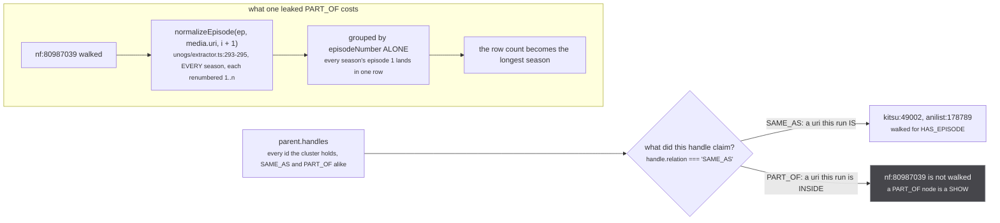
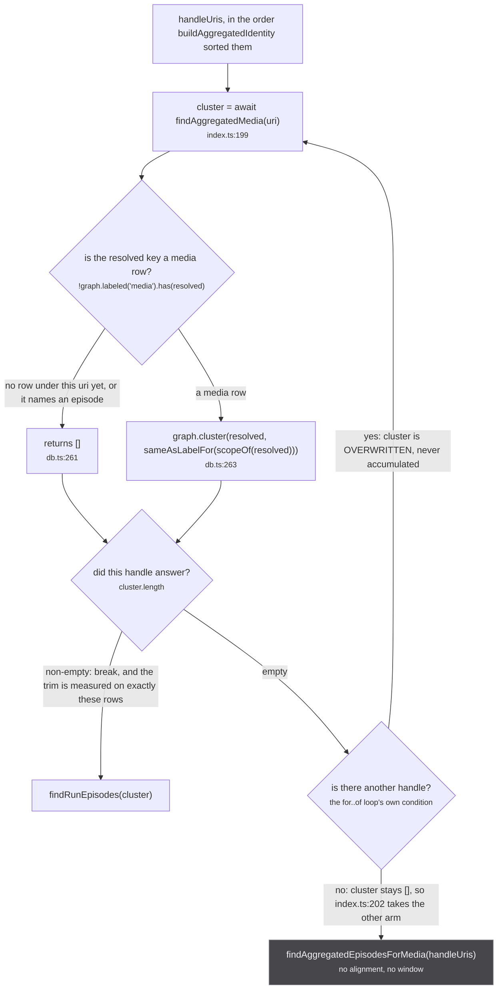
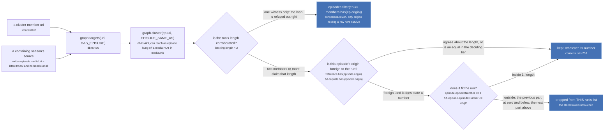
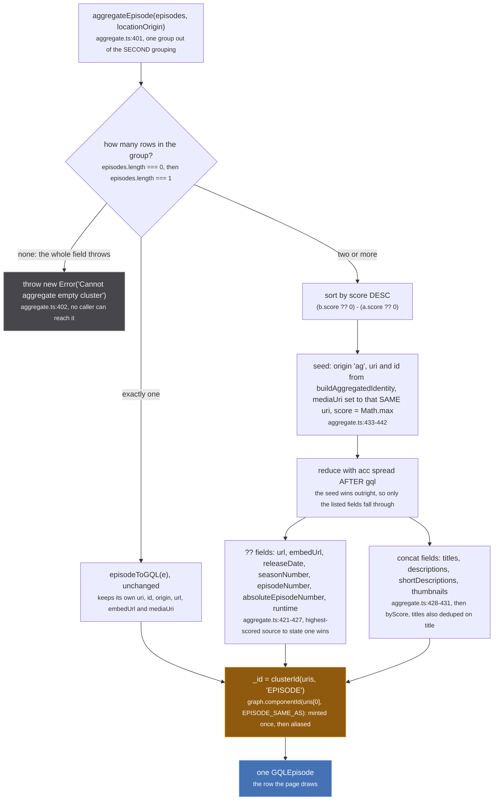

`Media.episodes` is nineteen lines at `src/worker/resolvers/media/index.ts:180-218`. It takes an
aggregated media, walks the store for every episode any of its rows published, and returns one row
per episode number. Nothing else on the page can produce a wrong watch link, and the store gives it
no help at all: [`upsertEpisodes`](/write/upsert-episodes/) writes episodes with no placeholder gate,
no scope, no wait for a row and no novelty test, so every discrimination that exists happens here, on
the way out.

The file that owns the first of those guards says so plainly.

`src/worker/store/aggregate.ts:90-102`

> The uris a media claims to BE, out of its handle edges.
>
> Exported and used by `Media.episodes` rather than filtered inline there, because that resolver
> cannot be imported under vitest (it reaches urql, which is CommonJS) and an untestable filter on the
> most dangerous read in the tree is not good enough.
>
> WHY IT IS THE MOST DANGEROUS READ. `findAggregatedEpisodesForMedia` walks HAS_EPISODE for every uri
> handed to it and `Media.episodes` groups the union by `episodeNumber` ALONE. A PART_OF node is a
> SHOW, and `unogs/extractor.ts` hangs every season's episodes, each renumbered 1..n, off exactly that
> kind of uri. Passing one in puts every run's episodes into this run's list and the row count becomes
> the longest season: the 24-rows-on-a-14-episode-season defect, arriving by a new road.

Four things keep it honest, and they are the four sections of this page: only SAME_AS handles are
walked, the cluster comes from the first handle that actually resolves, the numbering is aligned
before it is trusted, and a run refuses the tail of any longer packaging of itself.

## The whole pipeline

```mermaid
flowchart TD
  P["Media.episodes(parent)<br/><small>index.ts:180, parent is one aggregateMedia result</small>"] --> H["sameAsHandleUris(parent.handles)<br/><small>aggregate.ts:103, keeps handle.relation === 'SAME_AS'</small>"]
  H --> D1{"did any handle claim sameness?<br/><small>!handleUris.length</small>"}
  D1 -->|"no SAME_AS handle at all"| R1["return parent.episodes ?? []<br/><small>index.ts:184, and that is always []</small>"]
  D1 -->|"at least one uri this media claims to BE"| LOOP["for (uri of handleUris) cluster = findAggregatedMedia(uri)<br/><small>index.ts:198-201, stops on the first non-empty answer</small>"]
  LOOP --> D2{"did a handle resolve to a cluster?<br/><small>cluster.length</small>"}
  D2 -->|"a cluster: its rows carry the counts the trim needs"| FR["findRunEpisodes(cluster)<br/><small>db.ts:424</small>"]
  D2 -->|"no row has landed yet: the unwindowed walk"| FB["findAggregatedEpisodesForMedia(handleUris)<br/><small>index.ts:204, the raw handle uris</small>"]
  FR --> W1
  FB --> W1
  W1["graph.targets(mediaUri, HAS_EPISODE)<br/><small>db.ts:435-443, deduped on the episode uri, a target with no row is dropped</small>"] --> W2["graph.cluster(ep.uri, EPISODE_SAME_AS)<br/><small>db.ts:449, a singleton when nothing ever linked it</small>"]
  W2 --> MB["mergeByEpisodeNumber(groups)<br/><small>db.ts:454, keyed on the first positive whole number in the group</small>"]
  MB -->|"reached through findRunEpisodes"| AL["alignRunEpisodes(cluster, groups.flat())<br/><small>consensus.ts:256, a Map of renumbered COPIES</small>"]
  AL --> RE["runEpisodes per group, then drop the emptied ones<br/><small>db.ts:427-429</small>"]
  RE --> D3{"did anything come back?<br/><small>!episodeGroups.length</small>"}
  MB -->|"reached direct: no cluster, so no length and no trim"| D3
  D3 -->|"no group survived"| R2["return parent.episodes ?? []<br/><small>index.ts:205</small>"]
  D3 -->|"one group or more"| FLAT["episodeGroups.flat()<br/><small>index.ts:207</small>"]
  FLAT --> D4{"is this episode numbered?<br/><small>ep.episodeNumber != null</small>"}
  D4 -->|"unnumbered: a special, dropped before the page sees it"| R3["silently discarded<br/><small>index.ts:208</small>"]
  D4 -->|"numbered"| G2["regroup into a Map keyed by episodeNumber<br/><small>index.ts:209-213, the SECOND grouping</small>"]
  G2 --> AG["aggregateEpisode(group, location.origin)<br/><small>aggregate.ts:401</small>"]
  AG --> SORT["sort by (a.episodeNumber ?? 0) - (b.episodeNumber ?? 0)<br/><small>index.ts:217</small>"]
  classDef irrev fill:#b03f33,stroke:#e0796f,color:#ffffff
  classDef ratchet fill:#8f5a0e,stroke:#f2b45c,color:#ffffff
  classDef view fill:#4572b5,stroke:#8db0de,color:#ffffff
  classDef refuse fill:#46464b,stroke:#8b8c93,color:#f2f2f4
  class R1,R2,R3 refuse
  class AL,RE,AG view
```

*The three refusals all return `parent.episodes ?? []`, and for any aggregated media that expression is `[]`: both seeds in `aggregateMedia` set `episodes: []` (`aggregate.ts:183` and `:368`). So every refusal on this page is an empty episode list, never an error and never a null.*

Two facts are worth taking out of that figure before the sections that zoom into it.

**The grouping happens twice, and it has to.** `mergeByEpisodeNumber` runs at the bottom of
`findAggregatedEpisodesForMedia` (`db.ts:454`), before anything is aligned. `alignRunEpisodes` then
changes the numbers on the copies it returns. So the groups that come out of the walk are keyed on
numbers that may since have moved, and the resolver regroups the flattened result at
`index.ts:209-213` on the post-alignment number. That second pass is what actually merges Crunchyroll's
episode 13 into everyone else's episode 1.

**The fallback arm skips both guards.** When no handle resolves, `index.ts:204` calls
`findAggregatedEpisodesForMedia` directly, so the walk and `mergeByEpisodeNumber` still run but
`alignRunEpisodes` and `runEpisodes` never do. Nothing is windowed, and a lent season's whole list is
drawn. That is why the loop above is written the way it is, and the next-but-one section is about it.

## SAME_AS only, and what a leaked PART_OF costs

`sameAsHandleUris` (`aggregate.ts:103-104`) is one line: `(handles ?? []).filter(handle =>
handle.relation === 'SAME_AS').map(handle => handle.node.uri)`. It is a separate exported function
purely so it can be tested, because the resolver that uses it cannot be imported under vitest. The
test is `tests/unit/worker/store/part-of.test.ts:117-128`, and it uses the real ids from the incident:
`kitsu:49002` and `anilist:178789` are kept, `nf:80987039` is not.

*The subgraph is a counterfactual, not a path: nothing in the tree reaches it today. It is drawn because the failure is silent, and a page listing 24 rows looks exactly like a page listing 24 rows.*

The counterfactual is not hypothetical arithmetic. `assembleMedia` in
`src/sources/unogs/extractor.ts:290-296` builds `media.episodes` as
`filtered.flatMap(season => season.episodes.map((ep, i) => normalizeEpisode(ep, media.uri, i + 1)))`,
and when no season number was resolved, `filtered` is every season. Each of those episodes is stored
with `mediaUri` set to the show-level uri, `upsertEpisodes` writes one `HAS_EPISODE` edge per episode
off that uri (`db.ts:406`), and a walk that included the show uri would collect all of them.

## The first handle that RESOLVES

The cluster is not read from `parent.uri`, and it is not read from `handleUris[0]`. It is read from
whichever handle answers first. The comment at `index.ts:190-196` carries both halves of that
decision:

`src/worker/resolvers/media/index.ts:190-196`

> The cluster is read from the FIRST HANDLE, not from `parent.uri` through findMediaForPage:
> that one falls back through handles and prefers an attached run, so it can answer with a
> different set from the one whose episodes are being walked, and the counts deciding the trim
> have to come from exactly the rows that supplied the episodes.
> the FIRST handle that resolves, not the first handle. They all reach the same cluster, but a
> uri whose row has not landed yet resolves to nothing, and taking that as "no cluster" dropped
> the page onto the unwindowed walk, where a lent season's whole 24 episodes are drawn

*`cluster` is assigned inside the loop rather than into a temporary, so a later handle that resolves to nothing would clobber an earlier answer. It cannot, because the loop breaks the moment one is non-empty, and that is the only reason the shape is safe.*

Every handle in the list belongs to the same cluster by construction, so any of them that has a row
returns the same set. The whole point of the loop is timing: rows land through a DataLoader batch, and
a uri whose row is still in flight resolves to `[]` at `db.ts:261` without any error, which reads
identically to "this media has no cluster". Taking that at face value dropped the page onto the
fallback arm and drew a containing season's 24 rows against a 12 episode run.

## Where episodes come from that the walk never asked for

A run's page routinely lists episodes published by a source that holds no row in the run's cluster at
all. That is not a leak, it is the mechanism: a catalogue that models the run as part of a longer
season attaches its episodes to another source's media and claims nothing about identity.
`consensus.ts:198-208` is explicit that this is the normal case and that membership is the wrong thing
to key on:

`src/worker/store/consensus.ts:204-208`

> Everything else is windowed, which deliberately includes a source with no row in this cluster at
> all. That is how a season that CONTAINS this run arrives: it lends its episodes and claims no
> identity, so there is no member to read a count off, and the run's own length is the only thing
> that says which of them are its own. Keying this on cluster membership made it depend on whether
> that lend happened to be linked, which varies between loads.

*Nothing on this figure writes. `runEpisodes` filters a list that was built for this one read, and the row a source published stays exactly as it landed. The rule, its two witnesses, and the tier arithmetic behind `reference` and `equals` are on [Windowing a run](/merge/windowing/).*

Note which of the two roads into that filter is load bearing today. The obvious reading is that the
lend arrives through the `EPISODE_SAME_AS` expansion at `db.ts:449`, and that expansion genuinely can
reach an episode the `HAS_EPISODE` walk never asked for. It is not what happens: **no built-in source
mints an episode handle at all**. Nothing under
`src/sources/` passes `handles` to `makeEpisode`, and `episodeSameAs` and `EpisodeHandleInput`
(`src/sources/utils.ts:83-96`) are referenced nowhere else in `src/`. So `upsertEpisodes`' handle loop
(`db.ts:409-412`) never runs on a built-in path, `graph.link(..., EPISODE_SAME_AS)` is never called,
and `graph.cluster` falls through to its singleton branch at `graph.ts:325-327` for every episode. The
expansion is a pass-through, and the lend arrives entirely by the other road: `episode.mediaUri`
pointing at another source's media, turned into a `HAS_EPISODE` edge at `db.ts:406`. A plugin can
still supply episode handles, which `readPluginHandles` reads at depth 1
(`src/worker/plugin-sources.ts:125-127`), so the expansion is dormant rather than dead.

`mergeByEpisodeNumber` exists because of exactly that gap, and its own doc block says so.

`src/worker/store/db.ts:457-474`

> Within ONE run, two episodes carrying the same number are the same episode.
>
> Episodes only ever merged through an explicit `EPISODE_SAME_AS`, which nothing mints between two
> metadata sources, so a run described by two of them came out as two full lists rather than one.
> Measured 2026-09-09 on Mushoku Tensei season 2 part 2: twelve kitsu episodes with no titles followed
> by the same twelve from anizip with every title and date, drawn as twenty four rows.
>
> SAFE ONLY BECAUSE THE INPUT IS ONE RUN. The caller passes the uris of a single media cluster, which
> is its SAME_AS set by construction, and a run numbers its episodes once. This is emphatically not a
> rule about episodes in general: two runs of a show both have an episode 1, which is why nothing may
> read episodes across a PART_OF and why this must never be handed a container's uris.
>
> Keyed on the number ALONE, not on the season too. Sources disagree about which season a run belongs
> to (anizip says 2 where kitsu says nothing), so including it would prevent exactly the merges this
> exists for. A number is only usable when it is a positive whole one: a special carries none, so
> specials stay separate rather than colliding with episode 1.

That last sentence is the precondition the first section is enforcing. `mergeByEpisodeNumber` is
correct only while its input is one run, and `sameAsHandleUris` is the only thing that guarantees it.

## The two numbers a row can be dropped for

The number filter at `index.ts:208` and the usability test inside `mergeByEpisodeNumber` at
`db.ts:480` disagree, deliberately, and both are worth reading as written.

| test | site | passes | fails |
| --- | --- | --- | --- |
| `numbers.find(value => typeof value === 'number' && Number.isInteger(value) && value > 0)` | `db.ts:480` | a positive whole number | `0`, `-1`, `12.5`, `null`, absent |
| `.filter(ep => ep.episodeNumber != null)` | `index.ts:208` | any number at all, including `0` and `12.5` | `null` and `undefined` only |

A group whose members carry no usable number is pushed through `mergeByEpisodeNumber` untouched
(`db.ts:481-483`), never merged with anything, which is what keeps two specials from colliding on
episode 1. It then meets the resolver's filter, which drops it outright if the number is `null` and
keeps it if the number is `0`. A zero-numbered episode therefore survives to the second grouping and
is drawn, sorted first.

This is also why one field on a synthetic movie episode is not free to be null:

`src/sources/utils.ts:105-107`

> episodeNumber must stay 1 rather than null: the media episodes resolver drops
> every episode with a null episodeNumber, and groups the rest by that number,
> which is what merges one movie's per-source episodes into a single row.

`makeMovieEpisode` (`src/sources/utils.ts:109-125`) sets `episodeNumber: 1` for that reason alone. A
film is one episode because the watch route only understands episode-keyed playback, and the one
number it carries is what lets five sources' versions of that film aggregate into one row here.

:::caution[This read renumbers nothing, on purpose]
`alignRunEpisodes` returns a `Map<string, T>` of copies (`consensus.ts:287`), and `findRunEpisodes`
substitutes them per group with `aligned.get(episode.uri) ?? episode` at `db.ts:428`. It never touches
the stored node, and the reason is a permanence one:

`src/worker/store/consensus.ts:247-250`

> READ TIME, AND A COPY. The stored node keeps Crunchyroll's own number, because it is keyed by
> Crunchyroll's guid and is reachable through the whole season from other paths: `graph.set` is
> last-write-wins, so rewriting it here would change what those other readers see. What the run needs
> is a VIEW, and a view is what this returns.

`graph.set` has no undo and no old copy: a write through it replaces what was there. An alignment
written back would be a permanent edit to a row that other pages read correctly.
:::

## `aggregateEpisode`

One group of rows in, one `GQLEpisode` out. It has the same two shapes as
[`aggregateMedia`](/read/aggregate-media/), and they are materially different objects.

*The throw is the one refusal on this page that is not an empty list. Both callers guard first, so it is a contract assertion rather than a live branch: the resolver only ever builds a group by pushing into it.*

Three details in that figure are easy to read past.

**`mediaUri` on a merged episode is the EPISODE's aggregated uri, not the media's.** `aggregate.ts:439`
is literally `mediaUri: uri`, where `uri` came from `buildAggregatedIdentity(episodes.map(e => e.uri))`
one line earlier at `:413`. A single-member episode keeps its own real `mediaUri`; a merged one does
not, so the two shapes disagree about what that field means.

**`url` on a merged episode points at the MEDIA route.** `aggregate.ts:438` builds
`getRoutePath(Route.MEDIA, { uri })` with the episode's aggregated uri, not `Route.MEDIA_EPISODE`.
The single-member shape passes the source's own episode url straight through.

**The `_id` is keyed on the first member alone.** `clusterId` reads `uris[0]!`
(`aggregate.ts:293-294`), and its comment justifies that with an invariant that does not hold here:

`src/worker/store/aggregate.ts:290-292`

> Keyed on the union-find ROOT of the cluster's identity space, never on a member: the smallest uri
> moved whenever a member sorting before it landed, and the container cut in `findAllAggregatedMedia`
> handed the same cluster a second id. Any member maps to the same root.

Every member of a *media* cluster does map to the same root, because the cluster is a union-find
component by construction. An episode group out of `index.ts:209-213` is not: it was assembled by
episode number, across sources that never linked to each other, so its members sit in as many
components as there are members. `graph.componentId` falls back to the key itself when the union-find
has never seen it (`graph.ts:229-232`), so the aggregate's `_id` is the first member's own id, and the
first member is whichever the walk happened to reach first.

:::danger[The union this read walks has no inverse]
`graph.cluster(ep.uri, EPISODE_SAME_AS)` at `db.ts:449` reads a union-find, and the union behind it is
written by `upsertEpisodes` at `db.ts:410` with no gate whatsoever in front of it. `graph.link` has no
inverse: two episodes joined that way are one episode for the life of the session, and only
`resetStore` separates them. Nothing on this page can undo such a join, and `mergeByEpisodeNumber`
extends it rather than checking it (`db.ts:485-486` pushes into the existing group).

The uuid minted by `clusterId` is a one-way door of the smaller kind: `graph.componentId` creates it
on first ask and writes it into the alias table (`graph.ts:234-242`), so the first read of an episode
group is what brings its `_id` into existence, and later reads get the same one back.
:::

## Where to go next

- [upsertEpisodes](/write/upsert-episodes/) is the write side, and the reason this read carries every
  guard in the pair.
- [Windowing a run](/merge/windowing/) and [Aligning a numbering](/merge/alignment/) own the rules
  `runEpisodes` and `alignRunEpisodes` apply.
- [Consensus, not a sum](/merge/consensus/) is where the `length` and `tier` used above come from.
- [Lending a season](/similar/lending/) is how a containing season's episodes end up attached to this
  run's rows in the first place.
