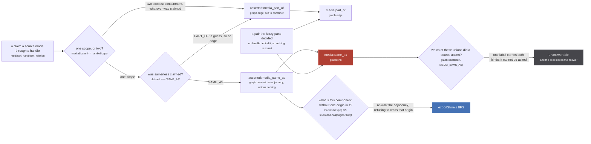
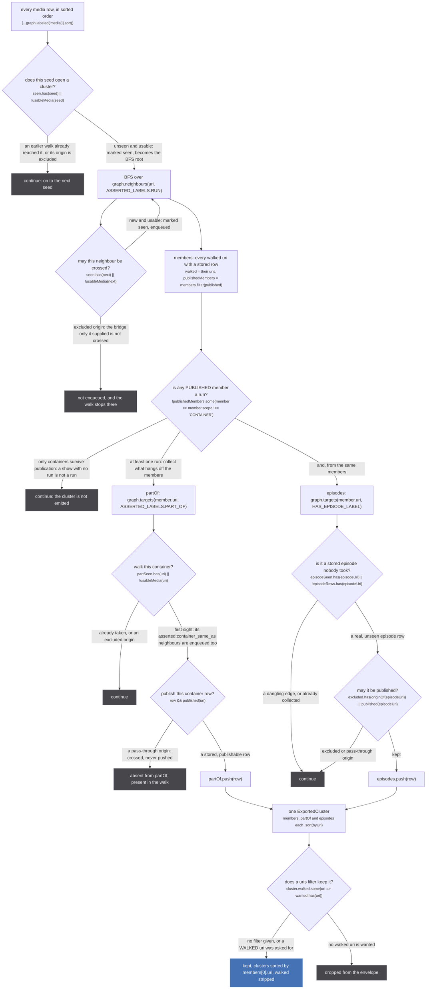
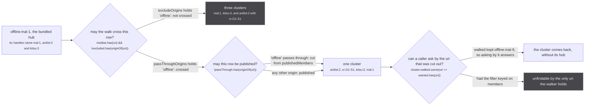

`exportStore` (`src/worker/store/export.ts:31`) is the fifth read, and it shares no code with the
other four. It never calls `graph.cluster`, never touches `media:same_as`, never aggregates anything,
and hands back the stored `Media` and `Episode` rows themselves rather than a computed `GQLMedia`.
It walks a second, redundant adjacency that `upsertMedia` maintains alongside the identity spaces,
and reconstructs the clusters from that.

That sounds like a worse version of the read the rest of the site describes. It is a different
question. Every other read asks "what does the store believe about this uri". This one asks "what did
a **source** claim, and what would the answer be with one origin taken out", and a union-find can
answer neither:

`src/worker/store/db.ts:56-64`

> A second, adjacency-only record of every pair a SOURCE claimed through a handle, written by
> `upsertMedia` and by nothing else. `./export.ts` is its only reader.
>
> Two properties the identity labels above cannot supply, and the export needs both. `graph.link`
> carries the same label whether the pair came from a handle or from `linkSameMediaPairs`, so a
> cluster cannot say which of its unions a source actually asserted; and a union-find cannot answer
> "what would this component be with that node removed", which is exactly what excluding a plugin or
> the offline origin asks. An adjacency answers both, and unions nothing, so nothing downstream of
> the store sees these labels at all.

The stakes are why it is worth a second data structure. The export becomes the offline source's
published seed, which every user downloads and which every source then reads back, so a wrong pair in
it is an identity claim shipped to everyone with no inverse.

## Why a shadow record exists

Every claim `upsertMedia` applies is written twice: once into the identity space, which is what the
page reads, and once into `ASSERTED_LABELS` (`db.ts:66-70`), which only the export reads. The routing
is the same 2x2 both times, at `db.ts:187-197`.



*The left half is one claim writing two records. The right half is the only question each record can answer, and they are different questions.*

The figure names the run-space labels. A claim between two CONTAINER rows takes the identical route
into `asserted:container_same_as` and `container:same_as` instead, chosen on the same line that
picks the identity space (`db.ts:192-193`).

Three consequences fall straight out of that figure.

**A fuzzy union is invisible to the export.** `linkSameMediaPairs` (`db.ts:216-224`),
`linkSameContainerPairs` (`db.ts:231-239`) and `linkPartOfPairs` (`db.ts:247-255`) write the identity
labels only. No handle backed those pairs, so there is nothing to assert. The test states it as a
control and its opposite in one place, `tests/unit/worker/store/export.test.ts:56-61`: after
`linkSameMediaPairs([['anilist:1', 'kitsu:2']])`, `findAggregatedMedia('anilist:1')` answers a
two-member cluster and `exportStore` answers `[['anilist:1'], ['kitsu:2']]`.

**The asserted write's return value is thrown away**, deliberately:

`src/worker/store/db.ts:173-176`

> Each applied claim is also recorded in ASSERTED_LABELS, and those writes' return values are
> DISCARDED: `changed` stays driven by the real labels alone. Feeding it an asserted write would put
> every listener back in the re-read loop tests/unit/worker/store/edge-idempotence.test.ts exists to
> stop, since the two records can go new at different times.

**Episodes have no asserted record at all.** `upsertEpisodes` (`db.ts:400-415`) writes
`episode:same_as`, `episode:part_of` and `has_episode` and nothing else, so an episode reaches the
export only along the `HAS_EPISODE` edge from a member that was already walked, never through an
episode union. That is the one label the export reads that was not written as an assertion, and it is
safe because the edge records which media a source hung the episode off, never that two episodes are
the same thing.

## The walk

`exportStore` takes `{ excludeOrigins, passThroughOrigins, uris }` and returns
`{ exportedAt, excludedOrigins, clusters }`. Two predicates decide everything, at `export.ts:36-37`:

```ts
const usableMedia = (uri: string) => medias.has(uri) && !excluded.has(originOf(uri))
const published = (uri: string) => !passThrough.has(originOf(uri))
```

`usableMedia` gates the **walk**, `published` gates the **output**, and the gap between them is the
whole subject of the next section.



*Seven refusals, none of them fatal: a seed is skipped, a cluster is dropped, a row is left out. Nothing here throws and nothing here writes.*

Reading it against the file:

| step | line | note |
| --- | --- | --- |
| seeds, sorted | `export.ts:44` | `[...medias].sort()` over the `'media'` label index, so seed order is lexicographic and does not depend on arrival order |
| the seed gate | `:45-46` | each media row belongs to at most one cluster: `seen` is added to at seed time and at enqueue time |
| the run BFS | `:50-59` | `graph.neighbours` reads the undirected adjacency `graph.connect` wrote (`graph.ts:265-277`) |
| `walked` against `members` | `:60-61` | see the comment below |
| the run refusal | `:62` | the only place a whole cluster is discarded |
| the container BFS | `:64-78` | nested inside the member loop, seeded from each asserted `PART_OF` target |
| the episode walk | `:80-90` | two skips, `:84` and `:85` |
| sorting | `:94-96`, `:106` | members, partOf, episodes by uri, then clusters by their first member |
| the `uris` filter | `:105` | matched on `walked`, and `walked` is stripped from the output at `:107` |

The two lists at `:60-61` look redundant and are not:

`src/worker/store/export.ts:40-41`

> `walked` is every member the traversal reached, `members` only the ones published: the first is
> what a `uris` filter matches on, so asking by a pass-through uri still answers

One subtlety in the refusal at `:62`. It tests each published member's scope rather than assuming the
run adjacency only holds runs, because a row in it can have become a container since:
`asserted:media_same_as` is written only when both ends read RUN at claim time (`db.ts:192`), and
scope is a ratchet toward CONTAINER afterwards (`db.ts:142-146`). The scope is read at export time, so
a cluster whose members all flipped is dropped even though every pair in it was asserted between two
runs.

Two smaller facts, both on the figure. The container BFS pushes neighbours
without a `partSeen` test at push time (`:75`) and tests at shift instead (`:71`), so the queue can
carry duplicates and still terminates. And a same-scope `PART_OF` claim writes
`asserted:media_part_of` between two RUN rows (`db.ts:195`), so `partOf` is not guaranteed to hold
only containers; it holds whatever a source pointed at without claiming to be.

## The two kinds of refusal

An origin can be refused twice over, and until 2026-09-05 both were spelled the same way. The
contract now separates them:

`src/worker/store/export.ts:20-26`

> TWO KINDS OF REFUSAL, and they were one until a measurement separated them (2026-09-05).
> `excludeOrigins` is for an origin whose word is not trusted, a plugin: it is not walked THROUGH, so
> a bridge only it supplied splits rather than surviving. `passThroughOrigins` is for one that is
> trusted to bridge but must not be published, the bundled offline row: it is walked through and then
> left out of the output. Spelling the second as the first cost a walk its identity, because that row
> is the hub carrying the handles that bridge mal, anilist and kitsu, which do not assert one another;
> cutting it left singletons, and asking for a run by its `offline:` uri answered nothing at all.

The worked example is the one the test builds, `tests/unit/worker/store/export.test.ts:130-151`: a
bundled row `offline:mal-1` whose handles name `mal:1`, `anilist:2` and `kitsu:3`, plus one live claim
from `anilist:2` to `cr:G1-S1`. The three catalogues assert nothing about each other. Everything
holding them together came from the hub.



*Same origin, same store, two answers: four members in one cluster, or three clusters of which two are singletons.*

The last decision in that figure comes from the sibling fixture, `export.test.ts:153-167`, whose hub is
`offline:mal-9`: an export asked for `uris: ['offline:mal-9']` answers the cluster `['anilist:9',
'mal:9']`, a cluster the requested uri is not in. That is not tidiness. The walker navigates by the
uris the seed knows, and for a run only the bundle described, the `offline:` uri is the only one it
holds.

What the difference cost when it was one setting, measured on the deployed site:

`tests/unit/worker/store/export.test.ts:120-129`

> Measured on the deployed site, 2026-09-05: `offline:mal-59193` exported as a five member cluster
> including offline, and as NOTHING with the offline origin excluded, on four runs out of four. The
> bundled offline row is the HUB that carries the SAME_AS handles bridging mal, anilist and kitsu;
> the three catalogues do not each assert one another, so cutting the hub leaves singletons and the
> walk shipped a median identity of 2 where the store held 4 or 5.
>
> Two different refusals were being spelled one way. A PLUGIN is untrusted, so its bridge must not
> create identity: do not walk through it. The bundled offline row is first-party and deterministic,
> and the seed it must not read back is already refused by `?seed=off`: walk through it, publish none
> of it.

:::caution
**A plugin is excluded, not passed through, and the caller does not get to choose.** `exportStore`
itself refuses nothing beyond its two lists (`export.ts:28-29`: "a caller that excludes no origin gets
the plugin rows too"). The exclusion is applied one layer up, in the osra resolver:

`src/worker/yoga.ts:52-53`

> the plugin origins are derived HERE rather than taken from the caller, so a caller cannot decline
> to exclude them: a plugin's rows are that user's, never the product's.

`yoga.ts:58-61` concatenates every `extractors` entry that carries a `pluginUri` onto whatever the
caller passed, so a plugin origin is always in `excludeOrigins` and is therefore never crossed. Its
rows stay in that user's store and its bridges never become anybody else's identity.
:::

## What the walk is for, and the loop it must not close

The export has exactly one door into it, and the door is a flag:

`src/store-export.ts:1-6`

> The store export reaches a page ONLY through `?export=store`, and only as a window function: the
> schema has no field that answers "every cluster in the store" (`Subscription.mediaPage` fuzzy
> merges, hides attached containers, filters and sorts before a caller sees anything), and a query
> field would be permanent product surface plus a second copy of the store in graphcache. A flagged
> window function exists only on a page that asked for it, and its ABSENCE is what tells the exporter
> the flag never reached the app, which otherwise looks exactly like a store holding nothing.

`readExportFlag` (`src/utils/export-flag.ts:11-17`) matches exactly `?export=store`, never mere
presence of the parameter, and never throws. The consumer is
`scripts/export-season-seed.mjs`, which drives the built app with
`const WALK_QUERY = '?export=store&seed=off'` (`:124`) and reads the hook at `:163-174`. Its absence
is a hard failure rather than an empty export, at `:335`:

> CONTROL FAILED: window.__stubExportStore never appeared, so the flag never reached the app. An
> export of nothing would look identical to a store of nothing.

:::danger
**Everything this walk publishes is identity, and identity has no inverse.** A cluster in the seed
becomes rows and handles in every user's store, and the next live source to read that cluster's
aggregated uri re-asserts sameness across the whole membership through `mergeHandles`. That reaches
`graph.link`, which is a union-find union with no split anywhere in the repo. This is why the second
half of the walk's query string exists:

`src/utils/export-flag.ts:42-45`

> A walk drives the app with `?seed=off` so it never reads its own previous output. Without that a
> seeded id is stored, joins the cluster's aggregated uri, and the next live source to read that uri
> re-asserts SAME_AS across the whole membership (`mergeHandles` in sources/utils.ts), so the next
> export publishes the id as though a source had checked it, permanently and with no inverse.

`refusesSeedAsset` (`export-flag.ts:50-51`) is enforced on the page rather than in the worker, because
the worker cannot see the page's url. So the two guards are stacked: the export refuses to walk a
union nobody asserted, and the walk refuses to read back what the last export published. Remove
either and seed N+1 ratifies seed N forever.
:::

## Determinism, and the one field that is not

The contract promises repeatability:

`src/worker/store/export.ts:13-18`

> Every run-space cluster the store holds, built from ASSERTED sameness only.
>
> Promises: it reads, and never writes. It walks only pairs a source claimed through a handle
> (`ASSERTED_LABELS` in ./db.ts), never a union the fuzzy pass made. It emits nothing whose published
> members are all CONTAINER: a show with no run is not a run. Output is sorted throughout, so two
> calls against one store are byte-identical.

Every part of that holds for `clusters`, and it is worth naming what makes it hold: seeds are sorted
(`:44`), each of the three lists inside a cluster is sorted by uri (`:94-96`), and the clusters
themselves are sorted by their first member (`:106`). Nothing in the walk consults arrival order, and
nothing in it writes, which makes it the only read on this site that is neither a view of a union nor
a write in disguise.

**Read the envelope literally, though, because `exportedAt` is `new Date().toISOString()`
(`export.ts:102`).** Two calls against one store are byte-identical in `clusters` and differ in that
one field, so a diff of whole payloads always reports a change. The walk script already treats it that
way: `signatureOf` (`scripts/export-season-seed.mjs:185-196`) builds its stability signature from
`snapshot.clusters` alone and never reads the envelope.

**One correction, and it is to a comment.** `scripts/export-season-seed.mjs:29-33` still
states rule 3 as "THE `offline` ORIGIN IS EXCLUDED FROM EVERY EXPORT". The call site disagrees, and
the call site is current: `exportFrom` at `:169-171` passes `{ excludeOrigins: [], passThroughOrigins:
['offline'] }`, which is the pass-through half of the split above, with the reason on the lines
immediately over it (`:166-168`). The header block was not updated when the two refusals were
separated on 2026-09-05.

## Where to go next

- the primitives this walk reads, and why `connect` exists next to `link`:
  [the graph](/write/graph/)
- the writer that keeps the adjacency, claim by claim: [upsertMedia](/write/upsert-media/)
- the four reads that do the opposite of this one, unions and all:
  [the five reads](/read/entry-points/)
- the pass whose unions this walk refuses to see: [the fuzzy merge](/merge/fuzzy-merge/)
- why a plugin origin is refused rather than trusted: [plugin sources](/request/plugins/)
