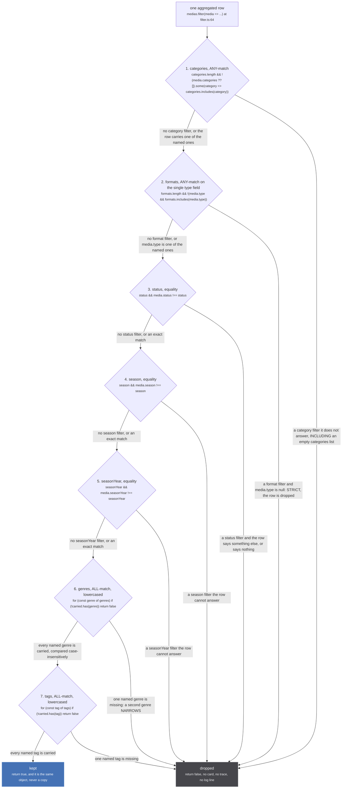
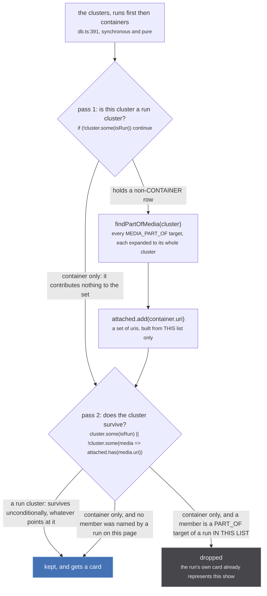
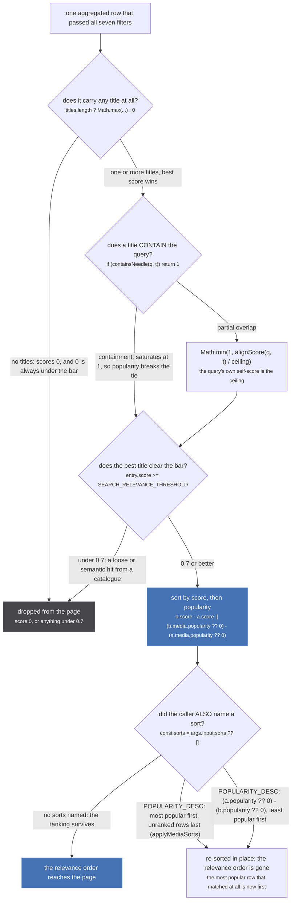

`Subscription.mediaPage` is the only read in the tree that takes a question. Everything a browse page
can ask for lives on one input (`schema.gql:429-469`): `search`, `status`, `season`, `seasonYear`,
`categories`, `formats`, `genres`, `tags`, `sorts`. None of it reaches the store. The graph has no
index on a genre, no notion of a format and no query language: `getPage`
(`src/worker/resolvers/media/index.ts:110-163`) reads clusters, aggregates them into rows, and only
then decides which rows the caller asked for.

That makes the interesting part the **order**. There are four passes after the read, they are not
commutative, and three of the four have a comment above them explaining what breaks when they move.

## `getPage`, in order

```mermaid
flowchart TD
  EV["a media:changed event, debounced 100 ms<br/><small>debouncedListenIterator(['media:changed'], 100)</small>"]
  S1{"has any source answered yet?<br/><small>uris.length ? uris : undefined</small>"}
  R1["findAllAggregatedMedia<br/><small>runs first, then containers, each row in exactly one</small>"]
  F1{"did the fuzzy pass weld anything?<br/><small>if (await fuzzyMergeMediaClusters(clusters))</small>"}
  R2["findAllAggregatedMedia, a second time<br/><small>same seeds, larger components</small>"]
  H["hideAttachedContainers<br/><small>decided from THIS LIST, not from the store</small>"]
  AG["aggregateMedia per cluster<br/><small>one GQLMedia each, and it mints a componentId uuid</small>"]
  FI["applyMediaFilters(aggregated, args.input)<br/><small>seven predicates, pure, synchronous</small>"]
  SE{"is there free text?<br/><small>const search = args.input.search</small>"}
  SC["score every row, keep &gt;= 0.7, sort by score then popularity"]
  SO{"did the caller name a sort?<br/><small>const sorts = args.input.sorts ?? []</small>"}
  SS["the sorts loop, in place<br/><small>runs AFTER the relevance sort and overwrites it</small>"]
  Y["yield the array<br/><small>resolve: (parent) =&gt; ({ nodes: parent })</small>"]

  EV --> S1
  S1 -->|"insertedUris still empty: seed from every media row"| R1
  S1 -->|"a source contributed uris: seed from those, expanded to whole components"| R1
  R1 --> F1
  F1 -.->|"it unioned or edged at least one pair: read the store AGAIN"| R2
  F1 -->|"nothing matched: the snapshot stands"| H
  R2 --> H
  H --> AG
  AG --> FI
  FI --> SE
  SE -->|"no search: relevance is never computed and nothing is dropped for it"| SO
  SE -->|"a query string"| SC
  SC --> SO
  SO -->|"no sort: whatever order the previous pass left"| Y
  SO -->|"POPULARITY or POPULARITY_DESC"| SS
  SS --> Y

  classDef irrev fill:#b03f33,stroke:#e0796f,color:#ffffff
  classDef ratchet fill:#8f5a0e,stroke:#f2b45c,color:#ffffff
  classDef view fill:#4572b5,stroke:#8db0de,color:#ffffff
  classDef refuse fill:#46464b,stroke:#8b8c93,color:#f2f2f4
  class F1,R2 irrev
  class H,AG,FI,SC,SS view
```



*Only one node on this figure changes the store. Everything after it is a view, computed fresh on every event and kept nowhere.*

Call sites, in order: `index.ts:126` (the seeds), `:127-129` (the fuzzy pass and its re-read), `:130`
(`hideAttachedContainers`), `:131` (`aggregateMedia`), `:137` (`applyMediaFilters`), `:139-152` (the
search pass), `:154-161` (the sorts loop), `:166` and `:168` (the yields).

The one constraint that is written down is the gap between `:130` and `:137`, `index.ts:133-136`:

> Everything decidable from the aggregated row, in one pinned place. It runs AFTER
> `hideAttachedContainers` above: dropping a run cluster before that leaves its container
> behind as an orphan card, because a container is only hidden when a run cluster in the
> same list points at it.

Read that backwards to see the bug it names. Filter first, and a run cluster that fails the filter is
gone before `hideAttachedContainers` ever looks at the list. The container it pointed at is then
attached to nothing on the page, survives, and the user who filtered to `MOVIE` gets a card for the
series the movie belonged to. Filtering after means the container was already hidden by a run that
was on the list at the time, which is the answer the user asked for.

:::danger[Opening a listing is not a neutral act]
`index.ts:127-129` calls `fuzzyMergeMediaClusters`, which unions clusters it judges to be the same
work through `graph.link`. A union-find has **no inverse**: there is no unlink, no split, and no undo
for the life of the store. A page load that welds two shows together has changed what every later
read answers, including reads that never asked for a listing.

`aggregateMedia` on the next line also writes, more quietly: `clusterId` mints a
`crypto.randomUUID()` for a component the first time anyone aggregates it and puts it in the alias
table. That one is additive and harmless, but it is still a write on a read path. See
[Aggregating a media](/read/aggregate-media/).
:::

## `applyMediaFilters`, seven predicates

The predicate lives in its own file, and the header says why (`src/worker/store/filter.ts:1-5`):

> The `mediaPage` filters that can be decided from an aggregated row, kept out of
> ../resolvers/media/index.ts so they can be tested. That module reaches urql and dies under vitest
> with a CommonJS `require('react')`, which is the same reason `sameAsHandleUris` lives in
> ./aggregate.ts and `normalizeToStoreMedia` in ./normalize.ts. A filter nothing can pin is a filter
> nobody can prove empties a page.



*Seven independent refusals, evaluated in this order, and the row has to survive all seven. Nothing here is scored: a filter either matches or it does not.*

The whole function is `filter.ts:54-80`, sixteen lines. The axes:

| axis | input field | match | comparison | a row that says nothing |
| --- | --- | --- | --- | --- |
| categories | `categories: [MediaCategory!]` | ANY | `includes`, case-sensitive | dropped |
| formats | `formats: [MediaType!]` | ANY, against one `type` | `includes`, case-sensitive | dropped |
| status | `status: MediaStatus` | equality | `!==` | dropped |
| season | `season: MediaSeason` | equality | `!==` | dropped |
| seasonYear | `seasonYear: Int` | equality | `!==` | dropped |
| genres | `genres: [String!]` | ALL | both sides lowercased by `labelSet` (`filter.ts:27-28`) | dropped |
| tags | `tags: [String!]` | ALL | both sides lowercased | dropped |

That last column is one decision, taken once, and it is the one that surprises people
(`filter.ts:33-40`):

> STRICT: a filter names values, and a row that cannot show it carries one of them does not match. A
> media with no `type` fails a format filter, a media with no genres fails a genre filter. The
> alternative, letting an absent field pass, means a "Movies" filter lists every row no source typed,
> which is the failure a user reads as broken.
>
> Genres and tags are ALL-match, case-insensitively: adding a second genre narrows, which is what
> every browse UI does and what a user adding one expects. Formats and categories are ANY-match,
> because they are alternatives rather than refinements.

Two small edges worth knowing before you debug a page that looks over-filtered:

- **`seasonYear: 0` is falsy**, so `if (seasonYear && ...)` skips the check entirely rather than
  matching year zero. The same holds for an empty-string `status` or `season`. GraphQL sends `null`
  for an unset field, which is the case this shape is written for.
- **Genres and tags lowercase both sides; categories and formats do not.** A source that publishes
  `"movie"` where the enum says `MOVIE` fails the format filter and passes an equivalent genre
  filter. Both are pinned in `tests/unit/worker/store/filter.test.ts`.

### Why status is a filter and not a default

`filter.ts:42-52` is the longest comment in the file and it is a history of one field:

> `status` IS filtered here, and it could only become filterable once the home page stopped using it
> to mean something else. That page asked for RELEASING to mean "the current season", every seasonal
> source read it that way, and a listing of a season legitimately holds runs that have not aired yet,
> so enforcing it would have emptied a third of the front page. The home page now names its season
> (router/home/index.tsx), which leaves this free to mean what it says.
>
> It is strict like the rest, and that has a real cost worth knowing: the bundled offline catalogue
> publishes no status at all, on purpose, because its dump's own value decays within weeks (192 of 219
> SUMMER 2026 rows read UPCOMING in a dump cut six weeks before they aired). So a status filter drops
> every row only that catalogue describes. That is the honest answer to "which of these is airing" and
> it is why status is a filter rather than a default.

The measurement of the world before that change is in the test
(`tests/unit/worker/store/filter.test.ts:122-127`):

> Without this the control is nearly inert on a season page: measured live before
> the change, Airing gave 213 cards and Not yet aired 216, out of a season of 216, because jikan,
> kitsu and the bundled catalogue answer the whole season and nothing narrowed them.

213 and 216 out of 216 is the shape of a filter that is not filtering: both answers are the whole
season. The same source rows arrive today, and the difference is that the predicate now refuses them.

### How much of the page this predicate is holding up

The test file opens by saying it plainly (`filter.test.ts:1-4`):

> The browse filters are answered by 3 of 24 sources. Every other source ignores them and its rows
> arrive at the page unfiltered, so this predicate is the whole distance between what the user asked
> for and what the page lists. Each leniency pinned below is a row the user filtered out being shown
> anyway, and each is the kind of change a reviewer makes on purpose, believing it kinder.

Counted against the tree today, the figure is **four**, not three. `mediaPage` reads a filter axis in
`anilist` (`extractor.ts:690-727`, every axis), `jikan` (`extractor.ts:383`, season, seasonYear,
status), `kitsu` (`extractor.ts:304-306`, the same three) and `offline` (`extractor.ts:249`, the same
three). Take the sentence's point rather than its arithmetic, because the point gets sharper the more
precisely you count:

- **`search`** is asked of fourteen modules.
- **`season`, `seasonYear` and `status`** are asked of four.
- **`genres`, `formats` and `tags`** are asked of exactly one, AniList.
- **`categories` is asked of nobody.** `src/router/search/params.ts:291-294` says why:

  > `category` is the only axis that is purely a refinement: no source reads it, and the worker applies
  > it locally over whatever the other axes fetched. A page holding nothing else has therefore asked
  > nobody anything, and settling on "No results found" would blame the filter for a request that was
  > never made. The page says "pick something to browse" instead.

So for six of the seven axes, most of the rows on the page were fetched by a source that never heard
the question. `applyMediaFilters` is the only thing standing between those rows and the user.

## `hideAttachedContainers`



*Two passes over the same array. The set is rebuilt from scratch on every event, so nothing here is remembered between one page and the next.*

`db.ts:385-390`:

> The clusters a listing shows. A listing shows RUNS, and a show whose run is on the page is already
> represented by that run's card: a container-only cluster is dropped when any of its members is a
> PART_OF target of any member of a run cluster IN THE SAME LIST. A show with no run on the page still
> gets a card, which is today's behaviour for live-action catalogues. Run clusters always survive.

The capitals on IN THE SAME LIST are the whole rule. The decision is scoped to the array in hand, not
to the store, and that has two consequences that pull in opposite directions:

- A container whose run exists in the store but is **filtered off this page** keeps its card, because
  the run was not in the list when the attached set was built. That is the case the ordering
  constraint above is protecting: it only works because the filters have not run yet.
- The same show can be hidden on one page and drawn on the next, with nothing in the store having
  changed. `mediaPage` is a view of a query, and this is the pass that makes it one.

`findPartOfMedia` (`db.ts:276-296`) is what supplies the targets, and it is not a plain edge read: it
expands each `MEDIA_PART_OF` target to that target's whole cluster in its own space, so a run that is
part of a show marks **every catalogue's id for that show** as attached. `db.ts:266-274` states why:

> Each target is expanded to its whole cluster in ITS
> OWN space, so a run that is part of a show links to every id that show has: the fuzzy pass writes
> ONE edge, to the cluster key, and the other catalogues of an already unioned show were only ever
> reachable while they were welded in.

Concretely: Mushoku Tensei season 1 is a run cluster on the page and holds a `MEDIA_PART_OF` edge to
one uri of the show. That uri's container cluster also holds the `imdb:` id, the `tvdb:` id and
whatever else clustered with it, and all of them land in `attached`. So the show does not reappear as
a second card just because a different catalogue's id for it happened to be the one the edge did not
name.

## Search relevance, and the sort that discards it



*The two bottom-right branches are the same outcome under two different names, and the names are inverted relative to what they do.*

The threshold, `index.ts:20-21`:

> Drop search results whose title doesn't actually match the query - sources do loose, sometimes
> semantic, server-side matching (e.g. Apple returns "WondLa" for "frieren").

```ts
const SEARCH_RELEVANCE_THRESHOLD = 0.7
```

This is one of three thresholds over the same wasm matcher and they are not interchangeable: `0.7`
here, `0.44` for the source-side search gate (`src/sources/utils.ts`), and `SIMILARITY_THRESHOLD =
0.9` for the fuzzy merge (`src/worker/store/fuzzy-merge.ts:7`). This one is the cheapest of the three
to get wrong, because it only hides a card. The 0.9 one welds two shows together forever.

`searchRelevance` (`src/sources/utils.ts:282-283`) is one line:

```ts
titles.length ? Math.max(...await Promise.all(titles.map(title => searchScore(query, title)))) : 0
```

**A row with no titles scores 0 and is therefore always dropped when `search` is set.** It is scored
against every title the aggregate carries, not the primary one, which is what lets a native-language
query find a row an English source described.

`searchScore` measures containment rather than similarity, which is a different question from the one
`titleSimilarity` answers (`utils.ts:262-266`):

> Normalized by the QUERY length, unlike titleSimilarity which normalizes by the longer string, so this
> measures containment and saturates: every title holding the query scores 1 and popularity breaks the tie.
> It shares titleSimilarity's strip because the ascii-only one left "Aランクパーティを離脱した俺は..." as the single
> letter "a", which then scored 1.0 against 841 of 903 shows, while 587 of them could not be found by their
> own native title at all.

And the saturation is asserted rather than left to the matcher (`utils.ts:272-275`):

> Containment saturates, which is the property the ranking is built on: every title holding the
> query scores 1 so popularity breaks the tie rather than title length. It needs asserting
> separately here because frizbee pays a positional bonus the query only collects at position 0,
> so "frieren" inside "sousou no frieren" reaches 116 of its own 132 rather than all of it.

So typing `frieren` scores exactly 1.0 for both "Frieren" and "Sousou no Frieren", and the tie is
settled by `popularity`, not by which title is shorter. `popularity` on an aggregate is
`acc.popularity ?? gql.popularity` (`src/worker/store/aggregate.ts:332`), the value from the
highest-scored member that named one.

### The naming trap

```ts
// src/worker/resolvers/media/index.ts:155-161
for (const sort of sorts) {
  if (sort === 'POPULARITY') {
    aggregated.sort((a, b) => (b.popularity ?? 0) - (a.popularity ?? 0))
  } else if (sort === 'POPULARITY_DESC') {
    aggregated.sort((a, b) => (a.popularity ?? 0) - (b.popularity ?? 0))
  }
}
```

`POPULARITY` puts the **most** popular first. `POPULARITY_DESC` puts the **least** popular first. Read
the comparators, not the names. The enum has exactly these two members (`schema.gql:424-427`), so
there is no third option and no way to spell "descending" that behaves the way the word does
elsewhere: AniList's own upstream enum uses `POPULARITY_DESC` to mean most popular first, and stub
sends it that way (`src/sources/anilist/extractor.ts:726`) while its own field of the same name means
the opposite.

### The sort erases the ranking, and the client works around it

The loop runs after the relevance sort and re-sorts the same array in place, so naming any sort
alongside a query throws the relevance ordering away. The page compensates rather than the resolver,
`src/router/search/index.tsx:220-227`:

> The variables for a filter set.
>
> `sorts` is sent only when there is no free text. The resolver applies `sorts` AFTER its relevance
> pass, so asking for a popularity sort alongside a search would throw the relevance ranking away and
> answer the most popular media that matched at all.

```ts
const variablesFor = (filters: SearchFilters) => ({
  ...filters.query ? { search: filters.query } : { sorts: [MediaSort.Popularity] },
  ...
})
```

That ternary is the whole guard, and it lives on the client. Anything else calling `mediaPage` with
both `search` and `sorts` gets the popularity order, silently, and the only trace is that the first
card is a well-known show that barely matched.

## What the input asks for and nothing answers

`MediaPageInput` is wider than the resolver. Read by nothing on this path: `nodes`, `startDate`,
`endDate`, `at`, `before`, `after` (`schema.gql:432`, `:458-468`). Pagination is declared and not
implemented: `mediaPage` resolves as `({ nodes: parent })` (`index.ts:95`), so every cursor and count
field on the `MediaPage` type is left `undefined` - `firstPageCursor`, `totalNodeCount`,
`currentPageNodeCount` and the rest (`schema.gql:471-492`). A client reading `totalNodeCount` gets
null, always, and the array it did receive is the entire answer.

The page also never shrinks on its own. `getPage` re-runs on `media:changed`, debounced 100 ms
(`index.ts:108`), and each run rebuilds the list from the store, so a row that stops matching a filter
disappears on the next event rather than immediately. It listens to `media:changed` only, not
`episode:changed`: an episode landing redraws a media page and does not redraw a listing.
