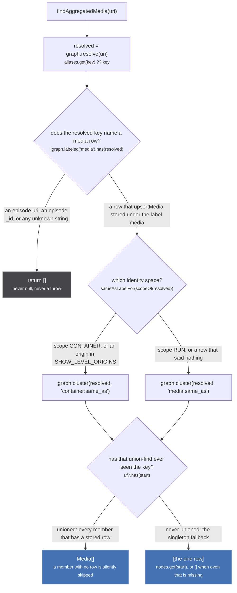
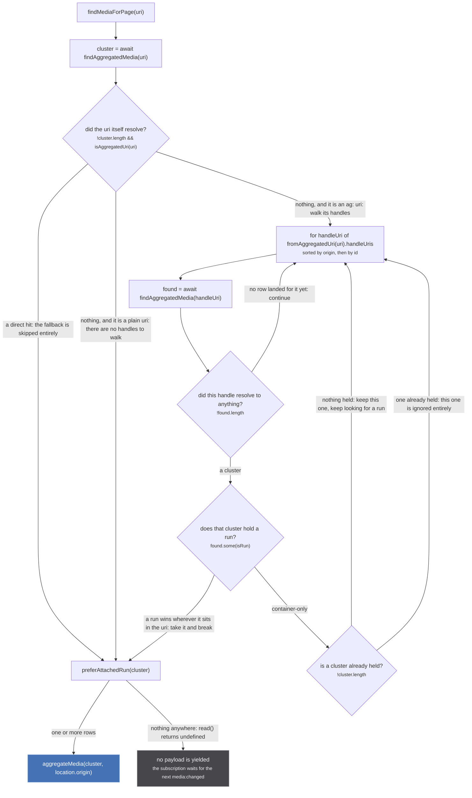
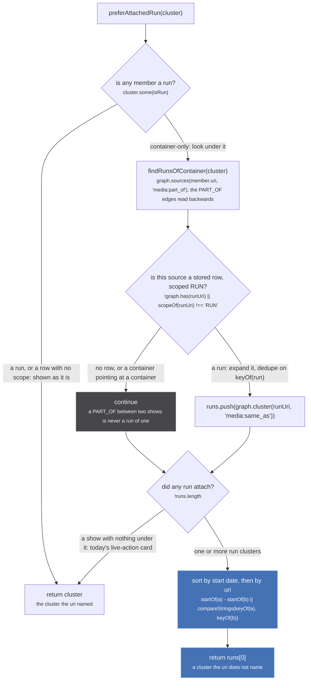
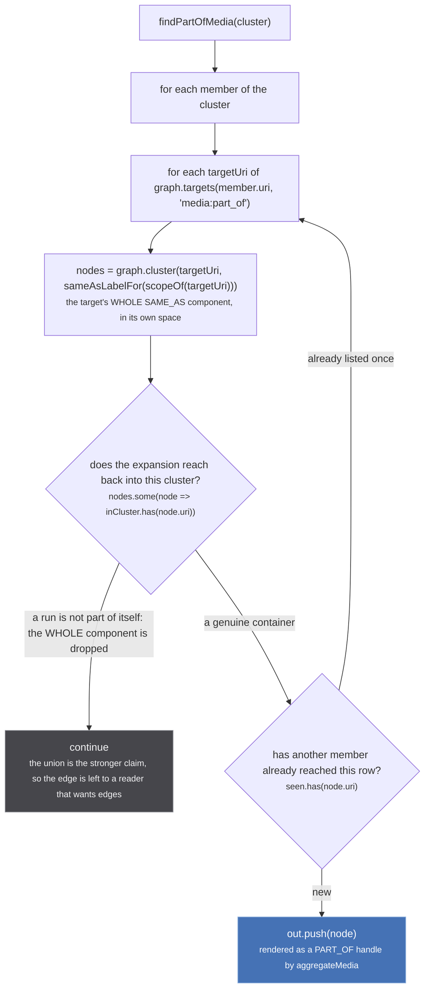

A page asks for one uri. What it gets back is a set of rows, and nothing in the uri says which rows
those are. Four functions in `src/worker/store/db.ts` decide it, and they are worth reading in this
order because each one wraps the last:

| function | line | takes | gives |
| --- | --- | --- | --- |
| `findAggregatedMedia` | `db.ts:257` | a uri, or a `Media._id` | the SAME_AS component of that row, or `[]` |
| `findMediaForPage` | `db.ts:349` | the uri the page was opened with | the cluster the page draws |
| `preferAttachedRun` | `db.ts:334` | a cluster | that cluster, or the first run hanging under it |
| `findPartOfMedia` | `db.ts:276` | a cluster | every row it points at but does not claim to be |

Two things to hold on to before the figures. **None of these writes anything**, which makes this the
one part of the store that can be re-read as often as you like; the writes that produced what they
read are on [upsertMedia](/write/upsert-media/) and [the fuzzy merge](/merge/fuzzy-merge/). And
**none of them is really asynchronous**: `findAggregatedMedia` and `findMediaForPage` are declared
`async` and contain no `await` of any I/O, because the store is a set of in-memory `Map`s
(`src/worker/store/graph.ts:124-140`). The `await` at `src/worker/resolvers/media/index.ts:71` costs a
microtask and nothing else.

## `findAggregatedMedia`: resolve, then the label gate, then one space

*Three lines of code and three ways to come back with nothing: an unlabelled key, a component whose members were never stored, and a key the union-find has never met.*

The whole function is `db.ts:257-264`. `graph.resolve` (`graph.ts:227`) is a lookup in the alias table
and nothing more, and what that table holds decides how much this accepts:

`src/worker/store/graph.ts:133-135`

> `${label}\u0000${root}` -> uuid. The alias table only ever receives these uuids as keys, never a
> uri: `has` and `get` fall through aliases, so a uri alias would make `upsertMedia`'s novelty test
> and its pendingClaims gate report a row that was never stored.

So a caller holding a `Media._id` from an earlier render can read the cluster back, because
`graph.componentId` aliases every uuid it mints to that component's root (`graph.ts:234-244`). That
generosity is exactly why the next line exists:

`src/worker/store/db.ts:259-260`

> the alias table carries EPISODE cluster ids too (`componentId` aliases every id it mints), and an
> episode node is never a media whatever a caller typed the id as

`aggregateEpisode` mints its ids through the same call (`src/worker/store/aggregate.ts:407` and
`:414`), so an episode `_id` resolves to an episode uri perfectly well. `graph.labeled('media')`
(`db.ts:261`) is what stops it becoming a media: the `media` label is written once, by `upsertMedia`
at `db.ts:147`, and a key that never went through that loop is refused with `[]`.

Which of the two identity spaces gets read is decided per row, not per caller:

`src/worker/store/db.ts:262`

> a container row clusters in the container space, so its own SAME_AS siblings are what comes back

`sameAsLabelFor` (`db.ts:94`) maps `CONTAINER` to `container:same_as` and everything else to
`media:same_as`, and `scopeOf` (`db.ts:91-92`) reads the backstop first, the stored row second, and
`'RUN'` last. The two labels are two separate union-finds, so a container's siblings and a run's
siblings can never appear in one answer. That is the invariant the whole store is built around, and
it is worth reading where it is stated:

`src/worker/store/db.ts:8-12`

> Two identity spaces, one per scope. A run's SAME_AS unions in the first, a container's in the second,
> and nothing ever unions across them: a show-level id entering a run's cluster is what welded Mushoku
> Tensei season 1 to season 3 on the live site (the bare crunchyroll series id and the bare tvmaze
> show id were fuzzy merged into season 1's cluster on the search path, and season 3's media path then
> asserted sameness through one of them; `graph.link` is a union-find with no inverse).

Two details at the bottom of the figure that a caller can trip on. `graph.cluster` falls back to a
singleton when the union-find has never seen the key (`graph.ts:325-327`), so a row nobody ever linked
still reads as a one-member cluster rather than as nothing. And it silently skips any member with no
stored row (`graph.ts:322-323`), which is the same tolerance the write side has:

`src/worker/store/db.ts:273-274`

> A node with no stored row is skipped: `graph.edge` accepts a uri that was never `set`, exactly as
> `graph.link` does.

:::caution
**These reads can never split what a union welded.** Every cluster on this page is a `UnionFind`
component, and `graph.link` has no inverse anywhere in the repo: no unlink, no disunion, and
`union` ends with `components.delete(oldRoot)` at `graph.ts:103`, which destroys the record of which
members came from which side. A wrong SAME_AS therefore shows up here as a cluster that reads
perfectly and cannot be argued with. The only reset is `resetStore()` at `db.ts:509-513`, which empties
the whole store and is tests only. See [the graph](/write/graph/).
:::

## `findMediaForPage`: the uri, then its handles one at a time

*Six outcomes, and the two that look alike are not: a container-only cluster is held as a fallback the first time and discarded every time after.*

The function is `db.ts:349-364`, and its doc says what the walk is for:

`src/worker/store/db.ts:342-347`

> The cluster a media page shows for the uri it was asked for.
>
> The uri itself first (an alias resolves there too), then, for an aggregated uri, its handles one by
> one: a bookmark carries ids that may have clustered differently since. A handle naming a RUN wins
> over one naming a show whichever comes first in the uri, because a uri that mixes the two came off
> a run's page. What is found is then shown as `preferAttachedRun` says.

**The walk order is fixed, and it is origin first.** `fromAggregatedUri` sorts by id and then by
origin (`src/utils/uri.ts:219-220`), and `Array.prototype.sort` is stable, so the second sort is the
primary key: handles come out ordered by origin ascending, then by id ascending inside one origin.
`ag:(cr:G24H1N3MP,kitsu:49002,tvmaze:52279)` is therefore walked `cr`, `kitsu`, `tvmaze`, whatever
order the caller wrote them in. That ordering is not incidental: it is what makes a source's answer to
the same uri reproducible between loads ([order is not an input](/invariants/determinism/)).

The `!cluster.length` at `db.ts:360` is the whole difference between "hold this and keep looking" and
"ignore it". Walk the real case, from `tests/unit/worker/store/container-page.test.ts:87-101`, where
season 3's bookmark carries the show's ids beside the run's:

- `cr:G24H1N3MP` resolves to a container cluster of `{cr:G24H1N3MP, tvmaze:52279}`. No run in it, and
  nothing is held yet, so it is kept as the fallback.
- `kitsu:49002` resolves to a run. `found.some(isRun)` passes, the held container is thrown away, and
  the loop **breaks**.
- `tvmaze:52279` is never read.

The test asserts exactly that: `findMediaForPage('ag:(cr:G24H1N3MP,kitsu:49002,tvmaze:52279)')` is
`['kitsu:49002']`, and the comment above it says why it matters that the show did not win: *following
the show would have landed on season 1, the earliest run*.

Note `isRun` (`db.ts:95`) is `media.scope !== 'CONTAINER'`, so **a row with no scope at all counts as a
run**. That is deliberate and it matches the schema default, but it means the run-wins branch fires for
a row that never made any claim about its own scope.

## `preferAttachedRun`: the one read that answers with something else

*Both refusals return the cluster untouched, and only the rightmost path substitutes anything. A show is shown as itself unless a run is actually attached to it.*

Four lines, `db.ts:334-339`, and the reasoning is the best statement on the site of what splitting the
identity spaces cost and how it was paid back:

`src/worker/store/db.ts:326-332`

> The cluster a page shows for the one a uri resolved to.
>
> A run is shown as it is. A show whose runs are in the store is shown as its FIRST run, by start
> date and then by uri: that is the page the weld used to produce, season 1's episodes and offers
> under the show's ids, and a show page with no episode and no offer is what splitting the spaces
> cost until this. The run's PART_OF handles still carry every id of the show. A show with no run
> attached is shown as itself, which is today's card for a live-action catalogue.

The backwards walk is `findRunsOfContainer` at `db.ts:303-317`, and its two refusals sit in one
condition at `db.ts:308`:

`src/worker/store/db.ts:299-301`

> Every run cluster hanging off a container cluster, read backwards along the PART_OF edges, each
> cluster once. Only a RUN row counts as a source: a container pointing at another container is a
> PART_OF claimed between two shows, never a run of one.

Deduping is on `keyOf(run)` (`db.ts:310-312`), the lexicographically smallest member uri of the
expanded cluster, not on the seed uri: a container with three edges into one run cluster yields that
cluster once.

**Reading the sort is worth thirty seconds.** `startOf` (`db.ts:319-323`) is `Math.min` over the
cluster's parsed start dates with an unparseable or absent date mapped to `Infinity`, so an undated
cluster sorts last against any dated one. Two undated clusters produce `Infinity - Infinity`, which is
`NaN`, and `NaN` is falsy, so the `||` falls through to `compareStrings(keyOf(a), keyOf(b))` and the
tiebreak still runs. The live consequence is in the same test file: with the two Mushoku runs both
undated, `findMediaForPage('ag:(cr:G24H1N3MP,tvmaze:52279)')` answers `['kitsu:42323']`, the smaller
uri, and answers it the same way on every load.

The dated case is the Breaking Bad fixture at
`tests/unit/worker/store/container-page.test.ts:67-73`. The show is a container cluster of
`imdb:tt0903747`, `trakt:breaking-bad` and `tvmaze:169`; two JustWatch seasons land, `jw:222-378`
dated 2009-03-08 first and `jw:222-230` dated 2008-01-20 second. `preferAttachedRun` on the show's
cluster answers `['jw:222-230', 'nf:70143836-1']`, the earlier one, *whatever the order they landed
in*, which is the test's own name for the property.

:::tip
**`preferAttachedRun` is the only read that answers with a cluster the uri does not name.** It is a
view: nothing is written, and the substitution is recomputed on every read.
:::

That is also why the choice lives in `db.ts` rather than in the resolver that wants it:

`src/worker/resolvers/media/index.ts:68-70`

> A show whose run is in the store is shown as that run: see `preferAttachedRun` in
> store/db.ts, where the choice lives so it can be pinned (this module reaches urql and
> cannot load under vitest).

And the substitution is **not** applied on the path a source uses. `findAggregatedMediaForContext`
(`src/worker/extractor.ts:81-92`), handed to every source as `ctx.findAggregatedMedia`, breaks on the
first non-empty handle cluster with no `some(isRun)` preference and never calls `preferAttachedRun` at
all. A source that asks the store about a show gets the show; a page asking about the same show gets
the show's first run. The two are compared side by side on [the five reads](/read/entry-points/).

## `findPartOfMedia`: one edge in, a whole component out

*The expansion is the point of the function: a run that is part of a show links to every id that show has, from a single stored edge.*

`db.ts:276-296`. It is synchronous, it is pure, and its doc carries the measurement that produced the
expansion:

`src/worker/store/db.ts:267-274`

> Every row a cluster points at but does not claim to be, deduped by uri.
>
> Read from the DIRECTED PART_OF edges of every cluster member, because the aggregated media is the
> cluster and any of its members may hold one. Each target is expanded to its whole cluster in ITS
> OWN space, so a run that is part of a show links to every id that show has: the fuzzy pass writes
> ONE edge, to the cluster key, and the other catalogues of an already unioned show were only ever
> reachable while they were welded in. A node with no stored row is skipped: `graph.edge` accepts a
> uri that was never `set`, exactly as `graph.link` does.

The test that pins it is `container-page.test.ts:106-117`: one `PART_OF` claim from `anilist:108465`
to `cr:G24H1N3MP`, plus two container-space unions among `cr:G24H1N3MP`, `tvmaze:52279` and
`imdb:tt13303712`, and `findPartOfMedia` of the run's cluster answers all three. Its comment states
what the missing expansion looked like on screen: *the modal renders PART_OF links, so a run card
showed one catalogue icon where it used to show four.*

The self-refusal at `db.ts:287` drops the **entire** expanded component, not just the member that
overlaps:

`src/worker/store/db.ts:283-286`

> A run is not part of itself. The two claims disagree (one source called the target a container
> of this run, another called it the same run and unioned it in), and the union is the stronger
> statement, so the edge is left to the reader that wants edges rather than rendered as a show
> this run belongs to.

The space each target is read in is chosen per target by `scopeOf(targetUri)`, exactly as in the first
figure. A target with no stored row reads `'RUN'` by default, is looked up in `media:same_as` where it
has no component, and contributes nothing rather than contributing a bare node.

Two readers depend on this shape. `aggregateMedia` turns the result into the PART_OF half of a media's
`handles` (`src/worker/store/aggregate.ts:315` and `:366`), which is how a run card carries a show's
IMDb, TVmaze and Crunchyroll links without ever asserting sameness with them. And
`hideAttachedContainers` (`db.ts:391-398`) uses it to decide which container cards a listing drops, a
decision scoped to the list rather than to the store; that one is on
[filters and search](/read/filters-and-search/). The source side counts on it too:

`src/sources/justwatch/extractor.ts:421-425`

> NOTHING HERE CLAIMS TO BE THE RUN. The caller must not `mergeHandles` this media: that mints a
> `sameAs` for every origin in the asking uri, which is precisely the weld above. The container reaches
> the run through the container space instead, where `fuzzy-merge` unions it with the crunchyroll and
> tvmaze containers the cluster already hangs under, and `findPartOfMedia` expands a PART_OF target to
> its whole SAME_AS component.

## Where the cluster goes next

`Subscription.media` does three things with what it got, at
`src/worker/resolvers/media/index.ts:71-77`. `aggregateMedia(cluster, location.origin)` folds the rows
into one `GQLMedia`, and it is drawn dashed everywhere on this site because minting the cluster's
`_id` writes an alias ([aggregating a media](/read/aggregate-media/)). `askUnasked(media.uri)` re-asks
any origin the widened cluster just made addressable ([the re-ask](/request/re-ask/)). And
`resolveSimilarRuns` is fired with `void` and never awaited, so nothing it does can fail the read. Episodes are not read here at all: `Media.episodes` runs later,
from the first SAME_AS handle that resolves, and deliberately not through `findMediaForPage`
([aggregating episodes](/read/episodes/)).

## One correction to the page brief

The subsystem report describes `fromAggregatedUri`'s handle list as *sorted id-then-origin*, which is
the order the two `.sort()` calls appear in at `src/utils/uri.ts:219-220` and the opposite of the
order they take effect in. `Array.prototype.sort` is stable, so the last sort applied is the primary
key: **origin ascending, then id ascending within one origin**. The comment at `src/utils/uri.ts:36`
saying *the list arrives sorted by id* is true of what `mostSpecific` sees, because
`extractAggregatedUriOrigin` filters the list to a single origin before handing it over
(`uri.ts:44`), which is all that function needs. For the handle walk in `findMediaForPage` the
distinction is real: it is origin order that decides which handle is tried first.
