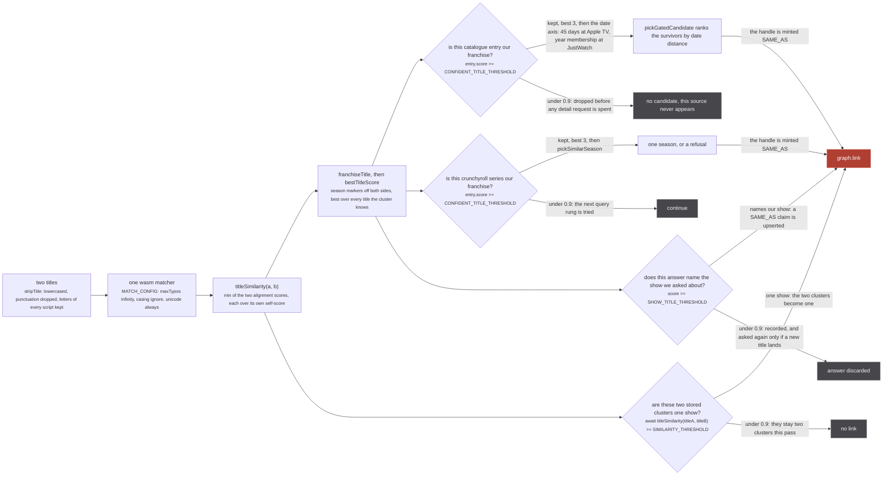
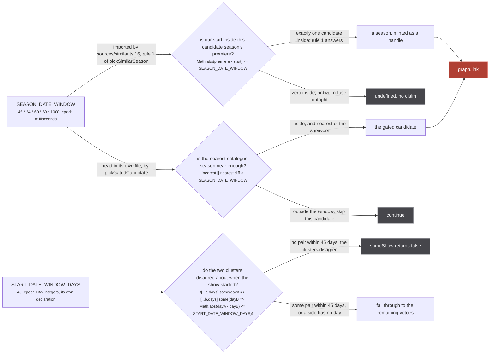

This is the lookup table. Every number that decides something in the data flow is here once, with the
file and line it is declared on and one line of why it holds that value. Where the reason is a
measurement, the measurement is quoted on the page that owns the mechanism and linked from here
rather than repeated.

Two things are worth knowing before reading any row. First, almost nothing here is a default: the
constants in this codebase carry sweeps, corpora and counts in the comment above them, and several of
them survived a candidate that looked better on the ratio. Second, the numbers are not as coupled as
they look. Four separate constants read `0.9` and moving one moves nothing else, while `45` days is
one number deliberately spelled in three places. Those two facts are the first two figures on this
page.

:::danger[Most of these are the last check before something with no inverse]
Every threshold in the first table below is the final gate in front of `graph.link`, which is a
union-find union: two clusters that union stay unioned for the session, and the merged cluster goes
on to weld a third. There is no unlink. Lowering one of these thresholds is not a change you can
observe and then back out of within a session, and `graph.set` is last-write-wins on scalars, so the
row that arrives second wins with no record of the first. Read
[a handle is an identity claim](/invariants/handle-is-a-claim/) before touching one.
:::

## Thresholds, on the 0 to 1 scale

| constant | value | declared at | what it decides |
| --- | --- | --- | --- |
| `SEARCH_RELEVANCE_THRESHOLD` | `0.7` | `src/worker/resolvers/media/index.ts:21` | whether a search result stays on the page. Sources match loosely and sometimes semantically, so Apple returns "WondLa" for "frieren" |
| `CONFIDENT_TITLE_THRESHOLD` | `0.9` | `src/sources/catalogue-gate.ts:98` | whether a catalogue search hit names our franchise, for JustWatch and Apple TV |
| `CONFIDENT_TITLE_THRESHOLD` | `0.9` | `src/sources/crunchyroll/extractor.ts:366` | the same question on Crunchyroll's own search path, deliberately a second declaration |
| `SIMILARITY_THRESHOLD` | `0.9` | `src/worker/store/fuzzy-merge.ts:7` | whether two clusters already in the store are one show |
| `SHOW_TITLE_THRESHOLD` | `0.9` | `src/sources/similar.ts:303` | whether a `similarMedia` answer names the show we asked about |
| `EPISODE_TITLE_COVERAGE` | `0.6` | `src/sources/similar.ts:67` | the share of a candidate season's real episode titles our run must carry to be that season |
| `TITLE_MATCH_THRESHOLD` | `0.44` | `src/sources/utils.ts:324` | whether a catalogue hit names this media at all, in `pickTitleMatch` |

`0.9` and `0.44` are on the same scale and answer different questions with it. `0.7` is on a
different scale entirely: `searchRelevance` normalises by the QUERY length so containment saturates,
which is why a threshold that would be permissive for identity is strict for ranking
(`src/sources/utils.ts:262-266`).

### The four 0.9s are four questions, not one



*Four constants, one matcher, four different questions: raising one of them changes nothing about the other three, and every one of the four sits directly in front of the union that has no inverse.*

The shared value is not an accident and the coupling is not real either. `catalogue-gate.ts:34-36`
says why the value is copied:

`src/sources/catalogue-gate.ts:34-36`

> TWO INDEPENDENT AXES, and both must agree. Same shape, same constants and the same threshold as
> crunchyroll/extractor.ts, because it is the same scale computed by the same function and this whole
> calibration exists because one threshold drifted out of step with another at a different call site.

So `catalogue-gate.ts:98` and `crunchyroll/extractor.ts:366` are the same question asked of two
catalogues, and they are two declarations on purpose: Crunchyroll's gate predates the shared module
and mirrors it rather than importing it. `MAX_SERIES_CANDIDATES` and `MAX_SEARCH_QUERIES` are
mirrored the same way.

The other two are different questions over different inputs, which is what makes them independent:

- `fuzzy-merge.ts:571` compares the profile titles of two clusters, normalised by `normalizeTitle`
  (`stripTitle`, then articles removed). Season markers are NOT stripped there, because the veto stack
  above the comparison is what separates a season from its sequel. It is also the only one of the four
  reached through shortcuts: an exact string match returns true without the matcher
  (`fuzzy-merge.ts:568`), a pair differing only by a trailing number is skipped
  (`fuzzy-merge.ts:569`), and `maxPossibleSimilarity`, an exact character-multiset upper bound, refuses
  a pair before the wasm runs (`fuzzy-merge.ts:364-377`).
- `similar.ts:303` is read through `answerNamesOurShow`, which runs `bestTitleScore` in the other
  direction: every answer title against every one of ours, best wins. Its comment names the margin the
  value rests on.

`src/sources/similar.ts:299-302`

> The score at which an answer's title names OUR show. The value crunchyroll's search gate measured
> (title-gate.test.ts): correct pairs 1.000, the nearest wrong pair 0.8135, a spin-off.

For why `0.9` and not `0.5`, and what the 4.002% floor is that no similarity number can refuse, see
[the search gate](/sources/search-gate/). For why `0.44` survived its own justification failing, see
[scores](/sources/scores/) and `src/sources/utils.ts:305-322`.

## Windows



*Three sites, one width, two declarations: change `SEASON_DATE_WINDOW` and both call sites move together, change `START_DATE_WINDOW_DAYS` and the third moves alone. The units differ because the inputs do, milliseconds against epoch day integers.*

Crunchyroll's search path is inside the left branch too, one hop further out: `crunchyroll/extractor.ts:518`
calls `pickSimilarSeason`, so it reads the window through `similar.ts:188` rather than applying one of
its own. Its `import { SEASON_DATE_WINDOW }` at `crunchyroll/extractor.ts:4` is left over from when it
did, and the identifier appears nowhere else in that file.

45 is a structural ceiling rather than an optimum, and the sweep that suggests otherwise is printed
in the file so nobody rediscovers it:

`src/worker/store/fuzzy-merge.ts:28-40`

> WHY 45 IS NOT CHOSEN ON THE RATIO, which is the trap this sweep sets. Printed by the probe below,
> as (welds refused / correct merges lost / ratio), with the first-of-month guard this file ships:
>
>     30   84 / 101   0.83        90   65 / 41   1.59
>     45   83 /  81   1.02       180   40 / 11   3.64
>     60   77 /  68   1.13
>
> The ratio improves MONOTONICALLY as the window widens, so a reader optimising it picks 180 days.
> That is exactly backwards: this rule exists to separate two seasons inside ONE calendar year, and
> the owner's stated shape is season 1 in months 1 to 4 against season 2 in months 7 to 10, which is
> about 180 days apart. A 180 day window ALLOWS the entire population the check was built for, and
> scores a beautiful ratio by refusing almost nothing. Two consecutive cours sit about 91 days apart,
> so the window has a hard ceiling well below that regardless of what the ratio says.

Every window in the tree:

| window | value | declared at | why |
| --- | --- | --- | --- |
| `SEASON_DATE_WINDOW` | `45 * 24 * 60 * 60 * 1000` | `src/sources/catalogue-gate.ts:230` | the widest gap between our start date and a catalogue season's premiere that still names the same season. Applied at `catalogue-gate.ts:291` and `similar.ts:188` |
| `START_DATE_WINDOW_DAYS` | `45` | `src/worker/store/fuzzy-merge.ts:46` | the same width as a disagreement test between two stored clusters. 45 rather than 30 because kitsu and jikan answer `YYYY-MM-01` when only the month is known |
| a day either side | `day - 1`, `day`, `day + 1` | `src/worker/store/consensus.ts:142` | one broadcast is two dates: ani.zip stamps `2021-01-10T15:00:00Z`, which is the 11th in Tokyo |
| a day either side, again | `start >= Math.min(...days) - 1 && start <= Math.max(...days) + 1` | `src/sources/crunchyroll/extractor.ts:419` | the same allowance, written inline, when a season is lent rather than claimed |
| `SEASON_CANDIDATES_TTL_MS` | `10 * 60 * 1000` | `src/sources/crunchyroll/extractor.ts:319` | how long one series' season walk is reused. A currently airing season grows by one episode roughly weekly |
| `useResponseCache` ttl | `15 * 60 * 1000` | `src/worker/extractor.ts:470` | installed on every source yoga. It hooks `onExecute` and skips subscriptions, so it is inert on this path: see [known divergences](/reference/divergences/) |
| `SIMILAR_MEDIA_TIMEOUT_MS` | `30_000` | `src/worker/extractor.ts:198` | a backstop against a source that never yields, not a latency budget |
| `waitForMedia` default | `timeoutMs = 15_000` | `src/sources/utils.ts:493` | how long a source waits for another source to describe the cluster |
| `waitForMedia` override | `30_000` | `src/sources/crunchyroll/extractor.ts:461`, `src/sources/unogs/extractor.ts:463` | the search paths wait longer, and Crunchyroll waits for a start DATE rather than a title |
| `CONNECT_TIMEOUT_MS` | `45_000` | `src/plugins.ts:56` | the deadline on both halves of a plugin handshake, the connect and the registration |
| `RECONNECT_DELAY_MS` | `3_000` | `src/plugins.ts:9` | multiplied by the attempt number |
| `RECONNECT_MAX_MS` | `30_000` | `src/plugins.ts:66` | the ceiling on that product: `Math.min(RECONNECT_DELAY_MS * attempt, RECONNECT_MAX_MS)` |
| `MAX_RETRY_DELAY_MS` | `15_000` | `src/worker/backoff.ts:18` | caps both the exponential delay and an upstream's own `retry-after` |
| `backoffDelay` | `1_000 * 2 ** attempt` | `src/worker/backoff.ts:37-38` | 1s, 2s, 4s across the three retries |
| DataLoader batch window | `50` ms | `src/worker/extractor.ts:133`, `:151`, `:161` | `batchScheduleFn: (callback) => setTimeout(callback, 50)`, the same on all three loaders |
| `mediaPage` re-read debounce | `100` ms | `src/worker/resolvers/media/index.ts:108` | `debouncedListenIterator(['media:changed'], 100, ...)`: a listing coalesces a burst of writes into one page rebuild |

## Counts and caps

| constant | value | declared at | what it bounds |
| --- | --- | --- | --- |
| `MIN_ALIGNED` | `2` | `src/worker/store/consensus.ts:111` | dates two numberings must share before an offset is believed. Fewer and a coincidence could carry it |
| two witnesses | `backing.length < 2` | `src/worker/store/consensus.ts:234` | a run length resting on a single row hides episodes that aired, so nothing is trimmed on it |
| `MAX_CATALOGUE_CANDIDATES` | `3` | `src/sources/catalogue-gate.ts:109` | catalogue entries worth a detail request each |
| `MAX_SERIES_CANDIDATES` | `3` | `src/sources/crunchyroll/extractor.ts:369` | the same cap, mirrored, because each survivor costs a seasons call plus an episodes call per season |
| `MIN_EPISODE_TITLE_MATCHES` | `3` | `src/sources/similar.ts:69` | shared episode titles before rule 2 will speak. Verbatim at `similar.ts:68`: One shared title ("The Beginning", a recap name) is a coincidence; three is not |
| `MAX_RETRIES` | `3` | `src/worker/backoff.ts:17` | four attempts total. The third retry took the homepage's season list from 88% to 94% against Jikan |
| `MAX_SEARCH_QUERIES` | `4` | `src/sources/catalogue-gate.ts:110`, `src/sources/crunchyroll/extractor.ts:370` | query rungs tried, built from the PRIMARY title only |
| `MAX_ASKS_PER_PAIR` | `4` | `src/worker/similar-consumer.ts:41` | asks one (run cluster, container) pair gets in a session before it settles |
| `IDENTITY_FIELDS` | 4 entries | `src/worker/store/db.ts:104` | `new Set(['uri', 'origin', 'id', 'scope'])`: the fields that name a row rather than describe it |
| `MAX_TITLES_PER_CLUSTER` | `6` | `src/worker/store/fuzzy-merge.ts:12` | titles kept per cluster profile. The comparison is a square, so this is 36 alignments per pair |
| `MAX_SIMILAR_MEDIA_PER_CALLER` | `8` | `src/worker/extractor.ts:227` | one caller's share of the global ceiling, so a plugin can only waste its own budget |
| built-in sources | `24` | `src/sources/index.ts`, pinned at `tests/unit/sources/index.test.ts:24` | the live source list is `Object.values(extractorDefinitions)`, so the barrel IS what runs |
| `MAX_CONCURRENT_SIMILAR_MEDIA` | `32` | `src/worker/extractor.ts:216` | the global ceiling on `similarMedia` asks in flight, the blunt half of the cycle bound |
| origin `maxBatchSize` | `50` | `src/worker/extractor.ts:160` | origins arrive in far smaller batches than media do |
| episode titles per ask | `200` | `src/worker/similar-consumer.ts:175` | `dedupe(episodeTitles).slice(0, 200)`, the evidence sent with one ask |
| media and episode `maxBatchSize` | `250` | `src/worker/extractor.ts:132`, `:150` | one `upsertMedia` or `upsertEpisodes` call per 250 rows |
| plugin source name | `64` chars | `src/worker/plugin-sources.ts:73` | `source.name.slice(0, 64)`, falling back to the origin |
| `SAFE_SHOW_ID` length | `1` to `128` | `src/worker/extractor.ts:244` | a show id is the first value in the pipeline chosen by the CALLER |
| `printableToken` | `128` chars | `src/sources/similar.ts:296-297` | a caller-supplied string as one log token, so a newline cannot break the line a script parses |
| `MAX_CACHED_DECISIONS` | `50_000` | `src/worker/store/fuzzy-merge.ts:13` | pair verdicts held before the whole cache is cleared |

Two of these carry the reason they are not larger. `MAX_TITLES_PER_CLUSTER` is the one that costs
real time:

`src/worker/store/fuzzy-merge.ts:8-11`

> Bounds the wasm work, and it is the square that matters: sameShow compares every kept title of one
> cluster against every kept title of the other, so a pair costs up to 36 alignments today and a year
> bucket costs that times its pairs. Eight titles would take one pair to 64, +78% on the single loop
> the whole pass spends its time in, so this is not a knob to turn without measuring the loop first.

And `MAX_SIMILAR_MEDIA_PER_CALLER` exists because the ceiling above it is global:

`src/worker/extractor.ts:219-225`

> And a per-caller share, because the ceiling above is global and a third-party source can spend it.
>
> A plugin may register a `similarMedia` resolver that simply never yields, and a slot is then held
> for the full SIMILAR_MEDIA_TIMEOUT_MS. Enough of those pin the global ceiling, and the next
> FIRST-PARTY ask is refused: the page looks exactly like a source that had no answer. A per-caller
> share cannot stop a plugin wasting its own budget, which is fine, and does stop it spending
> anybody else's.

## Patterns

The two that validate untrusted input, both of which sit in front of something that interpolates
their subject into a url or a uri:

| pattern | value | declared at | what it refuses |
| --- | --- | --- | --- |
| `SAFE_SHOW_ID` | `/^[A-Za-z0-9._~-]{1,128}$/` | `src/worker/extractor.ts:244` | a show id carrying `..`, `?` or `#`, which would steer which path on the source's host gets fetched |
| `PLUGIN_ORIGIN_TOKEN` | `/^[a-z0-9][a-z0-9-]{0,31}$/` | `src/worker/plugin-sources.ts:4` | a plugin origin that is not a short lowercase token. A rejected source is reported and skipped, never fatal to its siblings |

`SAFE_SHOW_ID`'s character set is the union of what is actually in use, and the comment says so:
Crunchyroll `G24H1N3MP`, Apple TV `umc.cmc.1srk2goyh2q2zdxcx605w8vtx`, a Hulu uuid, a numeric TVmaze
or TMDB id, and a trakt slug like `mushoku-tensei-jobless-reincarnation`.

The uri grammar:

| pattern | value | declared at | what it does |
| --- | --- | --- | --- |
| `UNROUTABLE_IN_ID` | `/[,/()]/` | `src/utils/uri.ts:83` | the three characters that silently turn a working uri into one no route matches |
| `SCANNARR_REGEX` | `` /ag:\((.*)\)(?:-(.*))?/ `` | `src/utils/uri.ts:97` | splits an aggregated uri into its handle list and its optional episode tail |
| `SEASON_SCOPED` | `` /^(.+)-s(\d{1,3})$/ `` | `src/sources/season.ts:186` | the `-s<n>` suffix, the convention TMDB's own episode ids already use (`94664-s3e1`) |

The title patterns do not fit a table, because several carry pipes and all of them are load bearing
character by character. `SEASON_PATTERNS` reads a season number and `SEASON_MARKER` deletes one, and
they are deliberately not the same list:

```js
// src/sources/season.ts:88-95, ordinal form first: the number after the word in
// '4th Season 2-nensei-hen Ichi Gakki' belongs to the subtitle
const SEASON_PATTERNS = [
  /\b(\d{1,3})(?:st|nd|rd|th)\s+(?:season|part|cour)\b/i,
  /\b(?:season|part|cour)\s*(\d{1,3})\b/i,
  /シーズン\s*(\d{1,3})/,
  /第\s*([\d〇零一二三四五六七八九十]{1,4})\s*[期季]/,
  /(\d{1,3})\s*[期기]/,
  /\bS(\d{1,2})\b/,
]

// src/sources/similar.ts:104, a title that names a position and never an episode
const GENERIC_EPISODE = /^(?:episode|ep|e|part|chapter|第)?\s*\d+\s*(?:話|集|화)?$/

// src/sources/similar.ts:91-92, a part is a position INSIDE a season and maps to no catalogue's list
const PART_NUMBERED = /\b(?:part|cour)\s*(?:\d{1,3}|[ivx]{1,4}|one|two|three|four|five|six|seven|eight|nine|ten)\b/i
const PART_ORDINAL  = /\b(?:\d{1,3}(?:st|nd|rd|th)|first|second|third|fourth|fifth|sixth|seventh|eighth|ninth|tenth|final|last)\s+(?:part|cour|half)\b/i
```

`SEASON_PATTERNS` is counted rather than guessed: over 4159 real AniList and ani.zip titles,
`Season N` 176, `Nth Season` 81, `第N季` 62, `第N期` 43, `Part N` 31, `S<N>` 27, `シーズンN` 11,
`Cour N` 6, `N기` 1 (`src/sources/season.ts:77-80`). `SEASON_MARKER`
(`src/sources/season.ts:108-111`) is narrower on purpose: `\bS\d\b` is left out of it because
reading a number and deleting text carry different risks.

## Sets, which the inventory called regexes and which are not

Three of the values a reader looks for on this page are collections rather than patterns, and the
difference decides how they are matched.

`RETRYABLE_STATUSES` (`src/worker/backoff.ts:13`) is a `ReadonlySet<number>`:
`{408, 429, 502, 503, 504, 522, 524}`. Membership, not a pattern. Its absences are the interesting
part:

`src/worker/backoff.ts:5-12`

> Every status here means "ask again", never "this request was wrong". 502/504 and Cloudflare's
> 522/524 are a gateway failing to reach the thing behind it, which is the shape almost every
> upstream outage takes: api.jikan.moe answers 504 "Jikan failed to connect to MyAnimeList" while
> api.jikan.moe/v4/anime/1 stays 200, so the host is up and only the MAL-fetching endpoints flap.
> Leaving 504 out was the whole reason one flaky season request emptied stub's homepage.
>
> 500 is deliberately absent: it is as often a deterministic upstream bug as a blip, and retrying
> one costs three requests to reach the same answer.

`COMPANION_MARKERS` (`src/worker/store/fuzzy-merge.ts:92-95`) is an array of ten literal strings,
matched as a trailing suffix with a leading space (`namesCompanionContent`,
`fuzzy-merge.ts:189-199`), never as a regex:

```js
const COMPANION_MARKERS = [
  'specials', 'special', 'picture drama', 'recap', 'ova', 'ona', 'bonus', 'mini anime',
  'episode 0', 'trailer',
]
```

Each of the ten refused at least one wrong weld in a sweep run one marker at a time: specials 19,
special 8, ova 7, ona 4, episode 0 3, bonus 2, mini anime 2, picture drama 1, recap 1, trailer 1.
Fifteen more were swept and dropped for refusing none, and the comment is careful about what that
does and does not claim: "They cost nothing either, so this is not a claim that they never occur,
only that this corpus cannot say they earn their place."

`WORK_KINDS` (`src/worker/store/fuzzy-merge.ts:58`) is
`new Set<MediaType>(['TV', 'MOVIE', 'SPECIAL', 'OVA', 'ONA'])`. `ANIME` and `LIVE_ACTION` are absent
because they answer a different question and would make two clusters disagree for saying the same
thing. `TV_SHORT` is absent for a subtler reason, and is folded to `TV` at `fuzzy-merge.ts:74`
instead, because adding it to the set would make an AniList-typed short veto a jikan-typed `TV` for
the same show.

Two more sets that decide things and are one entry long today:

- `SHOW_LEVEL_ORIGINS` (`src/worker/store/db.ts:42`), `new Set(['imdb'])`: the origins whose ids are
  always a whole show, so `scopeOf` answers CONTAINER before any stored row is consulted.
- `MATCH_CONFIG` (`src/sources/utils.ts:211`), `{ maxTypos: Infinity, casing: 'ignore', unicode: 'always' }`.
  `maxTypos: Infinity` is what turns the matcher from a FILTER into a SCORER: at its default of 0,
  every non-containment pair collapses to zero and no threshold can be placed anywhere.

## Where the code disagrees with what was written about it

Four corrections found while checking every number on this page against the file it lives in.

1. **`src/worker/extractor.ts:230` says "each of the 23 sources".** The registry is 24, pinned by name
   and by length at `tests/unit/sources/index.test.ts:19-24`. The comment predates watchmode being
   re-enabled on 2026-09-05; the count in it is stale and the rule it states is not.
2. **`COMPANION_MARKERS` and `RETRYABLE_STATUSES` are not regexes**, although a reader coming from an
   index of patterns will look for them there. Both are membership tests, and `COMPANION_MARKERS` is
   specifically a suffix test with a leading space, so a marker in the middle of a title matches
   nothing.
3. **The 15 minute response cache is installed and inert.** `useResponseCache({ session: () => null, ttl: 15 * 60 * 1000 })`
   sits on every source yoga at `src/worker/extractor.ts:470`, hooks `onExecute` and skips
   subscriptions, and every source answer on this path arrives through a subscription. It is listed
   above because it is a real constant in a real plugin, not because anything on the data flow reads
   it. See [known divergences](/reference/divergences/).
4. **Crunchyroll imports `SEASON_DATE_WINDOW` and never reads it.** `crunchyroll/extractor.ts:4`
   imports it and the identifier appears in that file exactly twice more, both times inside a comment
   (`:354`). The window still applies to that path, through `pickSimilarSeason` at `:518` and `:555`,
   which is the whole point of the note at `:488` about using the same picker rather than a date
   comparison of its own. Read `crunchyroll/extractor.ts:354` as describing what the picker does, not
   what this file does.

Per-source `SCORE` constants are not in these tables. They are one number per source rather than one
number per decision, and what each of the four things they decide is worth reading whole:
[scores, and what they decide](/sources/scores/).
