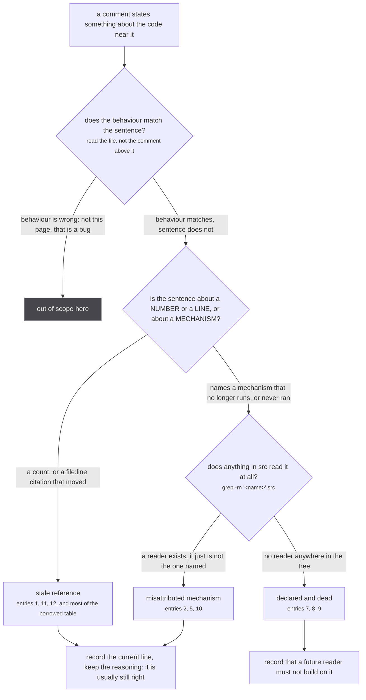
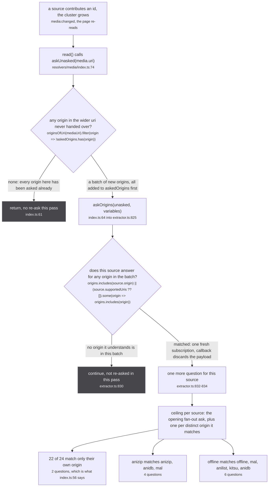
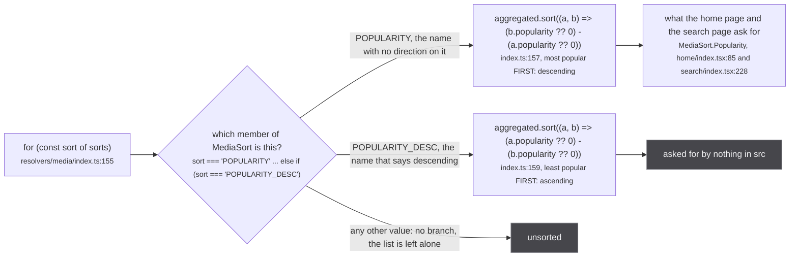
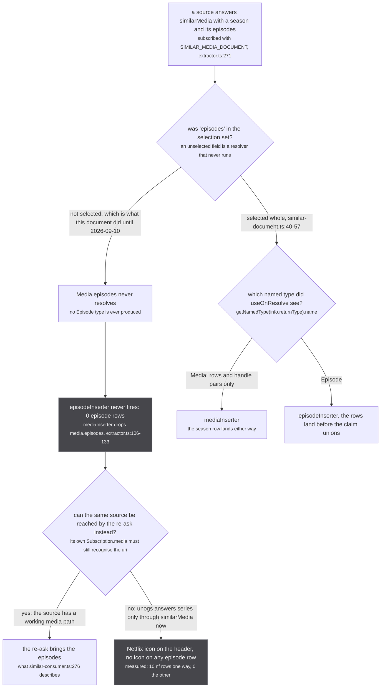

This codebase comments unusually well, and that is exactly why it needs this page. A sentence that
explains *why* a rule exists outlives the rule: the code moves, the sentence stays, and a reader
trusts it because everything around it has been true so far. Nothing here is a bug report. Every
entry is a place where the tree contains two accounts of itself and only one of them is current.

The rule for the whole site is that **the code wins**. Where a comment, a report or the page
inventory said one thing and the file said another, the file is what got written down and the
disagreement is recorded here.

Each entry states four things: what is claimed, where the claim lives, what the file actually does,
and which of the two is current. Where a claim was checked by running something rather than by
reading, the command is included.

## How an entry gets classified



*Eleven of the twelve entries below took the second branch at the first decision: the code does what it is supposed to do and only the sentence around it has drifted. Entry 4 is the exception, and it is on the page anyway because the inverted behaviour sits behind an enum member nothing sends, so from every call site in the app it reads as a naming divergence rather than as a defect.*

## The index

| # | where | the claim | what the code does | verdict |
| --- | --- | --- | --- | --- |
| 1 | `resolvers/media/index.ts:56` | "each source is asked at most twice" | true for 22 of the 24; anizip bounds at four questions, offline at six | formula current, numbers stale |
| 2 | `offline/extractor.ts:45-47` | `supportedUris` is "declarative only: nothing in the worker reads it" | `answersForOrigins` reads it at `supported.ts:29`, called from `extractor.ts:830` | was true, is not |
| 3 | `anizip/extractor.ts:13` | `supportedUris = ['anidb', 'mal']` | the resolver reads only `mal` (`:123-124`); an `anidb`-only cluster buys a re-ask that is guaranteed to refuse | declaration wider than the resolver |
| 4 | `resolvers/media/index.ts:156-159` | `POPULARITY` and `POPULARITY_DESC` | `POPULARITY` sorted descending and `POPULARITY_DESC` ascending: the names were swapped | FIXED 2026-09-12 on `redesign-representation`: `applyMediaSorts` in `store/filter.ts` reads `POPULARITY` as ascending and `POPULARITY_DESC` as descending, an unranked media sorts last both ways, and the home row and the search page now ask for `POPULARITY_DESC`. The figure below shows the code as it was |
| 5 | `extractor.ts:470` | a 15 minute response cache on every source yoga | `useResponseCache` exposes `onExecute` only, and every operation sent to a source yoga is a subscription | installed and inert |
| 6 | `extractor.ts:499-503` | `maskedErrors.maskError` | logs the error and re-wraps the same message; nothing is masked | the name, not the behaviour |
| 7 | `plugin-api.ts:17`, `imdb/extractor.ts:17` | `metadataOnly` "keeps it out of the playback paths" | no reader anywhere in `src`; `offline/extractor.ts:30` says so and is right | two comments disagree, offline's is current |
| 8 | `db.ts:46`, `sources/utils.ts:44` | episode containment: `EPISODE_PART_OF` and `episodePartOf` | the label is written at `db.ts:411` and read nowhere; the constructor is called nowhere | declared, written, dead |
| 9 | `schema.gql:471-489` | `MediaPage` has five cursors and four counts | the resolver returns `{ nodes: parent }` and nothing else; all nine resolve null | schema surface with no producer |
| 10 | `similar-consumer.ts:276` | the re-ask "is how the answer's episodes reach the store" | since 2026-09-10 the ask's own document selects `episodes`, which is the route that works when a source has no usable `media` path | both routes exist, the doc names the weaker one |
| 11 | `extractor.ts:230` | "each of the 23 sources" | 24, pinned at `tests/unit/sources/index.test.ts:19-24` | stale count |
| 12 | `docs/astro.config.mjs:17` | "the flow crosses ~36 sources" | 24 source modules; 36 counts JustWatch's provider mappings | stale count, owned by [reading these diagrams](/start/reading-the-diagrams/) |

---

## 1. How many times a source can be asked

Two comments in the tree count the same thing and get two different answers, and neither is the
number the code allows.

`src/worker/resolvers/media/index.ts:55-56`

> Terminates: an origin enters the set once and never leaves, and the cluster only ever gains
> members (union-find unions, it never splits), so each source is asked at most twice.

`src/worker/extractor.ts:812-819`

> Termination holds WITHOUT capping a source to one re-ask, and the cap would cost correctness. The
> caller only ever hands over origins it has never handed over before (`askedOrigins` in
> resolvers/media/index.ts grows and never shrinks), so a source is asked at most once per origin it
> declares plus once for its own: three questions for the widest source in the tree. Capping it at
> one instead means a source whose needed id lands in a LATER batch than the one that first named
> something it understands is asked too early, refuses, and never gets another chance. anizip
> survives that cap only because anilist happens to contribute anidb, kitsu, mal and offline in a
> single upsert.

The second comment's *formula* is the current one and the second comment's *number* is not.



*A source is re-asked once per BATCH that names something it understands, and `askOrigins` at `src/worker/extractor.ts:825-836` keeps no memory of its own. The only bound is `askedOrigins` in the caller, which is keyed on origin and not on source.*

The arithmetic. `askedOrigins` (`resolvers/media/index.ts:58`) is seeded from the uri the page was
opened with, and `askUnasked` (`:59-65`) adds every newly named origin to it before handing that
batch to `askOrigins`. So each origin is handed over exactly once for the life of the subscription,
and a source can be re-subscribed once per batch in which any origin it matches appears. Its ceiling
is therefore the number of distinct origins it matches.

- 22 of the 24 declare `supportedUris` naming only their own origin, so they match one origin and
  bound at two questions. `index.ts:56` is right about those.
- **anizip** declares `['anidb', 'mal']` (`src/sources/anizip/extractor.ts:13`) and publishes under
  `anizip`, so it matches three origins: the opening ask plus three re-asks, four questions.
- **offline** declares `['offline', ...INDEXED_ORIGINS]` (`src/sources/offline/extractor.ts:48`)
  where `INDEXED_ORIGINS = ['mal', 'anilist', 'kitsu', 'anidb']`
  (`src/sources/offline/index-lookup.ts:20`), so it matches five origins: six questions. It, and not
  anizip, is the widest source in the tree.

The ceiling is a ceiling, not a measurement. `extractor.ts:818` records that anilist contributes
anidb, kitsu, mal and offline **in a single upsert**, which arrives as one batch, so offline is
re-asked once in practice. Reaching six needs those five origins to land in five separate reads.

Termination is untouched by any of this, and that is what both comments were actually written to
prove: `askedOrigins` only grows, the union-find only unions, so the set of unasked origins strictly
shrinks. The bound exists; it is six rather than two or three.

Logged in more detail on [the re-ask](/request/re-ask/), which found the same two numbers
independently.

---

## 2. `supportedUris` was declarative and is not

`src/sources/offline/extractor.ts:45-47`

> Answers about other catalogues' uris, not only its own, which is the anizip pattern. Note this
> export is declarative only: nothing in the worker reads it, so what actually decides is the
> resolver below.

That was true when it was written. It is now read, on every re-ask:

```ts
export const answersForOrigins = (source: Answerable, origins: readonly string[]): boolean =>
  origins.includes(source.origin)
  || (source.supportedUris ?? []).some(origin => origins.includes(origin))
```

`src/sources/supported.ts:27-29`, called at `src/worker/extractor.ts:830` through a structural cast
(`const definition = extractor.extractor as Answerable`, `:829`) because `supportedUris` is not on
the `ExtractorDefinition` type at `extractor.ts:164-172`. The module that added the reader records
the change itself, at `src/sources/supported.ts:25`:

> `supportedUris` is declared by every source in this directory and was read by nothing until this.

The half of the sentence that is still true is the second half. The resolver decides what the source
*answers*; `supportedUris` decides whether the question is ever *put*. Also logged on
[the 24, and what each answers](/sources/registry/) and [what a source is](/sources/contract/).

---

## 3. anizip declares two id spaces and reads one

`src/sources/anizip/extractor.ts:13`

```ts
export const supportedUris = ['anidb', 'mal']
```

The resolver, at `:120-125`:

```ts
subscribe: async function*(_, { input: { uri } }, ctx: ExtractorServerContext) {
  if (!uri || !isAggregatedUri(uri)) return yield { media: null }
  const uris = fromAggregatedUri(uri)
  const malId = uris?.handleUrisValues.find(uri => uri.origin === 'mal')
  if (!malId) return yield { media: null }
  yield { media: await fetchMALMappings(malId.id, ctx) }
}
```

There is no `anidb` branch. The `anidb` half of the declaration is not vestigial by accident either:
`fetchAnizipJsonMappings` (`:105`) and `fetchAnizipMappings` (`:109`) both accept
`'anilist' | 'mal' | 'anidb'`, and the only wrapper anyone defined is
`fetchMALMappings = (id, context) => fetchAnizipMappings('mal', id, context)` at `:114`. The upstream
supports it, the transport supports it, the resolver never asks.

The cost is a wasted question rather than a wrong answer. A cluster that gains an `anidb:` handle and
no `mal:` one satisfies `answersForOrigins`, is re-asked, opens a subscription, and refuses at `:124`
with `yield { media: null }`. No upstream request is made. Walked through branch by branch on
[how a source recognises itself](/request/self-selection/).

---

## 4. The two popularity sorts are inverted

The only entry on this page where the behaviour, not the sentence, is the thing that is wrong.

`src/worker/resolvers/media/schema.gql:424-427`

```graphql
enum MediaSort {
  POPULARITY
  POPULARITY_DESC
}
```

`src/worker/resolvers/media/index.ts:154-161`



*Both call sites in the app ask for `POPULARITY` and get descending order, which is what they want. `POPULARITY_DESC` is the only member of the enum whose name describes the other one's behaviour, and the only member nothing requests.*

A `sort` comparator returning `b - a` puts the larger value first. So `POPULARITY` at `:157` is
descending and `POPULARITY_DESC` at `:159` is ascending, which is the reverse of both names. The
reason this has never surfaced is that the two consumers, `src/router/home/index.tsx:85` and
`src/router/search/index.tsx:228`, both send `MediaSort.Popularity`, and descending is the order a
popularity ranking is supposed to have. The bug is real and sits behind an enum member nothing sends.

Note that the loop is `for (const sort of sorts)` over the whole array, so two members in one request
run two full sorts and the last one wins. That is not a divergence, only the consequence of the same
shape.

---

## 5. The response cache is installed and inert

`src/worker/extractor.ts:470`

```ts
useResponseCache({ session: () => null, ttl: 15 * 60 * 1000 }),
```

Fifteen minutes, on the yoga of every source, built-in and plugin alike, because it sits inside
`makeExtractor`. It caches nothing, ever.

`@envelop/response-cache` returns a plugin whose hooks are `onSchemaChange` and `onExecute`. Checked
directly, because a claim about a dependency deserves it rather than a reading of the docs:

```sh
grep -c "onSubscribe" node_modules/@envelop/response-cache/cjs/plugin.js   # 0
```

Zero. A subscription never goes through `execute`, so the plugin is never given the operation.

The worker's own comment gets this right, at `src/worker/resolvers/media/index.ts:51-53`:

> Asking the newly named origins rather than re-running the whole fan-out matters: nothing caches
> this path (@envelop/response-cache hooks onExecute and skips subscriptions), so a blanket re-fan
> would re-hit every upstream on every merge.

The refinement the code adds is that "this path" is every path. There is no operation of any other
kind: the five places that talk to a source yoga all call `.subscription(...)`
(`extractor.ts:271`, `:750`, `:833`, `resolvers/origin/index.ts:22` and `:51`), and the merged
default resolver set gives sources an empty `Query` and an empty `Mutation`
(`extractor.ts:444-447`). So the cache is not merely bypassed by the fan-out, it has nothing at all
to cache. It is listed in [every constant](/reference/constants/) because it is a real constant, not
because anything reads it.

---

## 6. `maskError` does not mask

`src/worker/extractor.ts:499-503`

```ts
maskedErrors: {
  maskError(error, message, isDev) {
    console.error(`Server Extractor ${extractor.name} GQLError occurred:`, error)
    return new GraphQLError((error as Error).message)
  },
},
```

The hook exists to replace an error's message with a generic one before it crosses the wire. This
implementation logs the original and returns a fresh `GraphQLError` carrying **the same message**.
Both parameters that would let it mask, `message` (the generic replacement yoga offers) and `isDev`,
are accepted and unused.

That is deliberate rather than broken. Every one of these yogas is private and in-process, and the
caller is the worker's own fan-out, so a masked message would only hide a source's failure from the
code trying to log it. The app-facing yoga states the same intent without the ceremony:
`src/worker/yoga.ts:28` is simply `maskedErrors: false`. Only the name of the hook says otherwise.

---

## 7. Three exports nothing reads, and two comments that disagree about one of them

`metadataOnly`, `official` and the module-level `categories` are declared by source modules and read
by nothing in `src`.

| export | declared | in `ExtractorDefinition`? | reader |
| --- | --- | --- | --- |
| `metadataOnly` | most sources; `plugin-api.ts:17` asks plugin authors for it | yes, `extractor.ts:171` | `plugin-sources.ts:77` copies it onto `meta`, which reaches `makeExtractor`. Nothing reads it after that. `normalizeOrigin` (`extractor.ts:72-79`) does not take it, `StoreOrigin` (`store/types.ts:153-160`) has no such field, and it is not in `schema.gql`. |
| `official` | every source | no | none anywhere in `src` |
| `categories` (module level) | most sources | no | none. Each source re-states categories **per media**, inside `makeMedia({ categories: [...] })`, and that per-row field is very much alive: `store/filter.ts:65`, `aggregate.ts:388`, `fuzzy-merge.ts:312`. |

The interesting part is that the tree contains both accounts of `metadataOnly`.

`src/sources/imdb/extractor.ts:17-18`

> `metadataOnly` keeps it out of the playback paths; `isApiOnly` false is what lets `originPage`'s
> IsNotApiOnly filter return it, which is the whole point of the file.

`src/sources/offline/extractor.ts:30-31`

> `metadataOnly` gates nothing at all, for anybody: `normalizeOrigin` drops it, it is not in the
> GraphQL schema, and the one value read of it feeds a field nothing consumes.

**The offline comment is current.** The second half of imdb's sentence is exactly right and is the
real reason that file exists: `isApiOnly = false` is what lets an `imdb:` row render. The first half
names a gate that does not exist, and `grep -rn "metadataOnly" src/router src/components` returns
nothing, so there is no playback path reading it.

`metadataOnly` is the one of the three that carries a cost, because it is in the **public plugin
API** (`src/plugin-api.ts:17`). A third-party source author is asked to declare a field that decides
nothing. Anyone adding a real gate later should read it as unclaimed rather than as already wired.
The per-export detail is on [what a source is](/sources/contract/).

---

## 8. Episode containment is declared, written, and read by nothing

`src/worker/store/db.ts:45-46`

```ts
const EPISODE_SAME_AS = 'episode:same_as'
const EPISODE_PART_OF = 'episode:part_of'
```

`src/worker/store/db.ts:409-412`

```ts
for (const { episodeUri, handleUri, relation } of handles) {
  if ((relation ?? 'SAME_AS') === 'SAME_AS') graph.link(episodeUri, handleUri, EPISODE_SAME_AS)
  else graph.edge(episodeUri, handleUri, EPISODE_PART_OF)
}
```

`EPISODE_SAME_AS` has three readers: the link above, `IDENTITY_LABELS` at `db.ts:53`, and the cluster
walk at `db.ts:449` (`graph.cluster(ep.uri, EPISODE_SAME_AS)`). `EPISODE_PART_OF` has one writer and
no reader. `store/export.ts` walks labelled rows (`graph.labeled('media')`, `graph.labeled('episode')`
at `:34-35`) and no edges, so it does not see them either.

```sh
grep -rn "EPISODE_PART_OF" src tests --include=*.ts
```

returns exactly two lines: the declaration and the write.

So an episode handle with `relation: 'PART_OF'` is accepted, an edge is stored, and the edge is
invisible to every read on the site. Nothing is lost today, because the whole chain is dead end to
end: the constructor that would mint one, `episodePartOf` at `src/sources/utils.ts:44`, is exported
and called by nothing, and `makeEpisode` coerces a bare handle to `episodeSameAs` (`utils.ts:90`),
never to it. Three declarations, one write, no reader anywhere.

```sh
grep -rn "episodePartOf" src tests --include=*.ts   # 1 line: the declaration
```

Recorded so that a future reader does not assume episode containment is modelled and build on it.

:::danger
**The line above it is the one with no inverse.** `graph.link(episodeUri, handleUri, EPISODE_SAME_AS)`
at `src/worker/store/db.ts:410` runs with none of `upsertMedia`'s guards, and it accepts a uri that
was never `set`, because `find` calls `ensure`. The union-find gains a permanent member that
`graph.cluster` then skips for having no row. `graph.link` has no inverse: the only reset is
`resetStore()`, which empties the whole store and is tests only. See
[upsertEpisodes](/write/upsert-episodes/).
:::

---

## 9. `MediaPage`'s cursors and counts have no producer

`src/worker/resolvers/media/schema.gql:471-492` declares ten fields on `MediaPage`: five cursors
(`firstPageCursor`, `previousPageCursor`, `currentPageCursor`, `nextPageCursor`, `lastPageCursor`),
four counts (`currentPageNodeCount`, `totalNodeCount`, `beforeCurrentPageNodeCount`,
`afterCurrentPageNodeCount`) and `nodes`.

`src/worker/resolvers/media/index.ts:95`

```ts
resolve: (parent: Media[]) => ({ nodes: parent }),
```

Nine of the ten resolve null. Nothing in `src` writes or reads any of them:
`grep -rn "PageCursor\|NodeCount" src --include=*.ts --include=*.tsx` returns only the generated
schema types. The source-side default is the same shape,
`yield { mediaPage: { nodes: [] } }` (`extractor.ts:458`).

Two of the four counts already carry their own warning in the schema, which is worth reading as the
intent rather than as a description of anything running today:

`src/worker/resolvers/media/schema.gql:484`

> The total number of items. Note: This value is not guaranteed to be accurate, do not rely on this
> for logic

There is no pagination in this system to produce them. `Subscription.mediaPage` yields the whole
list, re-yields it on every debounced `media:changed`, and the page grows in place. The fields are
schema surface inherited from a paginated shape that was never built.

---

## 10. Which route the answer's episodes actually take

Two docstrings, both current in the sense that both mechanisms run, describing the same outcome by
different routes. The older one names the route that was measured delivering zero rows.

`src/worker/similar-consumer.ts:273-277`

> The claim goes through `upsertMedia` with no rows: the answer's own row lands through the answering
> extractor's insertion, the claim waits for it under `pendingClaims`, and a RUN x RUN union emits
> `media:changed`, which re-runs the page's read, whose re-ask of the newly named origin is how the
> answer's episodes reach the store. The container edge is never touched.

`src/worker/similar-document.ts:8-10`

> THE ROW is inserted whatever is asked for: `useOnResolve` in the extractor fires on the RESOLVER'S
> RETURN VALUE rather than on the selection set, so the whole Media lands even where a field is not
> selected. THE EPISODES ARE NOT, and this document said otherwise until 2026-09-10.



*The re-ask is a real route and it is conditional on something the consumer's docstring does not mention: the source having a `media` resolver that can still recognise the uri. The document's own selection is unconditional, which is why it is the one to build on.*

The measurement is in `src/worker/similar-document.ts:16-20`:

> Netflix is how this surfaced: since unogs' own search died it arrives ONLY as a `similarMedia`
> claim, its season media attached and its episodes never existed, so the media header carried the
> Netflix icon while every episode row showed none. Measured on the same cluster from two pages: the
> one whose own subscription owned the fan-out stored 10 nf episode rows, the one that gained the
> same nf run through this document stored 0.

Take `similar-document.ts` as current. The re-ask is what a source needs in order to contribute
everything *else*; the episode selection at `:40-57` is what guarantees the episodes specifically.
The full argument is on [the document](/similar/document/) and
[the loop, and what stops it](/similar/loop/).

---

## 11 and 12. Two stale counts

**`src/worker/extractor.ts:230`** opens the `SAFE_SHOW_ID` doc with:

> What a showId may look like, checked ONCE here rather than in each of the 23 sources.

There are 24, pinned by name and by length at `tests/unit/sources/index.test.ts:19-24`
(`expect(names).toHaveLength(24)`). The comment predates watchmode being re-enabled on 2026-09-05.
The rule it states is unaffected.

**`docs/astro.config.mjs:17`**, this site's own config, says the diagrams cross "~36 sources". Also
24. The 36 figure counts JustWatch's provider mappings rather than source modules. Owned by
[reading these diagrams](/start/reading-the-diagrams/), which carries the correction in full, and
repeated here because this is the page a reader checks a number against.

---

## Logged first on another page

These were found while writing the page that owns them. They are listed here so this page is the
whole index, with the argument left where it was made.

| where | the claim | what the code does | page |
| --- | --- | --- | --- |
| `justwatch/extractor.ts:35-36` | `buildOffersAsHandles` dedupes by package shortName | `:342` keys `seen` on `mappedOrigin` | [JustWatch](/sources/justwatch/) |
| `justwatch/id.ts:88` | "the nine mapped services" | 13 package keys onto **10** origins | [JustWatch](/sources/justwatch/) |
| `justwatch/extractor.ts:768` | the search query does not fetch seasons | it does; `mediaPage` passes an empty `opts` at `:770`, so no `seasonNumber` reaches `normalizeMedia` and `:470` refuses every series. Right outcome, wrong reason. | [JustWatch](/sources/justwatch/) |
| `justwatch/extractor.ts:305` cited from the request-context header | names the cross-source call site | that line is `jwCandidates` today; the call is `resolveEpisodeToSeriesId` at `:375` | [the request context](/request/request-context/) |
| `extractor.ts:801` | cites `crunchyroll/extractor.ts:247-252` for the yield-once generator | the resolver is at `src/sources/crunchyroll/extractor.ts:571-579` | [the re-ask](/request/re-ask/) |
| `resolvers/media/index.ts:45` | cites `sources/anilist/extractor.ts:320 against :295` | the split is `:367` against `:397` | [the re-ask](/request/re-ask/) |
| `offline/extractor.ts:26` | the `IsNotApiOnly` filter resolves at `db.ts:144-146` | it is at `src/worker/store/db.ts:539-543`; `db.ts:144-146` today is the scope ratchet | [what a source is](/sources/contract/) |
| `offline/extractor.ts:24` | the media modal's icon guard is at `media-modal.tsx:662` | `media-modal.tsx:781` today | [the 24, and what each answers](/sources/registry/) |
| the page inventory | the aggregate override pass runs `removeDuplicatesByField` after `byScore` for titles **and** trailers | only `titles` is sorted first; `aggregate.ts:397` dedupes `merged.trailers` raw | [aggregating a media](/read/aggregate-media/) |

---

## Checking one of these yourself

Every entry above was settled by one of three moves, and all three are cheap enough that a stale
sentence is never worth arguing about.

1. **Ask whether anything reads it.** `grep -rn "<name>" src --include=*.ts --include=*.tsx` over
   the whole tree, not the file the declaration is in. That is what settled entries 7, 8 and 9.
2. **Ask the dependency rather than its documentation.** `grep -c "onSubscribe"` inside
   `node_modules` settled entry 5 in one line, where reading the plugin's README would not have.
3. **Count the thing.** The registry count is pinned by a test
   (`tests/unit/sources/index.test.ts:24`), so entries 11 and 12 are decided by a file that fails
   when it goes wrong, which is the only kind of count worth citing.

The class these all belong to is worth stating plainly: **a comment is evidence about the past.** The
ones on this page are almost all still correct about *why* something is the way it is, and wrong only
about *what* currently implements it. That is the useful half surviving and the perishable half
rotting, which is the expected outcome and not an argument for fewer comments. The argument it makes
is for citing a mechanism by name rather than by line number, since a name is greppable and a line
number is not.
