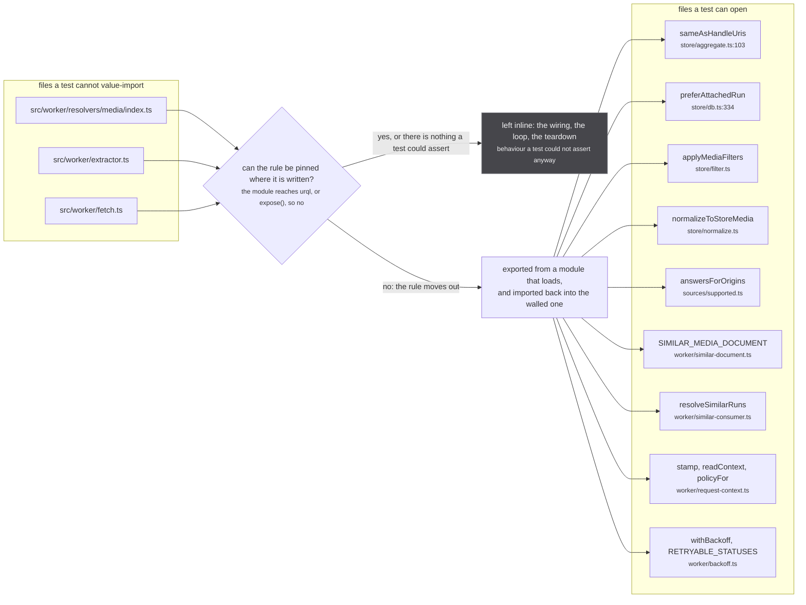

There are 197 files under `src/`. About sixty of them carry the data flow, and the rest are
components, hooks and route shells. This page names the sixty, says what each one owns, and answers
the question the tree does not: why so many of them are one-export modules with a long comment at the
top and nothing else in them.

That answer is almost always the same, and it is worth knowing before reading the tables.
`src/worker/extractor.ts:12` value-imports `Client` from `urql`. urql is CommonJS, it pulls a
`require('react')` that no resolve alias intercepts, and the test runner is `environment: 'node'`
(`vitest.config.ts:17`). So every module that value-imports `src/worker/extractor.ts` dies on import
under vitest, which means `src/worker/yoga.ts` and all four `src/worker/resolvers/*/index.ts` are
untestable in this repo. Anything inside them that deserved a test had to be moved to a file that
loads. That is why `normalize.ts`, `filter.ts`, `supported.ts`, `request-context.ts`,
`similar-document.ts`, `similar-consumer.ts` and `backoff.ts` exist as separate modules at all.

## The spine, by file

```mermaid
flowchart LR
  P["src/router/home/media-modal.tsx<br/><small>GET_MEDIA_MODAL, the deepest selection set on the site</small>"]
  U["src/urql.ts<br/><small>one Client, url http://d/graphql, fetch = handleRequest</small>"]
  WK["src/worker.ts<br/><small>osra expose, key 'yoga'</small>"]
  YO["src/worker/yoga.ts<br/><small>app yoga, maskedErrors: false</small>"]
  RM["src/worker/resolvers/media/index.ts<br/><small>Subscription.media</small>"]
  D1{"does the input name a uri?<br/><small>!requestedUri || !(isUri(requestedUri) || isAggregatedUri(requestedUri))</small>"}
  NOURI["console.warn, then return with no yield<br/>204 No Content, no source is asked"]
  EX["src/worker/extractor.ts<br/><small>proxyRequestToExtractors, joinFanout, makeExtractor</small>"]
  SB["src/sources/index.ts<br/><small>24 exports, one per source module</small>"]
  SU["src/sources/utils.ts<br/><small>sameAs, partOf, makeMedia, mergeHandles</small>"]
  D2{"what named type did the resolver return?<br/><small>getNamedType(info.returnType).name</small>"}
  NO["nothing inserted<br/><small>MediaHandle, MediaTitle, and every other type</small>"]
  NM["src/worker/store/normalize.ts<br/><small>normalizeToStoreMedia: the field list the store keeps</small>"]
  DB["src/worker/store/db.ts<br/><small>upsertMedia, upsertEpisodes, upsertOrigins</small>"]
  D3{"do both ends sit in the same scope?<br/><small>mediaScope !== handleScope</small>"}
  GL["src/worker/store/graph.ts<br/><small>graph.link: union-find, no inverse</small>"]
  GE["src/worker/store/graph.ts<br/><small>graph.edge run -&gt; container</small>"]
  EV["src/worker/store/events.ts<br/><small>emit('media:changed') when changed</small>"]
  AG["src/worker/store/aggregate.ts<br/><small>aggregateMedia: one cluster to one GQLMedia</small>"]
  CS["src/worker/store/consensus.ts<br/><small>alignRunEpisodes, runEpisodes</small>"]
  FL["src/worker/store/filter.ts<br/><small>applyMediaFilters, mediaPage only</small>"]

  P --> U --> WK --> YO --> RM --> D1
  D1 -->|"refused: names no uri"| NOURI
  D1 -->|"a uri or an aggregated uri"| EX
  EX --> SB --> SU --> D2
  D2 -->|"Media: mediaInserter, 250 rows per 50ms batch"| NM
  D2 -->|"Episode: episodeInserter, same batch, no dedupe"| DB
  D2 -->|"neither, so no inserter fires"| NO
  NM --> DB --> D3
  D3 -->|"cross-scope: an edge, whatever was claimed"| GE
  D3 -->|"same scope and claimed SAME_AS: a union"| GL
  GL --> EV
  GE --> EV
  EV -->|"read() re-runs: the answer path is a side channel"| RM
  RM --> AG --> CS --> FL

  classDef irrev fill:#b03f33,stroke:#e0796f,color:#ffffff
  classDef ratchet fill:#8f5a0e,stroke:#f2b45c,color:#ffffff
  classDef view fill:#4572b5,stroke:#8db0de,color:#ffffff
  classDef refuse fill:#46464b,stroke:#8b8c93,color:#f2f2f4
  class GL irrev
  class AG,CS,FL view
  class NOURI,NO refuse
```

*Fifteen files carry one media from the address bar to the screen, and only `db.ts` and `graph.ts`
change anything in it. The one rose node is `src/worker/store/graph.ts:27`, reached from
`src/worker/store/db.ts:193`.*

The three decisions on that figure are the three places a file boundary matters.
`src/worker/resolvers/media/index.ts:34` is the refusal gate, and it lives in a module no test can
open, which is exactly the problem the second half of this page is about.
`src/worker/extractor.ts:473-493` is the named-type switch, the reason
`src/worker/store/normalize.ts` is a separate file at all: the field list it keeps is what an inserted
row is, and it was worth pinning. `src/worker/store/db.ts:187` is the scope test that decides between
`graph.link` at `:193` and `graph.edge` at `:189`.

## The map

Grouped by what a file does, not by where it sits. Line counts are the working tree at `883aec9`.

### The page

| file | what it owns | why it lives where it does |
|---|---|---|
| `src/urql.ts` | the one page-side urql `Client`, at the fake url `http://d/graphql`, whose `fetch` is `handleRequest` across the worker boundary rather than a network call | one client for three call sites, so graphcache is shared |
| `src/urql-keys.ts` | the graphcache key resolvers, one per schema type | `src/urql-keys.ts:1-3`: split out of `./urql.ts` because *that module imports urql itself, and through it a CommonJS require of react that cannot load outside a browser* |
| `src/router/home/media-modal.tsx` | `GET_MEDIA_MODAL` plus the two origin subscriptions, `decodeRouteUri` on the route param, and the address rewrite | the deepest selection set on the site, and the selection set is what every source is asked with |
| `src/router/home/theater.tsx` | `GET_THEATHER_MEDIA`: no episodes, no relations, no franchise | the hero reads almost nothing, and that changes what gets stored |
| `src/router/home/index.tsx` | `GET_RELEASING_MEDIA_PAGE`, the one call site with no `pause` | |
| `src/router/home/episode-origins.ts` | `episodeOriginIds`, `SAME_AS` handles only | pulled out of the component so the SAME_AS rule can be tested |
| `src/router/watch/index.tsx` | `GET_WATCH_MEDIA`, the only document selecting `embedUrl`; `playableHandlesOf` | |
| `src/router/search/index.tsx`, `params.ts`, `display.ts` | the search page and its url params | `params.ts` and `display.ts` are split out with the testability reason stated in each |
| `src/sources/players.ts` | the origin to player-component map (`cr`, `nf`) | the only module under `src/sources/` that imports a `.tsx`, and no extractor imports it |
| `src/plugins.ts` | `connectPlugin`, the reconnect loop, `RECONNECT_DELAY_MS = 3_000` | page-side, because a plugin connects over `@fkn/lib` packages |
| `src/store-export.ts` | `window.__stubExportStore`, attached only under `?export=store` | see its header: the flag's absence is what tells the exporter the flag never arrived |

### The worker boundary

| file | what it owns | why it lives where it does |
|---|---|---|
| `src/worker.ts` (49L) | the osra `expose` on the page side, and one resolver back to the worker: `fetch`, with the seed refusal | `src/worker.ts:14-15` states the refusal shape: 404, never 503 |
| `src/worker/index.ts` (3L) | the worker entry: `./polyfills`, `./yoga`, `./store` | three imports, in that order |
| `src/worker/yoga.ts` (76L) | the app-level yoga, `maskedErrors: false`, and the osra resolver surface (`setUserKeys`, `registerRemoteSource`, `exportStore`, ...) | reaches `extractor.ts`, so it cannot be tested |
| `src/worker/fetch.ts` (18L) | `fetch` and `fetchWithBackoff`, over osra | calls `expose()` at module scope, which needs a transport that does not exist under node |
| `src/worker/backoff.ts` (80L) | `withBackoff`, `RETRYABLE_STATUSES`, `MAX_RETRIES`, `retry-after` parsing | split out of `fetch.ts` with **no imports**, for the reason above |
| `src/utils/fetch.ts` (6L) | `cloud.fetch` from `@fkn/lib` | the outermost hop, page side |

### The fan-out

| file | what it owns | why it lives where it does |
|---|---|---|
| `src/worker/extractor.ts` (851L) | `makeExtractor`, `proxyRequestToExtractors`, `joinFanout`, `askOrigins`, the three DataLoaders, plugin registration, and the `similarMedia` funnel | the single largest module on the path, and the one nothing can import under vitest |
| `src/worker/request-context.ts` (149L) | `openRoot`, `descend`, `mint`, `readContext`, `policyFor`, `stamp`, `POLICY`, `UNKNOWN_POLICY` | imports nothing from the worker or the store, on purpose |
| `src/worker/similar-document.ts` (60L) | `SIMILAR_MEDIA_DOCUMENT`, the selection set a `similarMedia` ask uses | its own module so a test can parse and validate it |
| `src/worker/similar-consumer.ts` (306L) | `resolveSimilarRuns`, the ask planner, the show check, and the claim | pure of the extractor, so the asking and the claiming can be pinned |
| `src/worker/plugin-sources.ts` (141L) | `readPluginSources`, `readPluginPayload`, `PLUGIN_ORIGIN_TOKEN` | `src/worker/plugin-sources.ts:1`: *nothing here touches the graph or the source barrel, so it stays importable outside a browser* |
| `src/sources/supported.ts` (29L) | `answersForOrigins` and the `Answerable` type | no imports at all |

### The app resolvers

| file | what it owns | why it lives where it does |
|---|---|---|
| `src/worker/resolvers/index.ts` | joins the four schema strings and the four resolver maps | |
| `src/worker/resolvers/media/index.ts` (260L) | `Subscription.media`, `Subscription.mediaPage`, `Media.episodes`, `SEARCH_RELEVANCE_THRESHOLD = 0.7` | reaches `extractor.ts`; three of its rules were moved elsewhere so they could be tested |
| `src/worker/resolvers/media/schema.gql` (543L) | the wire types, including `input RequestContext` and `MediaHandleRelation` | the same generated `typeDefs` is served by the app and by all 24 private yogas |
| `src/worker/resolvers/episode/index.ts` (55L) | episode description parsing | |
| `src/worker/resolvers/origin/index.ts` (82L) | `Subscription.origin` and `Subscription.originPage`, which build their **own** fan-out loop with no `stamp` and no `fanouts` entry | |
| `src/worker/resolvers/*/fragment.ts` | `MediaFragment`, `EpisodeFragment`, `OriginFragment` | shared by the page documents |

### Sources

| file | what it owns | why it lives where it does |
|---|---|---|
| `src/sources/index.ts` (33L) | the barrel: 24 `export * as <name>` lines, pinned by `tests/unit/sources/index.test.ts:24` | a source is disabled by deleting one line here, which is why the test exists |
| `src/sources/<name>/extractor.ts` (24 files) | one source each: its `origin`, `supportedUris`, `isApiOnly`, `SCORE` and its resolvers | |
| `src/sources/utils.ts` (509L) | `sameAs`, `partOf`, `makeMedia`, `buildHandlesFromUri`, `mergeHandles`, `normalizePage`, and the frizbee/sacha title scoring | shared by every source; its one import of `worker/extractor.ts` is `import type`, so it is erased |
| `src/sources/similar.ts` (338L) | `pickSimilarSeason`, `answerNamesOurShow`, `SHOW_TITLE_THRESHOLD` and the evidence rules | `src/sources/similar.ts:14-15`: it imports only the pure helpers *so it loads under vitest and inside every extractor alike* |
| `src/sources/season.ts` (228L) | `parseSeasonNumber`, `isOnlySeasonLabel`, `seasonScopedId(id, n)` at `:189` | no imports |
| `src/sources/catalogue-gate.ts` (297L) | `pickGatedCandidate`, `SEASON_DATE_WINDOW`, `CONFIDENT_TITLE_THRESHOLD`, `MAX_CATALOGUE_CANDIDATES` | imports only `./utils` and `./season` |
| `src/sources/justwatch/id.ts` (144L) | `jwId`, `splitJwId`, `providerContentId`, `PACKAGE_ORIGIN_MAP`, `extractContentId` | every host branch in `extractContentId` is measured, and the failure mode is silent |
| `src/sources/aired-date.ts`, `next-airing.ts`, `average-score.ts`, `mal-image.ts` | small shared field helpers | each import-free or type-only, each with the reason in its header |
| `src/sources/anilist/frontend.ts`, `jikan/season-scrape.ts`, `kitsu/season-paging.ts`, `kitsu/stream-id.ts` | one fallback or paging rule each, per source | same pattern: no runtime imports |
| `src/sources/offline/seed.ts`, `seed-gate.ts`, `seed-build.ts`, `seed-source.ts`, `index-lookup.ts` | the season seed's shape, its publish gate, its builder and the generated id index | `seed.ts` and `seed-gate.ts` must load **in node directly**, through type stripping, which is a stricter rule than the rest of this page |
| `src/sources/key-configs.ts` (47L) | which sources ask for a user key, and where to get one | split for a bundle reason, not a test one: the settings page reads it on the main thread without pulling the worker and WASM bundle |

### The store: writing

| file | what it owns | why it lives where it does |
|---|---|---|
| `src/worker/store/db.ts` (546L) | `upsertMedia`, `upsertEpisodes`, `upsertOrigins`, `IDENTITY_FIELDS`, `pendingClaims`, `SHOW_LEVEL_ORIGINS` at `:42`, and every read below | the one module both halves of the store go through |
| `src/worker/store/graph.ts` (400L) | `createGraph`, `createUnionFind`, `set`, `link`, `connect`, `edge`, `cluster`, `componentId`, `lastWriteLongestArray` at `:388` | pure data structure, no store vocabulary in it |
| `src/worker/store/normalize.ts` (78L) | `normalizeToStoreMedia`, `normalizeToStoreEpisode`, `normalizeOrigin` | pulled out of `extractor.ts` so a dropped field would not go unpinned |
| `src/worker/store/types.ts` (160L) | `Media`, `Episode`, `Origin`, `MediaScope`, and the enums the schema mirrors | |
| `src/worker/store/events.ts` (147L) | `emit`, `listen`, `listenIterator`, `listenMultipleIterator`, `debouncedListenIterator` | `listen` is exported for no other reason than `events.ts:16`: *Exported so a test can COUNT emissions* |

:::danger[Two of the files above write things nothing can undo]
`src/worker/store/graph.ts:18-54` is the whole `Graph<T>` surface. It has `set`, `link`, `connect`,
`edge`, `alias` and `clear`. There is no `unlink`, no `unset` and no `delete`, and `clear` is marked
*Tests only* at `:52`. `link` is a union-find union, and `graph.ts:28-33` says what that costs:

> Write the undirected adjacency of `label` without unioning anything, and say whether the pair is
> new. What `link` does minus the union-find half: an adjacency records WHO said what about which
> pair, where a union-find records only the component and can never be asked what it would hold
> with one node removed.

`graph.set` is not recoverable either. `lastWriteLongestArray` (`graph.ts:388-399`) is
last-write-wins per scalar and longest-wins per array, keeping no provenance, so nothing downstream
can ask what a given origin said. Both are reached from `src/worker/store/db.ts` and from nowhere
else on the write path.
:::

### The store: reading

| file | what it owns | why it lives where it does |
|---|---|---|
| `src/worker/store/db.ts` | `findMediaForPage`, `findAggregatedMedia`, `findAllAggregatedMedia`, `preferAttachedRun` at `:334`, `findRunsOfContainer`, `findPartOfMedia`, `hideAttachedContainers`, `findAggregatedEpisodesForMedia`, `mergeByEpisodeNumber` at `:475`, `findRunEpisodes` | `preferAttachedRun` is here rather than in the resolver so it can be pinned |
| `src/worker/store/aggregate.ts` (451L) | `aggregateMedia`, `aggregateEpisode`, `recursivelyUnwrapMediaHandles` at `:135`, `sameAsHandleUris` at `:103` | `sameAsHandleUris` was exported out of `Media.episodes` for the reason quoted below |
| `src/worker/store/consensus.ts` (291L) | `tieredConsensus`, `runLength`, `alignmentOffset`, `alignRunEpisodes`, `runEpisodes` | every one of these is a view: it renumbers a copy and never the stored node |
| `src/worker/store/fuzzy-merge.ts` (670L) | `fuzzyMergeMediaClusters`, `SIMILARITY_THRESHOLD = 0.9`, `MAX_TITLES_PER_CLUSTER = 6`, the five gates | a read that writes unions, which is why it is drawn dashed everywhere |
| `src/worker/store/filter.ts` (80L) | `applyMediaFilters` and `MediaPageFilters` | kept out of `resolvers/media/index.ts` so it can be tested |
| `src/worker/store/export.ts` (109L) | `exportStore`: asserted adjacency only, never the unions | it reads and never writes, and says so |
| `src/worker/store/anomalies.ts` (72L) | ways a cluster can be visibly wrong about itself, with no expected answer needed | so the rules can be swept over a whole corpus |
| `src/worker/store/index.ts` (5L) | the barrel: types, events, db, aggregate, export | |

### Shared

| file | what it owns | why it lives where it does |
|---|---|---|
| `src/utils/uri.ts` (281L) | the grammar: `toUri`, `isUri`, `isAggregatedUri`, `isRoutableUri`, `fromAggregatedUri`, `originsOfUri`, `mostSpecific`, `extractAggregatedUriOrigin`, `decodeRouteUri`, `shouldGrowAddress` | one import, `./group-by` |
| `src/utils/merge.ts` | the deep merge `makeExtractor` builds each source's resolver map with | `mergeArrays: true, uniqueArrayItems: true, allowUndefinedOverrides: true` |
| `src/utils/export-flag.ts` | `readExportFlag`, `readNoSeedFlag`, `refusesSeedAsset` | read on both sides of the worker boundary |
| `src/utils/settled-order.ts`, `src/utils/theater.ts` | a listing's stable order, and which media the hero can be built from | both split out with **no app imports** so a test can reach them |
| `src/generated/schema/` | `typeDefs.generated.ts` and `types.generated.ts` | the same generated schema the app serves and every private yoga is built from |

## Why so many small files

More than thirty files under `src/` state, in their own header comment, that they exist as their own
module so that something can import them. It is one rule applied against four different walls, and it
is worth drawing, because the walls are not interchangeable and neither are the fixes.

```mermaid
flowchart LR
  T["a test under tests/unit/<br/><small>vitest, environment: 'node', include tests/unit/**/*.test.ts</small>"]
  D1{"is the import type-only?<br/><small>import type { ExtractorServerContext } from '../../worker/extractor'</small>"}
  ERASED["erased at build: the module is never loaded.<br/>A walled module's TYPES are always reachable"]
  D2{"does the module value-import urql?<br/><small>import { Client, fetchExchange, getOperationName } from 'urql'</small>"}
  W1["Cannot find module 'react'<br/><small>urql is CommonJS and no resolve alias intercepts its require</small>"]
  D3{"does it call osra expose at module scope?<br/><small>expose(&#123;&#125;, &#123; transport: globalThis, key: 'fetch' &#125;)</small>"}
  W2["needs a worker transport<br/><small>which does not exist under node</small>"]
  D4{"does it reach @fkn/lib?<br/><small>import &#123; cloud &#125; from '@fkn/lib'</small>"}
  W3["@fkn/lib cannot load under vitest"]
  D5{"is the rule inside a preact component?<br/><small>environment: 'node', so there is no DOM</small>"}
  W4["cannot be tested here at all"]
  OK["the module loads and its exports are callable"]

  T --> D1
  D1 -->|"import type: nothing is loaded"| ERASED
  D1 -->|"a value import, so the module runs"| D2
  D2 -->|"worker/extractor.ts, and everything that imports it"| W1
  D2 -->|"no urql"| D3
  D3 -->|"worker/fetch.ts"| W2
  D3 -->|"no expose at module scope"| D4
  D4 -->|"utils/fetch.ts, plugins.ts, party/index.ts"| W3
  D4 -->|"no @fkn/lib"| D5
  D5 -->|"a .tsx component"| W4
  D5 -->|"plain TypeScript"| OK

  classDef irrev fill:#b03f33,stroke:#e0796f,color:#ffffff
  classDef ratchet fill:#8f5a0e,stroke:#f2b45c,color:#ffffff
  classDef view fill:#4572b5,stroke:#8db0de,color:#ffffff
  classDef refuse fill:#46464b,stroke:#8b8c93,color:#f2f2f4
  class W1,W2,W3,W4 refuse
  class ERASED view
```

*Four walls, and the first branch is the one that makes the rest survivable: a type import is erased,
so `src/sources/utils.ts:1` can name `ExtractorServerContext` from a module no test can open.*

The `import type` branch is not a technicality. It is why 19 test files under `tests/unit/sources/`
value-import a real extractor and drive it: `tests/unit/sources/unogs/extractor.test.ts:12` and
`tests/unit/sources/appletv/extractor.test.ts:12` both write
`import type { ExtractorServerContext } from '../../../../src/worker/extractor'`, and the extractor
they are testing does the same at its own line 1. Nothing loads urql, so nothing breaks.

### Rules pulled across the wall, not files

The interesting cases are not whole modules. They are single rules that were living inside
`src/worker/resolvers/media/index.ts`, a file no test can open, and were exported out of it into a
file that loads. The behaviour did not change; only the address did.

*Nine rules, three of them out of one file. `Media.episodes` at
`src/worker/resolvers/media/index.ts:180-218` is thirty-nine lines, thirteen of them comment, and
every rule it turns on is defined somewhere else.*

Two of those moves carry their reasoning in the file, and both are worth reading whole.

`src/worker/store/aggregate.ts:93-95`, above `sameAsHandleUris`:

> Exported and used by `Media.episodes` rather than filtered inline there, because that resolver
> cannot be imported under vitest (it reaches urql, which is CommonJS) and an untestable filter on the
> most dangerous read in the tree is not good enough.

`src/worker/resolvers/media/index.ts:181-182`, at the call site, pointing back:

> SAME_AS ONLY. See `sameAsHandleUris`, which carries the reasoning and the test: this module
> cannot be imported under vitest, so the rule lives where it can be pinned.

And the same pattern for `preferAttachedRun`, `src/worker/resolvers/media/index.ts:68-70`:

> A show whose run is in the store is shown as that run: see `preferAttachedRun` in
> store/db.ts, where the choice lives so it can be pinned (this module reaches urql and
> cannot load under vitest).

`src/worker/store/filter.ts:1-5` states the general form, and names the other two in the same breath:

> The `mediaPage` filters that can be decided from an aggregated row, kept out of
> ../resolvers/media/index.ts so they can be tested. That module reaches urql and dies under vitest
> with a CommonJS `require('react')`, which is the same reason `sameAsHandleUris` lives in
> ./aggregate.ts and `normalizeToStoreMedia` in ./normalize.ts. A filter nothing can pin is a filter
> nobody can prove empties a page.

The `similarMedia` half went the same way. `src/worker/similar-consumer.ts:12-13`:

> Pure of the extractor on purpose: worker/extractor.ts cannot load under vitest, so the asking and
> the claiming are here and the resolver only wires them.

And `src/worker/similar-document.ts:1-2`:

> The document the `similarMedia` funnel subscribes with, in its own module so a test can parse and
> validate it: worker/extractor.ts reaches urql and cannot load under vitest.

`src/worker/request-context.ts:10-12` is the same rule stated as a constraint on the module rather
than an excuse for it:

> This module is the registry and the wire format. It deliberately imports NOTHING from the worker or
> the store, so it stays importable under vitest: `worker/extractor.ts` is not, because it imports
> `Client` from urql and through it react.

## The reason written beside a source module is stale, and the code says so

Seven modules under `src/sources/` carry a header saying they exist because **an extractor cannot be
imported under vitest**. `src/sources/catalogue-gate.ts:26-29` is the fullest version:

> Split into its own module, importing only ./utils and ./season, so it can be tested: an extractor
> pulls in the player components and, through them, a CommonJS `require('react')` that no resolve
> alias intercepts, so no extractor can be imported under vitest. ./season.ts exists for the same
> reason.

`src/sources/season.ts:9-10`, `src/sources/aired-date.ts:1-3`, `src/sources/average-score.ts:1-3`,
`src/sources/anilist/frontend.ts:3-5`, `src/sources/jikan/season-scrape.ts:3-5` and
`src/sources/kitsu/season-paging.ts:1-4` all say a version of it.

**That is not true today, and `vitest.config.ts:7-12` already records the correction:**

> Extractors themselves import FINE, and this comment claimed the opposite until 2026-08-31.
> Measured that day, one dynamic import each: all 23 of `src/sources/*/extractor.ts` load and their
> exports are callable. The claim had already cost something, since it is the stated reason
> stream-id.ts, season.ts and catalogue-gate.ts were split out of their extractors, and it nearly
> cost the regression test in tests/unit/sources/crunchyroll/extractor.test.ts, which drives the real
> `getMedia` against a stubbed `ctx.fetch`.

Three checks confirm it against the current tree. `src/sources/players.ts` is the only module under
`src/sources/` that imports a `.tsx`, and it is imported by exactly three page-side files
(`src/embed.tsx:2`, `src/router/watch/index.tsx:13`, `src/router/home/media-modal.tsx:28`) and by no
extractor. `src/sources/crunchyroll/extractor.ts:1` reaches `worker/extractor.ts` only as an
`import type`. And `tests/unit/sources/index.test.ts:6` value-imports the whole barrel,
`import * as sources from '../../../src/sources/index'`, then asserts
`expect(names).toHaveLength(24)` on it, which cannot happen if the barrel does not load.

So the source-side modules are still worth having: an import-free `season.ts` is easier to reason
about and faster to test than a 600-line extractor. The reason written next to them is simply no
longer the reason. The worker-side wall, which is the one this page opened with, is real and
unchanged.

The vitest comment's own count is dated: it says **23** extractors, measured 2026-08-31. There are
**24** `src/sources/*/extractor.ts` files today, matching `src/sources/index.ts` and the length
assertion in the test.

## Two notes where this page disagrees with the inventory it was written from

The docs inventory groups `src/worker/backoff.ts` with the modules split because
`worker/extractor.ts` reaches urql. The file says otherwise, and it is a different wall.
`src/worker/backoff.ts:1-3`:

> Retry policy for every upstream request an extractor makes, split out of fetch.ts with NO imports
> so it can be tested: fetch.ts calls osra's expose() at module scope, which needs a transport that
> does not exist outside the worker. Same reason src/sources/season.ts is its own module.

Two files state the vitest project's scope as *"src/worker, src/sources and src/utils only"*
(`src/utils/settled-order.ts:2-3`, `src/utils/theater.ts:1-3`). That was true when tests were
colocated under `src/`. Today `vitest.config.ts:16` reads `include: ['tests/unit/**/*.test.ts']`, a
glob over the test tree rather than the source tree, and `tests/unit/` holds `components/`,
`router/` and `party/` directories alongside `worker/`, `sources/` and `utils/`. The advice those
two comments give is still good; the boundary they cite has moved.
