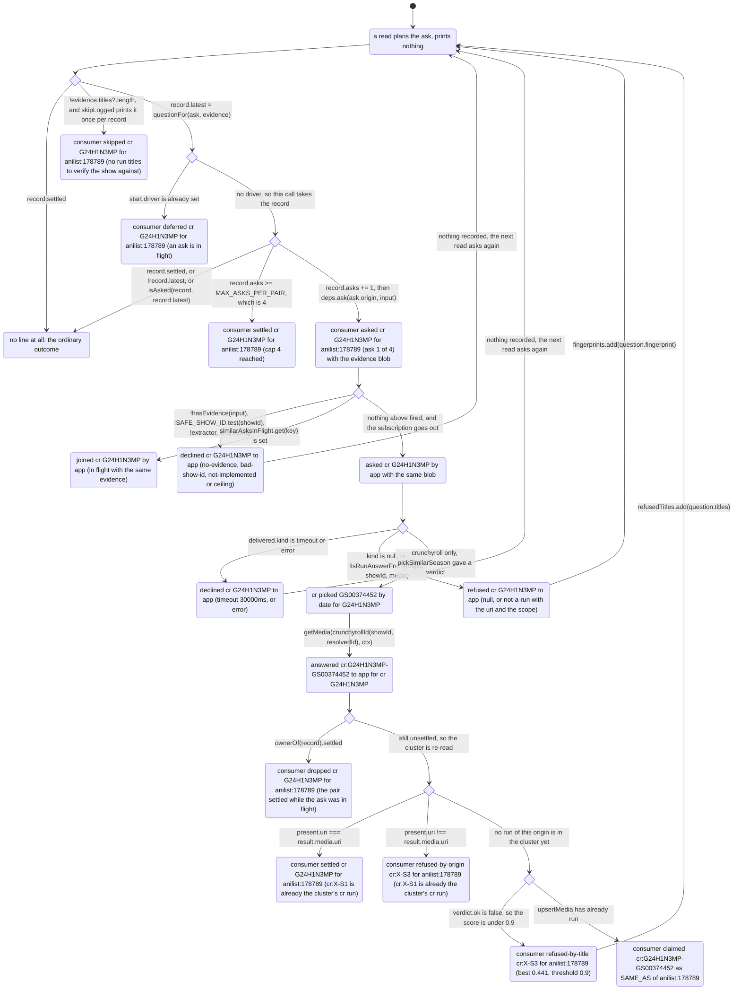
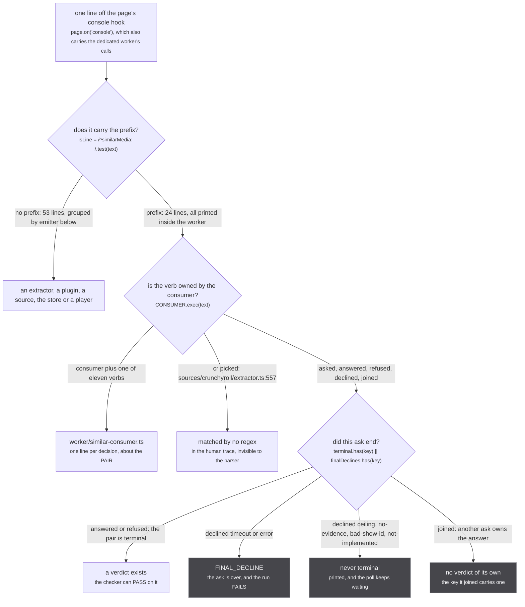

There is no logger in this app. No log module, no levels beyond the two the platform gives, no
`debug` namespace, no ring buffer, nothing that can be turned up in production. A `console.warn` is
the entire observability surface, and there are exactly **77 of them** in `src`.

That makes this page a reference rather than a tour: if a line appeared in your console, it came from
one of the calls below, and this is the list.

The argument for having any of them at all is one comment, above the first refusal a request can hit:

`src/worker/resolvers/media/index.ts:35`

> a refused page and a slow one are indistinguishable from outside the worker without this

Every line on this page exists for a version of that sentence.

## The surface, counted

| where | calls |
| --- | --- |
| `src/worker/` | 39 |
| `src/sources/` | 35 |
| `src/plugins.ts`, `src/urql.ts`, `src/components/player/video-surface.tsx` | 3 |
| **total** | **77**: 42 `console.warn`, 35 `console.error` |

`console.log`, `console.info` and `console.debug` appear **zero** times in `src`. Nothing strips the
survivors either: there is no `drop_console` in `vite.config.ts`, and `scripts/check-similar-media.mjs`
reads these lines off `https://anime.fkn.app`, which is the proof they reach a production build.

**24 of the 77 carry the prefix `similarMedia: `.** Those are not diagnostics. They are a parsed
interface, and they are what the first diagram below traces, line by line.

## `similarMedia: ` is an interface

`src/worker/extractor.ts:310-312`

> Every branch says what it did on one `similarMedia: ` line, for EVERY caller: the funnel is the one
> place that sees them all, and scripts/check-similar-media.mjs reads these lines off the deployed
> worker's console.

The subsystem has no unit test, because `worker/extractor.ts` reaches urql and cannot load under
vitest ([the funnel](/similar/funnel/) covers what that cost). What replaced the test is a script that
opens a real run's page and reads the console, so the shape of each line is load bearing: one line, no
newline inside it, the verb second.

`scripts/check-similar-media.mjs:79-86` is the whole grammar:

```js
const isLine = text => /^similarMedia: /.test(text)
const ASKED = /^similarMedia: asked (\S+) (\S+) by '([^']*)'/
const ANSWERED = /^similarMedia: answered (\S+) to '[^']*' for (\S+) (\S+)$/
const REFUSED = /^similarMedia: refused (\S+) (\S+) to '/
const DECLINED = /^similarMedia: declined (\S+) (\S+) to '[^']*' \((\S+)/
const CONSUMER = /^similarMedia: consumer (claimed|refused-by-title|refused-by-origin|refused|declined|settled|skipped|asked|deferred|merged|dropped) /
// a timeout or an error is the end of that ask; the consumer retries it on a later read, which this check does not wait for
const FINAL_DECLINE = new Set(['timeout', 'error'])
```

Eleven verbs in `CONSUMER` cover twelve consumer lines, because `settled` is printed by two different
branches. That collision is worth knowing before you count anything off a console.

Two tokens in these lines are caller-supplied and are laundered before they are printed:

`src/sources/similar.ts:290-295`

> A caller-supplied string as ONE log token: anything outside printable ASCII becomes `_`, capped at
> 128 characters, `-` for nothing. A valid show id (`SAFE_SHOW_ID` in worker/extractor.ts) prints
> unchanged; the two funnel lines printed BEFORE that check read a plugin's string, and a newline in
> it would break the one-line shape scripts/check-similar-media.mjs parses.

Read the code next to that: `extractor.ts:317` puts **both** the origin and the show id through
`printableToken`, while `extractor.ts:327`, the other line printed before `SAFE_SHOW_ID` runs, passes
`showId` through it and prints `origin` **raw**. At that point the origin has not been looked up in
the registry yet, which happens one branch later at `:330`. Only a show id can arrive from a plugin's
own argument, so the exposure is small, but the asymmetry is in the code and the comment reads as
though both lines were covered.

The evidence blob at the end of an `asked` line is one function:

`src/sources/similar.ts:279-282`

> `{day:2026-07-04, count:14, ordinals:3, parts:no, titles:5, episodeTitles:12}`: the evidence as the
> rules read it, for a log line. The day is the one `similarAskKey` reads, `-` when there is none; the
> two lengths are of the raw lists, so the reader sees what was sent.

## One pair, one session, every line it can print

The trace below is a single (run cluster, container) pair: the run `anilist:178789` and the container
`cr:G24H1N3MP`, which is the default the checker uses. Read it as a console session.



*The guards are drawn in the order the code runs them, which is why this is a ladder and not a fan: `resolveSimilarRuns` at `:289-296`, then `drive` at `:189-213`, then `similarOutcomeFrom` at `:316-386`, then the consumer again at `:222-256`. The transition that prints nothing is the one taken most often: a read whose question this pair has already put.*

The happy path is five lines, in this order, from three different files:

```text
similarMedia: consumer asked cr G24H1N3MP for anilist:178789 (ask 1 of 4) with {day:2026-07-04, count:12, ordinals:-, parts:no, titles:5, episodeTitles:12}
similarMedia: asked cr G24H1N3MP by 'app' with {day:2026-07-04, count:12, ordinals:-, parts:no, titles:5, episodeTitles:12}
similarMedia: cr picked GS00374452 by date for G24H1N3MP
similarMedia: answered cr:G24H1N3MP-GS00374452 to 'app' for cr G24H1N3MP
similarMedia: consumer claimed cr:G24H1N3MP-GS00374452 as SAME_AS of anilist:178789
```

The two `asked` lines are not a duplicate. The consumer prints one about the pair before it spends an
ask, the funnel prints one about the ask before the subscription goes out, and only the funnel's is
matched by `ASKED`.

:::danger
**Nothing logs the union.** The line that reports the weld is printed **after** it happened:
`similar-consumer.ts:254-256` sets `record.settled = true`, `await upsertMedia([], [{ mediaUri, handleUri, relation: 'SAME_AS' }])`,
and only then prints `claimed`. Inside that call, `graph.link` at `src/worker/store/db.ts:193` is a
union-find union with no inverse, and it prints nothing at all: not the link, not the component that
disappeared into another, not the scope that decided which of the four cells applied. A `claimed` line
is a receipt, never a chance to intervene. The only undo is `resetStore()`, which empties the whole
store and is tests only.
:::

## The funnel: `src/worker/extractor.ts`

Twelve of `extractor.ts`'s twenty-two calls belong to the funnel. Eleven are `similarMedia: ` lines,
one per branch of `similarOutcomeFrom`, and the twelfth is a `console.error` in `firstSimilarMedia`.

| line | level | template |
| --- | --- | --- |
| `:317` | warn | `similarMedia: declined <origin> <showId> to '<caller>' (no-evidence)` |
| `:327` | warn | `similarMedia: declined <origin> <showId> to '<caller>' (bad-show-id)` |
| `:332` | warn | `similarMedia: declined <origin> <showId> to '<caller>' (not-implemented)` |
| `:353` | warn | `similarMedia: joined <origin> <showId> by '<caller>' (in flight with the same evidence)` |
| `:359` | warn | `similarMedia: declined <origin> <showId> to '<caller>' (ceiling <n>/8 by caller, <m>/32 global)` |
| `:364` | warn | `similarMedia: asked <origin> <showId> by '<caller>' with <describeEvidence(input)>` |
| `:372` | warn | `similarMedia: refused <origin> <showId> to '<caller>' (not-a-run <uri> scope <scope>)` |
| `:375` | warn | `similarMedia: answered <answerUri> to '<caller>' for <origin> <showId>` |
| `:379` | warn | `similarMedia: refused <origin> <showId> to '<caller>' (null)` |
| `:383` | warn | `similarMedia: declined <origin> <showId> to '<caller>' (timeout 30000ms)` |
| `:386` | warn | `similarMedia: declined <origin> <showId> to '<caller>' (error)` |
| `:282` | error | `Error: Extractor <name> failed to answer similarMedia`, with the throw as `cause`, from `firstSimilarMedia` rather than from the ladder |

The numbers in the ceiling line are `MAX_SIMILAR_MEDIA_PER_CALLER` (`8`, `extractor.ts:227`) and
`MAX_CONCURRENT_SIMILAR_MEDIA` (`32`, `extractor.ts:216`); the timeout is
`SIMILAR_MEDIA_TIMEOUT_MS` (`30_000`, `extractor.ts:198`). They are printed rather than assumed,
which is what makes a ceiling decline readable without a debugger.

**`declined` and `refused` are not synonyms** and the difference is the whole reason for two words:
a decline never reached the source and may be retried, a refusal did reach it and is final for that
evidence. `extractor.ts:298-302` states it, and the consumer's memory implements it.

## The consumer: `src/worker/similar-consumer.ts`

Fourteen calls: twelve warn shapes, one per decision, plus the same `console.error` twice.

| line | verb | template |
| --- | --- | --- |
| `:123` | merged | `similarMedia: consumer merged <hits.length> records under <containerUri> (<members> members)` |
| `:191` | deferred | `... consumer deferred <origin> <showId> for <runUri> (an ask is in flight; asked when it settles if still new)` |
| `:209` | settled | `... consumer settled <origin> <showId> for <runUri> (cap 4 reached)` |
| `:213` | asked | `... consumer asked <origin> <showId> for <runUri> (ask <n> of 4) with <describeEvidence(evidence)>` |
| `:224` | dropped | `... consumer dropped <origin> <showId> for <runUri> (the pair settled while the ask was in flight)` |
| `:228` | declined | `... consumer declined <origin> <showId> for <runUri> (<reason>); retries on the next read` |
| `:233` | refused | `... consumer refused <origin> <showId> for <runUri> (<reason>); re-asks on new evidence` |
| `:242` | settled | `... consumer settled <origin> <showId> for <runUri> (<uri> is already the cluster's <origin> run)` |
| `:243` | refused-by-origin | `... consumer refused-by-origin <answerUri> for <runUri> (<uri> is already the cluster's <origin> run)` |
| `:251` | refused-by-title | `... consumer refused-by-title <answerUri> for <runUri> (best <score> of <n> run titles against <m> answer titles, threshold 0.9); re-asks on a new title` |
| `:256` | claimed | `... consumer claimed <answerUri> as SAME_AS of <runUri>` |
| `:293` | skipped | `... consumer skipped <origin> <showId> for <runUri> (no run titles to verify the show against)` |
| `:260`, `:301` | error | `Error: similarMedia consumer failed`, with the throw as `cause` |

Three of these read differently than they look:

**`merged` counts the records that intersected, not the ones absorbed.** The line is gated on
`others.length` at `:123` and prints `hits.length`, so two clusters merging into one prints
`merged 2 records`. The member count is read after `:122` has folded the current cluster's uris in, so
it is the survivor's size afterwards, not before.

**`settled` is printed by two unrelated branches**, the cap at `:209` and an origin already present at
`:242`. Only the parenthesis tells them apart, and only the second means an answer came back.

**`skipped` prints once per record, ever.** `record.skipLogged` at `:290-294` latches, so a run with a
date and a count and no title is silent on every read after the first, which is exactly the shape a
cold page has for its first second.

## The one source that logs its pick

`src/sources/crunchyroll/extractor.ts:557`

```text
similarMedia: cr picked <resolvedId> by <rule> for <showId>
```

Five sources implement `Subscription.similarMedia`: crunchyroll, unogs, justwatch, tvmaze, appletv.
**Only crunchyroll prints anything**; the other four extractor modules hold no `console` call at all, so a pick by
`pickSimilarSeason` inside them is invisible and the only trace it leaves is the funnel's `answered`.

That line also matches **none** of the five regexes above: `isLine` accepts it, so the checker prints
it in the trace it dumps, and `parse` counts it as nothing. It is the one `similarMedia: ` line
written for a human rather than for the parser.

## Where a line came from



*The two decisions that matter are not about severity: whether a line names the pair or the ask, and whether the ask it names is over. `scripts/check-similar-media.mjs:85-86` treats only `timeout` and `error` as ending an ask, which is why a ceiling decline is printed and then waited past.*

## Outside the funnel

### The page and the worker boundary

| file:line | level | template |
| --- | --- | --- |
| `src/worker/resolvers/media/index.ts:36` | warn | `media: refused '<input.uri>', which names no uri` |
| `src/worker/yoga.ts:32` | error | `Error: GQLError occurred on request: <operationName>`, with the error as `cause` |
| `src/urql.ts:25-40` | error | `Error: <error.message>`, with `GQL Error originated from <operationName>` as `cause` |

The first is the only line a refused page prints, and it is printed instead of yielding: the generator
returns, yoga answers 204 No Content, and the page waits forever. Without the line, from outside the
worker, that is indistinguishable from a slow source. See [the entry](/request/page-to-worker/).

### The fan-out and the per-source servers

| file:line | level | template |
| --- | --- | --- |
| `src/worker/extractor.ts:757` | error | `Error: Extractor <name> produced an unreadable fan-out result` |
| `:761` | error | `Error: Extractor <name> failed to join the fan-out` |
| `:836` | error | `Error: Extractor <name> failed to re-join the fan-out` |
| `:501` | error | `Server Extractor <name> GQLError occurred:` plus the error object |
| `:513` | error | `Error: Client Extractor <name> Network error on <operationName>:` |
| `:517` | error | `Error: Client Extractor <name> GraphQL error on <operationName>:` |

`extractor.ts:745`:

> one source must never be able to take down the fan-out: a source that cannot start is skipped

Those three fan-out lines are that comment's whole implementation. Only `:761` abandons the source;
`:757` is inside the result callback and the subscription lives on, and `:836` is a re-ask that fails
without touching the original join. [The fan-out](/request/fan-out/) draws all three.

`:501` is worth reading twice. It is the body of `maskedErrors.maskError`, and it does not mask: it
logs the error and returns `new GraphQLError((error as Error).message)`, the same message. It is a
logging hook wearing a masking name, recorded in [known divergences](/reference/divergences/).

### Plugins

| file:line | level | template |
| --- | --- | --- |
| `src/plugins.ts:105` | warn | `Plugin '<uri>' failed to connect:` plus the error |
| `src/worker/extractor.ts:586` | warn | `Plugin source '<origin>' yielded media from origin '<other>', dropped` |
| `:595` | warn | the same line, once per node, for `mediaPage` |
| `:693` | error | `Error: plugin '<pluginUri>': source '<origin>' failed to register` |
| `:699` | warn | `plugin '<pluginUri>': skipped source '<origin>' (<reason>)` |

`:699` loops over `failed`, which is seeded with `[...rejected]` from `readPluginSources` at `:675`,
so one line covers both a source rejected on its shape and a source that threw while registering. A
plugin whose sources all fail throws at `:703` instead, and that throw is what `plugins.ts:105` prints.

`:586` and `:595` are the only lines that report a claim being discarded rather than a failure. Note
what they do **not** cover, from `extractor.ts:577`:

> nested handles stay untouched: cross-origin handles are how clustering works (accepted residual, bounded by the aggregation score threshold)

### Sources: the "still answers" family

Every one of these prints and then returns an empty or partial answer, so the page degrades rather
than failing. They are the loudest group and the least urgent.

| file:line | level | template |
| --- | --- | --- |
| `src/sources/utils.ts:147` | error | `<label>: dropped a record that failed to normalize` plus the reason |
| `src/sources/anilist/extractor.ts:304` | error | `AniList request failed (HTTP <status>): <reason>` |
| `:307` | error | `AniList returned no data (HTTP <status>)` |
| `:361` | error | `anilist mapper for siteId <siteId> failed:` |
| `src/sources/anilist/frontend.ts:146-149` | error | `AniList frontend: no token in <n> bytes of the page (HTTP <status>)`, plus `, the PHP template came back un-rendered` when the html still holds `csrf_token()` |
| `:154` | error | `AniList frontend: could not reach the token page` |
| `:187` | error | `AniList frontend: request failed` |
| `:195` | error | `AniList frontend: the gate refused a freshly acquired pair` |
| `:200` | error | `AniList frontend request failed (HTTP <status>): <reason>` |
| `:203` | error | `AniList frontend returned no data (HTTP <status>)` |
| `src/sources/jikan/extractor.ts:200` | error | `Jikan search failed` |
| `:225` | error | `Jikan season page <page> failed` |
| `:252` | error | `Jikan <season> <year> page <page> failed` |
| `:325` | error | `MyAnimeList season scrape parsed no entries from <n> bytes` |
| `:333` | error | `MyAnimeList season scrape found no section headings, so carried-over shows cannot be told apart` |
| `:337` | error | `MyAnimeList season scrape failed` |
| `src/sources/kitsu/extractor.ts:242` | error | `Kitsu season page <page> failed` |
| `src/sources/offline/extractor.ts:97` | error | `offline: the bundled season data could not be loaded` |
| `:105` | error | `offline: the bundled id index could not be loaded` |
| `:126` | warn | `offline: no bundled data for <key>; the dump (<tag>) holds <seasons, or nothing>` |
| `src/sources/offline/seed-source.ts:60` | warn | `offline: <what> could not be read, the bundled data still answers` |
| `:82` | warn | `offline: <asset> is not a seed index, the bundled data still answers` |
| `:98` | warn | `offline: <asset> does not belong to this index, the index still answers` |

Two of these are worth reading as pairs with the comment above them.

`src/sources/utils.ts:133-136`, on why one bad record prints instead of throwing:

> A page resolver is all-or-nothing by default: a plain `.map` throws and a `Promise.all` rejects
> as soon as one record is malformed, so the source yields nothing and one bad entry costs the
> whole page. That is what turns a single odd upstream record into an empty feed, and it defeats
> the point of having several sources, since the surviving source goes dark too.

`src/sources/offline/seed-source.ts:73-75`, on why the seed lines all end the same way:

> Promises exactly one thing: it never rejects and never makes the page worse. A timeout, a 404, a
> body that is not gzip, and a payload the gate refuses all resolve to undefined, logged once, and
> the bundled half of this source keeps answering what it answers today.

`jikan:333` is the one line in this group that reports a *silent* wrong answer rather than a missing
one: with no section headings, MAL's carried-over long-runners cannot be told from the season, and the
row sorts on members, which is how One Piece and Meitantei Conan once took the first two slots.
Nothing else notices.

### The store logs once, and not where you would want it

`src/worker/store/aggregate.ts:142` is the **only** `console` call in the whole of
`src/worker/store/`:

```text
a handle of <media.uri> names no node and was skipped
```

`aggregate.ts:139-140`:

> a handle naming no node (a plugin's bare row that slipped past the boundary) claims nothing,
> and one of them must not fail the batch every extractor's rows share

`db.ts`, `graph.ts`, `fuzzy-merge.ts`, `consensus.ts`, `normalize.ts`, `filter.ts`, `export.ts`,
`anomalies.ts` and `events.ts` print nothing, ever. So no line marks a row landing, a scope
ratcheting from RUN to CONTAINER, a claim being deferred under `pendingClaims`, a fuzzy union, or the
`graph.link` itself. What you can observe of the store is what a later read shows.

### The player and the page

These are UI, not data flow, and they are here for completeness.

| file:line | level | template |
| --- | --- | --- |
| `src/components/player/video-surface.tsx:128` | warn | `[player] <selection.label> selection failed:` |
| `src/sources/crunchyroll/player.tsx:308` | error | `Failed to attach Crunchyroll frame` |
| `:396` | error | `Failed to load Crunchyroll player` |
| `:431` | warn | `[cr] track discovery failed:` |
| `src/sources/crunchyroll/timeline-seek.ts:10` | warn | `[cr] timeline seek failed:` |
| `src/sources/unogs/player.tsx:190` | error | `Failed to attach Netflix frame` |
| `:226` | error | `Failed to load Netflix player` |
| `src/sources/unogs/nf-videojs-player.tsx:63` | warn | `[nf] permission request failed:` |
| `:79` | warn | `[nf] seek: duration unknown <duration>` |
| `:102` | warn | `[nf] seek aborted: controls never revealed`, plus ` (blocked by <what>)` when something blocked |
| `:107` | warn | `[nf] timeline click failed:` |
| `:120` | warn | `[nf] timeline seek failed:` |

## The level is not severity

`claimed` is a `console.warn`. So is `answered`, so is `asked`, and so is every successful step in the
subsystem. Nothing in `src` calls `console.log` or `console.info`, so the practical rule is: filtering
a console to warnings and errors keeps the whole trace, and the level tells you nothing about whether
a pair is healthy. **Read the verb, not the colour.**

The split that does carry meaning is narrower than the level: an `Error` object with a `cause` is used
wherever a throw was caught (`extractor.ts:757`, `:761`, `:836`, `similar-consumer.ts:260`,
`yoga.ts:32`, `urql.ts:25`), so the stack survives; a plain string is used wherever the code decided
something rather than caught something.

## Where the lines land

Everything under `src/worker/`, and every `src/sources/*/extractor.ts`, prints inside the **dedicated
worker**, because that is where the store and the per-source yogas live. Only `src/urql.ts`,
`src/plugins.ts` and the player files print on the **page**.

They all reach one console anyway, and `scripts/check-similar-media.mjs:23-27` both says so and proves
it before it measures anything:

> CONTROLS, all before navigation, any failure exits 2 rather than reporting a result: the page has a
> dedicated worker (the store lives there); a `console.warn` evaluated INSIDE that worker and one in
> the page both arrive on the page's console hook with the prefix intact (Chromium delivers a
> dedicated worker's console calls on the page's `console` event); and a line carrying the token
> mid-sentence is NOT read as a similarMedia line.

The negative control is the part worth copying: a line reading
`probe control with no prefix, the token similarMedia: sits mid-line` must **not** be counted, or the
check would pass on its own noise. A grep for `similarMedia` across a console dump is not the same
thing as `isLine`, and the difference is exactly one anchored `^`.
