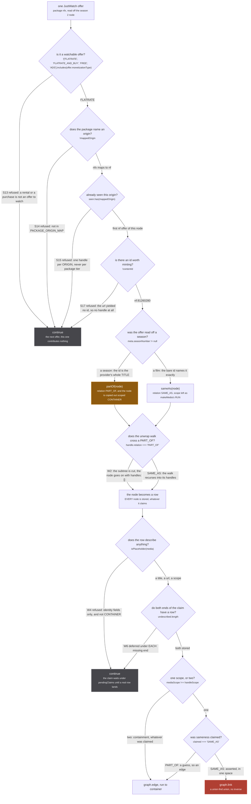

This is the index. Every other page on the site explains a handful of these in context; this one lists
them all, in one place, with the condition exactly as it is written in the file.

It exists because of a property of this codebase that is easy to state and hard to work with: **a
refusal is almost always silent.** One of them logs (`media/index.ts:36`, and it logs precisely
because it is otherwise invisible). The rest return `undefined`, `continue` past an item, end a
generator, or yield a null payload, and three of those render an identical empty page. When something
is missing from a page, the question is never "what threw" but "which of these fired", and the only way
to answer it is to have them written down.

The rule they all serve is stated in one line at `src/worker/store/db.ts:171`:

`src/worker/store/db.ts:171`

> Guesses go on edges, which are deletable; only asserted sameness within one scope goes on a union.

:::danger
**The reason this page is long is that one operation has no inverse.** `graph.link` is a union-find
union (`src/worker/store/graph.ts:82-104`), and `union` ends by destroying the record of which members
came from which side. There is no split, no unlink and no disunion in the repo; the only reset is
`resetStore()` (`db.ts:509-513`), which empties the whole store and is tests only. Every refusal in the
`S`, `K`, `P`, `W` and `F` families below is a step taken to keep the wrong pair away from that call.
`graph.set` is the other one worth knowing: scalars are last-write-wins, so a row that lands later
overwrites what an earlier one said, which is why the scope ratchet at `db.ts:146` exists at all.
:::

## How to read a row

Every table has the same four columns: an id, the site as `file:line`, the condition **verbatim**, and
what the caller sees next. The id is stable and is what other pages cite (`W5`, `C8`, `F14`). The
`C`, `F` and `A` ids are the ones the merge report assigned and are kept unchanged.

The fourth column is the one that matters, because the mechanism decides the blast radius:

| shape | what it costs | example |
| --- | --- | --- |
| `return undefined` | one value. The caller carries on. | `S38`, `P9` |
| `continue` | one item. The loop and its batch live. | `W4`, `F7` |
| `return` from an async generator | one request. Yoga answers **204 No Content** and the caller waits out its own timeout. | `E2`, `E9` |
| `yield { field: null }` | one request, answered. The caller reads the refusal off the first payload. | `E15`, `S1` |
| `throw` | one batch, up to 250 medias. | `S40`, `S41` |

The difference between the third and fourth rows is deliberate and is written down next to the code:

`src/worker/extractor.ts:459-462`

> most sources cannot answer show-plus-evidence, and the default has to YIELD that rather
> than end: a subscription generator that completes without yielding makes yoga respond
> 204 No Content, which the caller would sit on until its timeout instead of reading a
> refusal off the first payload

## One offer, eleven refusals, one union

The families below are ordered the way a claim travels, so here is one real claim travelling. A
JustWatch search hit for a series carries a Netflix offer on its season 2 node; this is every gate
between that offer and a permanent row in the store.

*Nine decisions, one rose node, and the only path that reaches it is a film's own id or a season the provider itself named.*

The offer loop is `src/sources/justwatch/extractor.ts:328-400`, the scope stamp on `partOf` is
`src/sources/utils.ts:40`, the unwrap cut is `src/worker/store/aggregate.ts:145`, and the three-way
routing at the bottom is `src/worker/store/db.ts:187-198`. This is the whole page in one figure: every
table below is a family of gates like these, and the tables are the reference.

---

## E. The entry path: the page, the worker, the fan-out

Everything before a source is asked anything.

| id | site | condition (verbatim) | outcome |
| --- | --- | --- | --- |
| E1 | `src/worker.ts:17` | `refusesSeedAsset(location.href, input)` | `404`, never 503. Same shape as the asset not being published yet, which the loader already answers `undefined` to; a 503 would be retried three times by `fetchWithBackoff`. |
| E2 | `src/worker/resolvers/media/index.ts:34` | `!requestedUri \|\| !(isUri(requestedUri) \|\| isAggregatedUri(requestedUri))` | `console.warn` at `:36`, then `return` at `:37`: the generator ends without yielding, yoga answers 204, the page sits empty. **The only refusal in the system that logs.** |
| E3 | `media/index.ts:72` | `if (!cluster.length) return undefined` | `read()` answers nothing, so nothing is yielded this round. The page waits for the next `media:changed`. |
| E4 | `media/index.ts:61` | `if (!unasked.length) return` | no re-ask: every origin the widened uri names has been asked already. `askedOrigins` only ever grows. |
| E5 | `media/index.ts:184` | `if (!handleUris.length) return parent.episodes ?? []` | `Media.episodes` falls back to whatever the aggregate carried; the store is not walked. |
| E6 | `media/index.ts:205` | `if (!episodeGroups.length) return parent.episodes ?? []` | same fallback, after the walk found nothing. |
| E7 | `media/index.ts:208` | `.filter(ep => ep.episodeNumber != null)` | an unnumbered episode never reaches the page. This is why `makeMovieEpisode` keeps `episodeNumber: 1` rather than null. |
| E8 | `media/index.ts:149` | `entry.score >= SEARCH_RELEVANCE_THRESHOLD` where the constant is `0.7` (`:21`) | a search hit whose title does not match the query is dropped: sources do loose, sometimes semantic, server-side matching. |
| E9 | `resolvers/origin/index.ts:19` | `if (!args.input.id) return` | 204. This path has no `stamp`, so any source reading `policyFor` on it counts a context miss and gets `UNKNOWN_POLICY`. |
| E10 | `resolvers/origin/index.ts:48` | `if (!args.input.ids \|\| args.input.ids.length === 0) return` | 204, same path, same missing stamp. |
| E11 | `extractor.ts:747` | `if (fanout.joined.has(extractor)) return` | a source registering mid-subscription joins exactly once. |
| E12 | `extractor.ts:751` | `if (!fanout.extractUris) return` | the fan-out result is not read. Only `mediaPage` passes an extractor, so a `MEDIA` root collects no uris at all. |
| E13 | `extractor.ts:760-762` | `catch (error) { console.error(...); return }` | that one source is skipped and the fan-out continues. One source must never be able to take down the fan-out. |
| E14 | `extractor.ts:830` | `if (!answersForOrigins(definition, originIds)) continue` | not re-asked. `answersForOrigins` is `origins.includes(source.origin) \|\| (source.supportedUris ?? []).some(origin => origins.includes(origin))` (`sources/supported.ts:27-29`). |
| E15 | `extractor.ts:457`, `:458`, `:463` | the merged defaults: `yield { media: null }`, `yield { mediaPage: { nodes: [] } }`, `yield { similarMedia: null }` | a delivered refusal rather than an end. See the quote above: ending instead would cost the caller its full timeout. |
| E16 | `extractor.ts:606` | `if (!subscribe) return` | a plugin field with no resolver: 204 for that field. |
| E17 | `extractor.ts:585` | `payload?.[field] && payload[field].origin !== origin` | `return { [field]: null }` plus a warn. A plugin may only ever name its own origin on `media` and `similarMedia`. |
| E18 | `extractor.ts:592`, `:594-596` | `if (!Array.isArray(nodes)) return payload`, then `node?.origin === origin` per node | per-node filter on `mediaPage`. **Nested handles are deliberately not checked**: cross-origin handles are how clustering works. |
| E19 | `plugin-sources.ts:59` | `!PLUGIN_ORIGIN_TOKEN.test(origin)` where the token is `/^[a-z0-9][a-z0-9-]{0,31}$/` (`:4`) | `rejected.push({ origin: origin \|\| '(none)', reason: 'origin must be a short lowercase token' })` and `continue`: reported and skipped, never fatal to its siblings. |
| E20 | `plugin-sources.ts:64` | `claimed.has(origin)` | `rejected` with `declared twice by '<pluginUri>'`, continue. |
| E21 | `plugin-sources.ts:91`, `:94`, `:99` | `if (!isObject(value)) return undefined`, `if (!isObject(handle.node)) return undefined` | a plugin row or handle that is not an object is dropped at the boundary rather than reaching the store. |
| E22 | `backoff.ts:75` | `if (!RETRYABLE_STATUSES.has(response.status) \|\| attempt >= MAX_RETRIES) return response` | the response is handed back unretried. `RETRYABLE_STATUSES = new Set([408, 429, 502, 503, 504, 522, 524])` (`:13`), `MAX_RETRIES = 3` (`:17`), so 4 attempts. **500 is deliberately absent.** |
| E23 | `backoff.ts:71` | `if (attempt >= MAX_RETRIES) throw error` | a rejected fetch, retried three times, finally rethrown to the source. |
| E24 | `router/home/media-modal.tsx:622`, `:485`, `:645`; `router/watch/index.tsx:191`, `:222`; `router/home/theater.tsx:184`; `router/search/index.tsx:272` | `pause: !uri`, `pause: !originIds`, `pause: !params.mediaUri`, `pause: !selectedMedia`, `pause: !asked` | urql never opens the subscription, so the worker is never asked. The home page has no pause, which is why it fans out on load. |

## S. A source deciding it is not the one to answer

### Self-selection

| id | site | condition (verbatim) | outcome |
| --- | --- | --- | --- |
| S1 | `sources/crunchyroll/extractor.ts:573` | `if (!_uri \|\| !(isUri(_uri) \|\| isAggregatedUri(_uri))) return yield { media: null }` | a delivered null on the first payload. The generator yields once and ends: **there is no retry inside a source**, which is the whole reason `askOrigins` exists. |
| S2 | `crunchyroll/extractor.ts:577` | `if (!isAggregatedUri(_uri)) return yield { media: null }` | a bare foreign uri is never searched. Only an aggregate reaches `searchAndLinkMedia`. |
| S3 | `sources/anizip/extractor.ts:121` | `if (!uri \|\| !isAggregatedUri(uri)) return yield { media: null }` | anizip refuses anything that is not an aggregate. |
| S4 | `anizip/extractor.ts:124` | `if (!malId) return yield { media: null }` | it looks for a `mal` handle and nothing else, although it declares `supportedUris = ['anidb','mal']`. A cluster naming anidb but not mal re-asks it and it refuses. See [Known divergences](/reference/divergences/). |
| S5 | `sources/unogs/extractor.ts:254` | `if (requireSeason && seasonNumber == null && title.vtype === 'series') return undefined` | the refusal that makes the refusal stick: without it the uri stays the bare `nf:<showId>`, the episode filter stops filtering, and two runs that both fail to resolve receive the identical show-level uri. |
| S6 | `sources/justwatch/extractor.ts:470` | `if (opts.seasonNumber == null && showRequiresSeason(node.objectType)) return null` | no media at all. The bare node id is shared by every season of the show. |
| S7 | `justwatch/extractor.ts:473` | `if (opts.seasonNumber != null && season?.objectId == null) return null` | the uri must be scoped by the season's **own** objectId, never by its ordinal. |
| S8 | `justwatch/extractor.ts:446` | `if (!handles.length) return null` | `showAsContainer` declines to build a container carrying no provider id: it names a show the cluster already reaches and adds nothing a reader could act on. |
| S9 | `justwatch/extractor.ts:741` | `if (!isAggregatedUri(uri)) return null` | no `jw:` in the uri and nothing to search from. |
| S10 | `justwatch/extractor.ts:730`, `:737` | `if (!node) return null`, `if (!media) return null` | the detail request answered nothing, or `normalizeMedia` refused it (S6, S7). |
| S11 | `justwatch/extractor.ts:569` | `if (!node.seasons?.length) return undefined` | no season list, so no season number, so `normalizeMedia` turns it into no media. |
| S12 | `justwatch/extractor.ts:587`, `:590`, `:592` | `if (!input?.showId) return undefined`, `if (!node?.seasons?.length \|\| !showRequiresSeason(node.objectType)) return undefined`, `if (!verdict) return undefined` | `similarMedia` answers nothing. A film is not a container and has nothing to pick; a refusal by the picker is `undefined` too, never the show. |

### What a source refuses to mint

| id | site | condition (verbatim) | outcome |
| --- | --- | --- | --- |
| S13 | `justwatch/extractor.ts:329` | `if (!['FLATRATE', 'FLATRATE_AND_BUY', 'FREE', 'ADS'].includes(offer.monetizationType)) continue` | a rental or a purchase contributes no handle. |
| S14 | `justwatch/extractor.ts:333` | `if (!mappedOrigin) continue` | a package with no entry in `PACKAGE_ORIGIN_MAP` has no origin to mint into. |
| S15 | `justwatch/extractor.ts:342` | `if (seen.has(mappedOrigin)) continue` | one handle per **origin**, not per package: `nfx` and `nfa` are two tiers of one service, and across regions they are two different deep links carrying two different title ids. |
| S16 | `justwatch/extractor.ts:372` | `if (!rawContentId && mappedOrigin === 'cr' && url && meta.seasonNumber == null && !meta.showContainer && policy.crossSource)` | five gates on the one cross-source call in the tree. When it does not fire the offer keeps its url and loses only the identity claim. |
| S17 | `justwatch/extractor.ts:395` | `if (!contentId) continue` | no id, no handle: the offer is dropped entirely rather than minted without one. |
| S18 | `justwatch/id.ts:57` | `mappedOrigin === 'cr' ? undefined : rawContentId` | Crunchyroll is refused outright, because `extractContentId` reads a cr id from `/series/` urls only, and a series id holds every run of the show and its films. The extractor demotes it to `PART_OF` itself. |
| S19 | `sources/utils.ts:467` | `if (!parsed) return []` | `buildHandlesFromUri` on a uri that does not parse contributes no siblings. |
| S20 | `sources/utils.ts:145` | `if (result.status === 'fulfilled') ... else console.error(...)` | `normalizePage` drops only the records that failed. A `.map` that throws, or a `Promise.all` that rejects, would cost the whole page and turn one odd upstream record into an empty feed. |
| S21 | `sources/utils.ts:508` | falls out of the `for await` and returns `undefined` | `waitForMedia` gave up: 15 s by default, 30 s at every search-gate call site. The probe must be **synchronous**, since a promise is always truthy. |

### The search gate

Every number here is measured; the calibration lives on [the search gate](/sources/search-gate/).

| id | site | condition (verbatim) | outcome |
| --- | --- | --- | --- |
| S22 | `sources/catalogue-gate.ts:286` | `if (!known.startDate) return undefined` | no date axis, no link. A gate running on one axis is the 4.002% floor of permanent wrong links with nothing left to catch it. |
| S23 | `catalogue-gate.ts:153` | `.filter(entry => entry.score >= CONFIDENT_TITLE_THRESHOLD)` where the constant is `0.9` (`:98`) | every candidate under the bar is gone before a detail request is spent on it. |
| S24 | `catalogue-gate.ts:155` | `.slice(0, MAX_CATALOGUE_CANDIDATES)` where the constant is `3` (`:109`) | the runners-up are date-checked, but only three of them: each survivor costs a detail request. |
| S25 | `catalogue-gate.ts:291` | `if (!nearest \|\| nearest.diff > SEASON_DATE_WINDOW) continue` where the window is `45 * 24 * 60 * 60 * 1000` (`:230`) | the candidate is out. **The best wins, never the first to pass**, and the ranking is by date distance because the title axis has already reduced every survivor to one show. |
| S26 | `catalogue-gate.ts:249` | `if (!target) return undefined` | no parsable start date, so `closestSeasonByAirDate` answers nothing rather than a nearest-of-nothing. |
| S27 | `catalogue-gate.ts:253` | `if (!aired) continue` | a season carrying no date cannot be the nearest one. |
| S28 | `catalogue-gate.ts:199` | `if (year === undefined) return false` | `yearAppearsInShow` refuses an unparsable date. Anything missing is a refusal: no start date, no season years, or every season year null. |
| S29 | `catalogue-gate.ts:159` | `if (value === null \|\| value === undefined \|\| value === '') return undefined`, then `isNaN(date.getTime())` | `parseDate` is the single place a date is admitted, and both halves refuse. |
| S30 | `sources/utils.ts:364` | `categories?.length && candidate.categories?.length && !categories.some(category => candidate.categories!.includes(category))` | only a **disagreement** blocks: an absent category is unknown, not a veto. This is what separates "One Piece Film: Red" from a series cluster at 0.500. |
| S31 | `sources/utils.ts:366` | `if (score < TITLE_MATCH_THRESHOLD) continue` where the constant is `0.44` (`:324`) | unOGS's own search path, a different threshold from `CONFIDENT_TITLE_THRESHOLD` and calibrated separately. |
| S32 | `sources/utils.ts:254`, `:258`, `:270`, `:278` | `if (!normalA \|\| !normalB) return 0`, `if (!ceilingA \|\| !ceilingB) return 0`, `if (!q \|\| !t) return 0`, `if (!ceiling) return 0` | an empty string scores zero rather than matching everything. |
| S33 | `sources/utils.ts:437` | `if (current.length < 3 \|\| seen.has(current)) continue` | a `simplifyTitle` rung that is too short or already tried is not a query. |
| S34 | `crunchyroll/extractor.ts:463`, `:464` | `if (!known?.startDate) return undefined`, `if (isNaN(new Date(known.startDate).getTime())) return undefined` | crunchyroll's own copy of S22, and the reason `waitForMedia` waits for the **date** and not just a title. |
| S35 | `crunchyroll/extractor.ts:468` | `if (!primary) return undefined` | no title to build a query rung from. |
| S36 | `crunchyroll/extractor.ts:475`, `:485`, `:519`, `:526` | `if (!items.length) continue`, `if (!scored.length) continue`, `if (!verdict) continue`, `if (!media) continue` | this rung or this candidate is out and the loop moves to the next. The first verdict wins. |
| S37 | `crunchyroll/extractor.ts:535` | `return undefined` | every rung exhausted, so `searchAndLinkMedia` answers nothing and the resolver yields `{ media: null }`. |

### Crunchyroll resolving and lending

| id | site | condition (verbatim) | outcome |
| --- | --- | --- | --- |
| S38 | `crunchyroll/extractor.ts:231`, `:235`, `:242` | `if (!seriesId) return undefined`, `if (!series) return undefined`, `if (seasonId && !targetSeason) return undefined` | `getMedia` refuses rather than falling back to the series. A pinned season that cannot be found is not the show. |
| S39 | `crunchyroll/extractor.ts:410`, `:423`, `:427`, `:432` | `if (start == null \|\| ours == null) return undefined`, `if (holders.length !== 1) return undefined`, `if (!season?.episodes?.length) return undefined`, `if (!member) return undefined` | `lendContainingSeason` declines to lend. Two seasons containing the run is a refusal, not a choice. |

### Transport

| id | site | condition (verbatim) | outcome |
| --- | --- | --- | --- |
| S40 | `crunchyroll/extractor.ts:43` | `if (!res.access_token) throw new Error(...)` | the token fetch failed loudly rather than answering an unauthenticated request. |
| S41 | `crunchyroll/extractor.ts:111` | `if (!Array.isArray(data)) throw new Error(...)` | an error body read as an empty list **was an answer about the show**: three such bodies described three seasons of zero episodes, the walk refused, and the cache served that for ten minutes (2026-09-05). An empty `data` is still a real answer; a missing one is not. |

## K. similarMedia: the funnel and the consumer

The funnel answers with an outcome and never an error. The two words are a contract:

`src/worker/extractor.ts:299-302`

> an outcome and never an error: `declined` never reached the source (no evidence, a showId that is
> not an id, an origin that does not implement the field, a ceiling, a timeout, an error) and may be
> retried; `refused` did reach it (null, or an answer that is not a RUN of the asked origin) and is
> final for that evidence; `answered` carries the run.

| id | site | condition (verbatim) | outcome |
| --- | --- | --- | --- |
| K1 | `extractor.ts:316` | `if (!origin \|\| !input?.showId \|\| !hasEvidence(input))` | `declined / no-evidence`. `hasEvidence` is an OR of four (`sources/similar.ts:84-88`), and `episodeCount != null` admits `0`. |
| K2 | `extractor.ts:326` | `if (!SAFE_SHOW_ID.test(showId))` where the pattern is `/^[A-Za-z0-9._~-]{1,128}$/` (`:244`) | `declined / bad-show-id`. Checked once here rather than in each source, because every source interpolates the id straight into a url and this endpoint is the first place a caller chooses one. |
| K3 | `extractor.ts:331` | `if (!extractor)` after `implementsSimilarMedia(origin)` | `declined / not-implemented`, and the subscription round trip that would only ever answer null is skipped. |
| K4 | `extractor.ts:358` | `if (byCaller >= MAX_SIMILAR_MEDIA_PER_CALLER \|\| similarAsksInFlight.size >= MAX_CONCURRENT_SIMILAR_MEDIA)` where the constants are `8` (`:227`) and `32` (`:216`) | `declined / ceiling`. The per-caller share exists so a plugin that never yields cannot spend a first-party ask's budget. |
| K5 | `extractor.ts:371` | `if (!isRunAnswerFrom(origin, showId, delivered.media))` where the predicate is `answer.origin === origin && answer.scope !== 'CONTAINER' && answer.id !== showId` (`similar.ts:129`) | `refused / not-a-run`. A source answering with its bare show id is refused **whatever scope it stamped**, because that id is every season at once. |
| K6 | `extractor.ts:378` | `if (delivered.kind === 'null')` | `refused / null`. |
| K7 | `extractor.ts:382` | `if (delivered.kind === 'timeout')` | `declined / timeout` after `SIMILAR_MEDIA_TIMEOUT_MS = 30_000` (`:198`). A backstop against a source that never yields, not a latency budget. |
| K8 | `extractor.ts:386` | the final branch, `delivered.kind === 'error'` | `declined / error`. |
| K9 | `similar-consumer.ts:145` | `if (!runs.length) return []` | nothing to ask about: the cluster holds no run. |
| K10 | `similar-consumer.ts:153` | `if (!implemented(container.origin)) continue` | that container's origin cannot answer. |
| K11 | `similar-consumer.ts:154` | `if (origins.has(container.origin)) continue` | the cluster already holds a row from that origin, so there is nothing to ask for. |
| K12 | `similar-consumer.ts:281` | `if (!policyFor({ context }).crossSource) return` | a listing spends no cross-source work: `MEDIA_PAGE` is the one root with `crossSource: false` (`request-context.ts:61`). |
| K13 | `similar-consumer.ts:283` | `if (!asks.length) return` | nothing owed. |
| K14 | `similar-consumer.ts:286` | `if (!hasEvidence(evidence)) return` | nothing to ask with. |
| K15 | `similar-consumer.ts:289` | `if (record.settled) return` | this pair is done for the session. |
| K16 | `similar-consumer.ts:292-295` | `if (!evidence.titles?.length)` | `skipped`, logged once per record: an answer could not be checked against the show. |
| K17 | `similar-consumer.ts:192` | `if (start.driver)` | `deferred`: one driver per record, and the loop re-checks the newest question when the in-flight ask settles. |
| K18 | `similar-consumer.ts:204` | `if (record.settled \|\| !record.latest \|\| isAsked(record, record.latest)) return` | the question repeats. `isAsked` reads two memories: `fingerprints` (the source's question) and `refusedTitles` (the show check). |
| K19 | `similar-consumer.ts:207-210` | `if (record.asks >= MAX_ASKS_PER_PAIR)` where the constant is `4` (`:41`) | `settled (cap 4 reached)`. |
| K20 | `similar-consumer.ts:225` | `if (record.settled)` after the ask returned | `dropped`: the pair settled while the ask was in flight. |
| K21 | `similar-consumer.ts:228` | `if (result.outcome === 'declined')` | `return`, and the next read retries it. Nothing is recorded, because the source never saw the question. |
| K22 | `similar-consumer.ts:231-234` | `if (result.outcome === 'refused')` | the fingerprint is recorded and the loop **continues**: the same evidence is not put again, but new evidence will be. |
| K23 | `similar-consumer.ts:243-244` | `const present = (await findAggregatedMedia(ask.runUri)).find(media => media.origin === ask.origin && media.scope !== 'CONTAINER')` | `refused-by-origin` when the answer is not the run already there. A second run of one origin in one cluster is two seasons welded. |
| K24 | `similar-consumer.ts:249-252` | `if (!verdict.ok)` from `answerNamesOurShow`, threshold `SHOW_TITLE_THRESHOLD = 0.9` (`similar.ts:303`) | `refused-by-title`, recorded against the titles it was checked with, so a title landing later reopens it. |
| K25 | `similar.ts:320` | `if (!ours.length \|\| !theirs.length) return { ok: false, score: 0 }` | either side empty is a refusal, not a pass: an answer that cannot be checked is not verified. |

`extractor.ts:351` is the one that looks like a refusal and is not: a repeat of a question already in
flight **joins** it and shares its promise. Refusing it cost a real record its Crunchyroll handle for
no reason, since the answer was seconds away.

## P. The picker rules

`pickSimilarSeason` (`src/sources/similar.ts:173`) is five rules in order. The scope of a veto is
stated once, at `:163-172`:

`src/sources/similar.ts:163-172`

> The rules run in order; a rule that does not apply falls to the next, and a rule that applies but
> finds nothing unambiguous REFUSES outright. Every rule picks over ALL candidates and only then checks
> the vetoes on its pick: a vetoed pick is a refusal, never a fall-through to the next best candidate,
> because that fall-through is precisely how season 1 of Mushoku Tensei reached Netflix season 3 once
> season 1 was excluded. The FOLD veto applies to every rule; the YEAR veto to every rule but the date,
> which is finer than a year and legitimately crosses a New Year.

| id | site | condition (verbatim) | outcome |
| --- | --- | --- | --- |
| P1 | `similar.ts:190` | `if (within.length !== 1 \|\| foldVetoed(evidence, within[0]!)) return undefined` | Rule 1, DATE. Zero within the window means the catalogues disagree about when the run started; two within is two parts released together. |
| P2 | `similar.ts:206` | `if (passing.length !== 1) return undefined` | Rule 2, EPISODE TITLES, decisive both ways: two catalogues carrying three or more real titles each for one run agree on most of them, and two runs of one show share none. |
| P3 | `similar.ts:208`, `:223`, `:259` | `if (foldVetoed(evidence, pick) \|\| yearVetoed(evidence, pick)) return undefined` | the pick is refused, never replaced. |
| P4 | `similar.ts:216` | `if (ordinals.size > 1) return undefined` | **an unconditional refusal for the whole function**, not just for Rule 3: the titles disagree about which season this is. |
| P5 | `similar.ts:220` | `if (matches.length > 1) return undefined` | two candidate seasons carry the ordinal. |
| P6 | `similar.ts:243` | `if (countOf(pick) == null \|\| foldVetoed(evidence, pick)) return undefined` | Rule 4, YEAR: a season whose length is unknown cannot be shown not to be a fold. Apple offers no counts and JustWatch lists a season as `0` until it airs. |
| P7 | `similar.ts:258` | `if (!first) return undefined` | Rule 5, FIRST: no numbered season and more than one candidate, so there is no first to take. |
| P8 | `similar.ts:265` | `return fits ? { season: first.season, rule: 'first' } : undefined` where `fits` is `theirs === evidence.episodeCount` for several candidates and `theirs != null && theirs <= evidence.episodeCount!` for a lone one | only exactness counts once there are several seasons: a shorter first season may be one half of our run. |
| P9 | `similar.ts:268` | `return undefined` | every rule fell through. |
| P10 | `similar.ts:147` | `theirs != null && evidence.episodeCount != null && theirs > evidence.episodeCount` | the FOLD veto. **Zero tolerance**: a season holding more episodes than the run holds other runs too. |
| P11 | `similar.ts:154` | `theirs != null && ours != null && theirs !== ours` | the YEAR veto. Closes the sequel with no ordinal, a "Show II" of 12 episodes in 2024 that would otherwise take season 1 of 12 from 2022. |
| P12 | `similar.ts:137` | `candidate.episodeCount \|\| undefined` | `countOf` maps **zero to undefined** with `\|\|`, not `??`. A season listing zero episodes has no length, and read as one it fit under every run's count. |

## W. The write path

| id | site | condition (verbatim) | outcome |
| --- | --- | --- | --- |
| W1 | `store/aggregate.ts:143` | `if (!handle?.node) { console.warn(...); return [] }` | a handle naming no node claims nothing, and one of them must not fail the batch every extractor's rows share. |
| W2 | `store/aggregate.ts:145` | `handle.relation === 'PART_OF' ? [{ ...handle.node, handles: [] }] : recursivelyUnwrapMediaHandles(handle.node)` | **the subtree cut.** The container's row still arrives so its url renders; only its claims are dropped. Without it, two runs pointing at one show each contribute a SAME_AS pair rooted at that show and union-find welds them. |
| W3 | `extractor.ts:118`, `:140` | `if (!handle?.node) continue` | no pair is built, and the row it sits on still lands. |
| W4 | `db.ts:140` | `if (isPlaceholder(media)) continue` where `isPlaceholder` is `media.scope !== 'CONTAINER' && Object.entries(media).every(([field, value]) => IDENTITY_FIELDS.has(field) \|\| value == null \|\| (Array.isArray(value) && value.length === 0))` (`:105-108`) and `IDENTITY_FIELDS = new Set(['uri', 'origin', 'id', 'scope'])` (`:104`) | not stored. A row rebuilt from a uri would contribute no field to a merge, and a uri says nothing about what it names. **A bare CONTAINER stamp is a description, not a placeholder.** |
| W5 | `db.ts:146` | `const scope: MediaScope = scopeOf(media.uri) === 'CONTAINER' ? 'CONTAINER' : media.scope ?? 'RUN'` | a refusal to flip back. The merge function alone would let an incoming RUN overwrite it, since scalars are last-write-wins. |
| W6 | `db.ts:180-183` | `const undescribed = [mediaUri, handleUri].filter(uri => !graph.has(uri)); if (undescribed.length) { for (const uri of undescribed) defer(uri, claim); continue }` | the claim waits under **each** missing end, deduped on `claimKey` (`${mediaUri}\0${handleUri}\0${relation ?? 'SAME_AS'}`). The flush is driven by `landed`, which holds first-time rows only. |
| W7 | `db.ts:187` | `if (mediaScope !== handleScope)` | a cross-scope claim becomes an edge from run to container **whatever was claimed**, and the edge is flipped into that order if the caller supplied the other one. |
| W8 | `db.ts:191` | `else if (claimed === 'SAME_AS')` | only an asserted sameness within one scope reaches `graph.link` at `:193`. A `PART_OF` in the same scope falls to the edge at `:196`. |
| W9 | `db.ts:219` | see `F14` | a fuzzy union with a CONTAINER on either side is refused, and there is no PART_OF to demote it to. |
| W10 | `db.ts:234` | see `F15` | the container space holds containers only. |
| W11 | `db.ts:250` | see `F16` | RUN then CONTAINER in that order, unflipped, or nothing. |
| W12 | `db.ts:400-415` | **no condition** | `upsertEpisodes` has no placeholder gate, no scope ratchet, no description gate, no cross-scope demotion, no `changed` tracking and an unconditional `emit('episode:changed', {})` at `:414`. Every guard in this table is absent on that path, deliberately listed here as the one place with nothing to list. |
| W13 | `yoga.ts:54-61` | `excludeOrigins: [...(options?.excludeOrigins ?? []), ...extractors.filter(entry => entry.pluginUri).map(entry => entry.extractor.origin)]` | plugin origins are derived worker-side so a caller **cannot decline to exclude them**. A plugin's rows are that user's, never the product's. |
| W14 | `graph.ts:167` | `if (mergeFns.length > 1) throw new Error(...)` | the whole `graph.set` call throws, which fails one DataLoader batch of up to 250 medias. |
| W15 | `graph.ts:85` | `if (rootA === rootB) return false` | already one component, so `graph.link` reports no change and `changed` stays false. This is what keeps an idempotent re-assert from putting every listener back in the re-read loop. |

## R. The read path

Nothing here is permanent. A refusal on this side hides a row for one render.

| id | site | condition (verbatim) | outcome |
| --- | --- | --- | --- |
| R1 | `db.ts:261` | `if (!graph.labeled('media').has(resolved)) return []` | the alias table carries episode cluster ids too, and an episode node is never a media whatever a caller typed the id as. |
| R2 | `db.ts:287` | `if (nodes.some(node => inCluster.has(node.uri))) continue` | a run is not part of itself. Two claims disagree and the union is the stronger statement, so the edge is left to a reader that wants edges. |
| R3 | `db.ts:308` | `if (!graph.has(runUri) \|\| scopeOf(runUri) !== 'RUN') continue` | a container pointing at another container is a PART_OF claimed between two shows, never a run of one. |
| R4 | `db.ts:337` | `if (!runs.length) return cluster` | `preferAttachedRun` shows a show as itself when no run hangs off it, which is today's card for a live-action catalogue. |
| R5 | `db.ts:355` | `if (!found.length) continue` | a handle of a bookmarked aggregate whose row has not landed is skipped, and the walk tries the next. |
| R6 | `db.ts:394` | `if (!cluster.some(isRun)) continue` | `hideAttachedContainers` only reads PART_OF targets off run clusters. Run clusters always survive. |
| R7 | `db.ts:481-483` | `if (number === undefined \|\| number === null) { merged.push(group); continue }` where the number is `numbers.find(value => typeof value === 'number' && Number.isInteger(value) && value > 0)` | an unusable number passes through unmerged, so a special stays separate rather than colliding with episode 1. |
| R8 | `store/aggregate.ts:104` | `(handles ?? []).filter(handle => handle.relation === 'SAME_AS')` | `sameAsHandleUris`, the filter that has to be applied anywhere sameness is assumed. A PART_OF node is a SHOW, and passing one into the episode walk puts every run's episodes into this run's list. |
| R9 | `store/aggregate.ts:254` | `if (!edge?.node?.uri \|\| inside.has(edge.node.uri)) continue` | a relation pointing inside the cluster is not a relation to draw. |
| R10 | `store/aggregate.ts:60` | `if (!label \|\| seen.has(key)) continue` | label dedupe, case insensitive. |
| R11 | `store/filter.ts:65-77` | `if (categories.length && !(media.categories ?? []).some(...)) return false`, and the same shape for format, status, season, seasonYear, genres, tags | the card is not on the page. This is what keeps the whole-store fallback in `mediaPage` honest: a stale row survives only if it genuinely matches what is being asked for now. |
| R12 | `store/export.ts:45`, `:55` | `if (seen.has(seed) \|\| !usableMedia(seed)) continue` | an excluded origin is not walked **through**, so a bridge only it supplied splits rather than surviving. |
| R13 | `store/export.ts:62` | `if (!publishedMembers.some(member => member.scope !== 'CONTAINER')) continue` | a show with no run is not a run, and is not exported as a cluster. |
| R14 | `store/export.ts:85` | `if (excluded.has(originOf(episodeUri)) \|\| !published(episodeUri)) continue` | a pass-through origin is walked through and then left out of the output. Spelling that as an exclusion cost a walk its identity. |

## C. Consensus and windowing

`src/worker/store/consensus.ts`. The header states the standard these all meet: *NOTHING RATHER THAN A
GUESS, in every ambiguous case.*

| id | site | condition (verbatim) | outcome |
| --- | --- | --- | --- |
| C1 | `consensus.ts:40` | `if (!stated.length) return undefined` | no claims, no answer. |
| C2 | `consensus.ts:58` | `winner == null` | no answer. |
| C3 | `consensus.ts:128` | `if (!runByDay.size) return undefined` | no dated reference episode to align against. |
| C4 | `consensus.ts:143` | `if (numbers.size !== 1) continue` | this day matches zero or more than one reference episode, so it casts no vote. |
| C5 | `consensus.ts:150` | `if (best == null \|\| support == null \|\| support < MIN_ALIGNED) return undefined` where `MIN_ALIGNED = 2` (`:111`) | fewer than two dates in common, so a coincidence could carry it. |
| C6 | `consensus.ts:153` | `if (ranked[1] && ranked[1][1] === support) return undefined` | two offsets explain the same evidence, which is what a season with two episodes on one day produces. Picking either is a guess. |
| C7 | `consensus.ts:159` | `if (!agreed) return [...episodes]` | no consensus length, so nothing is hidden. |
| C8 | `consensus.ts:234` | `if (backing.length < 2) return episodes.filter(episode => members.has(episode.origin))` | **the loan is declined whole.** A lent season is only useful if the run can say which episodes are its own, and a length one source claims cannot. |
| C9 | `consensus.ts:237-240` | `!foreign(episode) \|\| episode.episodeNumber == null \|\| (episode.episodeNumber >= 1 && episode.episodeNumber <= length)` | the window, `1..length` rather than a ceiling: a containing season brings episodes on both sides, and a ceiling alone leaves the ones below numbered 0 and -1. |
| C10 | `consensus.ts:262` | `if (length == null) return aligned` | nothing to align onto. |
| C11 | `consensus.ts:274` | `if (!reference.size) return aligned` | nobody claims the length. |
| C12 | `consensus.ts:276` | `if (!anchors.length) return aligned` | the reference supplied no episodes. |
| C13 | `consensus.ts:279` | `if (reference.has(origin)) continue` | the reference is never rewritten. |
| C14 | `consensus.ts:284` | `if (offset == null) continue` | alignment refused for that origin. `== null`, not falsy: `0` is a real answer and means the source already counts the way the run does. |
| C15 | `consensus.ts:286` | `if (episode.episodeNumber == null) continue` | unnumbered stays unnumbered. |

## F. The fuzzy merge

`src/worker/store/fuzzy-merge.ts`, and the three store-side gates it feeds.

| id | site | condition (verbatim) | outcome |
| --- | --- | --- | --- |
| F1 | `fuzzy-merge.ts:261` | `if (!carriesIdentity(normalized)) continue` | the title is a year, a number, or only a season label, so it names nothing. |
| F2 | `fuzzy-merge.ts:278` | `.slice(0, MAX_TITLES_PER_CLUSTER)` where the constant is `6` (`:12`) | at most six titles per cluster are compared. |
| F3 | `fuzzy-merge.ts:397` | `if (a.formats.size && b.formats.size && ![...a.formats].some(format => b.formats.has(format))) return false` | format disagreement. Only a disagreement blocks: an absent format is unknown. |
| F4 | `fuzzy-merge.ts:431` | `if (a.seasons.size && b.seasons.size && ![...a.seasons].some(season => b.seasons.has(season))) return false` | season disagreement. |
| F5 | `fuzzy-merge.ts:494-497` | `a.days.size && b.days.size && ![...a.days].some(dayA => [...b.days].some(dayB => Math.abs(dayA - dayB) <= START_DATE_WINDOW_DAYS))` where the window is `45` (`:46`) | start dates more than 45 days apart. |
| F6 | `fuzzy-merge.ts:562-565` | `a.types.size && b.types.size && ![...a.types].some(type => b.types.has(type)) && namesCompanionContent(a.titles, b.titles)` | a work against its own companion entry, which is what survives the date axis because the companion carries the parent's native title unchanged. |
| F7 | `fuzzy-merge.ts:569` | `if (differOnlyByTrailingNumber(titleA, titleB)) continue` | this **pair** is skipped, not the verdict: another pair of titles may still match. |
| F8 | `fuzzy-merge.ts:570` | `if (maxPossibleSimilarity(titleA, titleB) < SIMILARITY_THRESHOLD) continue` where the threshold is `0.9` (`:7`) | the pair cannot reach the bar, so the expensive comparison is skipped. |
| F9 | `fuzzy-merge.ts:574` | `return false` | no title pair matched. |
| F10 | `fuzzy-merge.ts:599` | `if (!profile.titles.length) continue` | the cluster never enters a bucket, so it is never a candidate. |
| F11 | `fuzzy-merge.ts:650` | `if (!clusterA.length \|\| !clusterB.length) continue` | a side vanished between the snapshot and the decision. |
| F12 | `fuzzy-merge.ts:654` | `if (a.key === b.key) continue` | already one component. |
| F13 | `fuzzy-merge.ts:655` | `if (!await decide(a, b)) continue` | the re-check refuses what the snapshot allowed. |
| F14 | `db.ts:219` | `if (scopeOf(uriA) === 'CONTAINER' \|\| scopeOf(uriB) === 'CONTAINER') continue` | no fuzzy union touches a container. There is no PART_OF fallback to demote to, because no handle asserted a containment. |
| F15 | `db.ts:234` | `if (scopeOf(uriA) !== 'CONTAINER' \|\| scopeOf(uriB) !== 'CONTAINER') continue` | the container space holds containers only. |
| F16 | `db.ts:250` | `if (scopeOf(runUri) !== 'RUN' \|\| scopeOf(containerUri) !== 'CONTAINER') continue` | the PART_OF direction is refused rather than flipped: a caller that got the order wrong may have the scopes wrong too. |

Note what `F14`, `F15` and `F16` are: `linkSameMediaPairs` and its two siblings were a raw `graph.link`
with no relation, no demotion and no check until 2026-09-05, so a show-level origin that no source could
mint as SAME_AS could still be welded here by a title match.

## A. Anomalies

`src/worker/store/anomalies.ts` reports rather than refuses, but its gates are refusals to report.

| id | site | condition (verbatim) | outcome |
| --- | --- | --- | --- |
| A1 | `anomalies.ts:29` | `if (!media.origin \|\| !media.id) continue` | the row is skipped. |
| A2 | `anomalies.ts:35` | `if (ids.length < 2) continue` | one id is never a contradiction. |
| A3 | `anomalies.ts:38-39` | ``const specific = [...new Set(ids)].filter(id => !ids.some(other => extendsId(other, id) && other !== id && other.startsWith(`${id}-`))).sort()``, then `if (specific.length > 1)` | precision pairs are not reported: `cr:G24H1N3MP` beside `cr:G24H1N3MP-GS00374452` is a series id and one of its seasons. The filter is one-way on purpose, so `[A, A-1, A-2]` still reports. |
| A4 | `anomalies.ts:62` | `if (length == null \|\| listed == null \|\| listed <= length) return []` | only a strictly over-long list is a contradiction. |

## What is not a refusal

Four things on these paths look like refusals in a diff and are not, and confusing them wastes a
debugging session:

- **`extractor.ts:351`, the in-flight join.** A repeat question shares the answer rather than being
  turned away. A genuine cycle joins its own ancestor and stalls until the ancestor's timer settles it.
- **`similar-consumer.ts:144`, `const runs = cluster.filter(media => media.scope !== 'CONTAINER')`.**
  A selection over a cluster, not a gate on an input.
- **`media/index.ts:126`, the whole-store fallback** (`findAllAggregatedMedia(uris.length ? uris : undefined)`).
  Answering `[]` there is the obvious refusal and it breaks the page outright: the generator only re-runs
  on `media:changed`, `graph.set` is idempotent, so no event ever fires and the page stays empty. Measured
  2026-09-06 on the search page: 0 cards for 60 seconds where the same url opened cold answered 24.
- **`db.ts:191`'s `else` branch.** A `PART_OF` in one scope is not refused; it is written, as an edge.

## The one that logs

Three refusals produce an identical empty page: `E2`, a source yielding `{ media: null }`, and any
generator that returns without yielding. Only `E2` says so, and the comment above it is why:

`src/worker/resolvers/media/index.ts:35`

> a refused page and a slow one are indistinguishable from outside the worker without this

The `similarMedia` families are the exception to the silence: every branch of the funnel and of the
consumer prints one `similarMedia: ` line, for every caller, because the funnel is the one place that
sees them all and `scripts/check-similar-media.mjs` reads those lines off the deployed worker's console.
[Every log line](/reference/log-lines/) has the templates.
