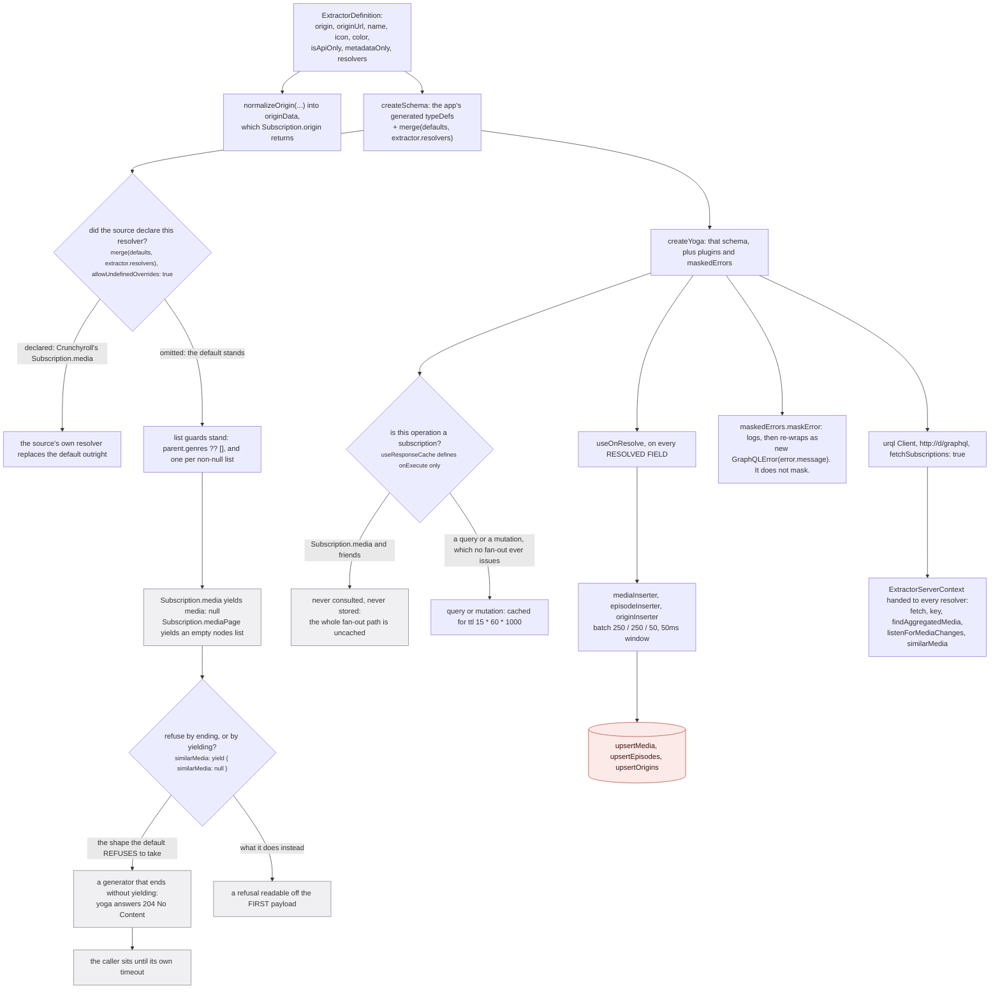
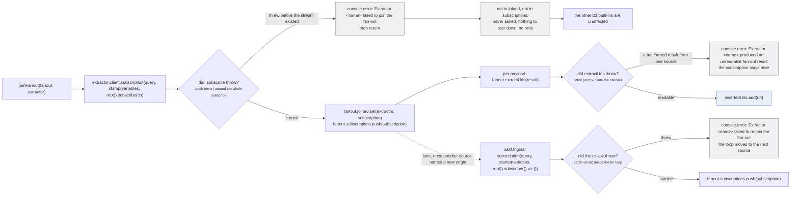
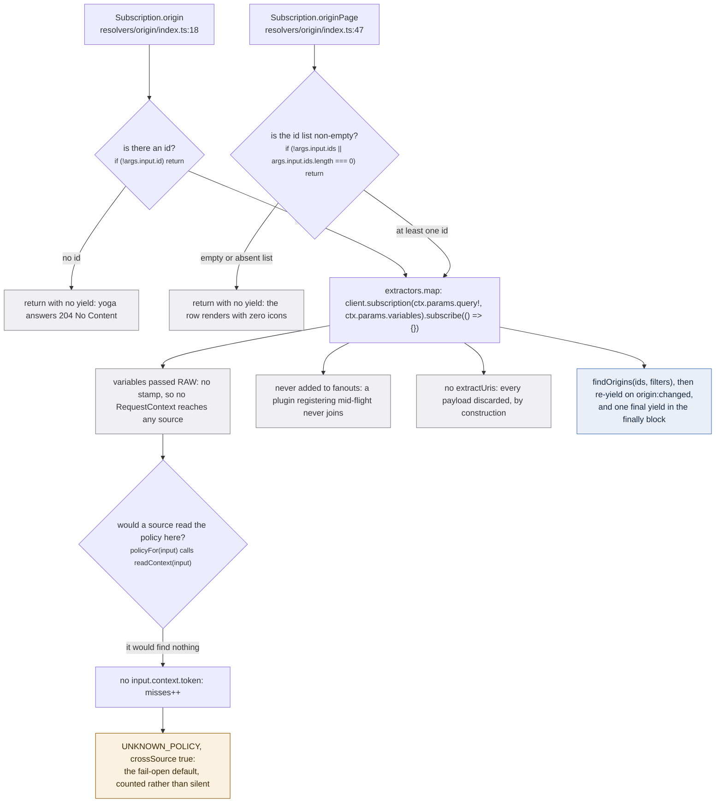

The first pass asks **every** source. Not the ones whose origin appears in the uri, not the ones that
declare they can answer, not the ones with a key configured. Every registered source, unconditionally,
with the same document and the same variables, in one synchronous loop.

`src/worker/extractor.ts:792`:

```ts
for (const extractor of extractors) joinFanout(fanout, extractor)
```

`joinFanout` (`src/worker/extractor.ts:746-766`) contains exactly one test, and it is not an origin
test: `if (fanout.joined.has(extractor)) return`. Nothing in it reads the uri, `supportedUris`, or
`origin`. A source decides for itself, inside its own `Subscription.media`, whether the question is
about it; that is [self-selection](/request/self-selection/), and it happens 24 times in parallel
inside 24 separate GraphQL servers. Twenty-four is the built-in count, not a round number:
`src/sources/index.ts` exports 24 modules and `tests/unit/sources/index.test.ts:24` pins it with
`expect(names).toHaveLength(24)`.

Open `ag:(anilist:166873)` and Crunchyroll, Netflix, Apple TV, Disney, HBO and eighteen others are all
asked about it. Exactly two are addressable by that uri at all: anilist, whose own origin is named, and
offline, whose `supportedUris` is `['offline', ...INDEXED_ORIGINS]` and so covers `anilist`
(`src/sources/offline/extractor.ts:48`, `src/sources/offline/index-lookup.ts:20`). The other twenty-two
find nothing in it they could recognise and yield `media: null`. That is not waste to be optimised
away: it is the only mechanism by which a source that *does* recognise itself gets to answer, and the
cost of asking a source that refuses is one generator that yields once and ends.

## The answer does not come back this way

Worth saying before the first figure, because the arrows are otherwise misread. The fan-out's return
values are almost entirely discarded. Sources write to the graph store through an envelop
`useOnResolve` hook inside their own yoga (`src/worker/extractor.ts:473-491`), the store emits
`media:changed`, and the app-level resolver re-reads the store and yields the aggregate
(`src/worker/resolvers/media/index.ts:81-87`). The subscription callback the fan-out installs is
`(result) => { if (!fanout.extractUris) return ... }`, and `extractUris` is passed by exactly one
caller in the codebase: `Subscription.mediaPage` (`src/worker/resolvers/media/index.ts:97-107`).

So on the `MEDIA` path every payload from every source is dropped on the floor, and the page still
gets its data. The fan-out is a *trigger*, not a query.

## One document, N schemas

```mermaid
flowchart LR
  Q["ctx.params.query<br/>the app's own document, verbatim"]
  V["ctx.params.variables"]
  ROOT["openRoot(operation)<br/>rootId r1, first token t2"]
  F["fanout: query, variables, insertedUris,<br/>extractUris, subscriptions, joined, root"]
  LOOP["for (const extractor of extractors)<br/>joinFanout(fanout, extractor)"]
  D1{"already on this fan-out?<br/><small>fanout.joined.has(extractor)</small>"}
  SKIP["return: no second subscription"]
  D2{"can the context ride the variables?<br/><small>input == null || typeof input !== 'object'</small>"}
  BARE["variables returned unchanged:<br/>this source is asked with no context"]
  ST["stamp(variables, root)<br/>input.context = token, rootId, operation, chain"]
  SUB["extractor.client.subscription(query, variables).subscribe(cb)"]
  YOGA["that source's own yoga<br/>one schema, one urql client, http://d/graphql"]
  D3{"does this caller read payloads?<br/><small>if (!fanout.extractUris) return</small>"}
  DROP["payload dropped on the floor"]
  HARV["insertedUris.add(uri)<br/>once per mediaPage node"]
  STORE[("the graph store<br/>reached by useOnResolve, never by the payload")]

  Q --> F
  V --> F
  ROOT --> F
  F --> LOOP
  LOOP -->|"every registered source, unconditionally: no origin test exists in this loop"| D1
  D1 -->|"already joined: a plugin re-registering mid-flight"| SKIP
  D1 -->|"first time this entry is seen"| D2
  D2 -->|"input absent or a scalar: stamp returns the variables untouched"| BARE
  D2 -->|"input is an object"| ST
  BARE --> SUB
  ST --> SUB
  SUB --> YOGA
  YOGA --> D3
  D3 -->|"Subscription.media: extractUris is undefined"| DROP
  D3 -->|"Subscription.mediaPage: the one caller that passes it"| HARV
  YOGA -.side channel, writes rows.-> STORE

  classDef irrev fill:#fbeae7,stroke:#b03f33,color:#3a1512
  classDef ratchet fill:#faf1e0,stroke:#8f5a0e,color:#3a2a08
  classDef view fill:#e9eef7,stroke:#4572b5,color:#16283f
  classDef refuse fill:#f0f0f2,stroke:#7b7d85,color:#33343a
  class SKIP,DROP,BARE refuse
  class STORE irrev
  class HARV view
```



*The dashed arrow is the only one that carries data anywhere useful. `stamp` is the one place a
question can lose its request context without anyone noticing, because it returns the variables
unchanged rather than throwing.*

Three details in that figure decide behaviour downstream.

**`ctx.params.query` is the app's document, not a document the fan-out writes.** `proxyRequestToExtractors`
(`src/worker/extractor.ts:783-791`) copies `ctx.params.query!` and `ctx.params.variables` straight off
the incoming request. Every source's private schema is built from the same generated `typeDefs`
(`src/worker/extractor.ts:416`) as the app's, which is what makes the app's document validate against a
source's server. The consequence belongs on
[from the address bar to the worker](/request/page-to-worker/): the page's selection set is replayed
verbatim at 24 servers, so a field the page did not select is a resolver that never runs at any source.

**`stamp` fails soft.** `src/worker/request-context.ts:136-140`:

```ts
export const stamp = <T extends Record<string, unknown>>(variables: T, context: RequestContext): T => {
  const input = variables.input
  if (input == null || typeof input !== 'object') return variables
  return { ...variables, input: { ...input as object, context } }
}
```

A subscription whose variables carry no `input` object is sent without a context, the source's
`readContext` finds no token, `misses++` (`src/worker/request-context.ts:125`) and it falls through to
`UNKNOWN_POLICY = { crossSource: true }` (`src/worker/request-context.ts:73`). Failing open is
deliberate; the counter is what makes the failure visible. See
[the request context](/request/request-context/).

**`joined` is keyed on the entry, not the origin.** `fanout.joined` is a
`Map<ExtractorEntry, FanoutSubscription>` (`src/worker/extractor.ts:737`), and its comment says what it
is for (`src/worker/extractor.ts:738`):

> stamped onto every joiner, including one that registers mid-flight, so no source is left unstamped

A plugin that connects while a page is open runs `for (const fanout of fanouts) joinFanout(fanout, entry)`
(`src/worker/extractor.ts:689`) against every in-flight fan-out, and joins each one exactly once, with
the **original** variables and the **same** root context. `const fanouts = new Set<Fanout>()`
(`src/worker/extractor.ts:743`) exists for that and says so at `:742`:

> every in-flight fan-out, so a source that registers mid-subscription can still join it

:::danger[The side channel is the irreversible half]
Nothing on this page is undone by unsubscribing. A source's rows reach `upsertMedia` through
`useOnResolve` and the `mediaInserter` DataLoader while the subscription is alive, and `upsertMedia`
resolves a `SAME_AS` claim between two RUN rows into `graph.link`, a union-find union with **no
inverse** (`src/worker/store/db.ts:162-198`). Scalars written by `graph.set` are last-write-wins.
Tearing the fan-out down stops further questions; it does not unweld a cluster a source already
welded. See [upsertMedia](/write/upsert-media/).
:::

## What `makeExtractor` bolts onto every source

A source module is a bag of resolvers. `makeExtractor` (`src/worker/extractor.ts:411-549`) turns it
into a server, and the same wrapper is applied to a built-in and to a plugin
(`src/worker/extractor.ts:681`). Everything a source did not write is in here.



*Every default in this figure is a refusal or an empty-list guard. The one decision a source cannot
override is the shape of a refusal it never wrote.*

**The list guards are not tidiness.** `src/worker/extractor.ts:425-427`:

> every non-null list on Media needs one of these, because a source may omit any field and a null in a
> non-null position nulls its whole parent, taking the rest of the payload with it

**The `similarMedia` default yields its refusal rather than ending**, and the reason is the most
reusable sentence on this page. `src/worker/extractor.ts:459-462`:

> most sources cannot answer show-plus-evidence, and the default has to YIELD that rather than end: a
> subscription generator that completes without yielding makes yoga respond 204 No Content, which the
> caller would sit on until its timeout instead of reading a refusal off the first payload

That timeout is `SIMILAR_MEDIA_TIMEOUT_MS = 30_000` (`src/worker/extractor.ts:198`). Twenty-two sources
that cannot answer, each held for thirty seconds, is the outcome the yield avoids. The rule is
independently restated inside a source, which is a good sign it is real rather than folklore;
`src/sources/offline/extractor.ts:231-232`:

> Always yield at least once. A subscription generator that completes without yielding makes yoga
> answer 204 No Content, which is not the same thing as "this source knows nothing".

The same 204 rule is what makes the uri gate in `Subscription.media` a hard stop rather than an error:
a `return` with no yield leaves the page on `data === undefined` forever.

**The response cache is inert here, and this is checkable rather than assumed.**
`useResponseCache({ session: () => null, ttl: 15 * 60 * 1000 })` sits at `src/worker/extractor.ts:470`,
so 15 minutes with no session partitioning. The comment at `src/worker/resolvers/media/index.ts:52-53`
says why it never fires on this path:

> nothing caches this path (@envelop/response-cache hooks onExecute and skips subscriptions), so a
> blanket re-fan would re-hit every upstream on every merge

Confirmed against the installed package rather than taken on trust: `@envelop/response-cache/cjs/plugin.js`
defines `onExecute` at line 165 and no `onSubscribe` anywhere, so a subscription operation never reaches
it. The cache is live only for a query or a mutation, and no fan-out issues either. This is the load-bearing
premise of the [re-ask](/request/re-ask/): re-asking newly named origins rather than re-running the whole
fan-out matters precisely because a blanket re-fan would hit every upstream again.

**`maskError` does not mask.** `src/worker/extractor.ts:499-504` logs
`Server Extractor <name> GQLError occurred:` and returns `new GraphQLError((error as Error).message)`,
so the upstream message survives to the client side of that source's own urql client, where
`errorExchange` (`src/worker/extractor.ts:507-523`) logs it a second time under one of two shapes,
`Client Extractor <name> Network error on <operation>` or `... GraphQL error on ...`. It never swallows
and never retries; retrying lives in [`fetchWithBackoff`](/request/fetch-and-backoff/).

**Five functions cross into every resolver.** The object literal at `src/worker/extractor.ts:532-538`
*is* the `ExtractorServerContext` (`src/worker/extractor.ts:34-44`). Two of them are the interesting
ones: `fetch` is `fetchWithBackoff`, never `globalThis.fetch`, so no source can skip the backoff; and
`similarMedia` is `similarMediaFrom(extractor.origin)`, bound to this source as the **caller**, so
`MAX_SIMILAR_MEDIA_PER_CALLER = 8` (`src/worker/extractor.ts:227`) is spent against an origin the
wrapper decided, never one the source declared about itself. Its own comment at
`src/worker/extractor.ts:298` puts it plainly: the ask is *bound to the origin doing the asking so a
budget can be attributed to it*.

## A source that cannot start



*Three try/catch sites, three distinct log lines, and only the first of the three abandons the source.
None of them throws upward, so a broken source is a missing row and never a broken page.*

`src/worker/extractor.ts:745`, the sentence the whole figure exists to state:

> one source must never be able to take down the fan-out: a source that cannot start is skipped

The three sites differ in what survives:

| site | line | on failure |
|---|---|---|
| `joinFanout` around `.subscribe` | `src/worker/extractor.ts:760-763` | logs, `return`. The entry is in neither `joined` nor `subscriptions`, so it is never asked and never torn down. It can still join a *later* fan-out. |
| the payload callback's `extractUris` | `src/worker/extractor.ts:756-758` | logs, the subscription stays alive, later payloads are still read. |
| `askOrigins` around the re-ask | `src/worker/extractor.ts:835-837` | logs, `continue` to the next source in the loop. |

Note what a failed join does **not** do: it does not mark the source as failed. Nothing records it, so
the next page open builds a fresh `Fanout` and asks it again.

:::caution[`extractors` is a mutable module singleton]
`export const extractors = Object.values(extractorDefinitions).map(makeExtractor)`
(`src/worker/extractor.ts:551`) is built once at module load, and plugin registration mutates it in
place: `extractors.push(entry)` at `:683`, `extractors.splice(index, 1)` at `:719`. So "every
registered source" means *every source registered at the instant the loop runs*, and the set can differ
between two fan-outs opened seconds apart. `close()` (`src/worker/extractor.ts:849`) removes the fan-out
from `fanouts` so no further late joiners arrive, and deliberately does not unsubscribe: the caller
still tears down what it holds.
:::

## The two fan-outs that are not this one

`proxyRequestToExtractors` is not the only place `extractors` is looped over and subscribed to.
`Subscription.origin` and `Subscription.originPage` (`src/worker/resolvers/origin/index.ts:21-26` and
`:50-55`) each build their own, by hand, and they are missing four things the real one has.



*Both of these refuse first and fan out second, which is the opposite order to `Subscription.media`,
where the refusal is the only thing standing between an unparseable uri and 24 source servers.*

Four differences, each with a consequence:

- **No `stamp`.** The variables go out exactly as they arrived, so `input.context` is absent, so
  `readContext` returns `undefined` and increments `misses`. Any source that read `policyFor` on this
  path would get `UNKNOWN_POLICY`, which is `{ crossSource: true }` (`src/worker/request-context.ts:73`).
  No built-in reads the policy in its `origin` resolver today, so nothing misbehaves; the counter still
  moves, which is exactly what the counter is for.
- **No `fanouts` entry.** These loops never register themselves, so `registerRemoteExtractor`'s late-join
  loop (`src/worker/extractor.ts:689`) cannot see them. A plugin that connects while an origin
  subscription is open is never asked for its `Origin` row until the next one opens.
- **No `extractUris`.** The subscribe callback is literally `() => {}`. The origin rows land the same
  way media rows do, through `useOnResolve` firing on a field whose named type is `Origin`.
- **No `close()` and no root.** `openRoot`/`closeRoot` are never called here, so there is no rootId to
  clean up, which is consistent: nothing was minted. Teardown is the `finally` block at
  `src/worker/resolvers/origin/index.ts:38-42` and `:67-70`, which unsubscribes everything and then
  yields one last time.

The refusal at `src/worker/resolvers/origin/index.ts:48` is the one that shows up on screen. It is why
`episodeOriginIds` matters on the media modal: an empty id list means `originPage` yields nothing at
all, and a perfectly playable episode renders its row with no source icons.

## What this page does not decide

Two things happen next and belong elsewhere.

- **Whether a source recognises itself in the uri it was handed.** Every source answers that on its own,
  and Crunchyroll's four branches are the canonical shape:
  [how a source recognises itself](/request/self-selection/).
- **What happens when a source is asked too early.** A source whose id is contributed *later* by another
  source was asked before that id existed, refused, and ended: its `Subscription.media` is a yield-once
  generator with no retry. `askOrigins` (`src/worker/extractor.ts:825-839`) is the second half of the
  fan-out and the only place origin matching decides anything: [the re-ask](/request/re-ask/).
