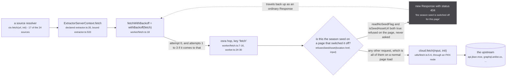
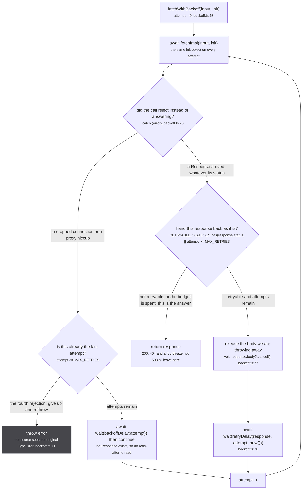
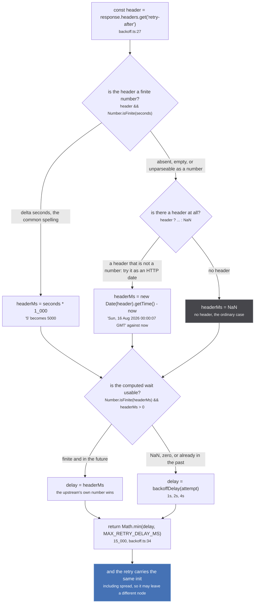

No source in this tree calls `globalThis.fetch`. Seventeen of the twenty-four built-in sources touch
the network, and every one of them calls `ctx.fetch`, which is `fetchWithBackoff`, wired once per
source when that source's private yoga is built (`src/worker/extractor.ts:533`). The wrapper is the whole of `src/worker/backoff.ts`, 80
lines with no imports and no `console` call anywhere in it.

That last detail decides how this feels from outside: **a retry is silent**. Three extra requests and
seven seconds of waiting produce no log line, no error, and no signal to the caller. The only
observable is latency, and the only thing the source ever sees is the last response.

The module says why it is its own file, at `src/worker/backoff.ts:1-3`:

> Retry policy for every upstream request an extractor makes, split out of fetch.ts with NO imports
> so it can be tested: fetch.ts calls osra's expose() at module scope, which needs a transport that
> does not exist outside the worker. Same reason src/sources/season.ts is its own module.

## Where the wrapper sits

The request leaves the worker and crosses back to the page before it reaches the network, and the
page has a refusal branch of its own on the way past.

*The backoff sits above the osra hop, so the page-side refusal is inside the retry loop and gets a
status chosen with that in mind.*

The status on that refusal is the clearest evidence anywhere that this loop is load bearing.
`src/worker.ts:14-15`:

> 404, never 503: `fetchWithBackoff` retries a 503 three times, and this refusal is the same shape
> as the asset simply not being published yet, which the loader already answers undefined to.

A 503 there would have cost four round trips and seven seconds of waiting to arrive at a decision the
page had already made before the first one. `refusesSeedAsset` is `readNoSeedFlag(pageUrl) &&
isSeedAssetUrl(requestUrlOf(request))` (`src/utils/export-flag.ts:50-51`), and the flag is exactly
`?seed=off`, not mere presence of the parameter (`src/utils/export-flag.ts:28-34`).

## `withBackoff`, the loop

*The two exhaustion paths do not agree: a rejected fetch that never recovers throws, and a failing
status that never recovers returns the failing response. A source has to handle both.*

Read the asymmetry off the figure, because it is the single thing about this module a caller gets
wrong. Four 503s in a row end at `return response` with `response.status === 503` and the body
intact; four `TypeError`s in a row end at `throw error`. So `if (!response.ok) throw ...`, which is
what the seed loader does at `src/sources/offline/seed-source.ts:50`, is not defensive
programming here, it is the only thing standing between a 503 body and `JSON.parse`.

The rejection branch was added after the fact, and its comment says what it fixed
(`src/worker/backoff.ts:64-66`):

> A rejected fetch is a dropped connection or a proxy hiccup, which is at least as transient
> as any status this retries. Letting it through unretried made the backoff blind to the one
> failure mode that never arrives as a Response at all.

`tests/unit/worker/backoff.test.ts:75-81` pins it, and the comment above the test repeats the point in
one line (`:75`): *A dropped connection never arrives as a Response at all, so a status-only policy is
blind to it.*

### The constants, and what they cost

| constant | value | line |
|---|---|---|
| `MAX_RETRIES` | `3` | `src/worker/backoff.ts:17` |
| `MAX_RETRY_DELAY_MS` | `15_000` | `src/worker/backoff.ts:18` |
| `backoffDelay(attempt)` | `Math.min(1_000 * 2 ** attempt, MAX_RETRY_DELAY_MS)` | `src/worker/backoff.ts:37-38` |

Three retries is four attempts, and the number was chosen against a measurement rather than picked
(`src/worker/backoff.ts:15-16`):

> 4 attempts total. The homepage's season list is all-or-nothing on its first page, so at the
> roughly even odds measured against Jikan a third retry is what takes it from 88% to 94%.

The waits are `1_000`, `2_000`, `4_000`, in that order, pinned by
`tests/unit/worker/backoff.test.ts:94` with `expect(waited).toEqual([1_000, 2_000, 4_000])`. Total
added latency on a dead upstream is therefore **7 seconds and four requests**, unless the upstream
sends `retry-after`, in which case it is up to **45 seconds** (three waits capped at 15 each).

That matters against the budgets racing it. The offline seed loader gives its index 10 seconds
(`SEED_INDEX_TIMEOUT_MS = 10_000`, `src/sources/offline/seed-source.ts:26`) and its episodes 15
(`SEED_EPISODES_TIMEOUT_MS = 15_000`, `:27`). A seed asset answering 503 with a generous `retry-after`
will outlive both budgets, and the loader answers `undefined` while the retries keep going, which its
docblock states as the intended outcome (`src/sources/offline/seed-source.ts:21-23`):

> A race, never an `AbortSignal` in the init: `ctx.fetch` crosses an osra port to the relay and a
> signal is not structured-cloneable, which is why no source in the tree passes one. On expiry the
> loader answers undefined and the abandoned request is ignored.

One dead branch worth knowing about before you tune anything: **the cap inside `backoffDelay` is
currently unreachable.** The largest attempt that ever waits is 2, so the largest value it computes is
`4_000`, and `Math.min(..., 15_000)` first binds at attempt 4, which needs `MAX_RETRIES` raised to 5
or more. Today the cap only ever binds on the `retry-after` path.

## Which statuses are retried, and which deliberately are not

```mermaid
flowchart LR
  R["a Response came back<br/><small>backoff.ts:75</small>"]
  D{"does this status mean 'ask again'?<br/><small>RETRYABLE_STATUSES.has(response.status)</small>"}

  subgraph retryable["RETRYABLE_STATUSES, backoff.ts:13"]
    direction TB
    A408["408 request timeout"]
    A429["429 too many requests<br/><small>the one status that usually carries retry-after</small>"]
    A502["502 and 504<br/><small>a gateway that could not reach the thing behind it</small>"]
    A522["522 and 524<br/><small>the same failure, Cloudflare's spelling of it</small>"]
    A503["503 service unavailable"]
  end

  subgraph passthrough["everything else, straight through"]
    direction TB
    B500["500<br/><small>as often a deterministic upstream bug as a blip</small>"]
    B403["401, 403<br/><small>a key problem: a fourth ask cannot fix it</small>"]
    B404["404, 410<br/><small>the seed refusal is deliberately this shape</small>"]
    B200["200, 204, 301, 400, 501<br/><small>pinned by backoff.test.ts:39</small>"]
  end

  RETRY["cancel the body, wait, ask again<br/><small>up to three times</small>"]
  OUT["return response to the source<br/><small>ok or not, the source decides</small>"]

  R --> D
  D -->|"one of the seven"| retryable
  D -->|"any other status, success or failure"| passthrough
  retryable --> RETRY
  passthrough --> OUT

  classDef irrev fill:#b03f33,stroke:#e0796f,color:#ffffff
  classDef ratchet fill:#8f5a0e,stroke:#f2b45c,color:#ffffff
  classDef view fill:#4572b5,stroke:#8db0de,color:#ffffff
  classDef refuse fill:#46464b,stroke:#8b8c93,color:#f2f2f4
  class passthrough refuse
```

*The seven on the left all mean "the thing behind the gateway did not answer". The right-hand column
includes failures, and that is the point: a failure is not automatically transient.*

The rule the set encodes is in its comment, and it is worth reading in full because it names the
upstream that produced it (`src/worker/backoff.ts:5-9`):

> Every status here means "ask again", never "this request was wrong". 502/504 and Cloudflare's
> 522/524 are a gateway failing to reach the thing behind it, which is the shape almost every
> upstream outage takes: api.jikan.moe answers 504 "Jikan failed to connect to MyAnimeList" while
> api.jikan.moe/v4/anime/1 stays 200, so the host is up and only the MAL-fetching endpoints flap.
> Leaving 504 out was the whole reason one flaky season request emptied stub's homepage.

And the omission, which is the part people try to "fix" (`src/worker/backoff.ts:11-12`):

> 500 is deliberately absent: it is as often a deterministic upstream bug as a blip, and retrying
> one costs three requests to reach the same answer.

Both halves are tests, not comments. `tests/unit/worker/backoff.test.ts:31-42` asserts membership for
`[408, 429, 502, 503, 504, 522, 524]` and non-membership for
`[200, 204, 301, 400, 401, 403, 404, 410, 500, 501]`. Note that only the 500 case has an argument
written next to it; 401, 403 and the rest are pinned by the test alone.

The suite also carries its own control, which is the good habit to copy
(`tests/unit/worker/backoff.test.ts:60`):

> The test that proves the suite can fail: flip 404 into RETRYABLE_STATUSES and this breaks.

## `retry-after`, in both of its legal spellings

`retryDelay` is consulted only on the status path. A rejected fetch has no `Response` to read a header
off, so it uses `backoffDelay(attempt)` directly (`src/worker/backoff.ts:72`).

*Every path out of the three decisions reaches the same cap, so no upstream can hold a page load open
for longer than 15 seconds per attempt however it spells its header.*

Three branches on that figure exist because of a specific failure, and each has a test at
`tests/unit/worker/backoff.test.ts:98-120`:

- **`retry-after: 3600`** would be an hour. `Math.min` cuts it to 15 seconds, and the comment on
  the test says why in one line (`tests/unit/worker/backoff.test.ts:109`): *A source asking for an hour
  must not hold a page load open for an hour.*
- **`retry-after: Sun, 16 Aug 2026 00:00:00 GMT`** read at exactly that instant is `0`, not a wait.
  `headerMs > 0` sends it to `backoffDelay(2)`, which is `4_000`.
- **`retry-after: not a date`** is `Number(...)` NaN, then `new Date(...).getTime()` NaN, then
  `Number.isFinite` false, then `backoffDelay(1)`, which is `2_000`. A garbage header costs nothing.

`now` is a parameter rather than a `Date.now()` call, and the docblock at
`src/worker/backoff.ts:24` says the reason is testability alone: *`now` is a parameter rather than a
`Date.now()` call so the HTTP-date branch is testable.* In the loop it is called fresh on each
iteration (`retryDelay(response, attempt, now())`, `:78`), so an HTTP date is measured from the moment
the retry decision is made, not from when the request started.

## `spread`, and why a retry has to carry the init

`FetchInit` is `RequestInit & { spread?: boolean }` (`src/worker/backoff.ts:50`). It is the only thing
this module adds to the platform's request options, and it exists for exactly one class of upstream
(`src/worker/backoff.ts:44-48`):

> `spread` sends the request through any healthy FKN node in turn instead of the node the session is
> on. For an upstream that meters per source address, and nothing else: AniList's public API answers
> `x-ratelimit-limit: 30` a minute per address (scripts/measure-start-date-window.mjs), shared by
> every user behind one node, and Jikan documents 3 a second and 60 a minute. An upstream that ties
> anything to the address a session was opened from stays on the one node.

Two sources set it, and both of them also say where they do **not**:

- **Jikan**, `src/sources/jikan/extractor.ts:24`, as `const SPREAD = { spread: true } as const`, passed
  to all four of its API calls (`:197`, `:211`, `:222`, `:249`). Its comment at `:21-23` draws the line:
  *The myanimelist.net scrape is not spread: it is a page, not a metered API.*
- **AniList**, `src/sources/anilist/extractor.ts:292`, on the public GraphQL API only. The frontend
  fallback beside it is not spread, at `:290-291`:

  > NOT spread: its CSRF pair was minted through one node and anilist.co may well bind it to the
  > address, which is not something to find out from a gate refusal in production.

The loop passes `init` through unchanged on every attempt. That sounds too trivial to test and has a
test of its own, because nothing else in the chain would catch losing it
(`tests/unit/worker/backoff.test.ts:123-126`):

> The `spread` flag rides `init` from an extractor through this wrapper, an osra hop and the main
> thread to cloud.fetch, and every hop is typed loosely enough to drop it without a compile error.
> This pins the one hop that has logic in it: a retry must carry the same init as the first attempt,
> or a request that asked to spread would be retried on the tied node.

`tests/unit/worker/backoff.test.ts:134` asserts it directly: every one of the three recorded inits
equals `{ spread: true, method: 'GET' }`.

## Two things this loop does not do

:::caution[The method is never checked, so a POST is retried like anything else]
`withBackoff` has no idempotence test anywhere in it. AniList's queries go out as
`method: 'POST'` (`src/sources/anilist/extractor.ts:287`), so a 504 on an AniList query is sent again,
up to four times. That is safe **only** because every POST in this tree is a GraphQL read, which the
upstream answers the same way however many times it is asked. Anything added later that writes
upstream would be retried too, and nothing in the types would stop it.
:::

:::caution[The body of a retried response is cancelled, and the last one is not]
`void response.body?.cancel().catch(() => {})` at `src/worker/backoff.ts:77` runs on every response
the loop throws away, with the reason on the line above it: *the body is never read on a retried
response, and an uncancelled one leaks the stream.* The response that is finally returned is handed
back with its body untouched and unread, which is what lets a source call `.json()`, `.text()` or
`.arrayBuffer()` on it. It is also why a source that returns early without reading the body of a
failing response leaks it; nothing here can clean that up on the caller's behalf.
:::

:::danger[Everything downstream of this loop is permanent]
Nothing on this page writes to the store, and nothing on this page can be undone by retrying it
differently. What follows can. A body that reaches a source becomes rows, and `upsertMedia` turns a
`SAME_AS` claim between two RUN rows into `graph.link`, a union-find union with **no inverse**
(`src/worker/store/db.ts:162-198`); scalars written by `graph.set` are last-write-wins. So the
question this loop answers, whether a 504 is the upstream's answer or just a bad second, is answered
once and then written down. That is the whole argument for retrying 504 and not retrying 500. See
[the fan-out](/request/fan-out/) for how a body leaves a source, and
[from the address bar to the worker](/request/page-to-worker/) for the hops above this one.
:::

## Where the code disagrees with the inventory

Two small corrections, recorded here rather than silently applied:

- The cancel line is written as `void response.body?.cancel()` in the page inventory. The code is
  `void response.body?.cancel().catch(() => {})` (`src/worker/backoff.ts:77`). The `.catch` is not
  decoration: cancelling a stream that has already errored gives a rejected promise, and a rejection
  inside a `void` expression has nothing to handle it.
- The inventory lists `src/utils/fetch.ts` as one of the three files behind this page. It is six lines
  and contains no policy at all: `cloud.fetch(input, init)`. The third file that actually decides
  something is `src/worker.ts:13-20`, the page-side seed refusal, which is drawn in the first figure
  above.
