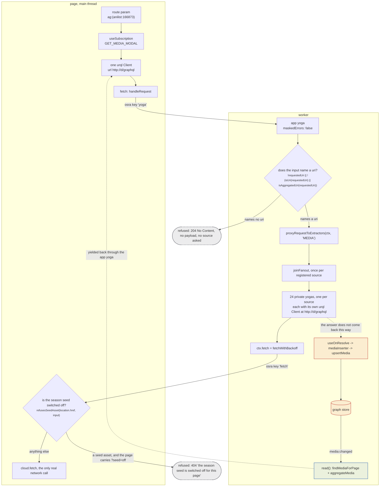
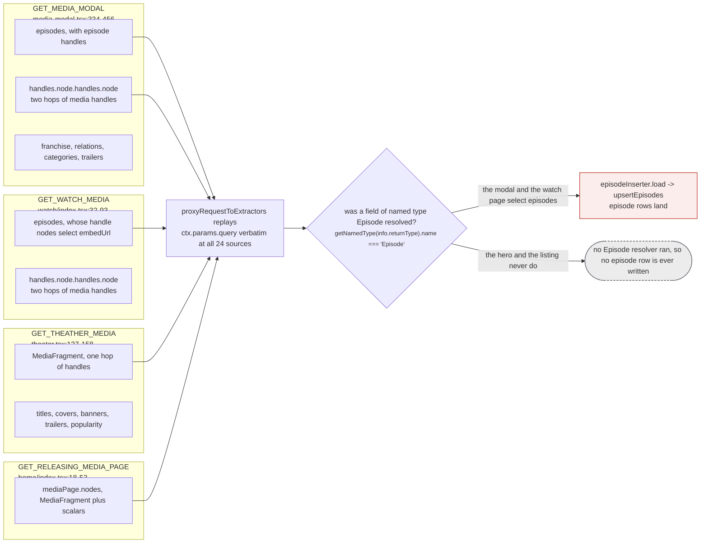
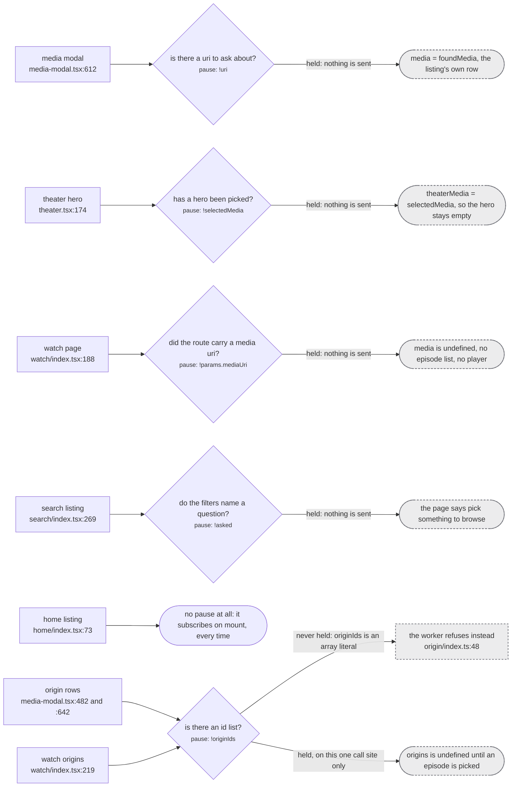
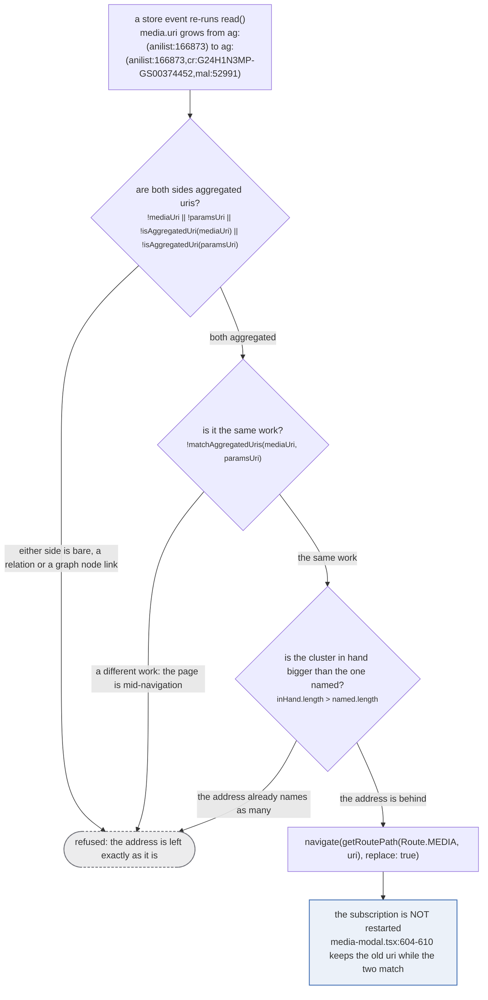

Nothing on the page fetches anything. A component subscribes, urql hands the document to a `fetch`
that is an osra call across a `Worker` boundary, and the worker runs a GraphQL server whose
`Subscription.media` resolver replays that same document against one private GraphQL server per
source. The sources then answer by **writing to the store**, not by returning, and the page is told
about it through a re-read.

That last sentence is the shape of the whole system, and it is the part a topology drawing usually
gets wrong. The arrow that carries the answer is not the arrow the question travelled down.

## The topology

*Two dashed arrows, and they are the two that matter: the fan-out's answer goes sideways into the store, and the page learns about it only because a store event re-runs the read.*

Follow it in the files.

**The page holds exactly one urql client** (`src/urql.ts:19-50`). Its `url` is `'http://d/graphql'`
and no socket is ever opened to it: `fetch` is replaced with `handleRequest`, and
`fetchSubscriptions: true` (`src/urql.ts:48`) is what makes a subscription go down that fetch rather
than over a websocket. The exchange chain is `mapExchange` for logging, `devtoolsExchange`,
graphcache, then `fetchExchange`. Graphcache normalises on `src/urql-keys.ts:16-44`, where `Media`
and `Episode` are keyed by `_id` and every edge type answers null:

> `src/urql-keys.ts:18-21`
>
> An EDGE has no identity of its own: it is a relation between two rows, and the row it points at is
> keyed by its own `_id`. Null tells graphcache to embed it in its parent rather than normalise it.
> Omitting these compiles, because `satisfies KeyingConfig` does not force exhaustiveness, and shows
> up only as a dev-console warning while the cache invents keys for unkeyable objects.

**The worker boundary is osra, two keys, two directions.** `src/worker.ts:32-38` takes
`handleRequest` off key `'yoga'`, which `src/worker/yoga.ts:70-76` exposes; `src/worker.ts:24-30`
exposes the page's own `fetch` back to the worker under key `'fetch'`, which
`src/worker/fetch.ts:7-18` picks up. So a source's upstream request leaves the worker, crosses back
into the page, and only there becomes a network call.

**The app-level yoga runs unmasked** (`src/worker/yoga.ts:26-38`): `maskedErrors: false`, plus
`useErrorHandler`, `useDeferStream()` and `useExecutionCancellation()`. Its server context is `{}`
(`src/worker/yoga.ts:42`), so the app resolvers only ever read `ctx.params` and `ctx.request.signal`.
The per-source yogas do not share that setting; each one carries a `maskError` that logs and re-wraps
(`src/worker/extractor.ts:499-504`).

**The uri gate is the first refusal** (`src/worker/resolvers/media/index.ts:33-38`). It returns
without yielding, which yoga answers as 204 No Content, so the page sits with `data === undefined`
forever and not one source is asked. The reason the `console.warn` is there at all:

> `src/worker/resolvers/media/index.ts:35`
>
> a refused page and a slow one are indistinguishable from outside the worker without this

**The fan-out replays the app's own document.** `proxyRequestToExtractors` captures
`query: ctx.params.query!` and `variables: ctx.params.variables` verbatim
(`src/worker/extractor.ts:783-791`) and calls `joinFanout` once per registered source
(`:792`). There is no origin test on that loop: every source is asked, unconditionally, on the first
pass. See [the fan-out](/request/fan-out/) and [how a source recognises itself](/request/self-selection/).

**Each source is a whole GraphQL server plus a whole urql client** (`src/worker/extractor.ts:411-549`).
The schema is the same generated `typeDefs` the app serves, which is why the app's document validates
against a source's server without translation, and the client at `:525-540` uses the same fake
`http://d/graphql` url with `server.handleRequest` in place of `fetch`. That object literal handed as
the second argument is the `ExtractorServerContext` every source resolver receives, and `ctx.fetch`
inside it is `fetchWithBackoff`, never `globalThis.fetch`.

**There is a third process, and it is optional.** A plugin source's data fields materialise in the
worker while its resolver functions stay remote and run inside the plugin's own sandbox frame
(`src/worker/extractor.ts:553`). From the fan-out's side it is an ordinary entry in the same
`extractors` array, pushed onto it at runtime (`:683`), which is why the figure above counts 24 and
can count more. See [plugin sources](/request/plugins/).

**The answer arrives through the store.** `joinFanout`'s subscribe callback ignores its result unless
the fan-out was given an `extractUris` (`src/worker/extractor.ts:750-759`), and only
`Subscription.mediaPage` passes one. What actually lands is written by an envelop `useOnResolve` hook
inside every source's yoga (`src/worker/extractor.ts:473-495`), which keys on the resolved field's
named type and feeds three DataLoaders. The app resolver then re-reads on `media:changed` /
`episode:changed` (`src/worker/resolvers/media/index.ts:40`) and yields the aggregate.

:::danger[The sideways arrow is the permanent one]
Everything the fan-out writes goes through `upsertMedia` (`src/worker/store/db.ts`), where a SAME_AS
claim between two runs becomes `graph.link(mediaUri, handleUri, sameAsLabelFor(mediaScope))`
(`:193`). That is a union-find union with **no inverse**, and the row merge is
`lastWriteLongestArray` (`:85`), which is last-write-wins on scalars.

> `src/worker/store/db.ts:8-12`
>
> Two identity spaces, one per scope. A run's SAME_AS unions in the first, a container's in the second,
> and nothing ever unions across them: a show-level id entering a run's cluster is what welded Mushoku
> Tensei season 1 to season 3 on the live site (the bare crunchyroll series id and the bare tvmaze
> show id were fuzzy merged into season 1's cluster on the search path, and season 3's media path then
> asserted sameness through one of them; `graph.link` is a union-find with no inverse).

A page that opens is a page that writes. See [upsertMedia](/write/upsert-media/) and
[the graph](/write/graph/).
:::

### The one refusal on the way out

`src/worker.ts:16-19` is the only resolver the page exposes to the worker, and it is a gate:

> `src/worker.ts:14-15`
>
> 404, never 503: `fetchWithBackoff` retries a 503 three times, and this refusal is the same shape
> as the asset simply not being published yet, which the loader already answers undefined to.

`refusesSeedAsset` is `readNoSeedFlag(pageUrl) && isSeedAssetUrl(requestUrlOf(request))`
(`src/utils/export-flag.ts:50-51`), where the flag is exactly `?seed=off` and never mere presence
(`:28-34`). It lives on the page rather than in the worker for a reason worth reading whole:

> `src/utils/export-flag.ts:39-49`
>
> Whether the page must refuse a worker fetch of the published season seed.
>
> A walk drives the app with `?seed=off` so it never reads its own previous output. Without that a
> seeded id is stored, joins the cluster's aggregated uri, and the next live source to read that uri
> re-asserts SAME_AS across the whole membership (`mergeHandles` in sources/utils.ts), so the next
> export publishes the id as though a source had checked it, permanently and with no inverse.
>
> It lives on the PAGE because a worker cannot see the page's url and an announcement over the port
> would race the first resolver, and because the page already owns every byte the worker fetches.

## The four documents, and the one consequence

*The four documents differ in what they render, and that difference decides what is stored, not just what is shown.*

| document | file | media handles | episodes | notable |
| --- | --- | --- | --- | --- |
| `GET_MEDIA_MODAL` | `src/router/home/media-modal.tsx:334-456` | two hops | yes, with handles | `franchise`, `relations`, `categories`, `descriptions` |
| `GET_WATCH_MEDIA` | `src/router/watch/index.tsx:32-93` | two hops | yes, with handles | selects `embedUrl` on the episode handle node, which the modal does not |
| `GET_THEATHER_MEDIA` | `src/router/home/theater.tsx:127-158` | one hop, from the fragment | no | `shortDescriptions(input: { count: 1 })` |
| `GET_RELEASING_MEDIA_PAGE` | `src/router/home/index.tsx:18-53` | one hop, from the fragment | no | the `mediaPage` root, so the only fan-out that reads its results |

`MediaFragment` (`src/worker/resolvers/media/fragment.ts:3-21`) is
`_id uri origin id url handles { relation node { _id uri origin id url } }`, and `EpisodeFragment`
(`src/worker/resolvers/episode/fragment.ts:3-23`) is the same list plus `mediaUri`. So "two hops"
means the modal and the watch page ask for `handles.node.handles.node`, three levels of media rows in
one payload.

The consequence is not about rendering. `useOnResolve` fires on the resolver's **return value**, so a
row lands whole even where a field of it was not selected. But a field that is not selected is a
resolver that never runs, so its type never fires an inserter at all:

> `src/worker/similar-document.ts:12-20`
>
> `useOnResolve` is per RESOLVED FIELD and keys on that field's named type (extractor.ts:473-486):
> `Media` reaches `mediaInserter`, `Episode` reaches `episodeInserter`, and `mediaInserter` writes
> rows and handle pairs only, dropping `media.episodes` on the floor (extractor.ts:106-133). So an
> unselected `episodes` is a resolver that never runs, an Episode type that is never resolved, and an
> `episodeInserter` that never fires. Netflix is how this surfaced: since unogs' own search died it
> arrives ONLY as a `similarMedia` claim, its season media attached and its episodes never existed, so
> the media header carried the Netflix icon while every episode row showed none. Measured on the same
> cluster from two pages: the one whose own subscription owned the fan-out stored 10 nf episode rows,
> the one that gained the same nf run through this document stored 0.

Read that against the table. The hero on the home page runs a full `MEDIA` fan-out, all 24 sources,
every source fetching whatever it fetches, and not one episode row can come out of it, because
`GET_THEATHER_MEDIA` selects no `episodes` field. That is a deliberate trade and not a bug, but it is
why "the modal filled in the episodes" is a sentence about the document rather than about the store.
The same mechanism, on the `similarMedia` document, is [the document](/similar/document/).

## Every pause on the page

There are eight `useSubscription` call sites across five files, five of them carrying a `pause`.

*A held pause is the cheapest refusal in the system: no document is built, no worker hop is made, and no source is asked. It is also invisible, which is why the search page replaces it with a sentence.*

Two of these deserve the detail.

**`pause: !asked` on the search page** is the only pause with a copy consequence attached to it.
`asked` is `namesAQuery(filters)` (`src/router/search/index.tsx:243`), which counts a query, a status,
a season, a year, a format, a genre or a tag, and deliberately does not count a category
(`src/router/search/params.ts:299-303`):

> `src/router/search/params.ts:289-294`
>
> Whether anything here is a QUESTION a source can answer, as opposed to a refinement of one.
>
> `category` is the only axis that is purely a refinement: no source reads it, and the worker applies
> it locally over whatever the other axes fetched. A page holding nothing else has therefore asked
> nobody anything, and settling on "No results found" would blame the filter for a request that was
> never made. The page says "pick something to browse" instead.

**`pause: !originIds` cannot hold at two of its three call sites, and the code disagrees with any
reading that says it can.** In the modal, `originIds` is built as `[...new Set([...])]`
(`src/router/home/media-modal.tsx:636-641`), and in an episode row it is `episodeOriginIds(episode)`
(`:481`), which returns `[...new Set(...)]` unconditionally
(`src/router/home/episode-origins.ts:17-21`). An array literal is always truthy, empty or not, so
`!originIds` is always `false` and the subscription always fires, sometimes with `ids: []`. The
refusal happens one hop later instead, in the worker: `if (!args.input.ids || args.input.ids.length === 0) return`
(`src/worker/resolvers/origin/index.ts:48`), which is another generator that ends without yielding,
so another 204. Only the watch page's `originIds` can actually be `undefined`, because it is
`origins && [...new Set(...)]` (`src/router/watch/index.tsx:214-217`).

Nothing is broken by that. It is worth knowing because the two refusals do not cost the same: a held
pause never leaves the page, while an empty `ids` list opens a subscription, crosses osra, and takes
the `origin` resolver's own fan-out with it, which is one of the two loops that is not
`proxyRequestToExtractors` and stamps no request context on anything
(`src/worker/resolvers/origin/index.ts:50-55`). See [the fan-out](/request/fan-out/) and
[the request context](/request/request-context/).

Both origin documents pass `filters: [OriginFilter.IsNotApiOnly]`, which is the only thing keeping
the twelve API-only sources off the source rows.

## The address rewrite

The modal is opened at whatever uri the caller had. A card on the home page links to a narrow one,
often a single origin, and the store then folds more sources into that cluster. The address is
rewritten to keep up, and the guard on that rewrite has four conditions because three of them were
not enough.

*Three of the four branches leave the address alone. The identity check in the middle is the one that was added after the fact, and it is the reason clicking a relation works at all.*

`shouldGrowAddress` is `src/utils/uri.ts:143-149`, called from the effect at
`src/router/home/media-modal.tsx:707-711`. The identity check is not defensive coding:

> `src/utils/uri.ts:130-142`
>
> Whether a page showing `mediaUri` should rewrite its address to it, given the address says
> `paramsUri`.
>
> The address grows as the store folds more sources into a cluster, so a page opened knowing one
> source ends up naming all of them. Two conditions, and the second is the one that is easy to miss:
> the cluster in hand must be BIGGER, and it must be the SAME WORK.
>
> Without the identity check a navigation eats itself. The address changes first and the page still
> holds the previous work for a beat, so a link to a work known through one source is judged against
> the old cluster's eight handles, read as a shrinking address, and replaced with the page being left.
> Every relation and every graph node did nothing at all when clicked (measured 2026-09-09).

The call site's own comment adds what the fix did not cover before the links changed shape:

> `src/router/home/media-modal.tsx:700-706`
>
> ONLY WHEN THE MEDIA IN HAND IS THE WORK THE ADDRESS NAMES, which the length comparison alone does
> not establish. On a navigation the address changes first and `media` is still the PREVIOUS work
> for a beat, so a link to a work known through one source ran this with the old cluster's eight
> handles against the new address's one, decided the address had shrunk, and replaced it with the
> page you were leaving. Clicking a relation or a graph node did nothing at all, twice out of twice
> (measured 2026-09-09); before these linked to a bare source uri the guard above happened to hide
> it, since a bare uri is not aggregated and the effect returned early.

The rewrite deliberately does **not** restart the subscription. `uri` is held in component state and
replaced only when the two aggregated uris fail to match
(`src/router/home/media-modal.tsx:603-610`), so a cluster that grows under an open modal keeps its
one fan-out instead of tearing it down and asking 24 sources again.

### One more decoding step, before any of it

wouter hands a path segment through undecoded, so every route param on these pages is passed through
`decodeRouteUri` first: the modal at `src/router/home/media-modal.tsx:599`, the watch page for all
three of its params at `src/router/watch/index.tsx:177-182`, and the worker again for the incoming
`args.input.uri` at `src/worker/resolvers/media/index.ts:33`.

> `src/utils/uri.ts:152-158`
>
> A uri as it arrives in a ROUTE PARAMETER, percent-decoded once when that is what makes it a uri.
>
> wouter hands a path segment through undecoded, and `isUri` and `isAggregatedUri` both refuse
> `ag%3A(...)`, so a link built with `encodeURIComponent`, or normalised by a share sheet or a chat
> client, rendered the page's shell and then sat empty forever: the media subscription returned before
> asking a single source, with no error anywhere (measured 2026-09-05, where it cost a session of
> measurement against pages that were never subscribed).

An encoded uri is not an error anywhere in this path. It is the 204 in the first figure, reached from
the top left instead of from a bad link.

## Where the code lives

| what | file |
| --- | --- |
| the page's one urql client | `src/urql.ts:19-50` |
| graphcache key resolvers | `src/urql-keys.ts:16-44` |
| page side of the osra boundary, and the seed refusal | `src/worker.ts:13-38` |
| worker side, app yoga and the osra resolvers | `src/worker/yoga.ts:26-76` |
| the fan-out driver, and the uri gate | `src/worker/resolvers/media/index.ts:30-93` |
| one yoga and one urql client per source | `src/worker/extractor.ts:411-549` |
| the fan-out itself | `src/worker/extractor.ts:777-851` |
| the origin resolvers, and their own fan-out | `src/worker/resolvers/origin/index.ts:12-73` |
| `shouldGrowAddress` and `decodeRouteUri` | `src/utils/uri.ts:130-170` |
| the `?seed=off` flag | `src/utils/export-flag.ts:19-51` |
