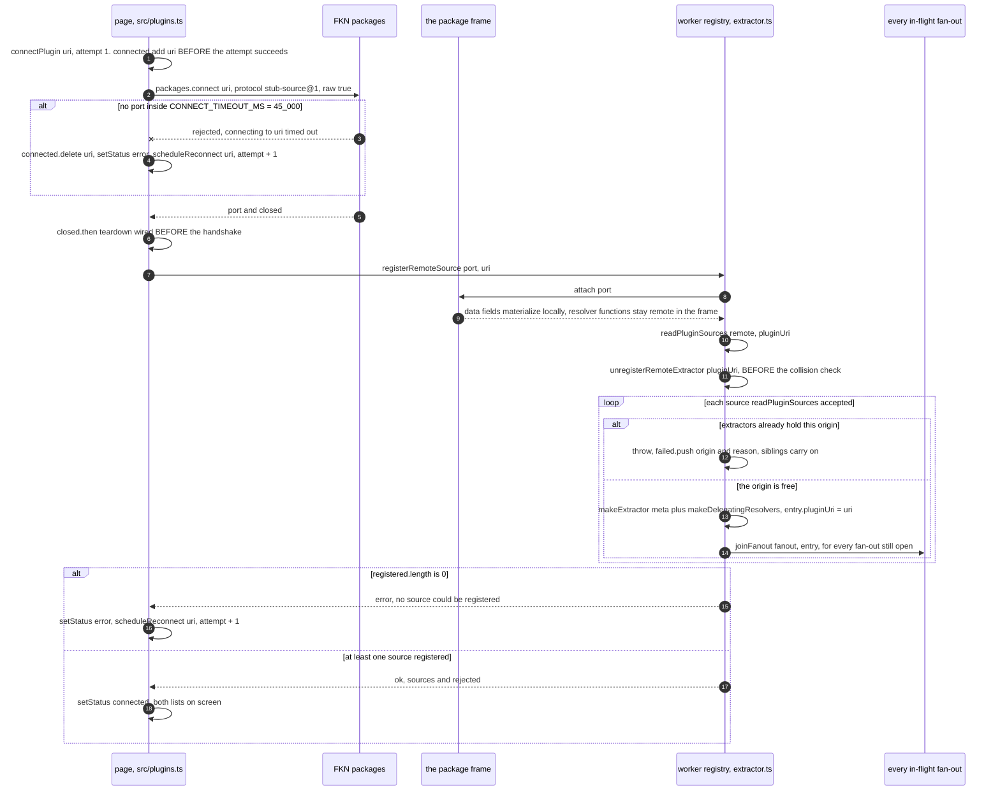
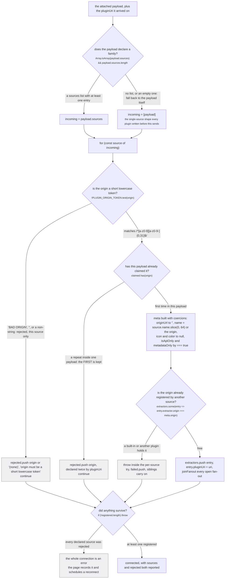
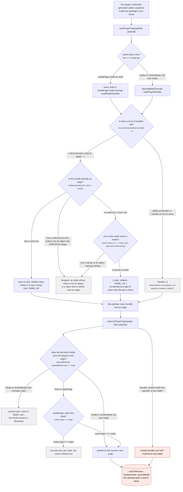
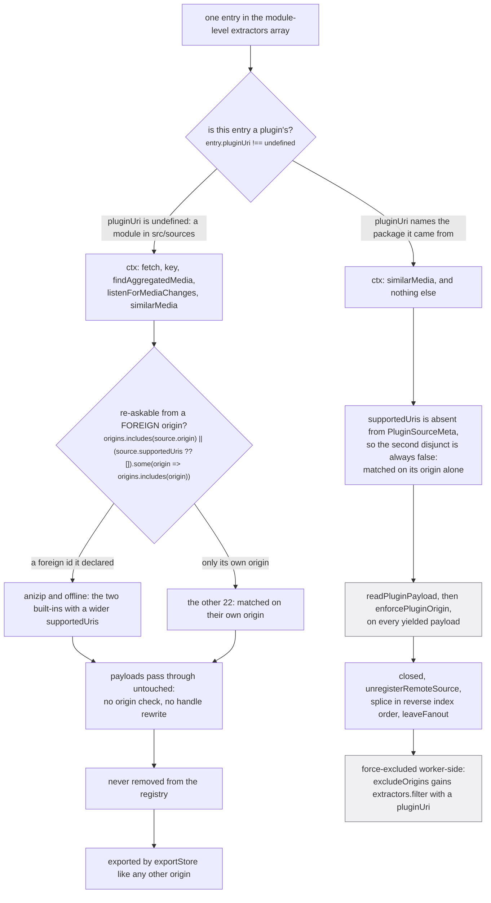

A plugin is a source that arrives at runtime over a `MessagePort` instead of at build time as a module
namespace. After registration it is indistinguishable from a built-in almost everywhere: it sits in the
same `extractors` array (`src/worker/extractor.ts:551`, pushed at `:683`), gets its own private yoga
built by the same `makeExtractor`, is joined to the fan-out by the same `joinFanout`, and writes to the
store through the same `useOnResolve` hook and the same three DataLoaders
(`src/worker/extractor.ts:473-495`). Twenty-four built-ins are compiled in
(`tests/unit/sources/index.test.ts:24`); a plugin makes it twenty-five, and nothing downstream counts.

What is reduced is the contract, in four places and no others:

1. **its identity** must be a short lowercase token that no registered source already holds;
2. **its context** is one function, not the five a built-in gets;
3. **its top-level answers** must carry its own origin, checked on every yielded payload;
4. **its rows are force-excluded from an export**, worker-side, whatever the caller asked for.

Everything else about it is a first-class source, and that is the point. The exemption in the middle of
the third rule is what this page exists to make visible.

## Connect, register, join

The main thread owns the connection and the worker owns the registry. `src/plugins.ts` persists the
enabled list in `localStorage` under `'stub-enabled-plugins'` (`:8`) and connects each entry at module
scope (`:149-151`); the worker never learns a package exists until a port is handed to it.



*A connection that produced one working source and three rejections is a success, not a partial
failure: the page shows both lists and the three do not come back until the package is reconnected.*

**The teardown is wired before the handshake, and the ordering is load bearing.** `src/plugins.ts:90`:

> wire teardown BEFORE the worker handshake: a frame death mid-registration must still recover

If `closed.then(...)` were attached after `registerRemoteSource` resolved, a frame that died during
`attach` would leave `connected` holding the uri with nothing to clear it, and `scheduleReconnect`
refuses to run while `connected.has(uri)` (`:69`). The same reasoning drives the deadline.
`src/plugins.ts:85`:

> `connected` is claimed before the attempt succeeds, so an attempt that never settles holds the slot forever

`CONNECT_TIMEOUT_MS = 45_000` (`src/plugins.ts:56`) is applied twice: once to `packages.connect` and
once to the registration race, which also races `closed` so a package that dies mid-registration
resolves as `{ error: 'the package closed before the source registered' }` (`:96-99`) rather than
waiting out the deadline.

**Two reconnect paths, two different first delays.** `scheduleReconnect(uri, attempt)` computes
`Math.min(RECONNECT_DELAY_MS * attempt, RECONNECT_MAX_MS)` (`src/plugins.ts:72`) with
`RECONNECT_DELAY_MS = 3_000` (`:9`) and `RECONNECT_MAX_MS = 30_000` (`:66`). A frame death calls it with
`1`, so the retry is 3 seconds out. A registration failure calls it with `attempt + 1` from
`connectPlugin`'s catch (`:108`), so the first retry there is 6 seconds out, then 12, 18, 24, and 30
from then on. That asymmetry is not decoration: `src/plugins.ts:107` records why the catch schedules at
all.

> registration errors leave the frame alive, so `closed` never fires: the reconnect comes from here

**The enabled list is written only after the install took**, and it is keyed on the id FKN hands back.
`src/plugins.ts:118-119`:

> install through FKN first and only persist to the enabled list once it took: FKN refuses to connect a package this app has not installed, so a mistyped address written straight to the list is retried forever
>
> key everything on the id FKN hands back, never the caller's string: FKN canonicalizes a version away ('npm:x@1.2.3' installs as 'npm:x')

## `readPluginSources`: a malformed source costs only itself

One connection may carry a family of sources, because a package that indexes two trackers is two
sources that happen to share a frame. `src/worker/plugin-sources.ts:44-83` validates each on its own.



*Three of the four refusals here are per-source and one is per-connection, and the difference is the
whole design: a package is only a shipping container.*

The figure spans two functions. Everything down to `META` is `readPluginSources`, which is pure and has
no idea what else is registered; the collision check and the empty-result throw are
`registerRemoteExtractor` (`src/worker/extractor.ts:678-680` and `:701-704`), which is the only half
that can see the rest of the registry. They are drawn together because a plugin author experiences them
as one list of reasons a source did not appear.

`src/worker/plugin-sources.ts:31-43` states the rule the figure draws:

> A payload is either ONE source, or a `sources` list so a single package can ship a family of them
> (an indexer package serving animetosho and nyaa, say). The single shape stays supported because it
> is what the example plugin and every plugin written before this sends.
>
> A source in a family is an ordinary standalone source that happens to arrive over a shared
> connection. So a malformed one is REPORTED and skipped, never fatal to its siblings: the same rule
> the fan-out follows for a failing extractor and the source layer follows for a bad record. Dropping
> the whole family because one entry is wrong would make a package strictly more fragile than the
> same sources shipped separately, which is backwards.

The constants, exactly as written:

| thing | value | where |
| --- | --- | --- |
| `PLUGIN_ORIGIN_TOKEN` | `/^[a-z0-9][a-z0-9-]{0,31}$/` | `src/worker/plugin-sources.ts:4` |
| name cap | `source.name.slice(0, 64)`, falling back to the origin | `src/worker/plugin-sources.ts:73` |
| protocol | `'stub-source@1'` | `src/plugin-api.ts:59` |
| media handle depth | `4` | `src/worker/plugin-sources.ts:123` |
| episode handle depth | `1` | `src/worker/plugin-sources.ts:126` |

The origin regex allows 1 to 32 characters. Its comment (`src/worker/plugin-sources.ts:3`) says why it
is that narrow:

> A short lowercase token. Origins name things across the store, the UI and the uri grammar.

An origin is a uri prefix, so `nyaa:1234` has to survive `originOf`, a route segment, and the
aggregated-uri grammar. A token with a colon or a comma in it would be a uri that does not parse; see
[the uri grammar](/invariants/uris/).

**The unregister runs before the collision check.** `src/worker/extractor.ts:671-672`:

> a reconnect re-registers the same plugin, so drop its own previous entries before the collision check

Without it, a package reconnecting after a frame death would collide with itself on every origin it
already held, and the reconnect that exists to recover the source would be the thing that permanently
refuses it.

The per-source isolation is pinned. `tests/unit/worker/plugin-sources.test.ts:33-40` feeds
`['good', 'BAD ORIGIN', 'alsogood']` and asserts the surviving origins are `['good', 'alsogood']` with
exactly one rejection; `:78-82` asserts a 200-character name comes back at length 64.

## One payload, out of the frame and into the store

A plugin's resolvers do not run in the worker. `attach` materializes the data fields locally and leaves
the functions remote (`src/worker/extractor.ts:553`), so `makeDelegatingResolvers`
(`src/worker/extractor.ts:601-635`) wraps each declared `subscribe` in a local generator that awaits the
remote one and rewrites what comes back before yielding it onward.



*Two of the three arrows into the store are checked. The third, `EXEMPT`, is the one that carries
identity claims about other origins, and it is checked nowhere.*

### The handle shape, and the day it emptied a shared batch

`readPluginHandles` exists because the schema changed under plugins that were already deployed.
`src/worker/plugin-sources.ts:111-122`:

> `stub-source@1` plugins were written against `handles: [Media!]!`, a bare list of the rows a media is
> the same as, and every one of them still sends it: the nyaa package restates the cluster's handles as
> bare rows. The schema made a handle an edge, `{ node, relation }`, on 2026-09-04 and the worker read
> `handle.node` from then on, so a bare row was an edge with no node, the unwrap dereferenced it, and
> the shared insert batch rejected for every extractor in it, first-party sources included
> (2026-09-05, on the deployed site). A bare row reads as the SAME_AS it always meant; an edge passes
> through with its node read the same way; anything that is neither is dropped. Episodes' handles are
> read alike. The depth cap bounds a self-referencing payload.

Read that last-but-one sentence against the DataLoader it names. `mediaInserter` batches up to 250 rows
across every source in the same 50 ms window (`src/worker/extractor.ts:106-134`), so one plugin's
malformed handle threw inside a batch that also held Crunchyroll's and AniList's rows, and the whole
batch rejected. A third-party shape error took down first-party writes. That is the failure the depth
caps and the per-handle drop are here to make impossible: a handle that cannot be read is discarded
before it reaches the batch, not thrown from inside it.

The depth cap is per level of nesting, not per handle: `readPluginHandles(media, 4)` reads four levels
of media handles and empties the fifth, and an episode's handles are read at depth `1`, so an episode
handle's node carries no handles of its own. `tests/unit/worker/plugin-sources.test.ts:106-109` pins
the drop set exactly: `{ origin: 'anilist', id: '2' }` becomes a `SAME_AS` edge to `anilist:2`, while
`null`, `'junk'` and `{ relation: 'SAME_AS' }` all vanish.

### `enforcePluginOrigin`, and what it does not check

`src/worker/extractor.ts:580-599`. For `media` and `similarMedia` the check is on the answer itself, and
failing it discards the entire payload rather than repairing it:

```ts
if (payload?.[field] && payload[field].origin !== origin) {
  console.warn(`Plugin source '${origin}' yielded media from origin '${payload[field].origin}', dropped`)
  return { [field]: null }
}
```

`src/worker/extractor.ts:581-583` says why `similarMedia` is held to the same rule as `media`:

> similarMedia answers with one media, exactly as `media` does, so it is held to the same rule: a
> plugin may only ever name ITS OWN run. Without this a plugin asked about its own show could
> answer with someone else's uri and have it linked as an identity.

For `mediaPage` the filter is per node, so a page of ten results where three name a foreign origin
yields seven, with one warning each. The payload survives; only the offending nodes leave.

And then the exemption, `src/worker/extractor.ts:577`:

> nested handles stay untouched: cross-origin handles are how clustering works (accepted residual, bounded by the aggregation score threshold)

This is not an oversight, and it is not small. A plugin may not *be* AniList, but it may say
`nyaa:1234 SAME_AS anilist:166873`, and nothing on this path examines that claim. It has to be that
way: a handle naming another origin is the entire clustering mechanism, and a source that could only
name itself could never join anything. The residual is bounded downstream rather than here, by the
score threshold the fuzzy merge applies; see [the five gates](/merge/gates/).

:::danger[A plugin's handles reach `graph.link`, which has no inverse]
A plugin's rows go through `useOnResolve` into `mediaInserter` into `upsertMedia`, byte for byte the
path a built-in takes. A `SAME_AS` handle between two RUN-scoped rows becomes `graph.link`, a
union-find union with **no inverse**: the two uris are one cluster from that moment, for the life of
the store, and no later answer from any source can separate them. `enforcePluginOrigin` checks the
origin of the answer and never the origin of a handle inside it, so the one claim that is permanent is
also the one claim that is unchecked. Disabling the plugin afterwards removes its entry from
`extractors` and unsubscribes it; it does not undo one union. See
[the graph](/write/graph/) and [scopes and relations](/write/scopes-and-relations/).
:::

## The context a plugin resolver receives

A built-in resolver is handed an `ExtractorServerContext` with five members
(`src/worker/extractor.ts:34-44`): `fetch` (the backoff-wrapped proxy fetch), `key(origin)` (the user's
API keys), `findAggregatedMedia`, `listenForMediaChanges`, and `similarMedia`. A plugin resolver is
handed one object with one member, minted per call at `src/worker/extractor.ts:620`:

```ts
for await (const payload of await subscribe(undefined, args, { similarMedia: similarMediaFrom(origin) })) {
```

`src/worker/extractor.ts:607-619` is the argument for that one function being there at all, and it is
unusually candid about what it costs:

> The ctx a plugin sees is EXACTLY one function and never the real one. Stub's privileged
> context, the proxy fetch, the user's API keys and the store reads, still does not cross to
> third-party code; what crosses is the ability to ask a first-party source "which run of this
> show is the one this evidence describes", which is the same question the app asks on the
> plugin's behalf anyway.
>
> Deliberate, and worth knowing rather than assuming: a plugin CAN now cause a key-gated source
> to spend the user's key on a request it did not initiate. The surface is narrow, scalars and
> strings that every implementation compares rather than interpolates into a url, and the
> answer it gets back is a media the app was going to fetch anyway. It is not nothing, which is
> why it is written down here next to the code rather than in a commit message.

Three bounds hold that surface, all of them in the same file:

- **The caller is the plugin's own origin.** `similarMediaFrom(origin)` binds the budget to it, and
  `MAX_SIMILAR_MEDIA_PER_CALLER = 8` (`src/worker/extractor.ts:227`) is a per-caller share of the
  global `MAX_CONCURRENT_SIMILAR_MEDIA = 32` (`:216`). The comment at `:218-226` names the exact
  scenario: a plugin whose `similarMedia` never yields holds a slot for the full
  `SIMILAR_MEDIA_TIMEOUT_MS = 30_000` (`:198`), and enough of those would pin the global ceiling so
  that "the next FIRST-PARTY ask is refused: the page looks exactly like a source that had no answer".
  A per-caller share "cannot stop a plugin wasting its own budget, which is fine, and does stop it
  spending anybody else's".
- **The show id is validated once, centrally.** `SAFE_SHOW_ID = /^[A-Za-z0-9._~-]{1,128}$/`
  (`src/worker/extractor.ts:244`). The comment at `:229-243` is explicit that a plugin is what made
  this necessary: "This endpoint is the first place an id is chosen by the CALLER, and a plugin is a
  caller."
- **`similarMediaFrom` answers a media or `undefined`** (`src/worker/extractor.ts:403-409`), never an
  outcome, so a plugin learns nothing about why it got nothing.

Only the fields the plugin actually declares are installed (`src/worker/extractor.ts:629-633`), so a
plugin that ships `media` alone keeps `makeExtractor`'s yield-null defaults for `mediaPage` and
`similarMedia`. That also keeps `implementsSimilarMedia` (`:292-295`) honest for plugins, since it
reads the definition's resolvers rather than the merged schema, and a plugin that does not declare the
field is never subscribed to for it. The `if (!subscribe) return` guard at `:606` is defensive: the
delegate is only installed when that same expression is truthy, and the payload is materialized rather
than live. Were it ever to fire, the generator would complete without yielding, which is a 204 No
Content to the caller.

## Built-in against plugin, on the axes that decide something

The discriminator is one field. `makeExtractor` returns `pluginUri: undefined as string | undefined`
(`src/worker/extractor.ts:547`) and only `registerRemoteExtractor` sets it (`:682`). Every difference
below is a test of that field or a consequence of how the entry was built.



*The right-hand lane is the whole of the reduced contract. Everything not on it, the schema, the
defaults, the fan-out join, the DataLoaders, the store, is shared.*

| axis | a built-in | a plugin |
| --- | --- | --- |
| definition | a module namespace in `src/sources/index.ts` | `PluginSourceMeta` plus `makeDelegatingResolvers`, `src/worker/extractor.ts:681` |
| `supportedUris` | declared, read by `answersForOrigins` | absent from `PluginSourceMeta` (`src/worker/plugin-sources.ts:18-26`), so the re-ask matches on origin alone |
| where resolvers run | in the worker | in the package's own frame, reached over the port |
| context | five members (`src/worker/extractor.ts:34-44`) | one, `{ similarMedia: similarMediaFrom(origin) }` |
| origin enforcement | none | `enforcePluginOrigin` per payload, nested handles exempt |
| handle shape | edges, as the schema declares | bare rows accepted, `readPluginHandles`, media depth 4, episode depth 1 |
| identity | whatever the module exports | `/^[a-z0-9][a-z0-9-]{0,31}$/`, and must not collide |
| teardown | never | `closed`, `unregisterRemoteSource`, splice plus `leaveFanout` |
| store export | included | force-excluded worker-side (`src/worker/yoga.ts:52-62`) |

### The re-ask matches a plugin on its origin alone

`askOrigins` is the only place origin matching decides anything at all, and it reads the definition
through a structural cast (`src/worker/extractor.ts:829-830`). `src/worker/extractor.ts:827-828`:

> A PLUGIN source is matched on its origin alone: `PluginSourceMeta` carries no `supportedUris`
> (see plugin-sources.ts), so a third party answering from a foreign id keeps the old behaviour.

`answersForOrigins` is `origins.includes(source.origin) || (source.supportedUris ?? []).some(...)`
(`src/sources/supported.ts:27-29`). With `supportedUris` undefined the `?? []` makes the second disjunct
unconditionally false, so a plugin is re-asked exactly when its own origin appears in the widened uri.
Concretely: a plugin publishing under `nyaa:` is re-asked once the cluster gains a `nyaa:` handle from
somebody else, and never on the strength of a `mal:` id it might understand perfectly well. The first
fan-out still asks it unconditionally, like everyone else; see [the fan-out](/request/fan-out/) and
[the re-ask](/request/re-ask/).

### Teardown removes the entry, not the rows

`unregisterRemoteExtractor` (`src/worker/extractor.ts:709-722`) drops the plugin's pickers and players,
walks `extractors` from the end so the splices do not shift indices under the loop, and calls
`leaveFanout` for every fan-out still open, which unsubscribes and removes the subscription from both
`joined` and `subscriptions` (`:768-775`). The discriminator inside that loop is
`if (entry.pluginUri !== pluginUri) continue`, and a built-in's `pluginUri` is `undefined`, so the
guard is doing real work: both call sites (`src/plugins.ts:93` on frame death and `:133` in
`disablePlugin`) always pass a uri string.

:::caution[Unregistering is not undoing]
Teardown is about the registry and the in-flight subscriptions. Every row the plugin wrote is still in
the store, every union it caused is still a union, and every `PART_OF` edge it hung is still an edge.
`resetStore` is the only thing that clears any of it. A plugin that welded two clusters stays welded
after it is disabled and after the page is reloaded.
:::

### The export exclusion is decided in the worker

`src/worker/yoga.ts:52-62`:

> the plugin origins are derived HERE rather than taken from the caller, so a caller cannot decline
> to exclude them: a plugin's rows are that user's, never the product's.

```ts
excludeOrigins: [
  ...(options?.excludeOrigins ?? []),
  ...extractors.filter(entry => entry.pluginUri).map(entry => entry.extractor.origin),
],
```

`exportStore` takes `excludeOrigins` to mean more than "leave these rows out". Its header
(`src/worker/store/export.ts:20-26`) separates the two kinds of refusal, and the distinction is why
plugin origins get this one rather than the other:

> TWO KINDS OF REFUSAL, and they were one until a measurement separated them (2026-09-05).
> `excludeOrigins` is for an origin whose word is not trusted, a plugin: it is not walked THROUGH, so
> a bridge only it supplied splits rather than surviving. `passThroughOrigins` is for one that is
> trusted to bridge but must not be published, the bundled offline row: it is walked through and then
> left out of the output.

So an export does not merely omit a plugin's rows; it refuses to *traverse* them, and a cluster held
together only by a plugin's handle comes out of the export as two clusters. Note what that does and
does not achieve: it keeps a plugin's claims out of the published artifact, and it changes nothing
about the live store, where the union already happened. See [exporting](/read/export/).

## What is not reduced

Worth stating plainly, because the list of restrictions above can read as a sandbox and it is not one.

A plugin gets the same generated `typeDefs` as the app and every built-in
(`src/worker/extractor.ts:416`), so the page's document validates against its schema and is replayed at
it verbatim. It gets the same `merge(defaults, resolvers)` defaults, so an omitted list field is `[]`
rather than a null that would take its parent down with it. It gets the same `useOnResolve` hook and
therefore the same three DataLoaders and the same `upsertMedia` (`:473-495`). It is joined to every
in-flight fan-out at the moment it registers (`:689`), with the original variables and the original
request context, so a package that finishes connecting halfway through a page load still answers that
page's question. It can register a `selectRelease` picker and a `play` handler and become the thing
that actually plays an episode (`:637-662`). And its answers are subject to exactly the same
consensus, scoring and merge rules as anybody else's, with no discount for being third-party.

The reduction is four checks wide. Everything else, including the part that is permanent, is shared.
