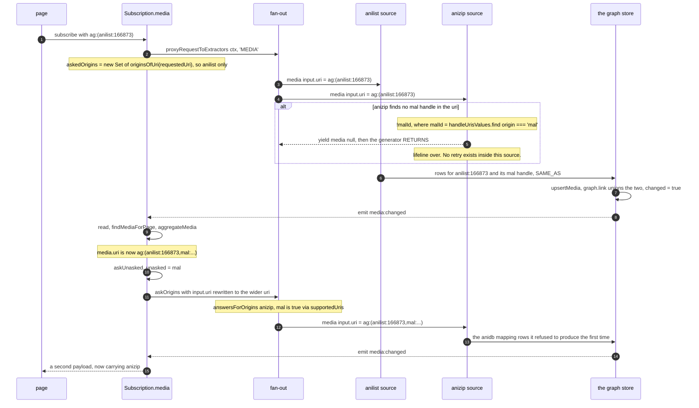
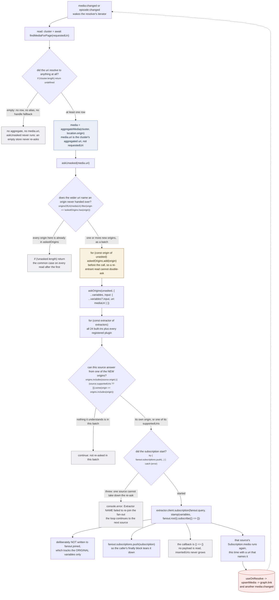
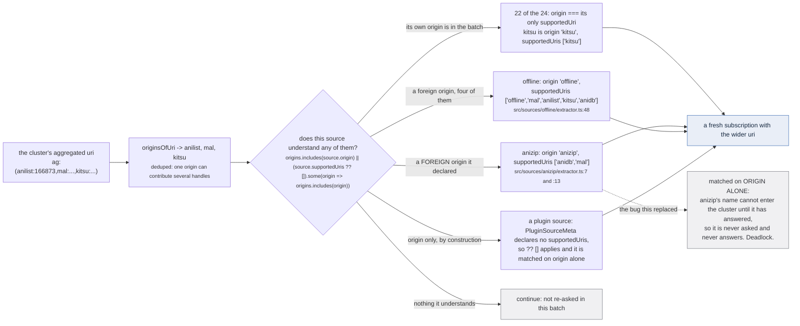
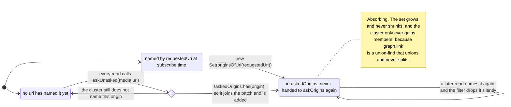

Every source is asked once, unconditionally, on the first pass ([the fan-out](/request/fan-out/)). A
source recognises itself by finding its own handle inside the uri it was handed, and that uri is
captured exactly once, at subscribe time. So a source whose id is contributed *later* by another
source was asked before that id existed, answered "not mine", and **ended**. Its `Subscription.media`
is a yield-once generator with no retry.

The re-ask is what asks it again. `src/worker/extractor.ts:795-802`:

> Ask a subset of the sources again, with a question they can actually answer.
>
> A source identifies itself by finding its own handle inside the uri it is handed, and that uri is
> captured once above. So a source whose id is contributed LATER by another source was asked before
> that id existed, answered "not mine", and ended: its `Subscription.media` is a yield-once
> generator with no retry (crunchyroll/extractor.ts:247-252). Re-asking is the only way it ever
> fetches its own data on the click path, which is the whole of what a reload does differently.

That last clause is the whole point of the page. A reload puts the wide uri in the address bar
before any source is asked, so every source recognises itself on the first pass. A click does not:
it starts from whatever narrow uri the card was carrying. Without the re-ask, the same cluster shows
more sources on a reload than on a click, and nobody can see why.

## Why the first ask fails

The narrow uri comes from the listing. `src/worker/resolvers/media/index.ts:43-48`:

> The uri the sources were asked about is the one the caller had at subscribe time, and a card
> on the home page links to a narrow one: the listing builds its media without running the
> mappers that mint a `cr:` handle (sources/anilist/extractor.ts:320 against :295). A source
> can only recognise itself by finding its own handle in the uri it is handed, so every source
> missing from that narrow uri answered "not mine" and ENDED, milliseconds before another
> source contributed its id.

Those two line references have drifted. The split is real and it is still in AniList's source, one
function apart: the detail path ends `return normalizeMedia(data.Media, handles)` at
`src/sources/anilist/extractor.ts:367`, where `handles` is the output of the `siteMappings` mappers
run at `:355`, and the browse path passes `media => normalizeMedia(media as Media)` at
`src/sources/anilist/extractor.ts:397`, with no second argument at all. A card built by `browse`
carries `anilist:` and, if `media.idMal` is set, `mal:` (`src/sources/anilist/extractor.ts:581-590`).
It carries no `cr:`, because nothing on the listing path ever asked Crunchyroll which season this is.



*The only thing that changed between the two asks of anizip is the uri in the variables. The source
is identical, the document is identical, and the root context is the same one.*

The measurement behind that figure is in `src/sources/supported.ts:18-23`:

> TWO SETS, and conflating them is a whole class of source that never answers. A source publishes
> under one origin and is addressable by others: anizip mints `anizip:` uris but answers from an
> anidb or a mal id, so its own name cannot appear in a cluster until it has already answered. Asked
> only when its own origin shows up, it is never asked at all, and its data appeared only on a reload
> where the address already carried the mal id (measured 2026-09-09 on `ag:(anilist:166873)`, which
> settled without anizip and gained it on a second load).

## `askUnasked` into `askOrigins`

Two functions in two files. `askUnasked` decides *which origins are new*; `askOrigins` decides
*which sources care*. Neither is on the first pass: `joinFanout` has no origin test at all.

`src/worker/resolvers/media/index.ts:58-65`, entire:

```ts
const askedOrigins = new Set(originsOfUri(requestedUri))
const askUnasked = (mediaUri: string) => {
  const unasked = originsOfUri(mediaUri).filter(origin => !askedOrigins.has(origin))
  if (!unasked.length) return
  for (const origin of unasked) askedOrigins.add(origin)
  const variables = ctx.params.variables as { input?: Record<string, unknown> } | undefined
  askOrigins(unasked, { ...variables, input: { ...variables?.input, uri: mediaUri } })
}
```



*The dotted edge back to the top is the loop. It closes because `ADD` runs before `CALL` and
`askedOrigins` never shrinks, not because anything counts the passes.*

Six things in that figure that are easy to get wrong.

**The re-ask is driven by the aggregate, not by the request.** `askUnasked(media.uri)` is called at
`src/worker/resolvers/media/index.ts:74`, inside `read()`, after `aggregateMedia`. `media.uri` is the
cluster's aggregated uri, which grows every time a union lands. `requestedUri` never changes.

**A cluster that never resolves never re-asks.** `if (!cluster.length) return undefined`
(`src/worker/resolvers/media/index.ts:72`) sits above the call, so a uri that resolves to nothing,
including the empty aggregate `ag:()`, opens 24 subscriptions on the first pass and then re-asks
nobody, forever.

**`unasked` is a batch, and `answersForOrigins` is matched against the batch, not against the whole
set.** A source is re-asked when one of *these newly named* origins is one it understands. An origin
that was already in `askedOrigins` cannot trigger a second ask for anybody.

**The re-ask reuses the original root context.** `stamp(variables ?? {}, fanout.root)`
(`src/worker/extractor.ts:833`) is the same `RequestContext` the first pass carried, so the re-ask
inherits `operation: 'MEDIA'` and with it `crossSource: true`
([the request context](/request/request-context/)). A re-asked source spends the same budget the
first ask would have.

**It bypasses `joinFanout` entirely, which is why a source can be asked more than twice.**
`joinFanout` refuses a second subscription with `if (fanout.joined.has(extractor)) return`
(`src/worker/extractor.ts:747`). `askOrigins` calls `extractor.client.subscription(...)` directly and
never touches `joined`. `src/worker/extractor.ts:821-823`:

> Deliberately NOT recorded in `fanout.joined`, which tracks the original variables so a source
> registering mid-flight joins exactly once. These land in `subscriptions`, so the caller's
> teardown collects them with the rest.

**Only one caller in the codebase ever re-asks.** `askOrigins` is destructured at
`src/worker/resolvers/media/index.ts:39` by `Subscription.media` and by nothing else.
`Subscription.mediaPage` takes `{ subscriptions, insertedUris, close }` and leaves `askOrigins` on
the floor (`src/worker/resolvers/media/index.ts:97-107`), so a listing fans out once and never
widens. That is consistent with `MEDIA_PAGE: { crossSource: false }`: a listing is not where an
identity claim is worth paying for.

:::caution[`askedOrigins` is a ratchet, and a failed re-ask is not retried]
An origin enters `askedOrigins` and never leaves. The `add` happens *before* `askOrigins` is called,
so it is recorded as asked whether or not the subscription started, whether or not the upstream
answered, and whether or not the source threw. If anizip's re-ask for `mal` fails, that subscription
is the only one it gets for the life of this page's subscription. The retry is a reload.
:::

## Two sets, and the class of source that needs both

`answersForOrigins` is three lines and it is the only origin test in the whole request path.
`src/sources/supported.ts:27-29`:

```ts
export const answersForOrigins = (source: Answerable, origins: readonly string[]): boolean =>
  origins.includes(source.origin)
  || (source.supportedUris ?? []).some(origin => origins.includes(origin))
```

The two fields it reads mean different things, and the type says so
(`src/sources/supported.ts:8-13`):

> The origin this source PUBLISHES under, which is the prefix on every uri it mints.

> The origins whose ids this source can be ASKED with. Absent means only its own.



*Exactly two of the 24 built-ins declare a foreign origin. For the other 22 the two sets are the same
one set, and the distinction costs nothing.*

`src/worker/extractor.ts:804-810` is the argument, and it names the cost of getting it wrong:

> MATCHED ON `supportedUris` AS WELL AS ON THE SOURCE'S OWN ORIGIN, and the difference is a whole
> class of source. anizip answers from an anidb or a mal id and publishes under `anizip:`, so its
> own name cannot appear in the cluster until it has already answered: matching by origin alone, it
> is never re-asked and never answers at all. Its data only appeared on a RELOAD, where the address
> bar already carried the mal id it needed (measured 2026-09-09 on
> `ag:(anilist:166873)`, which settled without anizip and gained it on the second load).
> `supportedUris` is declared by every source in src/sources and, until this, was read by nothing.

The pin is `tests/unit/sources/supported.test.ts`, and it asserts the live case rather than a
synthetic one: `expect(answersForOrigins(anizip, ['anidb', 'anilist', 'kitsu', 'mal', 'offline'])).toBe(true)`
at `:22`, with the comment above it reading *the bug: a cluster naming anidb and mal but not anizip
left anizip unasked forever*. `:25-28` re-reads anizip's real exports so the case cannot go stale,
and `:39-41` pins the other direction: a source declaring nothing is matched on its origin alone.

Note what `supportedUris` is **not**. It does not widen what a source will accept: anizip's resolver
still refuses anything that is not aggregated and still reads only a `mal` handle
(`src/sources/anizip/extractor.ts:120-126`), so a cluster naming `anidb` and nothing else re-asks it
and it refuses again. `supportedUris` decides who gets a second question, never what the answer is.
That gap is on [how a source recognises itself](/request/self-selection/).

## Termination



*One transition and no way back is the whole proof. Nothing counts asks, nothing sets a deadline,
and no source is capped.*

The proof rests on a store property rather than on a counter, and the property is the same one that
makes writes irreversible. `src/worker/resolvers/media/index.ts:55-56`:

> Terminates: an origin enters the set once and never leaves, and the cluster only ever gains
> members (union-find unions, it never splits), so each source is asked at most twice.

Capping a source at one re-ask would terminate too, and would be wrong.
`src/worker/extractor.ts:812-819`:

> Termination holds WITHOUT capping a source to one re-ask, and the cap would cost correctness. The
> caller only ever hands over origins it has never handed over before (`askedOrigins` in
> resolvers/media/index.ts grows and never shrinks), so a source is asked at most once per origin it
> declares plus once for its own: three questions for the widest source in the tree. Capping it at
> one instead means a source whose needed id lands in a LATER batch than the one that first named
> something it understands is asked too early, refuses, and never gets another chance. anizip
> survives that cap only because anilist happens to contribute anidb, kitsu, mal and offline in a
> single upsert.

:::caution[The two comments disagree, and the code agrees with neither number]
`src/worker/resolvers/media/index.ts:56` says **at most twice**. `src/worker/extractor.ts:815` says
**three questions for the widest source in the tree**. Read off the code, the bound is:

> one opening ask from `joinFanout`, plus at most one per **distinct** origin the source declares
> (its own plus its `supportedUris`), because each origin enters `askedOrigins` exactly once and can
> therefore seed at most one batch.

- A source declaring only its own origin, which is 22 of the 24: **2** questions. This is the
  `index.ts` figure, and it is right for almost every source.
- anizip, `origin 'anizip'` plus `['anidb', 'mal']`, three distinct origins: **4** questions. The
  `extractor.ts` formula is right and its worked number, three, counts only the re-asks.
- offline, `origin 'offline'` plus `['offline', 'mal', 'anilist', 'kitsu', 'anidb']`, five distinct
  origins (`src/sources/offline/extractor.ts:41` and `:48`,
  `src/sources/offline/index-lookup.ts:20`): **6** questions. It, not anizip, is the widest source in
  the tree.

All three are upper bounds and are rarely reached, because `askUnasked` batches: anilist contributing
anidb, kitsu, mal and offline in one upsert makes those four a single batch and therefore a single
ask. Nothing about termination changes; only the arithmetic in the comments is off.
:::

:::danger[A re-ask is a write, and the write has no inverse]
The re-ask exists to make a source answer, and an answer goes straight into the store through
`useOnResolve` and the `mediaInserter` DataLoader. A `SAME_AS` claim between two RUN rows is resolved
into `graph.link` (`src/worker/store/db.ts:162-198`), a **union-find union with no inverse**. Scalars
written by `graph.set` are **last-write-wins**.

So the second question is not a free retry. It is the mechanism by which a source that was refused
once gets to weld two uris together permanently, and the caller's `finally` block
(`src/worker/resolvers/media/index.ts:88-90`) unsubscribes the re-ask without unwinding anything it
already wrote. See [upsertMedia](/write/upsert-media/) and [the graph](/write/graph/).
:::

## Known divergences on this page

Four, all of them stale references rather than wrong behaviour. Recorded here and in
[known divergences](/reference/divergences/).

| where | what it says | what the code does |
| --- | --- | --- |
| `src/worker/resolvers/media/index.ts:56` | "each source is asked at most twice" | true for 22 of 24; anizip bounds at 4, offline at 6 |
| `src/worker/extractor.ts:815` | "three questions for the widest source in the tree" | the formula is right, the number is anizip's; offline declares five distinct origins |
| `src/worker/extractor.ts:801` | cites `crunchyroll/extractor.ts:247-252` for the yield-once generator | the resolver is at `src/sources/crunchyroll/extractor.ts:571-579` today |
| `src/worker/resolvers/media/index.ts:45` | cites `sources/anilist/extractor.ts:320 against :295` | the split is `:367` (mapper handles) against `:397` (none) |

One more, owned by another file but read on this path.
`src/sources/offline/extractor.ts:45-47` says of `supportedUris`:

> Note this export is declarative only: nothing in the worker reads it, so what actually decides is
> the resolver below.

That was true and is not any more. `answersForOrigins` reads it
(`src/sources/supported.ts:29`) and `src/worker/extractor.ts:830` calls that on every re-ask, which
is exactly what `src/sources/supported.ts:25` records: *`supportedUris` is declared by every source
in this directory and was read by nothing until this.* The resolver still decides the **answer**; the
export now decides whether the question is ever put.

## What this page does not decide

- **Whether the re-asked source recognises itself in the wider uri.** It answers that on its own, with
  the same four branches it used the first time: [how a source recognises itself](/request/self-selection/).
- **What the answer does to the store.** A `SAME_AS` between two RUN rows unions; anything else hangs
  an edge: [scopes and relations](/write/scopes-and-relations/).
- **Why `media:changed` fires at all, and what it costs.** [Events, and the re-read loop](/write/events/).
