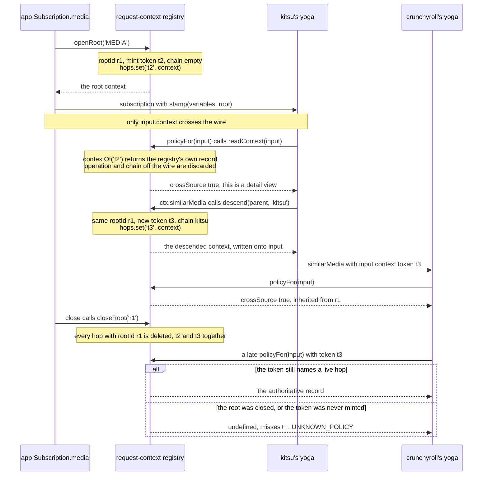
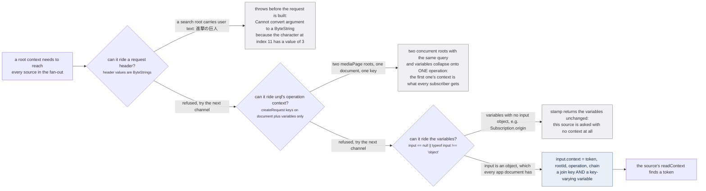
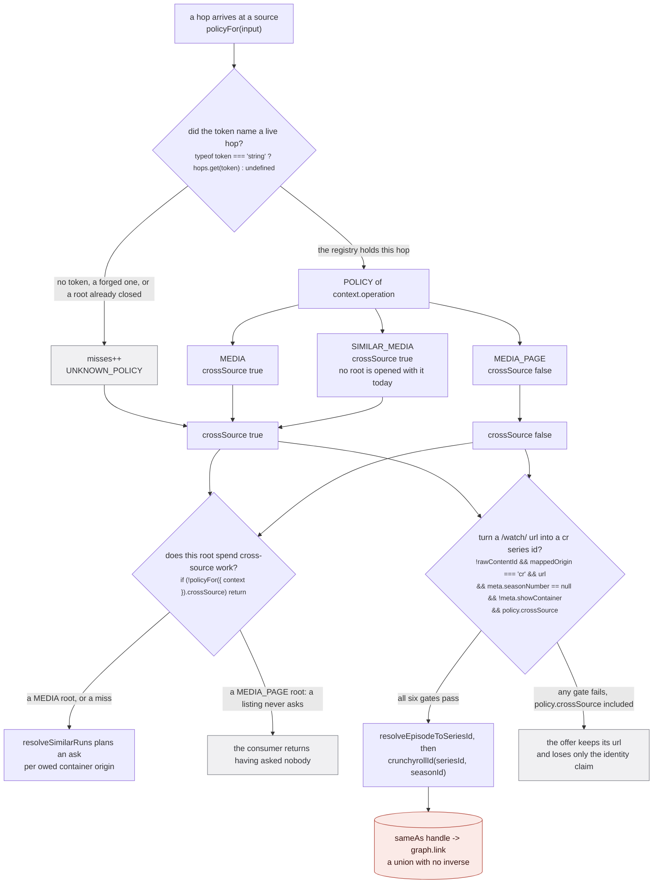
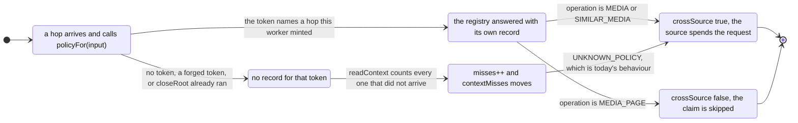

Every source is asked the same question. `media(input: { uri })` arrives at Crunchyroll's yoga, at
JustWatch's, at twenty-two others, and none of them can tell from the arguments whether a person has a
detail page open or whether this is row 14 of a search that will scroll past before anyone reads it.

`src/worker/request-context.ts:3-8`:

> A source is handed `media(input: { uri })` and cannot tell whether a person is looking at that one
> media or whether it is one row of a listing that will never be read. So it does the same work either
> way, and the expensive answer is right in one case and wasted in the other. justwatch's search is
> the live instance: `mediaPage` maps every result through `normalizeMedia`, which reaches
> `buildOffersAsHandles`, which calls into Crunchyroll once per film result to turn a /watch/ url into
> a series id (justwatch/extractor.ts:305). Nothing on a search results page needs that id.

That is the whole of what this module buys. `resolveEpisodeToSeriesId`
(`src/sources/crunchyroll/extractor.ts:133-142`) costs a Crunchyroll access token plus one CMS request
against `/objects/<episodeId>`, and on a search for `frieren` JustWatch runs it once for every film in
the result set. The id it produces identifies a *run*, which is a question only a detail view asks.

The module is deliberately import-free:

`src/worker/request-context.ts:10-12`:

> This module is the registry and the wire format. It deliberately imports NOTHING from the worker or
> the store, so it stays importable under vitest: `worker/extractor.ts` is not, because it imports
> `Client` from urql and through it react.

## The registry, hop by hop

There are two objects in play and they are easy to confuse. A **`RequestContext`** is one hop: a token,
the root it belongs to, the operation the app was asked for, and the origins already on the stack. The
**registry** is a module-level `Map<string, RequestContext>` called `hops`
(`src/worker/request-context.ts:79`), keyed by token, and it is the only authority on any of it.



*Two roots on one page get two `rootId`s and two disjoint sets of tokens, so closing one cannot touch
the other. `closeRoot` and a forged token are the same answer on purpose, and the last exchange is the
one that keeps the site working when the plumbing breaks.*

`openRoot` (`:86-89`) and `descend` (`:92-93`) both funnel into `mint` (`:95-99`), which is the only
writer of the registry:

```ts
const mint = ({ rootId, operation, chain }: Omit<RequestContext, 'token'>): RequestContext => {
  const context: RequestContext = { token: `t${++counter}`, rootId, operation, chain }
  hops.set(context.token, context)
  return context
}
```

One `counter` (`:80`) numbers both, so a root is `r1` and its first token is `t2`. The numbers
interleave and that is fine: a token is an opaque key into `hops`, never a position.

`descend` keeps `rootId` and `operation` and grows `chain` by the calling origin, so a `similarMedia`
hop made by kitsu inherits kitsu's policy rather than deriving one of its own.
`tests/unit/worker/request-context.test.ts:63-72` pins both halves, including that each hop gets its own
token, "which is what varies the urql key".

`closeRoot` (`:111-113`) walks the whole map and deletes every entry whose `rootId` matches. Nothing
else ever removes a hop, so a root that is opened and never closed leaks for the life of the worker.
The app closes exactly one place: `close()` on the object `proxyRequestToExtractors` returns
(`src/worker/extractor.ts:849`), which the `finally` block of both `Subscription.media` and
`Subscription.mediaPage` calls on teardown.

`resetRegistry` (`:149`) exists and must never be called by the app:

`src/worker/request-context.ts:145-147`:

> Empty the registry. TESTS ONLY, and for one reason: it is a module singleton, so a test asserting on
> `registrySize` otherwise reads whatever the tests before it left behind and fails for reasons that
> are not in it. Never called by the app, where dropping live hops would refuse every source in flight.

### Only the token is read off the wire

`readContext` (`:122-127`) reaches past everything the caller sent and asks the registry:

```ts
export const readContext = (input: unknown): RequestContext | undefined => {
  const token = (input as { context?: { token?: unknown } } | null | undefined)?.context?.token
  const context = contextOf(token)
  if (!context) misses++
  return context
}
```

`src/worker/request-context.ts:118-120`:

> REGENERATED FROM THE REGISTRY, never trusted as sent. The only thing taken off the wire is the
> token, so a source or a plugin that rewrites `operation` or `chain` is describing a hop this worker
> already has its own record of.

This is not theoretical. A plugin source runs in another realm and receives its arguments across a
`MessagePort`, so `RequestContext` is a real GraphQL input type
(`src/worker/resolvers/media/schema.gql:403-411`) with `token: ID!`, `rootId: ID!`,
`operation: RootOperation!` and `chain: [String!]!`, all four of which a plugin can rewrite before
answering. Rewriting three of them changes nothing.

`src/worker/resolvers/media/schema.gql:396-401`:

> What the app asked for at the TOP of the call, so a source can tell a detail view from a listing.
>
> THE WORKER WRITES THIS. Every field is regenerated from the worker's own registry at each source's
> boundary before the arguments are coerced, so a value supplied by a caller is replaced rather than
> trusted, and only `token` is ever read off the wire. Nullable because the app's own documents send
> none: they are validated by the app-level server before the fan-out that stamps them runs.

`tests/unit/worker/request-context.test.ts:54-61` is the proof, and it fails loudly if the read is ever
shortened to `input.context.operation`: it opens a `MEDIA_PAGE` root, sends `{ ...root, operation:
'MEDIA' }` on the wire, and asserts `readContext(lying)?.operation` is still `MEDIA_PAGE`.

`contextOf` (`:107-108`) is the whole lookup, and its two failure modes are deliberately one:

`src/worker/request-context.ts:102-105`:

> The authoritative context for a token, or undefined for one this worker never minted.
>
> Undefined is the answer for a forged token AND for a hop whose root has been closed, and the two are
> deliberately the same: neither is a request this worker is still serving.

## Why it rides in the variables

The context is not a header and not urql operation context. Both were tried on this machine and both
are unusable, for reasons that have nothing to do with each other.



*The three refusal nodes are three different shapes of failure. The header throws where you can see it,
the operation context returns the wrong answer silently, and `stamp` returns the variables untouched
and asks the source anyway. Only the third one reaches production, which is why the counter exists.*

`src/worker/request-context.ts:14-24`:

> WHY IT RIDES IN THE VARIABLES, which looks like the clumsiest of the three options and is the only
> one that works. Two channels were measured on this machine and both are unusable:
>
>   a REQUEST HEADER throws. Header values are ByteStrings, and the context has to identify the root,
>   which for a search means user text: `new Request(url, { headers: { x: '{"search":"進撃の巨人"}' } })`
>   raises `Cannot convert argument to a ByteString because the character at index 11 has a value of 3`.
>
>   urql's OPERATION CONTEXT does not vary the operation key. `createRequest` keys on document plus
>   variables only, so two concurrent roots with the same query and variables collapse onto one
>   operation and the first one's context is the one every subscriber gets. Measured: identical
>   variables give an identical key, one extra variable changes it.

`src/worker/request-context.ts:26-27`:

> So the token below is load bearing twice over. It is the join key into this registry, AND it is a
> variable, which is what stops two roots sharing one context.

`stamp` (`:136-140`) is the writer, and it fails soft:

```ts
export const stamp = <T extends Record<string, unknown>>(variables: T, context: RequestContext): T => {
  const input = variables.input
  if (input == null || typeof input !== 'object') return variables
  return { ...variables, input: { ...input as object, context } }
}
```

Every fan-out subscription goes through it: the first pass at `src/worker/extractor.ts:750`, the re-ask
at `:833`. Both `mediaPage` call sites in the app do carry an `input` object
(`src/router/home/index.tsx:75-91`, `src/router/search/index.tsx:271`), so on those paths the stamp
lands.

The `similarMedia` funnel is the one path that reaches the same result without `stamp`.
`similarOutcomeFrom` writes the descended context onto the input object itself
(`src/worker/extractor.ts:323-324`) and `firstSimilarMedia` then subscribes with `{ input }` (`:271`),
so the context is already inside `input` before the variables are built.

Two paths in the worker never stamp anything. `Subscription.origin` and `Subscription.originPage`
(`src/worker/resolvers/origin/index.ts:21-26` and `:50-55`) build their own fan-out loop and pass
`ctx.params.variables` straight through, unstamped. Every source asked on those two paths reads a miss.

## The policy table, and its two readers

The context carries four fields. Exactly one of them is turned into behaviour, through a table of three
rows:

```ts
const POLICY: Record<RootOperation, RequestPolicy> = {   // src/worker/request-context.ts:59-63
  MEDIA: { crossSource: true },
  MEDIA_PAGE: { crossSource: false },
  SIMILAR_MEDIA: { crossSource: true },
}

export const UNKNOWN_POLICY: RequestPolicy = { crossSource: true }   // :73
```

`src/worker/request-context.ts:52-55`:

> Whether an answer is worth a cross-source request. False on a listing, where the expensive id is
> not read by anything on screen, and true on a detail view, which is what the id is for.



*A miss and a `MEDIA` root take the same edge out of this figure, which is the design. The only branch
the policy actually closes today is the one from `NO`, and everything downstream of `S2A` is permanent.*

Two call sites read `crossSource`, and there are no others in the tree.

**The similarMedia consumer**, `src/worker/similar-consumer.ts:281`:

```ts
if (!policyFor({ context }).crossSource) return
```

It is the first line of `resolveSimilarRuns`, before any evidence is gathered.

`src/worker/similar-consumer.ts:269-277`:

> Ask every owed container origin and claim each answer as SAME_AS of the run. Never throws.
>
> Only a root whose policy spends cross-source work asks (a listing never does). A read with no
> evidence records nothing, and a read whose run has no title asks nothing, since an answer could not
> be checked against the show. The claim goes through `upsertMedia` with no rows: the answer's own
> row lands through the answering extractor's insertion, the claim waits for it under
> `pendingClaims`, and a RUN x RUN union emits `media:changed`, which re-runs the page's read, whose
> re-ask of the newly named origin is how the answer's episodes reach the store. The container edge is
> never touched.

Note the shape of the call: `policyFor({ context })`. The consumer is handed the `RequestContext`
object itself by `src/worker/resolvers/media/index.ts:76`, so it wraps it to look like a resolver's
`input` before reading it. The comment one line above that call site says the guard is belt and braces:
"a MEDIA root by construction: only this resolver runs it, so a listing never asks".

**JustWatch's offer builder**, `src/sources/justwatch/extractor.ts:372`:

```ts
if (!rawContentId && mappedOrigin === 'cr' && url && meta.seasonNumber == null && !meta.showContainer && policy.crossSource) {
```

`src/sources/justwatch/extractor.ts:363-367`:

> THE ONE CROSS-SOURCE CALL ON THIS PATH, and the reason the request context exists. Turning a
> /watch/&lt;episodeId&gt; url into a series id costs a Crunchyroll token plus a CMS request, PER FILM
> RESULT, and `mediaPage` runs this for every hit in a search. Nothing on a results page reads
> that id: it identifies the run, which is a detail-view question. So on a listing the offer keeps
> its url and loses only the identity claim, and the detail view spends the request as before.

The policy is threaded as an ordinary parameter, defaulted at three signatures:
`buildOffersAsHandles` (`:323`), `showAsContainer` (`:431`) and `normalizeMedia` (`:467`) each declare
`policy: RequestPolicy = UNKNOWN_POLICY`. `mediaPage` reads the real one once, at `:766`, and passes it
down through `normalizeMedia`.

:::danger[The claim this policy gates is permanent]
When the branch fires, the resolved series id becomes `sameAs(makeMedia({ origin, id: contentId, url }))`
(`src/sources/justwatch/extractor.ts:399-400`), and a `SAME_AS` handle between two `RUN`-scoped rows is
`graph.link`, a union-find union. **Union-find has no inverse.** Two runs welded into one component stay
welded; there is no unlink, and no later source can split them.

The condition has six conjuncts, not five: `!rawContentId`, `mappedOrigin === 'cr'`, `url`,
`meta.seasonNumber == null`, `!meta.showContainer`, `policy.crossSource`. The fifth is the one that is
there for correctness rather than for cost.

`src/sources/justwatch/extractor.ts:368-371`:

> `meta.showContainer` excludes this branch deliberately. It resolves a /watch/ url to the SEASON
> that episode is in, which is a RUN, and the media being built here is the SHOW: claiming the two
> are the same is a cross-scope weld, and `graph.link` has no inverse. The offer is dropped rather
> than demoted because crunchyroll already reaches this cluster under its own series container.

`policy.crossSource` is the cheap gate on that path and `!meta.showContainer` is the correctness one.
Failing open on the first is a wasted request; failing open on the second is a permanent wrong answer.
:::

## Failing open, and the counter that makes it observable

An absent context has to behave exactly as the code behaved before this module existed. That is not a
concession, it is the requirement:

`src/worker/request-context.ts:66-71`:

> The fallback for a hop that arrived with no context, which must be TODAY'S BEHAVIOUR.
>
> Failing open is the deliberate choice for the policy and it is why `misses` exists next to it. A
> context that stopped arriving would otherwise be indistinguishable from one that is working, since
> every source would simply keep fetching exactly as it does now, with the whole suite green. The
> counter is the observable that tells those two apart, and `request-context.test.ts` asserts it moves.



*There is no transition from `gone` to `skips`. A hop that lost its context cannot be told from a
detail view by anything on this diagram, and the only trace it leaves is the counter.*

`tests/unit/worker/request-context.test.ts:1-4`:

> The context has ONE failure mode worth designing against: arriving empty. Every source falls back to
> today's behaviour when it does, with the whole suite green and the site working, so absence is
> indistinguishable from success by construction. `contextMisses` is the observable that separates
> them, and half the tests here exist to prove it moves.

The test that carries the weight is the inert one, `:40-44`. It asserts that `policyFor({})` and
`policyFor(undefined)` both equal `UNKNOWN_POLICY`, and then that `contextMisses()` is exactly `2`.
Its own comment: "If this test is deleted, so is the ability to notice."

:::caution[The counter has no runtime reader]
`contextMisses` and `resetContextMisses` (`src/worker/request-context.ts:76-77`) are exported and,
outside `tests/`, called nowhere. Grep the tree: the only readers are
`tests/unit/worker/request-context.test.ts:43` and `:49`. Nothing logs it, no console line reports it,
and no check-script reads it off a deployed worker the way `scripts/check-similar-media.mjs` reads the
`similarMedia:` lines. So the observable exists and is asserted in CI, and a context that stopped
arriving in the *browser* would still be silent. The counter proves the mechanism works; it does not
yet monitor it.
:::

## What the code says that the plan did not

Four things read differently in the tree at `883aec9` than in the notes this page was written from. The
code wins in all four.

**JustWatch's `Subscription.media` never calls `policyFor`.** The plan lists `justwatch/extractor.ts:593`
as a read on the media path. It is not: `:593` sits inside `similarSeason`, which is the
`Subscription.similarMedia` resolver (`:748-753`). The media path is `:755-759` into `resolveMedia`
(`:724-744`), and it calls `normalizeMedia(node, { seasons, seasonNumber }, ctx)` at `:709` and `:736`
and `showAsContainer(node, ctx)` at `:718`, all three **without a policy argument**, so all three take
the `UNKNOWN_POLICY` default. The behaviour is right by coincidence rather than by reading: a `MEDIA`
root's policy is `{ crossSource: true }` and so is `UNKNOWN_POLICY`, so the two are indistinguishable.
No miss is counted on that path either, because nothing there calls `readContext` at all. So the real
count of policy reads in JustWatch is two, at `:593` and `:766`, and only `:766` can ever produce
`false`.

**`SIMILAR_MEDIA` is never opened as a root.** `openRoot` has exactly one call site in `src/`
(`src/worker/extractor.ts:782`, inside `proxyRequestToExtractors`), and its two callers pass `'MEDIA'`
(`src/worker/resolvers/media/index.ts:39`) and `'MEDIA_PAGE'` (`:100`). A `similarMedia` hop does not
open a root: `similarOutcomeFrom` calls `descend(parent, caller)` (`src/worker/extractor.ts:323-324`),
which keeps the parent's `operation`. So a `similarMedia` ask made from a detail view carries
`operation: 'MEDIA'`, and the third row of `POLICY` is reachable today only from
`tests/unit/worker/request-context.test.ts:27`. The row is not dead code so much as a declared
position: it says what the policy would be if the funnel ever became its own root.

**`chain` is written and read by nothing.** `descend` grows it (`:93`), the schema declares it
(`schema.gql:410`), the generated types carry it, and no consumer in `src/` ever inspects it. The cycle
it is documented to make visible is actually handled elsewhere and differently, by joining an in-flight
ask rather than by looking at the stack (`src/worker/extractor.ts:336-350`). It is a field kept honest
for a reader that does not exist yet.

**`justwatch/extractor.ts:305` in the module header has drifted.** That line is now `jwCandidates`. The
call the comment is pointing at is `resolveEpisodeToSeriesId` at `src/sources/justwatch/extractor.ts:375`,
defined at `src/sources/crunchyroll/extractor.ts:133-142`. The claim is still exactly right; only the
line moved.

## The four fields, and what each is worth

| field | written by | read by | what happens if a caller rewrites it |
| --- | --- | --- | --- |
| `token` | `mint` (`:96`), one per hop | `readContext` (`:123`), the only field taken off the wire | the lookup misses, `misses++`, `UNKNOWN_POLICY` |
| `rootId` | `openRoot` (`:87`), shared by every hop of a call tree | `closeRoot` (`:112`) | nothing: the registry's own copy is what `closeRoot` matches on |
| `operation` | `openRoot`, inherited by `descend` | `policyFor` (`:132`), from the registry record | nothing, and `request-context.test.ts:54-61` pins that |
| `chain` | `descend` (`:93`), nearest caller last | nothing in `src/` | nothing |

`registrySize()` (`:142`) is the fifth observable and, like `contextMisses`, has readers only in tests
(`request-context.test.ts:82-84`). It is what proves `closeRoot` drops a root's hops and leaves an
unrelated root's alone.
