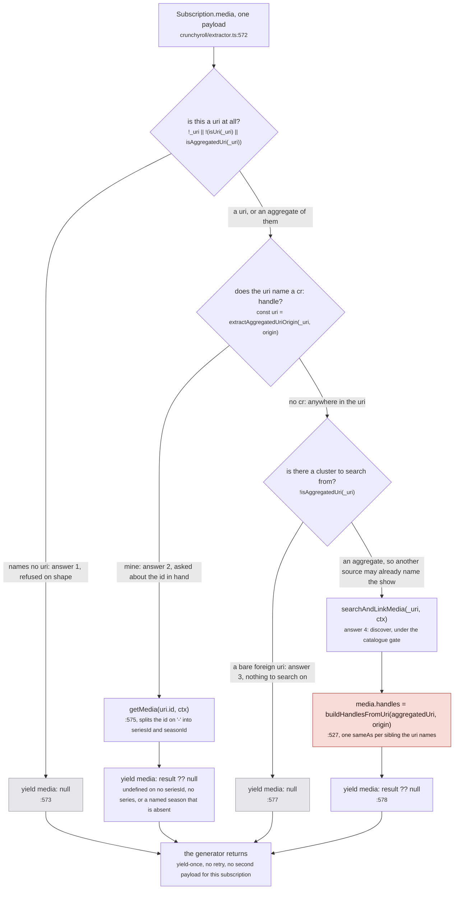
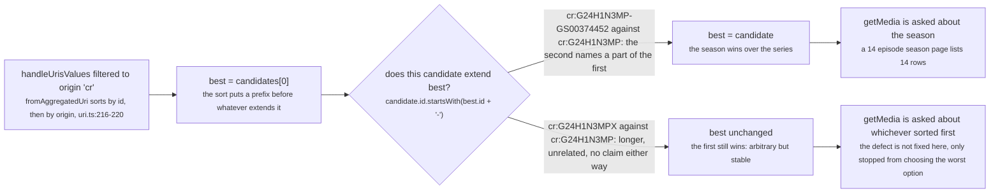
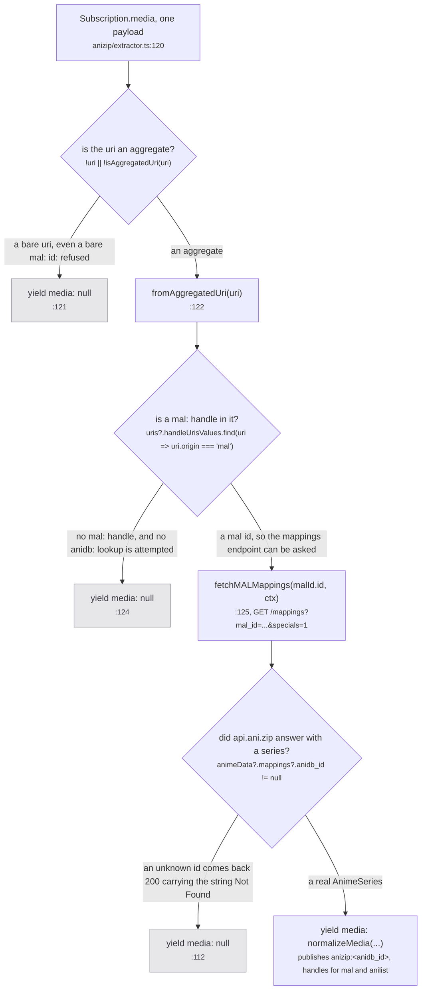

Nothing filters the fan-out. `joinFanout` (`src/worker/extractor.ts:746-766`) contains exactly one
test and it is `if (fanout.joined.has(extractor)) return`; it never reads the uri, never reads
`origin`, never reads `supportedUris`. Open `ag:(anilist:166873)` and all 24 built-in sources are
subscribed with the same document and the same variables, in one loop, at once.

So the question "is this mine?" is answered 24 times in parallel, each time inside a different
source's own `Subscription.media` resolver, against the same three or four lines of code. That is
self-selection. It is the reason the fan-out can stay dumb, and it is the reason a source that was
asked one millisecond too early answers "not mine" and ends: see [the re-ask](/request/re-ask/).

## Four answers, and only one of them writes

A source is handed one string, `input.uri`. It has four ways out, and Crunchyroll
(`src/sources/crunchyroll/extractor.ts:571-579`) is the only built-in source that takes all four:

| answer | condition | what the caller gets |
| --- | --- | --- |
| refused on shape | the argument names no uri at all | `{ media: null }` |
| answered from the id in hand | the uri names a handle of my origin | `{ media: <row> }`, or `null` if the upstream had nothing |
| refused for want of a cluster | my origin is absent and the uri is a bare single uri | `{ media: null }` |
| discovered, then claimed | my origin is absent and the uri is an aggregate | `{ media: <row> }` carrying minted `SAME_AS` handles |

Three of those four are the same payload on the wire. A source that refuses on shape and a source
that recognised itself and found nothing upstream both yield `{ media: null }`, and nothing
downstream can tell them apart. That costs nothing today, because on the `MEDIA` path the fan-out
discards every payload: `joinFanout`'s subscribe callback returns immediately unless
`fanout.extractUris` is set, and the only caller in the codebase that sets it is
`Subscription.mediaPage` (`src/worker/resolvers/media/index.ts:97-107`). Answers reach the page by
being written into the store, not by being returned.

## Crunchyroll's `Subscription.media`, every branch



*Every path ends at the same terminal, and that is the point of the figure: the resolver yields once and is finished, whatever it decided.*

The whole resolver is seven lines, at `src/sources/crunchyroll/extractor.ts:571-579`:

```ts
media: {
  subscribe: async function* (_, { input: { uri: _uri } }, ctx: ExtractorServerContext) {
    if (!_uri || !(isUri(_uri) || isAggregatedUri(_uri))) return yield { media: null }
    const uri = extractAggregatedUriOrigin(_uri, origin)
    if (uri) return yield { media: await getMedia(uri.id, ctx) ?? null }
    // no `cr:` in the uri, so no source ever supplied one. Search, under the gate above.
    if (!isAggregatedUri(_uri)) return yield { media: null }
    yield { media: await searchAndLinkMedia(_uri, ctx) ?? null }
  }
}
```

Branch by branch:

- **Answer 1** is a shape test, not an identity test. `isUri` (`src/utils/uri.ts:71-80`) counts
  colon-separated non-empty parts and returns on `parts.length === 2`; it also *throws* on
  `parts[1]?.includes(',')`. `isAggregatedUri` (`:99-105`) needs the `ag:` prefix, a match against
  `/ag:\((.*)\)(?:-(.*))?/`, and every comma-separated element inside the parentheses to be a uri.
- **Answer 2** is the only branch that reaches upstream with an id the cluster already knew.
  `getMedia` splits that id on `-` into `[seriesId, seasonId]` (`crunchyroll/extractor.ts:230`) and
  refuses three ways of its own: `if (!seriesId) return undefined` (`:231`),
  `if (!series) return undefined` (`:235`), and `if (seasonId && !targetSeason) return undefined`
  (`:242`). Each of those becomes `null` through the `?? null` at `:575`.
- **Answer 3** exists because there is nothing to search *with*. A bare `anilist:166873` carries one
  handle and one title the source has not read; only an aggregate gives
  `searchAndLinkMedia` a cluster to call `waitForMedia` on.
- **Answer 4** is the expensive one and the only one that mints. It waits up to `30_000` ms for the
  cluster to carry both a title and a `startDate` (`:457-462`), builds up to
  `MAX_SEARCH_QUERIES = 4` query rungs (`:470`, constant at `:370`), keeps only search hits scoring
  `>= CONFIDENT_TITLE_THRESHOLD` (`0.9`, `:366`), takes the top `MAX_SERIES_CANDIDATES = 3` (`:369`),
  and runs `pickSimilarSeason` per candidate until one returns a verdict. Then, at `:527`, it writes
  the identity claim.

### The generator yields once, and that is why a refusal is a payload

Every one of the four paths above is `return yield { ... }` or a bare final `yield`. None of them
completes without yielding, and the reason is stated where the default resolvers are built,
`src/worker/extractor.ts:459-462`:

> most sources cannot answer show-plus-evidence, and the default has to YIELD that rather than end: a
> subscription generator that completes without yielding makes yoga respond 204 No Content, which the
> caller would sit on until its timeout instead of reading a refusal off the first payload

Yielding once and ending is also what makes the re-ask necessary. The uri was captured at subscribe
time; when another source contributes `cr:` a second later, this generator is already finished. There
is no retry inside it, which is why `askOrigins` (`src/worker/extractor.ts:825-839`) opens a *new*
subscription rather than poking the old one.

:::danger[Answer 4 is irreversible]
`buildHandlesFromUri` (`src/sources/utils.ts:465-471`) returns one `sameAs(...)` handle per sibling
the aggregated uri names. Every `SAME_AS` handle whose two ends share a scope becomes
`graph.link(mediaUri, handleUri, sameAsLabelFor(mediaScope))` at `src/worker/store/db.ts:193`, and
`graph.link` (`src/worker/store/graph.ts:279-291`) is a union-find union. **There is no inverse.**
The graph's whole surface is `set, registerLabel, setLabel, labeled, get, has, alias, resolve, link,
connect, neighbours, root, componentId, edge, targets, sources, cluster, clusters, clear`
(`graph.ts:377-382`): no `unlink`, no split, nothing but `clear` for the entire store. A wrong
Crunchyroll search hit welds two runs together for the rest of the session.

That is exactly what the gate on answer 4 is defending, and the comment on `buildHandlesFromUri`
says the trade out loud (`src/sources/utils.ts:447-451`):

> SAME_AS PRESERVES TODAY'S BEHAVIOUR and is not an endorsement of it. The uri is user input: a stale
> bookmark re-injects whatever claims it carries, and `graph.link` has no inverse. What makes that
> worth keeping for now is the shared-link case, where the uri is the only evidence those siblings
> exist until their own sources answer.
:::

## `mostSpecific`: prefix extension, not length

Answer 2 hangs on one function. `extractAggregatedUriOrigin` (`src/utils/uri.ts:43-46`) filters the
uri's handles down to this source's origin and then has to pick one, because a cluster can name the
same origin twice: Crunchyroll's series id and Crunchyroll's season id are both `cr:`.



*One decision, run once per candidate in a single pass, and the right-hand branch is not a failure: it is the case where no answer is better than any other.*

The loop is four lines (`src/utils/uri.ts:34-41`), and the comment above it is the measurement that
produced the rule (`src/utils/uri.ts:17-32`):

> This used to take the first match of a list `fromAggregatedUri` sorts by id, and a show-level id is
> a strict PREFIX of its own season-scoped form, so the show always sorted first and always won.
> `cr:G24H1N3MP` beat `cr:G24H1N3MP-GS00374452` in every locale, which is how the Crunchyroll source
> came to be asked about a whole series while the correct handle for the run sat in the same cluster,
> unreachable. It answered with every season's episodes and a 14 episode season page listed 24 rows.
>
> SPECIFICITY IS PREFIX EXTENSION, NOT LENGTH, and the distinction is the whole safety of this. Two
> unrelated ids of one origin say nothing about each other however long they are, so the longer is not
> more specific and picking it would be a different arbitrary answer rather than a better one. Only
> `<a>` against `<a>-<something>` is a claim that the second names a part of the first, and that is
> exactly the shape every season-scoped id in this codebase is built in: `crunchyrollId` joins on '-',
> `jwId` and `seasonScopedId` likewise.
>
> TWO ids of one origin in one cluster is itself a defect and this does not fix it, it only stops the
> defect choosing the worst of them. When neither extends the other the first still wins, which is
> arbitrary but stable, and stability is what keeps a source answering the same way twice.

Run against the real ids, in the order `fromAggregatedUri` produces:

| candidates in the cluster | picked | why |
| --- | --- | --- |
| `G24H1N3MP`, `G24H1N3MP-GS00374452` | `G24H1N3MP-GS00374452` | the season extends the series |
| `G24H1N3MP-GS00374452`, `G24H1N3MP` | `G24H1N3MP-GS00374452` | order does not matter: the sort restores it |
| `G24H1N3MP`, `G24H1N3MPX` | `G24H1N3MP` | neither extends the other, first wins |
| `G24H1N3MP`, `G24H1N3MP-GS00374452`, `G24H1N3MP-GS00374452-GABC` | `G24H1N3MP-GS00374452-GABC` | the chain extends twice, one pass |

Two details in that first column are load bearing. The single pass is only correct because the list
is pre-sorted: `fromAggregatedUri` sorts by id and then by origin (`src/utils/uri.ts:219-220`), and
the inline comment at `:36` says why that is enough: *the list arrives sorted by id, so a prefix
always precedes what extends it and one pass suffices*. And the guard carries the hyphen,
``startsWith(`${best.id}-`)`` rather than `startsWith(best.id)`, which is the entire difference
between row 1 and row 3 of that table.

Fourteen of the 24 built-in source modules import `extractAggregatedUriOrigin`: anilist, appletv,
crunchyroll, justwatch, kitsu, omdb, paramount, simkl, tmdb, trakt, tvdb, tvmaze, unogs and
watchmode. It is the canonical shape, and the two sources below are the exceptions.

## Anizip refuses differently

AniZip publishes under `anizip:` but answers from somebody else's id, so it can never find its own
origin in a uri it has not already answered. Its resolver is a different shape
(`src/sources/anizip/extractor.ts:116-129`):



*Three refusals and one answer, and the third refusal is a 200 response: an unknown id comes back as the string `Not Found` rather than an error, so the shape has to be checked rather than the status.*

Two differences from the Crunchyroll shape are worth naming. First, there is no `isUri` branch at
all: a bare uri is refused whatever it names, so handing this source the literal `mal:5114` gets
`{ media: null }` even though that is exactly the id it wants. Second, there is no search branch:
AniZip cannot discover anything, it can only translate an id it was given.

:::caution[Divergence: `supportedUris` is wider than the resolver]
`src/sources/anizip/extractor.ts:13` declares `supportedUris = ['anidb', 'mal']`, and that array is
what `answersForOrigins` reads to decide whether to re-ask this source
(`src/sources/supported.ts:27-29`). The resolver reads only `mal`
(`anizip/extractor.ts:123`). `fetchAnizipMappings` is written to take
`'anilist' | 'mal' | 'anidb'` (`:109`), and `fetchAnizipJsonMappings` under it likewise (`:105`), but
the only wrapper defined is `fetchMALMappings` (`:114`) and it is the only one called.

So a cluster that gains an `anidb:` handle and no `mal:` one satisfies `answersForOrigins`, gets
re-asked, spends a full subscription, and refuses at `:124`. Nothing breaks, and no request is made
upstream, but the re-ask is guaranteed to be wasted. Recorded under
[known divergences](/reference/divergences/).
:::

`supportedUris` is the fix for the *other* half of this source's problem, and the reason it exists is
in `src/sources/supported.ts:18-23`:

> TWO SETS, and conflating them is a whole class of source that never answers. A source publishes
> under one origin and is addressable by others: anizip mints `anizip:` uris but answers from an
> anidb or a mal id, so its own name cannot appear in a cluster until it has already answered. Asked
> only when its own origin shows up, it is never asked at all, and its data appeared only on a reload
> where the address already carried the mal id (measured 2026-09-09 on `ag:(anilist:166873)`, which
> settled without anizip and gained it on a second load).

## A third shape: jikan cannot see an aggregate at all

Read the code and there is a third shape, on a source that matters. jikan publishes under origin
`mal` (`src/sources/jikan/extractor.ts:13`) at `SCORE = 0.9` (`:26`), tied with anizip for the
highest score any source carries. It refuses on the *opposite* test to AniZip's
(`src/sources/jikan/extractor.ts:373-380`):

```ts
subscribe: async function*(_, { input: { uri } }, ctx: ExtractorServerContext) {
  if (!uri || !isUri(uri)) return yield { media: null }
  const uriValues = fromUri(uri)
  if (uriValues.origin !== origin) return yield { media: null }
  yield {
    media: await fetchMedia({ id: Number(uriValues.id) }, ctx)
  }
}
```

`isUri` is `parts.length === 2` after splitting on `:`. Every aggregated uri splits into three or
more parts, so `isUri('ag:(mal:5114)')` is `false` and `isUri('ag:(anilist:166873,mal:5114)')` is
`false`. This resolver therefore refuses every aggregated uri, which is the only form the media modal
and the watch page ever send: `asAggregatedUri` (`src/utils/uri.ts:120-128`) wraps a bare uri before
it becomes a route, and `askOrigins` re-asks with `media.uri`, which is the aggregate. jikan's
`Subscription.media` answers only when a bare `mal:<id>` reaches it directly.

jikan's data still lands, because `Subscription.mediaPage` (`:382`) has no such gate and the home
page's seasonal listing runs through it. But on the media path this is a source that is asked and
that structurally cannot answer, which is a different thing from a source that is asked and simply
has nothing to say.

## The one case where the whole thing is bypassed

`isUri` accepts `ag:()`: split on `:` gives `['ag', '()']`, two non-empty parts. So the empty
aggregate satisfies both predicates at once, passes the shape gate on every source, and then contains
no handles for anybody, so every one of the 24 falls to its own "not mine" branch. It costs 24
generators that yield once. Nothing else in the tree treats it specially.

## Where this goes next

- **A source that refused is not finished.** The uri it was handed was captured at subscribe time; if
  another source names its origin a moment later, `askUnasked` opens a fresh subscription with the
  wider uri. That is [the re-ask](/request/re-ask/), and it is the only reason a click path ever
  matches what a reload shows.
- **What answer 4 is allowed to claim** is decided by the catalogue gate, not by this file: the
  title axis, the 45-day date window, and why no similarity number can close the last 4.002%.
  See [the search gate](/sources/search-gate/).
- **Why `cr:G24H1N3MP-GS00374452` exists at all**, and which sources can mint an honest one, is
  [season-scoped ids](/sources/season-ids/).
