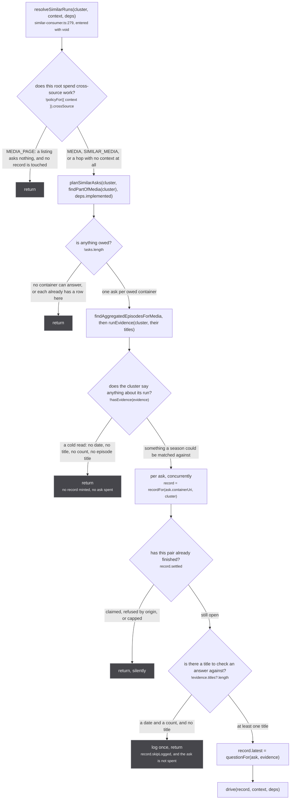
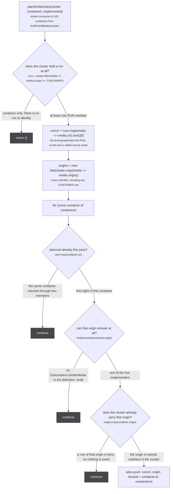
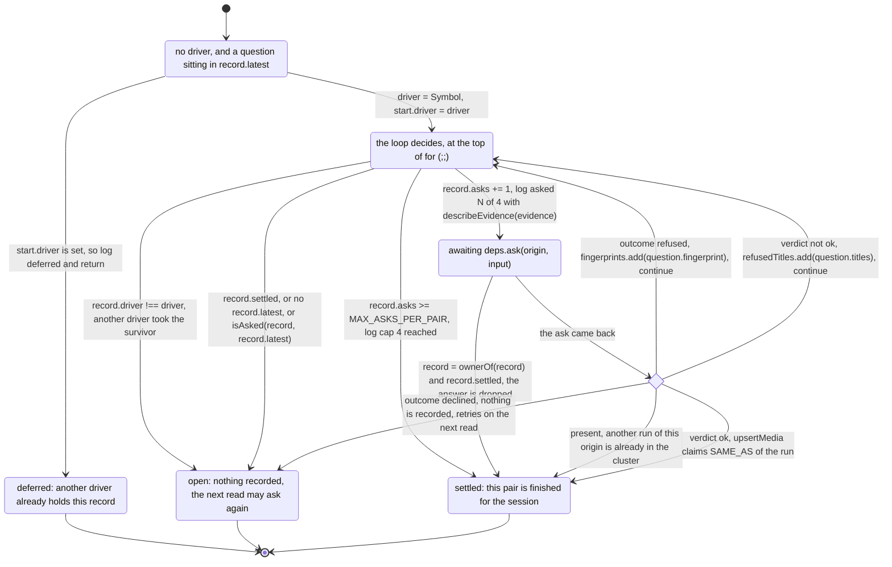
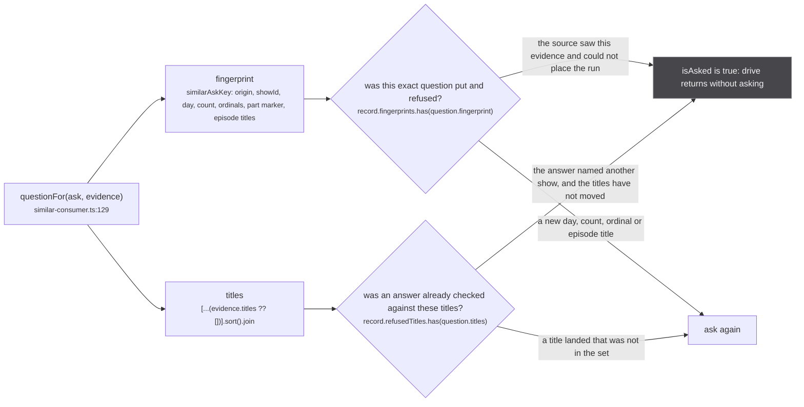
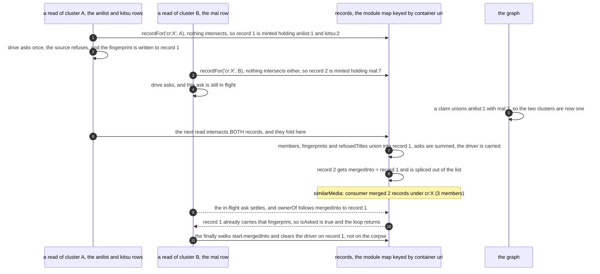

`src/worker/similar-consumer.ts` is 306 lines and holds one module-level map. It is the only thing in
the app that asks a source `similarMedia`, and almost all of it is bookkeeping: which pair has been
asked, with which question, what came back, and whether anything that landed since is a new question
worth spending an ask on.

The subsystem's argument lives on [why it exists](/similar/why/). This page is the caller: what it
plans, what it refuses, what it remembers, and what it finally writes.

`src/worker/similar-consumer.ts:1-13`

> The one place the app asks `similarMedia`: on a run's page, after aggregation, per (run cluster,
> container) pair, re-asked only when the question changes.
>
> The ask lives HERE rather than inside each source's resolver because a source sees only its own
> view (kitsu has titles, a date and a count but no episode titles at handle time; justwatch would ask
> with JustWatch's numbering, the very collision under repair), asks on every operation unless it
> remembers the policy, and asks only for the pointers it happens to hold. The worker sees the whole
> cluster: the best day-precise date across members, every title, the highest-scored episode count,
> ani.zip's episode titles, and every container the run is PART_OF whatever source or fuzzy pass
> produced the edge. `Subscription.media` is the only caller, which is what keeps this off listings.
>
> Pure of the extractor on purpose: worker/extractor.ts cannot load under vitest, so the asking and
> the claiming are here and the resolver only wires them.

## The one call site

`src/worker/resolvers/media/index.ts:76`, inside the page read that runs on every `media:changed`:

```ts
// a MEDIA root by construction: only this resolver runs it, so a listing never asks
void resolveSimilarRuns(cluster, root, { ask: askSimilar, implemented: implementsSimilarMedia })
```

Three things are decided by that line. It is `void`, so the page's yield never waits on an ask that
may take up to `SIMILAR_MEDIA_TIMEOUT_MS`, 30 seconds. It is handed the whole cluster, not the
aggregate, because the evidence is assembled across members. And `askSimilar` is
`similarOutcomeFrom('app')` (`media/index.ts:24`), so the app's own asks are budgeted under one
caller exactly like a source's; that funnel is [the next page](/similar/funnel/).

## `resolveSimilarRuns`, every exit



*Five exits and none of them throws: the whole body is a try/catch whose catch is one `console.error` (`:300-302`). A caller that forgot the `void` would still never see a failure.*

The gate at `:281` reads the request context, and the table it reads is
`src/worker/request-context.ts:59-63`: `MEDIA: { crossSource: true }`,
`MEDIA_PAGE: { crossSource: false }`, `SIMILAR_MEDIA: { crossSource: true }`. A hop that arrived with
no context at all gets `UNKNOWN_POLICY` (`request-context.ts:73`), which is `{ crossSource: true }`
and counts a miss. So a lost context asks, and is observable; see
[the request context](/request/request-context/).

Two of those exits look alike and are not. `!hasEvidence(evidence)` at `:286` returns before any
record is consulted, so a cold read burns nothing at all: no record is minted, `asks` does not move,
and the next read after a source lands starts from zero (`similar-consumer.test.ts:203`, *a cold read
with no evidence burns nothing*). The title check at `:290` is downstream of a record: it is reachable
only when the run has a date or a count but no title, `hasEvidence` is satisfied by either
(`src/sources/similar.ts:83-87`), and an answer with nothing to check against could never be verified.
That path logs once per record and spends no ask either.

`src/worker/similar-consumer.ts:268-278`

> Ask every owed container origin and claim each answer as SAME_AS of the run. Never throws.
>
> Only a root whose policy spends cross-source work asks (a listing never does). A read with no
> evidence records nothing, and a read whose run has no title asks nothing, since an answer could not
> be checked against the show. The claim goes through `upsertMedia` with no rows: the answer's own
> row lands through the answering extractor's insertion, the claim waits for it under
> `pendingClaims`, and a RUN x RUN union emits `media:changed`, which re-runs the page's read, whose
> re-ask of the newly named origin is how the answer's episodes reach the store. The container edge is
> never touched.

## `planSimilarAsks`, four filters

```ts
export const planSimilarAsks = (cluster: Media[], containers: Media[], implemented: (origin: string) => boolean): SimilarAsk[] => {
  const runs = cluster.filter(media => media.scope !== 'CONTAINER')
  if (!runs.length) return []
  const runUri = runs.map(media => media.uri).sort()[0]!
  const origins = new Set(cluster.map(media => media.origin))
  const asks: SimilarAsk[] = []
  const seen = new Set<string>()
  for (const container of containers) {
    if (seen.has(container.uri)) continue
    seen.add(container.uri)
    if (!implemented(container.origin)) continue
    if (origins.has(container.origin)) continue
    asks.push({ runUri, origin: container.origin, showId: container.id, containerUri: container.uri })
  }
  return asks
}
```



*Three of the four filters are `continue`, so one unaskable container never costs the others their ask. The first is a `return []`, because a cluster with no run has no `runUri` to put on any of them.*

`implemented` is `implementsSimilarMedia` (`src/worker/extractor.ts:292-295`), which reads the
**definition's** resolvers rather than the merged schema, so `makeExtractor`'s yield-null default
counts as not implemented. Five sources implement the field: crunchyroll
(`crunchyroll/extractor.ts:563`), unogs (`unogs/extractor.ts:471`), justwatch
(`justwatch/extractor.ts:748`), tvmaze (`tvmaze/extractor.ts:196`) and appletv
(`appletv/extractor.ts:403`). Everything else is skipped here, which saves a subscription round trip
that could only answer null.

Worked on the test fixture (`tests/unit/worker/similar-consumer.test.ts:40-57`): the cluster is
`anilist:1` and `kitsu:2`, both RUN, PART_OF `cr:X` and `imdb:tt1`, both CONTAINER. `runUri` is
`anilist:1` because it sorts first. `imdb:tt1` is dropped by `implemented`. One ask comes out:
`{ runUri: 'anilist:1', origin: 'cr', showId: 'X', containerUri: 'cr:X' }`. Store a `cr:X-S1` row into
that cluster and the same call returns `[]`, because `origins` now holds `cr`
(`similar-consumer.test.ts:409-418`).

:::note[The doc and the code differ by one word]
The docstring at `:139-142` says *one per container origin that can answer and has no **run** in the
cluster*. The code tests `origins`, built at `:147` from **every** cluster member, CONTAINER-scoped
members included, not from the `runs` collected at `:144`. That is stricter than the doc and it is
the right way round: a CONTAINER row of that origin sitting inside a run cluster is the wreckage of
the race [claims that wait](/write/pending-claims/) exists to prevent, and asking against it would
put a second run of one origin into the same cluster. The code wins.
:::

## The evidence a cluster hands over

`runEvidence` (`:167-177`) sorts the cluster by score descending, nulls last (`byScoreDescending`,
`:160-164`), and reads four fields off it:

| field | how | refusals folded in |
| --- | --- | --- |
| `titles` | every title of every member, deduped, in score order | `isOnlySeasonLabel` drops anything that is empty once season markers come off (`src/sources/season.ts:128-129`) |
| `startDate` | `bestRunStartDate` (`similar.ts:118-119`): the first date that names a DAY, else the first non-empty one | a `YYYY-01-01` from a higher-scored member loses to a day-precise date from a lower-scored one |
| `episodeCount` | `runLength(cluster)` (`store/consensus.ts:62-63`), the tiered consensus, never a local max | nothing states a count, so the field is absent |
| `episodeTitles` | deduped, `slice(0, 200)` | the walk is `findAggregatedEpisodesForMedia`, the unwindowed one, so a lent season's titles can be in here |

`src/worker/similar-consumer.ts:172-173`

> the same number the aggregate publishes, so a source is asked against what the page shows rather
> than a second opinion assembled here (store/consensus.ts)

`src/sources/similar.ts:113-117`

> The date to describe a run with, out of its members' dates ordered by score descending: the first
> one naming a DAY, else the first non-empty one. A day-precise date is worth more than a
> higher-scored `YYYY-01-01`, since only a day can be measured against a 45 day window.

The fixture shows both halves of that at once. `anilist:1` scores 0.8 and says `2026-01-01` with 12
episodes and the titles `['Show', 'Season 3']`. `kitsu:2` scores 0.3 and says `2026-07-04` with 14.
What goes out is `titles: ['Show']`, `startDate: '2026-07-04'`, `episodeCount: 12`,
`episodeTitles: ['Alpha', 'Beta']` (`similar-consumer.test.ts:96-105`). The date comes from the
low-scored member because it names a day; the count comes from the high-scored one because
`tieredConsensus` only ever looks inside the top tier; and `'Season 3'` is gone, because a bare season
label names a position and never a show.

## `drive`, the state machine

One driver per record, one ask in flight, and a loop that re-reads its own record after every await.



*Only two arrows re-enter the decision, and both of them wrote something down first. That is what makes the loop finite: a pass that records nothing also leaves.*

`src/worker/similar-consumer.ts:179-187`

> Ask a record's newest question until the pair settles or the question repeats. One driver per
> record at a time; a read landing while an ask is in flight only moves `latest`, and the loop
> re-checks it when the ask settles. A decline never reached the source, so nothing is recorded and
> the next read retries it; a refusal did, so the same evidence is not put again; an answer naming
> another show is recorded with the titles it was checked against, so a title landing later (the
> English one after a romaji-only first read, which scores 0.44 against Crunchyroll's English series
> title) asks again and the same answer is checked again.

Four details of that loop are worth reading off the file rather than the picture.

**The guard is a deferral, not a drop** (`:189-193`). A second read while an ask is in flight logs
`deferred` and returns, having already overwritten `record.latest` at `:297`. When the in-flight ask
settles, the loop goes round, finds the newer question, and asks it: measured at
`similar-consumer.test.ts:221-238`, where the second call carries five episode titles instead of two.
The `start.latest!` non-null assertion at `:190` is safe only because `resolveSimilarRuns` sets
`latest` on the line immediately before it calls `drive`.

**Every await is followed by `ownerOf`** (`:201`, `:222`). A cluster merge can land between the ask
going out and the answer coming back, and the record this driver holds may have been folded into
another one since. Following the pointer is what keeps the bookkeeping attached to the surviving
record.

**The re-read before the claim** (`:239`) is not paranoia, it is the second writer:

`src/worker/similar-consumer.ts:236-238`

> another caller (anilist's own mapping, or a merged record's ask) may have named this origin's run
> while the ask was in flight; a second run of one origin in one cluster is two seasons welded, so the
> cluster is re-read and an answer that is not the run already there is refused

Both branches settle the pair. If the answer agrees with the row that arrived meanwhile, the line is
`settled`; if it disagrees, it is `refused-by-origin` and the answer is thrown away. The test drives
exactly that: `cr:X-S1` joins the cluster while the ask is out, the ask answers `cr:X-S3`, and the
cluster ends as `['anilist:1', 'cr:X-S1', 'kitsu:2']` (`similar-consumer.test.ts:349-367`).

**The cap counts declines.** `MAX_ASKS_PER_PAIR = 4` (`:40-41`), incremented at `:212` before the ask
is made, so anything that reached `deps.ask` counts, including an ask the funnel declined without
touching the source. Six reads against a source that always times out produce exactly four calls and
then the line `similarMedia: consumer settled cr X for anilist:1 (cap 4 reached)`
(`similar-consumer.test.ts:173-183`). The counter also survives a cluster merge additively (`:115`),
so two merged records that spent two asks each start settled.

## Two memories, not one

`isAsked` reads two sets, and the split between them is the most consequential decision in the file:

```ts
const isAsked = (record: AskRecord, question: Question): boolean =>
  record.fingerprints.has(question.fingerprint) || record.refusedTitles.has(question.titles)
```



*The two keys are computed from the same evidence and answer different questions, which is why more episode titles reopen one memory and never the other.*

`src/worker/similar-consumer.ts:57-61`

> title sets an answer was checked against and did not name our show. Kept apart from the
> fingerprints: more evidence about the SEASON cannot change the show an answer names, so it asks
> nothing, while a title landing later can, so it asks again

The fingerprint deliberately does **not** carry the raw title list. `similarAskKey`
(`src/sources/similar.ts:331-338`) keeps only the season ordinals the titles agree on and a marker
for whether any of them names a part, because that is all the answering rules read titles for. So two
different title sets that agree on ordinals share one fingerprint, and `Question` carries the sorted
raw title set as a second key (`:129-134`) that only the which-show check reads.

The measurement that forced the split is at the top of the test that pins it:

`tests/unit/worker/similar-consumer.test.ts:276-281`

> The real Mushoku Tensei shapes. A cold page's first read is routinely ONE source's row, and kitsu's
> carries the romaji title alone, which scores 0.441 against Crunchyroll's English series title
> (measured 2026-09-05; the native title scores 0.005). Settling the pair on that refusal made the
> recall gap permanent: the English title landing a moment later could never reopen it.

Concretely: kitsu's `Mushoku Tensei III: Isekai Ittara Honki Dasu` alone refuses
`cr:G24H1N3MP-GS00374452`, whose row is titled `Mushoku Tensei: Jobless Reincarnation`. AniList lands
a moment later with `Mushoku Tensei: Jobless Reincarnation Season 3`, the title set changes, the same
question is asked a second time, the same answer is checked again and this time passes
(`similar-consumer.test.ts:285-307`). The other direction is pinned too: three more episode titles
after a refusal-by-title do not ask again, because *more evidence about the SEASON cannot change the
show the answer names* (`:258-276`).

The check itself is `answerNamesOurShow` (`src/sources/similar.ts:305-320`), the best pair over our
titles and theirs after `franchiseTitle` strips season markers from both sides, against
`SHOW_TITLE_THRESHOLD = 0.9` (`similar.ts:299-303`, the value crunchyroll's search gate measured:
correct pairs 1.000, the nearest wrong pair 0.8135, a spin-off). Either side empty is a refusal and
never a pass: an answer with no titles at all cannot be checked, so it is not verified
(`similar-consumer.test.ts:386`).

## `recordFor`: found by member intersection

A record is keyed by container uri and found inside that list by intersecting members, never by
component id.

`src/worker/similar-consumer.ts:85-90`

> A record is found by MEMBER INTERSECTION rather than by `graph.componentId`: `carryComponentId`
> keeps one of the two ids on a union, so a record keyed on the id that did not survive would be
> orphaned and re-asked. Two records both intersecting the cluster are two clusters that were
> unioned since they were last read, and they merge here. The absorbed record keeps a pointer to the
> survivor: its driver, if one is mid-ask, resumes on the survivor and clears the survivor's flag,
> where a copied boolean stayed set for the session and the merged pair was never asked again.

`carryComponentId` is `src/worker/store/graph.ts:249-263`: on a union it keeps exactly one of the two
component ids, by size and then by the smaller root, and deletes the other. So half of all unions
would orphan a record keyed that way.



*The last two steps are the bug this pointer was added for: a driver that cleared its flag on the absorbed record left the survivor marked in flight for the rest of the session.*

The `finally` is four lines and it is the whole fix (`:261-265`):

```ts
} finally {
  for (let held: AskRecord | undefined = start; held; held = held.mergedInto) {
    if (held.driver === driver) held.driver = undefined
  }
}
```

The regression test is `similar-consumer.test.ts:312-343`, and its header states what went wrong:
*the survivor copied the other's in-flight flag, the other's driver cleared its own on settle, and the
merged pair sat "in flight" for the session with nothing to say about it (2026-09-05)*. It ends by
adding three episode titles and asserting the merged pair is asked again, which is the property a
stuck flag destroys.

## The claim

:::caution
**A claim here is a `SAME_AS` like any other.** It goes through `upsertMedia` with no rows, waits
under `pendingClaims` for the answer's own row, and then unions in the run space. The show check
(`answerNamesOurShow`, threshold 0.9) and the re-read for an origin already in the cluster are the
last two things standing before it.
:::

```ts
record.settled = true
await upsertMedia([], [{ mediaUri: ask.runUri, handleUri: result.media.uri, relation: 'SAME_AS' }])
console.warn(`similarMedia: consumer claimed ${result.media.uri} as SAME_AS of ${ask.runUri}`)
```

An empty `newMedias` means the rows loop of `upsertMedia` does nothing and `landed` stays empty
(`src/worker/store/db.ts:139-152`), so this call flushes no deferred claims of its own. The claims
loop then finds that the answer's uri has no row yet, because the answering extractor's own insertion
is still in flight, and parks the claim under `pendingClaims` keyed by that uri
(`db.ts:177-183`, the map at `db.ts:124`). When the row lands the claim is applied, both ends read
`RUN`, and `graph.link` at `db.ts:193` unions them.

Three things about that are worth being precise on.

**The container edge is never touched.** The claim names the run and the answer, and nothing writes to
the `PART_OF` edge that produced the ask. The test asserts both sides: after the answer's row arrives
the cluster is `['anilist:1', 'cr:X-S3', 'kitsu:2']` and `findPartOfMedia` still returns
`['cr:X', 'imdb:tt1']` (`similar-consumer.test.ts:107-117`).

**The claim itself is still defended.** `upsertMedia` derives the relation from both scopes rather
than believing the one on the claim (`db.ts:162-171`), so an answer that somehow carried CONTAINER
scope degrades to a `PART_OF` edge instead of welding. The funnel already refuses that case with
`isRunAnswerFrom` (`similar.ts:125-129`), which makes this the second of two independent gates on the
same mistake. See [scopes and relations](/write/scopes-and-relations/).

**The episodes arrive on the next read, not with the claim.** The union emits `media:changed`, the
page read re-runs, `askUnasked` now sees an origin the cluster did not name before and re-asks it
through the ordinary fan-out, and that pass is what stores the answer's episodes. The document the
ask itself subscribes with matters here for exactly the same reason, and that is
[the document](/similar/document/).

## Every line it logs

Twelve `console.warn` shapes, one per decision, plus two `console.error`s. `scripts/check-similar-media.mjs`
parses these, which is why each is one line.

| line | shape |
| --- | --- |
| `:123` | `similarMedia: consumer merged N records under <containerUri> (M members)` |
| `:191` | `... deferred <origin> <showId> for <runUri> (an ask is in flight; asked when it settles if still new)` |
| `:209` | `... settled <origin> <showId> for <runUri> (cap 4 reached)` |
| `:213` | `... asked <origin> <showId> for <runUri> (ask N of 4) with {day:..., count:..., ordinals:..., parts:..., titles:N, episodeTitles:N}` |
| `:224` | `... dropped <origin> <showId> for <runUri> (the pair settled while the ask was in flight)` |
| `:228` | `... declined <origin> <showId> for <runUri> (<reason>); retries on the next read` |
| `:233` | `... refused <origin> <showId> for <runUri> (<reason>); re-asks on new evidence` |
| `:242` | `... settled <origin> <showId> for <runUri> (<uri> is already the cluster's <origin> run)` |
| `:243` | `... refused-by-origin <answerUri> for <runUri> (<uri> is already the cluster's <origin> run)` |
| `:251` | `... refused-by-title <answerUri> for <runUri> (best S of N run titles against M answer titles, threshold 0.9); re-asks on a new title` |
| `:256` | `... claimed <answerUri> as SAME_AS of <runUri>` |
| `:293` | `... skipped <origin> <showId> for <runUri> (no run titles to verify the show against)` |
| `:260`, `:301` | `console.error(new Error('similarMedia consumer failed', { cause }))` |

The happy path is exactly two lines, and the test pins the pair verbatim
(`similar-consumer.test.ts:396-407`):

```text
similarMedia: consumer asked cr X for anilist:1 (ask 1 of 4) with {day:2026-07-04, count:12, ordinals:-, parts:no, titles:1, episodeTitles:2}
similarMedia: consumer claimed cr:X-S3 as SAME_AS of anilist:1
```

## The state that outlives a page

```ts
/** keyed by container uri; one record per run cluster hanging off that container */
const records = new Map<string, AskRecord[]>()
```

Module scope, so it is session-lifetime: navigating away from a run page and back does not forget
that the pair was asked, which is the point. Nothing expires it and nothing bounds it except the
number of containers the session visits. `resetSimilarAsks()` at `:305-306` is the only way to clear
it, and its own doc says `TESTS ONLY`.

## Where to go next

- what the ask is for, and why a season number cannot be the question: [why it exists](/similar/why/)
- what happens between `deps.ask` and the source, including declined against refused:
  [the funnel](/similar/funnel/)
- how the answering source picks a season: [the rules](/similar/rules/)
- why the subscription document selects episodes whole: [the document](/similar/document/)
- what the claim does once it reaches the store: [upsertMedia](/write/upsert-media/) and
  [claims that wait](/write/pending-claims/)
- how the answer's episodes get in: [the re-ask](/request/re-ask/)
