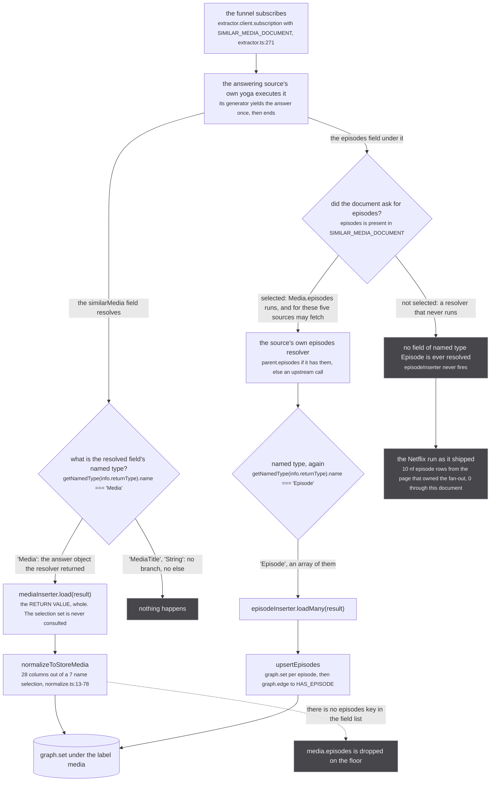
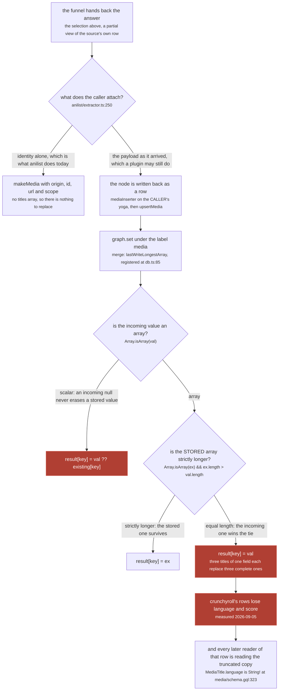
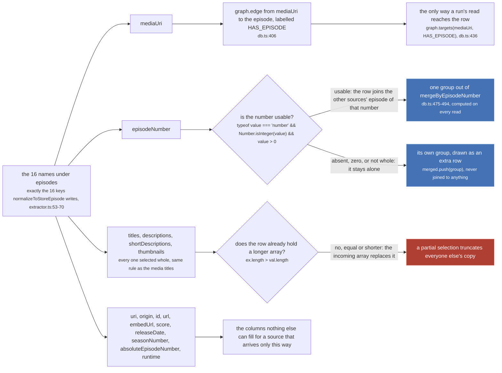

The funnel subscribes to an answering source with exactly one document, `SIMILAR_MEDIA_DOCUMENT`
(`src/worker/similar-document.ts:31-60`), used in exactly one place
(`src/worker/extractor.ts:271`, inside `firstSimilarMedia`). It is 60 lines and it lives in its own
module for a reason its header states:

`src/worker/similar-document.ts:1-2`

> The document the `similarMedia` funnel subscribes with, in its own module so a test can parse and
> validate it: worker/extractor.ts reaches urql and cannot load under vitest.

A selection set normally decides what the caller receives and nothing else. Here it also decides what
the **store** ends up holding, because the store writes happen inside the answering source's own yoga,
on the way out of every resolver, and a field nobody selected is a resolver that never ran. This page
is that mechanism, the incident that proved it, and what each group in the document is for.

## The document, as it is written

```graphql
subscription SimilarMedia($input: SimilarMediaInput!) {
  similarMedia(input: $input) {
    uri
    origin
    id
    url
    scope
    titles { language title score }
    episodes {
      uri
      origin
      id
      url
      embedUrl
      mediaUri
      score
      titles { language title score }
      descriptions { language description score }
      shortDescriptions { language shortDescription score }
      thumbnails { url width height language color score }
      releaseDate
      seasonNumber
      episodeNumber
      absoluteEpisodeNumber
      runtime
    }
  }
}
```

Seven names on the media, sixteen on the episode. That asymmetry is the whole page: a media row lands
with all twenty eight of its columns from a seven name selection, and an episode row lands with none of
its sixteen unless the sixteenth line of the document asks for it.

`src/worker/similar-document.ts:4-6`

> What an ask selects off an answer. The caller needs enough to build a handle, the scope the answer
> is checked against, and the titles for the consumer's which-show check.

`uri`, `origin` and `id` are the identity a caller builds a handle from. `scope` is what the funnel's
last gate reads: `isRunAnswerFrom` is `answer.origin === origin && answer.scope !== 'CONTAINER' &&
answer.id !== showId` (`src/sources/similar.ts:125-129`), and a `scope` that was never selected would
arrive undefined and pass the middle test by accident. `titles` is what
[the consumer](/similar/consumer/) checks the answer against with `answerNamesOurShow`. `url` is what a
caller renders.

## The row lands whatever is asked for; the episodes do not

`src/worker/similar-document.ts:8-20`

> THE ROW is inserted whatever is asked for: `useOnResolve` in the extractor fires on the RESOLVER'S
> RETURN VALUE rather than on the selection set, so the whole Media lands even where a field is not
> selected. THE EPISODES ARE NOT, and this document said otherwise until 2026-09-10.
>
> `useOnResolve` is per RESOLVED FIELD and keys on that field's named type (extractor.ts:473-486):
> `Media` reaches `mediaInserter`, `Episode` reaches `episodeInserter`, and `mediaInserter` writes
> rows and handle pairs only, dropping `media.episodes` on the floor (extractor.ts:106-133). So an
> unselected `episodes` is a resolver that never runs, an Episode type that is never resolved, and an
> `episodeInserter` that never fires. Netflix is how this surfaced: since unogs' own search died it
> arrives ONLY as a `similarMedia` claim, its season media attached and its episodes never existed, so
> the media header carried the Netflix icon while every episode row showed none. Measured on the same
> cluster from two pages: the one whose own subscription owned the fan-out stored 10 nf episode rows,
> the one that gained the same nf run through this document stored 0.



*Two lanes out of one payload. The left one cannot be switched off by a document; the right one is nothing but a document.*

Both branches are `useOnResolve` at `src/worker/extractor.ts:473-495`, installed by `makeExtractor`
into every source's yoga. The three type tests are at `:475`, `:481` and `:487`, and the value each
inspects is `result`, the resolver's return value. `mediaInserter` is `extractor.ts:106-134` and calls
`upsertMedia(allUnwrapped.map(normalizeToStoreMedia), handlePairs)` at `:127`.
`normalizeToStoreMedia` (`src/worker/store/normalize.ts:13-78`) writes twenty eight keys and
`episodes` is not one of them, which is literally the "on the floor" in the comment.

The second lane needs a second resolver to exist at all. The default is
`episodes: (parent) => parent.episodes ?? []` at `extractor.ts:436`, and all five sources that
implement `Subscription.similarMedia` override it with the same three lines: return the parent's
episodes if it is not ours, return them if it already has them, otherwise go and fetch
(`crunchyroll/extractor.ts:592-596`, `unogs/extractor.ts:493`, `justwatch/extractor.ts:777`,
`tvmaze/extractor.ts:223`, `appletv/extractor.ts:427-434`). So the `episodes` line is not free: for a
Crunchyroll answer it can cost one more upstream call, and that call is the whole point of it.

### Why `episodes` is the part a selection set can switch off entirely

The other nested things a media carries do not depend on being selected. Handles do not:
`mediaInserter` reads `media.handles` off the returned object at `extractor.ts:116-122`, and
`recursivelyUnwrapMediaHandles` (`src/worker/store/aggregate.ts:135-152`) walks the same object, so a
`SAME_AS` node becomes a row and a claimed pair reaches `upsertMedia` whether or not anybody wrote
`handles` in a document. Relations and the franchise do not either: `normalizeToStoreMedia` flattens
them into columns of the parent row at `normalize.ts:42-77`.

Selecting `relations` does add something, because `MediaRelationEdge.node` is `Media!`
(`media/schema.gql:170`) and so lands as its own row through the same hook. But the snapshot on the
parent row is there regardless, so an unselected `relations` costs a row and never the data.
`episodes` is the case where the selection is the whole of it: `normalizeToStoreMedia` keeps no
`episodes` column, so an unselected `episodes` leaves the store with nothing at all about them. That
is why this one document had to change rather than the funnel or the store.

## Why every array is selected whole

`src/worker/similar-document.ts:26-29`

> The titles are selected WHOLE. A caller that attaches the answer as a handle writes the node back to
> the store as a row, where an array of equal length replaces the one it finds, so titles selected as
> `{ title }` alone cost crunchyroll's rows their language and score (2026-09-05). Every field of
> `MediaTitle` is here so that row is complete whoever writes it.



*The comparison is on LENGTH and only on length, so it cannot see that each element lost two of its three fields.*

`lastWriteLongestArray` is `src/worker/store/graph.ts:387-400`, thirteen lines, registered as the
merge strategy for both the `media` and the `episode` label at `src/worker/store/db.ts:85-86`. The
array line is `:394`:

```ts
result[key] = (Array.isArray(ex) && ex.length > val.length) ? ex : val
```

Strictly greater, so an equal length array always loses to the incoming one. Three titles carrying
`{ title }` alone are still three titles.

The caller that did this has since stopped. `anilist`'s Crunchyroll mapper asks the funnel at
`src/sources/anilist/extractor.ts:239-245` and then attaches by identity only:

`src/sources/anilist/extractor.ts:246-249`

> attached by IDENTITY alone. The funnel's answer is the selection in worker/similar-document.ts,
> a partial view of crunchyroll's row, and a handle node is written to the store as a row: its
> titles, one field each, replaced crunchyroll's own of equal length, language and score gone
> (2026-09-05). Crunchyroll's insertion is the row; this handle only names it.

Both halves of the fix are live at once, and that is deliberate. The caller stopped writing a partial
row back, and the document stopped being able to produce one. A plugin is a caller too
(`ctx.similarMedia` is `similarMediaFrom(origin)`, `extractor.ts:537`), and no plugin has read
`anilist`'s comment.

:::danger
**A truncation here has no inverse.** `graph.set` merges through `lastWriteLongestArray`, which keeps
no history: a scalar is overwritten by the last non-nullish write (`graph.ts:396`) and an array of
equal or greater length replaces the stored one whole (`graph.ts:394`). Nothing afterwards can ask
what the previous value was, or which origin wrote either of them. The only thing that restores a
truncated array is the origin writing its own complete row again, which is a fresh write and not an
undo: until it happens, every reader of that cluster reads the truncated copy.
:::

The second reason for selecting `MediaTitle` whole is about what happens to that damaged row
afterwards, and it is worth reading closely because it is easy to invert:

`tests/unit/worker/similar-document.test.ts:1-4`

> What the similarMedia funnel selects off an answer. A caller that attaches the answer as a handle
> writes the node back as a row, where an array of equal length replaces the one it finds: titles
> selected as `{ title }` alone cost crunchyroll's rows their language and score (2026-09-05), and
> `MediaTitle.language` is non-null, so a document selecting titles on that row would have errored.

The clause is "a document selecting titles **on that row**". `MediaTitle.language` is `String!`
(`src/worker/resolvers/media/schema.gql:322-326`), so once the stored titles have no `language`, any
later document that selects it against that row hits a null in a non-null position, which nulls its
whole parent and takes the rest of the payload with it. Selecting `titles { title }` in the ask itself
is perfectly valid GraphQL and would not have errored. The failure is downstream, on everybody else's
read.

:::note[Where this page corrects its own brief]
The page inventory reads that sentence the other way round, as "the partial document would have errored
anyway". It would not have: a narrower selection set is legal. The error is one a **later** read of the
truncated row would raise. The code wins.
:::

## What the sixteen episode names are for

The list is not a taste. It is exactly, name for name, the sixteen keys `normalizeToStoreEpisode`
writes (`src/worker/extractor.ts:53-70`), which is what an inserted episode row keeps.



*A name missing from this list is a column the store cannot fill for any source that arrives this way, and two of the sixteen are not columns at all: they are how the row is reached and how it is joined.*

**`mediaUri` is the edge.** `upsertEpisodes` writes `graph.edge(episode.mediaUri, episode.uri,
HAS_EPISODE)` at `src/worker/store/db.ts:406`, and `findAggregatedEpisodesForMedia` walks exactly that
edge at `db.ts:436`. An episode row whose `mediaUri` never arrived is a row nothing can ever reach.

**`episodeNumber` is the join.** `tests/unit/worker/similar-document.test.ts:41-44`

> The list is `normalizeToStoreEpisode` in worker/extractor.ts, which is what an inserted row keeps.
> A field missing here is a column the store cannot fill for any source that arrives this way, and
> `episodeNumber` in particular is the ONLY key episodes are joined on across sources
> (`mergeByEpisodeNumber`), so an episode selected without it can never reach a row.

`mergeByEpisodeNumber` (`db.ts:475-494`) reads the number at `:480` and takes the first value that is
a positive whole number; a group with no usable number is pushed through as its own group and drawn as
an extra row. Nothing mints `EPISODE_SAME_AS` between two metadata sources, so this read-time grouping
is the only thing that stops one run's twelve episodes being drawn twice. See
[aggregating episodes](/read/episodes/) for the full walk.

**The four arrays are selected whole for the reason above**, one level down, and a test asserts each of
them by name (`similar-document.test.ts:58-66`).

`handles` is on the `Episode` type (`src/worker/resolvers/episode/schema.gql:16`) and is in neither
list: not in the document, not in `normalizeToStoreEpisode`. Leaving it out is not what would stop an
episode-level claim, though. `episodeInserter` builds its pairs from `episode.handles` on the returned
object at `extractor.ts:139-141`, the same way `mediaInserter` does, so a source that attached one
would have it claimed unselected. None of them does: no first-party source attaches a handle to an
episode today.

## What pins it

Four tests, all in `tests/unit/worker/similar-document.test.ts`, all of them parsing the real constant:

| line | what it asserts |
| --- | --- |
| `:29` | the selection validates against the generated `typeDefs` |
| `:33` | the media field names are exactly `uri, origin, id, url, scope, titles, episodes`, and `titles` is exactly `language, score, title` |
| `:45` | `episodes` is selected at all, and its sixteen names are exactly the sixteen `normalizeToStoreEpisode` keeps |
| `:58` | every array on an episode is selected whole, field by field |

The one at `:45` carries its own reason in the assertion message: *an unselected episodes field is an
episodeInserter that never fires.*

## The loop closes here

Episodes that land through this document are not only rows on a page. The consumer builds its next
question out of them: `resolveSimilarRuns` calls `findAggregatedEpisodesForMedia` on the cluster at
`src/worker/similar-consumer.ts:284-285` and hands every episode title it finds to `runEvidence`. Those
titles are Rule 2 of [the rules](/similar/rules/), which needs three real matches
(`MIN_EPISODE_TITLE_MATCHES = 3`, `src/sources/similar.ts:69`) covering at least
`EPISODE_TITLE_COVERAGE = 0.6` of the candidate season (`similar.ts:67`), and it is the only rule that
can tell apart two same-year cours of twelve with no ordinal.

So the sixteenth line of this document is what lets the **next** ask be answered by episode titles
instead of by a year. A source that reaches the app only through the funnel, which is Netflix's
situation since unogs' own search died, contributes nothing to that evidence unless `episodes` is on
the document.

Next: [lending a season](/similar/lending/), the other way a run gets episodes it did not fetch, and
[the loop](/similar/loop/), which is what re-runs the read that reads them.
