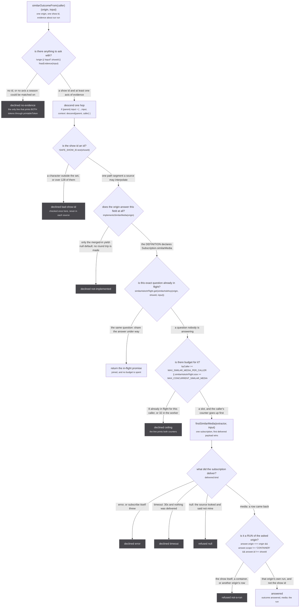
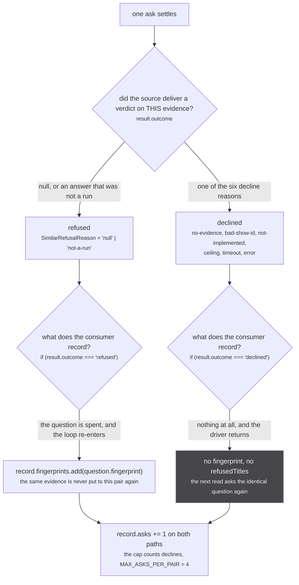
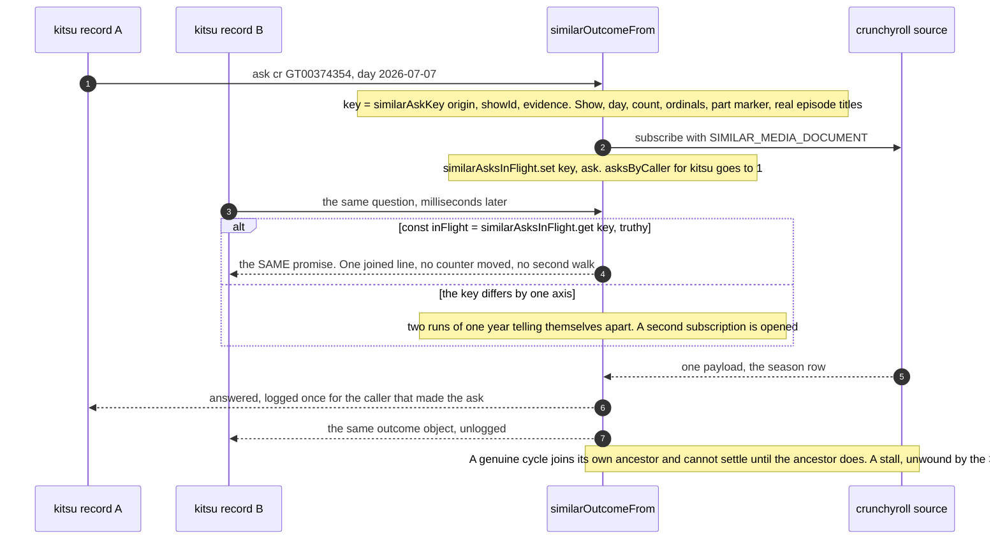
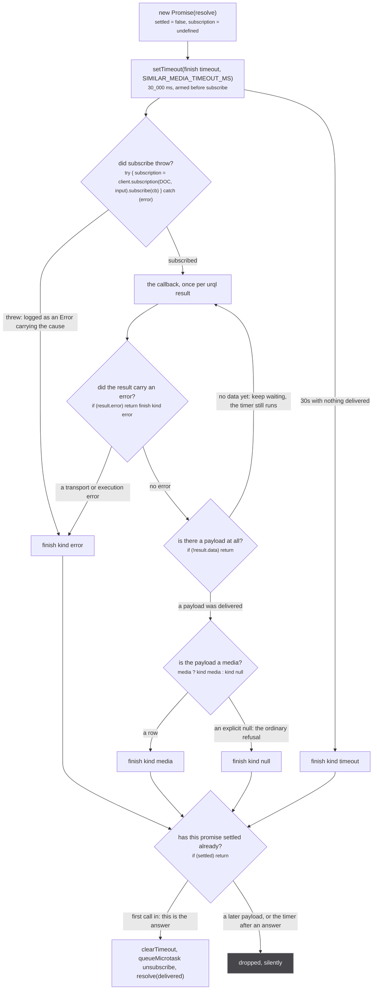

Between anything that wants to ask an origin "which of your runs is mine" and the origin's own
`Subscription.similarMedia` resolver sits exactly one function, `similarOutcomeFrom`
(`src/worker/extractor.ts:314-397`). Nothing reaches a source's `similarMedia` any other way. It is
where the show id is checked, where a repeat of a question in flight is handed the answer already
being fetched, where the budget is spent, and where an answer that is the show rather than a run of
it is thrown away before any caller can act on it.

It is bound to its caller: `similarOutcomeFrom('app')` and `similarOutcomeFrom('anilist')` are two
functions with two separate budgets and two different names in the log. Four callers exist today:

| caller token | who | where |
| --- | --- | --- |
| `'app'` | the consumer, on a run's page after aggregation | `src/worker/resolvers/media/index.ts:24` |
| `'anilist'` | AniList's own Crunchyroll mapping, through `ctx.similarMedia` | `src/sources/anilist/extractor.ts:239` |
| each source's origin | the `similarMedia` on every source's `ExtractorServerContext` | `src/worker/extractor.ts:537` |
| a plugin's origin | the same context, handed to third-party code | `src/worker/extractor.ts:620` |

The module header states the whole point of the endpoint before any of the machinery:

`src/worker/extractor.ts:178-184`

> WHY THIS EXISTS. Stub models a broadcast run; every catalogue models a show. A source holding a
> show-level link (Kitsu publishes Crunchyroll's `/series/<id>/` url on EVERY season record) has
> something true about the show and nothing it may honestly mint as a handle, because a handle is an
> identity claim and `graph.link` is a union-find union with no inverse. Dropping the link loses a
> real offer; minting it welds every season of the show. This is the third option: hand the show id
> back to the origin that owns it, say what we know about our run, and take the run it names, which
> IS an honest identity and links like any other.

## The ladder, in order

Six gates run before a subscription is opened. Four more outcomes come out of the payload. Ten exits
in total: six declines, two refusals, one answer, and one join that is none of those.



*Ten exits, and every one of them prints exactly one line. Only the rightmost path costs an upstream request.*

Read against the file: the evidence gate is `extractor.ts:316`, the hop is `:323-324`, the id check
`:326`, the implementation check `:330-331`, the join `:349-355`, the ceiling `:357-361`, the ask
`:365-366`, and the payload branch `:367-388`. The subscription itself is `firstSimilarMedia`
(`:252-285`), drawn in full [below](#firstsimilarmedia-the-first-payload-wins).

`hasEvidence` (`src/sources/similar.ts:83-87`) is the loosest gate on the page and deliberately so:

```ts
Boolean(startDate && !Number.isNaN(Date.parse(startDate)))
  || Boolean(titles?.length)
  || episodeCount != null
  || Boolean(episodeTitles?.length)
```

Any one axis is enough to ask with. Whether that axis can settle a season is
[the rules'](/similar/rules/) problem, not the funnel's.

The hop at `:323-324` is the only step in the ladder that is not a gate. It rewrites `input` so the
answering source can see the chain it is part of, and the comment says what an absent context means:

`src/worker/extractor.ts:320-322`

> one hop deeper, carrying the caller's origin, so the answering source can see the chain it is
> part of. A caller that passed no context of its own descends from nothing and the callee reads
> a miss, which is counted rather than guessed at.

`descend` (`src/worker/request-context.ts:92-93`) mints a fresh token with the same `rootId` and
`operation` and one more origin on the chain, so what crosses the wire is a token and everything else
is regenerated worker-side. See [the request context](/request/request-context/).

### The constants, and the argument for each

| constant | value | file:line |
| --- | --- | --- |
| `SIMILAR_MEDIA_TIMEOUT_MS` | `30_000` | `src/worker/extractor.ts:198` |
| `MAX_CONCURRENT_SIMILAR_MEDIA` | `32` | `src/worker/extractor.ts:216` |
| `MAX_SIMILAR_MEDIA_PER_CALLER` | `8` | `src/worker/extractor.ts:227` |
| `SAFE_SHOW_ID` | `/^[A-Za-z0-9._~-]{1,128}$/` | `src/worker/extractor.ts:244` |

Thirty seconds is not a latency budget:

`src/worker/extractor.ts:195-197`

> A source may walk every season of a show to answer, which is one request per season on top of the
> seasons call, so this is generous. It is a backstop against a source that never yields, not a
> latency budget: the common answers, a hit and a refusal, both arrive on the first payload.

The two ceilings are one global and one per caller, and the second exists because the first can be
spent by somebody else's code:

`src/worker/extractor.ts:219-226`

> And a per-caller share, because the ceiling above is global and a third-party source can spend it.
>
> A plugin may register a `similarMedia` resolver that simply never yields, and a slot is then held
> for the full SIMILAR_MEDIA_TIMEOUT_MS. Enough of those pin the global ceiling, and the next
> FIRST-PARTY ask is refused: the page looks exactly like a source that had no answer. A per-caller
> share cannot stop a plugin wasting its own budget, which is fine, and does stop it spending
> anybody else's.

`SAFE_SHOW_ID` is the one gate whose reason is about where the id ends up rather than what it means:

`src/worker/extractor.ts:232-238`

> Every source interpolates ids straight into a url (`${CMS}/series/${id}/seasons`, `/tv/${showId}`,
> `/series/${id}/extended`), which was safe for as long as an id could only have come out of an
> upstream response. This endpoint is the first place an id is chosen by the CALLER, and a plugin is
> a caller. `..` segments normalise and a `?` or `#` terminates the path, so an unchecked id steers
> which path on that host gets fetched and what query it carries. The host cannot move, since the
> prefix is absolute, and the method, headers and body are the source's own, so this is the whole of
> the exposure and it closes here.

The character set is not arbitrary either. It is the union of every id shape in use, listed at
`extractor.ts:240-242`: Crunchyroll `G24H1N3MP`, Apple TV
`umc.cmc.1srk2goyh2q2zdxcx605w8vtx`, a Hulu uuid, a numeric TVmaze or TMDB id, and a trakt slug like
`mushoku-tensei-jobless-reincarnation`. (The opening line of that comment, `extractor.ts:230`, says
"each of the 23 sources". There are 24 built-in source modules, pinned at
`tests/unit/sources/index.test.ts:24`; the count is beside the point of the comment, and 24 is the
number the rest of this site uses.)

`implementsSimilarMedia` (`:292-295`) reads `entry.extractor.resolvers.Subscription?.similarMedia`,
the definition's own object, and the comment is precise about why not the schema:

`src/worker/extractor.ts:288-290`

> Whether a source answers `similarMedia` at all. Read off the DEFINITION's resolvers, never the
> merged schema, so the yield-null default in `makeExtractor` counts as "not implemented" and a
> caller can skip the subscription round trip that would only ever answer null.

Five of the 24 built-in sources declare it: crunchyroll, unogs, justwatch, tvmaze and appletv. The
other nineteen get the default at `extractor.ts:459-463` and are skipped here, and are also skipped
one level earlier by `planSimilarAsks`, which reads the same predicate before it plans an ask at all.

## Declined against refused

This is the distinction the whole outcome type exists for, and it is the one the
[consumer](/similar/consumer/) reads to decide what to write down.



*A decline is free of memory and not free of budget: it records nothing and still counts against the four asks a pair gets.*

The type is `src/sources/similar.ts:51-57`:

```ts
export type SimilarDeclineReason = 'not-implemented' | 'bad-show-id' | 'no-evidence' | 'ceiling' | 'timeout' | 'error'
export type SimilarRefusalReason = 'null' | 'not-a-run'
/** What one ask came to. `declined` never reached the source and may be retried; `refused` did and is final for that evidence. */
export type SimilarOutcome<M extends SimilarAnswerMedia = SimilarAnswerMedia> =
  | { outcome: 'answered', media: M }
  | { outcome: 'refused', reason: SimilarRefusalReason }
  | { outcome: 'declined', reason: SimilarDeclineReason }
```

**One correction to that comment, and to the page brief that repeats it.** "declined never reached the
source" is true of four of the six reasons and false of two. `timeout` and `error` are produced at
`extractor.ts:382-387`, inside the `.then` of `firstSimilarMedia`, which means the subscription was
opened and the document was sent: the ask reached the source and the source failed to say anything
usable. The distinction that actually holds, and the one every consumer branch is written around, is
**whether a verdict about this evidence came back**. A decline means nothing was learned, so asking
again with the same evidence is sensible; a refusal means the source considered this evidence and
said no, so asking again with it is not.

The consumer's two branches are `src/worker/similar-consumer.ts:227-230` (declined: log and `return`,
recording nothing) and `:231-235` (refused: `record.fingerprints.add(question.fingerprint)` then
`continue`). Both leave `record.asks` already incremented at `:212`, which is why a source that times
out four times running settles the pair on the cap without ever having refused anything.

## Join, not refuse

A repeat of a question already in flight is handed the promise rather than turned away. This is the
one place in the system where two callers share an answer.



*The second caller costs one map lookup. Getting the key wrong costs the second caller the first caller's season.*

The measurement that produced it, `src/worker/extractor.ts:337-347`:

> A repeat of a question already in flight JOINS it rather than being refused.
>
> Most repeats are not cycles. Measured on the real app the first time this shipped: two kitsu
> records for one show asked `(cr, GT00374354, 2026-07-07)` concurrently, and refusing the second
> cost it its Crunchyroll handle for no reason, since the answer was seconds away. Sharing the
> promise gives both the right answer and costs one upstream walk instead of two.
>
> A genuine cycle joins its own ancestor, which cannot settle until the ancestor does. That is a
> stall rather than a deadlock: the ancestor's `firstSimilarMedia` timer settles it at
> SIMILAR_MEDIA_TIMEOUT_MS and the whole chain unwinds with undefined. Bounded, warned about,
> and not prevented, which is the shape asked for.

Three mechanical details the figure implies and the code pins:

- **A join spends nothing.** `return inFlight` at `:354` happens before the `asksByCaller` read at
  `:357`, so a joined caller never increments its own counter and the `.finally` at `:389-394` only
  ever decrements the caller that opened the subscription.
- **Only the original caller's line is logged.** `similarMedia: joined ...` fires for the joiner, and
  the eventual `answered` or `refused` line names the caller that asked. The comment says so at
  `:352`: *the joined ask's own answered or refused line fires once, for the caller that made it.*
- **The key is registered after the chain is built.** `similarAsksInFlight.set(key, ask)` is `:395`,
  after `.finally` is attached at `:389`. Both run in the same synchronous turn and the `.finally`
  callback cannot run before a microtask, so the entry is always set before it can be deleted.

:::caution
**A join hands the second caller the first caller's answer, so the key has to carry everything the
rules read.** `similarAskKey` (`src/sources/similar.ts:331-338`) is `origin`, `showId`, the day, the
count, the season ordinals the titles agree on, whether any title names a part, and the deduped real
episode titles, joined on a NUL separator. Its doc says exactly what the last field is doing there
(`similar.ts:326-329`):

> The episode titles are IN the key because Rule 2 is the only rule that tells apart two runs
> agreeing on all the rest (two same-year cours of 12 with no ordinal): a second run joining the
> first's in-flight ask would take the first's season with the right evidence in hand.

Pinned at `tests/unit/sources/similar.test.ts:220-229`: two asks differing only in their episode
titles are two keys; `2026-07-04T15:00:00Z` and `Sat, 04 Jul 2026 00:00:00 GMT` are one day, and
`Show Season 2` and `Show 2nd Season` are one ordinal, so those are one key.
:::

## firstSimilarMedia: the first payload wins

Everything above decides whether to subscribe. This is the subscription.



*Four ways in, one way out, and `finish` is idempotent because three of the four can still fire after the answer has been resolved.*

`src/worker/extractor.ts:252-285`. The load-bearing line is `:277`, `if (!result.data) return`, which
is the only branch that does **not** settle. Everything else does, including a null:

`src/worker/extractor.ts:274-276`

> any DELIVERED payload settles this, including an explicit null. A source that cannot
> answer yields null once and ends, and waiting out the timeout for that would turn the
> ordinary refusal into the slowest path in the system.

That sentence is the reason every source's default resolver yields `{ similarMedia: null }` rather
than ending, at `extractor.ts:459-463`. A generator that completes without yielding makes yoga answer
204 No Content, nothing is ever delivered here, and the ask sits out the full thirty seconds for what
should have been the cheapest answer in the system. See [the fan-out](/request/fan-out/) for the same
trap on `Subscription.media`.

Two smaller mechanics on the figure:

- **The unsubscribe is deferred a tick.** `queueMicrotask(() => { try { subscription?.unsubscribe() } catch {} })`
  at `:264`, with its reason on `:263`: *the callback can fire before `subscribe` has returned*. A
  source that yields synchronously would otherwise reach `finish` while `subscription` is still
  `undefined`, and the subscription would never be torn down.
- **A throw out of `subscribe` is an error outcome, not a rejection.** `:281-284` logs
  `Extractor <name> failed to answer similarMedia` with the cause and calls `finish({ kind: 'error' })`.
  A source that cannot even start is indistinguishable to the caller from one that started and failed,
  which is deliberate: the caller has nothing different to do about the two.

## Every line the funnel prints

The funnel is the only place that sees every ask, from every caller, so every branch logs. The format
is fixed because a script parses it:

`src/worker/extractor.ts:310-312`

> Every branch says what it did on one `similarMedia: ` line, for EVERY caller: the funnel is the one
> place that sees them all, and scripts/check-similar-media.mjs reads these lines off the deployed
> worker's console.

| line | when | file:line |
| --- | --- | --- |
| `declined <origin> <showId> to '<caller>' (no-evidence)` | no origin, no show id, or no axis | `:317` |
| `declined <origin> <showId> to '<caller>' (bad-show-id)` | `SAFE_SHOW_ID` refused it | `:327` |
| `declined <origin> <showId> to '<caller>' (not-implemented)` | the origin has only the default | `:332` |
| `joined <origin> <showId> by '<caller>' (in flight with the same evidence)` | the key was already in the map | `:353` |
| `declined <origin> <showId> to '<caller>' (ceiling <n>/8 by caller, <m>/32 global)` | either ceiling | `:359` |
| `asked <origin> <showId> by '<caller>' with {day:..., count:..., ordinals:..., parts:..., titles:N, episodeTitles:N}` | the subscription opens | `:364` |
| `refused <origin> <showId> to '<caller>' (not-a-run <uri> scope <scope>)` | the answer is not a run of that origin | `:372` |
| `answered <uri> to '<caller>' for <origin> <showId>` | the answer stands | `:375` |
| `refused <origin> <showId> to '<caller>' (null)` | the source said not mine | `:379` |
| `declined <origin> <showId> to '<caller>' (timeout 30000ms)` | nothing delivered in 30s | `:383` |
| `declined <origin> <showId> to '<caller>' (error)` | `result.error`, or `subscribe` threw | `:386` |

Two details for anyone grepping these. **`asked` and `joined` say `by '<caller>'`; `declined`,
`refused` and `answered` say `to '<caller>'`.** And the evidence blob on the `asked` line is
`describeEvidence` (`src/sources/similar.ts:284-288`), which prints what the rules read rather than
what was sent: `{day:2026-07-04, count:14, ordinals:3, parts:no, titles:5, episodeTitles:12}`. The
two lengths are of the raw lists, so the reader can see a run that sent five titles carrying one
ordinal.

Caller-supplied strings are collapsed to one printable token before they go on a line, because two of
these lines print a string that has not been checked yet:

`src/sources/similar.ts:291-294`

> A caller-supplied string as ONE log token: anything outside printable ASCII becomes `_`, capped at
> 128 characters, `-` for nothing. A valid show id (`SAFE_SHOW_ID` in worker/extractor.ts) prints
> unchanged; the two funnel lines printed BEFORE that check read a plugin's string, and a newline in
> it would break the one-line shape scripts/check-similar-media.mjs parses.

**A gap in that, from reading the two lines side by side.** The `no-evidence` line at `:317` puts both
`origin` and `showId` through `printableToken`. The `bad-show-id` line at `:327` puts only `showId`
through it and interpolates `origin` raw. On the plugin path the origin is the caller's own argument
to `ctx.similarMedia(origin, input)`, not the origin the plugin registered under, and the
`bad-show-id` check runs before `implementsSimilarMedia` would reject an unknown one. So an origin
string carrying a newline reaches that one line unsanitised. Nothing downstream of the log reads it,
and the cost is a parse in `scripts/check-similar-media.mjs`, not a wrong answer.

## What an answer becomes

The funnel hands back an outcome and stops. What happens next is the caller's, and the two callers
want different things out of it:

- **The consumer** takes `result.media`, runs the which-show check on titles
  (`answerNamesOurShow`, threshold `SHOW_TITLE_THRESHOLD = 0.9` at `src/sources/similar.ts:303`), and
  on a pass calls `upsertMedia([], [{ mediaUri: ask.runUri, handleUri: result.media.uri, relation: 'SAME_AS' }])`
  at `src/worker/similar-consumer.ts:255`. See [the consumer](/similar/consumer/).
- **A source or a plugin** gets the reduced contract, `similarMediaFrom` (`extractor.ts:399-409`),
  which is the same ask with the reason thrown away:

`src/worker/extractor.ts:400-401`

> The same ask as `similarOutcomeFrom`, answering the run or undefined: the contract `ctx.similarMedia`
> and a plugin's delegate keep, where a source has no use for why it got nothing.

AniList's Crunchyroll mapping is the worked example, `src/sources/anilist/extractor.ts:239-250`: it
asks `cr` with the series id off its own `externalLinks`, and attaches the answer by identity alone,
for a reason that belongs on [the document](/similar/document/):

`src/sources/anilist/extractor.ts:246-249`

> attached by IDENTITY alone. The funnel's answer is the selection in worker/similar-document.ts,
> a partial view of crunchyroll's row, and a handle node is written to the store as a row: its
> titles, one field each, replaced crunchyroll's own of equal length, language and score gone
> (2026-09-05). Crunchyroll's insertion is the row; this handle only names it.

:::danger
**An `answered` is the last checkpoint before something with no inverse.** The consumer's claim goes
through `upsertMedia`, and a RUN against a RUN with `SAME_AS` reaches `graph.link` at
`src/worker/store/db.ts:193`, which is a union-find union. There is no unlink anywhere in the repo:
the only reset is `resetStore()` at `db.ts:509-513`, which empties the whole store and is tests only.
Two of the ten exits above exist purely to keep a wrong pair away from that call.
`isRunAnswerFrom` (`src/sources/similar.ts:125-129`) is the one inside the funnel:

> Whether an answer is a RUN of the asked origin, and never the show itself. A source answering with
> its bare show id is refused whatever scope it stamped, because that id is every season at once.

and the comment at the call site says what the refusal is protecting (`extractor.ts:369-370`):

> the show itself, a container, or another origin's row is not an answer: claiming any of
> them as SAME_AS of the caller's run is the weld the caller asked in order to avoid
:::

Note the third clause of that condition, `answer.id !== showId`. An origin that answers a
season-scoped id is fine; an origin that hands back the id it was asked about is refused even if it
stamped `scope: 'RUN'`, because `cr:G24H1N3MP` names every season of Mushoku Tensei at once and a
union with it welds all of them together. That is the failure the whole subsystem was built to avoid,
and it is checked here, one function before it could happen.

## The funnel has no unit test, and that is why it logs

`src/worker/extractor.ts` reaches urql and cannot load under vitest. That single fact shaped two
neighbouring modules: `worker/similar-consumer.ts` exists so the asking and the claiming can be
tested (`:12-13`, *Pure of the extractor on purpose*), and `worker/similar-document.ts` exists so the
selection can be parsed and validated (`:1-2`). Nothing under `tests/` executes `similarOutcomeFrom`;
the only test-side mentions of this file's machinery are two comments, at
`tests/unit/sources/anilist/extractor.test.ts:7` and `tests/unit/sources/crunchyroll/extractor.test.ts:173`.

What covers it instead is `scripts/check-similar-media.mjs`, which opens a real run's page against a
deployed build and reads the worker's `similarMedia: ` lines off the console. Its header is worth
reading for what a pass does and does not mean, and it carries its own controls: that the page has a
dedicated worker, that a `console.warn` evaluated inside that worker arrives on the page's console
hook with the prefix intact, and that a line carrying the token mid-sentence is not read as a
similarMedia line. Any control failing exits 2 rather than reporting a result.

The default uri in that script is a real cluster, and it is the example to hold in your head for this
whole section: `ag:(anilist:178789,kitsu:49002,mal:59193,offline:mal-59193)`, Mushoku Tensei season 3.
Its container is `cr:G24H1N3MP` off a `PART_OF` edge; the run the funnel is asking Crunchyroll to name
is `cr:G24H1N3MP-GS00374452`; and the ask that goes out reads
`asked cr G24H1N3MP by 'app' with {day:2026-07-04, ...}`.
