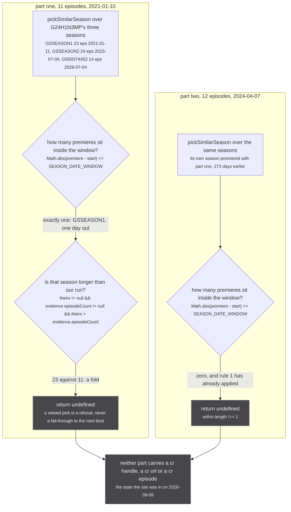
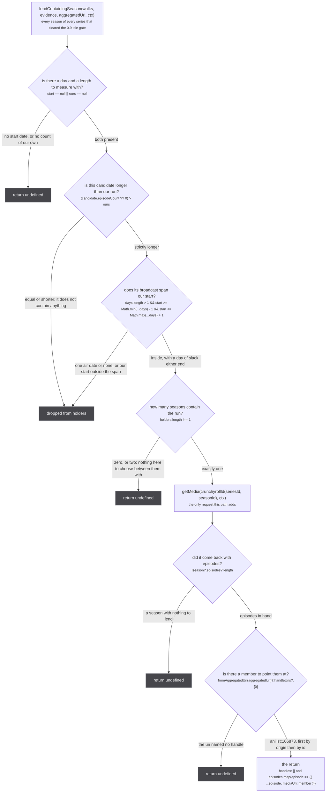
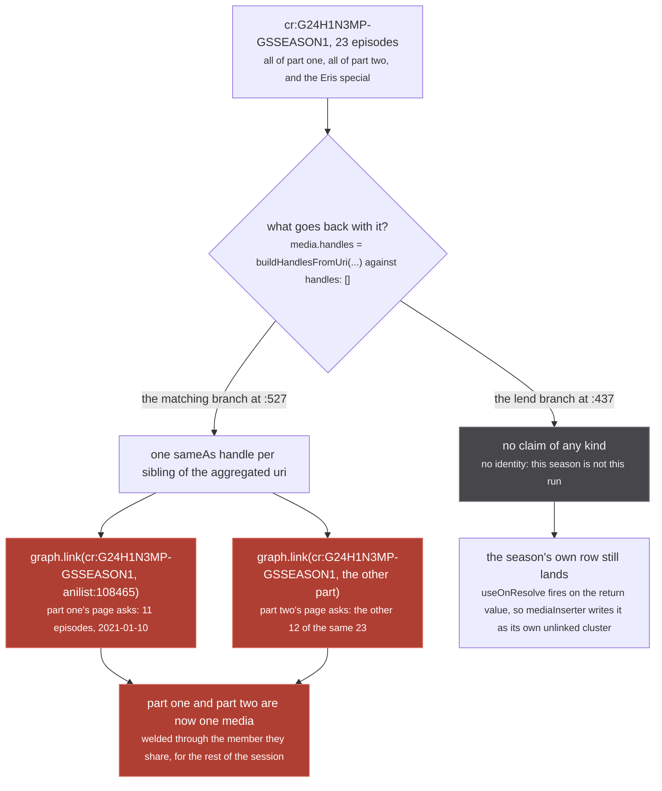
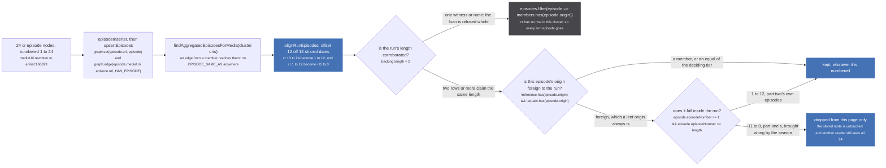

Crunchyroll models a split cour as **one** season. AniList and MAL split the same broadcast into two
runs. So for a split cour there is no season to match: part one is refused for being shorter than the
season it found, and part two is refused because that season premiered with part one, months before
part two aired. Neither part carries any Crunchyroll at all, which is
`src/sources/crunchyroll/extractor.ts:381-384`:

> Crunchyroll models a split cour as one season, so neither part matches: part one is refused by the
> fold veto for being shorter than what it found, and part two never comes near, because the season
> it belongs to premiered with part one nine months earlier. Both parts then carry no Crunchyroll at
> all, which is the state the site was in on 2026-09-09.

`lendContainingSeason` (`src/sources/crunchyroll/extractor.ts:402-440`) is the answer to that, and it
is a strange-looking one: it returns a media the caller must **not** treat as itself. The season is
one thing, the run is another, and what crosses over is the episode list alone.

## The state the site was in

Both refusals below come out of `pickSimilarSeason` (`src/sources/similar.ts:173-269`), and both come
out of **rule 1**, the date rule, which is terminal: once it applies it either picks or refuses, and
never falls through to rule 2.



*Two runs of one show, refused by the same rule for opposite reasons: one found a season and it was too big, the other found no season at all. Both refusals are correct, and together they are a hole.*

`SEASON_DATE_WINDOW` is `45 * 24 * 60 * 60 * 1000`, 45 days, at
`src/sources/catalogue-gate.ts:230`. `foldVetoed` is `src/sources/similar.ts:147-150`, and its comment
at `:139-146` says why the search path needs it exported at all:

> A season holding MORE episodes than the run holds other runs too (Netflix season 2 = 25 over 13 and
> 12). Zero tolerance, the same allowance season.ts measured as the only one worth having.
>
> Exported because a picker that answers on its own axes still needs it: Crunchyroll's search path
> matches on title and premiere, and a catalogue that folds two cours into one season premieres on
> the SAME DAY as the first of them, so neither axis can see the fold.

The season ids and dates above are the real ones, taken from the fixture at
`tests/unit/sources/crunchyroll/extractor.test.ts:104-108`, which the file's own comment calls "the
real premiere dates, so the date axis has something honest to choose between".

## `lendContainingSeason`, every refusal

The lend runs only after the picker has refused every candidate series. It reuses the season walks
the search already paid for (`walks`, accumulated at `extractor.ts:514-522`), so a lend costs one
extra `getMedia` and nothing else.



*Five refusals, all of them `return undefined`. The caller is `if (contained) return contained` at `extractor.ts:532`, so a refusal here simply continues the query loop, and an exhausted loop yields `{ media: null }`.*

Three of those deserve a sentence each.

**Containment is a span, not a premiere** (`:397-400`). The two filters at `:414` and `:415-420` are
the whole test: strictly longer, and the run's start day falls between the season's first and last
air date. That is why `walkSeasonCandidates` collects `airDates` at `extractor.ts:306` rather than the
premiere alone:

`src/sources/crunchyroll/extractor.ts:304-305`

> every air date, not just the first: a season that CONTAINS a run is recognised by its span, and the
> walk already holds the whole payload it would otherwise be refetched from

**The day of slack either end** (`:417-419`) is not a fudge factor, it is the same allowance the
read-time alignment makes:

`src/sources/crunchyroll/extractor.ts:417-418`

> a day of slack either end, the same allowance the alignment makes for one broadcast being stamped
> in two timezones

**`holders.length !== 1`** refuses zero and two alike. Two containing seasons means the catalogue
splits this show differently again, and the function has nothing to choose between them with. Pinned
at `tests/unit/sources/crunchyroll/extractor.test.ts:730`, on a fixture where both seasons genuinely
span 2024-04-07 so that the refusal has to come from there being two of them.

**The member** is `handleUris[0]` of the asking aggregated uri, and `fromAggregatedUri`
(`src/utils/uri.ts:212-230`) sorts by id and then by origin, so it is deterministic. For
`ag:(anilist:166873,kitsu:47694)` it is `anilist:166873`.

`src/sources/crunchyroll/extractor.ts:429-430`

> the row the run's walk starts from. Any member of the asking cluster reaches the same cluster, so
> the first is chosen for being deterministic rather than for being special.

## Why `handles: []`

This is the line the whole page is about. Three lines earlier, the matching branch does the opposite:

```ts
// src/sources/crunchyroll/extractor.ts:524-529
if (best) {
  const media = await getMedia(crunchyrollId(best.seriesId, best.seasonId), ctx)
  if (!media) continue
  media.handles = buildHandlesFromUri(aggregatedUri, origin)
  return media
}
```

:::danger[`graph.link` has no inverse, and this is where a lend would reach it]
A `SAME_AS` handle pair reaches `upsertMedia`'s claims loop and, for two RUN-scoped uris, becomes
`graph.link(mediaUri, handleUri, MEDIA_SAME_AS)` at `src/worker/store/db.ts:193`. That is a union-find
union. The exported graph API carries no `unlink` and no edge removal; the only undo is `clear()`,
which is the whole store. A wrong `SAME_AS` is permanent for the session.
:::



*The rose nodes are the weld that does not happen. Note that it takes two separate page loads to build it: neither ask is wrong on its own, and the damage is only visible once the second one lands.*

The comment sitting on the empty array is one line, `extractor.ts:436`:

> no identity: this season is not this run, and saying so would weld the run to its own sibling

and the longer form is `:386-390`:

> WHAT IS RETURNED IS NOT AN IDENTITY. The season is one thing and the run is another, so it carries
> NO handles: claiming it would union both parts into one cluster through a shared uri, which is the
> defect the fold veto exists to prevent and which `graph.link` has no inverse for. What crosses over
> is the EPISODES, re-pointed at the run that asked, so a `HAS_EPISODE` edge exists and the run's own
> walk can reach them.

Pinned at `tests/unit/sources/crunchyroll/extractor.test.ts:560`, with the assertion message doing the
documenting: `expect(media?.handles ?? [], 'a containing season claims no identity').toEqual([])`, and
again at `:711` for the spanning case.

### Which is why this path can never answer `similarMedia`

`lendContainingSeason` is called from exactly one place, `searchAndLinkMedia` at
`extractor.ts:531`, and `searchAndLinkMedia` is reached from exactly one place,
`Subscription.media` at `extractor.ts:578`. It is **never** reached from `seasonForShow`, the resolver
behind `Subscription.similarMedia` (`extractor.ts:566-569`).

That is structural rather than incidental. The funnel's gate is
`isRunAnswerFrom` (`src/sources/similar.ts:124-129`): `answer.origin === origin && answer.scope !==
'CONTAINER' && answer.id !== showId`. A lent season passes all three, because
`scopeOf` at `extractor.ts:174` stamps `RUN` on anything whose id is not the bare series id. The
consumer would then claim it `SAME_AS` at `src/worker/similar-consumer.ts:255`, which is precisely the
weld the lend exists to avoid. A lend is a media answer that carries no identity, and only the `media`
path can express that: `similarMedia`'s whole contract is that its answer **is** the caller's run.

## What crosses over, and what corrects it at read time

The episodes keep Crunchyroll's own numbering. That is deliberate, and it is the reason the correction
happens in a view rather than in the store:

`src/sources/crunchyroll/extractor.ts:392-395`

> They keep CRUNCHYROLL'S OWN NUMBERING. The node is shared with everything else that reads that
> season and `graph.set` is last-write-wins, so rewriting it here would change what those readers
> see. `store/consensus.ts` aligns them onto the run's numbering at READ time, from the dates both
> sides publish, and windows away the parts of the season that belong to the run's siblings.

:::caution[`graph.set` is last-write-wins, and the lent nodes are shared]
Every episode node here is keyed by Crunchyroll's own guid and is reachable from any other page that
reads that season. `graph.set` merges scalars last-write-wins (`src/worker/store/db.ts:85-86` registers
`lastWriteLongestArray` for the `episode` label). Renumbering a lent episode in place would silently
renumber it for every other reader, which is why `alignRunEpisodes` returns a `Map` of copies and
touches nothing.
:::

The worked case below is part two: a Crunchyroll season of 24 that runs 2023-07-09 to 2024-04-07 and
beyond, lent to a 12-episode run starting 2024-04-07, whose episodes Crunchyroll numbers 13 to 24.
That is the `SPANNING` fixture at `tests/unit/sources/crunchyroll/extractor.test.ts:699-702` and the
test at `:704`.



*Everything from `alignRunEpisodes` rightwards is blue, which means it is recomputed on every read and persists nothing. The one grey node is the branch the inventory for this page does not mention: an uncorroborated length does not window the loan, it declines it.*

The wiring is `findRunEpisodes` (`src/worker/store/db.ts:424-430`), three lines: walk, align, window.
`Media.episodes` calls it rather than the bare walk (`src/worker/resolvers/media/index.ts:202-204`),
and the comment above that line names this page's subject directly:

`src/worker/resolvers/media/index.ts:194-196`

> the FIRST handle that resolves, not the first handle. They all reach the same cluster, but a uri
> whose row has not landed yet resolves to nothing, and taking that as "no cluster" dropped the page
> onto the unwindowed walk, where a lent season's whole 24 episodes are drawn

The window is a window and not a ceiling for exactly this shape,
`src/worker/store/consensus.ts:184-191`:

> A WINDOW OF 1 TO length, not a ceiling.
>
> A season that CONTAINS this run brings episodes on both sides of it: aligned onto the run's
> numbering, the previous part lands at zero and below and the next part above the length. A ceiling
> alone would leave the ones below on the page, numbered 0 and -1, which is a stranger failure than
> the one this started as.

And the reason a lent origin is windowed at all, even though it has no row here to read a count off,
is `consensus.ts:204-208`:

> Everything else is windowed, which deliberately includes a source with no row in this cluster at
> all. That is how a season that CONTAINS this run arrives: it lends its episodes and claims no
> identity, so there is no member to read a count off, and the run's own length is the only thing
> that says which of them are its own. Keying this on cluster membership made it depend on whether
> that lend happened to be linked, which varies between loads.

## The loan is refused outright when the length rests on one witness

:::caution[The code carries a refusal the page inventory does not]
The inventory describes the read-time half as align, then window. There is a branch before both:
`src/worker/store/consensus.ts:234` is `if (backing.length < 2) return episodes.filter(episode =>
members.has(episode.origin))`. `members` is the set of **origins with a row in this cluster**, and a
lent origin has none, so that line does not trim the loan, it drops all of it. The code wins, and it
is on the figure above as the grey node.
:::

`backing` is `cluster.filter(media => media.episodeCount === length)` (`consensus.ts:171`), so
"corroborated" means two rows in the cluster stating the same number, from any tier. The measurement
behind the rule, `consensus.ts:226-232`:

> AN UNCORROBORATED LENGTH REFUSES THE LOAN OUTRIGHT rather than slicing on it.
>
> A lent season is only useful if the run can say which of its episodes are its own, and a length one
> source claims cannot. Mushoku Tensei season 2 part 1 is the case: MAL publishes no count at all and
> AniList says 13 for a run that aired 12, so windowing to 13 put a thirteenth row on the page that
> only Crunchyroll had. Declining leaves the page exactly as it was.

Note that the bar applies to the loan and not to the cluster's own members, and the file says why in
the same breath, `consensus.ts:214-220`:

> THE WITNESS BAR APPLIES TO MEMBERS, AND A LOAN IS NOT A MEMBER.
>
> A member's episodes are this run's own data, and hiding them on a length only one source claims is
> how episodes that aired disappear. A LENT source has no row here at all: the only reason its
> episodes are on this page is that a season containing this run handed them over, and taking only
> the part that fits is the whole basis on which they were accepted.

The length itself comes from `tieredConsensus` (`consensus.ts:36-59`), which is lexicographic rather
than additive: the best score present decides which claims are looked at, and among those the most
claimed value wins. Crunchyroll's `SCORE` is `0.5` (`src/sources/crunchyroll/extractor.ts:12`) against
MAL's `0.9`, so a fold "stays trimmed however many streaming catalogues echo it, which is the case a
sum of scores got wrong" (`consensus.ts:181-182`). See
[Consensus, not a sum](/merge/consensus/) for the three measurements behind that.

## What is permanent after a lend, and what is not

| written | where | permanence |
| --- | --- | --- |
| the season's own row, `cr:G24H1N3MP-GSSEASON1` | `graph.set` under the `media` label | its own unlinked cluster, no `SAME_AS` to anything |
| 24 episode nodes, Crunchyroll's numbering | `graph.set` under the `episode` label, `db.ts:405` | shared with every other reader of that season, last-write-wins |
| `HAS_EPISODE` from `anilist:166873` to each | `graph.edge`, `db.ts:406` | directed, append-only, unions nothing |
| nothing at all in the union-find | | `handles: []`, so `upsertMedia` receives no claim |
| the renumbering | `alignRunEpisodes`, a `Map` of copies | recomputed on every read |
| the window | `runEpisodes`, a filter | recomputed on every read |

The one row that is a permanent identity claim is the row that is never written. Everything else the
lend produces is either an edge, which is deletable in principle, or a view, which exists only for the
length of one read.

## Where to go next

- [The rules](/similar/rules/) for `pickSimilarSeason`, the five rules and the two vetoes that refuse
  before this path is ever reached.
- [Aligning a numbering](/merge/alignment/) for `alignmentOffset`, `MIN_ALIGNED = 2` and the three
  ambiguities it refuses on.
- [Windowing a run](/merge/windowing/) for `runEpisodes` in full, including who is spared and why the
  tier comparison is strict.
- [The document](/similar/document/) for the mirror-image problem: an answer whose episodes were never
  selected, so they never existed.
