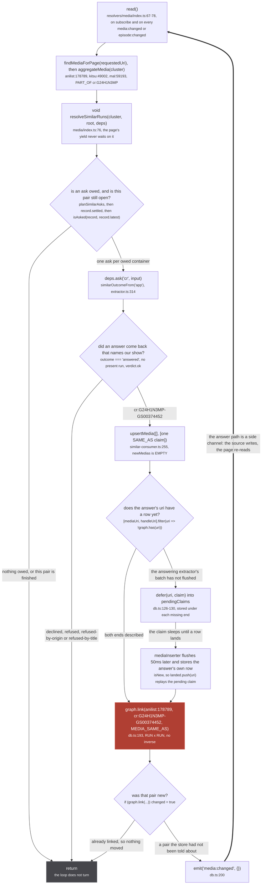
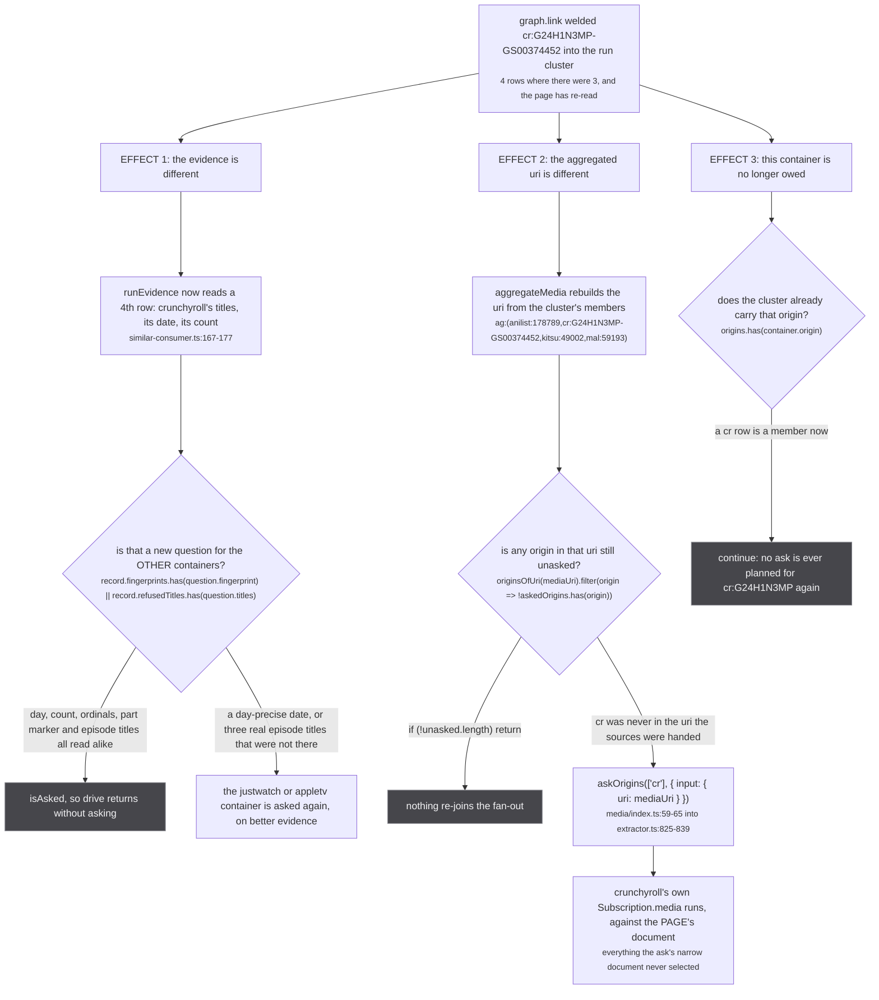
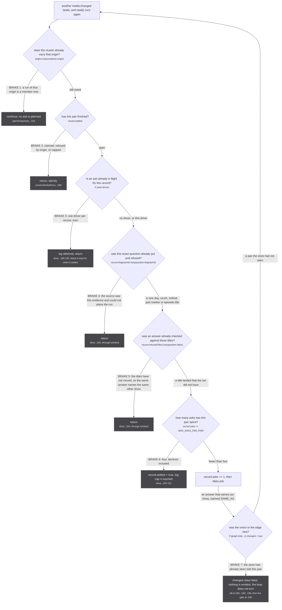

`similarMedia` has no return path. A source does not hand its answer back up the subscription that
asked; the consumer writes the answer into the store as a claim, the store emits, and the page reads
again. So the answer arrives by the page noticing that the store moved.

That makes the whole subsystem a cycle: read, ask, claim, emit, read. This page is that cycle drawn
once, the three separate things one claim sets off, and the seven places the turn is stopped. The
bookkeeping the brakes read is on [the consumer](/similar/consumer/); this page is about why the
loop terminates at all.

## The cycle



*One edge on this figure goes backwards, and it is the only one: everything else is an arrow into the store. The claim is made with no rows, so it almost always takes the `pendingClaims` detour rather than the short one.*

The detour is the normal path, not the exception. `deps.ask` settles on the first delivered payload
(`firstSimilarMedia`, `extractor.ts:252-285`), while the answer's own row goes through
`mediaInserter`, a DataLoader whose `batchScheduleFn` is `setTimeout(callback, 50)`
(`extractor.ts:106-134`). So the claim reaches `upsertMedia` tens of milliseconds before the row it
names does, `graph.has(handleUri)` is false, and the claim is parked. That ordering is what the
consumer's own docstring describes:

`src/worker/similar-consumer.ts:273-277`

> The claim goes through `upsertMedia` with no rows: the answer's own row lands through the answering
> extractor's insertion, the claim waits for it under `pendingClaims`, and a RUN x RUN union emits
> `media:changed`, which re-runs the page's read, whose re-ask of the newly named origin is how the
> answer's episodes reach the store. The container edge is never touched.

Two things in that sentence are worth being literal about. The union happens inside the **row's**
`upsertMedia` call, not the claim's: `landed` only ever collects first-time uris (`db.ts:148-151`),
and the flush at `db.ts:154-160` is driven by `landed`. And no episode is ever in the claim: the
claim carries two uris and a relation, and `upsertMedia` has no episode path at all. Where the
answer's episodes do come from has changed since that docstring was written, which is
[its own section below](#effect-2-and-the-sentence-the-code-has-since-overtaken).

:::danger
**`graph.link` at `db.ts:193` is the point of no return.** `components.delete(oldRoot)` destroys the
record of which members came from which side, so nothing afterwards can ask what this component would
hold with one node removed. The placeholder gate, the scope ratchet, `pendingClaims`, the cross-scope
demotion and the PART_OF subtree cut are all upstream of this line, and all of them exist for it.
:::

`components.delete(oldRoot)` is `src/worker/store/graph.ts:103`, inside `createUnionFind`'s `union`.
The exported graph surface (`graph.ts:377-382`) has `link` and no `unlink`, `edge` and no removal. The
only undo in the file is `clear()`, which empties the whole store.

## The three effects of one claim

A single `SAME_AS` moves three different things, and only one of them is the one people expect.



*The claim attaches the run. The re-ask is what makes that origin answer for itself, against the page's own document instead of the ask's narrow one, and that is the only reason a card gained this way ever carries more than the seven fields the ask selected.*

**Effect 1 is bounded by the fingerprint, not by the membership.** A cluster gaining a member is not
automatically a new question. `similarAskKey` (`src/sources/similar.ts:331-338`) normalises the
evidence down to the origin, the show id, the day, the count, the season ordinals the titles agree
on, a part marker, and the real episode titles. A fourth row that repeats what three rows already
said produces the identical key, `isAsked` is true, and `drive` returns at
`similar-consumer.ts:204`. The test says it in one line
(`tests/unit/worker/similar-consumer.test.ts:119-133`): *growing with no new evidence is the same
question, so it is not asked again*.

**Effect 2 is what makes the newly named origin answer for itself.** The claim gives the store a row
and a union. What it does not give the store is anything that origin knows and was never asked for,
because the ask's document selects seven fields and the page's selects everything the modal draws.
`askUnasked` re-joins the source to the fan-out with the widened uri, and it answers the page's own
document that time.

`src/worker/resolvers/media/index.ts:50-53`

> So track which origins have been asked with a uri that actually named them, and re-ask the ones
> that only just became addressable. Asking the newly named origins rather than re-running the whole
> fan-out matters: nothing caches this path (@envelop/response-cache hooks onExecute and skips
> subscriptions), so a blanket re-fan would re-hit every upstream on every merge.

**Effect 3 closes the pair from the other side.** `planSimilarAsks` tests `origins`, built at
`similar-consumer.ts:147` over **every** cluster member, so a `cr` row anywhere in the cluster means
`cr:G24H1N3MP` is never planned again. That is a different brake from the record being settled, and
it covers a different window: `record.settled = true` is set at `:254`, one line **before** the
`await upsertMedia`, so the pair is closed even during the tens of milliseconds when the claim is
still parked in `pendingClaims` and no `cr` row exists yet.

### Effect 2, and the sentence the code has since overtaken

The consumer's docstring says the re-ask *is how the answer's episodes reach the store*
(`similar-consumer.ts:275-276`). Read against the tree as it stands, that is no longer the whole
answer, and the file that overtook it says so in its own header.

`src/worker/similar-document.ts:8-20`

> THE ROW is inserted whatever is asked for: `useOnResolve` in the extractor fires on the RESOLVER'S
> RETURN VALUE rather than on the selection set, so the whole Media lands even where a field is not
> selected. THE EPISODES ARE NOT, and this document said otherwise until 2026-09-10.
>
> `useOnResolve` is per RESOLVED FIELD and keys on that field's named type (extractor.ts:473-486):
> `Media` reaches `mediaInserter`, `Episode` reaches `episodeInserter`, and `mediaInserter` writes
> rows and handle pairs only, dropping `media.episodes` on the floor (extractor.ts:106-133). So an
> unselected `episodes` is a resolver that never runs, an Episode type that is never resolved, and an
> `episodeInserter` that never fires. Netflix is how this surfaced: since unogs' own search died it
> arrives ONLY as a `similarMedia` claim, its season media attached and its episodes never existed, so
> the media header carried the Netflix icon while every episode row showed none. Measured on the same
> cluster from two pages: the one whose own subscription owned the fan-out stored 10 nf episode rows,
> the one that gained the same nf run through this document stored 0.

`SIMILAR_MEDIA_DOCUMENT` now selects `episodes` with all sixteen of its fields
(`similar-document.ts:40-57`), so the ask's own subscription resolves the `Episode` type, and
`useOnResolve` hands those rows to `episodeInserter` at `extractor.ts:481-486`. The episodes are in
the store before the claim's union is even applied.

So there are two paths now, and the docstring names only the older one. Take the document's account
as current: the re-ask is what a source needs to contribute everything else, and the episode
selection is what guarantees the episodes specifically. The full argument is
[the document](/similar/document/), and the divergence is logged under
[known divergences](/reference/divergences/).

## What stops it



*Six of the seven stop an ASK. The seventh stops the EVENT, which is the only one that can stop a turn nobody asked for.*

| brake | condition, verbatim | set by | what reopens it |
| --- | --- | --- | --- |
| 1. the origin is a member | `origins.has(container.origin)` | the answer's row landing in the cluster | nothing: a union never splits |
| 2. the pair is settled | `record.settled` | a claim (`:254`), a run of that origin already present (`:241`), or the cap (`:208`) | nothing, for the session |
| 3. an ask is in flight | `if (start.driver)` | `drive` on entry, `:195` | the ask settling, which re-reads `record.latest` |
| 4. the question was refused | `record.fingerprints.has(question.fingerprint)` | `outcome === 'refused'`, `:232` | a new day, count, ordinal, part marker or episode title |
| 5. the titles were checked | `record.refusedTitles.has(question.titles)` | `!verdict.ok`, `:250` | a title the set did not carry |
| 6. the cap | `record.asks >= MAX_ASKS_PER_PAIR` | four asks that reached `deps.ask`, `:212` | nothing, for the session |
| 7. novelty | `if (graph.link(...)) changed = true` | `db.ts:190`, `:193`, `:196` | a pair the store has not been told about |

Brake 4 and brake 5 look like one brake and are not. They are read by the same function and they
answer different questions, which is the most consequential split in
[the consumer](/similar/consumer/): more evidence about the season cannot change the show an answer
names, so it asks nothing, while a title landing later can, so it asks again.

Brake 6 is cumulative across cluster merges. `recordFor` folds an absorbed record's count into the
survivor with `record.asks += other.asks` (`:115`), so two records that spent two asks each start
merged and settled.

### The seventh brake, and what it is worth

Brake 7 is the only one that is not about `similarMedia` at all. `graph.link` and `graph.edge` both
return whether the pair was new, and `upsertMedia` only sets `changed` on a `true`. Without it the
loop has no floor, because the sources re-mint constantly:

`tests/unit/worker/store/edge-idempotence.test.ts:5-8`

> That is not a cosmetic event. `media:changed` re-runs the whole fuzzy merge pass and wakes every
> subscribed page, and the sources re-mint constantly: the DataLoader flushes on a 50ms timer and the
> media page re-asks every origin. So a PART_OF edge that never changes still paid for a full pass
> each time it was asserted.

The comment on `edge` says the same thing from the other side, `src/worker/store/graph.ts:293-296`:

> Returns whether the edge is NEW, the same contract `link` above has. A caller that re-asserts an
> edge it already made needs to know nothing changed: `upsertMedia` used to set `changed = true` on
> every PART_OF whatever the state, so a source re-minting the same handle emitted `media:changed`
> forever and every listener re-read the store for a graph that had not moved.

Two precisions the code carries and a reader would not guess.

**`graph.link` reports a new ADJACENCY, not a new component.** `link` keeps two structures under one
label: an undirected adjacency through `connect`, and a union-find. What it returns is the first
one's answer, `const isNew = connect(a, b, label)` (`graph.ts:280`), where `connect` ends on
`!adj.get(a)?.has(b)` (`graph.ts:267`). So linking A to B, then B to C, then A to C sets `changed`
three times, even though the third union merges nothing: that pair had never been asserted, and the
union-find is only consulted afterwards, at `graph.ts:281-289`. Bounded, since there are finitely
many pairs, and harmless. But a new event and a new cluster are not the same statement, and a reader
counting `media:changed` to count merges will over-count.

**Brake 7 does not cover the other half of the loop.** `Subscription.media` listens to two events,
undebounced (`resolvers/media/index.ts:40`):

```ts
const iterator = listenMultipleIterator(['media:changed', 'episode:changed'], { abortSignal: ctx.request.signal })
```

and `upsertEpisodes` ends with a bare `emit('episode:changed', {})` at `db.ts:414`, with no
`changed` flag and no gate, for every batch including an empty one. So the page read, `askUnasked`
and `resolveSimilarRuns` all run again on every episode insertion whether or not it changed anything.
The six ask brakes are what make that cheap; brake 7 is not what is protecting it. The asymmetry is
[upsertEpisodes](/write/upsert-episodes/) in full, and it is the reason the brakes on the ask side
have to be complete rather than merely helpful.

## Why the cycle terminates

Three things in the loop are monotone, and the argument is only those three.

**Origins enter a set and never leave it.** `askedOrigins` in `resolvers/media/index.ts:58` is seeded
from the requested uri and only ever grows (`:62`). So a source can be re-joined at most once per
origin it is addressable by.

`src/worker/resolvers/media/index.ts:55-56`

> Terminates: an origin enters the set once and never leaves, and the cluster only ever gains members
> (union-find unions, it never splits), so each source is asked at most twice.

The bound in that sentence is the older one. `askOrigins` now matches on `supportedUris` as well as
on the source's own origin, and its own comment states the current figure
(`src/worker/extractor.ts:812-819`): *a source is asked at most once per origin it declares plus once
for its own: three questions for the widest source in the tree*. Both are bounds and both terminate;
only the number moved. The detail is on [the re-ask](/request/re-ask/).

**Clusters only grow.** A union-find has no split, which is the same fact that makes the claim
irreversible, read as a termination argument instead of a hazard. It is why brake 1 is permanent: a
`cr` row that joined the cluster cannot leave it, so `origins.has('cr')` cannot go back to false.

**Every record's bookkeeping only ratchets.** `record.asks` only increases, `record.settled` only
goes false to true, and `fingerprints` and `refusedTitles` only gain entries. Nothing in the file
clears any of them; the one function that does is `resetSimilarAsks()` at `similar-consumer.ts:305-306`,
whose own doc says `TESTS ONLY`.

So the number of asks in a session is bounded by 4 per (run cluster, container) pair, and the number
of pairs is bounded by the containers the session actually visits. The store's own map is what carries
that across page navigations: `records` (`:78`) is module scope, so leaving a run page and coming back
does not forget that the pair was asked.

## Settled is not the same as claimed

The last thing to be exact about, because the log line for one of them says `settled` and it is easy
to read as success. A pair reaches `record.settled = true` on four different paths, and only one of
them wrote anything:

| path | line | what is in the store afterwards |
| --- | --- | --- |
| the claim | `:254` | a `SAME_AS` claim, parked or applied |
| a run of that origin was already present, and the answer agrees | `:241-242` | nothing new: that run was already there |
| a run of that origin was already present, and the answer disagrees | `:241-243` | nothing: the answer is discarded as `refused-by-origin` |
| the cap | `:208-209` | nothing, and nothing more will be tried |

And a claim that was made is still not a union that happened. If the answer's own row never lands, the
claim sits in `pendingClaims` for the life of the worker: the map is unbounded, nothing expires it,
and only `resetStore` clears it (the map is `db.ts:124`, the clear is `db.ts:512`). The pair is settled, the loop
will not turn again for it, and the cluster is unchanged. In practice the row does land, because it
comes off the same resolved payload that produced the answer and goes through `mediaInserter` on the
next 50ms flush, but the settle does not depend on it and does not check.

## Where to go next

- what the bookkeeping in brakes 2 to 6 actually holds: [the consumer](/similar/consumer/)
- what `declined` and `refused` mean, and why only one of them is recorded:
  [the funnel](/similar/funnel/)
- why an unselected `episodes` costs the answer its episode rows: [the document](/similar/document/)
- what `upsertMedia` does with a claim that has no rows: [upsertMedia](/write/upsert-media/) and
  [claims that wait](/write/pending-claims/)
- how the re-ask in effect 2 finds the source again: [the re-ask](/request/re-ask/)
- the event this loop turns on, and the one that has no gate: [events](/write/events/) and
  [upsertEpisodes](/write/upsert-episodes/)
