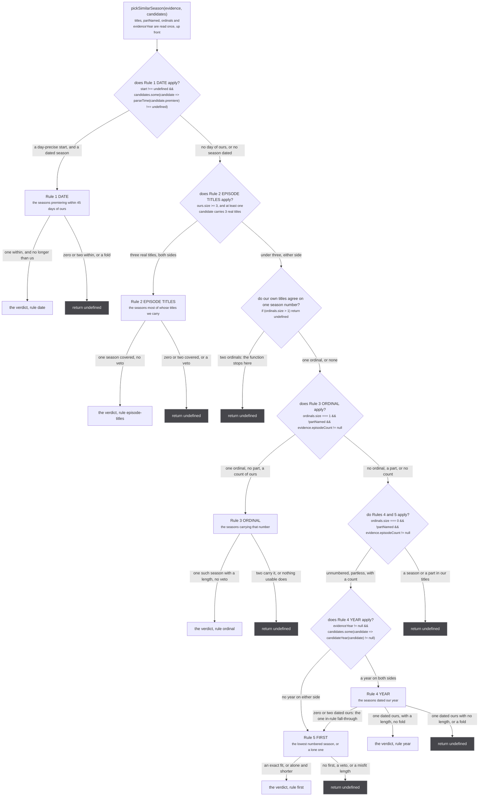
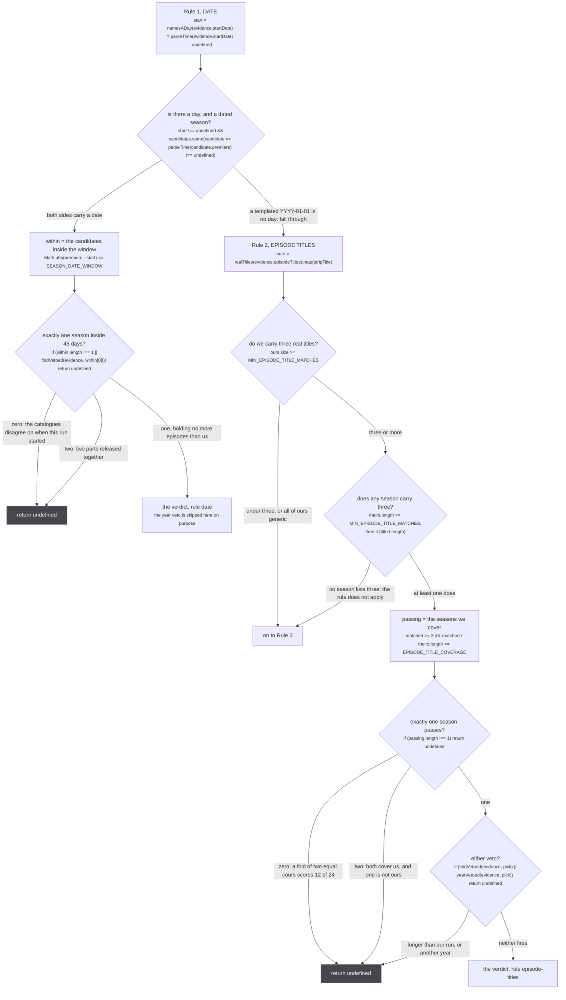
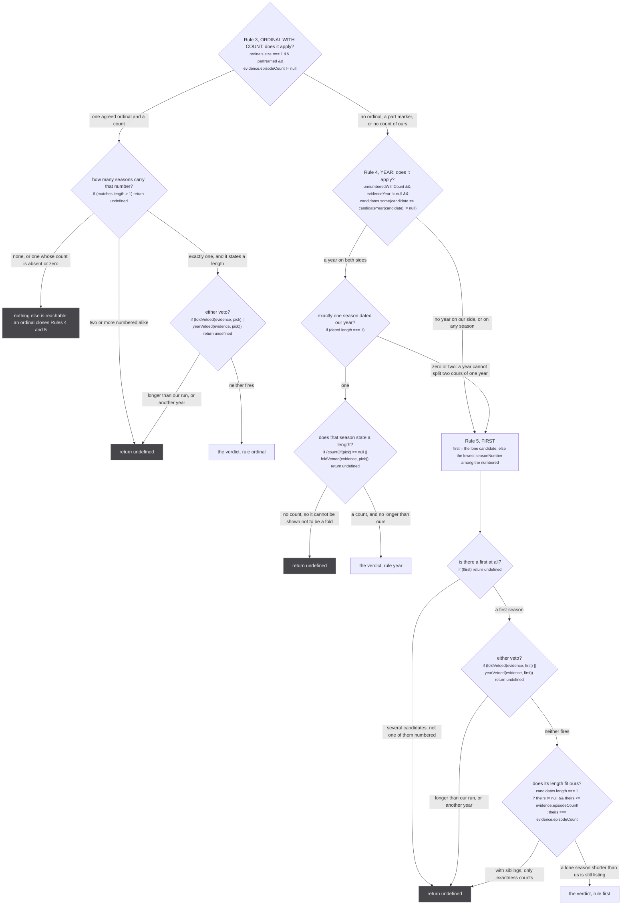
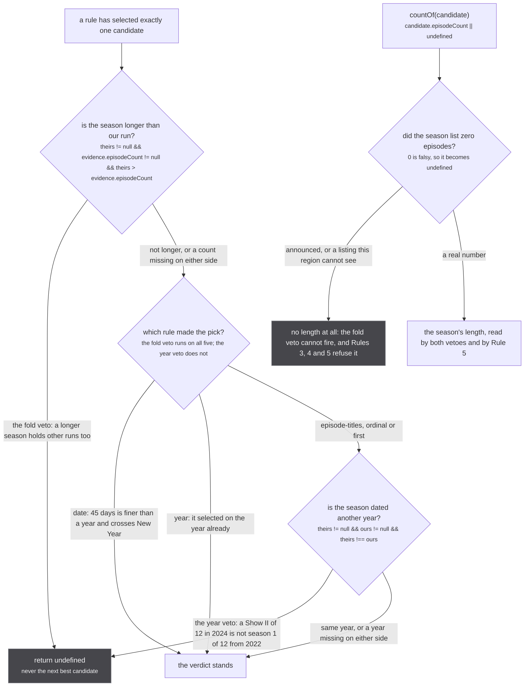
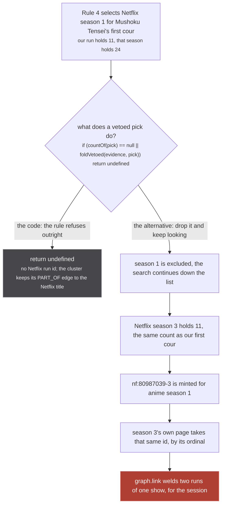

A source has been handed a show id and a description of somebody else's run, and has to answer one
question: which of this show's seasons is that run? Every source that answers `similarMedia` asks that
question the same way, because they all call the same function.

`src/sources/similar.ts:173` is `pickSimilarSeason(evidence, candidates)`. Five sources call it and
none of them own a rule: crunchyroll at `crunchyroll/extractor.ts:518` and `:555`, tvmaze at
`tvmaze/extractor.ts:168` and `:185`, appletv at `appletv/extractor.ts:230` and `:270`, unogs at
`unogs/extractor.ts:358` and `:380`, justwatch at `justwatch/extractor.ts:577`, `:591` and `:703`. What
differs between them is only what they can put in a `SeasonCandidate`, which is the last table on this
page.

`src/sources/similar.ts:3-8`

> A season number is a guess: no two catalogues number a show's seasons the same way (Netflix folds
> two cours into one season, JustWatch numbers by its own list, anime metadata says "Season 2 Part 2"),
> so a season-scoped id minted by ordinal is a guess wearing a precise uri, and the store unions it
> with no inverse. What may go on a union is VERIFIED sameness, and this module is where verification
> is defined: a caller describes its run, a source describes its seasons, and the pick below either
> establishes one season or refuses.

:::danger[A verdict here ends in a union with no inverse]
`pickSimilarSeason` writes nothing. It returns a season, the source turns that season into a
season-scoped uri, the answer travels back through the funnel, and the consumer claims it as
`SAME_AS` of the run (`src/worker/similar-consumer.ts:255`). That claim reaches
`graph.link(mediaUri, handleUri, sameAsLabelFor(mediaScope))` at `src/worker/store/db.ts:193`, which is
a union-find union. There is no unlink anywhere in the repo, and the only reset is `resetStore()` at `db.ts:509-513`,
which empties the whole store and is tests only.

So a wrong verdict is not a wrong row that the next pass corrects. It is two runs of one show welded
together for the rest of the session, and the merged cluster then goes on to weld a third. That is why
every rule below refuses on ambiguity instead of picking the best of two.
:::

## The contract, in three sentences

Read this before the diagrams, because every branch on them is one of these three cases.

`src/sources/similar.ts:164-171`

> The one season of a show that the evidence establishes as the caller's run, or undefined.
>
> The rules run in order; a rule that does not apply falls to the next, and a rule that applies but
> finds nothing unambiguous REFUSES outright. Every rule picks over ALL candidates and only then
> checks the vetoes on its pick: a vetoed pick is a refusal, never a fall-through to the next best
> candidate, because that fall-through is precisely how season 1 of Mushoku Tensei reached Netflix
> season 3 once season 1 was excluded. The FOLD veto applies to every rule; the YEAR veto to every
> rule but the date, which is finer than a year and legitimately crosses a New Year.

1. **Does not apply**: the evidence this rule reads is missing, on our side or on every candidate. Fall
   through to the next rule. Nothing is decided and nothing is spent.
2. **Applies and settles**: exactly one candidate survives, and neither veto fires. Return that season
   with the name of the rule that found it, which is what the source logs
   (`similarMedia: cr picked <id> by <rule> for <showId>`, `crunchyroll/extractor.ts:557`).
3. **Applies and does not settle**: zero survivors, two survivors, or one survivor that a veto refuses.
   Return `undefined` and do not try the next rule.

Four values are read once, before any rule runs, at `similar.ts:177-180`:

```ts
const titles = evidence.titles ?? []
const partNamed = titles.some(namesAPart)
const ordinals = seasonOrdinals(titles)
const evidenceYear = yearOf(evidence.startDate)
```

`seasonOrdinals` (`:100-102`) is every season number `parseSeasonNumber` can read out of our titles, as
a `Set`, so its size is how much our own titles disagree with each other. `namesAPart` (`:89-98`) is a
separate axis, and the two overlap on purpose: `SEASON_PATTERNS` reads `Part 2` as ordinal 2
(`src/sources/season.ts:88-95`), and `PART_NUMBERED` flags the same string as a part
(`similar.ts:91`). A run titled `Show Part 2` therefore carries an ordinal that Rule 3 then refuses to
use, which the log line spells out both halves of
(`{day:2026-07-04, count:-, ordinals:2, parts:yes, titles:1, episodeTitles:0}`, pinned at
`tests/unit/sources/similar.test.ts:257-258`).

## What a candidate is

`src/sources/similar.ts:29-38`. A source fills in whatever it can see without guessing, and leaves the
rest out.

| field | type | what reads it |
| --- | --- | --- |
| `season` | `T` | nothing here. It is the source's own handle on the season, returned untouched in the verdict |
| `seasonNumber` | `number \| null` | Rule 3 matches it against our ordinal; Rule 5 uses it to find the lowest |
| `episodeCount` | `number \| null` | the fold veto, Rule 3's usability check, Rule 4's usability check, Rule 5's fit. Always through `countOf` |
| `premiere` | `string \| number \| null` | Rule 1's window, and `candidateYear` when no `year` is given |
| `year` | `number \| null` | Rule 4's match and the year veto. The doc calls it out: *the season's year when that is all the source knows; read as a veto, never as a match* |
| `episodeTitles` | `readonly string[] \| null` | Rule 2 only |

The evidence side is `RunEvidence` (`similar.ts:21-26`): `startDate`, `titles`, `episodeCount`,
`episodeTitles`, every one optional. `SimilarMediaInput` is structurally a `RunEvidence`, which is why
the sources pass `input` straight in (`justwatch/extractor.ts:591`, `unogs/extractor.ts:380`).

## The five rules as one flow



*Every rule has exactly two exits, a verdict and a refusal, and Rule 4 has a third: the one fall-through in the function that happens inside a rule rather than in front of it.*

Three things on that figure are worth stating in words, because they are the parts a reader
reconstructs wrongly.

**The ordinal disagreement at `similar.ts:216` is not part of Rule 3.** It sits above it and returns
from the whole function:

```ts
if (ordinals.size > 1) return undefined
```

Our titles came from every member of the cluster (`similar-consumer.ts:170`), so two ordinals means two
catalogues disagree about which season this run is. The test says why it has to stop everything rather
than skip one rule (`tests/unit/sources/similar.test.ts:57-58`):

> The refusal is load bearing for the YEAR rule, which reads no ordinal: without it a run whose titles
> say two different seasons is placed by its year alone.

**One ordinal makes Rules 4 and 5 unreachable, without refusing anything.** `unnumberedWithCount`
(`:232`) requires `ordinals.size === 0`, so a run whose titles name a season can only ever be answered
by Rule 1, Rule 2 or Rule 3. If Rule 3 applies and finds no usable match, control falls past both
remaining rules to the bare `return undefined` at `:268`. The inventory that briefed this page says
`ordinals.size > 1` is what makes Rules 4 and 5 unreachable; the code says `> 1` stops the function
outright and it is `=== 1` that quietly closes those two rules. Same outcome, different mechanism, and
the difference matters when you are reading a log line that names no rule at all.

**Rule 4 is the only rule with a fall-through inside it.** `dated.length !== 1` at `:241` leaves the
`if` and reaches Rule 5. Every other in-rule failure returns.

## Rule 1, the date. Rule 2, the episode titles.



*The two rules that can settle a season with no season number anywhere in the evidence, and every edge on which a missing axis is a fall-through rather than a refusal.*

### The window is 45 days, and a bare year cannot reach it

`SEASON_DATE_WINDOW = 45 * 24 * 60 * 60 * 1000` at `src/sources/catalogue-gate.ts:230`, the same
constant the catalogue search gate uses. The comment on the rule is `similar.ts:182-183`:

> Rule 1, DATE: a premiere within the window of a day-precise start. Zero within means the
> catalogues disagree about when this run started; two within is two parts released together.

`namesADay` (`src/sources/season.ts:223-228`) is what keeps a fabricated date out of the window: it
returns false for any date whose `getUTCDate()` is 1, because seven extractors build a date out of a
bare year and template it as January 1.

`src/sources/season.ts:206-208`

> Against a 45 day window that is not a rounding error, it is the difference between naming a cour
> and naming a year, so a coerced date has to be refused rather than matched. Refusing costs a source
> its link; accepting welds it to whichever run happens to sit nearest a date nobody asserted.

A year-only start therefore does not refuse. It makes Rule 1 not apply, and the later rules read the
year through `evidenceYear` instead. `similar.test.ts:95-98` pins exactly that: a start of `2026-07-01`
against Crunchyroll's dated seasons comes back `{ season: 3, rule: 'ordinal' }`, not by date and not as
a refusal.

Rule 1 is also the one rule exempt from the year veto, and the test that proves it is a single
candidate premiering `2023-12-29` against a start of `2024-01-05`, which answers
`{ season: 1, rule: 'date' }` (`similar.test.ts:107-110`). Forty five days is finer than a year, and a
cour that crosses New Year is one cour.

### Three titles, and 60% of theirs

`src/sources/similar.ts:194-195`

> Rule 2, EPISODE TITLES: decisive both ways. Two catalogues carrying three or more real episode
> titles each for one run agree on most of them; two runs of one show share none.

Both constants carry their measurement.

`src/sources/similar.ts:60-66`

> The share of a candidate season's real episode titles our run must carry to be that season.
>
> Measured against the CANDIDATE, so a fold of two equal cours scores 12/24 = 0.50 and a fold of 13
> and 12 scores 0.52 or 0.48, all refused even when our count is unknown and the fold veto cannot
> fire; a season with a four episode bonus block folded in scores 12/16 = 0.75 and is admitted, since
> a bonus block is not a run. The recall cost of title drift between translations is unmeasured.

`src/sources/similar.ts:68`

> One shared title ("The Beginning", a recap name) is a coincidence; three is not.

`EPISODE_TITLE_COVERAGE = 0.6` (`:67`) and `MIN_EPISODE_TITLE_MATCHES = 3` (`:69`). The denominator is
`theirs.length`, the candidate's real title count, which is what makes the rule detect a fold with no
episode count anywhere in the evidence. Every title on both sides goes through `stripTitle`
(`src/sources/utils.ts:178-183`), which lowercases and drops punctuation while keeping letters of every
script, and through `realTitles` (`:160-161`), which drops anything `isGenericEpisodeTitle` accepts
(`:104-111`):

> 'Episode 12', '第3話', '7': a title that names a position and never an episode.

The nesting at `:197-201` is the part a diagram has to show, because it is the difference between a
refusal and a fall-through: if we carry three real titles but **no candidate does**, `titled` is empty,
the inner block never runs, and control reaches Rule 3. `similar.test.ts:124-128` pins the mirror case,
where our own titles are generic and the ordinal decides instead.

## Rules 3, 4 and 5



*The three rules that read a season number or a length. Two of them can only ever run on a run whose own titles name no season at all.*

### Rule 3 refuses a part marker, and that is the whole rule

`src/sources/similar.ts:213-215`

> Rule 3, ORDINAL WITH COUNT. Disagreeing titles refuse outright. A part marker makes the ordinal
> unusable here: "Season 2 Part 3" of 12 episodes would otherwise take the provider's season 2
> whenever that happens to hold 12 or fewer.

`similar.test.ts:212-215` is the control pair: `Show Season 2 Part II` of 12 against a lone candidate
`{ season: 2, seasonNumber: 2, episodeCount: 12 }` refuses, and the same evidence titled `Show Season 2`
answers `{ season: 2, rule: 'ordinal' }`.

Note what Rule 3 does **not** check: it never compares our count to the season's beyond the fold veto.
The count is there to make the ordinal usable at all (`evidence.episodeCount != null`) and to give the
fold veto something to fire on. A season of 14 answers a run of 14 (`similar.test.ts:49-51`) and a
season of 24 refuses a run of 13 (`:45-47`).

### Rules 4 and 5 refuse to read a numbered run

`src/sources/similar.ts:228-231`

> Rules 4 and 5 read a run whose titles name NO season and no part, with a count. A part is a
> position inside a season, and a title naming season N is never placed on season M by a year or by
> being first: with a lone first season of 11 in 2021, 'Show', 'Show Part 2' and 'Show 2nd Season'
> all answered season 1 by year (2026-09-05), three runs on one Netflix season.

That measurement is pinned as a test with all three inputs (`similar.test.ts:165-172`), the third being
the control that still answers `{ season: 1, rule: 'year' }`.

`src/sources/similar.ts:234-238`

> Rule 4, YEAR: the one season dated our year, holding no more episodes than our run. Two cours in
> one year cannot be told apart by a year, and none in our year leaves the pick to the first-season
> rule, whose year veto refuses. A season whose length is unknown cannot be shown not to be a fold,
> so the one season dated our year with no count is a refusal, never a pick (Apple offers no
> counts, JustWatch lists a season as 0 until it airs).

Rule 4 never calls `yearVetoed`, and it does not need to: it selected on the year. It calls
`countOf(pick) == null` instead, which is the rule's own second axis.

`src/sources/similar.ts:248-251`

> Rule 5, FIRST: only ever the first season, so season 1 (11) against 24, 25, 11 is refused at
> 24 !== 11 rather than finding the 11 further down. A lone season shorter than our run is a season
> still listing (most of the homepage); with several seasons a shorter first season may be one half
> of our run (the Fullmetal Alchemist split), so only exactness counts.

The asymmetry at `:261-265` is the rule. One candidate: `theirs != null && theirs <= evidence.episodeCount!`,
because a currently airing season lists fewer episodes than the run will have. Several candidates:
`theirs === evidence.episodeCount`, exact or nothing. `similar.test.ts:136-143` runs both halves against
the same evidence, a run of 12: a lone season of 5 answers `{ season: 1, rule: 'first' }`, and the same
season of 5 beside a season 2 of 12 refuses.

Rule 5 is terminal in every branch, so the final `return undefined` at `:268` is reached only by a run
that carried an ordinal Rule 3 could not place, a part marker, or no count.

## The two vetoes, and the count that is not a count



*Both vetoes fail open on missing data, which is why a zero the source publishes as a count has to be erased before it reaches them.*

`foldVetoed` is exported, unlike its sibling, and the reason is on it.

`src/sources/similar.ts:140-146`

> A season holding MORE episodes than the run holds other runs too (Netflix season 2 = 25 over 13 and
> 12). Zero tolerance, the same allowance season.ts measured as the only one worth having.
>
> Exported because a picker that answers on its own axes still needs it: Crunchyroll's search path
> matches on title and premiere, and a catalogue that folds two cours into one season premieres on
> the SAME DAY as the first of them, so neither axis can see the fold.

`src/sources/similar.ts:152-153`

> A season dated another year is not our run, whatever else fits: this closes the sequel with no
> ordinal, a "Show II" of 12 episodes in 2024 that would otherwise take season 1 of 12 from 2022.

`candidateYear` (`:131-132`) is `candidate.year ?? yearOf(candidate.premiere)`, so a source that
publishes a premiere gets a year for free and never has to fill both fields.

### `countOf` erases a zero, and only on the candidate side

`src/sources/similar.ts:134-136`

> A season listing ZERO episodes (announced, or a listing this region cannot see) has no length, and
> read as a length it fit under every run's count: two runs two years apart both took a crunchyroll
> season whose episodes payload was empty (2026-09-05).

`countOf(candidate)` is `candidate.episodeCount || undefined` (`:137`), a deliberate `||` rather than
`??`. Every read of a candidate's length goes through it: the fold veto at `:148`, Rule 3's usability
check at `:221`, Rule 4's at `:243`, Rule 5's fit at `:260`. `similar.test.ts:196-202` pins it from both
directions: two runs two years apart both fail to take one empty season as a lone first, and the same
empty season is refused again by ordinal.

The asymmetry is worth seeing, because it is easy to read as a bug and it is not one. **`countOf` is
never applied to `evidence.episodeCount`.** The run's own count is read raw at `:149`, `:217`, `:232`
and `:263`. A candidate's zero means "this source published nothing usable"; a run's count comes from
`runLength` over the cluster's consensus (`src/worker/store/consensus.ts:62-63`), where an absent count
is already `undefined` rather than `0`.

## A vetoed pick is a refusal, never a fall-through



*The lower lane is not hypothetical: it is what the code did before these rules existed, and the reproduction script produced it five times out of five.*

The upper lane loses a link. The lower lane produces an id shared by two runs, and the same id is then
minted a second time from the other direction. The measurement is in the source that suffered it.

`src/sources/unogs/extractor.ts:329-332`

> A UNIQUE count is still a guess: Netflix lists Mushoku Tensei as 24, 25 and 11 episodes, anime
> season 1 has 11 and a title naming no season, so the count picked Netflix season 3 for it while
> season 3's own page took the same `nf:80987039-3` by its ordinal (2026-09-05, five of five runs of
> `scripts/reproduce-season-weld.mjs`). One id, two runs, and `graph.link` has no inverse.

The whole test module opens on the same incident (`tests/unit/sources/similar.test.ts:1-5`), and the
first test in the file is the coincidence itself: a run with no ordinal and 11 episodes against
Netflix's three seasons of 24, 25 and 11 returns `undefined` (`:41-43`).

## What each source can actually fill in

The rules are shared. What is not shared is the evidence a catalogue publishes about its own seasons,
and that decides which rules can ever fire for that source.

| source | `seasonNumber` | `episodeCount` | `premiere` | `year` | `episodeTitles` | built at |
| --- | --- | --- | --- | --- | --- | --- |
| crunchyroll | yes, `data[0]?.season_number` | yes, distinct numbered episodes | yes, the first episode's air date | from the premiere | yes, every episode | `crunchyroll/extractor.ts:294-307` |
| tvmaze | yes | yes, counted off the embedded list | yes, the season's earliest airdate | from the premiere | yes | `tvmaze/extractor.ts:134-146` |
| justwatch | yes, `content.seasonNumber` | `totalEpisodeCount \|\| undefined` | never | yes, `content.originalReleaseYear` | yes, when the node carries episodes | `justwatch/extractor.ts:310-317` |
| unogs | yes, `season.season` | yes, `season.episodes.length` | never | the first season only | yes | `unogs/extractor.ts:313-320` |
| appletv | yes | never | yes, `season.releaseDate` | from the premiere | never | `appletv/extractor.ts:209-212` |

Read down the columns rather than across the rows:

- **Apple TV can only ever be answered by Rule 1.** With no count on any candidate, `countOf` returns
  `undefined` everywhere, so Rule 3's `countOf(matches[0]!) != null` fails, Rule 4's
  `countOf(pick) == null` refuses, and Rule 5 fails both ways: `theirs != null` for a lone season and
  `theirs === evidence.episodeCount` for one with siblings. A day inside the window is the only route
  left, which is exactly what the comment says:

  `src/sources/appletv/extractor.ts:203-207`

  > A show's seasons as `pickSimilarSeason` reads them: a number and a premiere, and NOTHING else on
  > purpose. 27.280% of the episodes Apple answers for a season belong to another season (see
  > `fetchEpisodes`), so a count or a title list off that endpoint is not evidence, and a candidate
  > carrying none can only be picked by a day inside the window: a year needs a count on the season to
  > show it is not a fold, so here it only ever vetoes.

- **Netflix and JustWatch can never be answered by Rule 1**, because no candidate carries a premiere,
  so `candidates.some(...)` is false and the rule does not apply. They are decided by episode titles,
  an ordinal, a year or the first season.

- **unOGS puts the title's year on season 1 alone**, and the reason is the year veto rather than the
  year rule:

  `src/sources/unogs/extractor.ts:308-311`

  > unOGS gives no air date at any level (`UnogsEpisode` is epid, seasnum, synopsis, title, img), so the
  > axes are the count, the episode titles and, on the FIRST season only, the title's year: Netflix's
  > `year` is the whole title's, which is its first season's, and offered on any other season it would
  > veto the very run that season holds.

- **Crunchyroll pays for its column.** `walkSeasonCandidates` spends one episodes request per season to
  fill it (`crunchyroll/extractor.ts:283-285`), cached for ten minutes at `:319`.

The page brief that produced this table said "justwatch year only" and "tvmaze premiere and titles".
The code disagrees: `jwCandidates` fills four of the five fields and `seasonCandidates` in tvmaze fills
every axis the type has except an explicit `year`, which it gets from the premiere anyway. Corrected
above from the files.

## What the rules still cannot do

They decide which season of a show a run is. They cannot fix a catalogue that disagrees about what a
season is, and both of the sources that hit that hardest say so in their own files.

`src/sources/unogs/extractor.ts:337-340`

> WHAT THIS SOURCE STILL CANNOT DO, recorded rather than hidden: Netflix does not agree with anime
> about what a season is. It splits Fullmetal Alchemist's single 64 episode run into five seasons of
> about 13 and folds Mushoku Tensei's five runs into three. No amount of counting fixes a disagreement
> about the unit; the fold veto only ever detects the direction it can see.

`src/sources/justwatch/extractor.ts:409-414`

> JustWatch FOLDS anime cours exactly as Netflix does, so a run that is one cour matches none of its
> seasons and `normalizeMedia` refuses the whole node. Measured 2026-09-10 on Mushoku Tensei: JustWatch
> publishes seasons of 23, 24 and 14 against our cours of 11/12/12/12/14, the title and date gates both
> pass, and `pickSimilarSeason` then returns undefined. Only the cour whose length happens to equal a
> JustWatch season (season 3, 14 against 14) survived, which is why Netflix appeared on the last season
> of the show and on none of the others.

Four of five cours getting no verdict is the rules working, not failing: the fold veto sees a season of
23 over a cour of 11 and refuses. What that costs is a missing offer, and what it buys is that the
other four cours do not all end up welded onto one JustWatch id. The recovery for the missing offer is
not a looser rule, it is a different claim: JustWatch answers with the show as a `CONTAINER` instead, so
the offers survive on a `PART_OF` edge and assert nothing. See
[lending a season](/similar/lending/) for the same move on the Crunchyroll side.

There is one thing the rules are trusted for and cannot check at all.

`src/sources/similar.ts:10-12`

> The rules decide WHICH season of a show and never WHICH show: the show id the caller holds settles
> that, and it came off a PART_OF edge whose container cluster the fuzzy title pass may have unioned
> on a listing. A wrong container union upstream is trusted here, so a pick is only as right as it.

That gap is closed on the other side of the funnel, by `answerNamesOurShow` and
`SHOW_TITLE_THRESHOLD = 0.9` in the consumer (`similar.ts:299-320`). A season picked perfectly out of
the wrong show is still refused there, on titles alone.
