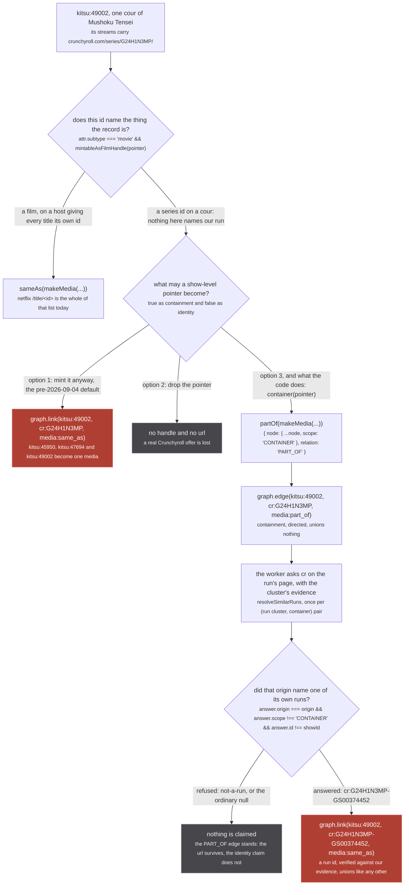
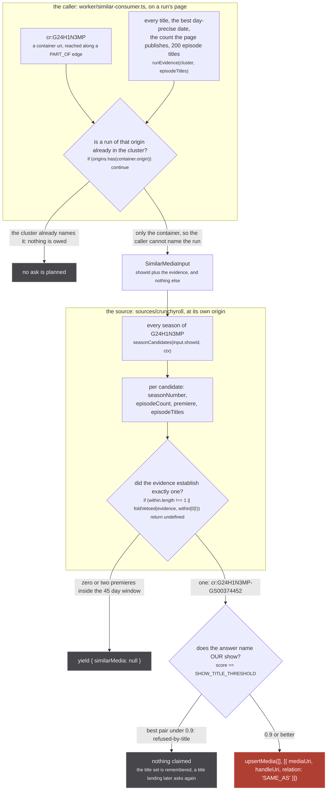
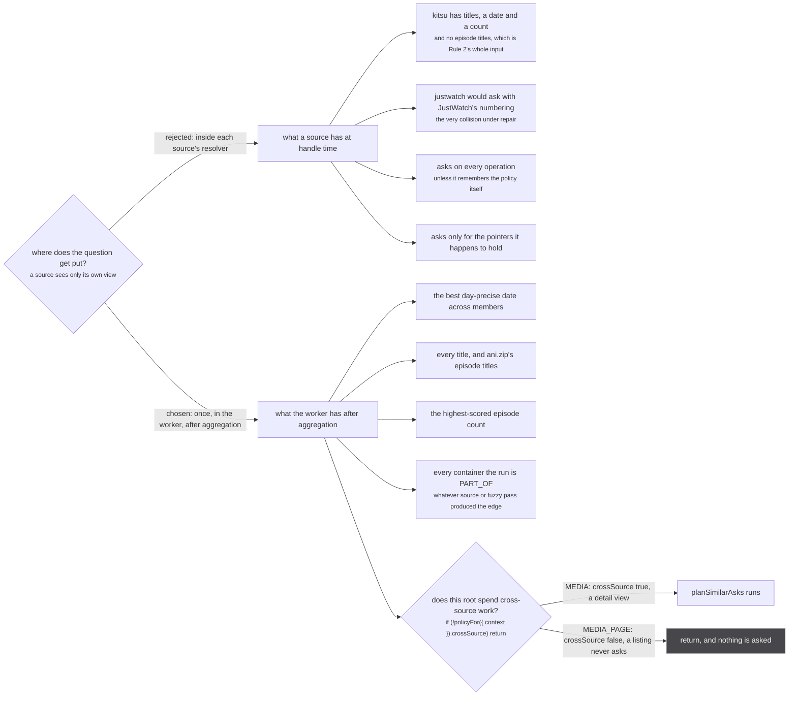

Kitsu knows that `kitsu:49002` streams on Crunchyroll. What it publishes to say so is
`crunchyroll.com/series/G24H1N3MP/...`, and it publishes the **same** url on `kitsu:45950` and
`kitsu:47694`, two other runs of the same show. The url is true. The id inside it names the series,
not the cour.

That is the whole problem, and it is not a matter of precision. A handle is an identity claim, and
`graph.link` is a union-find union with no inverse (`src/worker/store/graph.ts:279-291`). Minting
`cr:G24H1N3MP` as `SAME_AS` on all three records does not produce three slightly wrong rows. It
produces **one** media where there were three, for the rest of the session.

`similarMedia` is the third option. Hand the show id back to the origin that owns it, say what the
cluster knows about our run, and take the run that origin names.

## The dilemma



*Both rose nodes are the same call. The top one welds three runs on a guess and the bottom one welds two ids that were checked against each other, which is the only difference between them and it is the entire subsystem. The second rhombus is a design decision rather than a runtime branch, and its second line is the sentence in the file that settles it.*

The first decision is real code, split across a branch and a ternary at
`src/sources/kitsu/extractor.ts:100-105`: `attr.subtype === 'movie'` selects the mintable path, and
`mintableAsFilmHandle(pointer)` decides per pointer inside it. Everything else falls to
`container(pointer)` at `:96`, which is `partOf(makeMedia({ origin, id, url }))`.

The second decision is the argument. `src/sources/kitsu/extractor.ts:76-93`:

> Kitsu's streaming links, spent two ways depending on what the id can honestly claim.
>
> MINTED DIRECTLY when the record is a film AND the link is one of the few (origin, path segment)
> pairs measured to carry a per-title id. Netflix is the whole of that list today: it gives every
> title its own `/title/<id>`, so a film's Netflix link names the film.
>
> CARRIED AS PART_OF for everything else, because the show id is true as containment and false as
> identity. Kitsu publishes the same `crunchyroll.com/series/G24H1N3MP/...` on kitsu:45950,
> kitsu:47694 and kitsu:49002, three different runs of Mushoku Tensei, so minting it welds all three
> permanently; a film published under a series page is part of that series too. The precise run is
> not asked for here: the WORKER asks the owning origin on the run's page, once per run and container,
> with the whole cluster's evidence (the best day-precise date, every title, the highest-scored count,
> the episode titles), which is more than this record knows at handle time and is spent on no listing.
>
> DROPPED never. An id this source cannot read is not a pointer at all (see `streamPointers`), and
> every pointer is at least a link to the show the run is part of.

`partOf` is where the scope stamp goes on. `src/sources/utils.ts:36-38`, above the one-line function
at `:40`:

> THIS IS THE SCOPE STAMP. A PART_OF target is by definition a container of this run, so the node goes
> out as a copy scoped CONTAINER whatever it said, and the store then keeps it out of every run's
> identity space for good (scope is sticky toward CONTAINER there). The input is left untouched.

And the module header of `similarMedia` itself, `src/worker/extractor.ts:176-192`:

> One origin, one show id, and evidence about OUR run; the answer is that origin's own run or nothing.
>
> WHY THIS EXISTS. Stub models a broadcast run; every catalogue models a show. A source holding a
> show-level link (Kitsu publishes Crunchyroll's `/series/<id>/` url on EVERY season record) has
> something true about the show and nothing it may honestly mint as a handle, because a handle is an
> identity claim and `graph.link` is a union-find union with no inverse. Dropping the link loses a
> real offer; minting it welds every season of the show. This is the third option: hand the show id
> back to the origin that owns it, say what we know about our run, and take the run it names, which
> IS an honest identity and links like any other.
>
> WHY EVIDENCE AND NOT A SEASON NUMBER. Season numbers do not agree across platforms: Netflix folds
> two cours into one season, JustWatch numbers by its own list, anime metadata says "Season 2 Part 2".
> An id minted by ordinal is a guess wearing a precise uri, and on 2026-09-05 two such guesses met in
> `nf:80987039-3`. What establishes sameness is decided in `sources/similar.ts`, once, and every
> answering source goes through it.
>
> THE SELECTION is `SIMILAR_MEDIA_DOCUMENT` in ./similar-document.ts, with what it selects and why.

Note what the fourth option would have been and why it is not on the figure. Computing a
season-scoped id from an ordinal (`cr:G24H1N3MP-s2`, `nf:80987039-3`) looks like the honest middle,
and it is not: it is option 1 with a longer uri. `src/sources/similar.ts:3-8`:

> A season number is a guess: no two catalogues number a show's seasons the same way (Netflix folds
> two cours into one season, JustWatch numbers by its own list, anime metadata says "Season 2 Part 2"),
> so a season-scoped id minted by ordinal is a guess wearing a precise uri, and the store unions it
> with no inverse. What may go on a union is VERIFIED sameness, and this module is where verification
> is defined: a caller describes its run, a source describes its seasons, and the pick below either
> establishes one season or refuses.

`nf:80987039-3` is that failing in the tree: two different runs of one show each computed the same
Netflix season-scoped id, and the union that followed had no inverse.

:::danger[The claim at the bottom of that figure cannot be taken back]
`upsertMedia` applies the claim at `src/worker/store/db.ts:193`:
`if (graph.link(mediaUri, handleUri, sameAsLabelFor(mediaScope))) changed = true`.

`link` finds both roots and calls `uf.union(a, b)` (`graph.ts:279-291`). The exported graph API is
`set, registerLabel, setLabel, labeled, get, has, alias, resolve, link, connect, neighbours, root,
componentId, edge, targets, sources, cluster, clusters, clear` (`graph.ts:377-382`). There is no
`unlink`, no split, and nothing inside the union-find recording which pair caused a merge. The only
undo is `clear()`, which is the whole store, so a wrong `SAME_AS` is permanent for the session and
the fix is a reload.

`graph.edge` is directed and unions nothing (`graph.ts:297`), which is why every guess in this
subsystem is routed onto one. `db.ts:171`: *Guesses go on edges, which are deletable; only asserted
sameness within one scope goes on a union.*
:::

## What each party knows

Neither side can answer alone, and that is not a limitation to be engineered away. The caller holds
an id in a space it cannot read; the source can read that space and has never heard of our run.



*Three refusals and one claim, and the claim is the only rose node. The show is decided twice: once upstream by the PART_OF edge the caller already holds, and once here on titles alone after the answer comes back, because the edge may have come from a fuzzy pass.*

Left side, `src/worker/similar-consumer.ts:167-177`. `runEvidence` reads the cluster sorted by score
descending and returns four fields: every member's titles deduped and filtered by
`!isOnlySeasonLabel(title)` (a bare `"Season 3"` names a position, never a show), `bestRunStartDate`
of the members' dates, `runLength(cluster)` for the count, and the episode titles capped at 200. The
count is deliberately the aggregate's own, `:172-173`:

> the same number the aggregate publishes, so a source is asked against what the page shows
> rather than a second opinion assembled here (store/consensus.ts)

The filter drawn as `C3` is `planSimilarAsks` at `similar-consumer.ts:154`. It reads `origins`, built
at `:147` from **every** cluster member rather than only the runs collected at `:144`.

Right side, `src/sources/crunchyroll/extractor.ts:552-559`. `seasonForShow` fetches the season list,
runs `pickSimilarSeason(input, candidates)` and returns the season it establishes, or nothing. The
condition on `S3` is Rule 1 verbatim (`src/sources/similar.ts:190`); it is one of five rules and the
rest are on [the rules](/similar/rules/). The contract it works under, `crunchyroll/extractor.ts:549-550`:

> Null is the expected answer for most shows and is never an error. Answering with the SERIES would
> put back exactly the show-level handle the caller came here to avoid minting.

The rhombus on the way back is `answerNamesOurShow`, `src/sources/similar.ts:310-320`, applied at
`similar-consumer.ts:248`. `SHOW_TITLE_THRESHOLD` is `0.9` at `similar.ts:303`, and `similar.ts:299-302`
says where the number came from:

> The score at which an answer's title names OUR show. The value crunchyroll's search gate measured
> (title-gate.test.ts): correct pairs 1.000, the nearest wrong pair 0.8135, a spin-off.

It exists because the show id was never verified either. `src/sources/similar.ts:10-12`:

> The rules decide WHICH season of a show and never WHICH show: the show id the caller holds settles
> that, and it came off a PART_OF edge whose container cluster the fuzzy title pass may have unioned
> on a listing. A wrong container union upstream is trusted here, so a pick is only as right as it.

## Where the ask lives, and why not in each source

Every source could ask this question about its own pointers, at handle time, without the worker
being involved. It does not, for four measured reasons.



*The four boxes on each branch are the same four sentences, read as a loss on top and a gain underneath. The bottom rhombus is the only runtime branch on the figure, and it is what keeps the whole subsystem off listings.*

`src/worker/similar-consumer.ts:1-13`:

> The one place the app asks `similarMedia`: on a run's page, after aggregation, per (run cluster,
> container) pair, re-asked only when the question changes.
>
> The ask lives HERE rather than inside each source's resolver because a source sees only its own
> view (kitsu has titles, a date and a count but no episode titles at handle time; justwatch would ask
> with JustWatch's numbering, the very collision under repair), asks on every operation unless it
> remembers the policy, and asks only for the pointers it happens to hold. The worker sees the whole
> cluster: the best day-precise date across members, every title, the highest-scored episode count,
> ani.zip's episode titles, and every container the run is PART_OF whatever source or fuzzy pass
> produced the edge. `Subscription.media` is the only caller, which is what keeps this off listings.
>
> Pure of the extractor on purpose: worker/extractor.ts cannot load under vitest, so the asking and
> the claiming are here and the resolver only wires them.

The single call site is `src/worker/resolvers/media/index.ts:76`, inside the `read()` that
`Subscription.media` re-runs on every `media:changed`:

```ts
// a MEDIA root by construction: only this resolver runs it, so a listing never asks
void resolveSimilarRuns(cluster, root, { ask: askSimilar, implemented: implementsSimilarMedia })
```

`void`, so the page's yield never waits on it, and the whole body of `resolveSimilarRuns` is wrapped
in a `try` that catches into `console.error` (`similar-consumer.ts:280`, `:300-302`). It never throws
into the caller.

The policy gate on the figure is `similar-consumer.ts:281`, reading the table at
`src/worker/request-context.ts:59-63`:

```ts
const POLICY: Record<RootOperation, RequestPolicy> = {
  MEDIA: { crossSource: true },
  MEDIA_PAGE: { crossSource: false },
  SIMILAR_MEDIA: { crossSource: true },
}
```

A hop that arrives with no context at all reads `UNKNOWN_POLICY` (`request-context.ts:73`), which is
also `{ crossSource: true }` and increments a counter. Failing open there is deliberate; see
[the request context](/request/request-context/).

## What this page does not cover

Only the argument. The machinery is next door:

- [The consumer](/similar/consumer/): what the worker remembers per (run cluster, container) pair, and the cap on how many times one pair is asked.
- [The funnel](/similar/funnel/): the ladder between the consumer and the source, and the difference between `declined` and `refused`.
- [The rules](/similar/rules/): `pickSimilarSeason`, its five rules and two vetoes.
- [The document](/similar/document/): what the ask selects off the answer, and the Netflix incident that added the episode selection.
- [A run is not a show](/start/run-and-show/): the modelling mismatch this page starts from.
- [Scopes and relations](/write/scopes-and-relations/): the 2x2 that turns the claim at the bottom of the first figure into a union or an edge.
