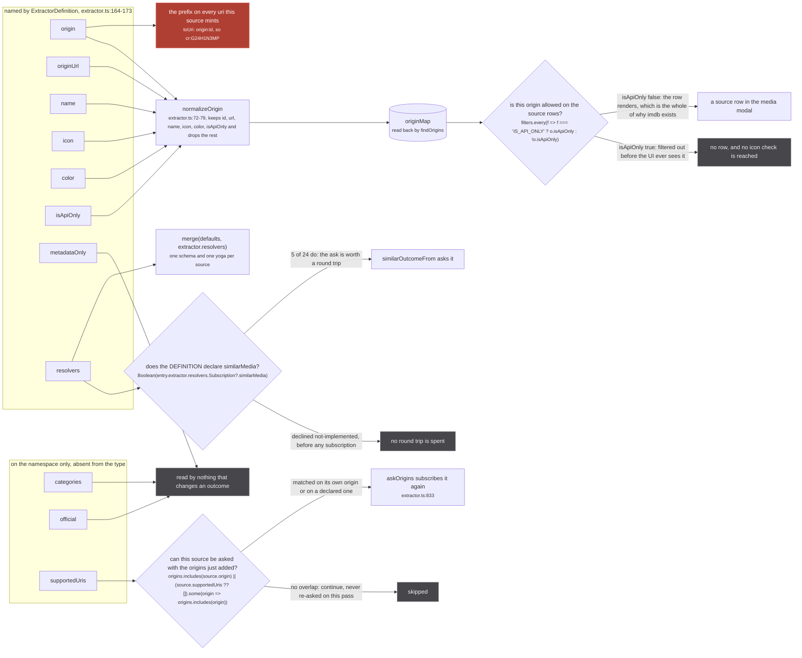
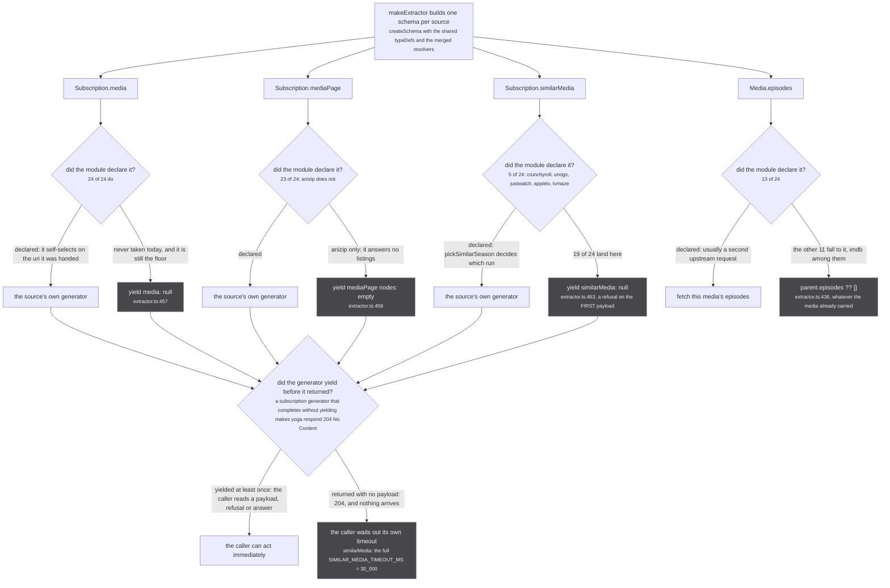
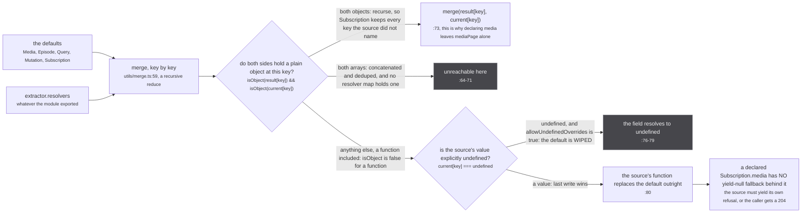

A source is not a class, an interface, or a registration call. It is an **ES module namespace
object**, and the whole registry is one file of `export * as` lines.

`src/sources/index.ts` is 33 lines, 24 of them a source:

```ts
export * as jikan from './jikan/extractor'
export * as anilist from './anilist/extractor'
export * as anizip from './anizip/extractor'
// ...
export * as watchmode from './watchmode/extractor'
```

`src/worker/extractor.ts:551` turns that file into the live list:

```ts
export const extractors = Object.values(extractorDefinitions).map(makeExtractor)
```

Two consequences follow from that one line, and both matter later.

**Exporting a module is the on switch, and deleting the line is the off switch.** There is no enable
flag, no config, no allowlist. `tests/unit/sources/index.test.ts:1-3` says so as the reason the test
file exists:

`tests/unit/sources/index.test.ts:1-3`

> `worker/extractor.ts` builds the live source list as `Object.values(extractorDefinitions)`, so what
> this module exports IS what runs. A source is disabled by not being exported here, which is a
> deletion of one line and therefore silently undone by anyone adding one back.

That test pins the count at `expect(names).toHaveLength(24)` (`tests/unit/sources/index.test.ts:24`)
and every name individually at `:19-23`, so a wildcard edit that took the others down with it cannot
pass by taking everything down.

**`makeExtractor` receives the entire namespace, not a filtered object.** `ExtractorDefinition`
(`src/worker/extractor.ts:164-173`) names eight fields. The modules export eleven. The extra three
ride along, invisible to the type, and one of them is read at runtime through a structural cast.

:::note[The live order is alphabetical, not the order `index.ts` lists]
A module namespace object enumerates its keys in sorted code-unit order, so `Object.values` hands
`makeExtractor` `amazon, anilist, anizip, appletv, crunchyroll, ...` and finishes on `watchmode`,
whatever order the export lines are written in. `joinFanout` then iterates `extractors` in that
order (`src/worker/extractor.ts:792`). Nothing in the code depends on it, and nothing should: every
source is asked, and the store's answer is order-independent by construction.
:::

## The eleven exports, and what reads each one



*Three exports lead to a dim terminal, and that is not a drawing convenience: nothing in `src/` reads them.*

The three decisions above are the only places a declared field changes what happens. The origin
filter is `src/worker/store/db.ts:539-543`, reached from `src/worker/resolvers/origin/index.ts:57`
and passed `OriginFilter.IsNotApiOnly` by all three consumers
(`src/router/home/media-modal.tsx:484` and `:644`, `src/router/watch/index.tsx:221`).
`answersForOrigins` is `src/sources/supported.ts:27-29`, called from `askOrigins` at
`src/worker/extractor.ts:830`. `implementsSimilarMedia` is `src/worker/extractor.ts:292-295`.

| export | declared by | read by | what it decides |
| --- | --- | --- | --- |
| `origin` | 24 of 24 | `normalizeOrigin` as `id`; `implementsSimilarMedia`; `answersForOrigins`; `enforcePluginOrigin`; the plugin collision check | The uri prefix on every row and handle the source mints. See the aside below. |
| `originUrl` | 24 of 24 | `normalizeOrigin` as `url` | Nothing on screen. `src/sources/offline/extractor.ts:33` records that it "is never rendered anywhere". |
| `name` | 24 of 24 | `normalizeOrigin`; every console line the worker prints about the source | The label in a source row, and how a failure is attributed. |
| `icon` | 22 of 24 | `normalizeOrigin` | A row with no icon is skipped outright: `src/router/home/media-modal.tsx:781` is `if (!origin.icon) return undefined`. anizip and offline omit it, and both are `isApiOnly = true`, so that check is never reached for them. |
| `color` | 18 of 24 | `normalizeOrigin` | Row accent. jikan, anilist, anizip, crunchyroll, unogs and justwatch declare none. |
| `isApiOnly` | 24 of 24 | `normalizeOrigin` to `Origin.isApiOnly`, then the `OriginFilter` branch | Whether the origin appears in the source rows at all. |
| `resolvers` | 24 of 24 | `makeExtractor`, merged over the defaults; and `implementsSimilarMedia`, read off the definition rather than the merged schema | Everything the source can answer. |
| `supportedUris` | 24 of 24 | `answersForOrigins`, through a structural cast: `const definition = extractor.extractor as Answerable` (`src/worker/extractor.ts:829`) | Whether the source is re-asked when a new origin turns up in the cluster. |
| `metadataOnly` | 24 of 24 | nothing that changes an outcome | dead |
| `official` | 24 of 24 | nothing at all | dead |
| `categories` (module level) | 24 of 24 | nothing | dead as an export, live per row |

There is no `export const score`. Every source keeps a module-private `const SCORE` and threads it
per field into `makeMedia` and `makeEpisode`, which is why the scale is a property of the rows a
source produces rather than of the source itself. That is [its own page](/sources/scores/).

:::danger[`origin` is the one export with an irreversible consequence]
`origin` is the prefix on every uri the source mints, and a `SAME_AS` handle between two uris in the
same scope reaches `graph.link` at `src/worker/store/db.ts:193`, a **union-find union with no
inverse**. Two rows welded that way stay welded for the session; nothing in the store can split
them. Everything else on this page is recoverable by a later slice. Changing a live source's
`origin`, or letting a plugin claim one already taken, is therefore not a rename: it is a decision
about what may be permanently merged with what. The collision check at
`src/worker/extractor.ts:678-680` is the only guard, and it covers plugins only, since the built-in
24 are checked by review.

`graph.set`, one line earlier at `db.ts:147`, is separately **last-write-wins for scalars**: the last
source to describe a field wins it outright unless the ratchet or the aggregate says otherwise.
:::

## The three dead exports, and one comment that is wrong about it

`metadataOnly`, `official` and the module-level `categories` are declared by all 24 sources and
consumed by nothing. The evidence is short in each case.

`normalizeOrigin` is the only funnel from a definition into the store, and it is an explicit
six-field object literal (`src/worker/extractor.ts:72-79`): `id`, `url`, `name`, `icon`, `color`,
`isApiOnly`. Anything else on the namespace stops there. `metadataOnly` is not in the GraphQL
schema either, so it cannot reach the page by another route. `official` returns zero hits across
`src/` outside its own declarations. `categories` has readers everywhere, but every one of them
reads `media.categories` off a row (`src/worker/store/normalize.ts:20`,
`src/worker/store/filter.ts:65`, `src/worker/store/aggregate.ts:388`), never the module export; each
extractor restates its categories per media inside `makeMedia({ categories: [...] })`.

The comment that says this plainly is the right one:

`src/sources/offline/extractor.ts:30-31`

> `metadataOnly` gates nothing at all, for anybody: `normalizeOrigin` drops it, it is not in the
> GraphQL schema, and the one value read of it feeds a field nothing consumes.

:::caution[The code disagrees with a comment here, and the code wins]
`src/sources/imdb/extractor.ts:17-18` says:

> `metadataOnly` keeps it out of the playback paths; `isApiOnly` false is what lets `originPage`'s
> IsNotApiOnly filter return it, which is the whole point of the file.

The second half is exactly right and is why imdb is `isApiOnly = false` while every other
answer-nothing source is not. **The first half is not true.** No playback path reads `metadataOnly`;
playback is reached through `src/sources/players.ts`, which is a lookup keyed by origin. What keeps
imdb out of playback is that `getPlayer('imdb')` is undefined, and that it answers no media at all.
:::

Plugin sources carry the same field for the same non-effect: `src/worker/plugin-sources.ts:77` reads
`source.metadataOnly === true` into `PluginSourceMeta`, and `makeExtractor` drops it in the same
place it drops a built-in's.

## The four resolvers, and the default each falls back to

A source may implement four things. Every field it does not implement falls to a default defined
once, in `makeExtractor`, at `src/worker/extractor.ts:436` and `:448-464`.



*`Media.episodes` is a field resolver and not a subscription, which is why it is the one lane that never reaches the 204 decision.*

The counts on that figure are the code as it stands, and one of them is worth counting out, because
a figure of 14 is easy to arrive at and wrong. **13 sources implement `Media.episodes`**, and they
are crunchyroll (`:592`), unogs (`:493`),
justwatch (`:777`), appletv (`:427`), paramount (`:90`), tmdb (`:223`), tvmaze (`:223`), kitsu
(`:319`), omdb (`:139`), trakt (`:177`), simkl (`:260`), tvdb (`:203`) and watchmode (`:268`), each
in that module's `extractor.ts`. anizip has an `episodes:` at `src/sources/anizip/extractor.ts:53`,
but it is a field of the media object it builds, not a resolver, so its episodes arrive with the row
and never through a second request.

The schema declares five subscription fields in total, across
`src/worker/resolvers/media/schema.gql:531-543` and
`src/worker/resolvers/origin/schema.gql:54-57`: `media`, `mediaPage`, `similarMedia`, `origin` and
`originPage`. The last two are the exception to everything above, because their defaults are not
refusals but **the answer**. `makeExtractor` builds `originData` once from the definition's own
`origin`, `originUrl`, `name`, `icon`, `color` and `isApiOnly` (`src/worker/extractor.ts:412`) and
serves it from both (`:449-456`), so no source declares them and none should: a source overriding
`Subscription.origin` would be answering a question about itself that the registry already answered.

Two things are **not** per-source resolvers, and looking for them is a common wrong turn.
`Subscription.episode` does not exist anywhere in the schema; episodes reach the store through the
`Media.episodes` field resolver above and are picked up by `useOnResolve` on the return value.
`playbackSource` is a worker-level type only, and playback is reached through
`src/sources/players.ts:11-16`, a record keyed by origin with exactly two entries, `cr` and `nf`.

### What the 204 costs, per caller

This is the load-bearing branch on the figure, and it is written down at the default that exists to
avoid it:

`src/worker/extractor.ts:459-462`

> most sources cannot answer show-plus-evidence, and the default has to YIELD that rather
> than end: a subscription generator that completes without yielding makes yoga respond
> 204 No Content, which the caller would sit on until its timeout instead of reading a
> refusal off the first payload

The cost is not the same on all four fields, because the callers are not the same.

- **`Subscription.media`.** Nothing waits. `joinFanout`'s subscribe callback returns immediately
  unless `fanout.extractUris` is set (`src/worker/extractor.ts:750-751`), and the only caller that
  sets it is `Subscription.mediaPage`. A source that ends without yielding on the media path costs a
  dropped payload that was going to be dropped anyway; its real answer, if it had one, reaches the
  page by being written into the store.
- **`Subscription.mediaPage`.** The payload is read, for its uris only:
  `result.data.mediaPage.nodes.map(({ uri }) => uri)` into `insertedUris`
  (`src/worker/resolvers/media/index.ts:101-107`). A 204 contributes no uris, which is the same
  outcome as an empty page, so again nothing stalls.
- **`Subscription.similarMedia`.** This is the expensive one, and it is the reason the comment
  exists. `firstSimilarMedia` (`src/worker/extractor.ts:252-285`) arms
  `setTimeout(() => finish({ kind: 'timeout' }), SIMILAR_MEDIA_TIMEOUT_MS)` with
  `SIMILAR_MEDIA_TIMEOUT_MS = 30_000` (`:198`), and only a **delivered payload** clears it. An
  explicit `null` settles it in milliseconds; a 204 does not settle it at all, so the ask burns the
  full thirty seconds and returns `declined: timeout`, occupying one of
  `MAX_SIMILAR_MEDIA_PER_CALLER = 8` (`:227`) and one of `MAX_CONCURRENT_SIMILAR_MEDIA = 32`
  (`:216`) the whole time. `src/worker/extractor.ts:274-276` states the rule the other way round:

  `src/worker/extractor.ts:274-276`

  > any DELIVERED payload settles this, including an explicit null. A source that cannot
  > answer yields null once and ends, and waiting out the timeout for that would turn the
  > ordinary refusal into the slowest path in the system.

- **`Media.episodes`.** No subscription, no 204. Returning nothing gives the caller
  `parent.episodes ?? []`.

That is why every real implementation carries the same one-line comment above its generator. anizip's
is the shortest complete source in the tree, and it shows the whole pattern in eleven lines:

```ts
// src/sources/anizip/extractor.ts:116-129
export const resolvers: Resolvers = {
  Subscription: {
    media: {
      // always yield once: a subscription generator that completes without yielding makes yoga respond 204 No Content
      subscribe: async function*(_, { input: { uri } }, ctx: ExtractorServerContext) {
        if (!uri || !isAggregatedUri(uri)) return yield { media: null }
        const uris = fromAggregatedUri(uri)
        const malId = uris?.handleUrisValues.find(uri => uri.origin === 'mal')
        if (!malId) return yield { media: null }
        yield { media: await fetchMALMappings(malId.id, ctx) }
      }
    }
  }
}
```

Note `return yield`, not `return`. Every refusal in that function yields first and returns second.

### A source may declare a resolver in order to answer nothing

The six pure-stub providers (disney, amazon, hulu, peacock, hbo, fubo) and imdb all declare both
subscriptions and then yield the same thing the default would have. `src/sources/hulu/extractor.ts:16-24`
in full:

```ts
export const resolvers: Resolvers = {
  Subscription: {
    media: { subscribe: async function* () { yield { media: null } } },
    mediaPage: {
      resolve: (parent: { mediaPage: { nodes: GQLMedia[] } }) => parent.mediaPage,
      subscribe: async function* () { yield { mediaPage: { nodes: [] } } }
    }
  }
}
```

They exist so that JustWatch's `PACKAGE_ORIGIN_MAP` has an origin to mint handles into, and so a
`hulu:` handle has a name, an icon and a colour to render against.
`src/sources/hulu/extractor.ts:3` states the arrangement: "Hulu - no anonymous API. For now:
metadata/episodes via TMDB, deep link via JustWatch." imdb is the same shape for a different reason,
and its comment is the clearest statement of it on the site:

`src/sources/imdb/extractor.ts:11-15`

> It will never resolve a media, and that is not a gap to be filled later. An IMDb `tt` id names the
> SHOW and IMDb models no seasons, so there is no season-level id to ask it about: `worker/store/db.ts`
> keeps imdb in `SHOW_LEVEL_ORIGINS` for exactly that reason and demotes every imdb handle to PART_OF.
> A resolver here would have to answer a show-level id with something, and everything it could answer
> is the defect that Set exists to prevent.

## The `merge` that builds the schema

Every source's schema is the same generated `typeDefs` plus one merged resolver map
(`src/worker/extractor.ts:417-467`):

```ts
merge(
  { Media: { ... }, Episode: { ... }, Query: {}, Mutation: {}, Subscription: { ... } } satisfies Resolvers,
  extractor.resolvers
) as Resolvers
```

`merge` is `src/utils/merge.ts:51-85`, a deep reduce running on its module defaults
(`src/utils/merge.ts:113-117`): `allowUndefinedOverrides: true`, `mergeArrays: true`,
`uniqueArrayItems: true`. Those three settings are what decide whether a source's declaration adds to
the default or replaces it.



*The recursion in the first branch is the whole reason a source can declare one field and inherit the other three.*

Read the branches in the order they are written at `src/utils/merge.ts:64-81`. The array branch comes
first, the object branch second, and everything else falls to the scalar branch. `isObject`
(`src/utils/merge.ts:34-45`) requires the prototype to be `Object.prototype` or `null`, so a
**function is not an object** by that test and always takes the scalar branch. That is the answer to
the question the figure is really about: a source's `subscribe` never merges with the default's, it
replaces it.

Two practical consequences.

**Declaring `Subscription.media` removes the yield-null default for that source only, and for that
field only.** anizip declares `media` and nothing else, so its `mediaPage` is still the default
empty page and its `similarMedia` is still the default null. That is not an oversight: the default
is the correct answer for a source that indexes mappings rather than listings.

**Declaring `media: undefined` would delete the field.** `allowUndefinedOverrides: true` means an
explicit `undefined` on the right-hand side wins over a real value on the left
(`src/utils/merge.ts:76-79`). No source does this today, and a source that did would end up with a
schema field whose resolver is `undefined` rather than one that refuses politely. It is the one way
to get a genuinely broken source out of a well-formed module.

## What a source never gets

Worth naming, because the contract is defined as much by its absences.

- **No access to the store's write path.** A source returns values; `useOnResolve`
  (`src/worker/extractor.ts:473-491`) fires on the return value of any resolver whose named type is
  `Media`, `Episode` or `Origin` and hands it to a DataLoader. A source never calls `upsertMedia`.
- **No say in whether it is asked.** `joinFanout` (`src/worker/extractor.ts:746-766`) contains one
  test, `if (fanout.joined.has(extractor)) return`, and it is not an origin test. Every registered
  source is joined to every fan-out. Self-selection happens inside the source's own resolver, which
  is [its own page](/request/self-selection/).
- **No second chance from itself.** `Subscription.media` is a yield-once generator; once it has
  yielded and returned, that subscription is finished. Being asked again is the caller's decision,
  through `askOrigins`, and `supportedUris` is what makes the caller choose it
  ([the re-ask](/request/re-ask/)).
- **No shared context beyond five functions.** A built-in source's `ctx` is
  `ExtractorServerContext` (`src/worker/extractor.ts:34-44`): `fetch`, `key`, `findAggregatedMedia`,
  `listenForMediaChanges`, `similarMedia`. A plugin source gets exactly one of those,
  `{ similarMedia: similarMediaFrom(origin) }` (`src/worker/extractor.ts:620`), which is
  [the plugin page](/request/plugins/).

## Two sets, and the class of source that never answers

`supportedUris` is the one runtime-only export that changes an outcome, and the comment above the
function that reads it is the best short account of why the field exists at all.

`src/sources/supported.ts:8-13`

> The origin this source PUBLISHES under, which is the prefix on every uri it mints.
>
> The origins whose ids this source can be ASKED with. Absent means only its own.

`src/sources/supported.ts:15-26`

> Whether a source can answer once these origins are known.
>
> TWO SETS, and conflating them is a whole class of source that never answers. A source publishes
> under one origin and is addressable by others: anizip mints `anizip:` uris but answers from an
> anidb or a mal id, so its own name cannot appear in a cluster until it has already answered. Asked
> only when its own origin shows up, it is never asked at all, and its data appeared only on a reload
> where the address already carried the mal id (measured 2026-09-09 on `ag:(anilist:166873)`, which
> settled without anizip and gained it on a second load).
>
> `supportedUris` is declared by every source in this directory and was read by nothing until this.

Twenty-two of the 24 declare exactly their own origin, so `answersForOrigins` is a self-loop for
them. Two do not, and they are the two that had this problem:

| source | `origin` | `supportedUris` |
| --- | --- | --- |
| anizip | `anizip` | `['anidb', 'mal']` (`src/sources/anizip/extractor.ts:13`) |
| offline | `offline` | `['offline', ...INDEXED_ORIGINS]` (`src/sources/offline/extractor.ts:48`) |

:::caution[A second comment the code has overtaken]
`src/sources/offline/extractor.ts:45-47` says of its `supportedUris`: "Note this export is
declarative only: nothing in the worker reads it, so what actually decides is the resolver below."

That was true when it was written and is not true now. `askOrigins` reads it, through the
`Answerable` cast at `src/worker/extractor.ts:829`, and `src/worker/extractor.ts:810` says so
directly: "`supportedUris` is declared by every source in src/sources and, until this, was read by
nothing." The resolver still decides what the source *answers*; `supportedUris` now decides whether
it is *asked*.

The same file's neighbouring comment about `db.ts:144-146` resolving the `IsNotApiOnly` filter is
stale in a smaller way: that filter is at `src/worker/store/db.ts:539-543` in the current tree.
`db.ts:144-146` today is the scope ratchet.
:::

Note also what `supportedUris` does **not** do: it is not consulted on the first pass. The fan-out
asks every source unconditionally, whatever it declares, and `supportedUris` only ever *adds* a
question. A source can therefore be asked with a uri it declared no interest in, and the honest
answer to that is its own `yield { media: null }`.
