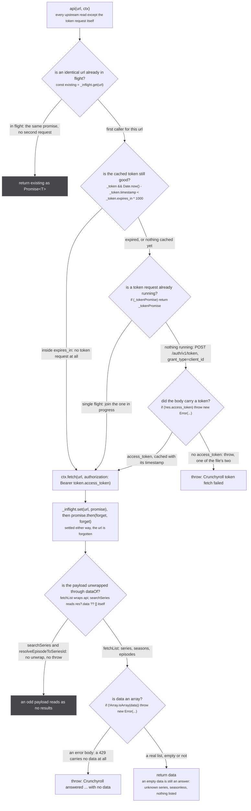
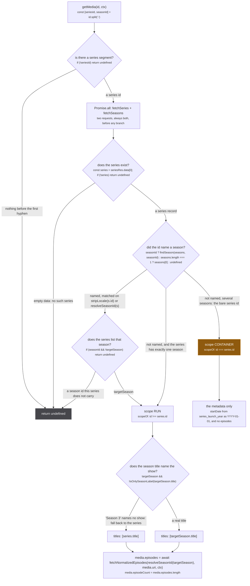
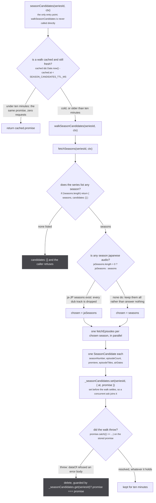
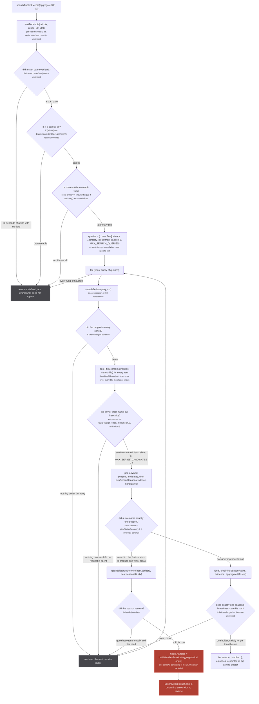
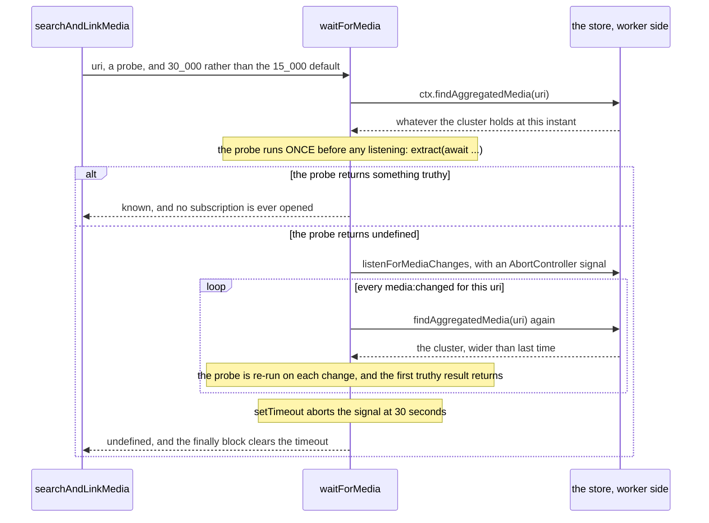

Crunchyroll is the only built-in source that implements everything a source can implement. It answers
`Subscription.media`, `Subscription.mediaPage`, `Subscription.similarMedia` and the field resolver
`Media.episodes`, it searches by title when the cluster carries no `cr:` id, it mints season-scoped
ids, it keeps two module-level caches, and it is one of five sources that answer `similarMedia` at
all. Everything the platform can do appears in this one file, which is why it is worth reading whole.

The declarations are at `src/sources/crunchyroll/extractor.ts:12-22`: `origin = 'cr'`,
`supportedUris = ['cr']`, `isApiOnly = false`, and a module-private `const SCORE = 0.5`, threaded into
every media, episode, title, description and image it mints. That 0.5 sits below the metadata
catalogues that describe a show (jikan and anizip at 0.9, anilist at 0.8) and above the streaming
catalogues that only carry a link (0.2), which is the whole story of what this source is for: it is a
place to watch that also happens to know its own episodes well.

| constant | value | where |
| --- | --- | --- |
| `SCORE` | `0.5` | `extractor.ts:12` |
| `CONFIDENT_TITLE_THRESHOLD` | `0.9` | `extractor.ts:366`, its own copy, not the shared gate's |
| `MAX_SERIES_CANDIDATES` | `3` | `extractor.ts:369` |
| `MAX_SEARCH_QUERIES` | `4` | `extractor.ts:370` |
| `SEASON_CANDIDATES_TTL_MS` | `10 * 60 * 1000` | `extractor.ts:319` |
| `SEASON_DATE_WINDOW` | `45 * 24 * 60 * 60 * 1000` | imported from `src/sources/catalogue-gate.ts:230` |
| the search path's `waitForMedia` timeout | `30_000` | `extractor.ts:461`, against a 15s default |

`SEASON_DATE_WINDOW` is the only thing this file takes from the shared
[search gate](/sources/search-gate/). Its title threshold, its candidate cap and its query cap are
local constants that mirror the shared ones rather than importing them, and the shared module says so
in the other direction at `src/sources/catalogue-gate.ts:1-2`: the gate there mirrors the one
Crunchyroll already shipped.

## Transport: one token, one request per url, and two throws

Three module-level singletons sit above every request: `_token` and `_tokenPromise` at
`extractor.ts:25-26`, and `_inflight` at `:49`. They are shared by every ask in the worker, which is
what makes a fan-out of twelve resolvers touching the same show cost one token and one request per
distinct url.



*Two exits throw, and they are the only two `throw` statements in the whole file, at `extractor.ts:43` and `extractor.ts:111`. This transport is described elsewhere as having three; the file has two, and the file wins.*

The `dataOf` guard at `extractor.ts:109-113` is the one that had to be argued for, because the
alternative looks harmless.

`src/sources/crunchyroll/extractor.ts:104-108`

> Crunchyroll's error body (`{ __class__: 'error', code: 'rate_limited' }` on a 429) carries no
> `data`. Read as an empty list it was an ANSWER about the show: three such bodies described three
> seasons of zero episodes, the walk refused, the cache served that for ten minutes and the consumer
> recorded the refusal for the session (2026-09-05). An empty `data` is still a real answer: an
> unknown series, a seasonless one, a season with nothing listed.

That is the distinction the whole file turns on. A refusal has to be a refusal about data that
arrived, never about a request that failed, because a refusal is remembered and a failure is retried.
`tests/unit/sources/crunchyroll/extractor.test.ts:497-508` pins both halves: a degraded payload
`rejects.toThrow(/answered .* with no data/)`, and the very next ask, upstream healthy again and still
inside the ten minute TTL, answers `cr:G24H1N3MP-GS00374452` because the walk was made again.

The `_inflight` collapse at `:64-69` carries a second measured line, and it is about how the entry is
removed rather than about the collapse itself:

`src/sources/crunchyroll/extractor.ts:65-66`

> `.finally` mints a second promise that rejects when this one does, and nobody awaits it: a failed
> request surfaced as an unhandled rejection on top of the one the caller got (2026-09-05)

So the cleanup is `promise.then(forget, forget)`, two handlers on the original promise, rather than
`promise.finally(forget)`, which would be a new promise nobody holds.

## `getMedia`: the id decides whether this is a show or a run

`getMedia` is `extractor.ts:229-277`, and it is reached from three places: `Subscription.media` when
the uri already carries a `cr:` id (`:575`), the tail of the search path (`:525`), and
`Media.episodes` when a media arrives with an empty episode list (`:595`). Its argument is a
Crunchyroll id split on `-`, which is what `crunchyrollId(seriesId, seasonId, episodeId)` at `:151`
joined.



*Three of the four exits are `return undefined`, and the fourth splits on a single character: whether the id carries a hyphen and a season segment.*

Three separate rules live in that figure, and each one is a measurement.

**The bare series id is a CONTAINER.** `scopeOf` at `extractor.ts:174` is one line, and the comment
above it is the reason the store has a scope axis at all.

`src/sources/crunchyroll/extractor.ts:170-173`

> An id with no season segment is the bare series id, which Crunchyroll shares across every season, so
> it names the SHOW. It enters the store as a CONTAINER and never a run's identity space: the bare
> `cr:G24H1N3MP` fuzzy merged into Mushoku Tensei season 1's cluster on the search path is what welded
> season 1 to season 3 on the live site. Anything carrying a season segment is one run.

:::caution[The scope stamp is a one-way door]
A row that says CONTAINER stays CONTAINER. `upsertMedia` computes
`scopeOf(media.uri) === 'CONTAINER' ? 'CONTAINER' : media.scope ?? 'RUN'` in
`src/worker/store/db.ts:146`, so a later row saying RUN, or saying nothing, cannot bring it back. That
is deliberate, and it is what keeps `cr:G24H1N3MP` out of every run's identity space once any source
has read it as a show. See [scopes and relations](/write/scopes-and-relations/).
:::

**A season title that names only a position is not published as a title.**

`src/sources/crunchyroll/extractor.ts:244-247`

> Crunchyroll names a great many seasons with nothing but their position, so `targetSeason.title` is
> routinely the literal "Season 3". Publishing that as the media's own title puts a string naming no
> show into the store, where anything comparing titles reads it as an identity: it is what merged
> Grand Blue into Mushoku Tensei. Fall back to the series, which always names the show.

**A show-level media answers with no episodes.** This is the longest comment in the file and the one
that best shows what a wrong row costs downstream.

`src/sources/crunchyroll/extractor.ts:260-271`

> No target season is a SHOW-level media, and a show has no honest episode list here: every media in
> this store is one season, so `episodeNumber` is within-season and flattening several seasons into
> one list collides them. `store/db.ts` hangs a HAS_EPISODE edge off this uri for every one of them
> and `Media.episodes` groups the union by episodeNumber ALONE, so whatever else the cluster holds
> ends up sharing rows with a season nobody asked for.
>
> Measured on the live site 2026-08-31, before this guard: the Mushoku Tensei season 3 page listed 24
> rows for a 14 episode season. Rows 1 to 10 were right, because AniZip scores 0.9 against this
> source's 0.5 and won them; row 11 carried AniZip's season 3 title over a season 1 description; and
> rows 12 to 24 were season 1 outright, since AniZip publishes no English title past episode 11.
>
> So a show-level id gets the metadata and no episodes, rather than every season's. The media itself
> stays, because `mediaPage` mints exactly these ids for SEARCH results and dropping it would take the
> search hit down with it. A single-season series is unaffected: `targetSeason` is that season.

All three assertions are pinned, and the control is the interesting one:
`tests/unit/sources/crunchyroll/extractor.test.ts:110-135` asserts zero episodes for
`getMedia('G24H1N3MP')`, then asserts fourteen for `getMedia('G24H1N3MP-GS00374452')` with the comment
"a source that answered nothing for every id would pass the assertion above unconditionally", then
asserts that a one-season series asked by its bare id keeps its three.

Two smaller details in the same function are worth knowing because they are invisible from the
outside. `resolveSeasonId` at `:146-149` prefers the `ja-JP` version's guid, then the one flagged
`original`, then `stripLocale(season.id)`, which strips a trailing `JAJP`: the id in the store is the
japanese-audio season whichever dub was listed first. And `deduplicateEpisodes` at `:213-219` keeps
the last episode per `episodeNumber`, because "regular episodes come after specials in CR's ordering".

## The season walk, and the cache in front of it

`similarMedia` and the search path both need the same thing: every season of a series, described the
way [`pickSimilarSeason`](/similar/rules/) reads one. That is `walkSeasonCandidates` at
`extractor.ts:287-311`, and it is expensive.

`src/sources/crunchyroll/extractor.ts:282-286`

> Every japanese-audio season of a series described the way `pickSimilarSeason` reads one, at the cost
> of one episodes request per season. The premiere is the first episode's air date, the count is the
> distinct numbered episodes (specials carry no number and are not part of the run's length).



*The cache stores the promise, not the result, which is what makes two simultaneous asks about one show share one walk rather than race to fill it.*

Each candidate is built at `:298-307`. `episodeCount` is
`new Set(data.filter(ep => ep.episode_number != null).map(ep => ep.episode_number)).size`, distinct
numbered episodes, so a season listing a special twice still has the length of its run. `premiere` is
`data[0]?.episode_air_date || undefined`, the first episode's air date and not the season's own, which
Crunchyroll does not publish. That field is easy to write down as `data[0]?.episode_air_date` alone.
The `|| undefined` is in the code and it is load bearing: an empty air date string would otherwise
reach `pickSimilarSeason` as a premiere.

`airDates` is the field nothing else in the tree carries, and it exists for one caller:

`src/sources/crunchyroll/extractor.ts:304-305`

> every air date, not just the first: a season that CONTAINS a run is recognised by its span, and the
> walk already holds the whole payload it would otherwise be refetched from

The ten minutes are argued rather than picked:

`src/sources/crunchyroll/extractor.ts:313-318`

> How long one series' season walk is reused. What can move inside a session is a currently airing
> season publishing an episode (its count and title list grow by one, its premiere and number do not),
> roughly weekly; region and entitlement changes are not reachable mid-session. Ten minutes bounds a
> stale count to the same exposure as reading it ten minutes before the episode published.

`src/sources/crunchyroll/extractor.ts:322-324`

> Keyed by series id alone: the token and the fetch are module-wide already. Unlike `_inflight`, which
> collapses concurrent identical requests and forgets them on settle, this keeps the settled walk, so
> the search path and `similarMedia` share one walk per show and two pages of one show pay for one.

`src/sources/crunchyroll/extractor.ts:330-331`

> a failed walk is not an answer about the show: drop it so the next ask walks again. A rate limited
> payload is a failure by `dataOf`, so it lands here and not in the ten minute cache

The cost claim is measured rather than asserted.
`tests/unit/sources/crunchyroll/extractor.test.ts:412-421` counts requests to the one season neither
ask wins and gets exactly 1 across two asks about the same show;
`:435-452` moves a fake clock and reads 1 at nine minutes and 2 at eleven. The cache is a module
singleton, so the suite calls `resetCrunchyrollCaches()` (`extractor.ts:336-337`, exported for tests
only) in a `beforeEach`, "so a test counting requests otherwise reads the test before it".

## The search path, and why its gate is stricter than the shared one

`searchAndLinkMedia` at `extractor.ts:442-536` runs only in one situation: the uri is aggregated, and
no source has ever put a `cr:` id in it. The resolver says so at `:576`: "no `cr:` in the uri, so no
source ever supplied one. Search, under the gate above."

:::danger[A link minted here has no inverse]
The one difference between this path and every other path in the file is the line at `:527`,
`media.handles = buildHandlesFromUri(aggregatedUri, origin)`. Those handles are `SAME_AS`, and a
`SAME_AS` handle reaches `graph.link(mediaUri, handleUri, MEDIA_SAME_AS)` in
`src/worker/store/db.ts:194`, which is a union-find union. There is no unlink. A wrong hit is not a bad
row that the next pass corrects: it is another show welded to this cluster for the rest of the
session, with every episode and every play button under it.

`src/sources/crunchyroll/extractor.ts:339-344`

> Linking a search hit asserts identity PERMANENTLY: `graph.link` is a union-find union with no
> inverse, so a wrong hit is not a bad row, it is a different show welded to this title for the rest of
> the session, and every episode and every play button under it belongs to that other show. The same
> mistake measured on unOGS welded "Demon Slayer" onto a 2009 korean movie 14 times in 62 queries
> (sources/utils.ts:163-166). So the gate here is deliberately stricter than the shared one.
:::



*One rose path out of eight, and it is the only one that changes anything permanently. Every other exit returns `undefined` or moves to the next rung.*

The order of the two axes is a cost decision as much as a correctness one. Titles are scored against
the search payload, which is already in hand, so a candidate the title axis refuses never costs a
seasons request. `extractor.ts:477-478`:

> gate on title BEFORE spending any season or episode requests: the search payload already carries
> everything this axis reads, and a rejected candidate must cost nothing

And both axes have to agree, because neither is close to sufficient alone.

`src/sources/crunchyroll/extractor.ts:346-364`

> TWO INDEPENDENT AXES, and both must agree:
>
> TITLE decides the franchise. Season markers come off both sides first, because a catalogue that
> models a show as one series with several seasons names it once without the season, and charging a
> correct match for that difference is what would force the threshold back down. Every title the
> cluster knows is tried and the best wins, since catalogues disagree about the canonical name.
>
> DATE decides the season. The candidate season's first episode must have aired within
> SEASON_DATE_WINDOW of this media's start date.
>
> Neither axis alone is close to sufficient, which is the whole reason both are here. Title alone
> cannot separate the 2001 and 2019 "Fruits Basket", nor season 1 from season 3 of anything, and it is
> exactly a multi-season show that this path exists to rescue. Date alone matches every show that
> aired the same week. Requiring both is what makes a hit worth trusting.
>
> Anything missing is a refusal, never a guess: no start date, no titles, nothing over the threshold,
> or nothing inside the window, and this returns undefined and Crunchyroll simply does not appear.
> That is the correct trade. A missing row is a nuisance; a wrong row is a lie about what the user is
> about to watch, and it is not recoverable without a reload.

The date half of that used to be a date comparison written here. It is now `pickSimilarSeason`, the
same picker `similarMedia` uses, and the reason is measured:

`src/sources/crunchyroll/extractor.ts:487-506`

> THE SAME PICKER `seasonForShow` USES, rather than a date comparison of this path's own.
>
> This path had one rule where that one has five, and none of the guards the others carry. Measured
> 2026-09-09 against the manami database joined to real AniList dates: 82 pairs of RELATED entries
> premiere within 45 days of each other AND clear this file's own 0.9 title gate on both sides, 37 of
> them with a TV side. Rent-a-Girlfriend season 2 and its Petit shorts are three days apart and score
> 1.0000. Nothing here refused them; what kept them apart was whether Crunchyroll happened to publish
> the companion as its own season, which is upstream data rather than a rule, and a wrong claim unions
> two runs for the session with no inverse.
>
> What comes with the picker: a refusal when TWO seasons sit inside the window, which is exactly what
> two parts released together look like; a date rule that ignores a start date naming only a year,
> which seven extractors template as the first of January; the fold veto this path used to apply by
> hand; a year veto; and four further ways to match that a date comparison cannot.
>
> THE SERIES IS NOW DECIDED BY TITLE ALONE rather than by whichever series held the nearest season.
> `scored` is already sorted by title score, and the title is the axis that decides the franchise;
> letting a worse-named series win on a closer date is how a companion show gets in.

Note the shape of the loop that follows from that last paragraph. `scored` is sorted by title score
and the loop `break`s on the first survivor that yields a verdict (`:515-522`), so the series is the
best-titled one that can name a season, never the one holding the nearest date. That is the opposite
of the shared gate's `pickGatedCandidate`, where the best date wins among survivors: there the title
axis has already collapsed every survivor onto one show, and here each survivor is a different series.

One correction worth carrying: the date guard on this path is often written down as
`isNaN(Date.parse(known.startDate))`. The file writes `isNaN(new Date(known.startDate).getTime())` at
`:464`. Same outcome, a different call, and the figure above quotes the line that is there.

## A season that lends its episodes without claiming to be the run

When no season IS the run, one may still CONTAIN it. `lendContainingSeason` at `extractor.ts:402-440`
is the last thing each query rung tries, and it exists because of a shape Crunchyroll uses often.

`src/sources/crunchyroll/extractor.ts:378-400`

> The season that CONTAINS this run, when no season IS it.
>
> Crunchyroll models a split cour as one season, so neither part matches: part one is refused by the
> fold veto for being shorter than what it found, and part two never comes near, because the season it
> belongs to premiered with part one nine months earlier. Both parts then carry no Crunchyroll at all,
> which is the state the site was in on 2026-09-09.
>
> WHAT IS RETURNED IS NOT AN IDENTITY. The season is one thing and the run is another, so it carries
> NO handles: claiming it would union both parts into one cluster through a shared uri, which is the
> defect the fold veto exists to prevent and which `graph.link` has no inverse for. What crosses over
> is the EPISODES, re-pointed at the run that asked, so a `HAS_EPISODE` edge exists and the run's own
> walk can reach them.
>
> They keep CRUNCHYROLL'S OWN NUMBERING. The node is shared with everything else that reads that
> season and `graph.set` is last-write-wins, so rewriting it here would change what those readers see.
> `store/consensus.ts` aligns them onto the run's numbering at READ time, from the dates both sides
> publish, and windows away the parts of the season that belong to the run's siblings.
>
> CONTAINMENT IS A SPAN, not a premiere. The run's start has to fall inside the season's own broadcast,
> and the season has to be longer than the run, and exactly ONE season may qualify: two would mean the
> catalogue splits this show differently again, and there is nothing here to choose between them with.

Four gates, all of them refusals that return `undefined`:

```ts
const start = dayOf(evidence.startDate ?? undefined)
const ours = evidence.episodeCount
if (start == null || ours == null) return undefined            // no day, or no length: nothing to contain

// per candidate season
(candidate.episodeCount ?? 0) > ours                           // strictly longer than the run
days.length > 1 && start >= Math.min(...days) - 1 && start <= Math.max(...days) + 1   // inside the span

if (holders.length !== 1) return undefined                     // zero, or an ambiguity
if (!season?.episodes?.length) return undefined                // nothing to lend
```

`dayOf` at `:372-376` is Crunchyroll's own, `Math.floor(at / 86_400_000)`: "The day a date falls on,
which is the precision two catalogues actually agree to." The one day of slack at either end of the
span is "the same allowance the alignment makes for one broadcast being stamped in two timezones"
(`:417-418`).

The return value at `:434-439` is the whole point of the function:

```ts
return {
  ...season,
  // no identity: this season is not this run, and saying so would weld the run to its own sibling
  handles: [],
  episodes: season.episodes.map(episode => ({ ...episode, mediaUri: member })),
}
```

:::caution[The lent episodes keep Crunchyroll's numbering, on purpose]
`graph.set` is last-write-wins on scalars, and the episode nodes are shared with every other reader of
that season. Renumbering them here to suit the asking run would change what those readers see, so the
correction is made at read time instead: `alignRunEpisodes` and the windowing in
`src/worker/store/consensus.ts` map them onto the run's numbering from the dates both sides publish.
Same rows on screen, opposite permanence. See [aggregating episodes](/read/episodes/).
:::

`member` is `fromAggregatedUri(aggregatedUri)?.handleUris?.[0]`, and the comment at `:429-430` says
why the first one is not arbitrary: "Any member of the asking cluster reaches the same cluster, so the
first is chosen for being deterministic rather than for being special."

The measured case is Mushoku Tensei, and the tests carry it whole. Crunchyroll models season 1 as one
season of 23; AniList and MAL split the same broadcast into 11 and 12. At
`tests/unit/sources/crunchyroll/extractor.test.ts:543-570`, part 1 asks with
`episodeCount: 11` and `startDate: '2021-01-10T00:00:00Z'` and gets back `cr:G24H1N3MP-GSSEASON1` with
`handles` equal to `[]` and every episode's `mediaUri` rewritten to `anilist:108465`. The control
directly below it (`:572-600`) runs the same search with `episodeCount: 14` and links normally to
`cr:G24H1N3MP-GS00374452`, "so the veto is separating folded seasons rather than switching Crunchyroll
off for anything with a number attached". The spanning case at `:704-716` is the second cour: a run
starting 2024-04-07 against a season that premiered 2023-07-09, 273 days earlier, which no date rule
can reach and whose span still contains it.

## `waitForMedia`, and the two traps it sets

The search path cannot run until some other source has described the cluster, because its evidence is
that description. `waitForMedia` (`src/sources/utils.ts:489-509`) is how it waits.



*The loop is driven by the same `media:changed` event that re-runs the whole read, so this source waits on exactly the thing that would make its own answer possible.*

**Trap one: the probe must be synchronous.** `waitForMedia` keeps the first result it finds truthy,
and a promise is always truthy, so an async probe succeeds instantly with a value that resolves to
nothing. Three other sources carry the same warning verbatim above their own probes
(`src/sources/tvmaze/extractor.ts:164`, `src/sources/tmdb/extractor.ts:154`,
`src/sources/appletv/extractor.ts:219`).

**Trap two: what the probe waits FOR.** Crunchyroll's probe is
`media => (getFirstTitle(media) && media.startDate ? media : undefined)` at `:460`, and the `&&` is
the fix.

`src/sources/crunchyroll/extractor.ts:446-455`

> WAITS FOR THE DATE, not just for a title.
>
> Every rule below reads `known.startDate`, and the very next line used to return on a null one. It
> waited for a title alone, so it fired as soon as ANY source named the show and gave up if the ones
> carrying a date had not landed yet: measured on a real Mushoku Tensei page 2026-09-09, the ask ran
> with `start=null` every time and this path never got past its second statement.
>
> Waiting for what it actually needs costs a cluster with no date the full timeout instead of an
> immediate refusal, and that cluster was never going to match on any rule here anyway.

That trade is stated plainly and is worth reading twice: the fix makes the failing case slower on
purpose, because the fast failure was a wrong answer arriving quickly.

## `similarMedia`: the show is given, only the season is open

The other way into this source is `Subscription.similarMedia`, answered by `seasonForShow` at
`extractor.ts:552-559`. The caller already holds a `crunchyroll.com/series/<id>` url off its own
record, so there is no search and no title gate: the franchise is settled and one question remains.

```ts
const seasonForShow = async (input: SimilarMediaInput, ctx: ExtractorServerContext) => {
  const { candidates } = await seasonCandidates(input.showId, ctx)
  if (!candidates.length) return undefined
  const verdict = pickSimilarSeason(input, candidates)
  if (!verdict) return undefined
  console.warn(`similarMedia: cr picked ${verdict.season.resolvedId} by ${verdict.rule} for ${input.showId}`)
  return await getMedia(crunchyrollId(input.showId, verdict.season.resolvedId), ctx)
}
```

`src/sources/crunchyroll/extractor.ts:538-550`

> The one run of a show that the caller's evidence establishes, for a caller holding the show.
>
> The show id already names the franchise (the caller has a `crunchyroll.com/series/<id>` url off its
> own record), so the only open question is which of that series' seasons is ours, and every rule that
> answers it lives in `pickSimilarSeason`: a premiere inside the window of a day-precise date, the
> episode titles, an ordinal the titles agree on with a count the season does not exceed, the one
> season dated our year holding no more than our count, the first season holding our episodes. A
> year-only date is no longer thrown out here: the date rule ignores it itself and the later rules can
> still read the year.
>
> Null is the expected answer for most shows and is never an error. Answering with the SERIES would put
> back exactly the show-level handle the caller came here to avoid minting.

The `console.warn` is not debug output that survived. The rule is not on the wire, because the answer
is a store row and a rule is not a fact about the row, so the answering side prints which rule fired
and a live log reads ask, rule, answer, claim. It is pinned at
`tests/unit/sources/crunchyroll/extractor.test.ts:468`.

Note what `seasonForShow` does NOT do: it never calls `lendContainingSeason`. That is structural. A
lent season would pass the consumer's `isRunAnswerFrom` check (right origin, RUN scope, an id that is
not the show id), and the consumer would then attach it `SAME_AS`, which is exactly the weld the lend
exists to avoid. A `media` answer can carry `handles: []` and mean it; a `similarMedia` answer cannot.
See [the consumer](/similar/consumer/).

## The four resolvers, in twenty lines

`extractor.ts:561-598` is the whole exported surface.

`Subscription.similarMedia` (`:563-570`) guards `input?.showId` and then yields exactly once, on an
answer and on a refusal alike:

`src/sources/crunchyroll/extractor.ts:564-565`

> always yield once: a generator that completes without yielding makes yoga respond 204 and the caller
> waits out its timeout instead of reading the refusal

`Subscription.media` (`:571-580`) is four branches and is read in full on
[how a source recognises itself](/request/self-selection/): refuse anything that is not a uri, answer
from `extractAggregatedUriOrigin` when the cluster already names a `cr:` id, refuse a bare non-
aggregated uri, and otherwise search. It is a yield-once generator with no retry, which is why
[the re-ask](/request/re-ask/) exists.

`Subscription.mediaPage` (`:581-589`) is the search feed, and it mints bare series ids on purpose:
every row is `normalizeMedia(s.id, ...)`, which `scopeOf` stamps CONTAINER. That is the branch the
show-level comment protects when it says dropping the show-level media "would take the search hit down
with it".

`Media.episodes` (`:591-597`) is the one field resolver, and it is a lazy read: another origin's parent
gets its own episodes back untouched, a Crunchyroll parent that already carries episodes returns them,
and only a Crunchyroll parent with an empty list pays for `getMedia(parent.id, ctx)`.
