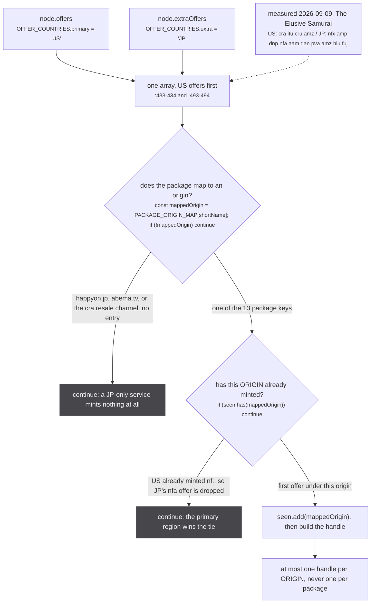
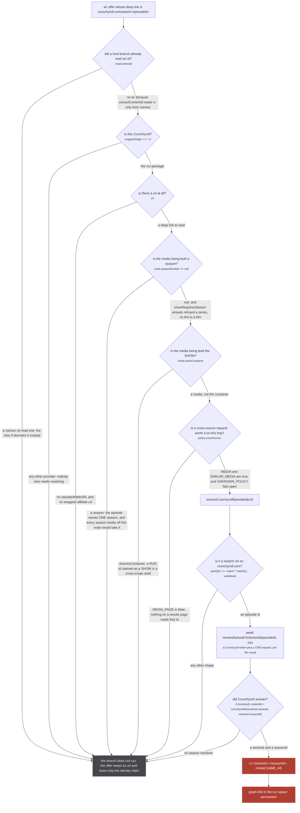
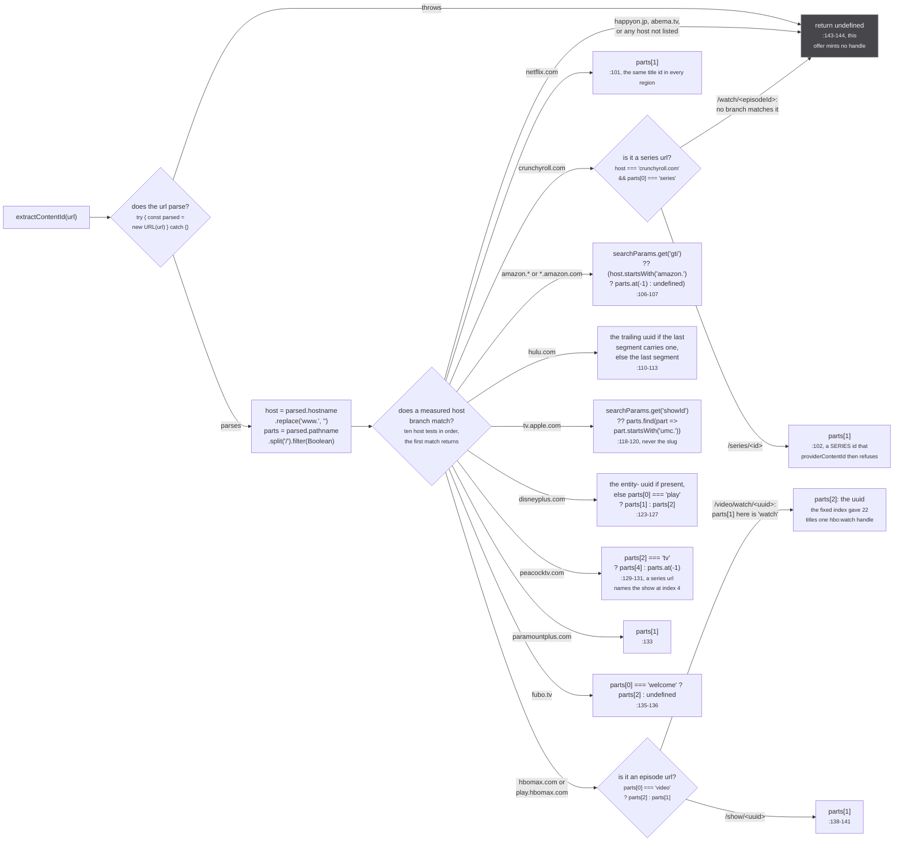
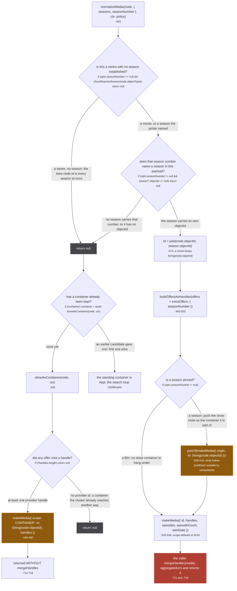

JustWatch is not a metadata catalogue. It knows almost nothing worth showing: a title, a poster, a
short description, a release year. `SCORE = 0.2` at `src/sources/justwatch/extractor.ts:12` is the
lowest score any source carries, shared with unogs, appletv and paramount, so it wins a field only
where nothing else described it. `isApiOnly = true` at `:21` keeps it off the source rows entirely.

What it has instead is the offers. For one show it will tell you that Netflix, Crunchyroll, Hulu and
Prime Video all carry it, and it will hand you the deep link to each. Every one of those links has
the provider's own id inside it. So this source's real output is not a media at all, it is a list of
handles naming other origins, and it is where most of the `PART_OF` in the store comes from.

That makes it the source with the most to lose. A handle is an identity claim, and a `SAME_AS` handle
becomes a union.

:::danger[Every SAME_AS handle on this page is permanent]
`sameAs(node)` at `src/sources/utils.ts:27` reaches the store as
`graph.link(mediaUri, handleUri, sameAsLabelFor(mediaScope))` at `src/worker/store/db.ts:193`, a
union-find union. There is no unlink and no inverse. The two media are one component for the rest of
the session, and the merged component goes on to weld a third.

Two of the measurements on this page are that failure, already paid for: `parts[1]` of an HBO series
url is the literal string `watch`, which gave 22 unrelated titles the identical `hbo:watch` handle
(`src/sources/justwatch/id.ts:91-93`), and a Crunchyroll `/series/` id read off a film gave four
Demon Slayer films and fifteen Dragon Ball Z films one id each (`id.ts:52-54`).

`partOf(node)` at `src/sources/utils.ts:40` is the other half of this page and is not permanent in
the same way: it writes a directed `graph.edge`, which is deletable, and it stamps the node
`scope: 'CONTAINER'` on the way out. That stamp is itself one-way in the store, so it is a ratchet
rather than a weld.
:::

The whole source is 797 lines of `src/sources/justwatch/extractor.ts` plus 144 lines of
`src/sources/justwatch/id.ts`, split apart so the id rules can be tested at all (`id.ts:1-2`: the
extractor imports the crunchyroll extractor and the source barrel, "which cannot be loaded outside a
browser").

## Two regions, because one is blind to Netflix

Both GraphQL documents ask for offers twice, under two country arguments. `SEARCH_QUERY:93-118` and
`NODE_QUERY:155-180` each carry an `offers(country: $country, ...)` block and an
`extraOffers: offers(country: $extraCountry, ...)` block with identical selections.

`src/sources/justwatch/extractor.ts:40`

```ts
const OFFER_COUNTRIES = { primary: COUNTRY, extra: 'JP' } as const
```

with `COUNTRY = 'US'` at `:26`. The reason is a measurement, not a preference.

`src/sources/justwatch/extractor.ts:29-39`

> A JustWatch offer is scoped to ONE country, so a single country is a single catalogue. Anime is
> licensed per region and the Japanese catalogue is the one that carries it: measured 2026-09-09,
> The Elusive Samurai is `cra itu cru amz` in US and `nfx amp dnp nfa aam dan pva amz hlu fuj` in JP,
> and Mushoku Tensei has no US Netflix offer at all while JP names `nf:80987039`. Asking US alone is
> therefore blind to Netflix for most of this catalogue.

Both callers concatenate the two lists in the same order, US first: `showAsContainer` at `:433-434`
and `normalizeMedia` at `:493-494` both pass
`[...node.offers ?? [], ...node.extraOffers ?? []]`. Order is the whole tie-break, because the
dedupe keeps the first offer it sees for an origin.



*JP only ever adds. Its offers are appended after the US ones and the `seen` set is already populated, so a service present in both regions is taken from US and the Japanese deep link is discarded unread.*

The dedupe key is the thing to get right, and the file explains why at length.

`src/sources/justwatch/extractor.ts:335-341`

> Keyed on the ORIGIN, not the package, because a package is a TIER and one service sells several:
> Netflix lists `nfx` beside `nfa`, Paramount+ splits into `ppp` and `ppe`. Within a single region
> every tier of a service links to the same url, so keying on the package only ever dropped a
> duplicate of the same uri. Across regions it does not: the primary region's `nfx` and the second's
> `nfa` are two different deep links carrying two different title ids, and minting both would hang
> two Netflix titles on one media. `graph.link` is a union with no inverse, so that weld would last
> the session.

Note that the older comment at `:35-36`, sitting on `OFFER_COUNTRIES`, still says
`buildOffersAsHandles` "dedupes by package shortName". It does not. The code at `:342` reads
`if (seen.has(mappedOrigin)) continue`, keyed on the mapped origin, and the comment at `:335-341`
above is the current account of it. **The code wins**: with a shortName key, `nfx` from US and `nfa`
from JP are two different keys and both would mint, which is the exact weld the second comment
describes.

### The package map

`src/sources/justwatch/id.ts:75-79`

```ts
export const PACKAGE_ORIGIN_MAP: Record<string, string> = {
  cru: 'cr', nfx: 'nf', nfa: 'nf', dnp: 'disney', amp: 'amazon', atp: 'appletv',
  hlu: 'hulu', mxx: 'hbo', pcp: 'peacock', pct: 'peacock',
  ppp: 'paramount', ppe: 'paramount', fuv: 'fubo'
}
```

**13 package keys onto 10 distinct origins**: `cr`, `nf`, `disney`, `amazon`, `appletv`, `hulu`,
`hbo`, `peacock`, `paramount`, `fubo`. Six of those ten (disney, amazon, hulu, peacock, hbo, fubo)
are sources that answer nothing on their own; they exist only so this map has an origin to mint into.
See [the registry](/sources/registry/).

Two of the keys were wrong for a while and the failure was silent:

`src/sources/justwatch/id.ts:67-70`

> `hbm` and `pmp` used to sit here and returned ZERO offers, because both services renamed: HBO Max is
> `mxx` and Paramount+ split into `ppp` and `ppe`. Offers on those two platforms were therefore
> dropped for every title, which is why the hbo and paramount sources saw nothing from JustWatch.
> Measured 2026-09-01 over 25 anime searches: mxx 15 offers, ppp 9, ppe 9, and nfa 38 against nfx's 40.

And one popular package is absent deliberately:

`src/sources/justwatch/id.ts:72-74`

> Resale channels are deliberately absent. "Crunchyroll Amazon Channel" (`cra`) outnumbers `cru`
> itself, but its url is watch.amazon.com, so its id belongs to Amazon; mapping it to `cr` would mint
> a Crunchyroll handle out of an Amazon id and assert an identity that no Crunchyroll call reproduces.

## `buildOffersAsHandles`, offer by offer

`src/sources/justwatch/extractor.ts:319-404`. One loop, four `continue`s, and exactly one place where
a `SAME_AS` is minted.

```mermaid
flowchart TD
  A["for (const offer of offers)<br/><small>:328, US offers then JP offers</small>"] --> D1
  D1{"is it a way to watch it on a subscription?<br/><small>!['FLATRATE','FLATRATE_AND_BUY','FREE','ADS'].includes(offer.monetizationType)</small>"}
  D1 -->|"RENT or BUY"| C["continue: this offer contributes nothing, the loop lives"]
  D1 -->|"flatrate, free or ad supported"| D2
  D2{"does the package map to an origin?<br/><small>const mappedOrigin = PACKAGE_ORIGIN_MAP[shortName]; if (!mappedOrigin) continue</small>"}
  D2 -->|"a resale channel or an unmapped regional service"| C
  D2 -->|"one of the 13 keys"| D3
  D3{"already minted for this origin?<br/><small>if (seen.has(mappedOrigin)) continue</small>"}
  D3 -->|"a second tier, or the same service in the second region"| C
  D3 -->|"first offer under this origin"| B["url = realUrl ?? offer.standardWebURL ?? undefined<br/>rawContentId = url ? extractContentId(url) : undefined"]
  B --> D4
  D4{"is this the Crunchyroll episode-url case?<br/><small>!rawContentId && mappedOrigin === 'cr' && url && meta.seasonNumber == null && !meta.showContainer && policy.crossSource</small>"}
  D4 -->|"all six conjuncts hold: see the next figure"| X["resolveEpisodeToSeriesId, then crunchyrollId(seriesId, seasonId)<br/><small>relation stays SAME_AS</small>"]
  D4 -->|"any conjunct fails"| D5
  D5{"did a host branch read an id off the url?<br/><small>else if (rawContentId)</small>"}
  D5 -->|"no id, and the cr branch did not run either"| D8
  D5 -->|"an id off the deep link"| D6
  D6{"may this provider keep the raw id?<br/><small>mappedOrigin === 'cr' ? undefined : rawContentId</small>"}
  D6 -->|"crunchyroll: refused outright, a /series/ id names every run of the show"| F["contentId = rawContentId, relation = 'PART_OF'"]
  D6 -->|"any other provider: the id is the provider's TITLE"| D7
  D7{"was this offer read on a pinned season?<br/><small>if (meta.seasonNumber != null) relation = 'PART_OF'</small>"}
  D7 -->|"a season media: the show-level id is its container"| D8
  D7 -->|"seasonNumber null, so a film: its own id is exact"| D8
  X --> D8
  F --> D8
  D8{"is there an id to mint?<br/><small>if (!contentId) continue</small>"}
  D8 -->|"nothing survived the branches"| C
  D8 -->|"an id, and a relation"| G["const node = makeMedia({ origin: mappedOrigin, id: contentId, url })"]
  G --> D9
  D9{"which relation did the branch leave?<br/><small>relation === 'PART_OF' ? partOf(node) : sameAs(node)</small>"}
  D9 -->|"SAME_AS: a film's own id, or the season a cr episode resolved to"| SA["sameAs(node)<br/><small>:400</small>"]
  D9 -->|"PART_OF: an id read off a SHOW"| PO["partOf(node): the node is copied scope 'CONTAINER'<br/><small>:400, sources/utils.ts:40</small>"]
  SA --> LINK["graph.link in the run space<br/><small>db.ts:193, a union with no inverse</small>"]
  PO --> EDGE["graph.edge MEDIA_PART_OF<br/><small>db.ts:187-190, directed and deletable</small>"]
  classDef irrev fill:#b03f33,stroke:#e0796f,color:#ffffff
  classDef ratchet fill:#8f5a0e,stroke:#f2b45c,color:#ffffff
  classDef view fill:#4572b5,stroke:#8db0de,color:#ffffff
  classDef refuse fill:#46464b,stroke:#8b8c93,color:#f2f2f4
  class C refuse
  class SA,LINK irrev
  class PO,EDGE ratchet
```



*Four different `continue`s reach the same node, and none of them throws: an offer that cannot be identified simply does not become a handle, and the other offers on the same title are unaffected.*

The default relation is `SAME_AS` and it is narrowed downward, never upward. `:349-351`:

> SAME_AS only for an id that names exactly this media: a film's own id, or the season a film's
> Crunchyroll episode resolves to. Everything read off a SHOW is PART_OF.

Which is `providerContentId`'s whole job, one line at `src/sources/justwatch/id.ts:59-60`:

```ts
export const providerContentId = (mappedOrigin: string, rawContentId: string): string | undefined =>
  mappedOrigin === 'cr' ? undefined : rawContentId
```

The line does nothing except refuse Crunchyroll. What it is protecting against is the season suffix
that used to be here, and that argument is the one to read before anyone adds one back:

`src/sources/justwatch/id.ts:40-47`

> The id is the provider's TITLE, whatever season the offer was read on. Until 2026-09-05 a season
> suffix wrote JUSTWATCH'S season number into the provider's id space (`nf:80123-2`,
> `appletv:<umc>-s2`), where unogs and the appletv source mint the same shapes with the PROVIDER'S
> numbering, and the two numberings do not agree: Netflix folds two anime cours into one season, so
> its season 2 and JustWatch's season 2 name different runs under one uri, and `graph.link` has no
> inverse. A show-level offer is therefore a container (`buildOffersAsHandles` hangs the run under it
> as PART_OF), and the precise run comes from `similarMedia`, asked of the provider's own source on
> the run's page with evidence about the run. A film's bare id is exact and stays an identity.

`src/sources/justwatch/id.ts:49-54`

> Crunchyroll is refused OUTRIGHT. `extractContentId` reads a crunchyroll id from one url shape only,
> `/series/<id>`, so every id that reaches here is a SERIES id: it names a container that holds every
> run of the show and, on Crunchyroll, the show's FILMS too, since a film belonging to a running
> series is published under the series. The extractor demotes that id to PART_OF itself; a film whose
> offer was a /series/ url used to take the bare container id, the same weld measured on kitsu
> 2026-09-04, where four Demon Slayer films and fifteen Dragon Ball Z films each shared one /series/ id.

The demotion at `:386-391` is the difference between the two eras. `providerContentId` returning
`undefined` used to mean the offer was dropped. Now the extractor catches the `undefined`, puts the
raw series id back, and marks it `PART_OF`, so the link survives on the page without the claim.
[Season-scoped ids](/sources/season-ids/) sets that one line beside the other three id shapes in the
codebase and asks which of them a second observer could reproduce.

`src/sources/justwatch/extractor.ts:397-398`

> `partOf` is also the CONTAINER stamp, which is what keeps a show-level id out of every run's
> identity space. A film's own id, or the season its episode resolved to, stays a RUN.

## The one cross-source call

The condition at `src/sources/justwatch/extractor.ts:372` is a **six-term conjunction**, and each
term has its own reason written above it at `:354-371`. This is the only place in the source where
answering the question costs a request to a different source.



*Eight ways to not make the call and one way to make it. The refusal is always the same shape: the offer keeps its url, so the deep link still renders, and only the identity claim is lost.*

Both the page inventory and the subsystem report describe this as a five-gate branch. The code at
`:372` has six conjuncts. **The code wins**, and the sixth is `url`, which reads as a null check and
is not: with no url there is nothing for `extractCrunchyrollEpisodeId` to parse.

The three conjuncts worth reading in full, from `:354-371`:

> A Crunchyroll offer is a /watch/<episodeId> url, so the id has to come back through Crunchyroll
> itself. That answers with the season THAT episode is in, which is one specific season of the show,
> and JustWatch has no season-level node: this offer belongs to the SHOW and every season media built
> from the node is handed the same one. So a pinned season would take an id nothing established was
> its own, and two runs of one show would take the SAME id and weld.
>
> A movie is the case that stays, and it is the only one: `showRequiresSeason` has already refused a
> series with no season by the time this runs, so a null seasonNumber here means a film, whose
> episode resolves to its own season and identifies it.

> THE ONE CROSS-SOURCE CALL ON THIS PATH, and the reason the request context exists. Turning a
> /watch/<episodeId> url into a series id costs a Crunchyroll token plus a CMS request, PER FILM
> RESULT, and `mediaPage` runs this for every hit in a search. Nothing on a results page reads that
> id: it identifies the run, which is a detail-view question. So on a listing the offer keeps its url
> and loses only the identity claim, and the detail view spends the request as before.

> `meta.showContainer` excludes this branch deliberately. It resolves a /watch/ url to the SEASON
> that episode is in, which is a RUN, and the media being built here is the SHOW: claiming the two
> are the same is a cross-scope weld, and `graph.link` has no inverse. The offer is dropped rather
> than demoted because crunchyroll already reaches this cluster under its own series container.

`policy` arrives from `policyFor(input)`, read at `:766` on `mediaPage` and `:593` on `similarMedia`,
and defaults to `UNKNOWN_POLICY` (`{ crossSource: true }`, `src/worker/request-context.ts:74`) for a
hop that arrived with no context. See [the request context](/request/request-context/) for why it
fails open and what counts the misses.

## `extractContentId`, host by host

`src/sources/justwatch/id.ts:95-144`. Ten host branches, one for each of the ten origins the package
map produces, and each of them is a measurement rather than a guess.

`src/sources/justwatch/id.ts:84-93`

> Every branch here is measured against a real offer url rather than assumed, because a provider that
> restyles its site does not break this loudly: the id simply changes shape, and the handle minted
> from it either clusters nothing or, worse, is a path segment shared by every title on that service.
>
> Measured 2026-09-01 across 50 searches. Four of the nine mapped services had moved: Prime Video to
> watch.amazon.com with the id in a query param, Disney+ to /browse/entity-&lt;uuid&gt;, fubo to
> /welcome/series/&lt;id&gt;, and HBO Max to /video/watch/&lt;uuid&gt; for a series. That last one is
> the reason for the shape tests rather than a fixed index: `parts[1]` of an HBO series url is the
> literal string "watch", which handed 22 unrelated titles the identical `hbo:watch` handle. A handle
> is a union with no inverse, so that is 22 shows merged into one cluster, permanently, for the
> session.



*Six of the ten branches test the url's SHAPE rather than indexing a fixed position, and every one of those six is a provider that moved its urls at least once. An unknown host returns `undefined` and the offer mints nothing, which is the safe direction: the loud failure is a wrong id, not a missing one.*

Two per-branch notes carry their own measurement. Apple, `id.ts:115-117`:

> tv.apple.com names a title twice, as a human slug and as a umc.cmc id, and only the umc id is what
> the appletv source itself mints. An episode url carries its SHOW's umc id in `showId`, which is the
> one worth having. The slug is never used: episode slugs repeat across shows.

Amazon, `id.ts:104-105`:

> Prime Video offers now land on watch.amazon.com/detail?gti=&lt;id&gt;, where the id is not in the
> path at all. Falling back to the last path segment there would return the literal "detail".

Note the count. The doc comment at `id.ts:88` says "the nine mapped services", and both the page
inventory and the subsystem report repeat nine. **The code wins**: `PACKAGE_ORIGIN_MAP` at `:75-79`
holds 13 package keys onto **10** distinct origins, and `extractContentId` carries a branch for all
ten hosts. The comment is one short of the table it describes.

There is one more url step before any of this runs. JustWatch wraps some offers in an affiliate
redirect, and `extractRealUrl` at `extractor.ts:42-48` unwraps it
(`url.searchParams.get('u') ?? url.searchParams.get('r') ?? undefined`), with
`url = realUrl ?? offer.standardWebURL ?? undefined` at `:346`. Reading the id out of an unwrapped
affiliate url would give every offer on that network the same path.

## `normalizeMedia` refuses, `showAsContainer` catches

This is the shape of the whole source. JustWatch has no season-level node, so the bare node id is
every season of the show at once, and a media built on it welds them.

`src/sources/justwatch/id.ts:4-11`

> JustWatch has no season-level node. 'ts222366' is Mushoku Tensei entire, seasons 1 through 3
> hanging off one id, and its provider deep links are show-level too (a hulu.com/series/&lt;uuid&gt;
> url names the show). Stub has no notion of a show - every media here is ONE season - so a show-level
> id lands on all of them and union-finds them into a single media. That was visible three ways:
> picking season 2 out of search opened season 3, an aggregated uri carried two anilist ids and two
> mal ids at once, and two unrelated shows merged once a shared handle bridged their clusters.
>
> So the rule is absolute: a series media is `<node>-<season>`, never the bare node id.

The id is `jwId(objectId, seasonObjectId)` at `id.ts:20`, and the suffix is deliberately not an
ordinal:

`src/sources/justwatch/id.ts:13-17`

> The suffix is the SEASON'S OWN objectId, not its ordinal. JustWatch gives every season one
> (Mushoku Tensei is 222366 with seasons 230388, 378206, 490814), so this is a real id in their space
> rather than a position in a list - it does not move when a season is renumbered, split into cours,
> or has a recap inserted ahead of it, all of which happen and all of which would otherwise silently
> repoint an existing uri at different episodes.

So `normalizeMedia` refuses rather than guessing, and the refusal is frequent, because JustWatch
folds anime cours the same way Netflix does. `showAsContainer` is what stops that refusal costing the
offers as well.



*The two paths differ in one call. A season media is `mergeHandles`d, which mints a `SAME_AS` for every sibling origin in the asking uri. A container is not, and that omission is the whole point of it.*

The lower half of that figure belongs to `searchAndLinkMedia`, not to `normalizeMedia`. It is the
only caller with the container fallback: `resolveMedia` at `:736-737` reads the same `null` and
returns `null`, because a uri that already carries a `jw:` id has no search to fall back through.

`src/sources/justwatch/extractor.ts:409-414`

> JustWatch FOLDS anime cours exactly as Netflix does, so a run that is one cour matches none of its
> seasons and `normalizeMedia` refuses the whole node. Measured 2026-09-10 on Mushoku Tensei:
> JustWatch publishes seasons of 23, 24 and 14 against our cours of 11/12/12/12/14, the title and
> date gates both pass, and `pickSimilarSeason` then returns undefined. Only the cour whose length
> happens to equal a JustWatch season (season 3, 14 against 14) survived, which is why Netflix
> appeared on the last season of the show and on none of the others.

`src/sources/justwatch/extractor.ts:416-419`

> Refusing the SEASON is still right: the bare node id is shared by every season and asserting it as a
> run's identity is what welded Mushoku's seasons together before. What was wrong is throwing the whole
> node away with it, because the OFFERS hang off the show rather than off any season, and they are what
> carries `nf:<title id>`. So the show comes back as a container instead.

:::caution[The container must never be mergeHandles'd]
`mergeHandles(media, aggregatedUri)` at `src/sources/utils.ts:480` calls `buildHandlesFromUri`, which
mints one `sameAs(makeMedia({ origin, id }))` per sibling origin named in the uri
(`src/sources/utils.ts:465-479`). Doing that to a show container asserts that the show IS every run
in the asking cluster.

`src/sources/justwatch/extractor.ts:421-426`

> NOTHING HERE CLAIMS TO BE THE RUN. The caller must not `mergeHandles` this media: that mints a
> `sameAs` for every origin in the asking uri, which is precisely the weld above. The container
> reaches the run through the container space instead, where `fuzzy-merge` unions it with the
> crunchyroll and tvmaze containers the cluster already hangs under, and `findPartOfMedia` expands a
> PART_OF target to its whole SAME_AS component. A provider id read off a show is a container too, so
> `sameAs` between this node and `nf:<id>` is a claim about two SHOWS and unions in the container
> space.

The call sites hold that line: `:711` merges the season media, `:718` does not merge the container,
and `:738` merges only on the aggregated-uri path where a season was established.
:::

`showAsContainer` has one refusal of its own, at `:444-446`:

> a container carrying no provider id is noise: it names a show the cluster already reaches through
> its other containers and adds nothing a reader could act on

And `normalizeMedia`'s self-container push at `:504-508` is what makes the source reachable at all
from the other direction:

> The show node itself, as the CONTAINER every season of it is part of. The worker asks `similarMedia`
> of container origins only, so this is what makes JustWatch askable, and it lets the container space
> union `jw:<objectId>` with `cr:<series>` and `tvmaze:<show>` on a title, so a run PART_OF any one of
> them reaches JustWatch's offers.

That is literal: `planSimilarAsks` at `src/worker/similar-consumer.ts:143-155` iterates the run's
containers and asks one question per container origin, passing `showId: container.id`. Without the
handle pushed at `:509-518`, no `jw:` container hangs off the run and JustWatch is never asked.

## Everything else, in one table

The five diagrams above cover the offer path and the id rules. The rest of the file is entry points
into them.

| entry point | line | what it does |
| --- | --- | --- |
| `Subscription.media` | `:755-760` | `if (!_uri \|\| !(isUri(_uri) \|\| isAggregatedUri(_uri))) return yield { media: null }`, else `resolveMedia` |
| `resolveMedia` | `:724-744` | three ways: a `jw:` in the uri to `splitJwId` and `normalizeMedia`; not aggregated to `null`; else `searchAndLinkMedia` |
| `resolveSeasonNumber` | `:568-579` | the aggregated-uri path, through `waitForMedia` and `pickSimilarSeason`, re-asked as evidence lands |
| `similarSeason` | `:586-595` | the `similarMedia` implementation. Asks node `` `ts${input.showId}` ``, picks a season, refuses a film outright |
| `searchAndLinkMedia` | `:636-722` | the search gate. Covered on [the search gate](/sources/search-gate/) |
| `datedLikeThisMedia` | `:611-615` | the date axis, read at SEASON level only |
| `Subscription.mediaPage` | `:761-774` | search results, and only films survive |
| `Media.episodes` | `:776-796` | refetches the node and filters on `ep.content.isReleased` |

Two of those deserve a sentence each.

**`resolveSeasonNumber` guesses at nothing.** `:564-567`:

> The lone-season shortcut, the bare title ordinal and the unique count that used to sit here were
> each a guess minting a precise uri; a lone season now passes the picker like any other, and a
> cluster the picker refuses gets no season, which `normalizeMedia` turns into no media.

**`jwCandidates` at `:310-317` hands the picker a year and never a date**, which decides which of
`pickSimilarSeason`'s rules can fire at all. `:303-308`:

> A year is all JustWatch knows about a date, so the picker's date rule never applies here and its
> year rule plus the year veto carry that axis, the one ../catalogue-gate.ts calibrated for this
> source. A `totalEpisodeCount` of 0 is a season JustWatch has not listed yet, offered as no count
> rather than as a season shorter than every run.

That year is templated into a start date at `:535` as `` `${seasonYear}-01-01` ``, which is why
`namesADay` (`src/sources/season.ts:223`) exists and why a JustWatch date is a veto rather than a
match downstream.

## Where the code disagrees with its comments

Three, all found by reading the file rather than the reports. Each is a comment that has drifted, not
a bug: in every case the code is right and the sentence around it is stale.

| claim | where | what the code does |
| --- | --- | --- |
| "`buildOffersAsHandles` dedupes by package shortName" | `extractor.ts:35-36` | `:342` keys `seen` on `mappedOrigin`. With a shortName key, US `nfx` and JP `nfa` would both mint and hang two Netflix titles on one media, which `:335-341` describes correctly. |
| "the nine mapped services" | `id.ts:88` | `PACKAGE_ORIGIN_MAP` at `:75-79` is 13 package keys onto **10** origins, and `extractContentId` carries a branch for all ten hosts. |
| "the search query does not fetch seasons" | `extractor.ts:768` | `SEARCH_QUERY:119-128` does ask for them, and the type comment at `:264` says so. What actually happens is `mediaPage` calling `normalizeMedia(e.node, {}, ctx, policy)` at `:770` with an EMPTY opts, so no seasons and no `seasonNumber` ever reach it and `:470` refuses every series. The stated outcome, only movies coming through, is correct; the stated reason is not. |

See [known divergences](/reference/divergences/) for the rest of the site's.
