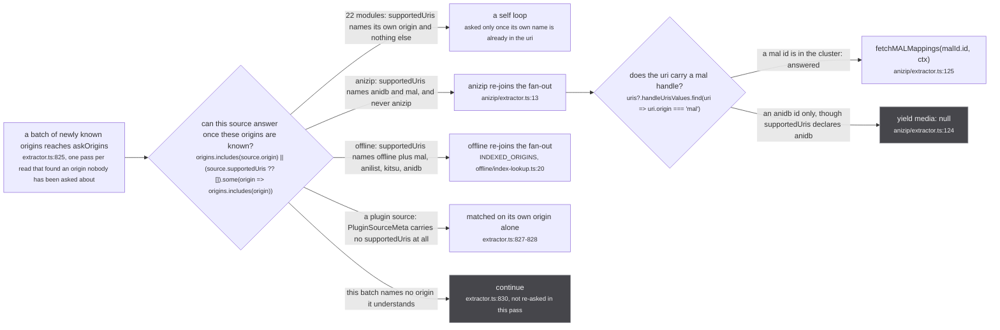
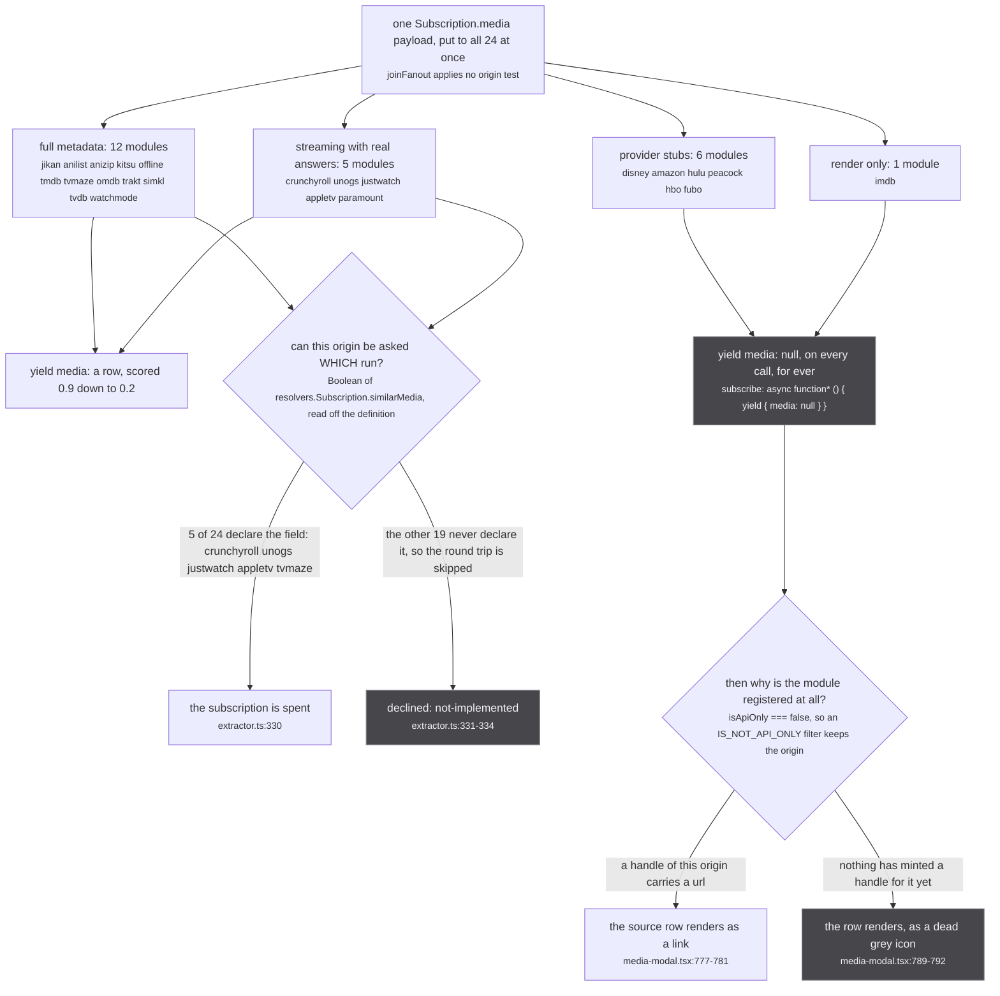
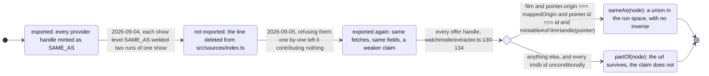

There are **24** built-in source modules. `src/sources/index.ts` is the whole registry and every line
in it is `export * as <name> from './<dir>/extractor'`, so a source module is an ES module namespace
object and nothing more. `src/worker/extractor.ts:551` turns the barrel into the live list:

```ts
export const extractors = Object.values(extractorDefinitions).map(makeExtractor)
```

Which means the export line **is** the on switch, and the test file says so before it asserts anything:

`tests/unit/sources/index.test.ts:1-3`

> `worker/extractor.ts` builds the live source list as `Object.values(extractorDefinitions)`, so what
> this module exports IS what runs. A source is disabled by not being exported here, which is a
> deletion of one line and therefore silently undone by anyone adding one back.

The count is pinned by name and by length at `tests/unit/sources/index.test.ts:19-24`, ending in
`expect(names).toHaveLength(24)`. If you have seen the figure 36 anywhere, that is JustWatch's
provider mapping table, not this: `PACKAGE_ORIGIN_MAP` (`src/sources/justwatch/id.ts:75-79`) has 13
package keys pointing at 9 origins, and none of those 13 is a source module.

One trap before the tables. **The module name is not the origin.** Four of the 24 publish under a
prefix that is not what the export is called: `jikan` publishes `mal:`, `crunchyroll` publishes `cr:`,
`unogs` publishes `nf:`, `justwatch` publishes `jw:`. Grepping for `nf:` finds the Netflix source;
grepping for `netflix` finds nothing.

## Who can be asked with whose ids

Every source declares two sets, and conflating them is the whole subject of this figure.



*Twenty-two of the twenty-four are self loops, and the sparseness is the point: the cross-lines are two modules wide.*

The test is `answersForOrigins` at `src/sources/supported.ts:27-29`, called from `askOrigins` at
`src/worker/extractor.ts:830`. Its comment is the reason the function exists at all:

`src/sources/supported.ts:15-26`

> Whether a source can answer once these origins are known.
>
> TWO SETS, and conflating them is a whole class of source that never answers. A source publishes
> under one origin and is addressable by others: anizip mints `anizip:` uris but answers from an
> anidb or a mal id, so its own name cannot appear in a cluster until it has already answered. Asked
> only when its own origin shows up, it is never asked at all, and its data appeared only on a reload
> where the address already carried the mal id (measured 2026-09-09 on `ag:(anilist:166873)`, which
> settled without anizip and gained it on a second load).
>
> `supportedUris` is declared by every source in this directory and was read by nothing until this.

`supportedUris` is not on `ExtractorDefinition` (`src/worker/extractor.ts:164-173`). It is read
through a structural cast, `const definition = extractor.extractor as Answerable` at
`src/worker/extractor.ts:829`, which works because `makeExtractor` receives the entire namespace
object and not a typed subset.

### The anizip half-declaration

Watch the right-hand branch of the figure. anizip declares `supportedUris = ['anidb', 'mal']`
(`src/sources/anizip/extractor.ts:13`) but its resolver reads exactly one of the two
(`src/sources/anizip/extractor.ts:116-127`):

```ts
subscribe: async function*(_, { input: { uri } }, ctx: ExtractorServerContext) {
  if (!uri || !isAggregatedUri(uri)) return yield { media: null }
  const uris = fromAggregatedUri(uri)
  const malId = uris?.handleUrisValues.find(uri => uri.origin === 'mal')
  if (!malId) return yield { media: null }
  yield { media: await fetchMALMappings(malId.id, ctx) }
}
```

A cluster that gains an `anidb:` id and no `mal:` id therefore costs a re-ask and a subscription that
refuses on its second statement. It is cheap and it is silent, which is the only reason it has
survived: nothing downstream can tell that refusal apart from "this source knows nothing".

### The offline comment that time made wrong

`src/sources/offline/extractor.ts:45-47` says of its own `supportedUris`:

> Answers about other catalogues' uris, not only its own, which is the anizip pattern. Note this
> export is declarative only: nothing in the worker reads it, so what actually decides is the
> resolver below.

The second sentence is no longer true, and the code is the authority: `answersForOrigins` reads it
through the cast above, so those four extra origins are exactly what gets offline re-asked. The first
sentence and the resolver behaviour are both still correct, and `offline`'s `getMedia`
(`src/sources/offline/extractor.ts:197-215`) really does accept a foreign uri.

## Who answers what

Four bands, and the split is not by category or by quality. It is by what a `Subscription.media`
payload can contain at all.



*Seven of the twenty-four can never yield a media row, and all seven are registered on purpose.*

The `similarMedia` test in the middle of that figure is at `src/worker/extractor.ts:292-295`. The
figure drops its type cast for width; the line reads:

```ts
export const implementsSimilarMedia = (origin: string): boolean =>
  extractors.some(entry =>
    entry.extractor.origin === origin
    && Boolean((entry.extractor.resolvers.Subscription as { similarMedia?: unknown } | undefined)?.similarMedia))
```

`src/worker/extractor.ts:287-291`

> Whether a source answers `similarMedia` at all. Read off the DEFINITION's resolvers, never the
> merged schema, so the yield-null default in `makeExtractor` counts as "not implemented" and a
> caller can skip the subscription round trip that would only ever answer null.

That reading is safe **only** because none of the seven inert modules declares `similarMedia`. Note
what they do declare: disney, amazon, hulu, peacock, hbo, fubo and imdb each override
`Subscription.media` with a byte-for-byte copy of the default rather than letting it fall through
(`src/sources/disney/extractor.ts:16-24` is that file's whole resolver block). So a hypothetical
`implementsMedia` written the same way would answer `true` for all seven. The test that works for one
field is not the test that works for the other.

### The six provider stubs

They answer nothing and they are not placeholders for a source somebody meant to finish. They exist
so JustWatch has an origin to mint a handle into.

`src/sources/hulu/extractor.ts:3`

> Hulu - no anonymous API. For now: metadata/episodes via TMDB, deep link via JustWatch.

`PACKAGE_ORIGIN_MAP` at `src/sources/justwatch/id.ts:75-79` is the mapping that needs them:

```ts
export const PACKAGE_ORIGIN_MAP: Record<string, string> = {
  cru: 'cr', nfx: 'nf', nfa: 'nf', dnp: 'disney', amp: 'amazon', atp: 'appletv',
  hlu: 'hulu', mxx: 'hbo', pcp: 'peacock', pct: 'peacock',
  ppp: 'paramount', ppe: 'paramount', fuv: 'fubo'
}
```

Six of those nine origins (`disney`, `amazon`, `hulu`, `hbo`, `peacock`, `fubo`) have no source that
can fetch anything. Without a registered module there would be no `name`, no `icon` and therefore no
row, and the deep link JustWatch found would be carried the whole way and dropped one line short of
the screen.

### imdb, which will never answer

`src/sources/imdb/extractor.ts:3-15`

> IMDb, and it deliberately answers NOTHING.
>
> It exists so that an `imdb:tt...` handle has an ORIGIN to be rendered against. Five sources mint one
> (jikan, omdb, simkl, trakt, watchmode) and the handle reaches the client correctly, but the UI builds
> its source rows from `originPage`, which lists registered origins. With no origin declaring
> `origin = 'imdb'` there was no name, no icon and no row, so the link was carried the whole way and
> dropped one line short of the screen.
>
> It will never resolve a media, and that is not a gap to be filled later. An IMDb `tt` id names the
> SHOW and IMDb models no seasons, so there is no season-level id to ask it about: `worker/store/db.ts`
> keeps imdb in `SHOW_LEVEL_ORIGINS` for exactly that reason and demotes every imdb handle to PART_OF.
> A resolver here would have to answer a show-level id with something, and everything it could answer
> is the defect that Set exists to prevent.

That is the argument, and it holds. The parenthetical does not: **jikan mints no imdb handle**. Its
only two handles are `anidb` and `anizip`, both `sameAs`, at `src/sources/jikan/extractor.ts:146-149`.
The sources that actually mint an `imdb:` handle are six, not five: `omdb` (`:53`), `simkl` (`:123`),
`trakt` (`:82`), `watchmode` (`:155`), `tvmaze` (`:63`) and `tvdb`, through its `HANDLE_ORIGINS` map
at `src/sources/tvdb/extractor.ts:25`.

The row-rendering branch the figure ends on is `src/router/home/media-modal.tsx:767-775`, and it is
the reason a `PART_OF` handle is enough:

> BOTH RELATIONS, deliberately, and this row is the whole point of the refactor. It wants a url and an
> origin and nothing else: no sameness is assumed and nothing is merged across it. A PART_OF handle is
> exactly as good here as a SAME_AS one, which is why IMDb can finally render as a link rather than
> the dead grey icon in the branch below.
> SAME_AS FIRST, then anything. `handles` is ordered by score, which says nothing about relation, so a
> plain `find` could hand the Crunchyroll icon a PART_OF `cr:<seriesId>` while the SAME_AS
> `cr:<seriesId>-<seasonId>` for this very cour sat later in the list.

Two filters gate that row, and only one of them is reachable. `isApiOnly` is applied worker-side in
`findOrigins` (`src/worker/store/db.ts:539-542`):

```ts
if (filters?.length) {
  result = result.filter(o =>
    filters.every(f => f === 'IS_API_ONLY' ? o.isApiOnly : !o.isApiOnly)
  )
}
```

All three `originPage` consumers pass `OriginFilter.IsNotApiOnly`
(`src/router/home/media-modal.tsx:484` and `:644`, `src/router/watch/index.tsx:221`), so a source with
`isApiOnly = true` never reaches the client at all and the `if (!origin.icon) return undefined` guard
at `src/router/home/media-modal.tsx:781` never sees it. `src/sources/offline/extractor.ts:23-28` spells
this out and warns against reading it backwards:

> But know what actually keeps this out of the UI, because it is NOT the missing icon.
> `media-modal.tsx:662` really does render the origin row as `if (!origin.icon) return undefined`,
> and that check is real, but it is unreachable from here: `isApiOnly` below is true, and all three
> `originPage` consumers pass `OriginFilter.IsNotApiOnly`, which `db.ts:144-146` resolves to keeping
> only `!isApiOnly`. Kitsu is `isApiOnly = true` too, so it is absent from that row as well. So the
> icon is dead weight rather than a hazard, and nobody should later treat its absence as the guard.

The reasoning is exactly right and both line references have drifted: the icon guard is at
`media-modal.tsx:781` today, and the filter resolves at `db.ts:539-542`, not `db.ts:144-146`.

## Watchmode's demotion

Watchmode is the one source whose registry line carries a history, because it was removed and put
back within a day.



*The middle state lasted three commits, and nothing about what watchmode knows changed across any of these transitions.*

`src/sources/index.ts:26-32`

> Watchmode was DISABLED on 2026-09-04 and is back on 2026-09-05, unchanged in what it knows and
> changed in what it claims. Every provider handle it mints is show level, because its record is a
> show and it has no season concept anywhere in the file. As SAME_AS each of those welded two runs
> together, and refusing them individually left it contributing nothing, so it was unplugged.
>
> It now mints them PART_OF: the url survives, the claim does not. That is what this source was always
> for. See `MediaHandleRelation` in worker/resolvers/media/schema.gql.

The choice node in the figure is `src/sources/watchmode/extractor.ts:130-134`, verbatim:

```ts
if (!id) return undefined
const node = makeMedia({ origin: mappedOrigin, id, url: webUrl })
const pointer = streamPointers([webUrl])[0]
if (film && pointer?.origin === mappedOrigin && pointer.id === id && mintableAsFilmHandle(pointer)) return sameAs(node)
return partOf(node)
```

The `imdb` handle does not even reach that branch. It is minted `partOf` outright at
`src/sources/watchmode/extractor.ts:155`, and `:148-150` says why the demotion is made here rather
than left to the store:

> `imdb` stays, as PART_OF: a `tt` id names the show and there is no season-level equivalent, which is
> the whole reason `SHOW_LEVEL_ORIGINS` exists. Saying so here rather than relying on that Set to
> demote it means the claim is honest at the point it is made.

:::danger[A SAME_AS handle is not reversible]
Every `sameAs` handle becomes `graph.link(mediaUri, handleUri, sameAsLabelFor(mediaScope))` in
`upsertMedia` (`src/worker/store/db.ts:193`), and `graph.link` is a union-find union, as
`src/worker/store/db.ts:12` puts it: *`graph.link` is a union-find with no inverse*. Two media welded by a
wrong handle stay welded for the whole session, and no later, better-informed answer can split them.
That asymmetry is the entire reason watchmode was unplugged rather than left to be corrected later,
and the entire reason it came back as `partOf`. A missing link costs a row; a wrong one costs the
cluster.
:::

## The 24: identity

`SCORE` is the module-private constant every source threads into `makeMedia`/`makeEpisode`, not an
export. `store/aggregate.ts` sorts by it descending and the top source takes the field outright.

| module | origin | name | isApiOnly | SCORE | needs a key |
| --- | --- | --- | --- | --- | --- |
| jikan | `mal` | MyAnimeList | false | 0.9 | no |
| anilist | `anilist` | Anilist | false | 0.8 | no |
| anizip | `anizip` | AniZip | true | 0.9 (per field only) | no |
| crunchyroll | `cr` | Crunchyroll | false | 0.5 | no |
| unogs | `nf` | Netflix | false | 0.2 | no |
| justwatch | `jw` | JustWatch | true | 0.2 | no |
| appletv | `appletv` | Apple TV+ | false | 0.2 | no |
| paramount | `paramount` | Paramount+ | false | 0.2 | no |
| disney | `disney` | Disney+ | false | none | no |
| amazon | `amazon` | Prime Video | false | none | no |
| hulu | `hulu` | Hulu | false | none | no |
| peacock | `peacock` | Peacock | false | none | no |
| hbo | `hbo` | Max | false | none | no |
| fubo | `fubo` | Fubo | false | none | no |
| tmdb | `tmdb` | TMDB | true | 0.3 | no |
| tvmaze | `tvmaze` | TVmaze | true | 0.3 | no |
| kitsu | `kitsu` | Kitsu | true | 0.3 | no |
| omdb | `omdb` | OMDb | true | 0.3 | **yes** |
| trakt | `trakt` | Trakt | true | 0.3 | **yes** |
| simkl | `simkl` | Simkl | true | 0.3 | **yes** |
| tvdb | `tvdb` | TheTVDB | true | 0.3 | **yes** |
| offline | `offline` | Offline database | true | 0.2 | no |
| watchmode | `watchmode` | Watchmode | true | 0.25 | **yes** |
| imdb | `imdb` | IMDb | false | none | no |

Two entries in that table are worth reading twice.

**anizip has a `SCORE = 0.9` and does not put it on the media row.** Its `makeMedia` call
(`src/sources/anizip/extractor.ts:34`) carries no `score` field at all, while every title, cover,
banner and episode it mints is stamped `SCORE`. So it wins fields at the top of the scale and the row
itself sits at the bottom.

**offline's score is 0.2**, at `src/sources/offline/normalize.ts:31`, applied at `:164` and again in
`seedMedia` at `src/sources/offline/seed-source.ts:203`. That tie is deliberate:

`src/sources/offline/seed-source.ts:188-191`

> `status`, `startDate`, `endDate` and `popularity` are absent for the reason ./normalize.ts withholds
> them from the bundle, plus one this half adds: several live sources score exactly this SCORE,
> `aggregateMedia` breaks a tie by arrival order, and the seed exists to arrive first.

The five key-gated sources come from `src/sources/key-configs.ts:11-47`, and
`tests/unit/sources/index.test.ts:28-32` pins the pairing in the direction that matters: a key prompt
for a source that does not run asks someone to sign up for nothing.

## The 24: what each answers

`M` is a real implementation. `null` means the field is declared and always yields
`{ media: null }` or `{ nodes: [] }`. `-` means the module does not declare the field and falls to
the merged default in `src/worker/extractor.ts:448-464`.

| module | `supportedUris` | categories | `Sub.media` | `Sub.mediaPage` | `Sub.similarMedia` | `Media.episodes` |
| --- | --- | --- | --- | --- | --- | --- |
| jikan | `mal` | ANIME, SERIES, MOVIE | M | M | - | - |
| anilist | `anilist` | ANIME, SERIES, MOVIE | M | M | - | - |
| anizip | `anidb`, `mal` | ANIME, SERIES | M | - | - | - |
| crunchyroll | `cr` | ANIME, SERIES | M | M | **M** | M |
| unogs | `nf` | SERIES, MOVIE | M | M | **M** | M |
| justwatch | `jw` | SERIES, MOVIE | M | M | **M** | M |
| appletv | `appletv` | SERIES, MOVIE | M | M | **M** | M |
| paramount | `paramount` | SERIES | M | null | - | M |
| disney | `disney` | SERIES, MOVIE | null | null | - | - |
| amazon | `amazon` | SERIES, MOVIE | null | null | - | - |
| hulu | `hulu` | SERIES, MOVIE | null | null | - | - |
| peacock | `peacock` | SERIES, MOVIE | null | null | - | - |
| hbo | `hbo` | SERIES, MOVIE | null | null | - | - |
| fubo | `fubo` | SERIES, MOVIE | null | null | - | - |
| tmdb | `tmdb` | SERIES | M | M | - | M |
| tvmaze | `tvmaze` | SERIES | M | M | **M** | M |
| kitsu | `kitsu` | ANIME, SERIES, MOVIE | M | M | - | M |
| omdb | `omdb` | SERIES, MOVIE | M | M | - | M |
| trakt | `trakt` | SERIES | M | M | - | M |
| simkl | `simkl` | ANIME, SERIES, MOVIE | M | M | - | M |
| tvdb | `tvdb` | SERIES | M | M | - | M |
| offline | `offline`, `mal`, `anilist`, `kitsu`, `anidb` | ANIME, SERIES, MOVIE | M | M | - | - |
| watchmode | `watchmode` | SERIES, MOVIE | M | M | - | M |
| imdb | `imdb` | SERIES, MOVIE | null | null | - | - |

Totals, counted off the tree: **5** sources implement `Subscription.similarMedia`, **13** implement
`Media.episodes`, **17** can yield a non-null media, and **1** (anizip) declines to declare
`mediaPage` at all and takes the default.

## Three exports on every module that decide nothing

They are all declared 24 times and they look like configuration. Two of them are read by nothing.

| export | who reads it | what it decides |
| --- | --- | --- |
| `official` | nothing in `src/` | nothing. `true` on jikan, anilist and crunchyroll; `false` on the other 21 |
| `metadataOnly` | nothing effective | nothing. `false` on crunchyroll only; `true` on the other 23 |
| `categories` (module level) | nothing | nothing. Every source restates its categories per row inside `makeMedia({ categories: [...] })`, and that per-row list is what `store/filter.ts:65` and `store/aggregate.ts` read |

`src/sources/offline/extractor.ts:30-31` is the measured account of the middle row:

> `metadataOnly` gates nothing at all, for anybody: `normalizeOrigin` drops it, it is not in the
> GraphQL schema, and the one value read of it feeds a field nothing consumes.

`normalizeOrigin` (`src/worker/extractor.ts:72-79`) copies exactly six fields, `id`, `url`, `name`,
`icon`, `color` and `isApiOnly`, and `metadataOnly` is not among them. `src/sources/imdb/extractor.ts:17`
says the opposite:

> `metadataOnly` keeps it out of the playback paths; `isApiOnly` false is what lets `originPage`'s
> IsNotApiOnly filter return it, which is the whole point of the file.

The second half of that sentence is correct and the first half is not. Nothing reads `metadataOnly`
outside the plugin ingest path (`src/worker/plugin-sources.ts:77`), where it is normalised onto
`PluginSourceMeta` and then consumed by nobody. What actually keeps imdb out of the playback path is
that `src/sources/players.ts` maps only two origins, `cr` and `nf`.

## Where this page disagrees with what is written about the code

Everything below was read off the tree at `883aec9`. Where a comment and the code disagree, the code
wins and the comment is quoted anyway, because the reasoning in it is usually still right.

| claim | where it says so | what the code does |
| --- | --- | --- |
| "36 sources" | `docs/astro.config.mjs:17` | 24 modules. 36 counts JustWatch's 13 package keys as sources |
| jikan mints an imdb handle | `src/sources/imdb/extractor.ts:5-6` | it mints `anidb` and `anizip` only. Six sources mint imdb: omdb, simkl, trakt, watchmode, tvmaze, tvdb |
| `supportedUris` on offline is read by nothing | `src/sources/offline/extractor.ts:46-47` | `answersForOrigins` reads it through the `Answerable` cast at `extractor.ts:829` |
| the icon guard is at `media-modal.tsx:662` | `src/sources/offline/extractor.ts:25` | it is at `:781`. The argument around it is unchanged |
| the origin filter resolves at `db.ts:144-146` | `src/sources/offline/extractor.ts:27` | it resolves at `db.ts:539-542` |
| `metadataOnly` keeps imdb out of the playback paths | `src/sources/imdb/extractor.ts:17` | `src/sources/players.ts` decides that, by mapping only `cr` and `nf` |
| 14 sources implement `Media.episodes` | the subsystem report | 13 do. `anizip` returns episodes inside its media row rather than through the field resolver |
| offline has no score | the subsystem report table | `SCORE = 0.2`, `src/sources/offline/normalize.ts:31` |

Next: [what a source may mint](/sources/what-a-source-mints/), which is where `sameAs` and `partOf`
are defined and where the difference this page keeps pointing at is actually made.
