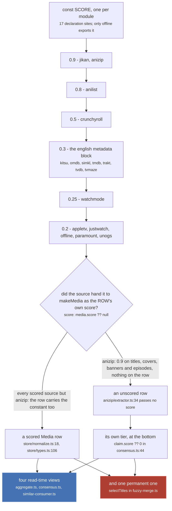
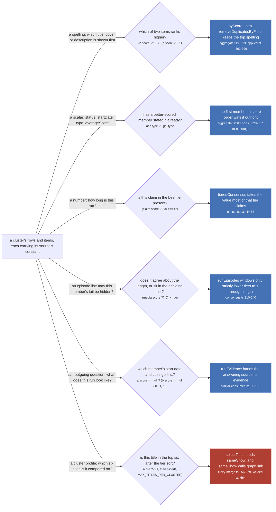
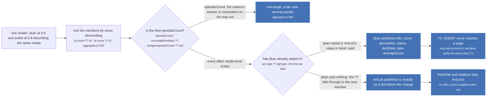

Nothing in the worker ever asks a source what it is worth. `ExtractorDefinition`
(`src/worker/extractor.ts:164-173`) has no field for a score, `makeExtractor` reads none, and no code
under `src/worker/` touches a module-level constant. What exists instead is a module-private
`const SCORE` in seventeen of the twenty-four built-in sources, threaded by hand into every
`makeMedia`, `makeEpisode`, title, cover, banner, description and thumbnail that source mints. The
store reads a number off each row and each item, and that number is the only thing separating a
static dump three weeks old from a live catalogue.

The seven sources with no `SCORE` at all are the six stub providers (disney, amazon, hulu, peacock,
hbo, fubo) and imdb. None of them calls `makeMedia` even once, so there is nothing to score.

## The scale

| score | sources | declared at |
| --- | --- | --- |
| `0.9` | jikan, anizip | `src/sources/jikan/extractor.ts:26`, `src/sources/anizip/extractor.ts:15` |
| `0.8` | anilist | `src/sources/anilist/extractor.ts:217` |
| `0.5` | crunchyroll | `src/sources/crunchyroll/extractor.ts:12` |
| `0.3` | kitsu, omdb, simkl, tmdb, trakt, tvdb, tvmaze | `kitsu:12`, `omdb:8`, `simkl:8`, `tmdb:11`, `trakt:7`, `tvdb:7`, `tvmaze:9` |
| `0.25` | watchmode | `src/sources/watchmode/extractor.ts:11` |
| `0.2` | appletv, justwatch, offline, paramount, unogs | `appletv:10`, `justwatch:12`, `offline/normalize.ts:31`, `paramount:9`, `unogs:8` |
| none | amazon, disney, fubo, hbo, hulu, imdb, peacock | they mint no media |

Two rows on that table are not what a summary of it would say.

**`offline` is at `0.2` and is not a streaming catalogue.** It is the bundled manami dump, and it is
the only source that exports its constant (`export const SCORE = 0.2`), because
`offline/extractor.ts` imports it from `offline/normalize.ts:31` across a module split. Its value is
argued for twice over, and the second half of the argument is the reason this page exists at all.

`src/sources/offline/normalize.ts:17-30`

> Low on purpose, and below kitsu's 0.3.
>
> The media-level score decides which source wins `status`, `startDate`, `episodeCount`, `type` and
> `averageScore`. This data is a static dump that can be weeks old, so on every one of those fields
> it is by construction staler than a live API and should lose. Nothing is given up by being low:
> the aggregate falls through with `??`, so a low-scored source still supplies any field no other
> source has.
>
> The same value is used for the per-item title and cover scores, and that part matters more than
> it looks. Titles at 0.9 would tie with anilist, jikan and anizip and push this dump's titles into
> the six-slot profile the fuzzy merge compares clusters on, changing which titles every merge
> decision sees. That is the exact mechanism behind the digit-residue regression that once welded
> 68 unrelated shows into one component.

**`anizip` is at `0.9` and its media row carries no score at all.** It stamps `SCORE` on its titles
(`anizip/extractor.ts:41-42`), its covers (`:46`), its banners (`:50`) and every field of every
episode (`:63-76`), and its `makeMedia` call at `:34` passes none. So the same source sits in the top
tier on one axis and in the bottom tier on another, in the same cluster, at the same time. Two
comments in the store point back at that gap by name, which is how you can tell it is a gap and not a
design.



*The whole scale, and the one branch in it: a per-item score and a per-row score are set at different
call sites, so a source can hold two different positions on the ladder at once.*

The score lands on a stored row at `src/worker/store/normalize.ts:18` as `score: media.score ?? null`
and is typed `score: number | null` at `src/worker/store/types.ts:106`. Nothing between the source and
the store validates it, clamps it, or notices that it is missing.

## What it decides

Five readers, not four, and they do not agree on what an absent score means.



*Five of the six branches are recomputed on every read and cost nothing to get wrong twice. The
sixth is a union-find union with no inverse.*

:::danger[The sixth branch is permanent]
`selectTitles` decides which six normalized titles a cluster is compared on. Those six are the only
thing `sameShow` reads about the titles, and a match there reaches
`linkSameMediaPairs([[uriA, uriB]])` at `src/worker/store/fuzzy-merge.ts:664`, which is a
`graph.link`: a union-find union, per label, with **no inverse**. Two clusters welded by a title that
made the cut stay welded for the session, and no later evidence unwelds them.

That is why the offline dump's score is the number it is. At `0.9` its titles would tie with jikan,
anilist and ani.zip and displace theirs from the six, "the exact mechanism behind the digit-residue
regression that once welded 68 unrelated shows into one component"
(`src/sources/offline/normalize.ts:25-29`).
:::

### Five sites, three readings of a missing number

Nothing normalises an absent score on the way in, so every reader decides for itself what one means,
and the five sites do not agree.

| site | absent reads as | consequence |
| --- | --- | --- |
| `byScore`, `aggregate.ts:19` | `-1` | an unscored item sorts below every real score, including a hypothetical `0` |
| the cluster sort, `aggregate.ts:319` | `0` | an unscored row ties with a `0`-scored one and sorts below `0.2` |
| `tieredConsensus`, `consensus.ts:44-45` | `0` | an unscored row is a claim at the bottom, and it wins outright when nobody else states a number |
| `selectTitles`, `fuzzy-merge.ts:262` | `-1` | an unscored title is its own tier under `0.2`, so it is dropped first when six is not enough |
| `runEvidence`, `similar-consumer.ts:160-163` | sorts last, explicitly | written as a comparator rather than a sentinel, so an unscored row can never sort above a `0`-scored one |

The two that matter are `?? 0` in `consensus.ts` and `?? -1` in `fuzzy-merge.ts`, and the code says
so at the site rather than leaving it to be inferred.

`src/worker/store/consensus.ts:42-43`

> an unscored row is its own tier at the bottom, which is where anizip's media rows sit until
> src/sources/anizip/extractor.ts passes a score to makeMedia

`src/worker/store/aggregate.ts:383-384`

> Measured over the 100 cluster snapshot in dist-seed on 2026-09-09: identical in 100 of 100,
> because `mal` is the only member of the 0.9 tier until anizip's media row carries a score.

That second measurement is the whole reason the gap is survivable today. `tieredConsensus` only
differs from the plain score-ordered reduce when the top tier disagrees with itself, and the top tier
currently has one member, because anizip's row is not in it.

### A spelling is not a number

`aggregate.ts` resolves nearly every field by taking the best-scored member's value and stopping.
`episodeCount` is the one field it refuses to resolve that way, and the argument is worth reading
whole.

`src/worker/store/consensus.ts:6-14`

> The store's other resolutions take the highest-scored source's value and stop (`acc.x ?? gql.x` over
> a score-sorted list), so one source outvotes any number of others however many agree with each
> other. That is right for a title, where sources are spelling the same thing differently and the
> best-scored spelling is simply the one to show. It is not enough for a NUMBER, where sources are
> making a claim about the world and two equals agreeing is evidence the first one alone is not.
>
> SO THE TIERS ARE LEXICOGRAPHIC, NEVER ADDITIVE. The best score present decides which claims are
> looked at; among those, the value the most of them claim wins; nothing below that tier is consulted
> at all. A source cannot be outvoted by any number of sources beneath it.

A sum was tried first, and the constants above are exactly what made it fail. Mushoku Tensei season 1
part 1, with the streaming tier echoing Crunchyroll's packaging (`consensus.ts:18-22`):

```text
24 scores cr 0.5 + jw 0.2 + nf 0.2 + appletv 0.2 + paramount 0.2 = 1.3
11 scores mal 0.9 + kitsu 0.3                                    = 1.2
```

The sum publishes the folded `24`, "which is the defect it was written to stop. Five catalogues
restating one packaging is one witness counted five times." Over the same 100-cluster snapshot the
sum was identical to the tier rule in 100 of 100 clusters, so it bought nothing and lost in exactly
the cases it was for. `tests/unit/worker/store/consensus.test.ts:52-57` pins the shape: twenty rows
at `0.3` claiming `22` cannot move one row at `0.8` claiming `12`.

The same cluster, as the tests hold it
(`tests/unit/worker/store/consensus.test.ts:92-98`):

```text
anizip:14758            score null   episodeCount 11
mal:39535               score 0.9    episodeCount 11
anilist:108465          score 0.8    episodeCount 11
kitsu:42323             score 0.3    episodeCount 11
cr:G24H1N3MP-G609CX3J4  score 0.5    episodeCount 24
```

`tier` is `0.9`, `length` is `11`, `equals` is `{mal}` alone, and Crunchyroll's rows 12 to 24 are
windowed off the page. Note that anizip, kitsu and anilist agree with `mal` and are never trimmed
regardless of their scores: what spares a member is agreeing about the length, not scoring well.
`consensus.ts:178-179`:

> An equal cannot be overruled: two 0.9 catalogues disagreeing is a disagreement, and the answer to
> one of those is to show what the tier's majority says, never to delete the dissenter's episodes.

## The 0.8 decision

AniList sat at `0.9` and was moved to `0.8` on 2026-08-18. Nothing else changed, and the effect is
entirely mechanical: one comparison in a sort flips, and jikan and ani.zip take every media-level
field AniList used to hold.



*Demoting a source removes nothing from the aggregate. It only decides who is asked first, and the
`??` chain asks everyone in turn until somebody answers.*

`src/sources/anilist/extractor.ts:203-216`

> One score for every field, deliberately BELOW jikan and anizip, which both sit at 0.9.
>
> Owner's call, 2026-08-18. Know what it does, because `byScore` in `store/aggregate.ts` sorts
> descending and the top source takes the field outright: wherever all three describe the same
> media, jikan and anizip now win the title, the cover, the description and every media-level
> field (`status`, `startDate`, `episodeCount`, `type`, `averageScore`). AniList still supplies
> anything neither of them has, because the aggregate falls through with `??`.
>
> That reverses an earlier deliberate change, and the reasoning it replaces is worth keeping:
> four constants used to disagree, with title, description and cover at 0.7 while a declared
> `THUMBNAIL_SCORE` of 0.9 was never referenced, so covers went out at 0.7 and lost to MyAnimeList
> and AniZip. The note then was that AniList has the best art of the three. If the art regressing
> is not wanted, the fix is not to raise this back to 0.9 but to score the cover separately.

The `TV_SHORT` branch in that figure is the clearest visible consequence, and the schema documents it
as a known subset rather than a bug. `src/worker/resolvers/media/schema.gql:8-12`:

> ONLY ANILIST EVER EMITS IT, and AniList loses `type` to jikan, which scores 0.9 against 0.8 and
> spells the same show TV. So a short jikan also carries profiles as TV in the aggregate and answers a
> TV filter rather than a TV_SHORT one. That is a known subset, not a bug to work around here: making
> it exact means changing which source wins `type`, and that precedence is what keeps a stale dump
> from overwriting a live catalogue (store/aggregate.ts:203, sources/offline/normalize.ts:19-31).

Two footnotes on the `episodeCount` branch. It is the only field in the whole aggregate whose value
does not come out of the reduce, and the docstring above it (`aggregate.ts:373-385`) says why the
reduce is not enough: cluster order is union-find component order, which is HTTP arrival order, so a
tier that disagrees with itself would answer differently between two loads of the same page. And when
`runLength` returns nothing, the reduce's answer is still there behind two `??`, so a cluster where
nobody publishes a count is left exactly as it was.

## What the score is not

`Media.score` is not the review rating. That is `averageScore`, a separate nullable field on the same
type, and it is one of the fields `score` decides the winner of.

The `score` sorted at `src/worker/resolvers/media/index.ts:150` is also not this one. It is a
per-query search relevance computed by `searchRelevance` against the aggregated titles, thrown away
after the sort, and it never touches a row.

A cluster's aggregate does publish a score of its own, `Math.max(...medias.map(m => m.score ?? 0))`
(`aggregate.ts:359`, and `:440` for an episode). Nothing reads it back. An aggregate is never a member
of another cluster, only two documents on the page select the field at all
(`src/router/home/index.tsx:23` and `src/router/search/index.tsx:29`; `MediaFragment` does not carry
it), and no component in `src/router/` or `src/components/` renders it. The per-TITLE score is the one
four documents ask for, and that one is only ever a sort key.

What the page does read is the ORDER the score produced. `handles` on an aggregate is
`sorted.map(...)` (`aggregate.ts:365`), so the handle list arrives score-descending, and the media
modal is written against exactly that, at `src/router/home/media-modal.tsx:772-775`:

> SAME_AS FIRST, then anything. `handles` is ordered by score, which says nothing about relation, so
> a plain `find` could hand the Crunchyroll icon a PART_OF `cr:<seriesId>` while the SAME_AS
> `cr:<seriesId>-<seasonId>` for this very cour sat later in the list.

Two smaller consumers worth knowing about, both driven by the same constants:

- `anomalies.ts:60-68` reports `lists more episodes than it is long` when a run's listed episode count
  exceeds `runLength(cluster)`, and prints how many of its sources agree on that length. The rule is
  pure and reports; it changes nothing.
- `runEvidence` (`similar-consumer.ts:166-176`) orders the cluster by score before reading
  `bestRunStartDate` off it, so the score decides which member's start date is handed to an answering
  source. It is only a tiebreak: `bestRunStartDate` (`src/sources/similar.ts:113-119`) prefers any
  day-precise date over a higher-scored `YYYY-01-01`, because "only a day can be measured against a
  45 day window".

## Where the code disagrees with the summary

Two corrections against the page inventory this site was written from, both settled by reading the
files:

- The inventory's scale reads "0.2 the streaming catalogues". `offline` is at `0.2` as well
  (`src/sources/offline/normalize.ts:31`) and is a bundled static dump, not a catalogue. The
  subsystem report's source table lists it as having no score, which is wrong in the other direction:
  it is applied at the media level at `offline/normalize.ts:164` and again at
  `offline/extractor.ts:172`.
- The inventory says the score decides four things. There are five readers of a stored `score` in
  `src/`: `aggregate.ts` (twice, on two different sentinels), `consensus.ts`, `fuzzy-merge.ts` and
  `similar-consumer.ts`. The fifth is the one that leaves the process, since it shapes the evidence a
  question carries to another source.
