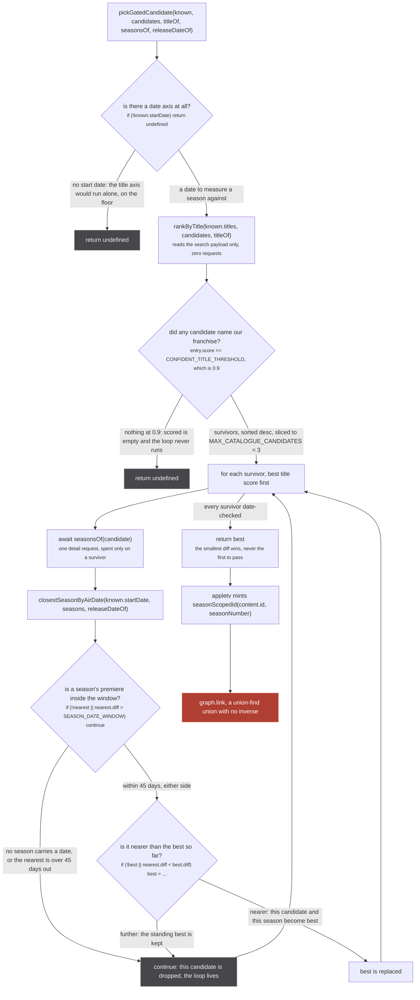
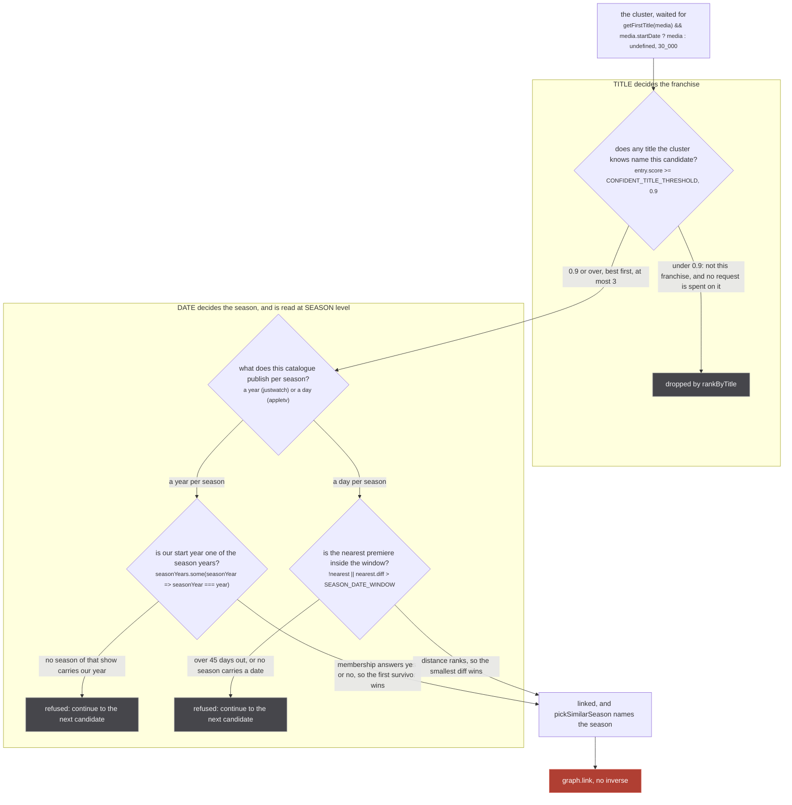
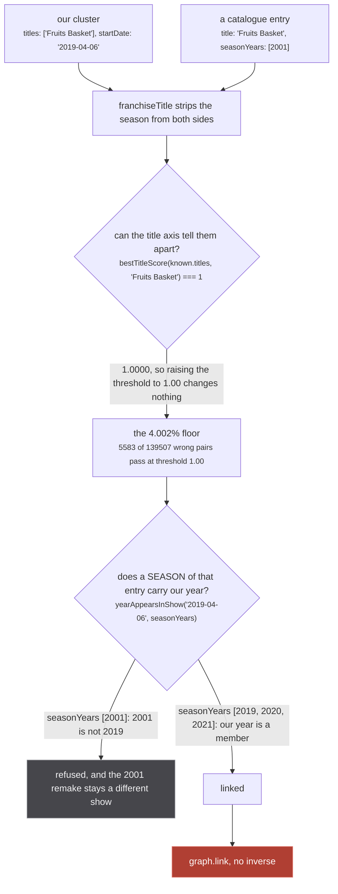
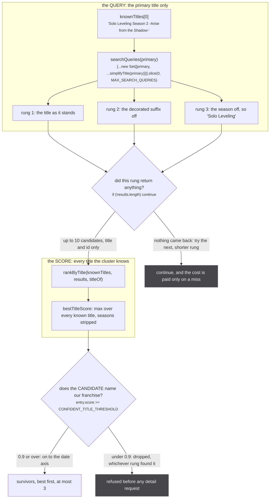

A source that already finds its own id inside the uri does not search. It reads the id and answers.
The gate on this page is for the other case: no `jw:` and no `appletv:` in the cluster's uri, so
nobody has ever named this show in that catalogue, and the source has to go look for it by title.

`src/sources/justwatch/extractor.ts:742`

> no `jw:` in the uri, so no source ever supplied one. Search, under the gate above.

Searching means asking a catalogue a free-text question over its whole library and getting back a
ranked list of shows that have nothing to do with each other. Linking the wrong one is not a bad row
that the next pass corrects. It is a union.

:::danger[A wrong link here has no inverse]
A search hit becomes a handle, and a `SAME_AS` handle becomes `graph.link(mediaUri, handleUri, ...)`
in `src/worker/store/db.ts:193`, which is a union-find union. There is no unlink. The two media stay
one component for the rest of the session, the merged component then goes on to weld a third, and
every episode and every play button under the cluster belongs to whichever show won.

`src/sources/catalogue-gate.ts:70-73`

> they are EXACTLY equal after season stripping, so no similarity number anywhere in the 0..1 range
> can refuse them. Those are sequels and remakes collapsed onto their parent, and a wrong link here
> is permanent: `graph.link` is a union-find union with no inverse, so the two shows stay welded for
> the session and the merged cluster then goes on to weld a third.
:::

The gate lives in `src/sources/catalogue-gate.ts`, in its own module.

`src/sources/catalogue-gate.ts:1-2`

> The gate a metadata catalogue's search hit must clear before it may be linked, mirroring the one
> crunchyroll/extractor.ts already ships. JustWatch and Apple TV both use it.

Three sources import from it and none of them import the same thing. Apple TV takes the whole
composition (`pickGatedCandidate, searchQueries`, `src/sources/appletv/extractor.ts:7`). JustWatch
takes the pieces and composes them itself (`rankByTitle, searchQueries, yearAppearsInShow`,
`src/sources/justwatch/extractor.ts:9`). Crunchyroll takes one constant
(`SEASON_DATE_WINDOW`, `src/sources/crunchyroll/extractor.ts:4`) and keeps its own copy of everything
else. The module is deliberately small so it can be tested at all:

`src/sources/catalogue-gate.ts:26-29`

> Split into its own module, importing only ./utils and ./season, so it can be tested: an extractor
> pulls in the player components and, through them, a CommonJS `require('react')` that no resolve
> alias intercepts, so no extractor can be imported under vitest. ./season.ts exists for the same
> reason.

## `pickGatedCandidate`, in order

This is Apple TV's whole gate, `src/sources/catalogue-gate.ts:277-295`, called at
`src/sources/appletv/extractor.ts:367-373`.

*Three of the four ways out are a refusal, and all three of them return `undefined` or `continue`: nothing on this path throws, and a refused source simply does not appear on the page.*

Two things about that order are load bearing, and the file says both.

The date check comes first because a gate with one axis is not a weaker gate, it is a different one
that admits a measured 4.002% of wrong pairs no matter what number you put on the title axis.
`src/sources/catalogue-gate.ts:284-285`, the comment sitting on the first line of the function body:

> no start date is no date axis, and a gate running on one axis is the 4.002% floor of permanent
> wrong links with nothing left to catch it

The title check comes before `seasonsOf` because `seasonsOf` is a network request per candidate and
the title axis needs nothing but the search payload that is already in hand.

`src/sources/catalogue-gate.ts:266-275`

> The order is load bearing and it is a cost decision as much as a correctness one: `rankByTitle` runs
> entirely on the search payload, so `seasonsOf` (a detail request, per candidate) is never spent on a
> candidate the title axis already refused.
>
> THE BEST WINS, NEVER THE FIRST TO PASS: see `rankByTitle` for what that was worth at Apple TV, which
> took whichever passing candidate the catalogue happened to list first. The ranking here is by DATE
> distance rather than by title score, and that is not a second opinion about the franchise: the title
> axis has already reduced every survivor to the same one, so the only question left is which season,
> and the diff is the only thing that answers it. Crunchyroll's search path resolves a tie the same
> way, over the same window.

The last sentence of that is the one claim on this page the code does not support: Crunchyroll shares
the window and **refuses** a tie rather than resolving it. See
[where the code disagrees](#where-the-code-disagrees-with-the-description).

`tests/unit/sources/catalogue-gate.test.ts:368-377` pins the cost claim rather than describing it: it
hands the gate a `Fate/Zero` candidate whose season premieres on exactly our date, and asserts that
`spent` contains only `umc.solo`. A candidate the title axis refused costs nothing at all.

And `tests/unit/sources/catalogue-gate.test.ts:356-364` pins "best, not first" by running the same two
candidates in both orders and demanding the same answer, because Apple's result order is not
reproducible and a gate whose verdict depends on it is a coin flip.

`src/sources/catalogue-gate.ts:130-135`

> Returning them ranked rather than returning the first over the line is worth more than the
> threshold move at Apple TV, which took whichever passing candidate the catalogue happened to list
> first. Measured over the media where both a correct and a wrong candidate clear the gate: at the
> shipped gate, 913 such media, of which taking the best welds 274 (30.011%) while taking the first
> welds 544.3 in expectation under a uniform ordering (59.618%) and 913 at worst. At this gate, 106
> such media, best welds 2 (1.887%) against 50.4 expected for first (47.519%).

## The two axes, and what each one decides

They measure different things and they are not interchangeable. The title says which **franchise**.
The date says which **season** of it. A gate is both of them agreeing.

*The two date shapes are not two opinions about the same question: a year can only answer yes or no, which is why JustWatch takes the first survivor and Apple TV ranks them.*

**The title axis reads every title the cluster knows, on both sides stripped of its season.**
`bestTitleScore` (`src/sources/utils.ts:335-346`) runs `franchiseTitle` over the candidate once and
over each known title, then takes the max. `franchiseTitle` (`src/sources/utils.ts:401-411`) is sacha's
name parser, wrapped in a try/catch because "the parser throws rather than declining on input it
cannot read, and a title it chokes on must cost that one comparison its season stripping, never the
whole match".

Both halves of that are separately load bearing, and `tests/unit/sources/catalogue-gate.test.ts:38-61`
measures each one against the gate that shipped before:

| pair | raw `titleSimilarity` | `bestTitleScore` |
| --- | --- | --- |
| `Solo Leveling Season 2 -Arise from the Shadow-` against `Solo Leveling` | 0.2513 | 1 |
| `Attack on Titan Season 3 Part 2` against `Attack on Titan` | 0.4370 | 1 |
| `Sousou no Frieren` against `Frieren: Beyond Journey's End` | refused at 0.50 | 1, off our second title |

**The date axis has to be read at season level or it refuses the exact links it exists to recover.**
A show-level year is the franchise's first season, so comparing our season 2 against it is comparing
2026 against 2024.

`src/sources/catalogue-gate.ts:168-175`

> Membership, not equality, and the distinction is the whole finding. A show-level year compares our
> season's start against the FRANCHISE's first season, so it refuses the season-to-parent links this
> gate exists to recover. Recall on the 4322 related-same-show pairs, the only arm where the date
> axis's cost is visible at all:
>
>     show-level same year          admits 16.543%
>     show-level adjacent quarter   admits  6.733%
>     season-level year membership  admits 93.221%

`src/sources/catalogue-gate.ts:182-184`

> Comparing our media's start date against JustWatch's `content.originalReleaseYear` would be the
> single most damaging way to build this, and it is also the obvious one, which is why it is written
> down here.

JustWatch's own date function is the one that has to resist that, and it does, with one exemption:

`src/sources/justwatch/extractor.ts:601-609`

> JustWatch exposes a year and nothing finer, and it exposes it at two levels. Only the SEASON level
> is usable: `node.content.originalReleaseYear` is the show's, which is the first season's, so
> comparing our start date against it refuses 83% of the season-to-parent links this gate exists to
> recover. The per-season years come back in the same NODE_QUERY response the gate already holds, so
> reading them at season level costs no extra request at all.
>
> A movie is the one entry with no seasons to read, and it also has no show-vs-season gap to fall
> into: its own release year IS the work's year, so the show-level field is the right one there and
> only there. A SERIES with no season years is a refusal, never a fallback to the show's year.

That is `datedLikeThisMedia` at `src/sources/justwatch/extractor.ts:611-615`, and the movie exemption
is the `!showRequiresSeason(node.objectType)` half of its last line, where `showRequiresSeason` is
`objectType !== 'MOVIE'` (`src/sources/justwatch/id.ts:35`).

Apple TV gets the finer axis because Apple publishes a real per-season day.
`SEASON_DATE_WINDOW = 45 * 24 * 60 * 60 * 1000` at `src/sources/catalogue-gate.ts:230`, and the units
are the sort of thing that fails silently:

`src/sources/catalogue-gate.ts:214-228`

> THE UNITS ARE EPOCH MILLISECONDS, established from the values rather than assumed, because a
> seconds-based field read as milliseconds lands in 1970 and no January 1 precision guard would catch
> it. `Severance` season 1 comes back as 1645142400000, which is 2022-02-18, its real premiere; as
> seconds it would be 1970-01-20. Re-derivable in one request:
>
>     curl -s 'https://uts-api.itunes.apple.com/uts/v3/shows/umc.cmc.1srk2goyh2q2zdxcx605w8vtx?caller=web&sf=143441&v=58&pfm=web&locale=en-US&utsk=0'
>
> which also shows season 2 at 1737072000000, 2025-01-17, against a show-level `content.releaseDate`
> of 1645142400000: the show's date IS season 1's.
>
> Measured 2026-08-29 over the 150 seasons of the 83 shows UTS search returns for 28 Apple TV series
> titles, one `/shows/<id>` plus one episode request per season: 0 seasons missing `seasonNumber`, 0
> missing `releaseDate`, and a season's `releaseDate` equalled the earliest release date among that
> season's OWN episodes on 150 of 150. The show-level date named the wrong year for 66 of the 150
> (44.000%), and for 66 of the 106 (62.264%) once single-season shows are dropped.

`Severance` is worth holding onto as the concrete case, because it is a real payload and it is in the
test file. Our start date `2025-01-17` against seasons `[1645142400000, 1737072000000]` picks season 2
at `diff: 0`. The same date against the show-level date alone puts the nearest season nearly three
years out and the window refuses it
(`tests/unit/sources/catalogue-gate.test.ts:240-253`). The window is inclusive and symmetric: 45 days
passes, 46 does not, and minus 45 is the same distance as plus 45
(`tests/unit/sources/catalogue-gate.test.ts:267-276`).

Both date functions refuse rather than guess, and that is stated where each one is defined.
`closestSeasonByAirDate` returns `undefined` for no parsable start date, no seasons, or no season
carrying a date, rather than a nearest-of-nothing (`src/sources/catalogue-gate.ts:240-241`).
`yearAppearsInShow` returns `false` for no start date, no season years, or every season year null
(`src/sources/catalogue-gate.ts:191-192`). `parseDate` (`:158-162`) is the one place that decides what
counts as a date: `null`, `undefined` and `''` are not dates, and neither is anything `new Date(value)`
turns into `NaN`.

## The calibration, and the floor under it

Every number here comes from `npm run calibrate` over the whole manami anime-offline-database:
243194 correct-match pairs built from record synonyms, 139507 wrong-match pairs built from
relatedAnime, run through these exact exported functions, full uncapped populations
(`src/sources/catalogue-gate.ts:44-52`).

| gate | recall | wrong links passed |
| --- | --- | --- |
| what JustWatch shipped before: first title only, raw, 0.50 | 28.085% | 28.793% |
| whole title list plus `franchiseTitle`, no date, 0.90 | 35.175% | 5.116% |
| the same, plus the season-level date axis (JustWatch, 0.90) | 34.702% | 1.062% |
| the same, plus a 45 day window (Apple TV, 0.90, MODELLED) | 34.408% | 0.848% |

Read down the second column and the shape of the argument is there: the date axis is worth 4.8 points
of wrong links at unchanged recall, and against what shipped it is a 27x reduction in wrong links with
recall going **up** (`src/sources/catalogue-gate.ts:65-66`).

The last row is not a measurement of Apple TV, and the file is emphatic about it.

`src/sources/catalogue-gate.ts:54-60`

> THE APPLE TV ROW IS A MODEL OF A CATALOGUE, NOT A MEASUREMENT OF APPLE'S. Every row here is computed
> over the manami corpus, which is the right way to compare the two axes against each other and says
> nothing about what a given catalogue actually returns. Measured against the UTS search endpoint this
> extractor really queries, 2026-08-30: 0 of 150 anime TV titles and 0 of 120 anime films produced ANY
> candidate clearing 0.90, while 88 and 69 of them returned items at all, and a positive control
> ("Severance") is admitted at 1.0000. So the gate is live and correct and Apple's search simply does
> not surface these shows under these titles.

Now the number that decides whether the date axis is optional.

`src/sources/catalogue-gate.ts:68-71`

> THE FLOOR IS WHY THE DATE AXIS IS NOT OPTIONAL, and it is the number to read before anyone
> "simplifies" it away. With the title axis alone, 5583 of the 139507 wrong pairs (4.002%) pass at
> threshold 1.00: they are EXACTLY equal after season stripping, so no similarity number anywhere in
> the 0..1 range can refuse them.

| date axis | floor | removes |
| --- | --- | --- |
| season-level year membership (JustWatch) | 4.002% to 0.825% | 4432 of 5583 |
| season-level 45 day window (Apple TV) | 4.002% to 0.695% | 4614 of 5583 |

The 2001 and 2019 *Fruits Basket* are one of those 5583 pairs, and they are the case to picture, because
neither is a near miss: after `franchiseTitle` the two strings are the same string.

*Both branches of the date decision are pinned in `tests/unit/sources/catalogue-gate.test.ts:160-166` and again, in Apple TV's shape, at `:338-346`.*

The threshold itself is `CONFIDENT_TITLE_THRESHOLD = 0.9` at `src/sources/catalogue-gate.ts:98`, and
it is 0.9 only because the date axis is underneath it.

`src/sources/catalogue-gate.ts:83-87`

> WHY 0.90 AND NOT 0.50. Raising it to 0.94 refuses 208 more wrong links and costs 13046 correct ones,
> a ratio of 0.016 against this repo's own exchange-rate bar of 1.0. Lowering it to 0.85 leaves 714
> wrong links above the floor against 331 at 0.90, so the marginal safety per step collapses right
> around 0.90. 0.90 is safe ONLY because the date axis is there: the same 0.90 without it sits at
> 5.116%.

The move from 0.50 to 0.90 has a named cost, recorded rather than summarised.

`src/sources/catalogue-gate.ts:89-96`

> KNOWN REGRESSION, named rather than summarised. Moving from 0.50 to 0.90 costs 29665 links across
> the whole correct arm while recovering 46042, net +16377. Only 251 of the losses are season-to-show
> pairs; the rest are near-miss spelling variants scoring in [0.50, 0.90), mostly diacritics and
> punctuation ("!NVADE SHOW!" against "Invade Show!" at 0.8800). One is worth naming because it
> passes today and does not here: "Ace of the Diamond act II" against "Ace of Diamond" scores 0.5114
> both before and after, because sacha does not read "act II" as a season marker so `franchiseTitle`
> returns the string unchanged. Fixing that belongs in SEASON_MARKER and sacha's coverage, not in
> holding this threshold down.

That regression is a test, not a note: `tests/unit/sources/catalogue-gate.test.ts:89-94` asserts
0.5114 both ways, asserts the old gate accepted it, and asserts this one does not.

## The query is not the evidence

The two title paths on this page look like one and are not. The **query** is built from the cluster's
primary title alone, shortened rung by rung until the catalogue returns something. The **score** is
against every title the cluster knows. Which rung found a candidate is not evidence about the
candidate.

*The rungs and the scoring never touch: a rung is how the catalogue is made to answer at all, and the score is the only thing that decides whether the answer is ours.*

`src/sources/catalogue-gate.ts:115-121`

> Deliberately built from the cluster's PRIMARY title only, while the title axis below scores against
> every title the cluster knows. The two are separate on purpose: a shorter query is how a catalogue
> is made to return the entry at all, and which rung found a candidate says nothing about whether the
> candidate is the right show. Scoring the rung instead of the cluster is what both of these sources
> did before, and it measured 0.0765 margin against 0.0971 for scoring the original, so the rung was
> actively worse than doing nothing.

Read the cap exactly: `MAX_SEARCH_QUERIES = 4` (`src/sources/catalogue-gate.ts:110`) counts the primary
title itself, because `searchQueries` puts it at the head of the set before slicing
(`:122-123`). So at most **three** simplified rungs are ever tried, and a title with nothing to strip
is its own only query (`tests/unit/sources/catalogue-gate.test.ts:213-215`).

The rungs come from `simplifyTitle` (`src/sources/utils.ts:431-442`), which applies four cumulative
steps in order: the decorated suffix, the season marker, the articles, everything before a colon. Each
rung is strictly shorter than the one above it, and a rung under three characters or already seen is
skipped. Its own comment names the two links it recovers, measured over 68 live unOGS queries with no
other result changing: `Solo Leveling Season 2 -Arise from the Shadow-` reaching Netflix's
`Solo Leveling`, and `Ace of the Diamond act II -Second Season-` reaching `Ace of Diamond`.

Both consumers pay for a rung only on a miss, because both loops return on the first query that
produces a link. JustWatch asks for `first: 10` per rung (`src/sources/justwatch/extractor.ts:238`)
and the title axis then reduces those ten to at most three before a single detail request is spent.

## What the gate never sees

Everything above happens after the cluster has a title **and** a date, and that wait is its own
refusal. Both search paths call `waitForMedia` with a probe demanding both fields and a 30 second
deadline (`src/sources/justwatch/extractor.ts:637-646`,
`src/sources/appletv/extractor.ts:334-343`), then refuse again on the next line if the date is still
missing. The probe used to ask for a title alone, and then the gate two lines later refused for want
of a date, so whenever the title landed one tick earlier than the date the source gave up permanently
and never linked.

The gate's own residue is stated at the top of the file, where it can be read before anyone assumes
season scoping closed the problem.

:::caution[Season scoping bounds the wrong-weld class, it does not eliminate it]
`src/sources/catalogue-gate.ts:17-23`

> WHAT SEASON SCOPING BOUNDS BUT DOES NOT ELIMINATE. Two of our clusters that both clear the title
> axis and both fall within the date window of the SAME catalogue season still receive the identical
> season-scoped id, and union-find welds them at upsert. That is a handle link, so none of the season
> mechanisms in worker/store/fuzzy-merge.ts is consulted, exactly as before; what changed is the size
> of the class, from "every season of a show" to "two clusters inside one 45 day window of one
> season". It is the residue of matching a season cluster to a catalogue that models shows, and it
> cannot be closed here: the gate has one candidate and no view of the other cluster.

The precondition that made even that much possible is the season-scoped id, and the same block records
what happened without one: Apple TV minted `id: content.id`, two Mushoku Tensei clusters three years
apart were handed the same `appletv:<id>`, and the real store came back with them as one component.
Adding `appletv` to `SHOW_LEVEL_ORIGINS` does not help, because `src/worker/store/db.ts` tests the
handle side only and Apple TV emits itself as the `mediaUri`. See
[season-scoped ids](/sources/season-ids/).
:::

## Where the code disagrees with the description

**JustWatch does not call `pickGatedCandidate`.** It composes the two axes by hand
(`src/sources/justwatch/extractor.ts:680-711`): `rankByTitle` at `:687`, then a loop over the survivors
that spends a detail request each and calls `datedLikeThisMedia` at `:698`, returning the **first**
survivor that passes rather than the best. That is not an oversight, and the code says why on the two
lines above the loop: a year membership answers yes or no, so there is no distance to rank on, and
`scored` is already ordered by title score. So "the best wins, never the first to pass" describes
Apple TV's path, and on JustWatch's path the ranking that decides is the title score.

**Crunchyroll refuses a tie where this gate resolves one.** `src/sources/catalogue-gate.ts:274-275`
ends "Crunchyroll's search path resolves a tie the same way, over the same window". The window really
is shared, imported at `src/sources/crunchyroll/extractor.ts:4`. The tie-break is not. Crunchyroll's
search walks the title-ranked series and `break`s on the first one that produces a verdict at all
(`src/sources/crunchyroll/extractor.ts:515-522`), and the verdict comes from `pickSimilarSeason`,
whose date rule is `if (within.length !== 1 || foldVetoed(evidence, within[0]!)) return undefined`
(`src/sources/similar.ts:190`). Two candidate seasons inside the same 45 days is a **refusal** there,
where `pickGatedCandidate` takes the nearer of the two. Same constant, opposite answer, and the
refusing one is deliberate: two seasons inside one window is what two parts of a split cour released
together look like.

**Crunchyroll mirrors the constants by copying them, not by importing them.** The module header says
"Same shape, same constants and the same threshold as crunchyroll/extractor.ts, because it is the same
scale computed by the same function and this whole calibration exists because one threshold drifted
out of step with another at a different call site" (`src/sources/catalogue-gate.ts:34-36`). In the code
Crunchyroll imports only `SEASON_DATE_WINDOW` (`src/sources/crunchyroll/extractor.ts:4`) and declares
its own `CONFIDENT_TITLE_THRESHOLD = 0.9` at `:366`, `MAX_SERIES_CANDIDATES = 3` at `:369` and
`MAX_SEARCH_QUERIES = 4` at `:370`, and re-implements the filter, sort and slice inline at `:482-484`.
The three numbers agree today. Nothing makes them agree tomorrow, which is exactly the drift the
header says the calibration exists because of.

**The header's own sentence is cut in half.** `src/sources/catalogue-gate.ts:15-16` ends "they are the
numbers this change", the `WHAT SEASON SCOPING BOUNDS` paragraph runs at `:17-23`, and `:24` is the
rest of the sentence: "is judged against." Nothing reads a comment, so nothing breaks, but read the
block as two paragraphs with one sentence spliced around the second.

Crunchyroll's version of this gate is worth reading beside it, because it is the same two axes stated
in fewer words and it carries the exchange rate the whole page is an application of.

`src/sources/crunchyroll/extractor.ts:361-364`

> Anything missing is a refusal, never a guess: no start date, no titles, nothing over the threshold,
> or nothing inside the window, and this returns undefined and Crunchyroll simply does not appear.
> That is the correct trade. A missing row is a nuisance; a wrong row is a lie about what the user is
> about to watch, and it is not recoverable without a reload.
