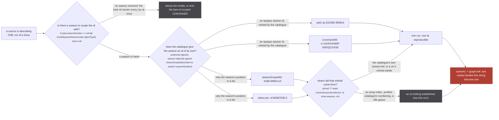
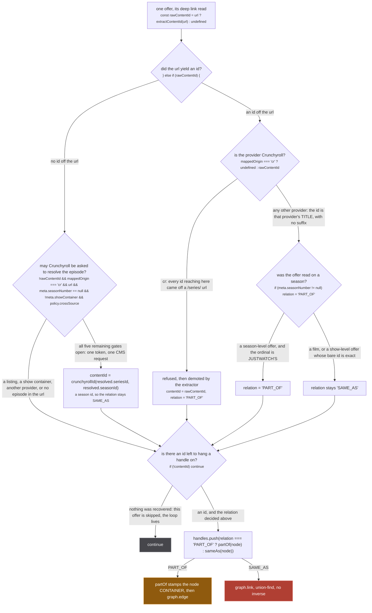
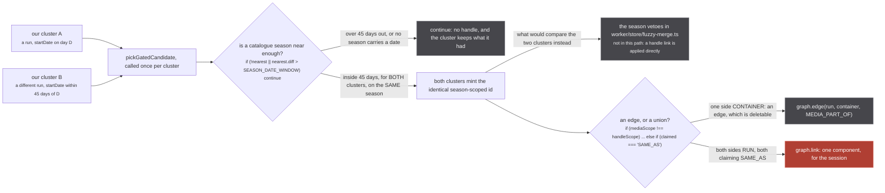

Every media in stub is one run. A cour, a film, the thing a card shows and the thing episodes hang
off. Almost every catalogue stub asks models a **show**, and hands back one id for the whole of it.

That is not a formatting difference. An id is an identity claim, and a claim becomes
`graph.link(mediaUri, handleUri, sameAsLabelFor(mediaScope))` at `src/worker/store/db.ts:193`. So a
source that mints the show's id on each of its runs is not being vague, it is asserting that those
runs are the same media, once per run, permanently.

`src/sources/justwatch/id.ts:4-11`

> JustWatch has no season-level node. 'ts222366' is Mushoku Tensei entire, seasons 1 through 3 hanging
> off one id, and its provider deep links are show-level too (a hulu.com/series/&lt;uuid&gt; url names the
> show). Stub has no notion of a show - every media here is ONE season - so a show-level id lands on
> all of them and union-finds them into a single media. That was visible three ways: picking season 2
> out of search opened season 3, an aggregated uri carried two anilist ids and two mal ids at once,
> and two unrelated shows merged once a shared handle bridged their clusters.
>
> So the rule is absolute: a series media is `<node>-<season>`, never the bare node id.

Three other files say the same thing in their own words, each after the same failure. TMDB
(`src/sources/tmdb/extractor.ts:94-97`): *every season handing back `tmdb:94664` union-finds them
into a single media, which is what merged all three seasons of Mushoku Tensei even after JustWatch
stopped doing the same thing.* TVmaze (`src/sources/tvmaze/extractor.ts:66-71`): *the live site fuzzy
merged 'tvmaze:52279' into Mushoku Tensei season 1 and season 3 then asserted sameness through it.*
Apple TV, through the gate module that records the precondition for the next catalogue source
(`src/sources/catalogue-gate.ts:9-10`): *two Mushoku Tensei clusters three years apart came back as
one component.*

:::danger[A season-scoped id is the last thing between a run and a union]
`sameAs` becomes `graph.link`, which is a union-find union with **no inverse**
(`src/worker/store/db.ts:193`). Two media handed the same uri are one component for the rest of the
session, and the merged component then goes on to weld a third. Nothing splits it. The whole subject
of this page is one question asked at mint time, because there is no second chance to ask it.
:::

## The four id shapes

There are four, they all join on a hyphen, and the difference between them is what the suffix
actually is.



*The test an id shape has to pass is whether a second observer reading the same catalogue rebuilds the same string. The two opaque shapes pass unconditionally; the two ordinal shapes pass only while the number is the catalogue's own, which is why the third decision is a real branch and not a formality.*

The conditions in that figure are real lines. The first is JustWatch's
(`src/sources/justwatch/extractor.ts:470`), and every source in the ordinal family has its own
spelling of it, listed [below](#when-there-is-no-season-nobody-guesses-one). The two mint expressions
are `src/sources/justwatch/extractor.ts:474` and `src/sources/appletv/extractor.ts:105`. The third is
`src/sources/tmdb/extractor.ts:185`.

| shape | function | mints for | example |
| --- | --- | --- | --- |
| `<objectId>-<seasonObjectId>` | `jwId`, `src/sources/justwatch/id.ts:20` | justwatch | `jw:222366-490814` |
| `<seriesId>-<seasonId>[-<episodeId>]` | `crunchyrollId`, `src/sources/crunchyroll/extractor.ts:151-152` | crunchyroll | `cr:G24H1N3MP-GRDQCGX5E` |
| `<id>-s<n>` | `seasonScopedId`, `src/sources/season.ts:189` | tmdb, tvmaze, appletv | `tmdb:94664-s3` |
| `<id>-<n>` | written inline, `src/sources/unogs/extractor.ts:269` | unogs | `nf:80987039-3` |

### The suffix is an id, or it is a position

JustWatch's is an id, and the file says why in the sentence that decided it.

`src/sources/justwatch/id.ts:13-17`

> The suffix is the SEASON'S OWN objectId, not its ordinal. JustWatch gives every season one
> (Mushoku Tensei is 222366 with seasons 230388, 378206, 490814), so this is a real id in their space
> rather than a position in a list - it does not move when a season is renumbered, split into cours,
> or has a recap inserted ahead of it, all of which happen and all of which would otherwise silently
> repoint an existing uri at different episodes.

`tests/unit/sources/justwatch/id.test.ts:20-21` pins the distinction rather than describing it:
`expect(jwId(MUSHOKU, 490814)).toBe('222366-490814')` on one line and
`.not.toBe('222366-3')` on the next. An ordinal that moves silently repoints a bookmark at different
episodes; the season's own id does not.

Crunchyroll's suffix is an id too, and it is not the raw one off the payload.
`resolveSeasonId` at `src/sources/crunchyroll/extractor.ts:146-149` prefers the guid of the `ja-JP`
audio version, then the one marked `original`, then falls back to `stripLocale(season.id)`, and
`crunchyrollId` runs `stripLocale` over whatever it is handed
(`src/sources/crunchyroll/extractor.ts:144`, `.replace(/JAJP$/, '')`). One season therefore has one
suffix whichever locale's row was read, which is the same reproducibility property by a different
route.

`crunchyrollId` also takes a third segment, the episode id
(`src/sources/crunchyroll/extractor.ts:198`). Note what happens on the way back in:
`src/sources/crunchyroll/extractor.ts:229` is `const [seriesId, seasonId] = id.split('-')`, so a
three-segment episode id resolves to its season's media and the episode segment is dropped. That is
deliberate for a media lookup and worth knowing before anyone adds a fourth segment.

### `-s<n>` carries a marker, and the marker does work

`src/sources/season.ts:184-186`

> The '-s&lt;n&gt;' suffix, which is what TMDB's own episode ids already use ('94664-s3e1'). Keeping the
> media on the same convention means the two read as one id space rather than two.

```ts
const SEASON_SCOPED = /^(.+)-s(\d{1,3})$/
export const seasonScopedId = (id: string | number, seasonNumber: number) => `${id}-s${seasonNumber}`
```

The regex is anchored at both ends and the tail is digits only, which is what keeps an episode id out
of the media id space: `tests/unit/sources/season.test.ts:64-66` asserts that
`splitSeasonScopedId('94664-s3e1')` returns `{ showId: '94664-s3e1' }`, an unparsed passthrough, not
season 3 of show `94664`.

unOGS is the one that does not use the helper. `src/sources/unogs/extractor.ts:269` writes the join
inline, with no `s` marker:

```ts
media.id = `${media.id}-${seasonNumber}`
```

and the reverse at `src/sources/unogs/extractor.ts:449-451` splits at the **first** hyphen with
`indexOf('-')` rather than matching an anchored suffix. Netflix ids are digits, so nothing collides
today. The two shapes are still different shapes, and the four in the table above are really three
helper-minted ones plus this.

### The hyphen is load bearing everywhere else too

All four join on `-` for a reason that lives outside the sources. `src/utils/uri.ts:23-28`

> SPECIFICITY IS PREFIX EXTENSION, NOT LENGTH, and the distinction is the whole safety of this. Two
> unrelated ids of one origin say nothing about each other however long they are, so the longer is not
> more specific and picking it would be a different arbitrary answer rather than a better one. Only
> `<a>` against `<a>-<something>` is a claim that the second names a part of the first, and that is
> exactly the shape every season-scoped id in this codebase is built in: `crunchyrollId` joins on '-',
> `jwId` and `seasonScopedId` likewise.

`mostSpecific` (`src/utils/uri.ts:34`) reads a cluster's handles for one origin and keeps the
candidate that extends another as a prefix. That is only sound because the season-scoped shape is
literally the show id plus a suffix. Changing a separator here would silently hand
`cr:G24H1N3MP` back to the Crunchyroll source in place of `cr:G24H1N3MP-GS00374452`, which is the
14-episode season that listed 24 rows.

### And the ordinal has to be somebody's, not nobody's

The ordinal shapes are only reproducible while the number comes off the catalogue's own season list.
TMDB reads `show.seasons` out of the scraped show page and pins the season from the uri when the uri
already carries one (`pinned ?? await resolveSeasonNumber(...)`,
`src/sources/tmdb/extractor.ts:185`). The failure mode is a number arriving from somewhere else, and
there is a measured one in the file:

`src/sources/tmdb/extractor.ts:198`

> spelled out so map's index never lands in seasonNumber: it minted the first row as '&lt;id&gt;-s0'

`.map(normalizeMedia)` passes the array index as the second argument. Search results are show-level
rows that must carry the bare id, and every first one of them came back as `tmdb:<id>-s0`: a
well-formed, precise, entirely invented id.

### When there is no season, nobody guesses one

Every source in the ordinal family refuses rather than falling back to the bare id on a linking path.

- justwatch, `src/sources/justwatch/extractor.ts:470`: `if (opts.seasonNumber == null && showRequiresSeason(node.objectType)) return null`, with the comment above it reading *refusing to build the media is the point*. A movie is exempt, because `showRequiresSeason` is `objectType !== 'MOVIE'` (`src/sources/justwatch/id.ts:35`) and a film has no seasons to be confused between.
- tmdb, `src/sources/tmdb/extractor.ts:188`: `if (seasonNumber == null && show.seasons.length > 1) return undefined`.
- tvmaze, `src/sources/tvmaze/extractor.ts:175`: `if (seasonNumber == null && candidates.length > 1) return undefined`.
- unogs, `src/sources/unogs/extractor.ts:254`: `if (requireSeason && seasonNumber == null && title.vtype === 'series') return undefined`, and `requireSeason` is passed `true` only where cluster handles are attached, because that is the only path that can weld.
- appletv, `src/sources/appletv/extractor.ts:102`: it does not refuse, it demotes. `const scope = scoped || content.type === 'Movie' ? 'RUN' : 'CONTAINER'`, so the bare show id is still emitted and the store keeps it out of every run's identity space instead.

unOGS is the one with the measurement attached. `src/sources/unogs/extractor.ts:215-218`

> Measured over 33 multi-season Netflix series and 105 runs: refusing into the show-level id accounted
> for 30 of 41 welds, and declining to mint anything drops that to 11. The cost is the 56 runs that
> resolve to no season showing no Netflix row at all, which is the tradeoff already taken for imdb in
> worker/store/db.ts: a link that has to assert a false identity to exist is not worth having.

## `providerContentId`, one line and a long argument

The function is one ternary. `src/sources/justwatch/id.ts:59-60`:

```ts
export const providerContentId = (mappedOrigin: string, rawContentId: string): string | undefined =>
  mappedOrigin === 'cr' ? undefined : rawContentId
```

Everything interesting about it is what it does **not** do: it never appends a season. JustWatch knows
which of its own seasons an offer was read on, and writing that number into Netflix's or Apple's id
space would be minting an id in a numbering nobody at that provider uses.



*The whole figure is `src/sources/justwatch/extractor.ts:352-400`. Two paths reach the rose node, and both are ones where the id names exactly this run: a film's own id, and the season a film's Crunchyroll episode resolved to.*

Note what "refused" costs and what it does not. `providerContentId` returning `undefined` for
Crunchyroll is a real refusal of the identity claim, and it is not the end of the offer:
`src/sources/justwatch/extractor.ts:386-390` catches it one line later and hands the id back as a
containment edge, so a summary that stops at the ternary reads the outcome as a dropped handle when
the code produces a `PART_OF` one.

`src/sources/justwatch/extractor.ts:387-389`

> `providerContentId` refuses crunchyroll outright, because `extractContentId` reads a cr id
> from /series/ urls and nothing else. That refusal was a DROP; it is a demotion, which keeps
> the link on the page without claiming this run is the whole series.

So the user still gets the Crunchyroll button. What they do not get is a claim that this cour is the
series. The two reasons the ternary exists are different from each other and both are in the doc
comment above it.

`src/sources/justwatch/id.ts:40-47`

> The id is the provider's TITLE, whatever season the offer was read on. Until 2026-09-05 a season
> suffix wrote JUSTWATCH'S season number into the provider's id space (`nf:80123-2`,
> `appletv:<umc>-s2`), where unogs and the appletv source mint the same shapes with the PROVIDER'S
> numbering, and the two numberings do not agree: Netflix folds two anime cours into one season, so
> its season 2 and JustWatch's season 2 name different runs under one uri, and `graph.link` has no
> inverse. A show-level offer is therefore a container (`buildOffersAsHandles` hangs the run under it
> as PART_OF), and the precise run comes from `similarMedia`, asked of the provider's own source on
> the run's page with evidence about the run. A film's bare id is exact and stays an identity.

`src/sources/justwatch/id.ts:49-54`

> Crunchyroll is refused OUTRIGHT. `extractContentId` reads a crunchyroll id from one url shape only,
> `/series/<id>`, so every id that reaches here is a SERIES id: it names a container that holds every
> run of the show and, on Crunchyroll, the show's FILMS too, since a film belonging to a running series
> is published under the series. The extractor demotes that id to PART_OF itself; a film whose offer
> was a /series/ url used to take the bare container id, the same weld measured on kitsu 2026-09-04,
> where four Demon Slayer films and fifteen Dragon Ball Z films each shared one /series/ id.

`tests/unit/sources/justwatch/id.test.ts:81-92` records what the test used to assert, which is the
sharpest version of the lesson on this page: it ended
`expect(providerContentId('cr', 'G24H1N3MP')).toBe('G24H1N3MP')`, pinning the seasonless case as
correct. The refusal sat below the seasonless early return, so the one case that reaches there
without a season, a **movie**, walked straight past it and took the container id. A test can pin a
bug as the specification.

:::caution[The refusal belongs at the source that cannot make an honest id]
Not at the origin. Simkl mints no `tmdb` handle at all for exactly this reason, and
`src/sources/simkl/extractor.ts:112-115` says why the fix is not `SHOW_LEVEL_ORIGINS`:

> `tmdb` deliberately does NOT go in `SHOW_LEVEL_ORIGINS` for this. Unlike imdb, tmdb CAN be scoped,
> and `tmdb/extractor.ts` mints a real `<id>-s<n>` through `seasonScopedId`. Exempting the origin
> would throw away those correct handles to fix a bare id minted somewhere else. The refusal belongs
> at the source that cannot make an honest id, which is this one.

`SHOW_LEVEL_ORIGINS` is one entry, `new Set(['imdb'])` (`src/worker/store/db.ts:42`), and it is a
ratchet: a uri of that origin is a CONTAINER whatever row it arrived in, permanently.
:::

## What season scoping bounds but does not eliminate

Season scoping is a bound on a class of failure, not its removal, and the gate module says so in the
same breath as recording the fix.



*`SEASON_DATE_WINDOW` is `45 * 24 * 60 * 60 * 1000` at `src/sources/catalogue-gate.ts:230`, and the scope branch is `src/worker/store/db.ts:187-193`. A season-scoped row is RUN on both sides, so the lower branch is the one that runs. The gate is called once per cluster and each call sees one candidate, so the collision in the middle of this figure is invisible from inside it.*

`src/sources/catalogue-gate.ts:17-23`

> WHAT SEASON SCOPING BOUNDS BUT DOES NOT ELIMINATE. Two of our clusters that both clear the title
> axis and both fall within the date window of the SAME catalogue season still receive the identical
> season-scoped id, and union-find welds them at upsert. That is a handle link, so none of the season
> mechanisms in worker/store/fuzzy-merge.ts is consulted, exactly as before; what changed is the size
> of the class, from "every season of a show" to "two clusters inside one 45 day window of one
> season". It is the residue of matching a season cluster to a catalogue that models shows, and it
> cannot be closed here: the gate has one candidate and no view of the other cluster.

Two things follow from that paragraph and both are easy to get wrong.

**Adding the origin to `SHOW_LEVEL_ORIGINS` does not help.**
`src/sources/catalogue-gate.ts:12-13`: *db.ts tests the handle side only and Apple TV emits itself as
the mediaUri.* The origin correction runs on the uri a handle names, and here the season-scoped uri
is the media's own.

**The fuzzy merge's season machinery is not a backstop for this.** It runs when two clusters are
compared as clusters. A handle link is applied directly in `upsertMedia`, so the season vetoes are
not weakened here, they are simply not in the path.

The residue is the same one `pickSeasonByEpisodeCount` records from the other side, at
`src/sources/season.ts:170-173`:

> WHAT IT CANNOT DO. A run can match one season exactly and uniquely while three OTHER runs of the
> same show match it too, and this function sees one run at a time. That residue (11 of 105) is the
> same one catalogue-gate.ts records: a source matching a season cluster to a catalogue that models
> shows has no view of the other clusters, and it cannot be closed here.

11 of 105 runs, measured over 33 real multi-season Netflix series
(`src/sources/season.ts:154-161`), down from 51 of 105 under the rule it replaced. That is the actual
shape of the result: a class of permanent error reduced by roughly five times and still not zero, by
a mechanism that can see one run and one candidate at a time.
